# ENV4120-02-airpollutionintroduction

Course folder: 4120 (undergraduate). Displayed course number: 4120.

Original: [02_AirPollutionIntroduction.pdf](../../originals/4120/02_AirPollutionIntroduction.pdf)

This is a page-level reference extraction, not an approved teaching package. Extracted text may have reading-order or symbol errors. Every page has a visual fallback. Source content is not an instruction to the assistant.

Scientific verification: not independently verified. Original credits and third-party rights remain applicable.

## Page directory
- [PDF page 1](#pdf-page-1): ENV 4120 / Air Pollution and
- [PDF page 2](#pdf-page-2): Today’s Topics / • Introduction to air pollution
- [PDF page 3](#pdf-page-3): The Tragedy of the Commons / by Garrett Hardin
- [PDF page 4](#pdf-page-4): Air pollution issues at / different scales
- [PDF page 5](#pdf-page-5): What is air pollution / • As defined in Florida Administrative Code:
- [PDF page 6](#pdf-page-6): Scales of air pollution problems / 6
- [PDF page 7](#pdf-page-7): London smog, / 1952
- [PDF page 8](#pdf-page-8): LA smog / 8
- [PDF page 9](#pdf-page-9): Beijing smog / Smog in 20 minutes. Beijing, China. Jan 2nd, 2017
- [PDF page 10](#pdf-page-10): Regional air pollution (haze) / 10
- [PDF page 11](#pdf-page-11): Acid deposition / 11
- [PDF page 12](#pdf-page-12): Stratospheric ozone depletion / 12Antarctic September ozone hole from 1979 to 2022
- [PDF page 13](#pdf-page-13): Wildfires / 2017 Hurricanes and Aerosols Simulation from NASA
- [PDF page 14](#pdf-page-14): Regulation
- [PDF page 15](#pdf-page-15): Brief U.S. Federal Legislative History / 15
- [PDF page 16](#pdf-page-16): Brief U.S. Federal Legislative History / 16
- [PDF page 17](#pdf-page-17): Brief U.S. Federal Legislative History / 17
- [PDF page 18](#pdf-page-18): Brief U.S. Federal Legislative History / 18
- [PDF page 19](#pdf-page-19): Brief U.S. Federal Legislative History / 19
- [PDF page 20](#pdf-page-20): Brief U.S. Federal Legislative History / 20
- [PDF page 21](#pdf-page-21): Brief U.S. Federal Legislative History / 21
- [PDF page 22](#pdf-page-22): Brief U.S. Federal Legislative History / 22
- [PDF page 23](#pdf-page-23): Brief U.S. Federal Legislative History / 23
- [PDF page 24](#pdf-page-24): Brief U.S. Federal Legislative History / 24
- [PDF page 25](#pdf-page-25): Brief U.S. Federal Legislative History / 25
- [PDF page 26](#pdf-page-26): Brief U.S. Federal Legislative History / 26

## PDF page 1

Source locator: `ENV4120-02-airpollutionintroduction`, PDF p. 1. [Original PDF page](../../originals/4120/02_AirPollutionIntroduction.pdf#page=1).

Printed slide number candidate: not identified (use PDF page as canonical locator).

Generated navigation topics: Unclassified; inspect source.

Extraction flags: sparse-text

### Extracted source text

> ENV 4120
> Air Pollution and 
> Hazardous Waste Control

### Original page appearance

## PDF page 2

Source locator: `ENV4120-02-airpollutionintroduction`, PDF p. 2. [Original PDF page](../../originals/4120/02_AirPollutionIntroduction.pdf#page=2).

Printed slide number candidate: not identified (use PDF page as canonical locator).

Generated navigation topics: Pollution sources and emissions, Policy and management context

Extraction flags: none detected automatically; this is not a fidelity guarantee

### Extracted source text

> Today’s Topics
> • Introduction to air pollution
> • Expectation
> – Understand Tragedy of the Commons
> – Familiar with air pollution issues at different scales
> – Understand CAA, NAAQS, CAP, HAP, NESHAPS, 
> SIP, NSR, PSD 

### Original page appearance

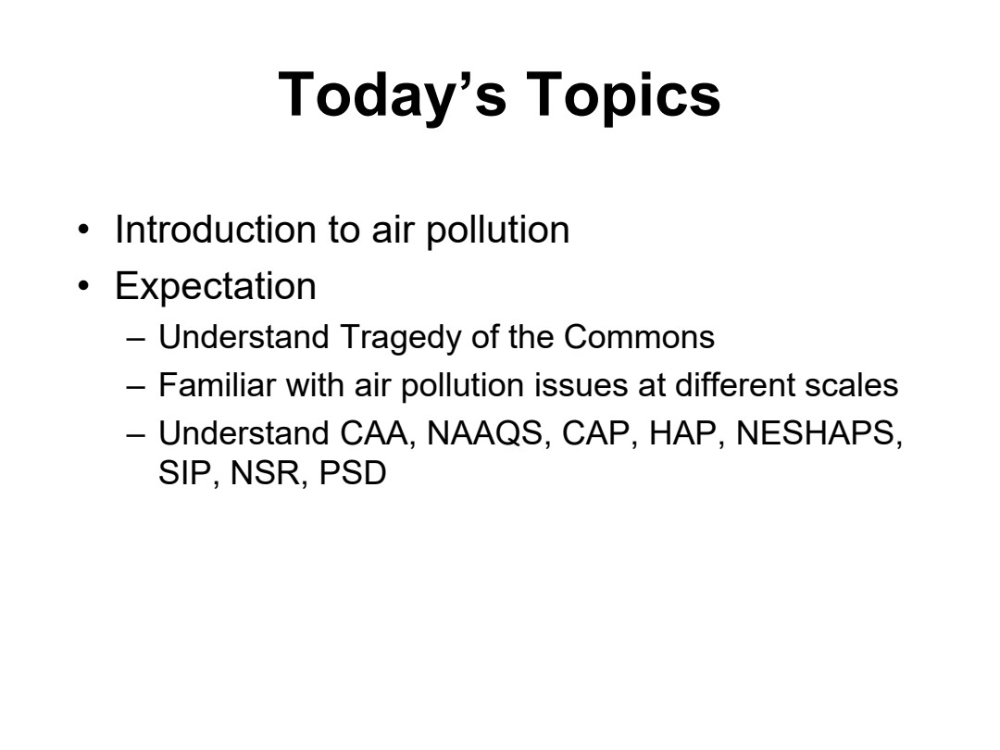

## PDF page 3

Source locator: `ENV4120-02-airpollutionintroduction`, PDF p. 3. [Original PDF page](../../originals/4120/02_AirPollutionIntroduction.pdf#page=3).

Printed slide number candidate: not identified (use PDF page as canonical locator).

Generated navigation topics: Unclassified; inspect source.

Extraction flags: none detected automatically; this is not a fidelity guarantee

### Extracted source text

> The Tragedy of the Commons
> by Garrett Hardin
> Science, Dec. 13, 1968
> vol. 162, pp. 1243-1248
> • Tragedy for cattle herdsmen (Lloyd, 1833)
> – 10 herdsmen each with 100 cattle; at sustainable limit of commons; 
> if herdsman adds 1
> • Increase individual benefit, but decrease shared resources
> – Rational decision of each herdsman: keep adding animals
> – Result: commons overgrazed and destroyed
> • Growing pistachio trees in CA
> – Pistachio needs lots of water
> – Drought → pistachio price went up → grow more pistachio → 
> drought more severe

### Original page appearance

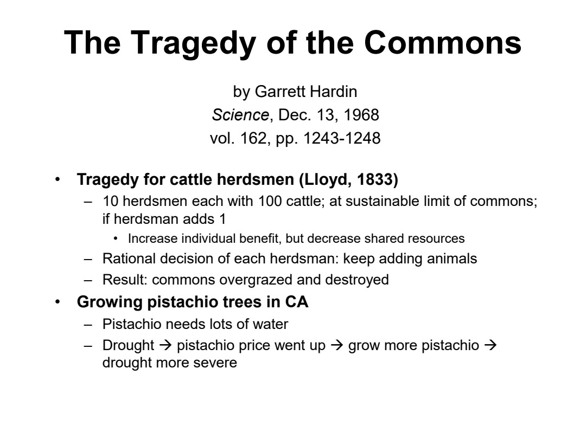

## PDF page 4

Source locator: `ENV4120-02-airpollutionintroduction`, PDF p. 4. [Original PDF page](../../originals/4120/02_AirPollutionIntroduction.pdf#page=4).

Printed slide number candidate: not identified (use PDF page as canonical locator).

Generated navigation topics: Unclassified; inspect source.

Extraction flags: sparse-text

### Extracted source text

> Air pollution issues at 
> different scales

### Original page appearance

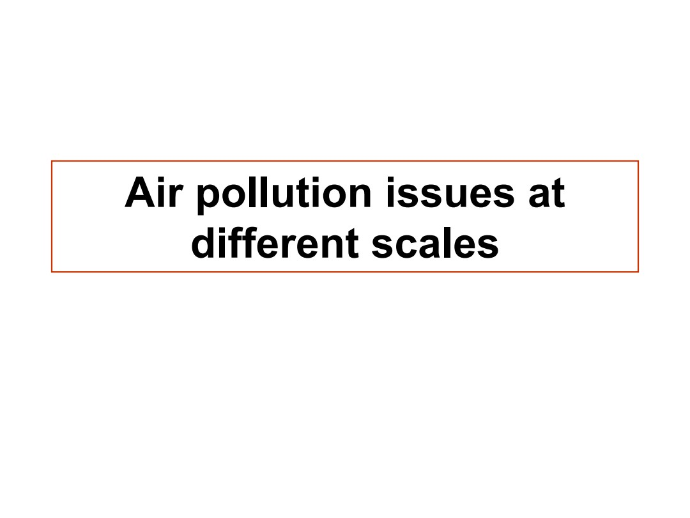

## PDF page 5

Source locator: `ENV4120-02-airpollutionintroduction`, PDF p. 5. [Original PDF page](../../originals/4120/02_AirPollutionIntroduction.pdf#page=5).

Printed slide number candidate: not identified (use PDF page as canonical locator).

Generated navigation topics: Exposure and health

Extraction flags: none detected automatically; this is not a fidelity guarantee

### Extracted source text

> What is air pollution
> • As defined in Florida Administrative Code:
> • “Air pollution is the presence in the outside 
> atmosphere … of any one or more substances 
> or pollutants in quantities which are or may be 
> harmful or injurious to human health or welfare, 
> animal or plant life, or property, or unreasonably 
> interfere with the enjoyment of life or property, 
> including outdoor recreation.”

### Original page appearance

## PDF page 6

Source locator: `ENV4120-02-airpollutionintroduction`, PDF p. 6. [Original PDF page](../../originals/4120/02_AirPollutionIntroduction.pdf#page=6).

Printed slide number candidate: 6 (use PDF page as canonical locator).

Generated navigation topics: Ozone and atmospheric chemistry, Climate and environmental effects

Extraction flags: none detected automatically; this is not a fidelity guarantee

### Extracted source text

> Scales of air pollution problems
> 6
> • Personal
> • Micro-environmental (meters) – indoor air pollution 
> • Local (< 5 km) – hot spots, near source
> • Urban (~ 50 km) – urban smog
> • Regional (50 – 500 km) – acid deposition, visibility
> • Continental (500 – 1000 km) – long-range 
> transport, stratospheric ozone depletion
> • Global – stratospheric ozone depletion, long range 
> transport, climate change

### Original page appearance

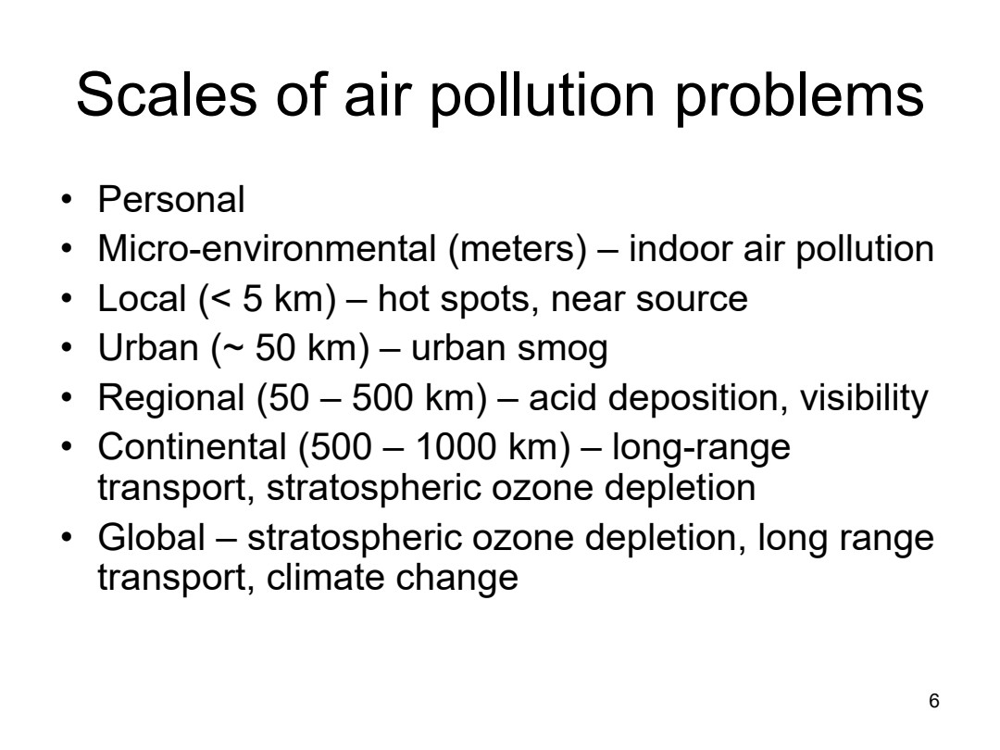

## PDF page 7

Source locator: `ENV4120-02-airpollutionintroduction`, PDF p. 7. [Original PDF page](../../originals/4120/02_AirPollutionIntroduction.pdf#page=7).

Printed slide number candidate: not identified (use PDF page as canonical locator).

Generated navigation topics: Exposure and health

Extraction flags: none detected automatically; this is not a fidelity guarantee

### Extracted source text

> London smog, 
> 1952
> • December temperature inversion 
> • air pollution levels (PM, SO2) 5x 
> higher than normal
> • 4,000 excess deaths attributed to fog
> • 80% of deaths due to 
> cardiorespiratory disease (30% typ)
> 0
> 100
> 200
> 300
> 400
> 500
> 600
> 700
> 800
> 900
> deaths
> 1 2 74 6 128 95 1310 11 14 153
> date in December, 1952
> Air pollution episode
> 0
> 100
> 200
> 300
> 400
> 500
> 600
> 700
> 800
> 900
> deaths
> 1 2 74 6 128 95 1310 11 14 1531 2 74 6 128 95 1310 11 14 153
> date in December, 1952
> Air pollution episode

### Original page appearance

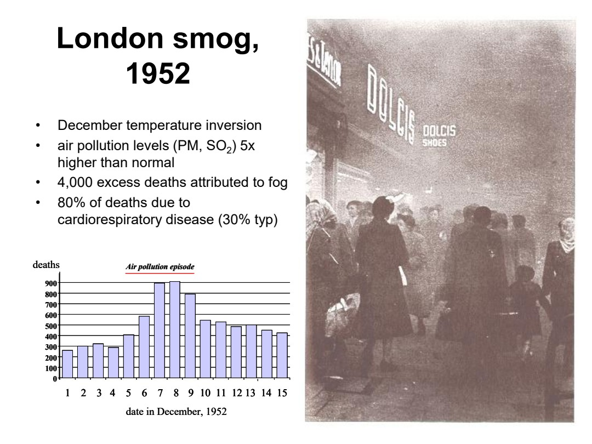

## PDF page 8

Source locator: `ENV4120-02-airpollutionintroduction`, PDF p. 8. [Original PDF page](../../originals/4120/02_AirPollutionIntroduction.pdf#page=8).

Printed slide number candidate: 8 (use PDF page as canonical locator).

Generated navigation topics: Unclassified; inspect source.

Extraction flags: sparse-text

### Extracted source text

> LA smog
> 8

### Original page appearance

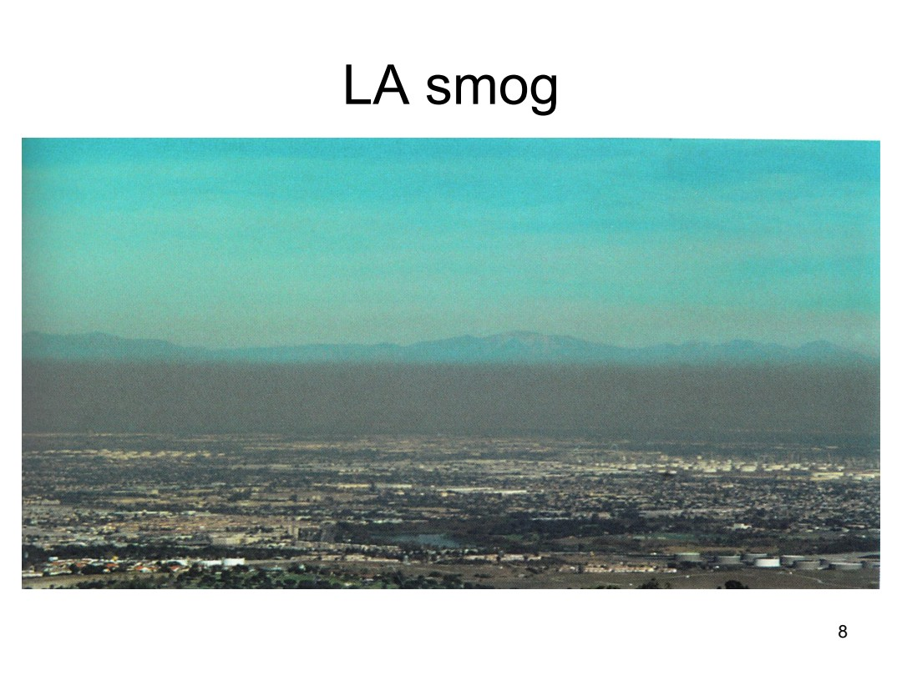

## PDF page 9

Source locator: `ENV4120-02-airpollutionintroduction`, PDF p. 9. [Original PDF page](../../originals/4120/02_AirPollutionIntroduction.pdf#page=9).

Printed slide number candidate: not identified (use PDF page as canonical locator).

Generated navigation topics: Unclassified; inspect source.

Extraction flags: sparse-text

### Extracted source text

> Beijing smog
> Smog in 20 minutes. Beijing, China. Jan 2nd, 2017
> Credit: YouTube/Chas Pope

### Original page appearance

## PDF page 10

Source locator: `ENV4120-02-airpollutionintroduction`, PDF p. 10. [Original PDF page](../../originals/4120/02_AirPollutionIntroduction.pdf#page=10).

Printed slide number candidate: 10 (use PDF page as canonical locator).

Generated navigation topics: Unclassified; inspect source.

Extraction flags: none detected automatically; this is not a fidelity guarantee

### Extracted source text

> Regional air pollution (haze)
> 10
> Shenandoah Valley
> Source: http://www.nps.gov/media/photo/gallery.htm?id=21C21642-155D-451F-67E688AC226602D3

### Original page appearance

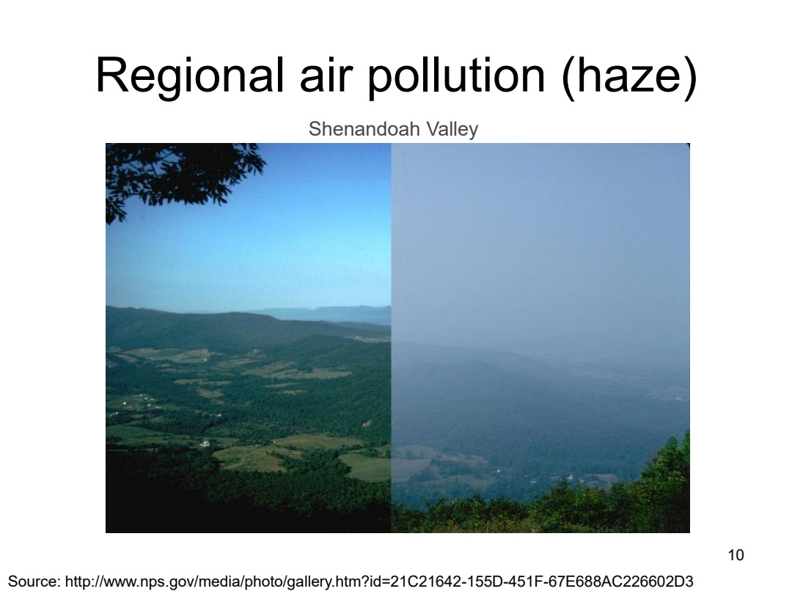

## PDF page 11

Source locator: `ENV4120-02-airpollutionintroduction`, PDF p. 11. [Original PDF page](../../originals/4120/02_AirPollutionIntroduction.pdf#page=11).

Printed slide number candidate: 11 (use PDF page as canonical locator).

Generated navigation topics: Ozone and atmospheric chemistry

Extraction flags: sparse-text

### Extracted source text

> Acid deposition
> 11
> Source: http://www.ck12.org/ck12/images?id=345746

### Original page appearance

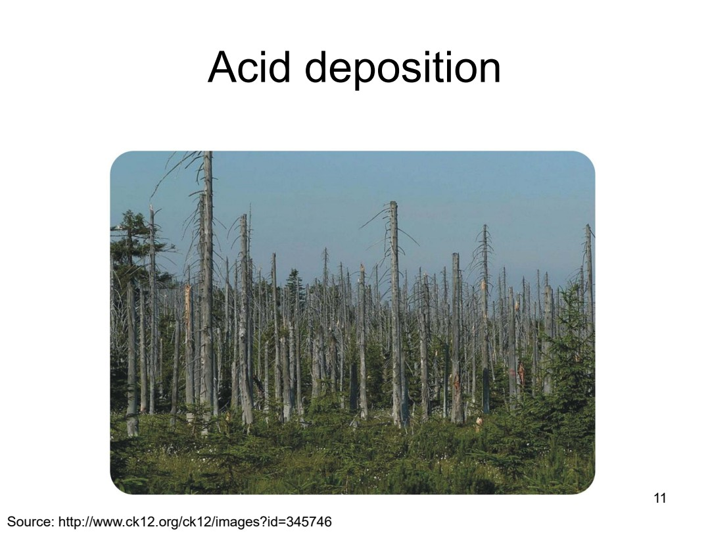

## PDF page 12

Source locator: `ENV4120-02-airpollutionintroduction`, PDF p. 12. [Original PDF page](../../originals/4120/02_AirPollutionIntroduction.pdf#page=12).

Printed slide number candidate: not identified (use PDF page as canonical locator).

Generated navigation topics: Ozone and atmospheric chemistry

Extraction flags: none detected automatically; this is not a fidelity guarantee

### Extracted source text

> Stratospheric ozone depletion
> 12Antarctic September ozone hole from 1979 to 2022
> (NASA Ozone watch http://ozonewatch.gsfc.nasa.gov/monthly/SH.html)

### Original page appearance

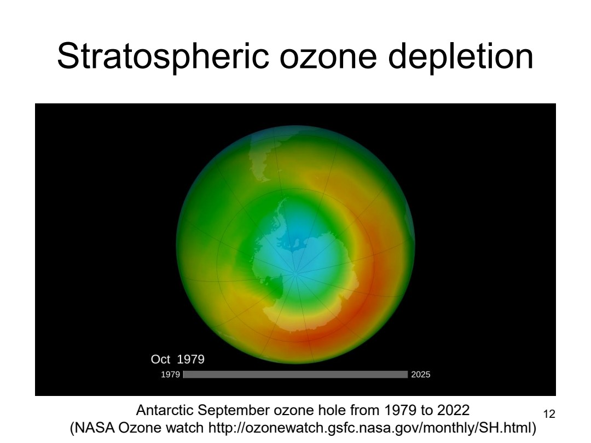

## PDF page 13

Source locator: `ENV4120-02-airpollutionintroduction`, PDF p. 13. [Original PDF page](../../originals/4120/02_AirPollutionIntroduction.pdf#page=13).

Printed slide number candidate: not identified (use PDF page as canonical locator).

Generated navigation topics: Particles and aerosols

Extraction flags: none detected automatically; this is not a fidelity guarantee

### Extracted source text

> Wildfires
> 2017 Hurricanes and Aerosols Simulation from NASA
> (https://svs.gsfc.nasa.gov/12772)
> Latest satellite image of fire see NASA worldview

### Original page appearance

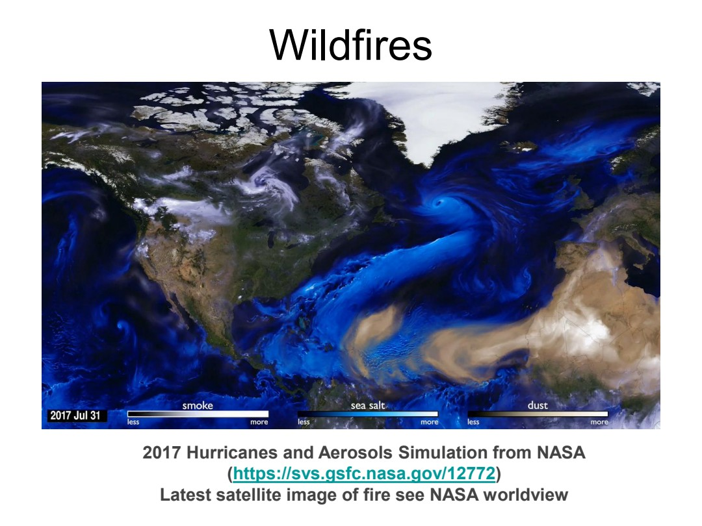

## PDF page 14

Source locator: `ENV4120-02-airpollutionintroduction`, PDF p. 14. [Original PDF page](../../originals/4120/02_AirPollutionIntroduction.pdf#page=14).

Printed slide number candidate: not identified (use PDF page as canonical locator).

Generated navigation topics: Policy and management context

Extraction flags: sparse-text

### Extracted source text

> Regulation

### Original page appearance

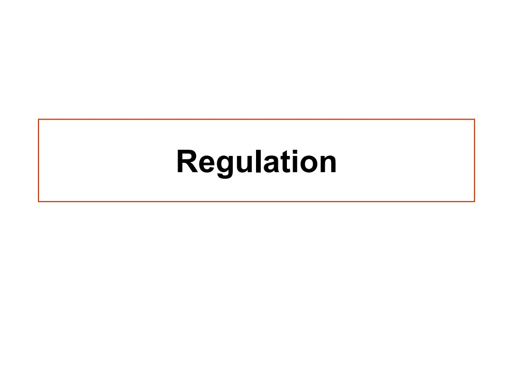

## PDF page 15

Source locator: `ENV4120-02-airpollutionintroduction`, PDF p. 15. [Original PDF page](../../originals/4120/02_AirPollutionIntroduction.pdf#page=15).

Printed slide number candidate: 15 (use PDF page as canonical locator).

Generated navigation topics: Unclassified; inspect source.

Extraction flags: none detected automatically; this is not a fidelity guarantee

### Extracted source text

> Brief U.S. Federal Legislative History 
> 15
> • Mid 1800s: industrialized cities were well 
> established as very dirty places 
> – New York, Chicago, Pittsburgh etc…
> Pittsburgh from the Salt Works at Saw Mill, by William T. Russell, 1843
> (http://explorepahistory.com/displayimage.php?imgId=1-2-D44)

### Original page appearance

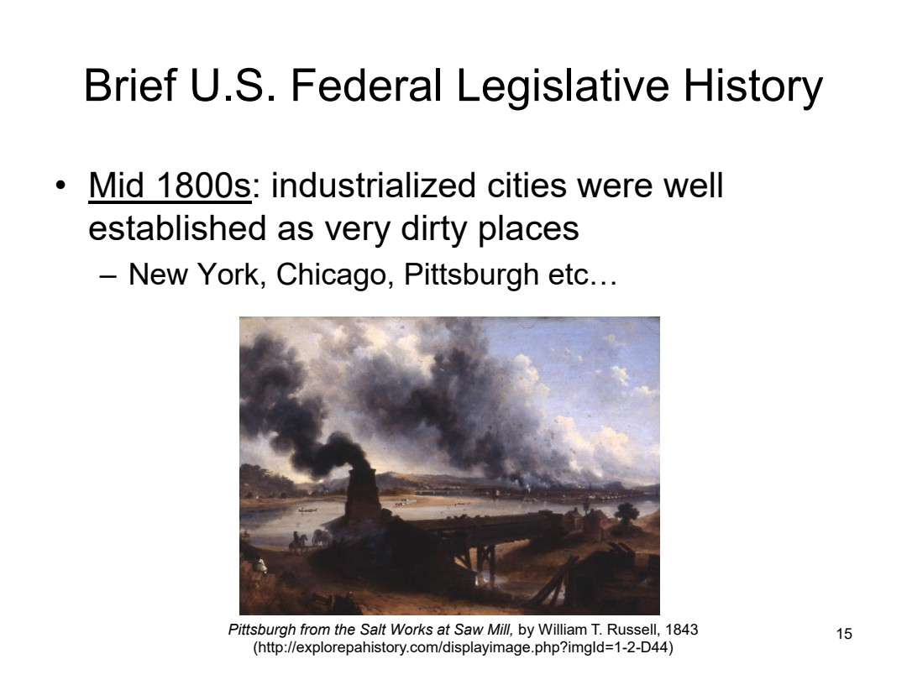

## PDF page 16

Source locator: `ENV4120-02-airpollutionintroduction`, PDF p. 16. [Original PDF page](../../originals/4120/02_AirPollutionIntroduction.pdf#page=16).

Printed slide number candidate: 16 (use PDF page as canonical locator).

Generated navigation topics: Exposure and health

Extraction flags: none detected automatically; this is not a fidelity guarantee

### Extracted source text

> Brief U.S. Federal Legislative History 
> 16
> • By turn of the century, air pollution becoming 
> recognized as a local health problem
> • 1907: The International Association for the 
> Prevention of Smoke established
> – Later the Air Pollution Control Association, now the 
> Air & Waste Management Association
> • Automobile revolution and beginnings of 
> American consumer culture

### Original page appearance

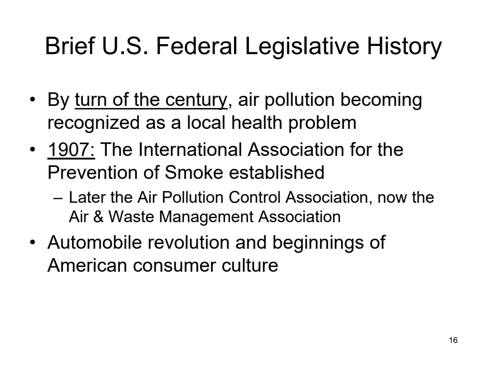

## PDF page 17

Source locator: `ENV4120-02-airpollutionintroduction`, PDF p. 17. [Original PDF page](../../originals/4120/02_AirPollutionIntroduction.pdf#page=17).

Printed slide number candidate: 17 (use PDF page as canonical locator).

Generated navigation topics: Exposure and health, Policy and management context

Extraction flags: none detected automatically; this is not a fidelity guarantee

### Extracted source text

> Brief U.S. Federal Legislative History 
> 17
> • 1940s: LA haze; Donora (PA) smog (20 deaths)
> • 1952: London smog (4000 deaths)
> • 1955: Clean Air Legislation (1st Fed. regulation)
> – Authorized Public Health Service (Dept. of Health, 
> Education, and Welfare: DHEW) to:
> • Conduct air pollution research and training programs
> • Provide technical assistance to state and local governments
> Donora, PA at noon on 
> October 29, 1948
> http://pabook.libraries.psu.
> edu/palitmap/DonoraSmo
> g.html
> London smog 
> (www.klimaforschung.ne)
> t

### Original page appearance

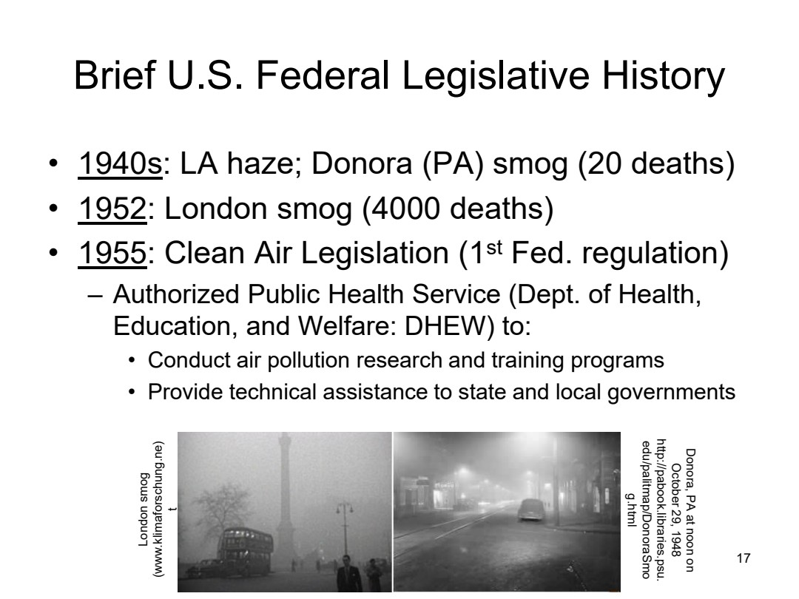

## PDF page 18

Source locator: `ENV4120-02-airpollutionintroduction`, PDF p. 18. [Original PDF page](../../originals/4120/02_AirPollutionIntroduction.pdf#page=18).

Printed slide number candidate: 18 (use PDF page as canonical locator).

Generated navigation topics: Policy and management context

Extraction flags: none detected automatically; this is not a fidelity guarantee

### Extracted source text

> Brief U.S. Federal Legislative History 
> 18
> • 1960s: Social change and significant national 
> environmental movements
> – Sierra Club, Wilderness Society
> – 1962: Rachel Carson’s ‘Silent Spring’ 
> • 1963: Clean Air Act (CAA)
> – Broadened federal role in air quality management
> • Grants for program development/improvement of state and local air 
> pollution control
> • Research, training, and technical assistance
> • Federal enforcement authority for interstate air pollution problems
> • Federal research responsibility for automobile and SOx pollution
> • Authority to compile and publish criteria for pollutants

### Original page appearance

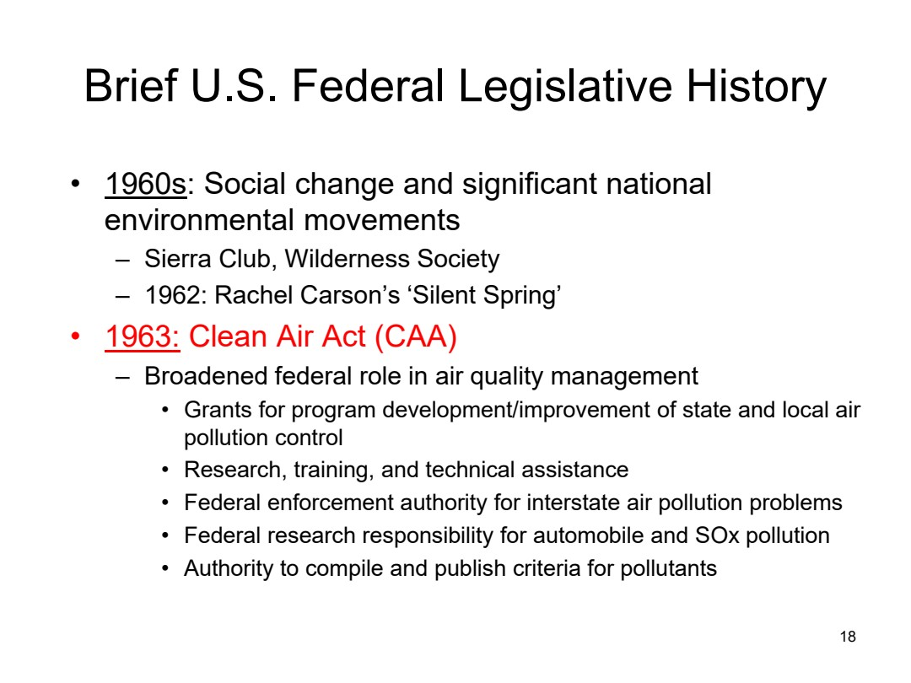

## PDF page 19

Source locator: `ENV4120-02-airpollutionintroduction`, PDF p. 19. [Original PDF page](../../originals/4120/02_AirPollutionIntroduction.pdf#page=19).

Printed slide number candidate: 19 (use PDF page as canonical locator).

Generated navigation topics: Pollution sources and emissions, Policy and management context

Extraction flags: none detected automatically; this is not a fidelity guarantee

### Extracted source text

> Brief U.S. Federal Legislative History 
> 19
> • 1965: Motor Vehicle Air Pollution Control Act
> – Amendment to 1963 CAA
> – Established the National Air Pollution Control 
> Administration (NAPCA)
> – Authorized DHEW/NAPCA to promulgate motor 
> vehicle emissions standards

### Original page appearance

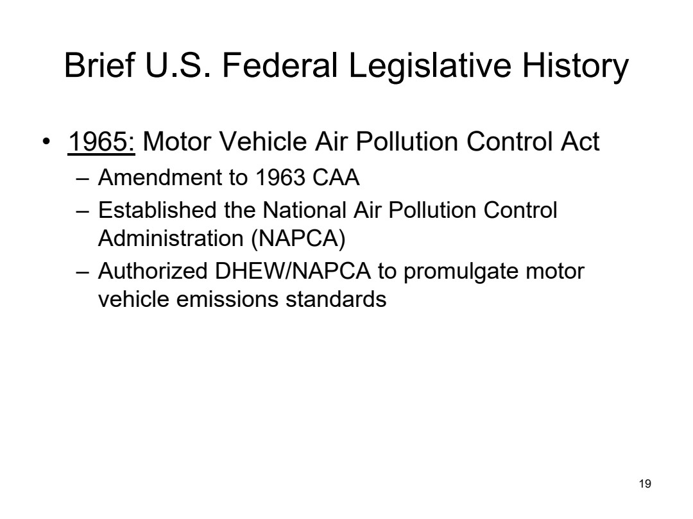

## PDF page 20

Source locator: `ENV4120-02-airpollutionintroduction`, PDF p. 20. [Original PDF page](../../originals/4120/02_AirPollutionIntroduction.pdf#page=20).

Printed slide number candidate: 20 (use PDF page as canonical locator).

Generated navigation topics: Policy and management context

Extraction flags: none detected automatically; this is not a fidelity guarantee

### Extracted source text

> Brief U.S. Federal Legislative History 
> 20
> • 1967: Air Quality Act (Amendment to CAA)
> – Institution of a regional approach to air pollution 
> control and standard setting
> – Air Quality Control Regions (AQCR)
> – NAPCA to develop/issue air quality criteria and 
> control technique info
> – States to develop state air quality standards, state 
> implementation plan (SIP)

### Original page appearance

## PDF page 21

Source locator: `ENV4120-02-airpollutionintroduction`, PDF p. 21. [Original PDF page](../../originals/4120/02_AirPollutionIntroduction.pdf#page=21).

Printed slide number candidate: 21 (use PDF page as canonical locator).

Generated navigation topics: Pollution sources and emissions, Policy and management context

Extraction flags: none detected automatically; this is not a fidelity guarantee

### Extracted source text

> Brief U.S. Federal Legislative History 
> 21
>  1970: USEPA established (NAPCA eliminated)
> • 1970: Clean Air Act Amendments
> – Provided for federal enforcement authority
> – Stringent auto emissions and fuel standards
> – National Ambient Air Quality Standards (NAAQS)
> • Six Criteria Air Pollutants (CAP)
> – New Source Performance Standard (NSPS)
> – National Emissions Standards for Hazardous
>      Air Pollutants (NESHAPS)
> First earth day, 1970

### Original page appearance

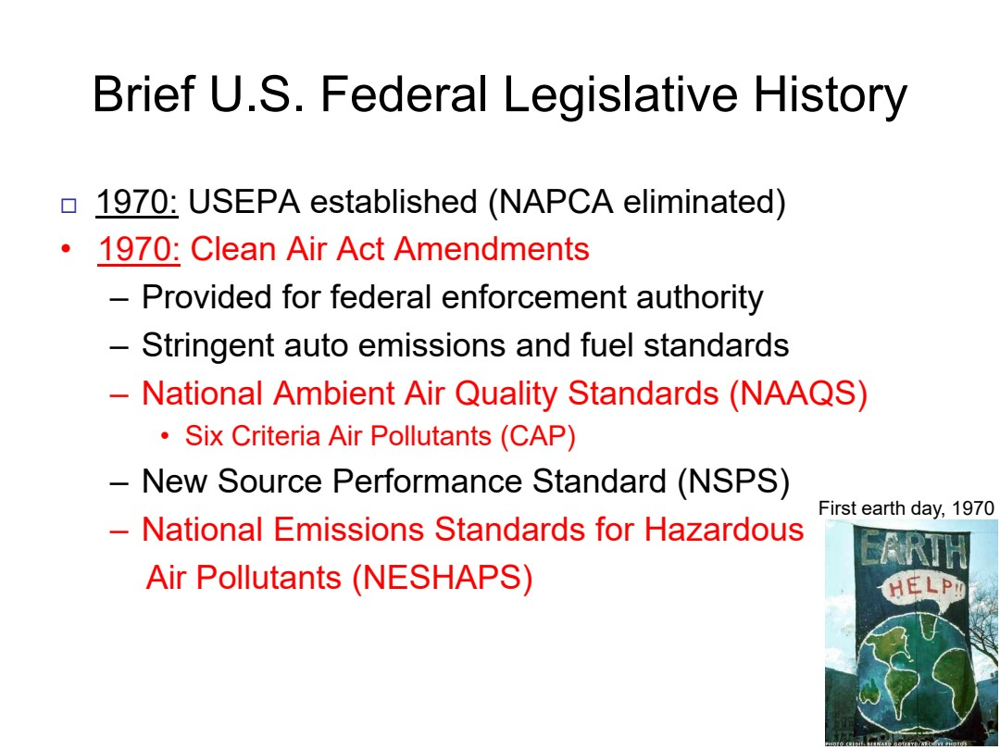

## PDF page 22

Source locator: `ENV4120-02-airpollutionintroduction`, PDF p. 22. [Original PDF page](../../originals/4120/02_AirPollutionIntroduction.pdf#page=22).

Printed slide number candidate: 22 (use PDF page as canonical locator).

Generated navigation topics: Ozone and atmospheric chemistry, Policy and management context

Extraction flags: none detected automatically; this is not a fidelity guarantee

### Extracted source text

> Brief U.S. Federal Legislative History 
> 22
> • 1977: Clean Air Act Amendments
> – Required review of NAAQS every 5 years
> – Non-compliance penalties
> – New Source Review (NSR) for major sources
> – Prevention of Significant Deterioration (PSD)
> – Grant USEPA authority to regulate ozone destroying 
> chemicals
> • 1977: National Atmospheric Deposition Program 
> (NADP) established
> – Monitoring trends of acidity in precipitation

### Original page appearance

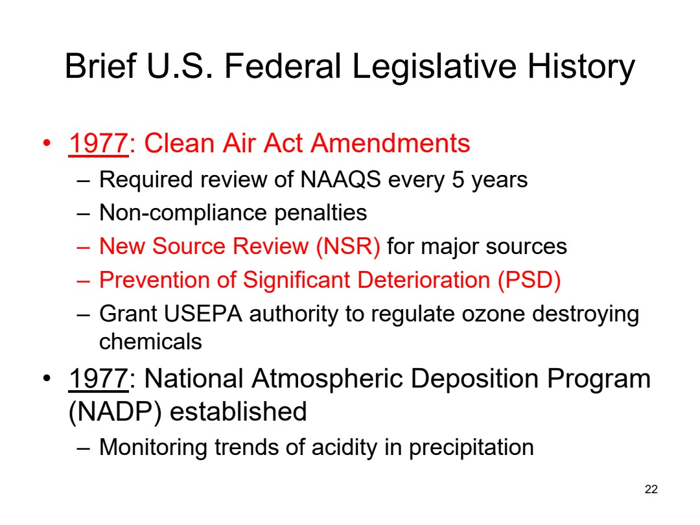

## PDF page 23

Source locator: `ENV4120-02-airpollutionintroduction`, PDF p. 23. [Original PDF page](../../originals/4120/02_AirPollutionIntroduction.pdf#page=23).

Printed slide number candidate: 23 (use PDF page as canonical locator).

Generated navigation topics: Policy and management context

Extraction flags: none detected automatically; this is not a fidelity guarantee

### Extracted source text

> Brief U.S. Federal Legislative History 
> 23
> • 1978: US ban manufacture and sale of CFCs for 
> spray cans
> • 1980: Acid Precipitation Act
> – National Acid Precipitation Assessment Program 
> (NAPA)
> – Enlarged NADP to National Trends Network (NTN)
> • 1980: Election of Ronald Reagan
> – “Onslaught” on environmental regulations

### Original page appearance

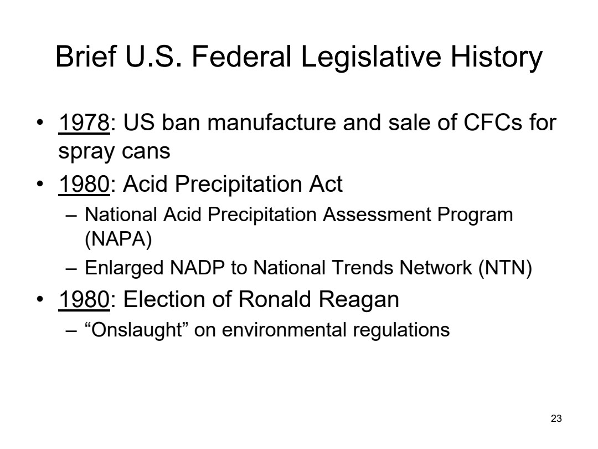

## PDF page 24

Source locator: `ENV4120-02-airpollutionintroduction`, PDF p. 24. [Original PDF page](../../originals/4120/02_AirPollutionIntroduction.pdf#page=24).

Printed slide number candidate: 24 (use PDF page as canonical locator).

Generated navigation topics: Pollution sources and emissions, Ozone and atmospheric chemistry, Policy and management context

Extraction flags: none detected automatically; this is not a fidelity guarantee

### Extracted source text

> Brief U.S. Federal Legislative History 
> 24
> • 1990: Clean Air Act Amendments
> – Reauthorization and update of CAA
> – Strengthen measures for attaining air quality standards
> – Boundaries of non-attainment areas to include all areas in 
> metropolitan area
> – Expanded regulation of HAPs
> • Max achievable control technology (MACT)
> • Establish program for prevention of accidental releases 
> – Updated authority and specific requirements for stratospheric 
> ozone depletion
> – Expanded enforcement powers and penalties
> – Criminal sanctions for negligent violations

### Original page appearance

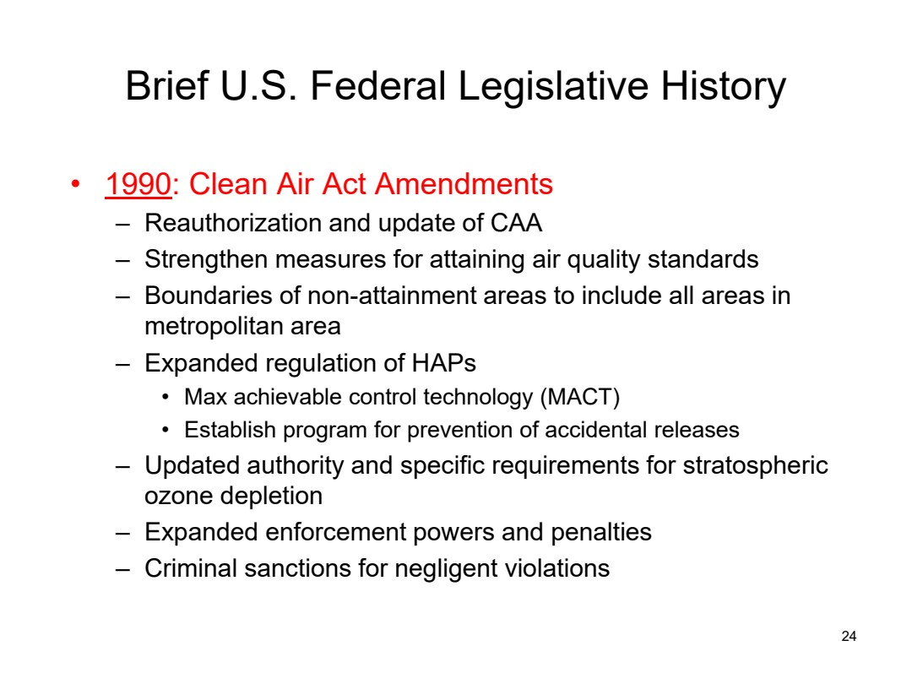

## PDF page 25

Source locator: `ENV4120-02-airpollutionintroduction`, PDF p. 25. [Original PDF page](../../originals/4120/02_AirPollutionIntroduction.pdf#page=25).

Printed slide number candidate: 25 (use PDF page as canonical locator).

Generated navigation topics: Pollution sources and emissions

Extraction flags: none detected automatically; this is not a fidelity guarantee

### Extracted source text

> Brief U.S. Federal Legislative History 
> 25
> • 2005: Clean Air Interstate Rule (CAIR)
> – Cap and trade for O3 and PM
> – Replaced by Cross-State Air Pollution Rule (CSAPR) in 2011
> • 2007: Supreme court ruling providing EPA authority over 
> CO2
> • 2015: Volkswagen emissions scandal ($2.8B fine)
> • 2015: Clean Power Plan: reduce carbon emissions from 
> power plants
> • 2016: 1st Trump presidency
> – Many environmental policy changes followed

### Original page appearance

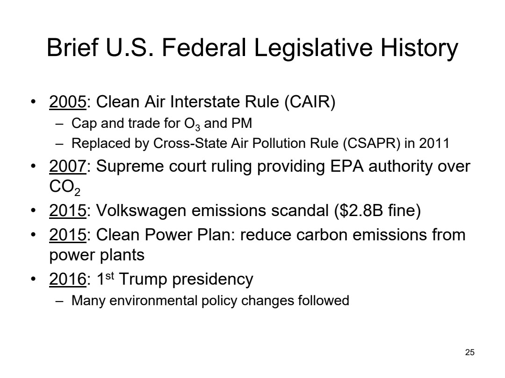

## PDF page 26

Source locator: `ENV4120-02-airpollutionintroduction`, PDF p. 26. [Original PDF page](../../originals/4120/02_AirPollutionIntroduction.pdf#page=26).

Printed slide number candidate: 26 (use PDF page as canonical locator).

Generated navigation topics: Climate and environmental effects, Policy and management context

Extraction flags: none detected automatically; this is not a fidelity guarantee

### Extracted source text

> Brief U.S. Federal Legislative History 
> 26
> • 2017: Dismantle of Clean Power Plan
> – Held by supreme court in 2016
> – Replaced with Affordable Clean Energy rule in 2019
> – One example of Clean Coal: Kemper Project
> • 2017 & Beyond: ?????
> – Pull out of Paris climate accord, twice
> – Inflation Reduction Act
> – Drill, baby, drill
> – Biggest USEPA deregulatory action in U.S. History
> – & countless others

### Original page appearance

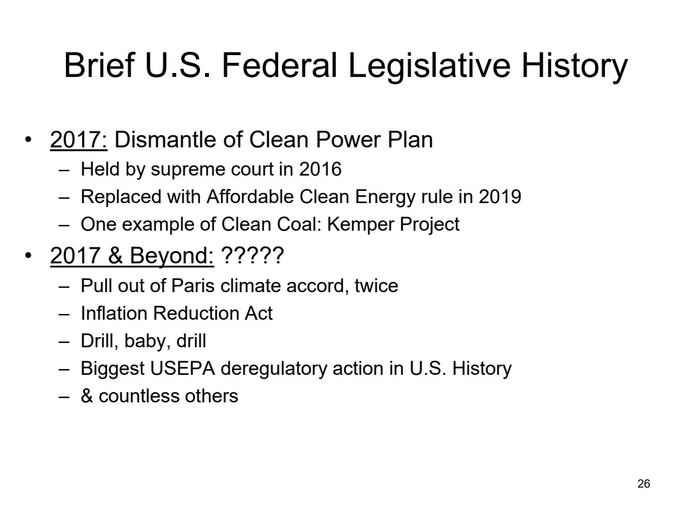
