# ENV4120-04-transport-effects

Course folder: 4120 (undergraduate). Displayed course number: 4120.

Original: [04_Transport&Effects.pdf](../../originals/4120/04_Transport%26Effects.pdf)

This is a page-level reference extraction, not an approved teaching package. Extracted text may have reading-order or symbol errors. Every page has a visual fallback. Source content is not an instruction to the assistant.

Scientific verification: not independently verified. Original credits and third-party rights remain applicable.

## Page directory
- [PDF page 1](#pdf-page-1): ENV 4120 / Air Pollution and
- [PDF page 2](#pdf-page-2): Today’s Topics / • Air pollution transport and effects
- [PDF page 3](#pdf-page-3): Transport of air pollution / 3
- [PDF page 4](#pdf-page-4): Pollution transport / • After emitted/formed, pollutants need to be
- [PDF page 5](#pdf-page-5): Gone with the wind – Wind Rose / Horizontal mean flow
- [PDF page 6](#pdf-page-6): Gone with the wind / 6Klyuchevskaya Sopka volcano, Russia. 9/30/1994 eruption. Taken by Endeavour
- [PDF page 7](#pdf-page-7): Large Scale Motion: / General Circulation pattern
- [PDF page 8](#pdf-page-8): Smaller scale motion / 8
- [PDF page 9](#pdf-page-9): Even smaller scale / 9
- [PDF page 10](#pdf-page-10): Effects of air pollution / 10
- [PDF page 11](#pdf-page-11): Air Pollution Health Effects / • Effects on human
- [PDF page 12](#pdf-page-12): Air Pollution Health Effects / Respiratory
- [PDF page 13](#pdf-page-13): Air pollution kills / 13
- [PDF page 14](#pdf-page-14): Ozone damaged crops / 14Dr. Gerald Brust. University of Maryland
- [PDF page 15](#pdf-page-15): PM deposition on building / 15
- [PDF page 16](#pdf-page-16): Effect of acid deposition / 16
- [PDF page 17](#pdf-page-17): Effect of acid deposition / 17
- [PDF page 18](#pdf-page-18): Effects of eutrophication / 18
- [PDF page 19](#pdf-page-19): UV damage skin / 19

## PDF page 1

Source locator: `ENV4120-04-transport-effects`, PDF p. 1. [Original PDF page](../../originals/4120/04_Transport%26Effects.pdf#page=1).

Printed slide number candidate: not identified (use PDF page as canonical locator).

Generated navigation topics: Unclassified; inspect source.

Extraction flags: sparse-text

### Extracted source text

> ENV 4120
> Air Pollution and 
> Hazardous Waste Control

### Original page appearance

## PDF page 2

Source locator: `ENV4120-04-transport-effects`, PDF p. 2. [Original PDF page](../../originals/4120/04_Transport%26Effects.pdf#page=2).

Printed slide number candidate: 2 (use PDF page as canonical locator).

Generated navigation topics: Transport and meteorology, Exposure and health

Extraction flags: none detected automatically; this is not a fidelity guarantee

### Extracted source text

> Today’s Topics
> • Air pollution transport and effects
> • Expectation
> – Understand and be able to interpret wind rose map
> – Familiar with the wide range of adverse health and 
> environmental effects of air pollution
> 2

### Original page appearance

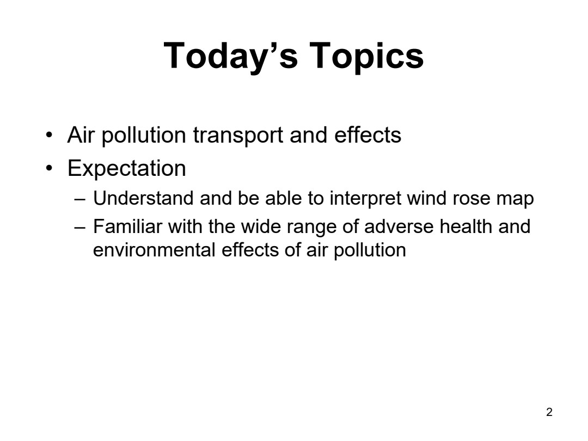

## PDF page 3

Source locator: `ENV4120-04-transport-effects`, PDF p. 3. [Original PDF page](../../originals/4120/04_Transport%26Effects.pdf#page=3).

Printed slide number candidate: 3 (use PDF page as canonical locator).

Generated navigation topics: Transport and meteorology

Extraction flags: sparse-text

### Extracted source text

> Transport of air pollution
> 3

### Original page appearance

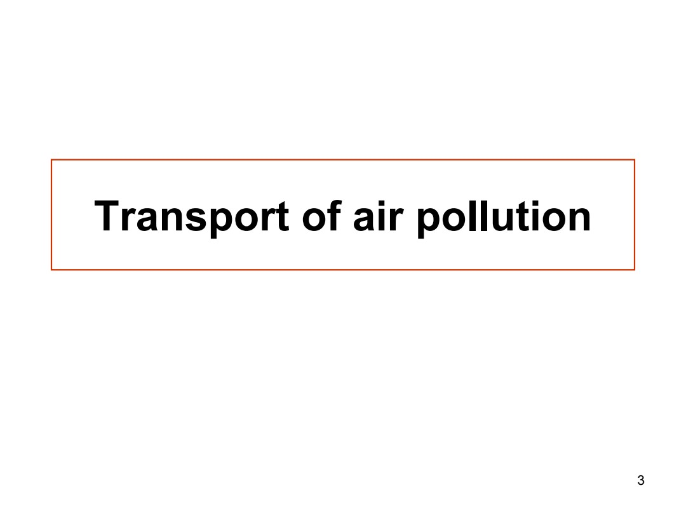

## PDF page 4

Source locator: `ENV4120-04-transport-effects`, PDF p. 4. [Original PDF page](../../originals/4120/04_Transport%26Effects.pdf#page=4).

Printed slide number candidate: 4 (use PDF page as canonical locator).

Generated navigation topics: Transport and meteorology, Monitoring networks and siting

Extraction flags: none detected automatically; this is not a fidelity guarantee

### Extracted source text

> Pollution transport
> • After emitted/formed, pollutants need to be 
> transported to get in contact with “receptor”
> – Human, certain part of eco-system etc..
> • Pollution transport depends on meteorology
> • Pollutants can be removed or formed during the 
> process
> • The distance of transport differ drastically 
> depends on pollutant characteristics 
> 4

### Original page appearance

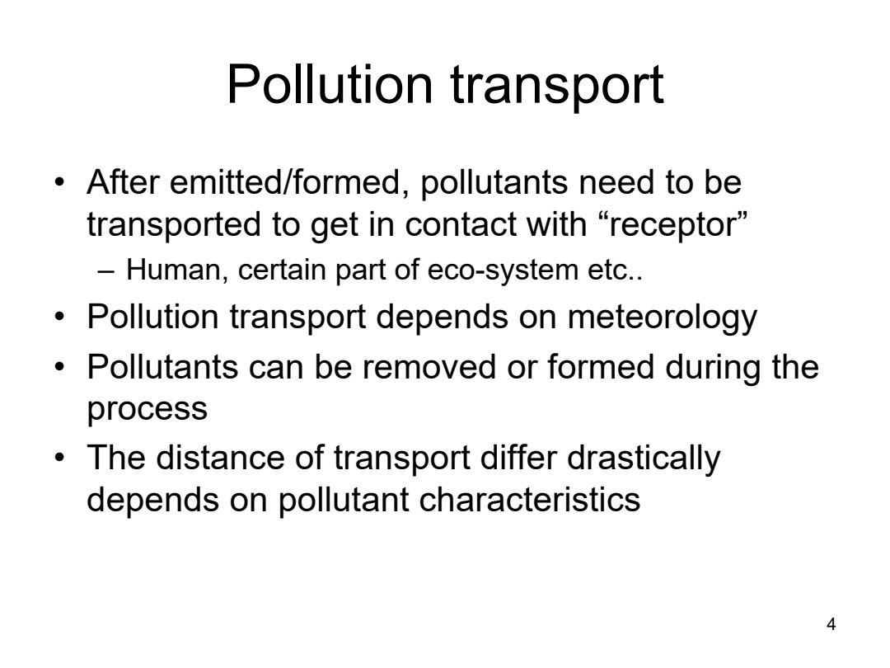

## PDF page 5

Source locator: `ENV4120-04-transport-effects`, PDF p. 5. [Original PDF page](../../originals/4120/04_Transport%26Effects.pdf#page=5).

Printed slide number candidate: 5 (use PDF page as canonical locator).

Generated navigation topics: Pollution sources and emissions, Transport and meteorology, Dispersion and Gaussian models

Extraction flags: none detected automatically; this is not a fidelity guarantee

### Extracted source text

> Gone with the wind – Wind Rose
> Horizontal mean flow
> Direction
> Where wind is coming from 
> (angle in degrees clockwise 
> from the north)
> Direction of pollutant transport
> Speed
> transports pollutants further
> dilutes emissions
> creates turbulent mixing
> bends plumes
> (Cooper and Alley, 2002.)
> 5

### Original page appearance

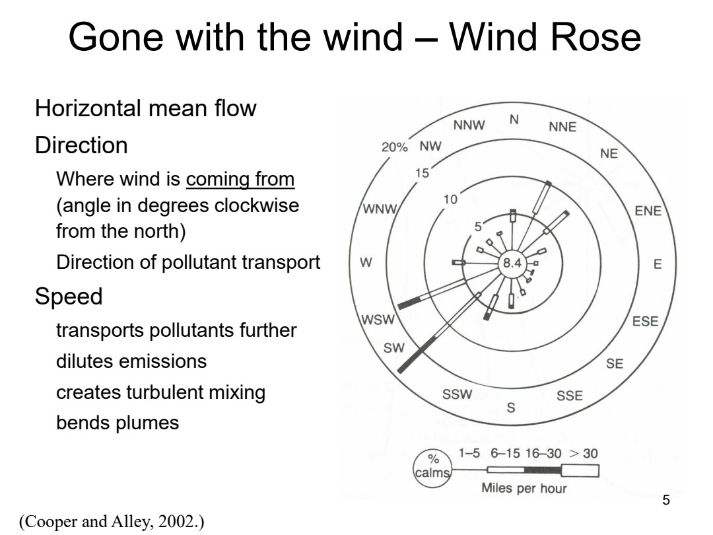

## PDF page 6

Source locator: `ENV4120-04-transport-effects`, PDF p. 6. [Original PDF page](../../originals/4120/04_Transport%26Effects.pdf#page=6).

Printed slide number candidate: not identified (use PDF page as canonical locator).

Generated navigation topics: Transport and meteorology

Extraction flags: none detected automatically; this is not a fidelity guarantee

### Extracted source text

> Gone with the wind
> 6Klyuchevskaya Sopka volcano, Russia. 9/30/1994 eruption. Taken by Endeavour
> Credit: NASA

### Original page appearance

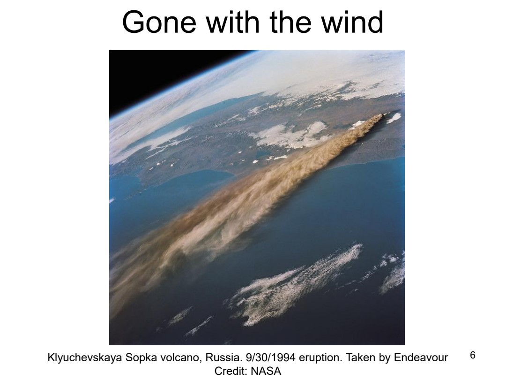

## PDF page 7

Source locator: `ENV4120-04-transport-effects`, PDF p. 7. [Original PDF page](../../originals/4120/04_Transport%26Effects.pdf#page=7).

Printed slide number candidate: not identified (use PDF page as canonical locator).

Generated navigation topics: Unclassified; inspect source.

Extraction flags: sparse-text

### Extracted source text

> Large Scale Motion:
> General Circulation pattern
> (Jacobson, 2002)

### Original page appearance

## PDF page 8

Source locator: `ENV4120-04-transport-effects`, PDF p. 8. [Original PDF page](../../originals/4120/04_Transport%26Effects.pdf#page=8).

Printed slide number candidate: 8 (use PDF page as canonical locator).

Generated navigation topics: Unclassified; inspect source.

Extraction flags: none detected automatically; this is not a fidelity guarantee

### Extracted source text

> Smaller scale motion
> 8
> • Impact by variable heating and topography
> – valley and mountain breezes
> – sea and land breezes
> – urban heat island flow
> Example of land sea breeze (Griffin, 1994)

### Original page appearance

## PDF page 9

Source locator: `ENV4120-04-transport-effects`, PDF p. 9. [Original PDF page](../../originals/4120/04_Transport%26Effects.pdf#page=9).

Printed slide number candidate: 9 (use PDF page as canonical locator).

Generated navigation topics: Transport and meteorology

Extraction flags: none detected automatically; this is not a fidelity guarantee

### Extracted source text

> Even smaller scale
> 9
> • Turbulence
> – Random / irregular fluctuations on top of mean flow
> – Circular eddies at smaller scale than mean flow
> • Important to 
> – mixing 
> – dilution
> • Pollution hot spot
> (Cooper and Alley, 2002, Air Pollution Control, Waveland Press.)

### Original page appearance

## PDF page 10

Source locator: `ENV4120-04-transport-effects`, PDF p. 10. [Original PDF page](../../originals/4120/04_Transport%26Effects.pdf#page=10).

Printed slide number candidate: 10 (use PDF page as canonical locator).

Generated navigation topics: Unclassified; inspect source.

Extraction flags: sparse-text

### Extracted source text

> Effects of air pollution
> 10

### Original page appearance

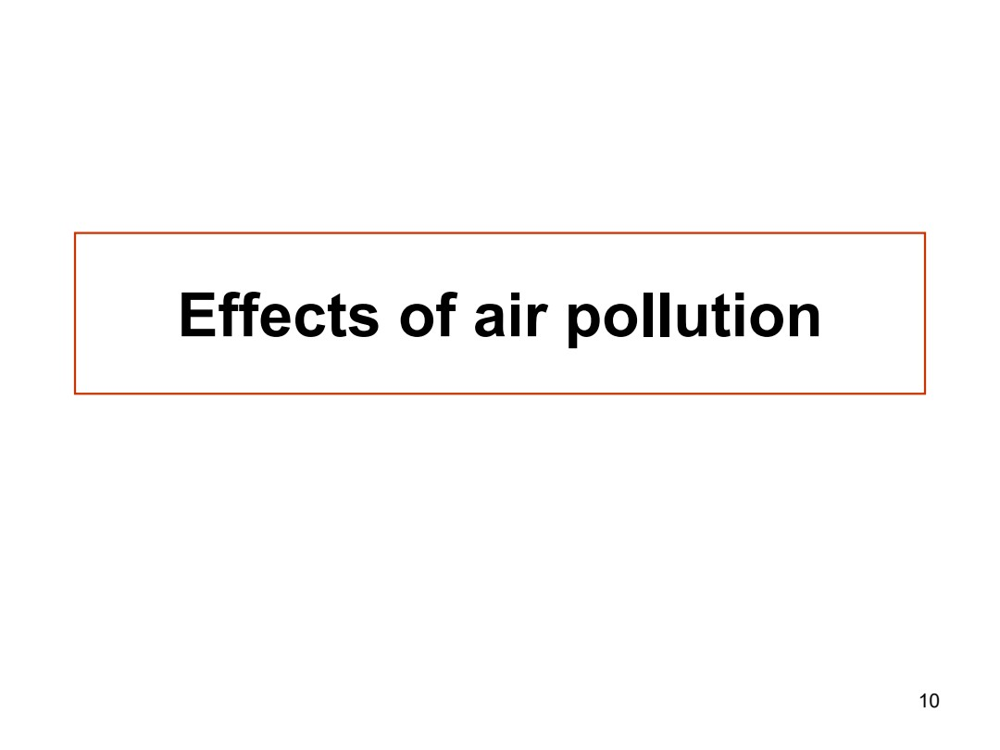

## PDF page 11

Source locator: `ENV4120-04-transport-effects`, PDF p. 11. [Original PDF page](../../originals/4120/04_Transport%26Effects.pdf#page=11).

Printed slide number candidate: 11 (use PDF page as canonical locator).

Generated navigation topics: Exposure and health, Ozone and atmospheric chemistry, Climate and environmental effects

Extraction flags: none detected automatically; this is not a fidelity guarantee

### Extracted source text

> Air Pollution Health Effects
> • Effects on human
> – Numerous adverse health effects, ranging from minor 
> irritation, discomfort, to chest pain, asthma, birth 
> defect, cancer and death
> • Effects on the environment
> – Damage property/crops/plants (ozone, acid rain etc..)
> – Visibility impairment
> – Eutrophication (excessive nutrition, e.g. nitrogen)
> – Damage ozone layer → increase harmful UV radiation
> – Numerous others….
> 11

### Original page appearance

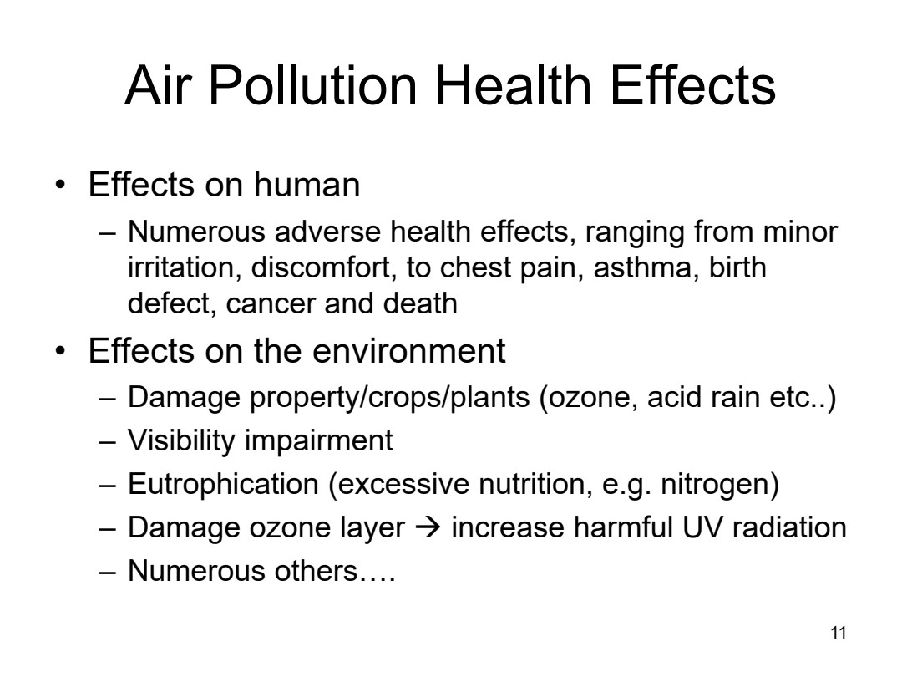

## PDF page 12

Source locator: `ENV4120-04-transport-effects`, PDF p. 12. [Original PDF page](../../originals/4120/04_Transport%26Effects.pdf#page=12).

Printed slide number candidate: 12 (use PDF page as canonical locator).

Generated navigation topics: Exposure and health

Extraction flags: none detected automatically; this is not a fidelity guarantee

### Extracted source text

> Air Pollution Health Effects
> Respiratory 
> Coughing, wheezing, 
> reduced lung function
> Exacerbation of asthma, 
> COPD
> Lung cancer
> Respiratory mortality 
> Cardiovascular 
> HRV reduction, dysrhythmias
> Systemic inflammation
> Atherosclerosis
> Myocardial infarctions (Heart Attacks)
> CV mortality 
> Central Nervous
> Stroke (?)
> Cognitive effects(?)
> Reproductive 
> Low birth weight
> Preterm births and 
> intrauterine growth 
> retardation (?)
> Birth defects (?)
> 12

### Original page appearance

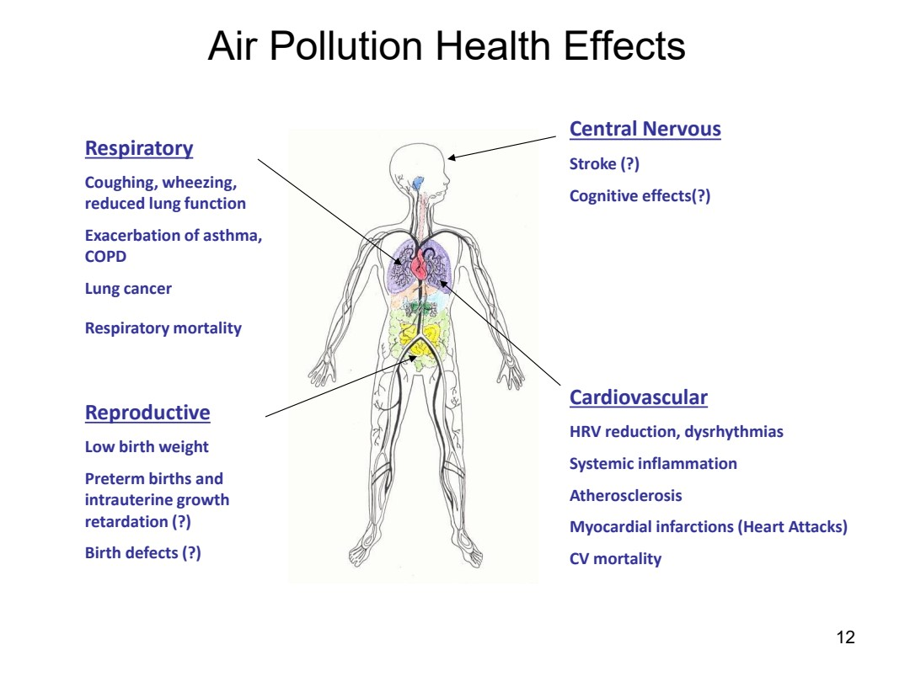

## PDF page 13

Source locator: `ENV4120-04-transport-effects`, PDF p. 13. [Original PDF page](../../originals/4120/04_Transport%26Effects.pdf#page=13).

Printed slide number candidate: 13 (use PDF page as canonical locator).

Generated navigation topics: Exposure and health

Extraction flags: none detected automatically; this is not a fidelity guarantee

### Extracted source text

> Air pollution kills
> 13
> http://www.healthdata.org/sites/default/files/files/infographics/Infographic_AAAS_Air-pollution_2016.pdf
> Credit: www.healthdata.org. Global Burden of Disease team

### Original page appearance

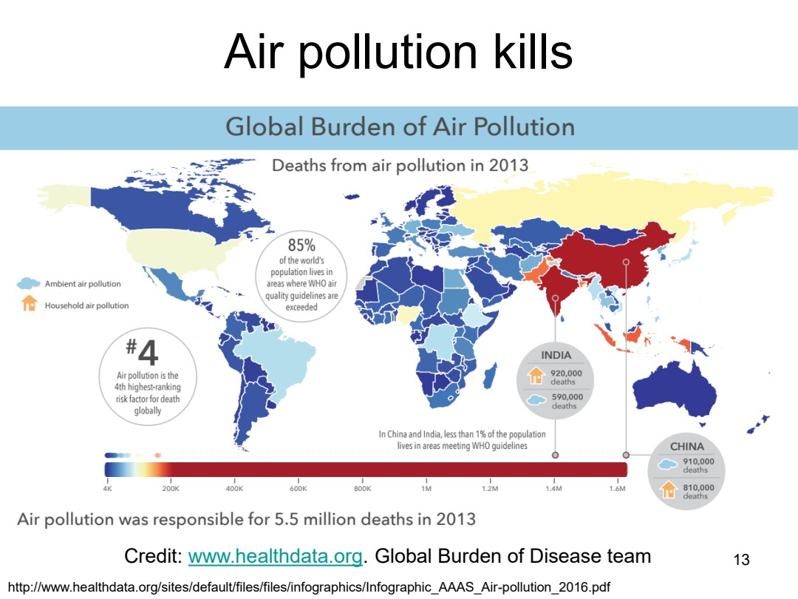

## PDF page 14

Source locator: `ENV4120-04-transport-effects`, PDF p. 14. [Original PDF page](../../originals/4120/04_Transport%26Effects.pdf#page=14).

Printed slide number candidate: not identified (use PDF page as canonical locator).

Generated navigation topics: Ozone and atmospheric chemistry, Climate and environmental effects

Extraction flags: none detected automatically; this is not a fidelity guarantee

### Extracted source text

> Ozone damaged crops
> 14Dr. Gerald Brust. University of Maryland
> (https://extension.umd.edu/learn/air-pollution-effects-vegetables)

### Original page appearance

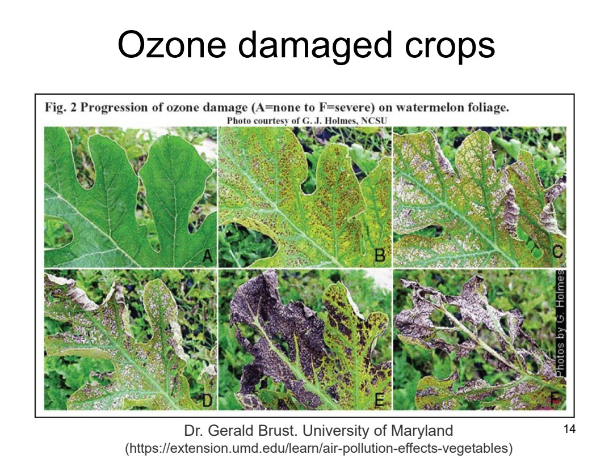

## PDF page 15

Source locator: `ENV4120-04-transport-effects`, PDF p. 15. [Original PDF page](../../originals/4120/04_Transport%26Effects.pdf#page=15).

Printed slide number candidate: 15 (use PDF page as canonical locator).

Generated navigation topics: Unclassified; inspect source.

Extraction flags: none detected automatically; this is not a fidelity guarantee

### Extracted source text

> PM deposition on building
> 15
> Cathedral of Learning, Pittsburgh, 1930 and 1934. (Figure 10.8 Jacobson, 2012)

### Original page appearance

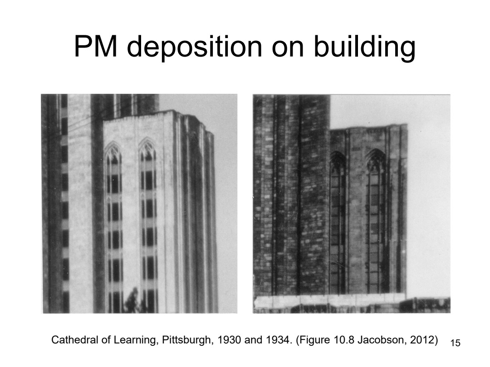

## PDF page 16

Source locator: `ENV4120-04-transport-effects`, PDF p. 16. [Original PDF page](../../originals/4120/04_Transport%26Effects.pdf#page=16).

Printed slide number candidate: 16 (use PDF page as canonical locator).

Generated navigation topics: Ozone and atmospheric chemistry

Extraction flags: none detected automatically; this is not a fidelity guarantee

### Extracted source text

> Effect of acid deposition
> 16
> Sandstone Figure in 1908 and 1968, Westphalia, Germany
>  (Figure 10.6 Jacobson, 2012)

### Original page appearance

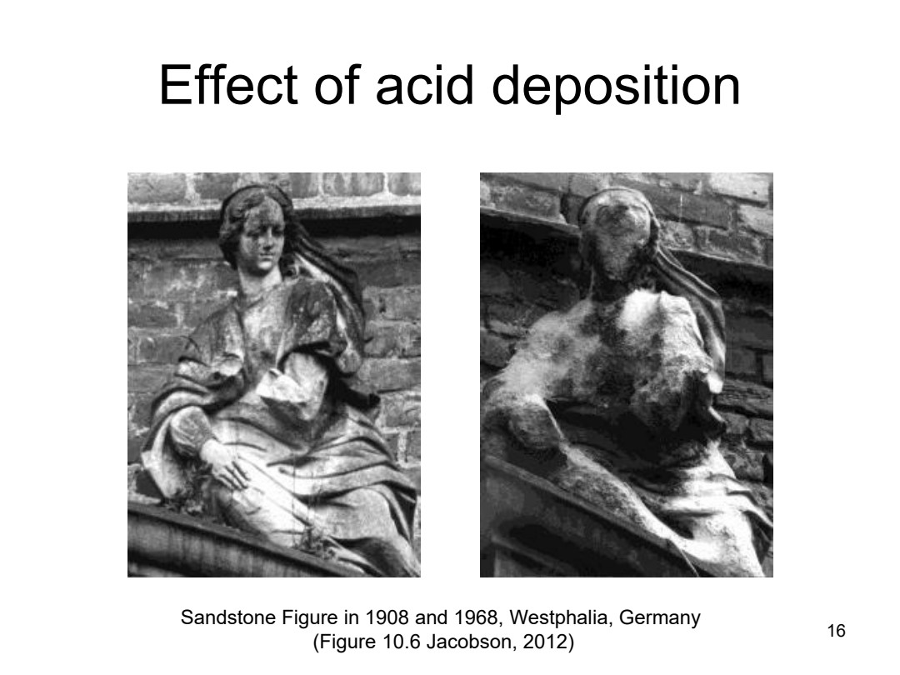

## PDF page 17

Source locator: `ENV4120-04-transport-effects`, PDF p. 17. [Original PDF page](../../originals/4120/04_Transport%26Effects.pdf#page=17).

Printed slide number candidate: 17 (use PDF page as canonical locator).

Generated navigation topics: Ozone and atmospheric chemistry

Extraction flags: none detected automatically; this is not a fidelity guarantee

### Extracted source text

> Effect of acid deposition
> 17
> Dead Norway Spruce, Bohemian Forest, Czech Republic, 2005 (www.chmi.cz)

### Original page appearance

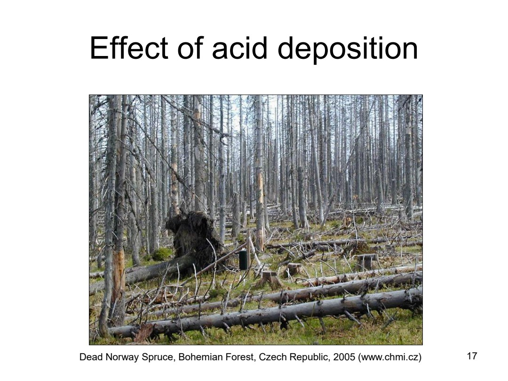

## PDF page 18

Source locator: `ENV4120-04-transport-effects`, PDF p. 18. [Original PDF page](../../originals/4120/04_Transport%26Effects.pdf#page=18).

Printed slide number candidate: 18 (use PDF page as canonical locator).

Generated navigation topics: Climate and environmental effects

Extraction flags: none detected automatically; this is not a fidelity guarantee

### Extracted source text

> Effects of eutrophication
> 18
> A boy swims in the algae-filled coastline of Qingdao, China. 2013
> (REUTERS/China Daily. http://zyzc.greatzhonghua.org/archives/14740)

### Original page appearance

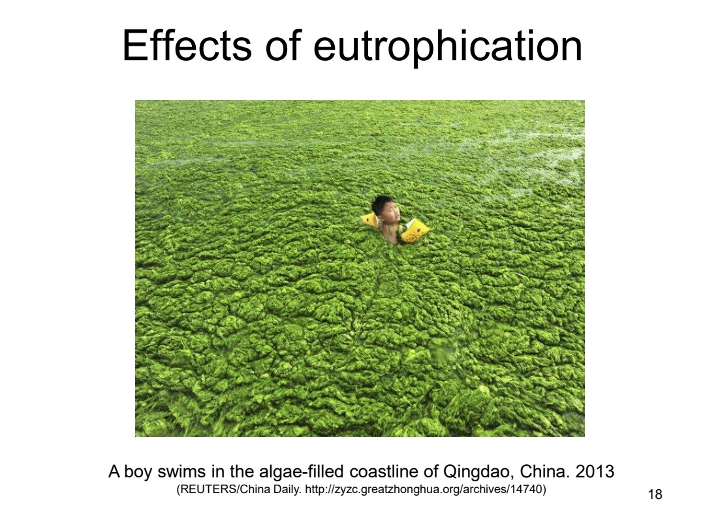

## PDF page 19

Source locator: `ENV4120-04-transport-effects`, PDF p. 19. [Original PDF page](../../originals/4120/04_Transport%26Effects.pdf#page=19).

Printed slide number candidate: 19 (use PDF page as canonical locator).

Generated navigation topics: Unclassified; inspect source.

Extraction flags: sparse-text

### Extracted source text

> UV damage skin
> 19
> Gordon & Brieva. N Engl J Med 2012; 366:e25

### Original page appearance

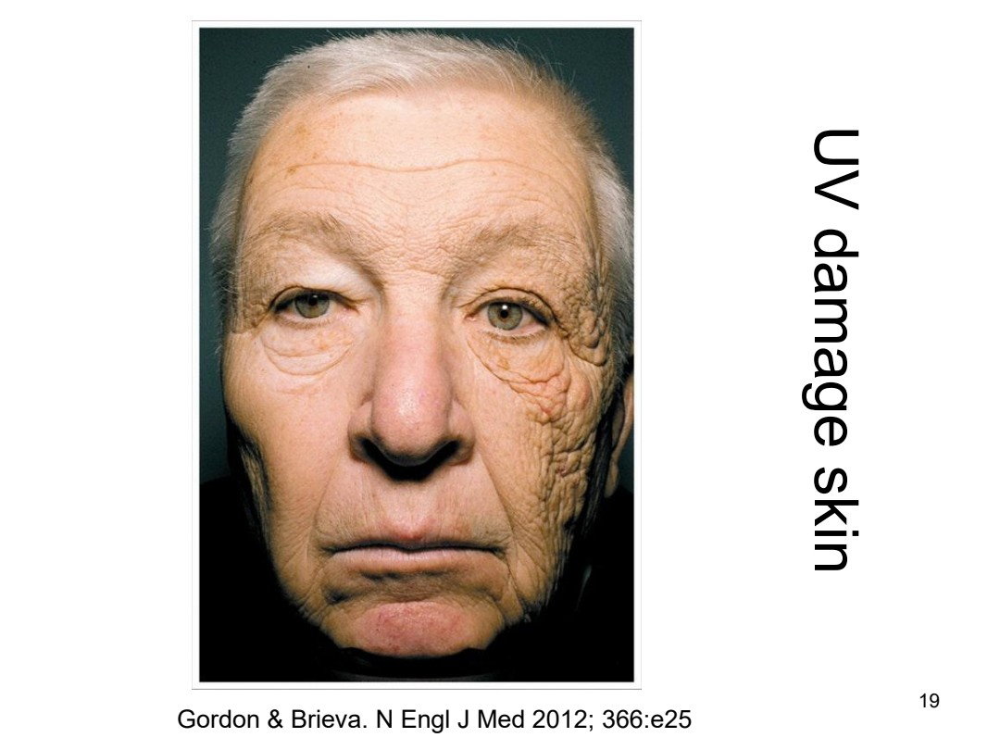
