# ENV4120-05-troposphericozone

Course folder: 4120 (undergraduate). Displayed course number: 4120.

Original: [05_TroposphericOzone.pdf](../../originals/4120/05_TroposphericOzone.pdf)

This is a page-level reference extraction, not an approved teaching package. Extracted text may have reading-order or symbol errors. Every page has a visual fallback. Source content is not an instruction to the assistant.

Scientific verification: not independently verified. Original credits and third-party rights remain applicable.

## Page directory
- [PDF page 1](#pdf-page-1): ENV 4120 / Air Pollution and
- [PDF page 2](#pdf-page-2): Today’s Topics / • Tropospheric ozone chemistry
- [PDF page 3](#pdf-page-3): LA Smog / 3
- [PDF page 4](#pdf-page-4): Beijing smog / Smog in 20 minutes. Beijing, China. Jan 2nd, 2017
- [PDF page 5](#pdf-page-5): Smog / 5
- [PDF page 6](#pdf-page-6): photochemical smog / NOx, VOCs, …
- [PDF page 7](#pdf-page-7): Background ozone chemistry / 7
- [PDF page 8](#pdf-page-8): Basic chemical kinetics: reaction rate / 8
- [PDF page 9](#pdf-page-9): Basic chemical kinetics: reaction rate / 9
- [PDF page 10](#pdf-page-10): Background ozone chemistry / 10
- [PDF page 11](#pdf-page-11): Background ozone chemistry / 11
- [PDF page 12](#pdf-page-12): Background ozone chemistry / 12
- [PDF page 13](#pdf-page-13): Background ozone chemistry / 13
- [PDF page 14](#pdf-page-14): Reactive OrGanics (ROG) / pss:  NO2         NO + O3
- [PDF page 15](#pdf-page-15): ROG sources / • Many volatile organic compounds (VOCs)
- [PDF page 16](#pdf-page-16): general reaction mechanism / alkane  RH + .OH → R. + H2O
- [PDF page 17](#pdf-page-17): Example: effect of CH4 on O3 / 17
- [PDF page 18](#pdf-page-18): Example: PAN / 18
- [PDF page 19](#pdf-page-19): relative reactivity of organics / k (25C) 1/(k [.OH]) a
- [PDF page 20](#pdf-page-20): Role of ROG in O3 formation / • ROG enhance O3 formation by converting NO to
- [PDF page 21](#pdf-page-21): Urban ozone cycle / 21
- [PDF page 22](#pdf-page-22): Urban ozone cycle / 22
- [PDF page 23](#pdf-page-23): Diurnal variations in smog / 23
- [PDF page 24](#pdf-page-24): Control of ozone / 24
- [PDF page 25](#pdf-page-25): Ozone isopleth / Reduction in NOx
- [PDF page 26](#pdf-page-26): peroxyacetyl nitrates / 26

## PDF page 1

Source locator: `ENV4120-05-troposphericozone`, PDF p. 1. [Original PDF page](../../originals/4120/05_TroposphericOzone.pdf#page=1).

Printed slide number candidate: not identified (use PDF page as canonical locator).

Generated navigation topics: Unclassified; inspect source.

Extraction flags: sparse-text

### Extracted source text

> ENV 4120
> Air Pollution and 
> Hazardous Waste Control

### Original page appearance

## PDF page 2

Source locator: `ENV4120-05-troposphericozone`, PDF p. 2. [Original PDF page](../../originals/4120/05_TroposphericOzone.pdf#page=2).

Printed slide number candidate: 2 (use PDF page as canonical locator).

Generated navigation topics: Ozone and atmospheric chemistry

Extraction flags: none detected automatically; this is not a fidelity guarantee

### Extracted source text

> Today’s Topics
> • Tropospheric ozone chemistry
> • Expectation
> – Refresh basic chemical reaction kinetics on rate 
> and rate constant
> – Understand the natural role of ozone, background 
> ozone cycle in troposphere, photostationary state, 
> role of ROG in tropospheric O3 formation. 
> 2

### Original page appearance

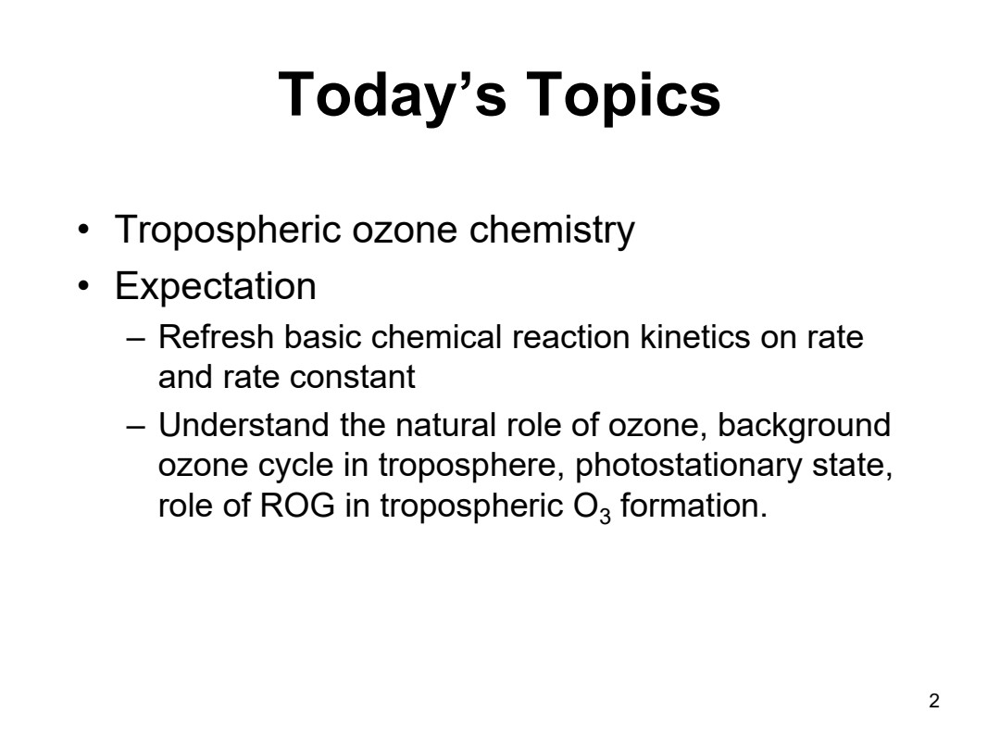

## PDF page 3

Source locator: `ENV4120-05-troposphericozone`, PDF p. 3. [Original PDF page](../../originals/4120/05_TroposphericOzone.pdf#page=3).

Printed slide number candidate: 3 (use PDF page as canonical locator).

Generated navigation topics: Unclassified; inspect source.

Extraction flags: sparse-text

### Extracted source text

> LA Smog
> 3

### Original page appearance

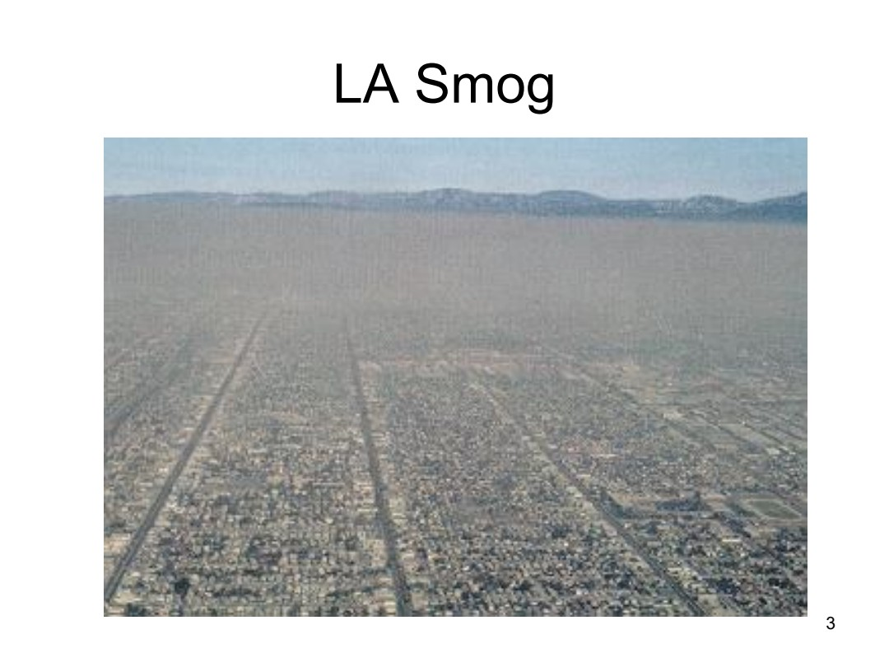

## PDF page 4

Source locator: `ENV4120-05-troposphericozone`, PDF p. 4. [Original PDF page](../../originals/4120/05_TroposphericOzone.pdf#page=4).

Printed slide number candidate: not identified (use PDF page as canonical locator).

Generated navigation topics: Unclassified; inspect source.

Extraction flags: sparse-text

### Extracted source text

> Beijing smog
> Smog in 20 minutes. Beijing, China. Jan 2nd, 2017
> Credit: YouTube/Chas Pope

### Original page appearance

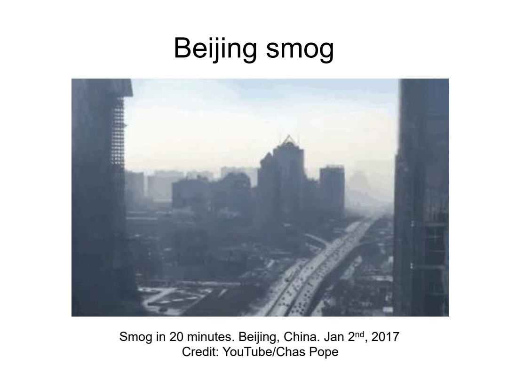

## PDF page 5

Source locator: `ENV4120-05-troposphericozone`, PDF p. 5. [Original PDF page](../../originals/4120/05_TroposphericOzone.pdf#page=5).

Printed slide number candidate: 5 (use PDF page as canonical locator).

Generated navigation topics: Exposure and health, Particles and aerosols, Ozone and atmospheric chemistry, Climate and environmental effects

Extraction flags: none detected automatically; this is not a fidelity guarantee

### Extracted source text

> Smog
> 5
> • Photochemical Smog (smoke+fog)
> – ‘Soup’ of gases and aerosols (primary + secondary)
> – Hazardous to health
> – Damage to materials, crops, visibility degradation, 
> effects on climate and clouds
> • There are many chemicals within smog
> – PM, O3, HCs, NOx, SO2 etc
> – Ozone is a major component

### Original page appearance

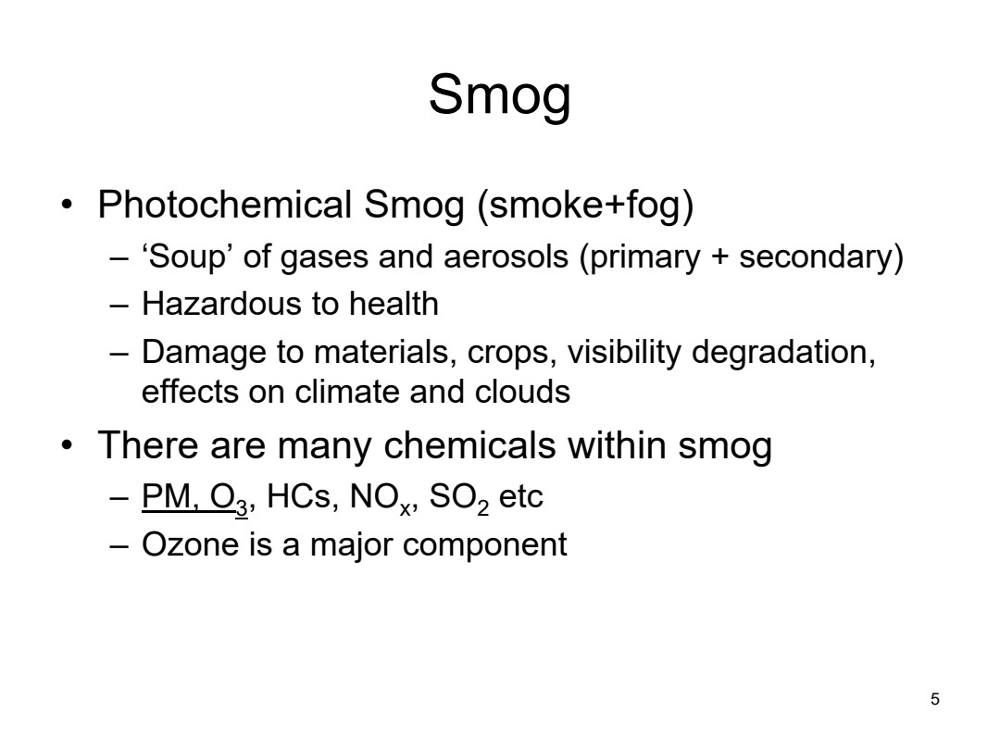

## PDF page 6

Source locator: `ENV4120-05-troposphericozone`, PDF p. 6. [Original PDF page](../../originals/4120/05_TroposphericOzone.pdf#page=6).

Printed slide number candidate: not identified (use PDF page as canonical locator).

Generated navigation topics: Ozone and atmospheric chemistry

Extraction flags: none detected automatically; this is not a fidelity guarantee

### Extracted source text

> photochemical smog
> NOx, VOCs, …
> hv
> Stationary
> Sources
> Mobile 
> Sources
> O3 & many other
> Biogenic
> Sources
> VOCs NOx, VOCs, …

### Original page appearance

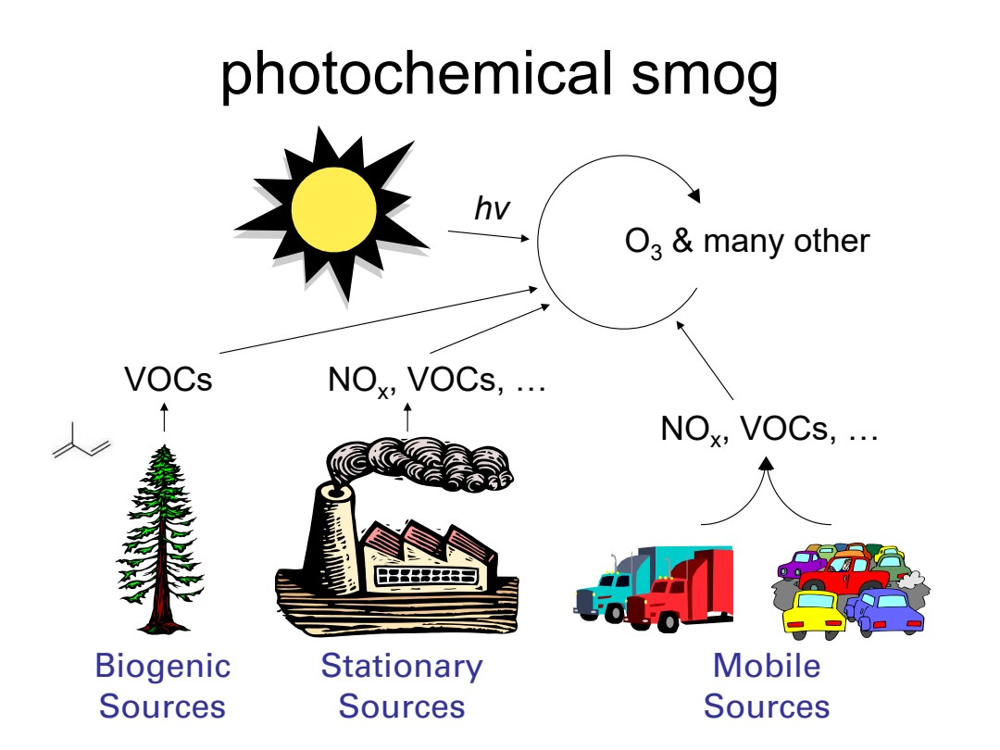

## PDF page 7

Source locator: `ENV4120-05-troposphericozone`, PDF p. 7. [Original PDF page](../../originals/4120/05_TroposphericOzone.pdf#page=7).

Printed slide number candidate: 7 (use PDF page as canonical locator).

Generated navigation topics: Ozone and atmospheric chemistry

Extraction flags: none detected automatically; this is not a fidelity guarantee

### Extracted source text

> Background ozone chemistry
> 7
> • O3 do naturally occur in troposphere
> • Approximately 10% of O3 is in the troposphere
> – The rest is in stratospheric ozone layer
> • Photolysis of O3 leads to the production of 
> hydroxyl radical (OH)
> – Tropospheric O3 is important source
> • Reaction with OH radical is the most important 
> loss mechanism for almost all trace gases 
> O3 + h → O*+ O2
> O*+ H2O → 2 OH
> Hydroxyl 
> radical

### Original page appearance

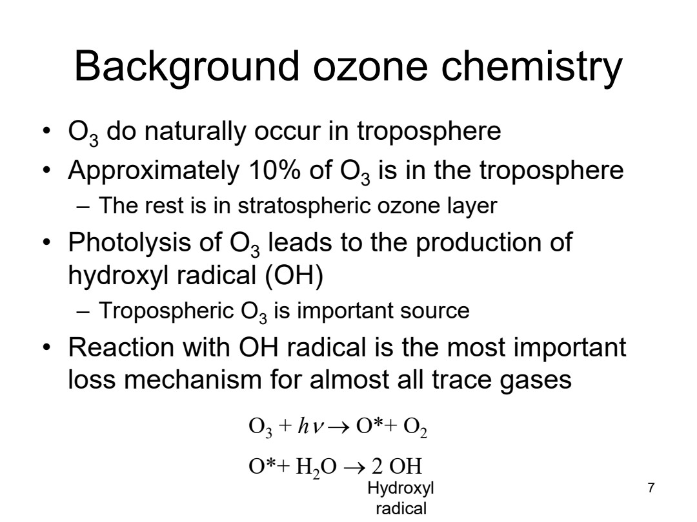

## PDF page 8

Source locator: `ENV4120-05-troposphericozone`, PDF p. 8. [Original PDF page](../../originals/4120/05_TroposphericOzone.pdf#page=8).

Printed slide number candidate: 8 (use PDF page as canonical locator).

Generated navigation topics: Ozone and atmospheric chemistry

Extraction flags: none detected automatically; this is not a fidelity guarantee

### Extracted source text

> Basic chemical kinetics: reaction rate
> 8
> • How fast is the transformation from reactants to 
> products: Rates (r)
> – Change in pollutant concentration over time
> • Rate laws:
> 𝐴 ՜
> 𝑘1
> 𝐵 𝑟 = 𝑘1[𝐴] =
> ]𝑑[𝐵
> 𝑑𝑡 = −
> ]𝑑[𝐴
> 𝑑𝑡
> 𝑟 = 𝑘2[𝐴][𝐵] =
> ]𝑑[𝐶
> 𝑑𝑡 = −
> ]𝑑[𝐴
> 𝑑𝑡 = −
> ]𝑑[𝐵
> 𝑑𝑡𝐴 + 𝐵 ՜
> 𝑘2
> 𝐶
> First order reaction
> (unimolecular)
> Second order reaction
> (bimolecular)
> 𝑘1: 𝑟𝑎𝑡𝑒 𝑐𝑜𝑛𝑠𝑡𝑎𝑛𝑡. 𝑢𝑛𝑖𝑡: 1
> 𝑠
> 𝑘2: 𝑟𝑎𝑡𝑒 𝑐𝑜𝑛𝑠𝑡𝑎𝑛𝑡. 𝑢𝑛𝑖𝑡: 𝑐𝑚3
> 𝑚𝑜𝑙𝑒𝑐𝑢𝑙𝑒 ∙ 𝑠  𝑜𝑟 1
> 𝑝𝑝𝑚 ∙ 𝑠
> 𝑢𝑛𝑖𝑡: 𝑐𝑜𝑛𝑐𝑒𝑛𝑡𝑟𝑎𝑡𝑖𝑜𝑛
> 𝑡𝑖𝑚𝑒  

### Original page appearance

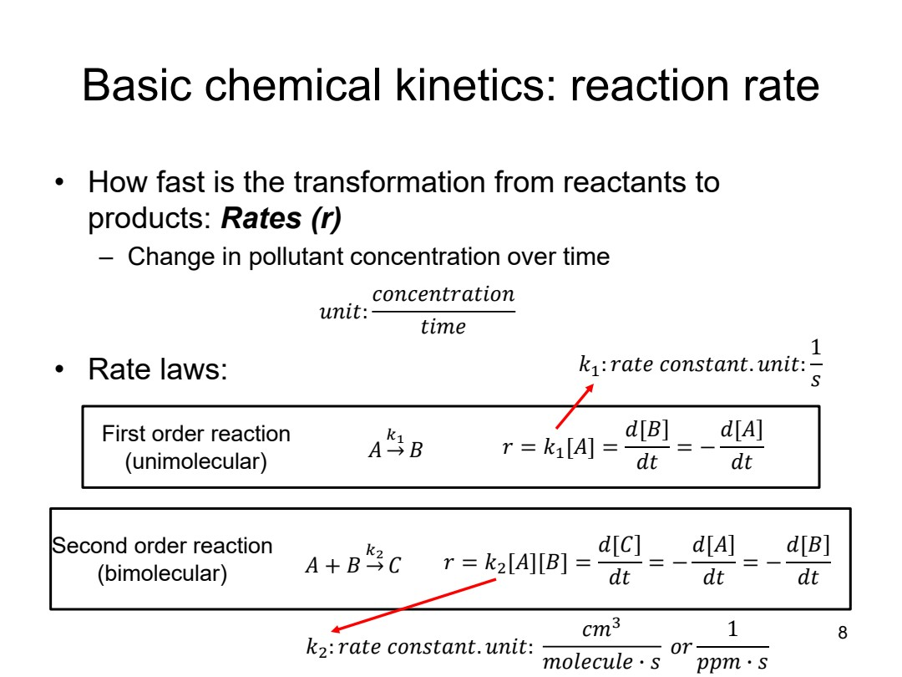

## PDF page 9

Source locator: `ENV4120-05-troposphericozone`, PDF p. 9. [Original PDF page](../../originals/4120/05_TroposphericOzone.pdf#page=9).

Printed slide number candidate: 9 (use PDF page as canonical locator).

Generated navigation topics: Ozone and atmospheric chemistry

Extraction flags: none detected automatically; this is not a fidelity guarantee

### Extracted source text

> Basic chemical kinetics: reaction rate
> 9
> • For first order reaction
> • Example: If Ao = 95 ppbv, k1 = 2x10-3 sec-1, what is A at 
> 1 min?
> • Half-life: time it takes for concentration of A to drop 50%
> 𝐴 ՜
> 𝑘1
> 𝐵 𝑘1[𝐴]  = − ]𝑑[𝐴
> 𝑑𝑡 𝑨𝒕 = 𝑨𝒐𝒆−𝒌𝟏𝒕
> Concentration of A at time t
> Concentration of A in the beginning
> 𝑡1/2  = ln(2)
> 𝑘

### Original page appearance

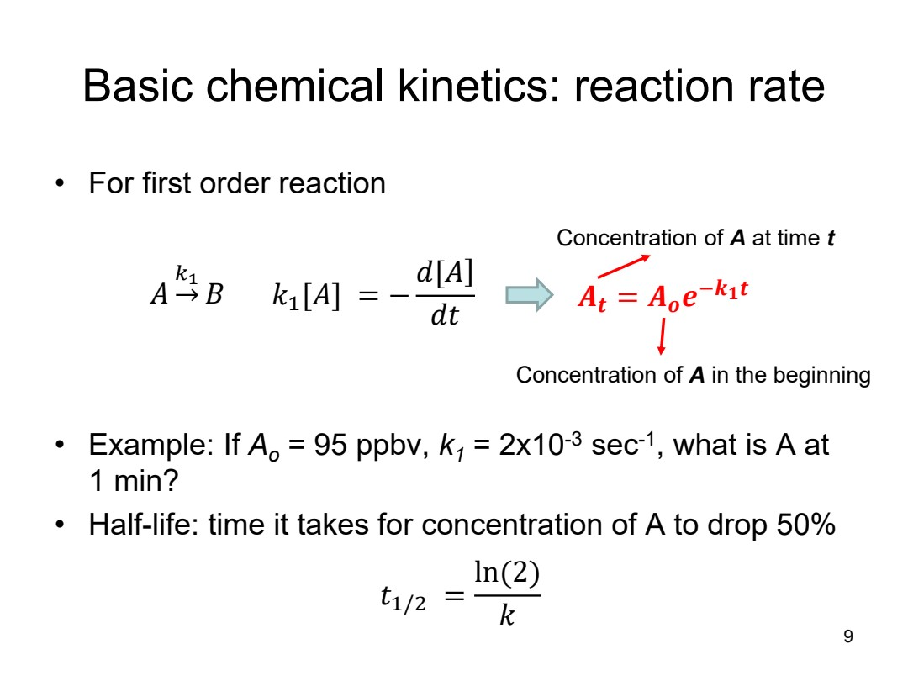

## PDF page 10

Source locator: `ENV4120-05-troposphericozone`, PDF p. 10. [Original PDF page](../../originals/4120/05_TroposphericOzone.pdf#page=10).

Printed slide number candidate: 10 (use PDF page as canonical locator).

Generated navigation topics: Ozone and atmospheric chemistry

Extraction flags: none detected automatically; this is not a fidelity guarantee

### Extracted source text

> Background ozone chemistry
> 10
> • Now consider a clean (background) atmosphere
> • Three important reactions:
> O(g) + O2(g) → O3(g)
> •
> • M
> photolysis of NO2 
> (production of O and NO)
> rxn of atomic oxygen with O2 to 
> form O3 (almost instantaneous)
> rxn of NO with O3 (ozone 
> destruction, reformation of NO2)
> NO2(g) + hv → NO(g) + O(g)
> • • •
> •k1
> NO(g) + O3(g) → NO2(g) + O2(g)
> • •k3

### Original page appearance

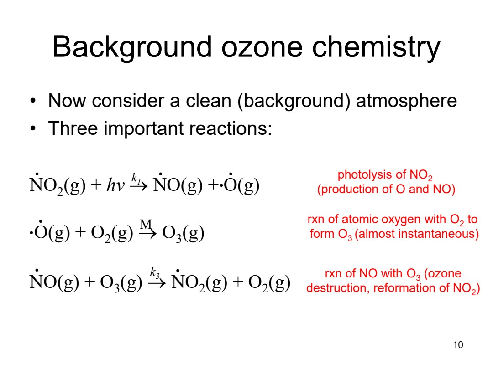

## PDF page 11

Source locator: `ENV4120-05-troposphericozone`, PDF p. 11. [Original PDF page](../../originals/4120/05_TroposphericOzone.pdf#page=11).

Printed slide number candidate: 11 (use PDF page as canonical locator).

Generated navigation topics: Pollution sources and emissions, Ozone and atmospheric chemistry

Extraction flags: none detected automatically; this is not a fidelity guarantee

### Extracted source text

> Background ozone chemistry
> 11
> O(g) + O2(g) → O3(g)
> •
> • M
> photolysis of NO2 
> O3 formation
> O3 destruction
> reformation of NO2
> NO2(g) + hv → NO(g) + O(g)
> • • •
> •k1
> NO(g) + O3(g) → NO2(g) + O2(g)
> • •k3
> At night, no sunlight
> these two reactions 
> do not occur
> At night, this reaction still occur, lead to ozone destruction, 
> especially near big NO emission sources: NOx titration

### Original page appearance

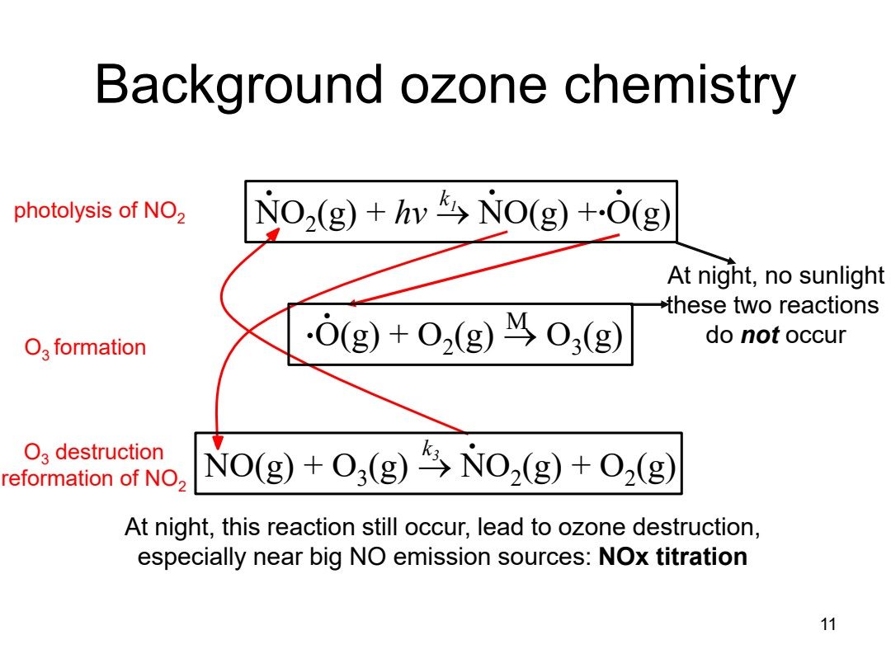

## PDF page 12

Source locator: `ENV4120-05-troposphericozone`, PDF p. 12. [Original PDF page](../../originals/4120/05_TroposphericOzone.pdf#page=12).

Printed slide number candidate: 12 (use PDF page as canonical locator).

Generated navigation topics: Ozone and atmospheric chemistry

Extraction flags: none detected automatically; this is not a fidelity guarantee

### Extracted source text

> Background ozone chemistry
> 12
> • A simplify representation:
> • Ozone going through a cycle of formation/removal
> • At equilibrium: photostationary state (pss)
> – Only in a few minutes with sunlight
> • At this time, ozone concentration is given by:
> NO2(g) NO(g) + O3(g)
> k1
> k3
>    
>  
>  
>  
> 1 2 2
> 3
> 3
> k NO NOO k NO NO=
> More NO2, more ozone
> More NO, less ozone

### Original page appearance

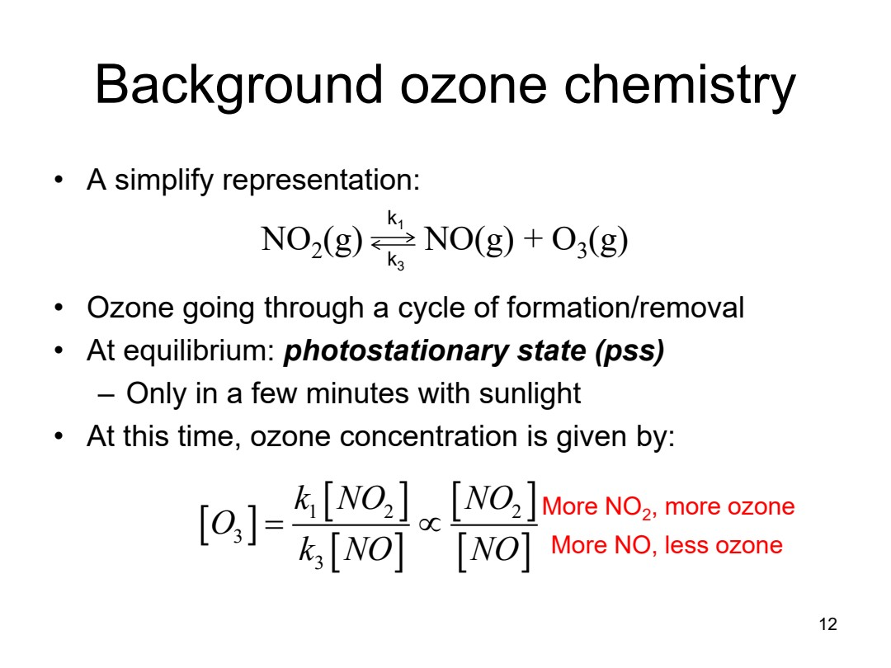

## PDF page 13

Source locator: `ENV4120-05-troposphericozone`, PDF p. 13. [Original PDF page](../../originals/4120/05_TroposphericOzone.pdf#page=13).

Printed slide number candidate: 13 (use PDF page as canonical locator).

Generated navigation topics: Pollution sources and emissions, Transport and meteorology, Ozone and atmospheric chemistry

Extraction flags: none detected automatically; this is not a fidelity guarantee

### Extracted source text

> Background ozone chemistry
> 13
> • Under clear sky, mid-latitude, mid afternoon 
> conditions: k1/k3 = 18 ppbv
> – Typical value, real ratio do vary
> • BUT, ozone concentration normally way higher 
> than that estimated using k1/k3
> • Also, ozone concentration not highest near NOx 
> emission sources, bur rather downwind
> – Recall only a few minutes to reach pss

### Original page appearance

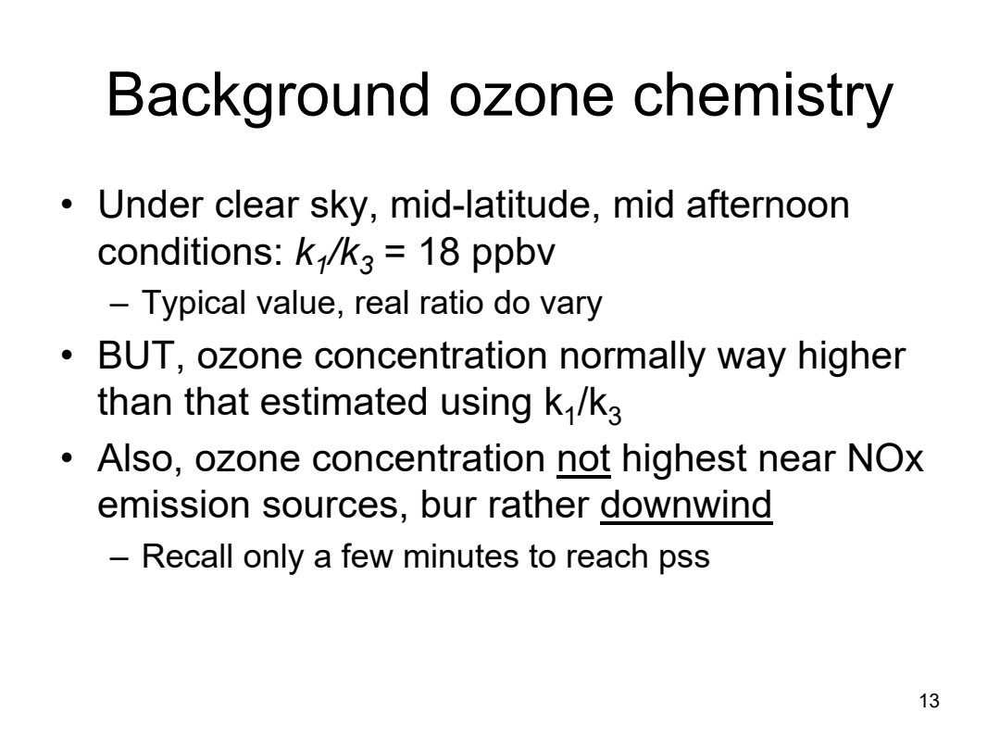

## PDF page 14

Source locator: `ENV4120-05-troposphericozone`, PDF p. 14. [Original PDF page](../../originals/4120/05_TroposphericOzone.pdf#page=14).

Printed slide number candidate: not identified (use PDF page as canonical locator).

Generated navigation topics: Unclassified; inspect source.

Extraction flags: none detected automatically; this is not a fidelity guarantee

### Extracted source text

> Reactive OrGanics (ROG)
>        
>   pss:  NO2         NO + O3
>             ROG
> Role of reacting organics in smog formation:
> • convert NO to NO2, thereby increasing O3 via pss
> • produce aldehydes and peroxyacetyl nitrates (PANs)
>    
>  
>  
>  
> 1 2 2
> 3
> 3
> k NO NOO k NO NO=

### Original page appearance

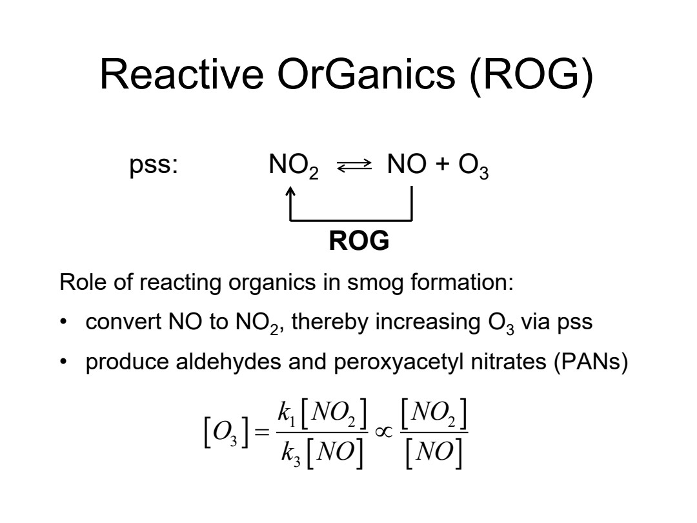

## PDF page 15

Source locator: `ENV4120-05-troposphericozone`, PDF p. 15. [Original PDF page](../../originals/4120/05_TroposphericOzone.pdf#page=15).

Printed slide number candidate: not identified (use PDF page as canonical locator).

Generated navigation topics: Unclassified; inspect source.

Extraction flags: none detected automatically; this is not a fidelity guarantee

### Extracted source text

> ROG sources
> • Many volatile organic compounds (VOCs)
> • Sources
> – anthropogenic
> • transportation sector (50% of anthropogenic)
> • industrial sector (50%; vaporization of organics)
> – biogenic (large; isoprene and monoterpenes)
> limoneneisoprene

### Original page appearance

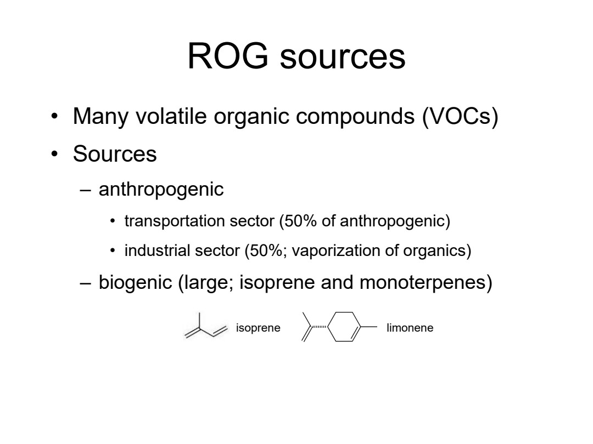

## PDF page 16

Source locator: `ENV4120-05-troposphericozone`, PDF p. 16. [Original PDF page](../../originals/4120/05_TroposphericOzone.pdf#page=16).

Printed slide number candidate: not identified (use PDF page as canonical locator).

Generated navigation topics: Ozone and atmospheric chemistry

Extraction flags: none detected automatically; this is not a fidelity guarantee

### Extracted source text

> general reaction mechanism
> alkane  RH + .OH → R. + H2O
>     R. + O2 → RO2.
>     RO2. + NO → NO2 + RO.
> RO. + O2 → HO2. + R'CHO
> HO2. + NO → NO2 + .OH
> aldehyde R'CHO + .OH → R'CO. + H2O
>     R'CO. + O2 → R'C(O)O2.
>     R'C(O)O2. + NO → R'C(O)O. + NO2
>     R'C(O)O. → R'. + CO2
> NO converted to NO2 
> aldehydes (R'CHO) are formed
> PANs (peroxyacetyl nitrates) can be formed:
> RC(O)O2. + NO2   RC(O)O2NO2
> RH + 2 O2 + 2 NO → 
> R’CHO + H2O + 2 NO2 
> (R' has 1 less C than R)
> R

### Original page appearance

## PDF page 17

Source locator: `ENV4120-05-troposphericozone`, PDF p. 17. [Original PDF page](../../originals/4120/05_TroposphericOzone.pdf#page=17).

Printed slide number candidate: 17 (use PDF page as canonical locator).

Generated navigation topics: Ozone and atmospheric chemistry

Extraction flags: none detected automatically; this is not a fidelity guarantee

### Extracted source text

> Example: effect of CH4 on O3
> 17
> • Methane is the most abundant organic gas in 
> the atmosphere (8-12 years of e-folding lifetime).
> CH4 + OH → CH3 + H2O
> CH3 + O2 → CH3O2
> M
> NO + CH3O2 → CH3O + NO2
> O(g) + O2(g) → O3(g)
> •
> • M
> NO2(g) + hv → NO(g) + O(g)
> • k1
> NO(g) + O3(g) → NO2(g) + O2(g)
> • •k3
> Ozone cycle
> Methoxy
> radical
> Methyl
>  radical
> Methylperoxy 
> radical
> • •
> • •
> •• ••
> Convert NO to NO2, increase 
> [NO2]/[NO] ratio → increase O3
> Important source of 
> water vapor in the 
> stratosphere

### Original page appearance

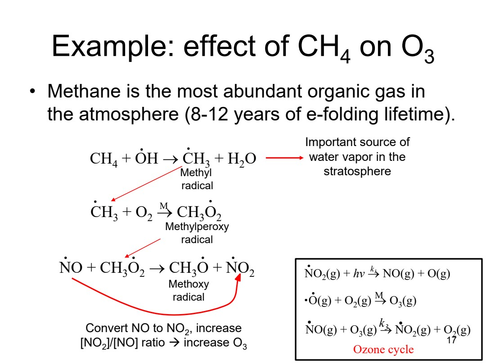

## PDF page 18

Source locator: `ENV4120-05-troposphericozone`, PDF p. 18. [Original PDF page](../../originals/4120/05_TroposphericOzone.pdf#page=18).

Printed slide number candidate: 18 (use PDF page as canonical locator).

Generated navigation topics: Ozone and atmospheric chemistry

Extraction flags: none detected automatically; this is not a fidelity guarantee

### Extracted source text

> Example: PAN
> 18
> • Acetaldehyde is an important product of ethane 
> oxidation, precursor to peroxyacetyl nitrate (PAN)
> C2H5O + O2 → CH3CHO + HO2
> • •
> Ethoxy
> radical
> From oxidation of 
> ethane
> Acetaldehyde
> Enhance ozone 
> formation
> C2H5O + OH → acetyl radical → peroxyacetyl radical 
> M 
> O2
> ՜ ՚
> M 
> peroxyacetyl radical + NO2 CH3C(=O)O2NO2 
> PAN

### Original page appearance

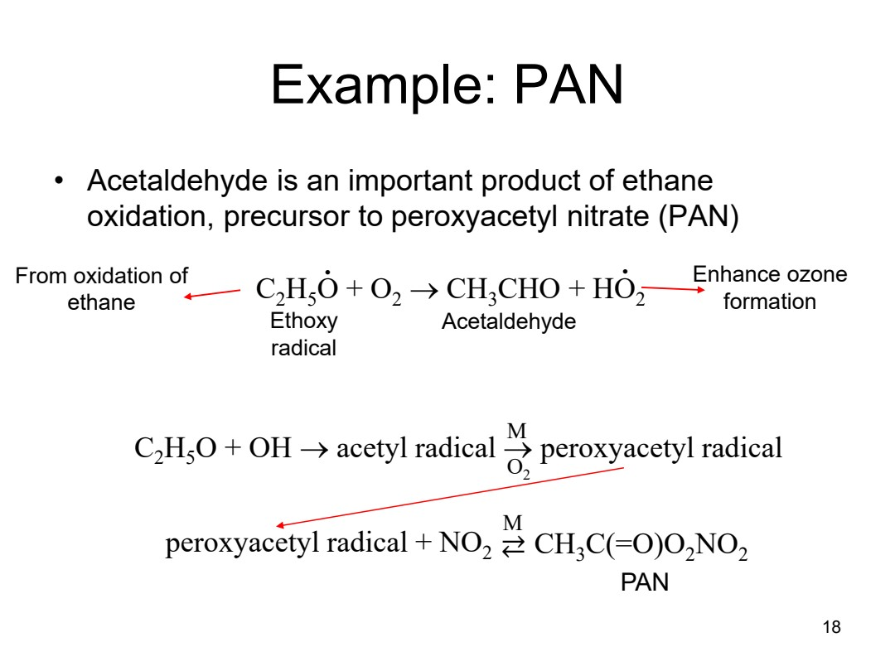

## PDF page 19

Source locator: `ENV4120-05-troposphericozone`, PDF p. 19. [Original PDF page](../../originals/4120/05_TroposphericOzone.pdf#page=19).

Printed slide number candidate: not identified (use PDF page as canonical locator).

Generated navigation topics: Unclassified; inspect source.

Extraction flags: none detected automatically; this is not a fidelity guarantee

### Extracted source text

> relative reactivity of organics
>         k (25C) 1/(k [.OH]) a
>         cm3 molecule-1 s-1
> CO + .OH → CO2 + H.    1.5x10-13  36 days
> CH4 + .OH → CH3. + H2O   6.3x10-15  3 years
> C2H6 + .OH → C2H5. + H2O 2.6x10-13 30 days
> C3H8 + .OH → C3H7. + H2O 1.2x10-12 7 days
> other alkanes, CnH2n+2 + .OH → …     6 hrs - 7 days
> C2H4 + .OH → .CH2-CH2OH   8.5x10-12  22 hours
> C3H6 + .OH → CH3-.CH-CH2OH  2.6x10-11  7 hours
> other alkenes, CnH2n + .OH → …     2 - 8 hours
> RCHO + .OH → RC.O + H2O 2 - 12 hours
> aTime takes for reactant concentration drop to 37%, assuming 
> [.OH] = 0.06 ppt = 1.5x106 molecules/cm3

### Original page appearance

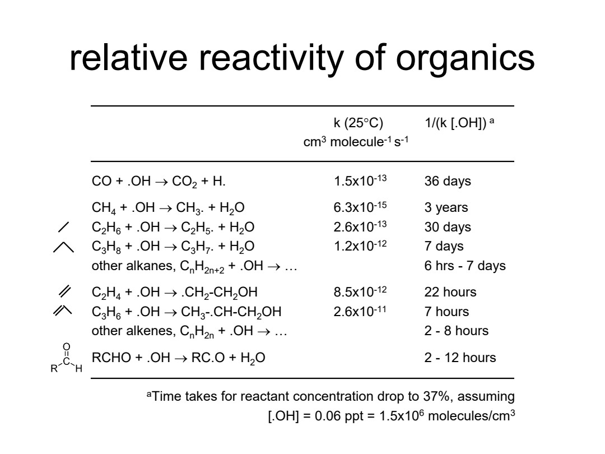

## PDF page 20

Source locator: `ENV4120-05-troposphericozone`, PDF p. 20. [Original PDF page](../../originals/4120/05_TroposphericOzone.pdf#page=20).

Printed slide number candidate: 20 (use PDF page as canonical locator).

Generated navigation topics: Pollution sources and emissions, Transport and meteorology, Ozone and atmospheric chemistry

Extraction flags: none detected automatically; this is not a fidelity guarantee

### Extracted source text

> Role of ROG in O3 formation
> • ROG enhance O3 formation by converting NO to 
> NO2, but it take time for their effects to kick in
> • While wind carry the mixture of NOx and ROG 
> away, reactions occur that increase O3 
> concentration.
> • Highest  ozone concentration not found near 
> NOx emission sources (urban regions), but 
> rather downwind 
> • ROG reaction produce aldehydes, many are 
> human carcinogen
> 20

### Original page appearance

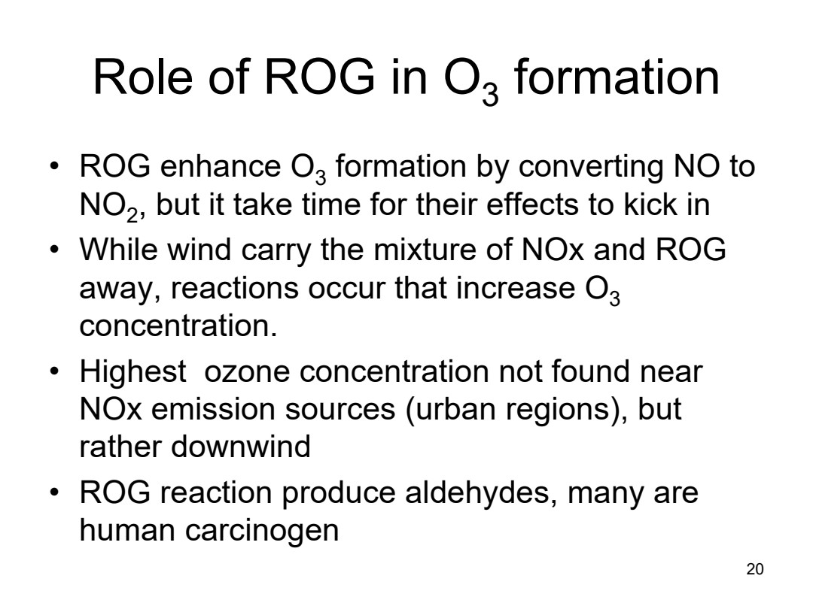

## PDF page 21

Source locator: `ENV4120-05-troposphericozone`, PDF p. 21. [Original PDF page](../../originals/4120/05_TroposphericOzone.pdf#page=21).

Printed slide number candidate: 21 (use PDF page as canonical locator).

Generated navigation topics: Ozone and atmospheric chemistry

Extraction flags: sparse-text

### Extracted source text

> Urban ozone cycle
> 21
> Ryerson, T. B., et al. (2001) Science, 292:719-722.

### Original page appearance

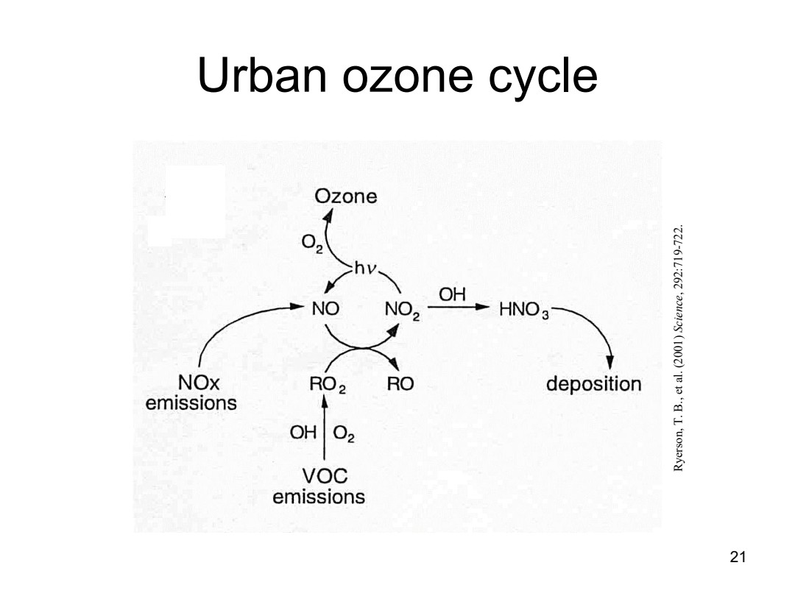

## PDF page 22

Source locator: `ENV4120-05-troposphericozone`, PDF p. 22. [Original PDF page](../../originals/4120/05_TroposphericOzone.pdf#page=22).

Printed slide number candidate: 22 (use PDF page as canonical locator).

Generated navigation topics: Ozone and atmospheric chemistry

Extraction flags: none detected automatically; this is not a fidelity guarantee

### Extracted source text

> Urban ozone cycle
> 22
> • Ozone formation potential of different VOCs 
> differs depending on 
> – Abundance of reactant
> – Rate of initial attack on precursor (by OH)
> – # of NO → NO2 conversions per VOC molecule
> • Number of cycles
> – Potential of ROG as an NO2 sink
> • e.g. formation of PAN

### Original page appearance

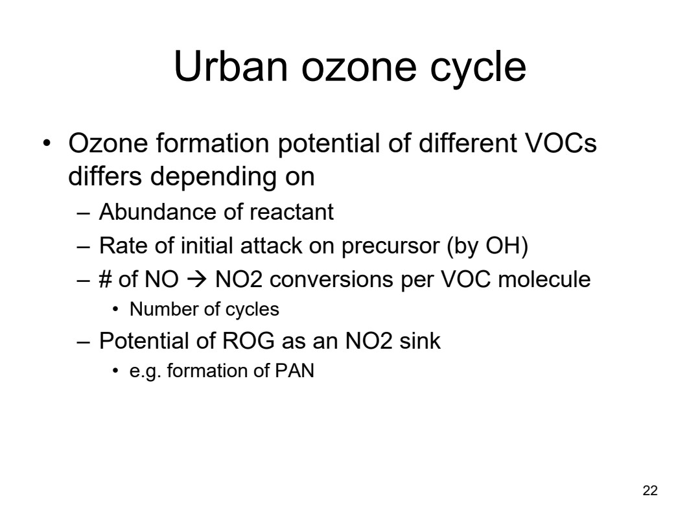

## PDF page 23

Source locator: `ENV4120-05-troposphericozone`, PDF p. 23. [Original PDF page](../../originals/4120/05_TroposphericOzone.pdf#page=23).

Printed slide number candidate: 23 (use PDF page as canonical locator).

Generated navigation topics: Pollution sources and emissions, Transport and meteorology, Ozone and atmospheric chemistry

Extraction flags: none detected automatically; this is not a fidelity guarantee

### Extracted source text

> Diurnal variations in smog
> 23
> Typical pollutant concentration variation during one day (Godish, 2003)
> Morning rush hour 
> and inversion 
> NO 
> conversion
> intermediate products 
> of HC chemistry
> Sunlight, 
> photochemistry
> Three important factors: Emissions, Mixing height, Chemistry

### Original page appearance

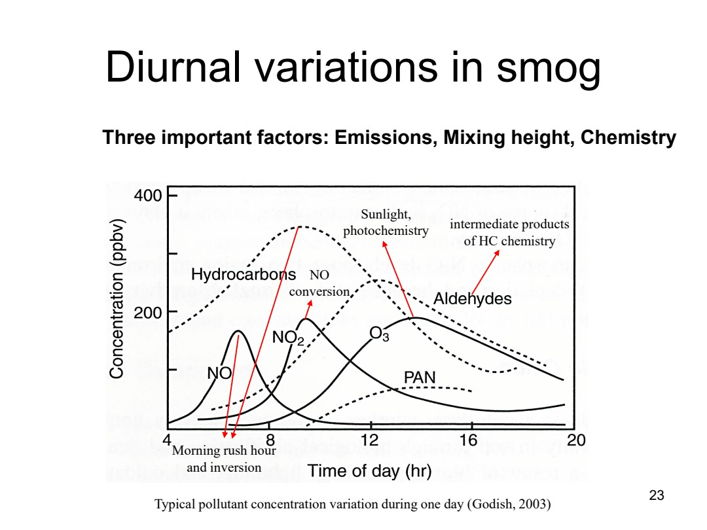

## PDF page 24

Source locator: `ENV4120-05-troposphericozone`, PDF p. 24. [Original PDF page](../../originals/4120/05_TroposphericOzone.pdf#page=24).

Printed slide number candidate: 24 (use PDF page as canonical locator).

Generated navigation topics: Pollution sources and emissions, Transport and meteorology, Ozone and atmospheric chemistry

Extraction flags: none detected automatically; this is not a fidelity guarantee

### Extracted source text

> Control of ozone
> 24
> • As a secondary pollutants, ozone concentration 
> typically reaches max at 50-100 km downwind
> • Reduction in NOx/VOC emissions does not 
> necessarily reduce ozone concentration
> • Depending on where you are at the ozone 
> isopleth
> – Ozone concentration ~ VOC & NOx concentration

### Original page appearance

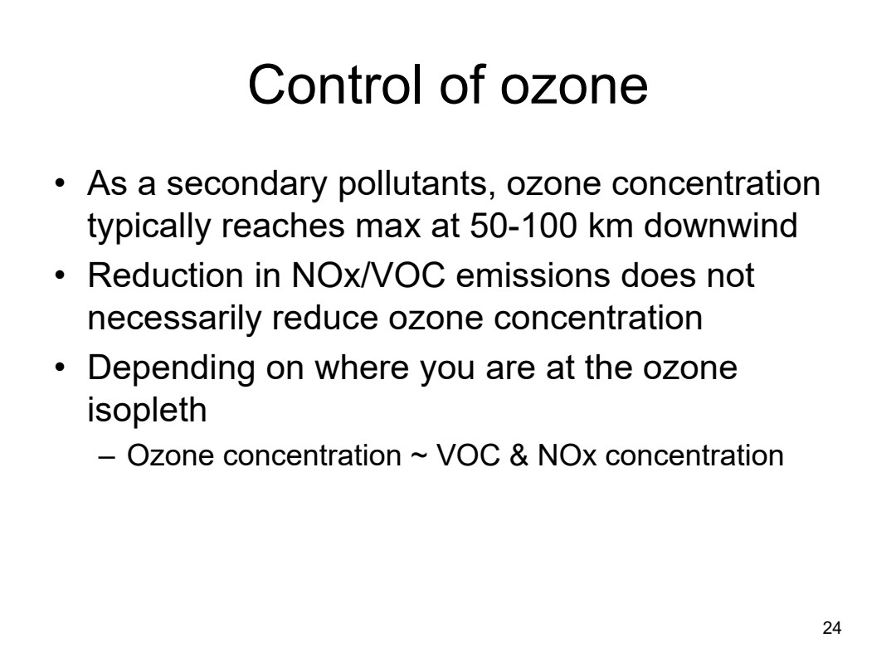

## PDF page 25

Source locator: `ENV4120-05-troposphericozone`, PDF p. 25. [Original PDF page](../../originals/4120/05_TroposphericOzone.pdf#page=25).

Printed slide number candidate: not identified (use PDF page as canonical locator).

Generated navigation topics: Ozone and atmospheric chemistry

Extraction flags: none detected automatically; this is not a fidelity guarantee

### Extracted source text

> Ozone isopleth
> Reduction in NOx 
> increase O3. 
> Reduction in VOC 
> decrease O3.
> NOx limited
> VOC limited
> Reduction in NOx 
> decrease O3. 
> Reduction in VOC 
> no effect on O3.

### Original page appearance

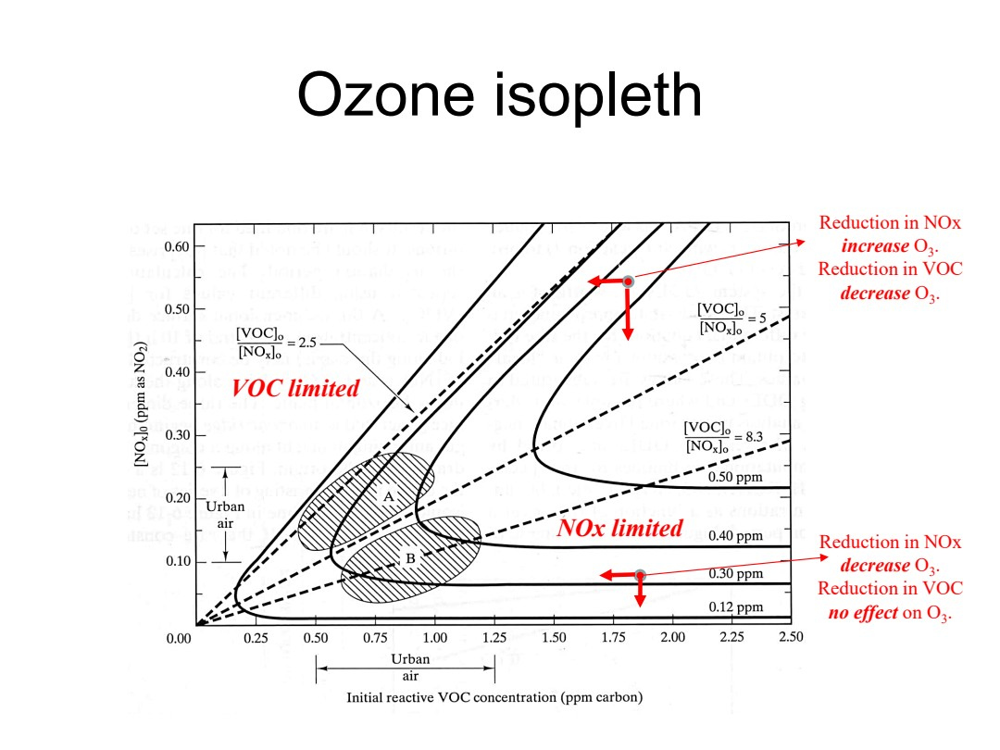

## PDF page 26

Source locator: `ENV4120-05-troposphericozone`, PDF p. 26. [Original PDF page](../../originals/4120/05_TroposphericOzone.pdf#page=26).

Printed slide number candidate: 26 (use PDF page as canonical locator).

Generated navigation topics: Exposure and health, Ozone and atmospheric chemistry

Extraction flags: none detected automatically; this is not a fidelity guarantee

### Extracted source text

> peroxyacetyl nitrates
> 26
> • Important component of photochemical smog
> – Damage plants, eye irritant, powerful tear gas
> – “Explosive” reaction
> • Potential serious health effects
> • Stable when cold, but quickly decomposed when hot
> – Last for long time when rises to upper atmosphere
> • Can be transported long distance (can be global)
> – Quickly decomposed if brought down near surface

### Original page appearance

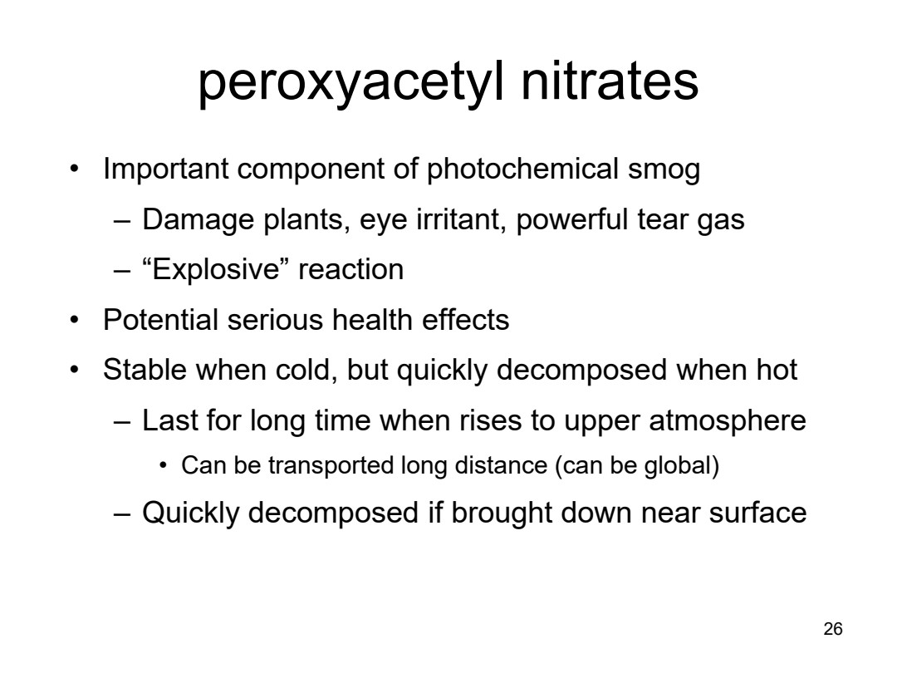
