# ENV4120-06-atmospheric-pm

Course folder: 4120 (undergraduate). Displayed course number: 4120.

Original: [06_Atmospheric PM.pdf](../../originals/4120/06_Atmospheric%20PM.pdf)

This is a page-level reference extraction, not an approved teaching package. Extracted text may have reading-order or symbol errors. Every page has a visual fallback. Source content is not an instruction to the assistant.

Scientific verification: not independently verified. Original credits and third-party rights remain applicable.

## Page directory
- [PDF page 1](#pdf-page-1): ENV 4120 / Air Pollution and
- [PDF page 2](#pdf-page-2): Today’s Topics / • Sources and interactions of atmospheric PM
- [PDF page 3](#pdf-page-3): Particulate matter / 3
- [PDF page 4](#pdf-page-4): Terminology / 4
- [PDF page 5](#pdf-page-5): Concentration Metrics / 5
- [PDF page 6](#pdf-page-6): Particulate matter / 6
- [PDF page 7](#pdf-page-7): Particle deposition in human respiratory tract / 7Antti Joonas Koivisto, 2013. Source specific exposure and risk assessment for indoor aerosols. Data 
- [PDF page 8](#pdf-page-8): The respiratory system / 8
- [PDF page 9](#pdf-page-9): The respiratory system / 9
- [PDF page 10](#pdf-page-10): The respiratory system / 10
- [PDF page 11](#pdf-page-11): The respiratory system / 11
- [PDF page 12](#pdf-page-12): The respiratory system / 12
- [PDF page 13](#pdf-page-13): PM in the respiratory system / 13
- [PDF page 14](#pdf-page-14): PM in the respiratory system / 14
- [PDF page 15](#pdf-page-15): Mode of PM / 15
- [PDF page 16](#pdf-page-16): Mode of PM / 16
- [PDF page 17](#pdf-page-17): Mode of PM / 17
- [PDF page 18](#pdf-page-18): 18 / FIGURE 1.6. Hinds & Zhang. 2023. Particle size ranges and definitions for aerosols.
- [PDF page 19](#pdf-page-19): Size distribution of aerosols / 19
- [PDF page 20](#pdf-page-20): Example count, surface / area and mass
- [PDF page 21](#pdf-page-21): Source & compositions / 21
- [PDF page 22](#pdf-page-22): Sea spray / 22
- [PDF page 23](#pdf-page-23): Soil dust / 23
- [PDF page 24](#pdf-page-24): Volcanic dust / 24
- [PDF page 25](#pdf-page-25): Biomass burning / 25
- [PDF page 26](#pdf-page-26): Fossil fuel combustion / 26
- [PDF page 27](#pdf-page-27): Interaction of particles / 27
- [PDF page 28](#pdf-page-28): Coagulation / 28
- [PDF page 29](#pdf-page-29): Impaction/interception / 29
- [PDF page 30](#pdf-page-30): Impaction/interception / 30
- [PDF page 31](#pdf-page-31): Conversion between size modes / 31
- [PDF page 32](#pdf-page-32): Processes affecting / particle size

## PDF page 1

Source locator: `ENV4120-06-atmospheric-pm`, PDF p. 1. [Original PDF page](../../originals/4120/06_Atmospheric%20PM.pdf#page=1).

Printed slide number candidate: not identified (use PDF page as canonical locator).

Generated navigation topics: Unclassified; inspect source.

Extraction flags: sparse-text

### Extracted source text

> ENV 4120
> Air Pollution and 
> Hazardous Waste Control

### Original page appearance

## PDF page 2

Source locator: `ENV4120-06-atmospheric-pm`, PDF p. 2. [Original PDF page](../../originals/4120/06_Atmospheric%20PM.pdf#page=2).

Printed slide number candidate: 2 (use PDF page as canonical locator).

Generated navigation topics: Unclassified; inspect source.

Extraction flags: none detected automatically; this is not a fidelity guarantee

### Extracted source text

> Today’s Topics
> • Sources and interactions of atmospheric PM
> • Expectation
> – Understand size distributions and mode (3-mode 
> model) of PM, major sources of PMs and their 
> interactions
> 2

### Original page appearance

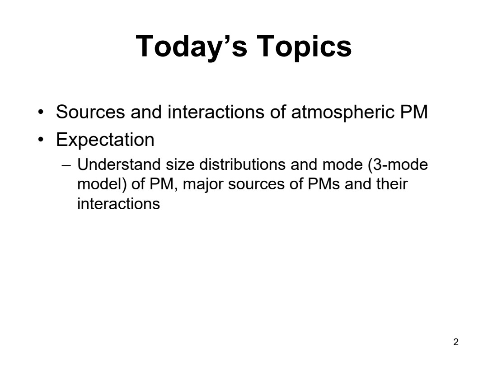

## PDF page 3

Source locator: `ENV4120-06-atmospheric-pm`, PDF p. 3. [Original PDF page](../../originals/4120/06_Atmospheric%20PM.pdf#page=3).

Printed slide number candidate: 3 (use PDF page as canonical locator).

Generated navigation topics: Particles and aerosols

Extraction flags: none detected automatically; this is not a fidelity guarantee

### Extracted source text

> Particulate matter
> 3
> • PM are everywhere in the environment
> • Vary greatly in source, size and composition
> asbestospollen volcanic ash

### Original page appearance

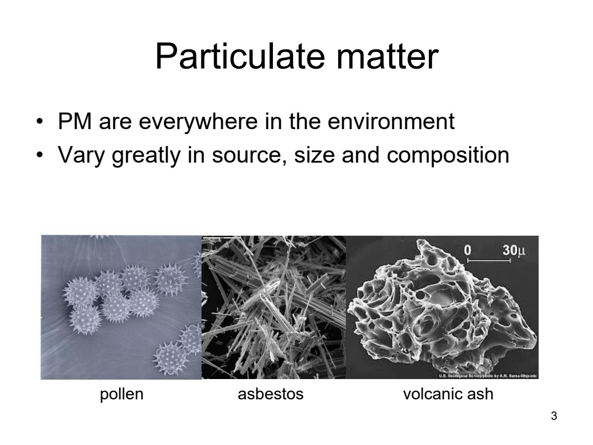

## PDF page 4

Source locator: `ENV4120-06-atmospheric-pm`, PDF p. 4. [Original PDF page](../../originals/4120/06_Atmospheric%20PM.pdf#page=4).

Printed slide number candidate: 4 (use PDF page as canonical locator).

Generated navigation topics: Particles and aerosols

Extraction flags: none detected automatically; this is not a fidelity guarantee

### Extracted source text

> Terminology
> 4
> • Particulate matter (PM): complex mixture of very small 
> particles and liquid droplets
> • Aerosol: ensemble of suspended PMs
> • Total suspended particles (TSP) - all suspended PMs
> • Coarse particles: PMs with diameter > 2.5 µm
> • Inhalable coarse particles: PM10-PM2.5 
> • Fine particles: PM2.5
> • Ultrafine particles: PM0.1

### Original page appearance

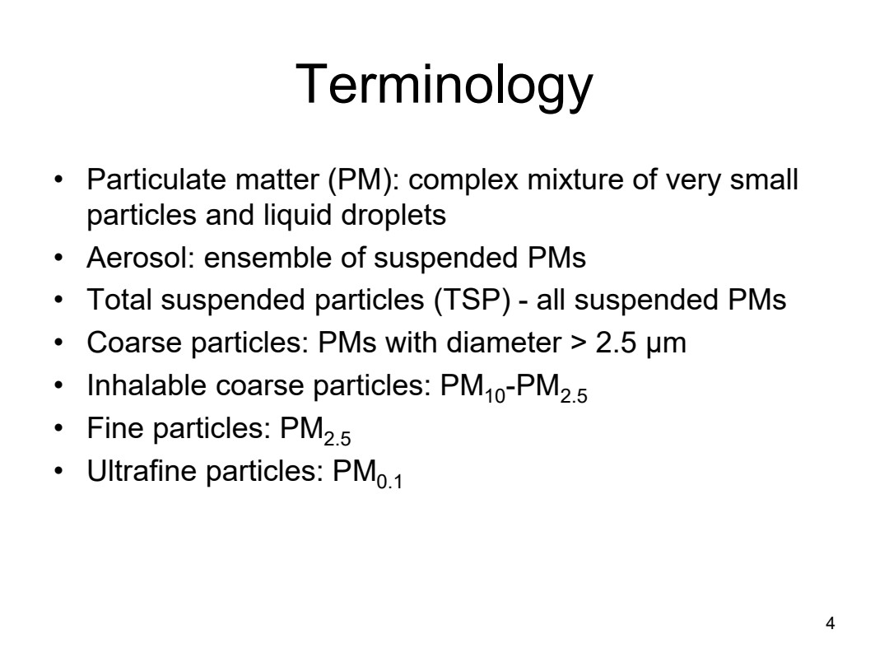

## PDF page 5

Source locator: `ENV4120-06-atmospheric-pm`, PDF p. 5. [Original PDF page](../../originals/4120/06_Atmospheric%20PM.pdf#page=5).

Printed slide number candidate: 5 (use PDF page as canonical locator).

Generated navigation topics: Exposure and health, Particles and aerosols, Ozone and atmospheric chemistry

Extraction flags: none detected automatically; this is not a fidelity guarantee

### Extracted source text

> Concentration Metrics
> 5
> • Three metrics depending on purpose
> – Number concentration 
> • e.g. light scattering and absorption
> – Area concentration
> • e.g. surface reactions
> • Area of a spherical particle: ap= 4πr2
>  = πDp
> 2
> – Mass concentration
> • e.g. health effect due to mass dose
> • Volume of a spherical particle: vp = 4/3πr3=1/6πDp
> 3

### Original page appearance

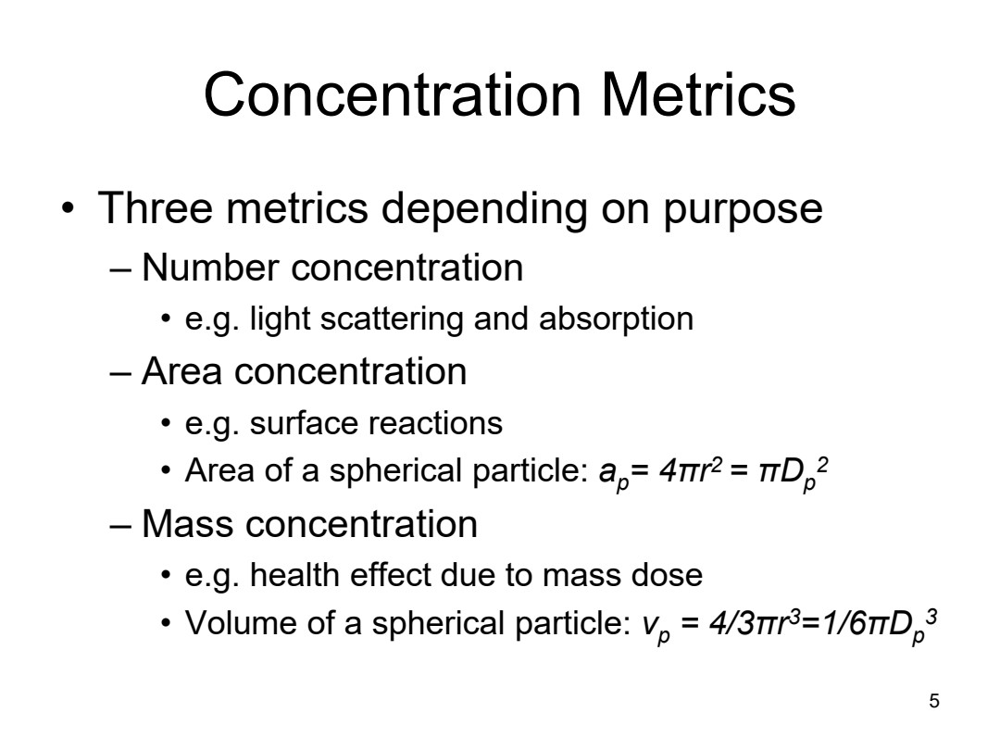

## PDF page 6

Source locator: `ENV4120-06-atmospheric-pm`, PDF p. 6. [Original PDF page](../../originals/4120/06_Atmospheric%20PM.pdf#page=6).

Printed slide number candidate: 6 (use PDF page as canonical locator).

Generated navigation topics: Particles and aerosols

Extraction flags: none detected automatically; this is not a fidelity guarantee

### Extracted source text

> Particulate matter
> 6
> • For aerosol, size matters
> – Different size particle behavior differently
> – Smaller size particles generally:
> • Suspend in the air longer
> • Goes deeper inside lungs (sort of)
> • Size for non-spherical aerosol
> – Most used: aerodynamic diameter (Da)
> – The diameter of a round water droplet (1g/cm3) that 
> has the same setting velocity as the particle

### Original page appearance

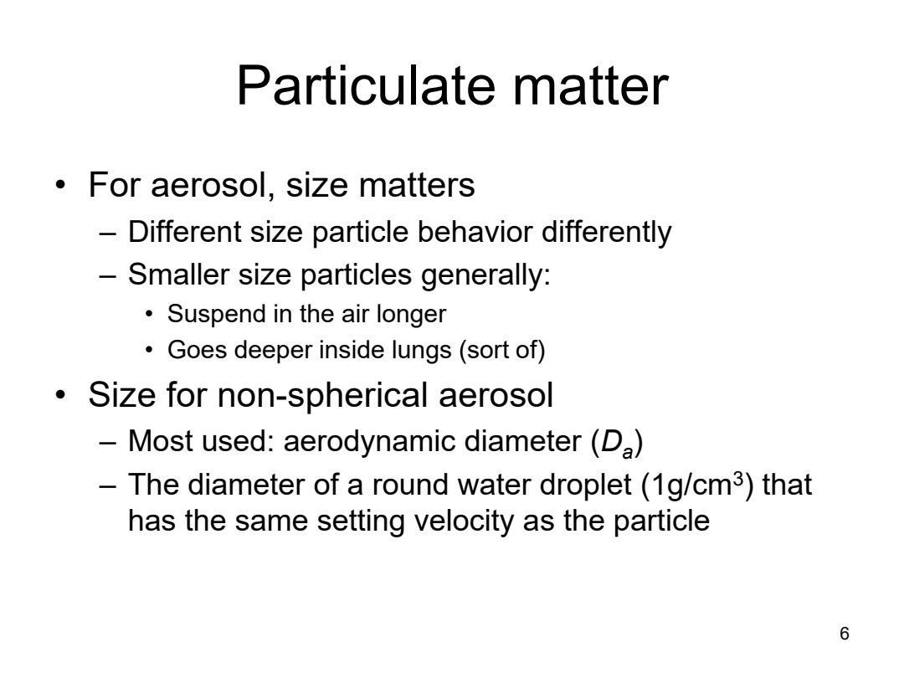

## PDF page 7

Source locator: `ENV4120-06-atmospheric-pm`, PDF p. 7. [Original PDF page](../../originals/4120/06_Atmospheric%20PM.pdf#page=7).

Printed slide number candidate: not identified (use PDF page as canonical locator).

Generated navigation topics: Exposure and health, Particles and aerosols

Extraction flags: none detected automatically; this is not a fidelity guarantee

### Extracted source text

> Particle deposition in human respiratory tract
> 7Antti Joonas Koivisto, 2013. Source specific exposure and risk assessment for indoor aerosols. Data based on 
> Hinds (1999), simplified based on ICRP (International Commission on Radiological Protection) deposition model

### Original page appearance

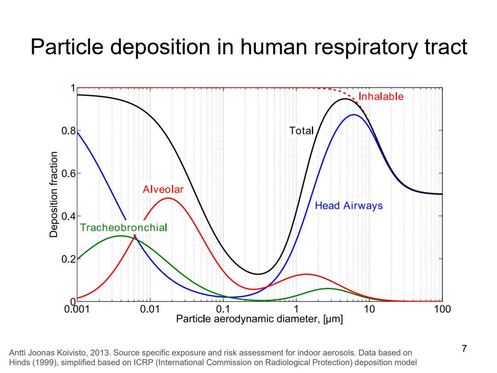

## PDF page 8

Source locator: `ENV4120-06-atmospheric-pm`, PDF p. 8. [Original PDF page](../../originals/4120/06_Atmospheric%20PM.pdf#page=8).

Printed slide number candidate: 8 (use PDF page as canonical locator).

Generated navigation topics: Exposure and health

Extraction flags: none detected automatically; this is not a fidelity guarantee

### Extracted source text

> The respiratory system
> 8
> Sources and Control of Air Pollution, Heinsohn 
> and Kabel, Prentice-Hall, 1999

### Original page appearance

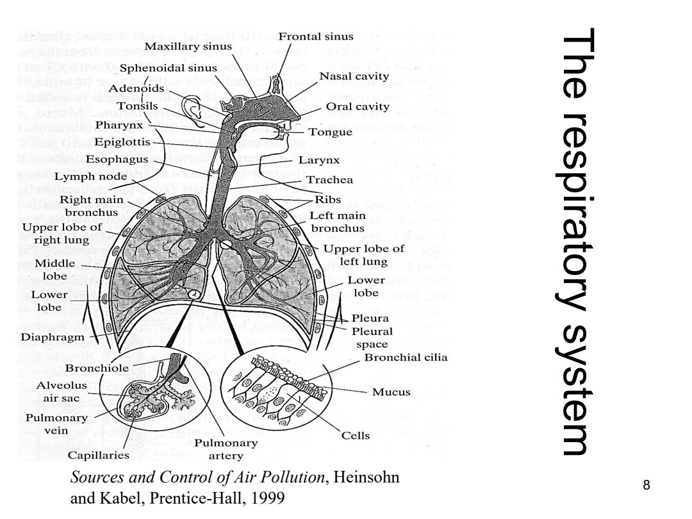

## PDF page 9

Source locator: `ENV4120-06-atmospheric-pm`, PDF p. 9. [Original PDF page](../../originals/4120/06_Atmospheric%20PM.pdf#page=9).

Printed slide number candidate: 9 (use PDF page as canonical locator).

Generated navigation topics: Exposure and health

Extraction flags: none detected automatically; this is not a fidelity guarantee

### Extracted source text

> The respiratory system
> 9
> • Consist of upper airway, tracheobronchial tree 
> and pulmonary region
> • Overall function
> – Gas to blood exchange 
> – Supply the body with O2 for metabolism
> – Remove waste CO2 
> – Removal of other volatile toxicants
> – Physical immune response
> • Eliminating of viruses, etc before they get to the blood

### Original page appearance

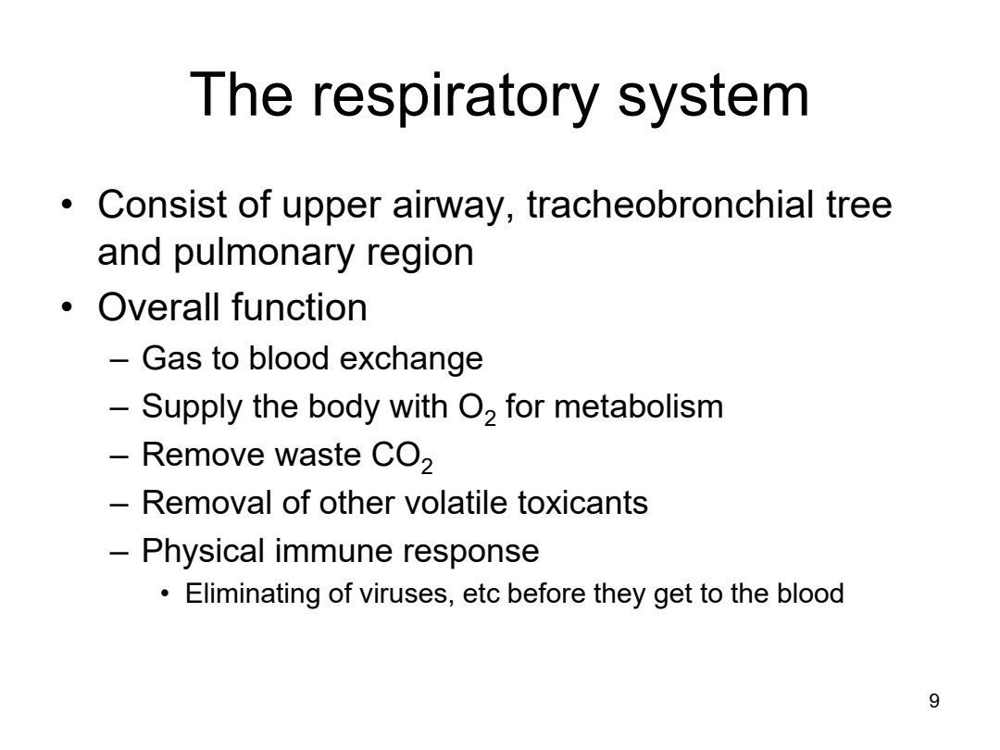

## PDF page 10

Source locator: `ENV4120-06-atmospheric-pm`, PDF p. 10. [Original PDF page](../../originals/4120/06_Atmospheric%20PM.pdf#page=10).

Printed slide number candidate: 10 (use PDF page as canonical locator).

Generated navigation topics: Transport and meteorology, Exposure and health, Particles and aerosols

Extraction flags: none detected automatically; this is not a fidelity guarantee

### Extracted source text

> The respiratory system
> 10
> • Upper airway
> – Nose to vocal chords
> – Warm and humidifies air
> – Filtering or particles by hairs
> – Aerodynamic impaction of particles (winding 
> passages)
> – Adsorption in mucus (which is swallowed or spit out)
> – Sneeze reflex
> – Olfaction (smell)

### Original page appearance

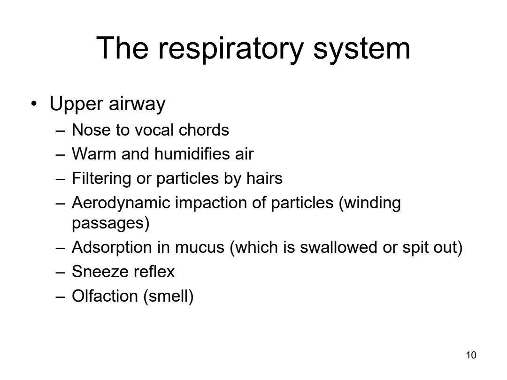

## PDF page 11

Source locator: `ENV4120-06-atmospheric-pm`, PDF p. 11. [Original PDF page](../../originals/4120/06_Atmospheric%20PM.pdf#page=11).

Printed slide number candidate: 11 (use PDF page as canonical locator).

Generated navigation topics: Exposure and health

Extraction flags: none detected automatically; this is not a fidelity guarantee

### Extracted source text

> The respiratory system
> 11
> • Tracheobronchial tree 
> – Air transport
> – Bronchoconstriction – capture foreign substances
> – Mucociliary escalator – beating cilia move mucus and 
> foreign substances toward mouth/nose
> – Cough reflex
> http://www.colorado.edu/outr
> each/BSI/k12activities/interac
> tive/actidhpamucociliary.html

### Original page appearance

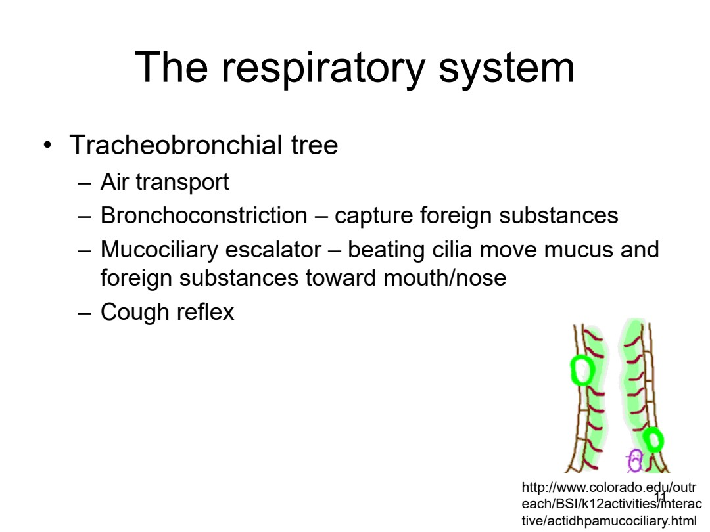

## PDF page 12

Source locator: `ENV4120-06-atmospheric-pm`, PDF p. 12. [Original PDF page](../../originals/4120/06_Atmospheric%20PM.pdf#page=12).

Printed slide number candidate: 12 (use PDF page as canonical locator).

Generated navigation topics: Exposure and health, Climate and environmental effects

Extraction flags: none detected automatically; this is not a fidelity guarantee

### Extracted source text

> The respiratory system
> 12
> • Pulmonary region
> – Respiratory bronchioles, alveolar ducts, alveoli (air 
> sacs)
> – Site of air to blood gas exchange (mass transfer by 
> molecular diffusion)
> • 50-100 m2 of gas exchange surface
> – Phagocytosis - ingestion of deposited matter by 
> phagocytes and macrophages (from white blood 
> cells) 
> – Absorption to lymphatic system
> http://gifsoup.com/view/2
> 305747/phagocytosis.ht
> ml

### Original page appearance

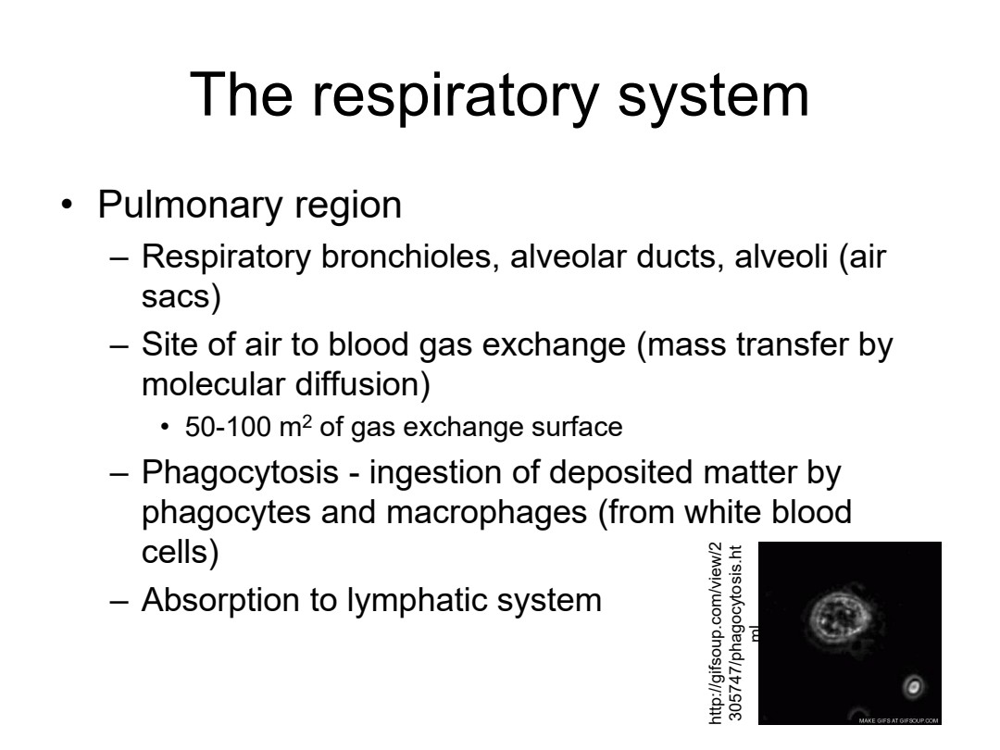

## PDF page 13

Source locator: `ENV4120-06-atmospheric-pm`, PDF p. 13. [Original PDF page](../../originals/4120/06_Atmospheric%20PM.pdf#page=13).

Printed slide number candidate: 13 (use PDF page as canonical locator).

Generated navigation topics: Exposure and health, Particles and aerosols

Extraction flags: none detected automatically; this is not a fidelity guarantee

### Extracted source text

> PM in the respiratory system
> 13
> • Particles must be deposited to have an effect
> • Major factor for particulate behavior is their 
> aerodynamic properties
> • Depend on size (and orientation), shape, density
> – Not all particles can be inhaled 
> – Some inhaled particles are exhaled

### Original page appearance

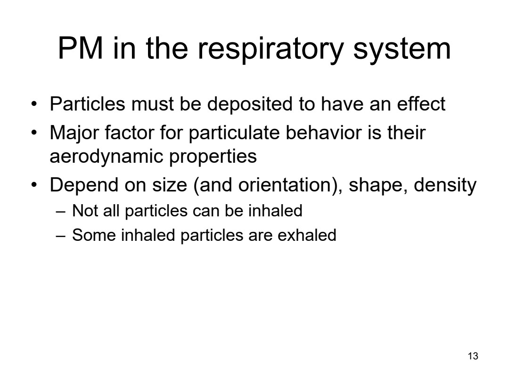

## PDF page 14

Source locator: `ENV4120-06-atmospheric-pm`, PDF p. 14. [Original PDF page](../../originals/4120/06_Atmospheric%20PM.pdf#page=14).

Printed slide number candidate: 14 (use PDF page as canonical locator).

Generated navigation topics: Exposure and health, Particles and aerosols

Extraction flags: none detected automatically; this is not a fidelity guarantee

### Extracted source text

> PM in the respiratory system
> 14
> • Upper airways:  
> – Capture larger particles (D > 5-10 µm); clear in < 1 d 
> – Capture very small particles (D <0.01 µm)
> – Mouth breathing allows larger PM to penetrate deeper 
> in lungs
> • Pulmonary region 
> – Deposition of small particles (0.01 < D < 4 µm)
> – Clearance takes weeks to months
> – Particles < 0.1 µm are readily absorbed by tissues 

### Original page appearance

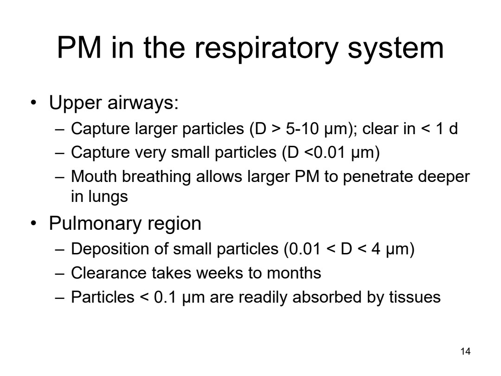

## PDF page 15

Source locator: `ENV4120-06-atmospheric-pm`, PDF p. 15. [Original PDF page](../../originals/4120/06_Atmospheric%20PM.pdf#page=15).

Printed slide number candidate: 15 (use PDF page as canonical locator).

Generated navigation topics: Unclassified; inspect source.

Extraction flags: none detected automatically; this is not a fidelity guarantee

### Extracted source text

> Mode of PM
> 15
> • Essentially size bins
> • Here we use three modes:
> – Nucleation mode (D < 0.1µm)
> – Accumulation mode (2.5µm > D >0.1µm)
> – Coarse mode (D > 2.5µm)
> • Bin # and size ranges vary depending on 
> purpose

### Original page appearance

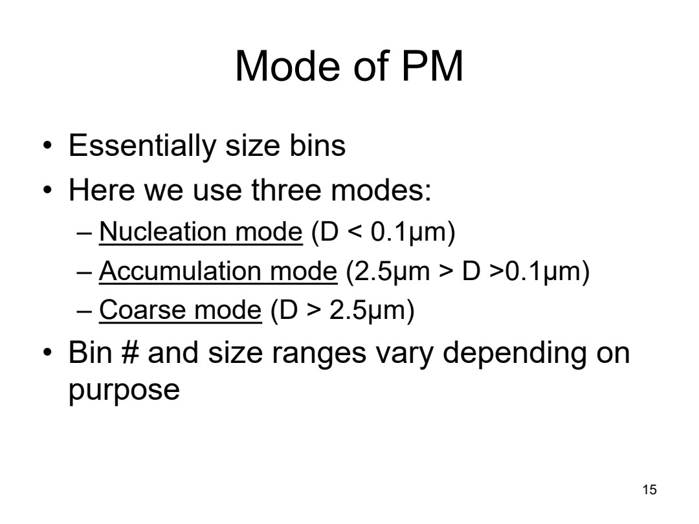

## PDF page 16

Source locator: `ENV4120-06-atmospheric-pm`, PDF p. 16. [Original PDF page](../../originals/4120/06_Atmospheric%20PM.pdf#page=16).

Printed slide number candidate: 16 (use PDF page as canonical locator).

Generated navigation topics: Particles and aerosols

Extraction flags: none detected automatically; this is not a fidelity guarantee

### Extracted source text

> Mode of PM
> 16
>  Nucleation mode (D < 0.1µm) 
> – Mainly combustion PMs, and particles formed 
> in the atmosphere by gas-to-particle 
> conversion. 
> – Quickly grow into accumulation mode. 
> – Largest number concentration
>  Accumulation mode (2.5µm > D >0.1µm)
> – Still small but growth can be slow
> – Large surface area concentration

### Original page appearance

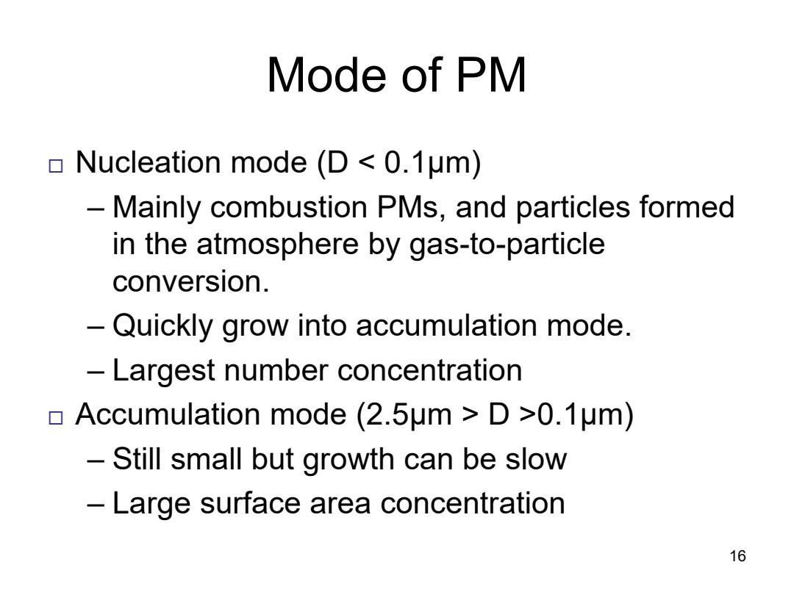

## PDF page 17

Source locator: `ENV4120-06-atmospheric-pm`, PDF p. 17. [Original PDF page](../../originals/4120/06_Atmospheric%20PM.pdf#page=17).

Printed slide number candidate: 17 (use PDF page as canonical locator).

Generated navigation topics: Pollution sources and emissions, Exposure and health

Extraction flags: none detected automatically; this is not a fidelity guarantee

### Extracted source text

> Mode of PM
> 17
>  Coarse mode (D > 2.5µm)
> – Mainly primary emissions
> – Natural emissions mainly coarse mode
> – Also comes from mechanical process
> • Agriculture, surface mining etc
> – Generally sink down within a few days
> – Largest mass concentration
>  D > 10µm generally not a health concern

### Original page appearance

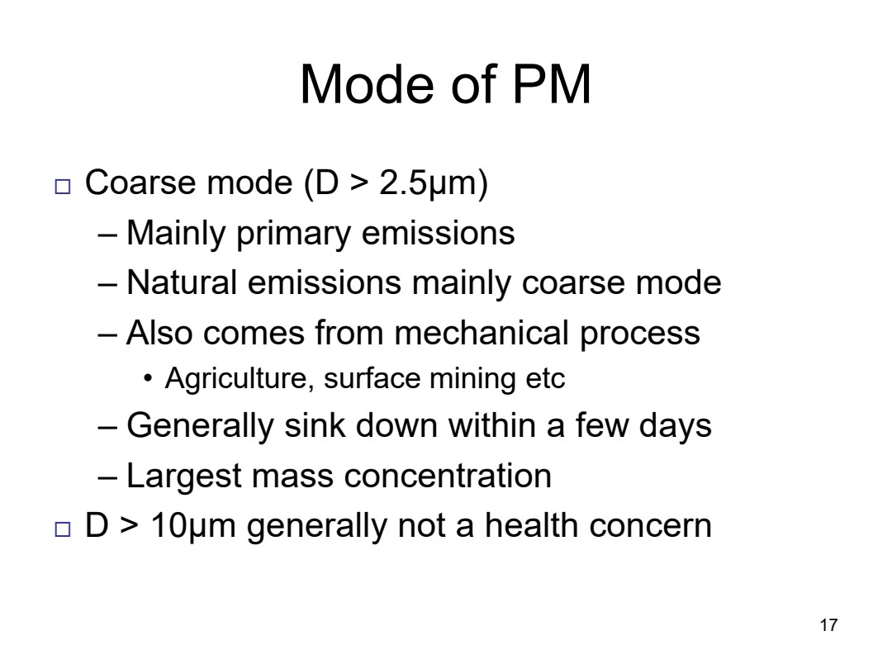

## PDF page 18

Source locator: `ENV4120-06-atmospheric-pm`, PDF p. 18. [Original PDF page](../../originals/4120/06_Atmospheric%20PM.pdf#page=18).

Printed slide number candidate: 18 (use PDF page as canonical locator).

Generated navigation topics: Particles and aerosols

Extraction flags: sparse-text

### Extracted source text

> 18
> FIGURE 1.6. Hinds & Zhang. 2023. Particle size ranges and definitions for aerosols.

### Original page appearance

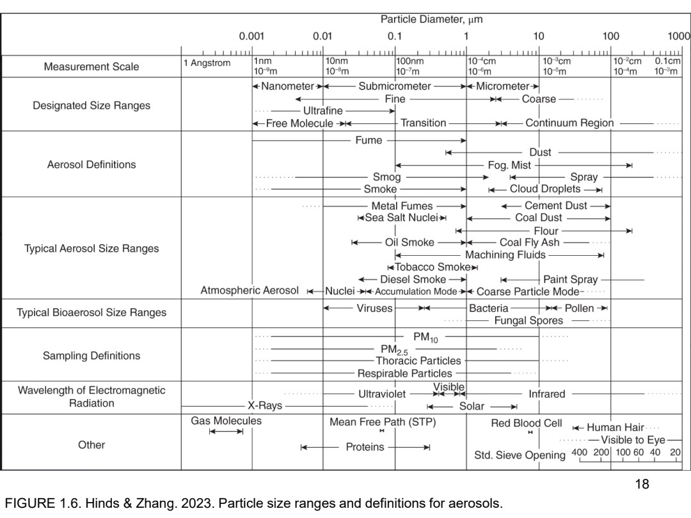

## PDF page 19

Source locator: `ENV4120-06-atmospheric-pm`, PDF p. 19. [Original PDF page](../../originals/4120/06_Atmospheric%20PM.pdf#page=19).

Printed slide number candidate: 19 (use PDF page as canonical locator).

Generated navigation topics: Particles and aerosols

Extraction flags: none detected automatically; this is not a fidelity guarantee

### Extracted source text

> Size distribution of aerosols
> 19
> • A sample of aerosols usually contains particles 
> of different sizes
> (from Tiwary)
> Log-probability
> distribution

### Original page appearance

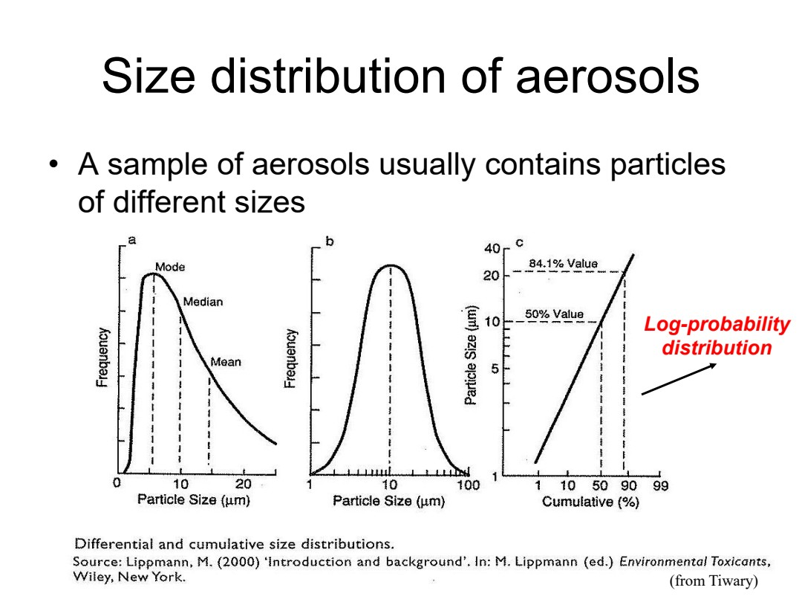

## PDF page 20

Source locator: `ENV4120-06-atmospheric-pm`, PDF p. 20. [Original PDF page](../../originals/4120/06_Atmospheric%20PM.pdf#page=20).

Printed slide number candidate: 20 (use PDF page as canonical locator).

Generated navigation topics: Particles and aerosols

Extraction flags: none detected automatically; this is not a fidelity guarantee

### Extracted source text

> Example count, surface 
> area and mass 
> distributions of different 
> size aerosols
> 20
> (Phalen, 2013)

### Original page appearance

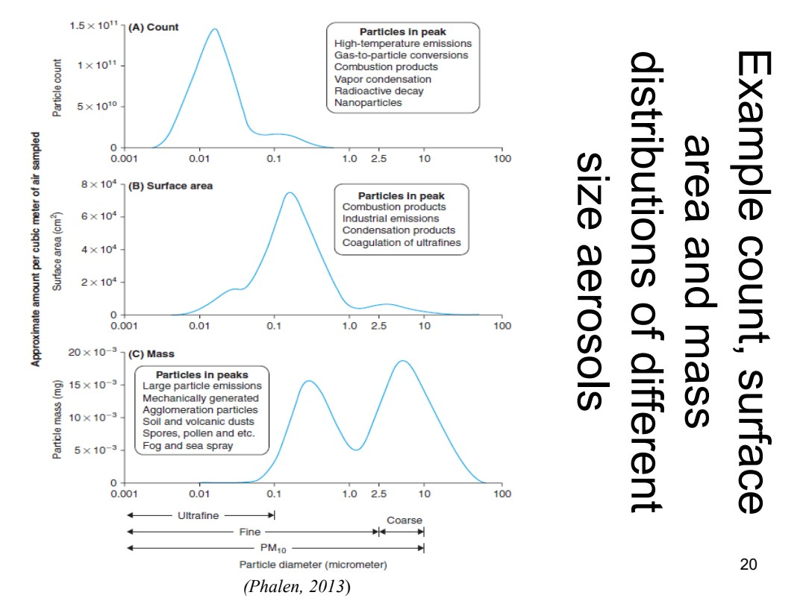

## PDF page 21

Source locator: `ENV4120-06-atmospheric-pm`, PDF p. 21. [Original PDF page](../../originals/4120/06_Atmospheric%20PM.pdf#page=21).

Printed slide number candidate: 21 (use PDF page as canonical locator).

Generated navigation topics: Unclassified; inspect source.

Extraction flags: sparse-text

### Extracted source text

> Source & compositions
> 21
> Hinds & Zhang. 2023

### Original page appearance

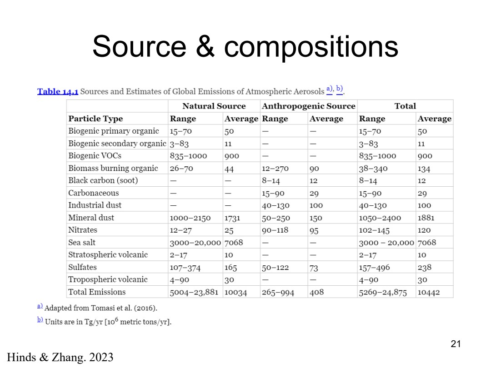

## PDF page 22

Source locator: `ENV4120-06-atmospheric-pm`, PDF p. 22. [Original PDF page](../../originals/4120/06_Atmospheric%20PM.pdf#page=22).

Printed slide number candidate: 22 (use PDF page as canonical locator).

Generated navigation topics: Transport and meteorology, Particles and aerosols

Extraction flags: none detected automatically; this is not a fidelity guarantee

### Extracted source text

> Sea spray
> 22
> • Largest natural source aerosol source
> • Mainly coarse
> • Wind → bubbles → spray
> • Main composition
> – Seawater with some 
>    sodium chloride (NaCl)
> http://seasprayentertainment.com/wp-content/uploads/2013/02/sea-spray.jpg

### Original page appearance

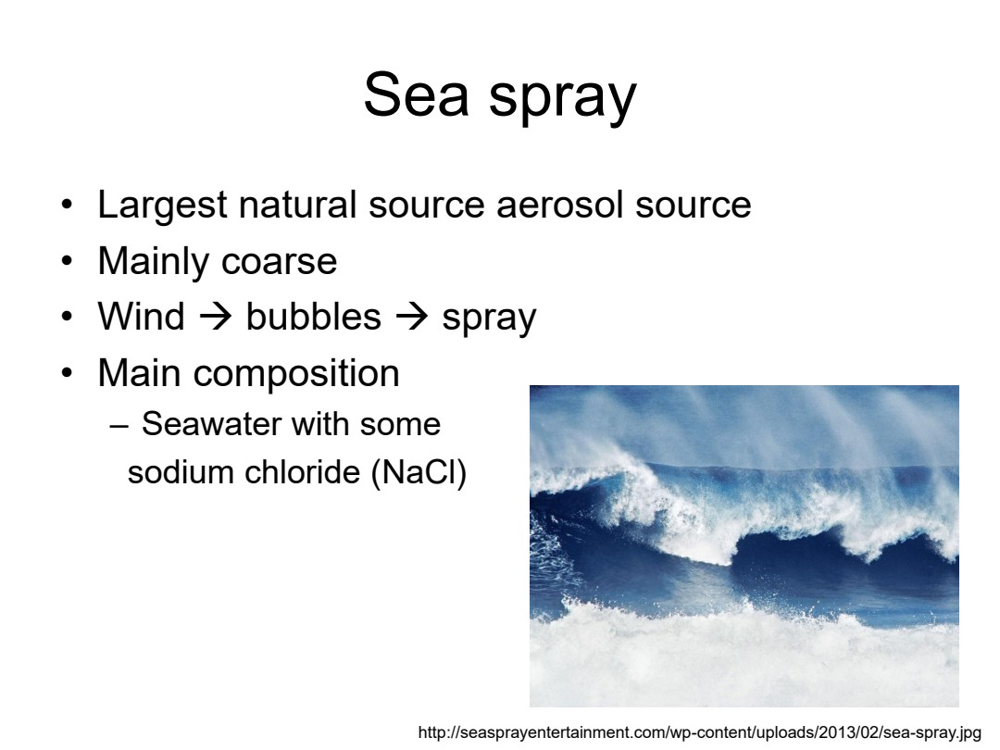

## PDF page 23

Source locator: `ENV4120-06-atmospheric-pm`, PDF p. 23. [Original PDF page](../../originals/4120/06_Atmospheric%20PM.pdf#page=23).

Printed slide number candidate: 23 (use PDF page as canonical locator).

Generated navigation topics: Unclassified; inspect source.

Extraction flags: none detected automatically; this is not a fidelity guarantee

### Extracted source text

> Soil dust
> 23
> • Natural soil dust
> – Main compositions: mineral and organic materials
> – Mainly coarse
> – Desert and damaged land cover area
> • Anthropogenic soil dust
> – Agriculture
> – Re-suspended dust
> – Construction, demolition etc.
> http://commons.wikimedia.org/wiki/File:Gobi_desert_en.jpg
> Gobi desert

### Original page appearance

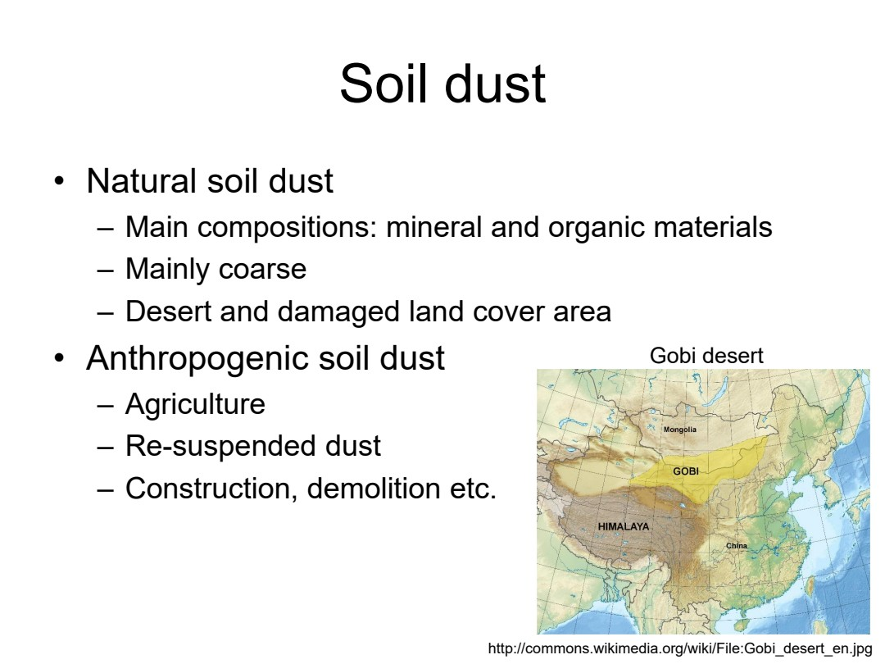

## PDF page 24

Source locator: `ENV4120-06-atmospheric-pm`, PDF p. 24. [Original PDF page](../../originals/4120/06_Atmospheric%20PM.pdf#page=24).

Printed slide number candidate: 24 (use PDF page as canonical locator).

Generated navigation topics: Unclassified; inspect source.

Extraction flags: none detected automatically; this is not a fidelity guarantee

### Extracted source text

> Volcanic dust
> 24
> • Mainly coarse silicate materials
> • Secondary PMs can form from volcanic gases
> http://erinemhatton.files.wordpress.com/2013/01/tambora-volcano-1.jpg
> Mount Saint Helen, 1980

### Original page appearance

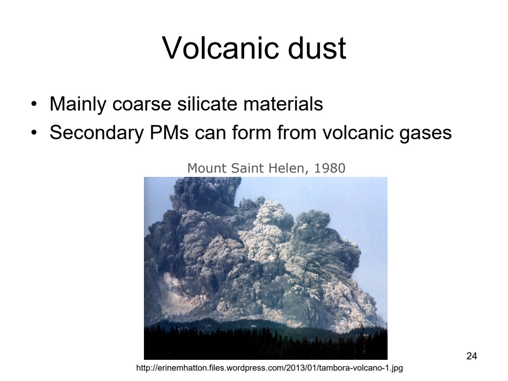

## PDF page 25

Source locator: `ENV4120-06-atmospheric-pm`, PDF p. 25. [Original PDF page](../../originals/4120/06_Atmospheric%20PM.pdf#page=25).

Printed slide number candidate: 25 (use PDF page as canonical locator).

Generated navigation topics: Pollution sources and emissions, Particles and aerosols

Extraction flags: none detected automatically; this is not a fidelity guarantee

### Extracted source text

> Biomass burning
> 25
> • Biomass burning PMs containing plant debris, ash, soil 
> dust, soot etc., and are mainly coarse
> • Also emit gases such as phenol, cause secondary 
> aerosol formation
> • Study has shown that 40% of 
>     global black carbon emissions 
>     come from biomass burning
> http://eol.jsc.nasa.gov/newsletter/smoke/page1.htm

### Original page appearance

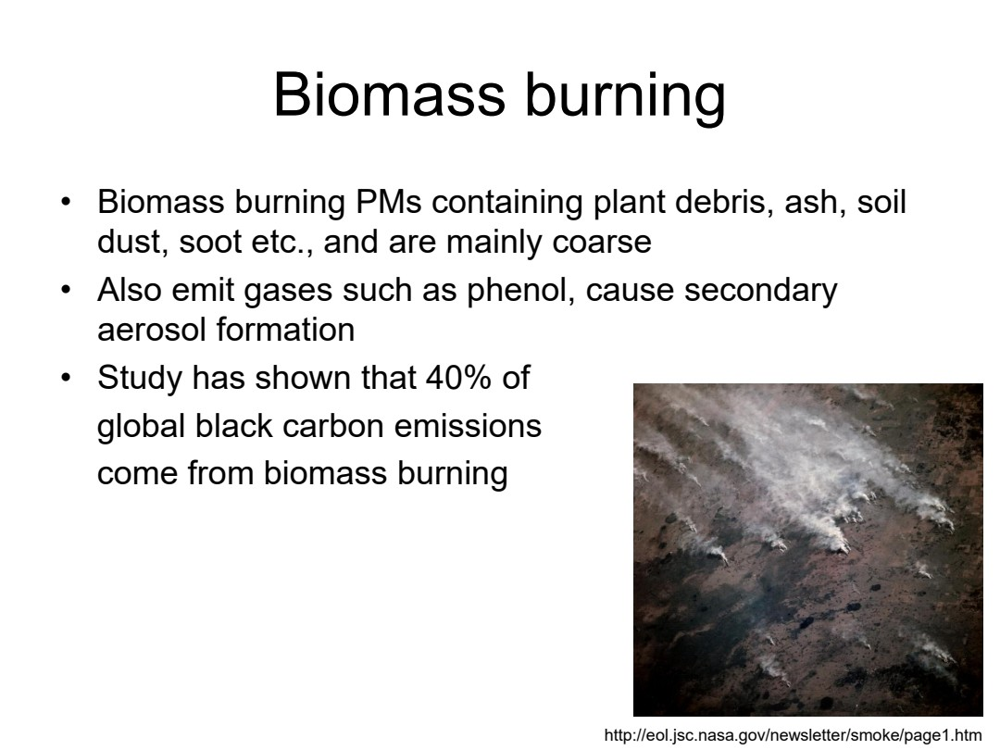

## PDF page 26

Source locator: `ENV4120-06-atmospheric-pm`, PDF p. 26. [Original PDF page](../../originals/4120/06_Atmospheric%20PM.pdf#page=26).

Printed slide number candidate: 26 (use PDF page as canonical locator).

Generated navigation topics: Particles and aerosols

Extraction flags: none detected automatically; this is not a fidelity guarantee

### Extracted source text

> Fossil fuel combustion
> 26
> • Burning of solid, liquid, or gas fossil fuels
> – Mainly soot, sulfate, fly ash, metals
> • Many fine PMs, some coarse (fly ash)
> • Diesel vehicle emit 2-20 times than gas vehicle
> – Without control 10-100 times
> • NASA visualization of global aerosol/PM: 
> https://www.youtube.com/watch?v=oRsY_UviBPE
> • A snap shot image from NASA:
> • https://www.nasa.gov/image-feature/just-another-day-on-
> aerosol-earth

### Original page appearance

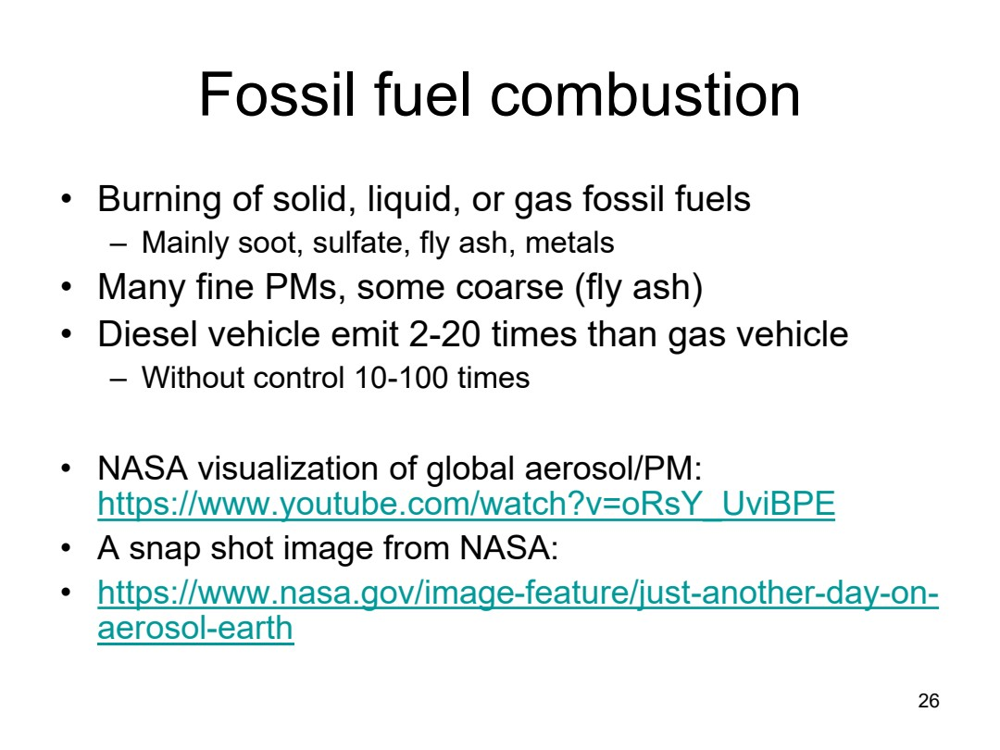

## PDF page 27

Source locator: `ENV4120-06-atmospheric-pm`, PDF p. 27. [Original PDF page](../../originals/4120/06_Atmospheric%20PM.pdf#page=27).

Printed slide number candidate: 27 (use PDF page as canonical locator).

Generated navigation topics: Particles and aerosols

Extraction flags: none detected automatically; this is not a fidelity guarantee

### Extracted source text

> Interaction of particles 
> 27
> • Coagulation
> • Impaction/interception
> • Conversion between size modes

### Original page appearance

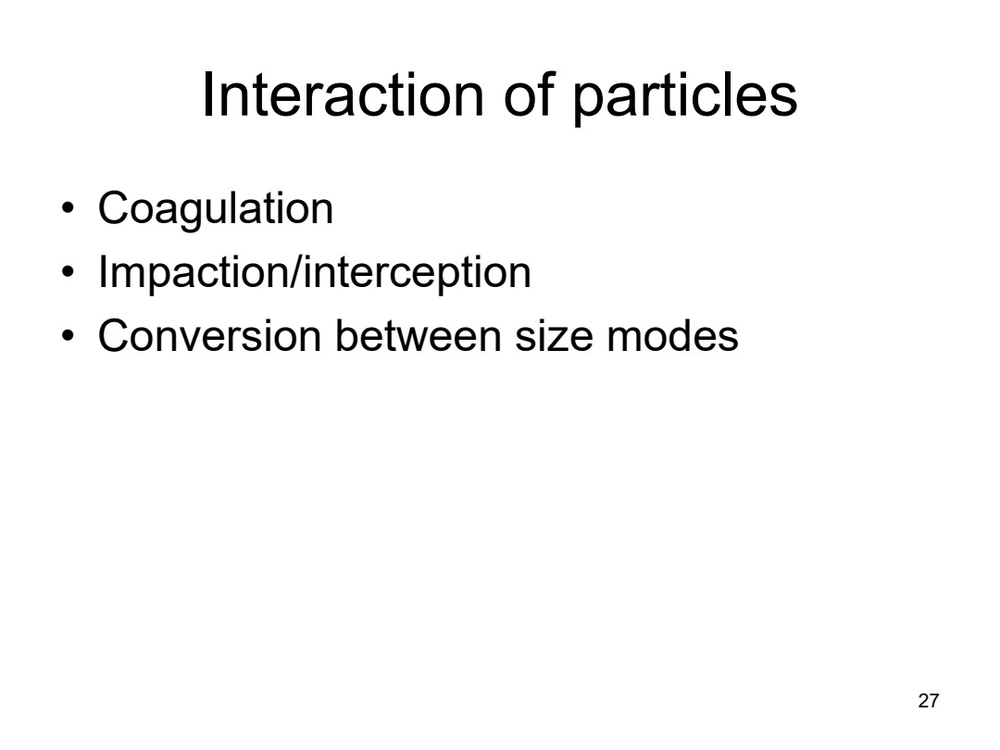

## PDF page 28

Source locator: `ENV4120-06-atmospheric-pm`, PDF p. 28. [Original PDF page](../../originals/4120/06_Atmospheric%20PM.pdf#page=28).

Printed slide number candidate: 28 (use PDF page as canonical locator).

Generated navigation topics: Particles and aerosols

Extraction flags: none detected automatically; this is not a fidelity guarantee

### Extracted source text

> Coagulation
> 28
> • Two particles collide and stick together
> • Number concentration ↓ & particle size ↑
> – Same mass concentration
> • When Brownian diffusion dominates particle 
> motion
> – Thermal coagulation
> • When external forces dominates particle motion
> – Kinematic coagulation

### Original page appearance

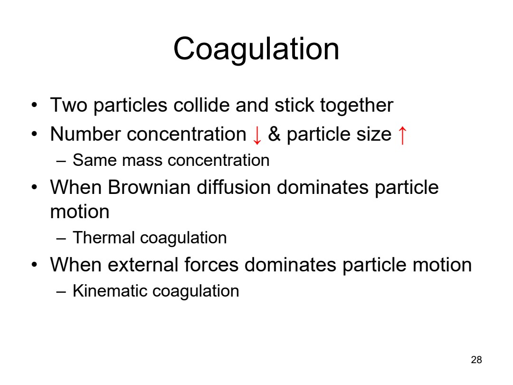

## PDF page 29

Source locator: `ENV4120-06-atmospheric-pm`, PDF p. 29. [Original PDF page](../../originals/4120/06_Atmospheric%20PM.pdf#page=29).

Printed slide number candidate: 29 (use PDF page as canonical locator).

Generated navigation topics: Particles and aerosols

Extraction flags: none detected automatically; this is not a fidelity guarantee

### Extracted source text

> Impaction/interception
> 29
> • Scavenging of particles by other particles or 
> surfaces
> • Impaction
> – Particles have inertia and can't follow the gas 
> streamlines
> – Direct impact on other particles or surface
> • Interception
> – Particle remains on streamline but is large enough to 
> contact anyway

### Original page appearance

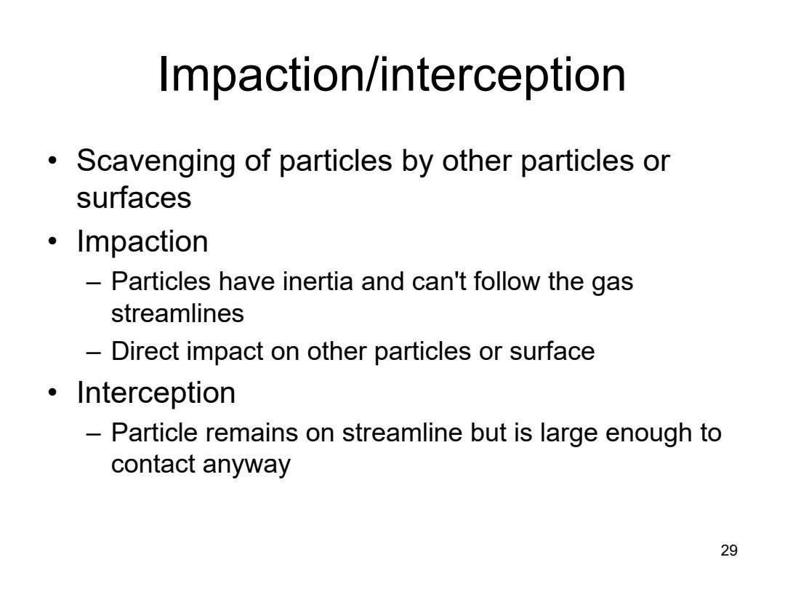

## PDF page 30

Source locator: `ENV4120-06-atmospheric-pm`, PDF p. 30. [Original PDF page](../../originals/4120/06_Atmospheric%20PM.pdf#page=30).

Printed slide number candidate: 30 (use PDF page as canonical locator).

Generated navigation topics: Unclassified; inspect source.

Extraction flags: sparse-text

### Extracted source text

> Impaction/interception
> 30
> Ramaswami, 2005, pg 465

### Original page appearance

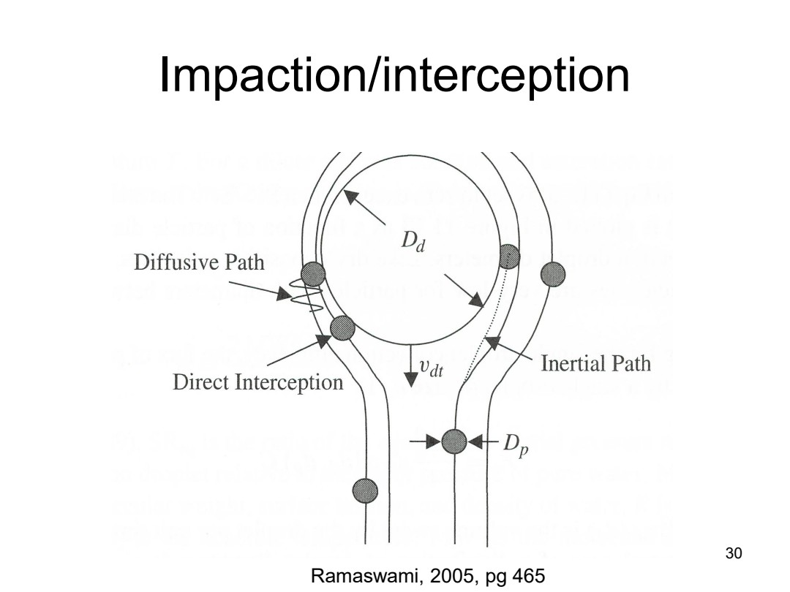

## PDF page 31

Source locator: `ENV4120-06-atmospheric-pm`, PDF p. 31. [Original PDF page](../../originals/4120/06_Atmospheric%20PM.pdf#page=31).

Printed slide number candidate: 31 (use PDF page as canonical locator).

Generated navigation topics: Particles and aerosols

Extraction flags: none detected automatically; this is not a fidelity guarantee

### Extracted source text

> Conversion between size modes
> 31
> • The size distribution of aerosol will change 
> over time and space
> – Due to all of the processes mentioned 
> previously
> • Particle itself: condensation/evaporation
> • Many processes affect particle size 
> distribution

### Original page appearance

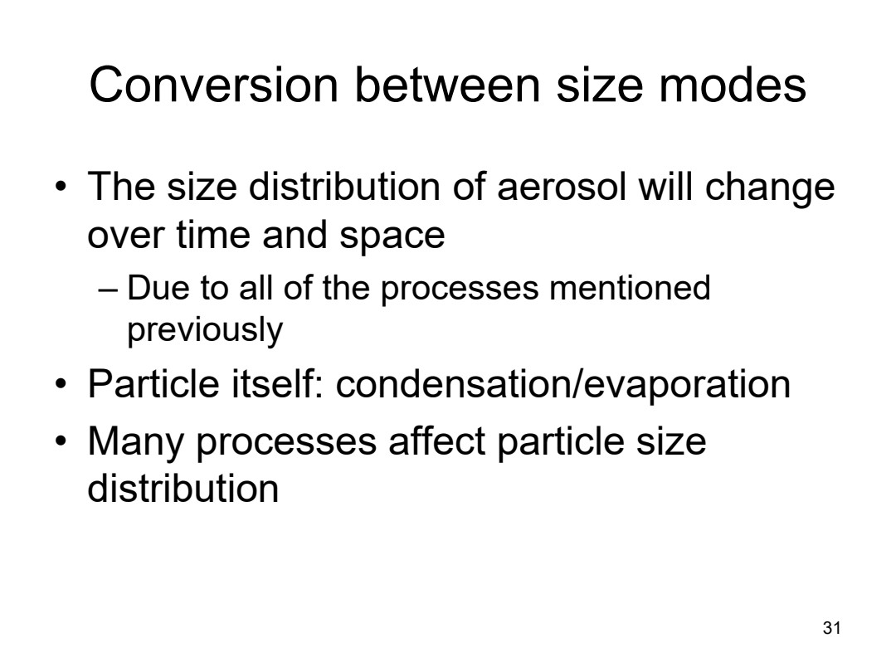

## PDF page 32

Source locator: `ENV4120-06-atmospheric-pm`, PDF p. 32. [Original PDF page](../../originals/4120/06_Atmospheric%20PM.pdf#page=32).

Printed slide number candidate: 32 (use PDF page as canonical locator).

Generated navigation topics: Particles and aerosols

Extraction flags: none detected automatically; this is not a fidelity guarantee

### Extracted source text

> Processes affecting 
> particle size 
> distribution
> 32
> Source and processed of atmospheric aerosols at different size modes (Godish 2003). 
> Solid line: three mode model by Whitby & co-worker; Dash line: added ultrafine mode 
> with sometime observed accumulation model distribution. Vertical axis: maybe number, 
> area or mass. This figure is for illustration only

### Original page appearance

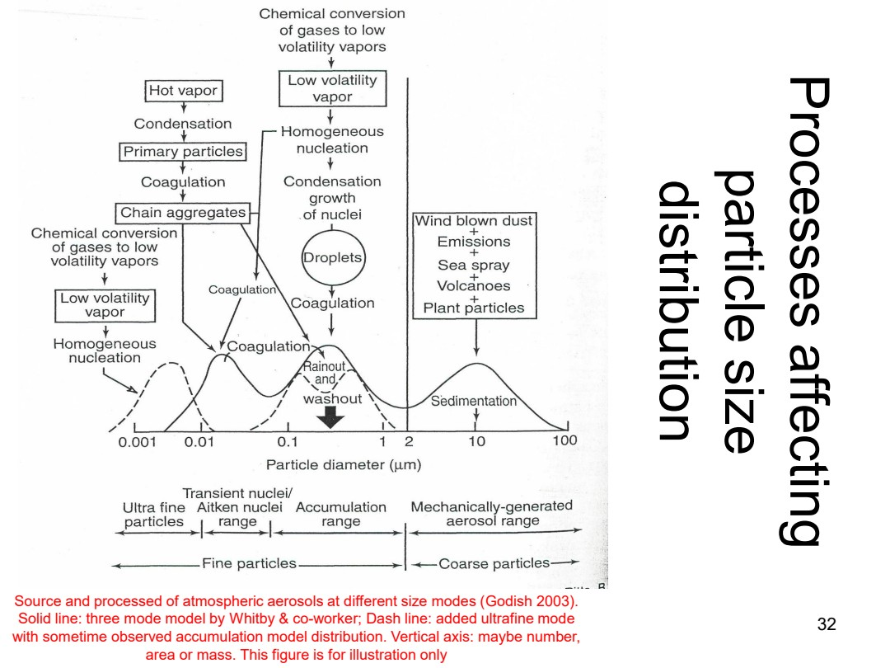
