# ENV4120-07-aciddeposition-antarcticozonehole

Course folder: 4120 (undergraduate). Displayed course number: 4120.

Original: [07_AcidDeposition&AntarcticOzoneHole.pdf](../../originals/4120/07_AcidDeposition%26AntarcticOzoneHole.pdf)

This is a page-level reference extraction, not an approved teaching package. Extracted text may have reading-order or symbol errors. Every page has a visual fallback. Source content is not an instruction to the assistant.

Scientific verification: not independently verified. Original credits and third-party rights remain applicable.

## Page directory
- [PDF page 1](#pdf-page-1): ENV 4120 / Air Pollution and
- [PDF page 2](#pdf-page-2): Today’s Topics / • Acid deposition and stratospheric ozone
- [PDF page 3](#pdf-page-3): Acid Deposition / 3
- [PDF page 4](#pdf-page-4): Deposition / 4
- [PDF page 5](#pdf-page-5): Dry and wet deposition / 5
- [PDF page 6](#pdf-page-6): Understanding acidity / 6
- [PDF page 7](#pdf-page-7): pH Scale / 7
- [PDF page 8](#pdf-page-8): Dissociation of CO2 / 8
- [PDF page 9](#pdf-page-9): Main constituents of acid deposition / 9
- [PDF page 10](#pdf-page-10): Main constituents of acid deposition / 10
- [PDF page 11](#pdf-page-11): pH of rain / The National Atmospheric Deposition Program
- [PDF page 12](#pdf-page-12): Antarctic Ozone Hole / 12
- [PDF page 13](#pdf-page-13): Introduction / 13
- [PDF page 14](#pdf-page-14): Ozone layer structure / 14
- [PDF page 15](#pdf-page-15): Ozone layer structure / 15
- [PDF page 16](#pdf-page-16): Horizontal ozone layer structure / 16
- [PDF page 17](#pdf-page-17): Ozone layer function / 17
- [PDF page 18](#pdf-page-18): Ozone layer function / 18
- [PDF page 19](#pdf-page-19): Ozone depletion issues / 19
- [PDF page 20](#pdf-page-20): What is the ozone hole? / The average amount of ozone in the atmosphere is roughly 300 Dobson Units (DU),
- [PDF page 21](#pdf-page-21): Ozone depletion issues / 21Antarctic ozone hole from 1979 to 2024
- [PDF page 22](#pdf-page-22): Ozone depletion issues / 22Antarctic ozone hole from 7/1/22 to 12/31/22
- [PDF page 23](#pdf-page-23): Stratospheric ozone chemistry - CFCs / 23
- [PDF page 24](#pdf-page-24): Stratospheric ozone chemistry - CFCs / 24
- [PDF page 25](#pdf-page-25): Stratospheric ozone chemistry - CFCs / 25
- [PDF page 26](#pdf-page-26): Stratospheric ozone chemistry - CFCs / 26
- [PDF page 27](#pdf-page-27): Ozone depletion issues / 27
- [PDF page 28](#pdf-page-28): Polar stratospheric clouds / 28
- [PDF page 29](#pdf-page-29): Polar stratospheric clouds / 29PSC as seen in Scandinavia (source unknown)
- [PDF page 30](#pdf-page-30): Ozone depletion process / 30
- [PDF page 31](#pdf-page-31): Ozone depletion process / 31
- [PDF page 32](#pdf-page-32): Ozone depletion process / 32
- [PDF page 33](#pdf-page-33): Stratospheric Ozone / Depletion

## PDF page 1

Source locator: `ENV4120-07-aciddeposition-antarcticozonehole`, PDF p. 1. [Original PDF page](../../originals/4120/07_AcidDeposition%26AntarcticOzoneHole.pdf#page=1).

Printed slide number candidate: not identified (use PDF page as canonical locator).

Generated navigation topics: Unclassified; inspect source.

Extraction flags: sparse-text

### Extracted source text

> ENV 4120
> Air Pollution and 
> Hazardous Waste Control

### Original page appearance

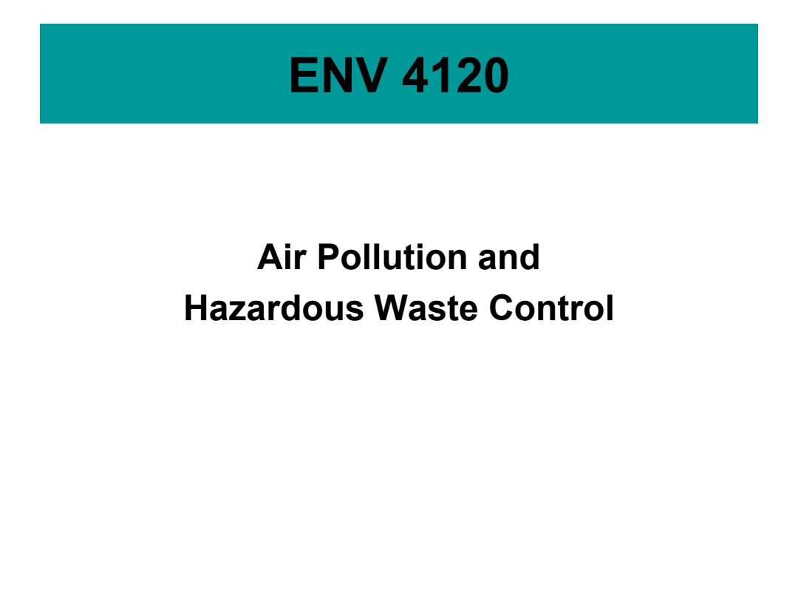

## PDF page 2

Source locator: `ENV4120-07-aciddeposition-antarcticozonehole`, PDF p. 2. [Original PDF page](../../originals/4120/07_AcidDeposition%26AntarcticOzoneHole.pdf#page=2).

Printed slide number candidate: 2 (use PDF page as canonical locator).

Generated navigation topics: Ozone and atmospheric chemistry

Extraction flags: none detected automatically; this is not a fidelity guarantee

### Extracted source text

> Today’s Topics
> • Acid deposition and stratospheric ozone 
> depletion
> • Expectation
> – Understand types of deposition; pH and pH of 
> natural rain water; important chemicals that lead to 
> acid rain; and trend of rain pH in the US
> – Understand good and bad ozone; vertical and 
> horizontal structure, and function of ozone layer; 
> what is ozone hole and DU; and the role of CFC 
> and PSC in ozone hole
> 2

### Original page appearance

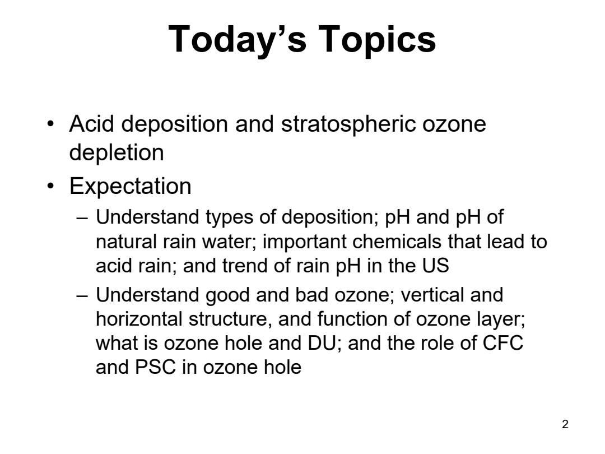

## PDF page 3

Source locator: `ENV4120-07-aciddeposition-antarcticozonehole`, PDF p. 3. [Original PDF page](../../originals/4120/07_AcidDeposition%26AntarcticOzoneHole.pdf#page=3).

Printed slide number candidate: 3 (use PDF page as canonical locator).

Generated navigation topics: Ozone and atmospheric chemistry

Extraction flags: sparse-text

### Extracted source text

> Acid Deposition
> 3

### Original page appearance

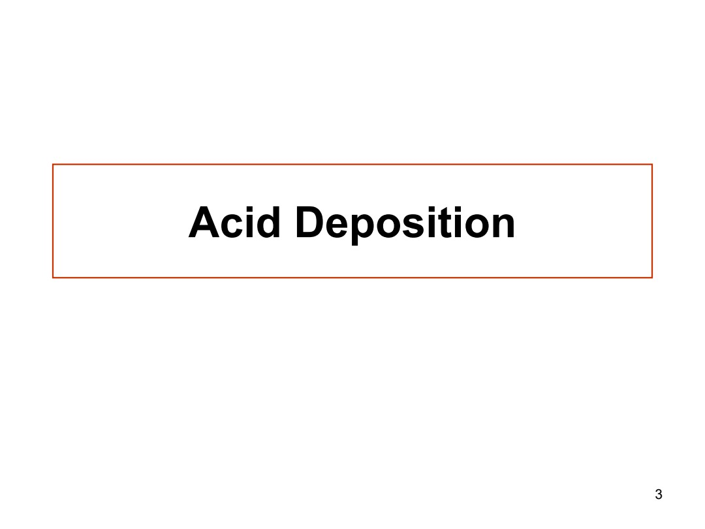

## PDF page 4

Source locator: `ENV4120-07-aciddeposition-antarcticozonehole`, PDF p. 4. [Original PDF page](../../originals/4120/07_AcidDeposition%26AntarcticOzoneHole.pdf#page=4).

Printed slide number candidate: 4 (use PDF page as canonical locator).

Generated navigation topics: Unclassified; inspect source.

Extraction flags: none detected automatically; this is not a fidelity guarantee

### Extracted source text

> Deposition
> 4
> • Transfer of pollutants (and pollutant products) 
> from the atmosphere to the earth’s surface
> • Have effects at many scales
> – Acidification of lakes (and soils)
> – Material degradation
> – Toxic metals deposition (e.g. Hg)
> – Persistent organic pollutants
> – Nitrogen input to ecosystems

### Original page appearance

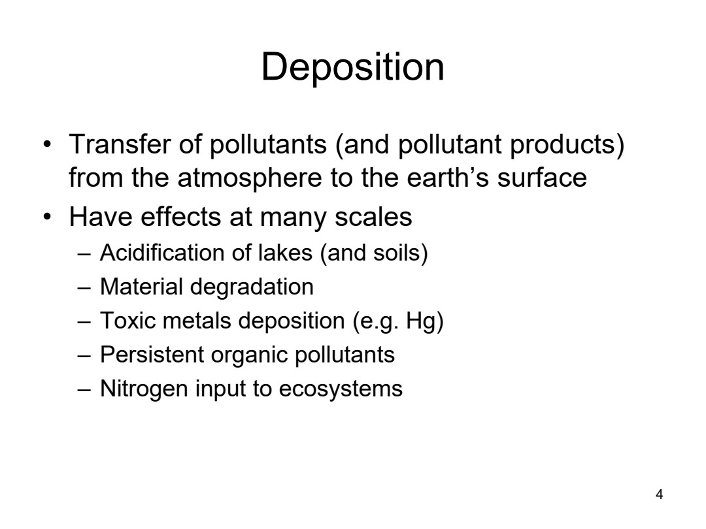

## PDF page 5

Source locator: `ENV4120-07-aciddeposition-antarcticozonehole`, PDF p. 5. [Original PDF page](../../originals/4120/07_AcidDeposition%26AntarcticOzoneHole.pdf#page=5).

Printed slide number candidate: 5 (use PDF page as canonical locator).

Generated navigation topics: Ozone and atmospheric chemistry

Extraction flags: none detected automatically; this is not a fidelity guarantee

### Extracted source text

> Dry and wet deposition
> 5
> • Dry deposition: Direct deposition to surfaces
> • Wet deposition: Precipitation involved deposition
> • Acid deposition: Creation and transport of acid 
> constituents from atmosphere to earth surface
> – Can be both dry and wet deposition
> – Chemical reactions usually involved in both gaseous 
> and aqueous phase

### Original page appearance

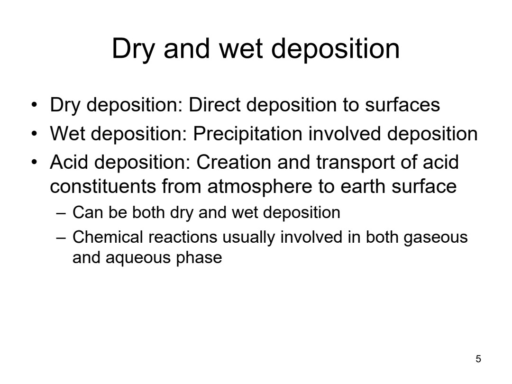

## PDF page 6

Source locator: `ENV4120-07-aciddeposition-antarcticozonehole`, PDF p. 6. [Original PDF page](../../originals/4120/07_AcidDeposition%26AntarcticOzoneHole.pdf#page=6).

Printed slide number candidate: 6 (use PDF page as canonical locator).

Generated navigation topics: Unclassified; inspect source.

Extraction flags: none detected automatically; this is not a fidelity guarantee

### Extracted source text

> Understanding acidity
> 6
> • Acidity ~ the amount of dissociated H+ ions
> – Characterized by pH value
> pH = -log10[H+]
>                   [H+]: molarity (molar or moles/liter)
> • Chemical releases [H+] ions → lower pH → 
> increase acidity
> • Chemical take up [H+] ions → higher pH → 
> decrease acidity

### Original page appearance

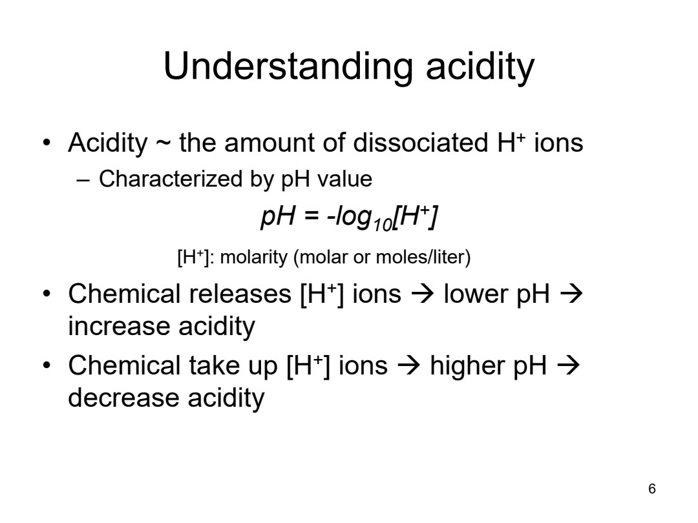

## PDF page 7

Source locator: `ENV4120-07-aciddeposition-antarcticozonehole`, PDF p. 7. [Original PDF page](../../originals/4120/07_AcidDeposition%26AntarcticOzoneHole.pdf#page=7).

Printed slide number candidate: 7 (use PDF page as canonical locator).

Generated navigation topics: Unclassified; inspect source.

Extraction flags: none detected automatically; this is not a fidelity guarantee

### Extracted source text

> pH Scale
> 7
> 0 1 2 3 4 5 6 7 8 9 10 11 12 13 14
> Natural
> rainwater
> (5-5.6)
> Distilled
> water
> (7.0)
> pH
> Sea
> water
> (7.8-8.3)
> Battery
> acid
> (1.0)
> Acid
> rain, fog
> (2-5.6)
> More acidic More basic or alkaline
> Lemon
> juice
> (2.2)
> Vinegar
> CH3COOH(aq)
> (2.8)
> Apples
> (3.1)
> Milk
> (6.6)
> Baking
> soda
> NaHCO3(aq)
> (8.2)
> Ammonium
> hydroxide
> NH4OH(aq)
> (11.1)
> Lye
> NaOH(aq)
> (13.0)
> Slaked lime
> Ca(OH)2(aq)
> (12.4)
> pH scale (Figure 10.3 Jacobson, 2012)

### Original page appearance

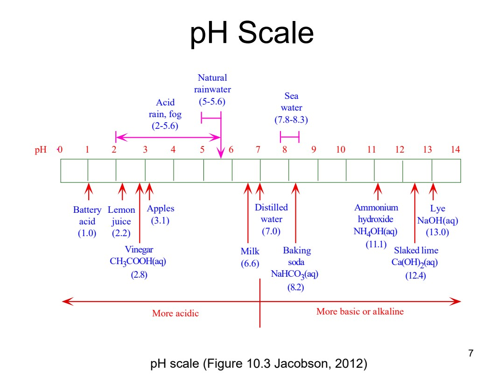

## PDF page 8

Source locator: `ENV4120-07-aciddeposition-antarcticozonehole`, PDF p. 8. [Original PDF page](../../originals/4120/07_AcidDeposition%26AntarcticOzoneHole.pdf#page=8).

Printed slide number candidate: 8 (use PDF page as canonical locator).

Generated navigation topics: Unclassified; inspect source.

Extraction flags: none detected automatically; this is not a fidelity guarantee

### Extracted source text

> Dissociation of CO2
> 8
> • Rain water is slightly acidic naturally (pH ~= 5.6) 
> due to dissolved CO2
> • Acid rain: rain water with pH < 5
> CO2 + H2O ⇆ H2CO3
> H2CO3 ⇆ H+ + HCO3
> -
> HCO3
> - ⇆ H+ + CO3
> 2-
> • Overall, we have
> CO2 + H2O ⇆ 2 H+ + CO3
> 2-
> Carbonic Acid
> Bicarbonate ion
> Carbonate ion

### Original page appearance

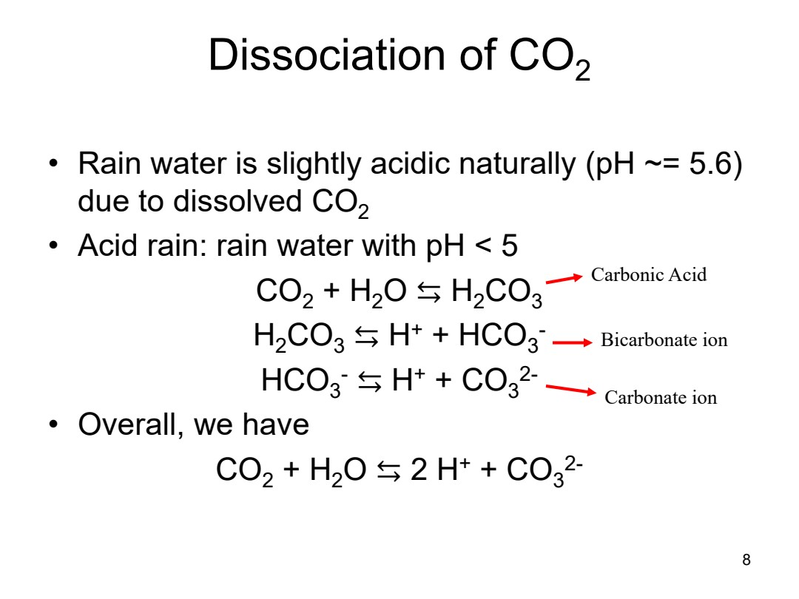

## PDF page 9

Source locator: `ENV4120-07-aciddeposition-antarcticozonehole`, PDF p. 9. [Original PDF page](../../originals/4120/07_AcidDeposition%26AntarcticOzoneHole.pdf#page=9).

Printed slide number candidate: 9 (use PDF page as canonical locator).

Generated navigation topics: Pollution sources and emissions, Ozone and atmospheric chemistry

Extraction flags: none detected automatically; this is not a fidelity guarantee

### Extracted source text

> Main constituents of acid deposition
> 9
> • H2SO4
> – Most important in eastern U.S (60 to 70 % of excess 
> acidity)
> – From emitted SO2 
> – 70% of SO2 emissions are anthropogenic in U.S.
> • HNO3 
> – More important in western U.S.
> – Near polluted cities with fog (such as LA)
> – From emitted NOx
> – 85% of NOx emissions are anthropogenic in U.S

### Original page appearance

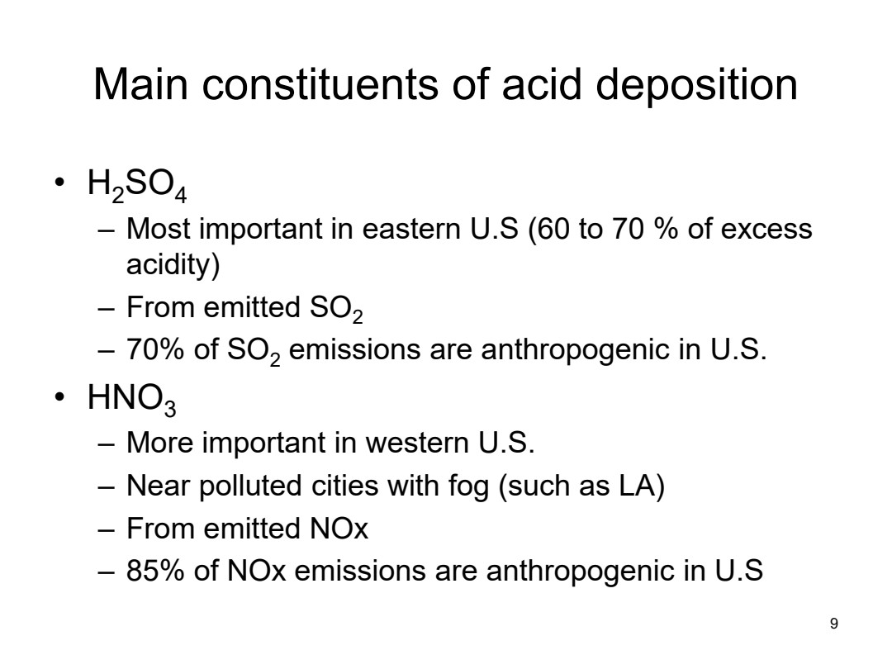

## PDF page 10

Source locator: `ENV4120-07-aciddeposition-antarcticozonehole`, PDF p. 10. [Original PDF page](../../originals/4120/07_AcidDeposition%26AntarcticOzoneHole.pdf#page=10).

Printed slide number candidate: 10 (use PDF page as canonical locator).

Generated navigation topics: Pollution sources and emissions, Ozone and atmospheric chemistry

Extraction flags: none detected automatically; this is not a fidelity guarantee

### Extracted source text

> Main constituents of acid deposition
> 10
> • HCl
> – Wood burning or industrial processing emissions
> – Waste incineration
> – Only about 5% of acidity
> • Role of other acids are not as important
> – Formic (HCOOH) & acetic acid (vinegar, CH3COOH)
> • Acid rain control is very successful in US due to 
> increasingly stringent emission controls

### Original page appearance

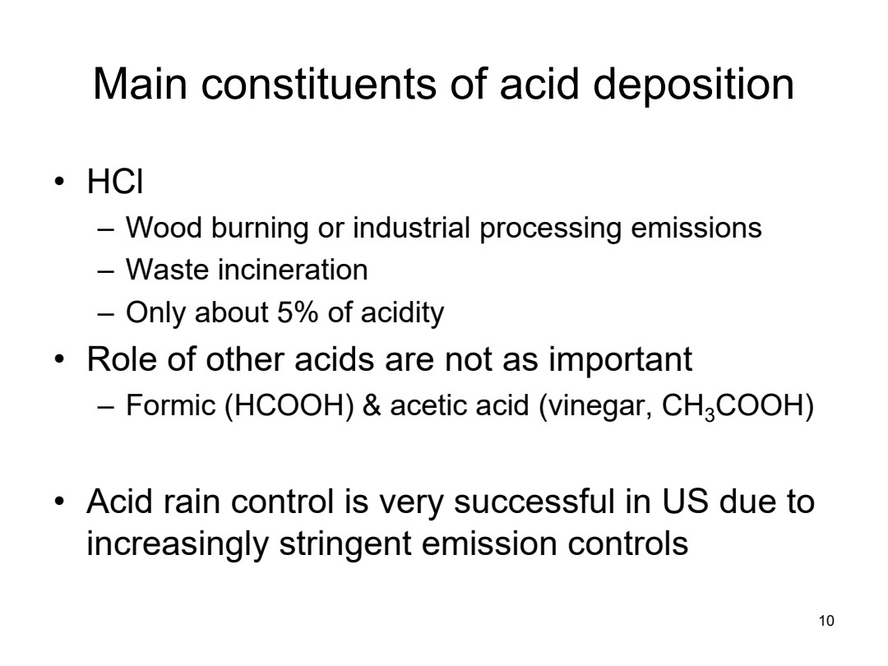

## PDF page 11

Source locator: `ENV4120-07-aciddeposition-antarcticozonehole`, PDF p. 11. [Original PDF page](../../originals/4120/07_AcidDeposition%26AntarcticOzoneHole.pdf#page=11).

Printed slide number candidate: 11 (use PDF page as canonical locator).

Generated navigation topics: Ozone and atmospheric chemistry

Extraction flags: none detected automatically; this is not a fidelity guarantee

### Extracted source text

> pH of rain
> The National Atmospheric Deposition Program 
> (NADP) monitors precipitation chemistry, National 
> Trends Network (NTN), https://nadp.slh.wisc.edu/
> 1985
> 1990
> 1995
> 2000
> 2005
> 2010
> 2015
> 11

### Original page appearance

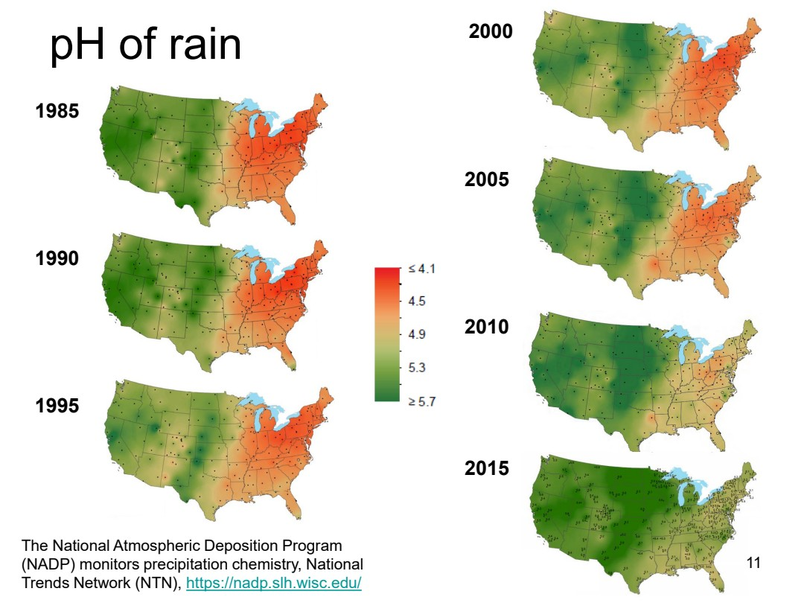

## PDF page 12

Source locator: `ENV4120-07-aciddeposition-antarcticozonehole`, PDF p. 12. [Original PDF page](../../originals/4120/07_AcidDeposition%26AntarcticOzoneHole.pdf#page=12).

Printed slide number candidate: 12 (use PDF page as canonical locator).

Generated navigation topics: Ozone and atmospheric chemistry

Extraction flags: sparse-text

### Extracted source text

> Antarctic Ozone Hole
> 12

### Original page appearance

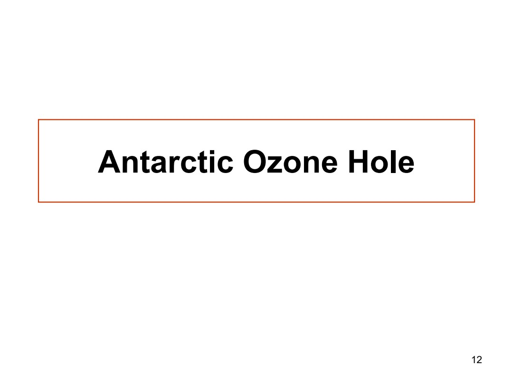

## PDF page 13

Source locator: `ENV4120-07-aciddeposition-antarcticozonehole`, PDF p. 13. [Original PDF page](../../originals/4120/07_AcidDeposition%26AntarcticOzoneHole.pdf#page=13).

Printed slide number candidate: 13 (use PDF page as canonical locator).

Generated navigation topics: Exposure and health, Ozone and atmospheric chemistry

Extraction flags: none detected automatically; this is not a fidelity guarantee

### Extracted source text

> Introduction
> 13
> • Ozone presented in both troposphere and 
> stratosphere
> • In troposphere → bad ozone
> – Health effect when exposed to
> – Contribute to global warming
> • In stratosphere → good ozone
> – Absorbs harmful UV
> • 90% of ozone are in stratosphere

### Original page appearance

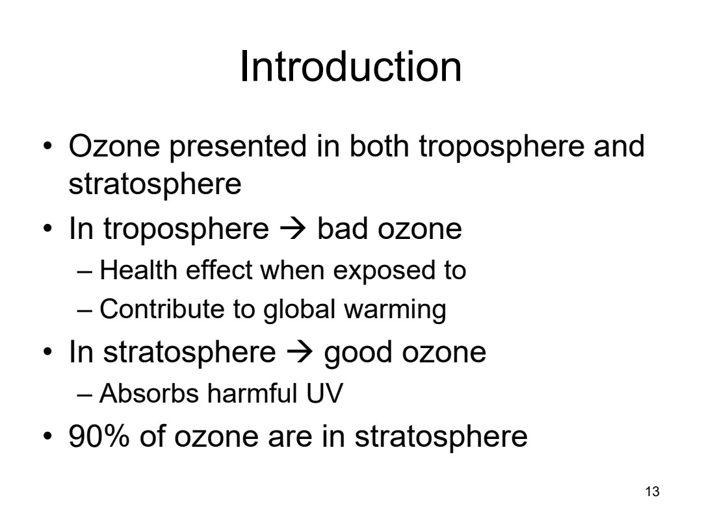

## PDF page 14

Source locator: `ENV4120-07-aciddeposition-antarcticozonehole`, PDF p. 14. [Original PDF page](../../originals/4120/07_AcidDeposition%26AntarcticOzoneHole.pdf#page=14).

Printed slide number candidate: 14 (use PDF page as canonical locator).

Generated navigation topics: Ozone and atmospheric chemistry

Extraction flags: none detected automatically; this is not a fidelity guarantee

### Extracted source text

> Ozone layer structure
> 14
> • Vertically: peak at 25-32 km altitude
> – Sweet spot with just enough UV and O2 to form O3
> – Different chemistry with ground level ozone formation!

### Original page appearance

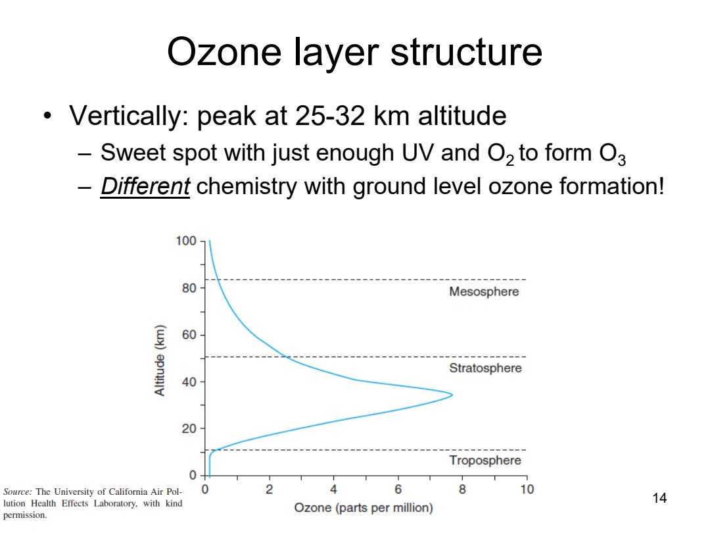

## PDF page 15

Source locator: `ENV4120-07-aciddeposition-antarcticozonehole`, PDF p. 15. [Original PDF page](../../originals/4120/07_AcidDeposition%26AntarcticOzoneHole.pdf#page=15).

Printed slide number candidate: 15 (use PDF page as canonical locator).

Generated navigation topics: Ozone and atmospheric chemistry, Policy and management context

Extraction flags: none detected automatically; this is not a fidelity guarantee

### Extracted source text

> Ozone layer structure
> 15
> • Traditionally, ozone concentration 
> expressed in Dubson Unit (DU)
> – Layer of gas that would be 10 µm think under 
> standard temperature and pressure
> – Globally ozone average concentration ~ 300 
> DU
> • Ozone concentration varies vertically and 
> horizontally

### Original page appearance

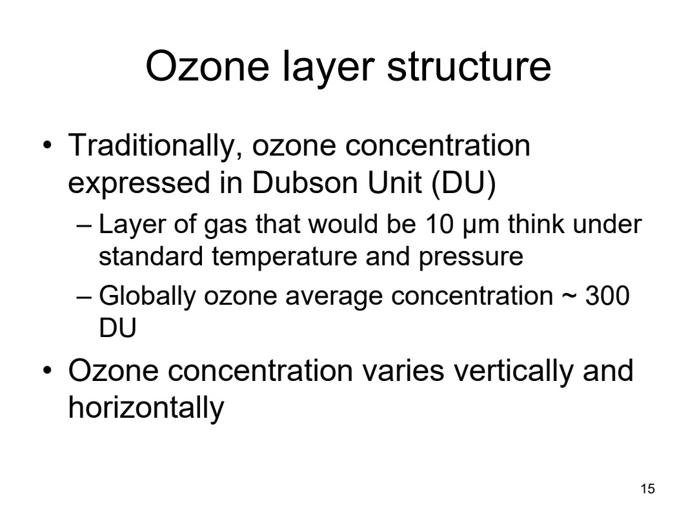

## PDF page 16

Source locator: `ENV4120-07-aciddeposition-antarcticozonehole`, PDF p. 16. [Original PDF page](../../originals/4120/07_AcidDeposition%26AntarcticOzoneHole.pdf#page=16).

Printed slide number candidate: 16 (use PDF page as canonical locator).

Generated navigation topics: Ozone and atmospheric chemistry

Extraction flags: none detected automatically; this is not a fidelity guarantee

### Extracted source text

> Horizontal ozone layer structure
> 16
> Ozone concentration variation with time & 
> latitude as measured by NASA TOMS 
> satellite (Jacobson, 2002)
> Low at equator
> North hemisphere 
> high in north 
> spring
> South 
> hemisphere high 
> in south spring
> Antarctic 
> ozone hole

### Original page appearance

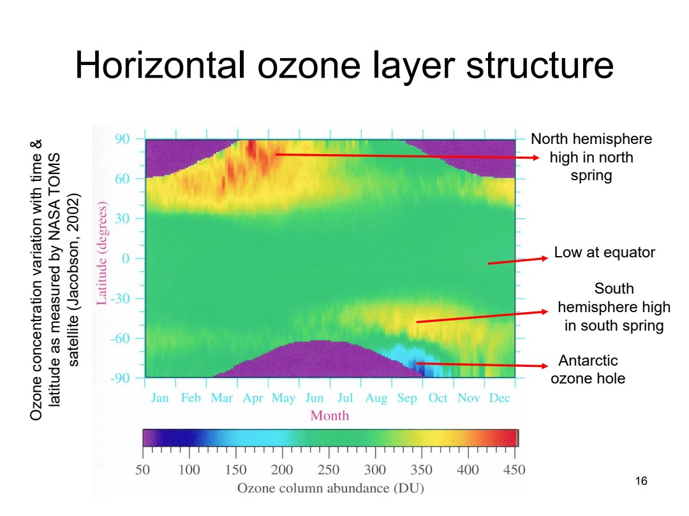

## PDF page 17

Source locator: `ENV4120-07-aciddeposition-antarcticozonehole`, PDF p. 17. [Original PDF page](../../originals/4120/07_AcidDeposition%26AntarcticOzoneHole.pdf#page=17).

Printed slide number candidate: 17 (use PDF page as canonical locator).

Generated navigation topics: Ozone and atmospheric chemistry

Extraction flags: sparse-text

### Extracted source text

> Ozone layer function
> 17
> • Ozone absorbs harmful UV radiation 

### Original page appearance

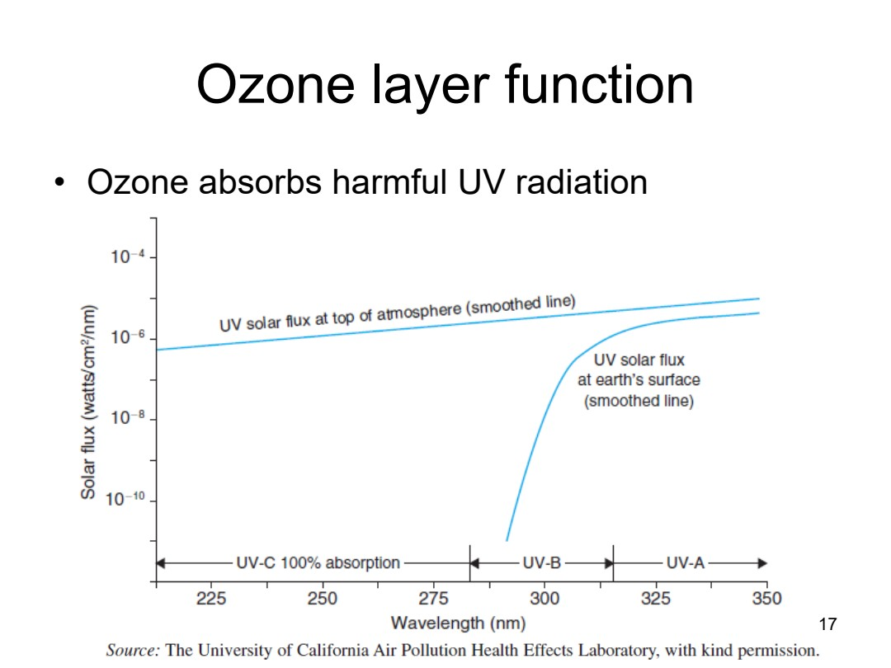

## PDF page 18

Source locator: `ENV4120-07-aciddeposition-antarcticozonehole`, PDF p. 18. [Original PDF page](../../originals/4120/07_AcidDeposition%26AntarcticOzoneHole.pdf#page=18).

Printed slide number candidate: 18 (use PDF page as canonical locator).

Generated navigation topics: Ozone and atmospheric chemistry

Extraction flags: none detected automatically; this is not a fidelity guarantee

### Extracted source text

> Ozone layer function
> 18
> • Ozone absorbs UV radiation between 250-
> 345 nm
> – Strongly at 310 nm
> – Weakly between 310-345 nm
> – N2, O2 absorbs far-UV (10-250 nm)
> • Allow little UV-C, some UV-B and most 
> UV-A reaches troposphere
> • Some say, without ozone layer, no life 
> form as we know will exist

### Original page appearance

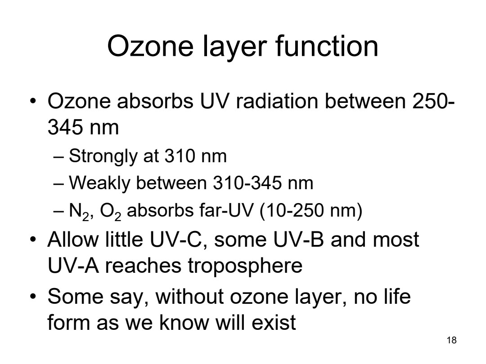

## PDF page 19

Source locator: `ENV4120-07-aciddeposition-antarcticozonehole`, PDF p. 19. [Original PDF page](../../originals/4120/07_AcidDeposition%26AntarcticOzoneHole.pdf#page=19).

Printed slide number candidate: 19 (use PDF page as canonical locator).

Generated navigation topics: Ozone and atmospheric chemistry

Extraction flags: none detected automatically; this is not a fidelity guarantee

### Extracted source text

> Ozone depletion issues
> 19
> • Largest ozone reduction observed near N/S poles
> • Substantial ozone reduction above Antarctic observed 
> at the beginning of southern hemisphere spring
> – Antarctic ozone hole
> – Up to 70% reduction
> – When ozone column abundance < 220 DU: ozone hole
> • Ozone reduction in Arctic also observed
> – Less severe (up to 25%)
> – Arctic ozone dent

### Original page appearance

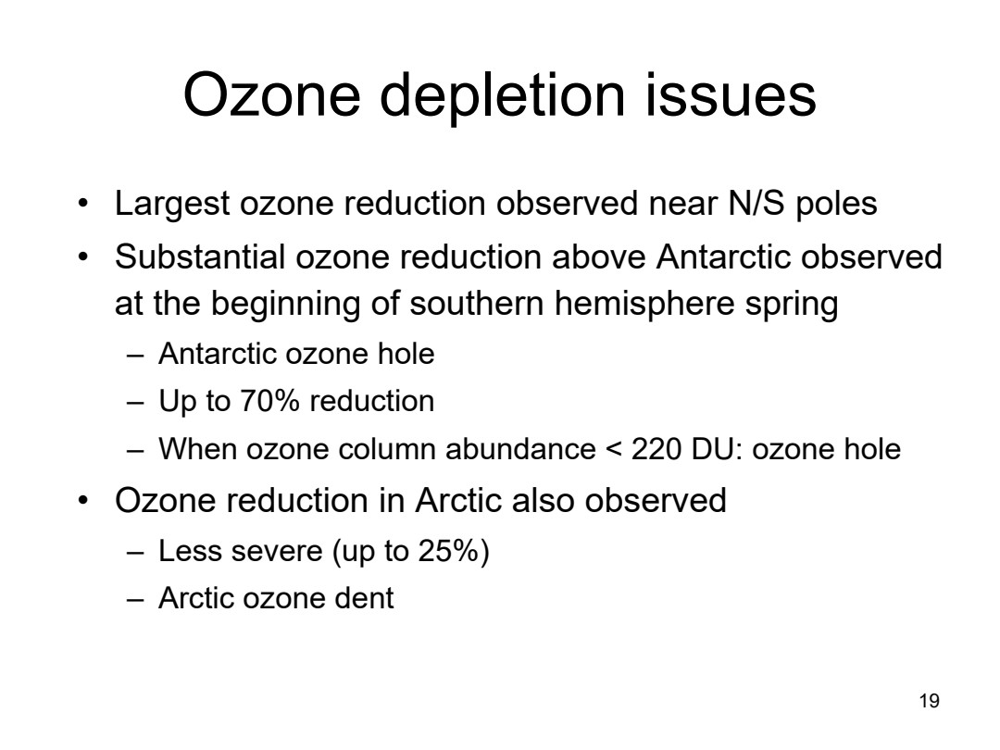

## PDF page 20

Source locator: `ENV4120-07-aciddeposition-antarcticozonehole`, PDF p. 20. [Original PDF page](../../originals/4120/07_AcidDeposition%26AntarcticOzoneHole.pdf#page=20).

Printed slide number candidate: not identified (use PDF page as canonical locator).

Generated navigation topics: Measurement methods and instruments, Ozone and atmospheric chemistry

Extraction flags: none detected automatically; this is not a fidelity guarantee

### Extracted source text

> What is the ozone hole?
> The average amount of ozone in the atmosphere is roughly 300 Dobson Units (DU), 
> equivalent to a layer 3 mm thick. Instruments on ground (at Halley) and above Antarctica 
> measured an acute drop in total atmospheric ozone during October in the early 1980s.
> The ozone “hole” is an area where ozone 
> concentration drops to below 220 DU.
> October 4, 2024
> ozone hole areaaverage ozone concentration (1 DU = 0.01 mm thickness)
> ozone hole 
> (<220 DU)
> avg = 300 DU
> October data; instruments located on ground at Halley and 
> high above Antarctica (Total Ozone Mapping Spectrometer 
> [TOMS] and Ozone Monitoring Instrument [OMI]).
> 220
> http://ozonewatch.gsfc.nasa.gov/facts/history_SH.html

### Original page appearance

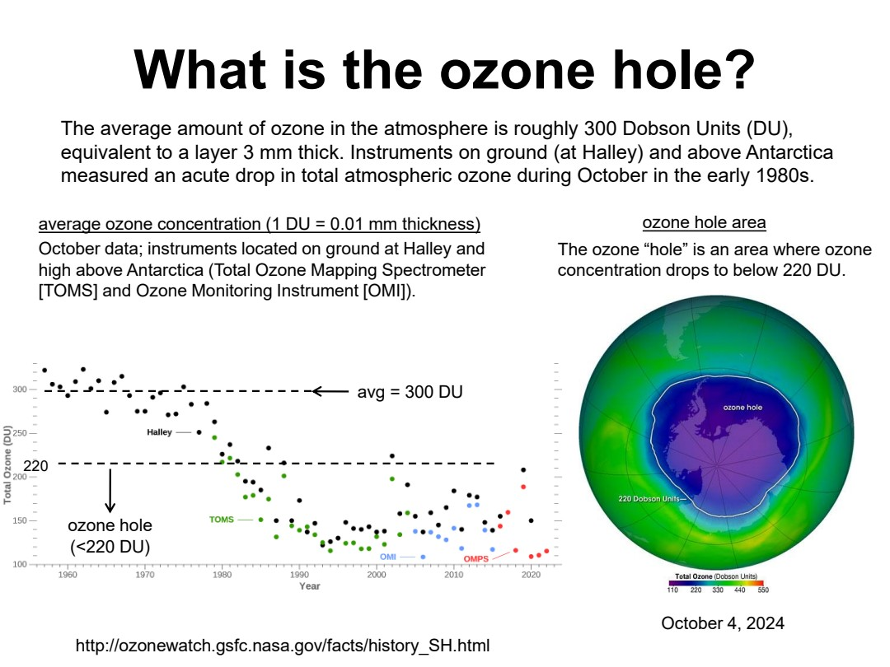

## PDF page 21

Source locator: `ENV4120-07-aciddeposition-antarcticozonehole`, PDF p. 21. [Original PDF page](../../originals/4120/07_AcidDeposition%26AntarcticOzoneHole.pdf#page=21).

Printed slide number candidate: not identified (use PDF page as canonical locator).

Generated navigation topics: Ozone and atmospheric chemistry

Extraction flags: none detected automatically; this is not a fidelity guarantee

### Extracted source text

> Ozone depletion issues
> 21Antarctic ozone hole from 1979 to 2024
> (NASA Ozone watch http://ozonewatch.gsfc.nasa.gov/monthly/SH.html)

### Original page appearance

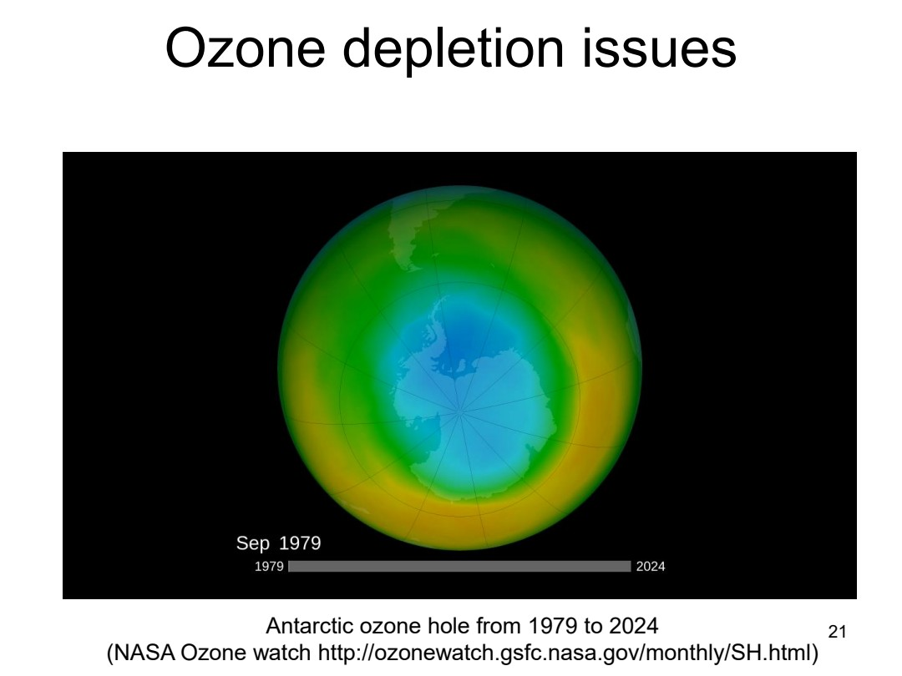

## PDF page 22

Source locator: `ENV4120-07-aciddeposition-antarcticozonehole`, PDF p. 22. [Original PDF page](../../originals/4120/07_AcidDeposition%26AntarcticOzoneHole.pdf#page=22).

Printed slide number candidate: not identified (use PDF page as canonical locator).

Generated navigation topics: Ozone and atmospheric chemistry

Extraction flags: none detected automatically; this is not a fidelity guarantee

### Extracted source text

> Ozone depletion issues
> 22Antarctic ozone hole from 7/1/22 to 12/31/22
> (NASA Ozone watch http://ozonewatch.gsfc.nasa.gov/monthly/SH.html)

### Original page appearance

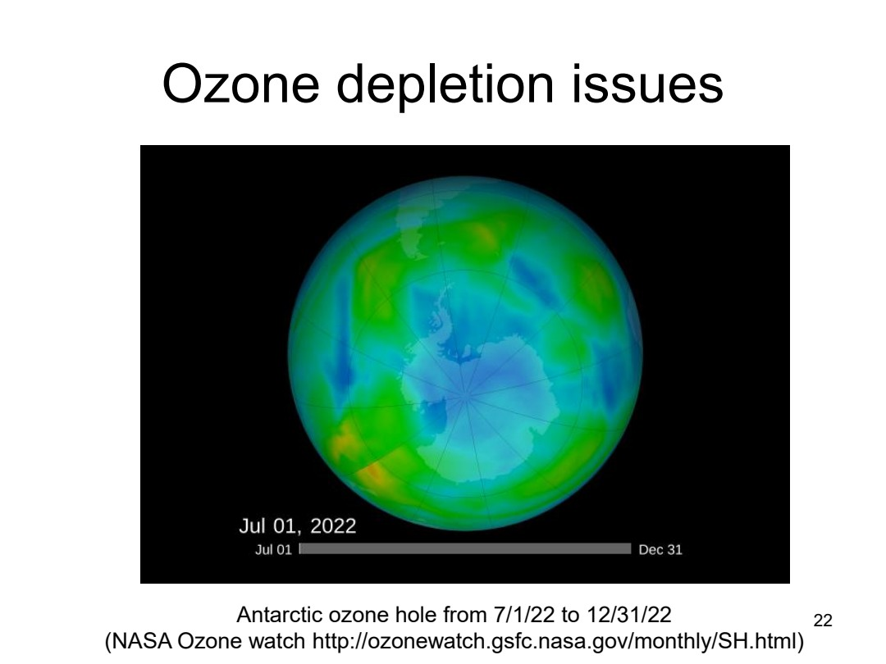

## PDF page 23

Source locator: `ENV4120-07-aciddeposition-antarcticozonehole`, PDF p. 23. [Original PDF page](../../originals/4120/07_AcidDeposition%26AntarcticOzoneHole.pdf#page=23).

Printed slide number candidate: 23 (use PDF page as canonical locator).

Generated navigation topics: Ozone and atmospheric chemistry

Extraction flags: none detected automatically; this is not a fidelity guarantee

### Extracted source text

> Stratospheric ozone chemistry - CFCs
> 23
> • Chlorofluorocarbons (CFC)
> – Contains chlorine (Cl) and fluorine (F)
> – Produced synthetically
> – Cheap, nontoxic, nonflammable, nonexplosive, 
> insoluble, relatively inert
> – Used in refrigeration, spray cans, blowing agent
> – Average lifetime ~ 75 years
> • There are also other halogenated species: 
> HCFCs, HFCs, bromine containing chemicals…

### Original page appearance

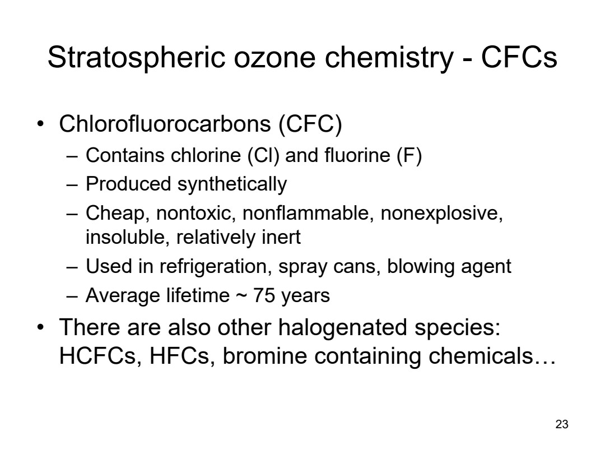

## PDF page 24

Source locator: `ENV4120-07-aciddeposition-antarcticozonehole`, PDF p. 24. [Original PDF page](../../originals/4120/07_AcidDeposition%26AntarcticOzoneHole.pdf#page=24).

Printed slide number candidate: 24 (use PDF page as canonical locator).

Generated navigation topics: Ozone and atmospheric chemistry

Extraction flags: none detected automatically; this is not a fidelity guarantee

### Extracted source text

> Stratospheric ozone chemistry - CFCs
> 24
> • In stratosphere, CFC break down when exposed 
> to far-UV, release ClOx and atomic chlorine
> • CFC don’t break down in troposphere (why?)
> – Hence climb to stratosphere
> • Destruct ozone through the generalized catalytic 
> ozone destruction mechanism
> Cl + O3 → ClO + O2
> ClO + O → Cl + O2
> NET:        O + O₃ → 2O₂
> active chlorine

### Original page appearance

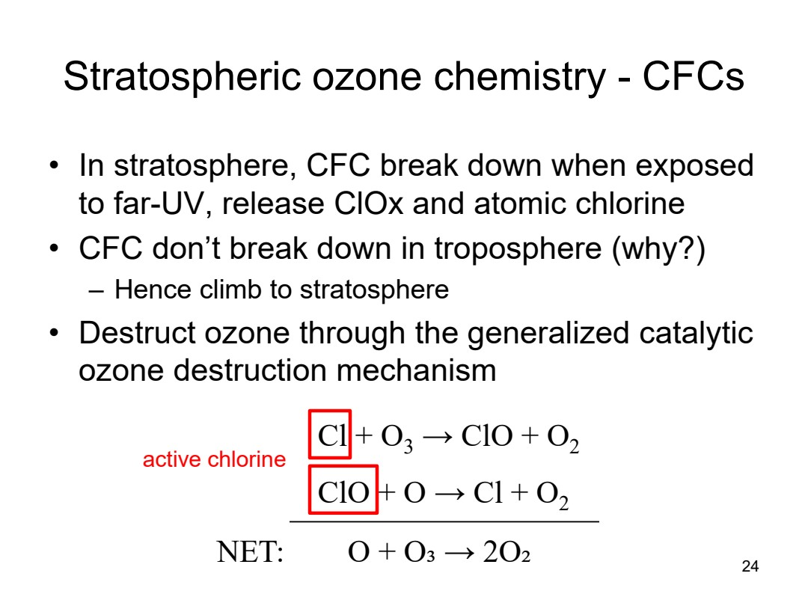

## PDF page 25

Source locator: `ENV4120-07-aciddeposition-antarcticozonehole`, PDF p. 25. [Original PDF page](../../originals/4120/07_AcidDeposition%26AntarcticOzoneHole.pdf#page=25).

Printed slide number candidate: 25 (use PDF page as canonical locator).

Generated navigation topics: Ozone and atmospheric chemistry

Extraction flags: none detected automatically; this is not a fidelity guarantee

### Extracted source text

> Stratospheric ozone chemistry - CFCs
> 25
> • -Cl chain length: 10 -1,000 (Jacobson, 2002)
> – One Cl molecule on average destructs 10-1,000 
> ozone molecules in lower and upper stratosphere, 
> respectively. Aka chain length
> – Bigger chain length number, more powerful ozone 
> destruction
> • -Br chain length: 100 - 10,000 (Jacobson, 2002)
> – Slower reaction, more efficient
> • The estimated numbers vary

### Original page appearance

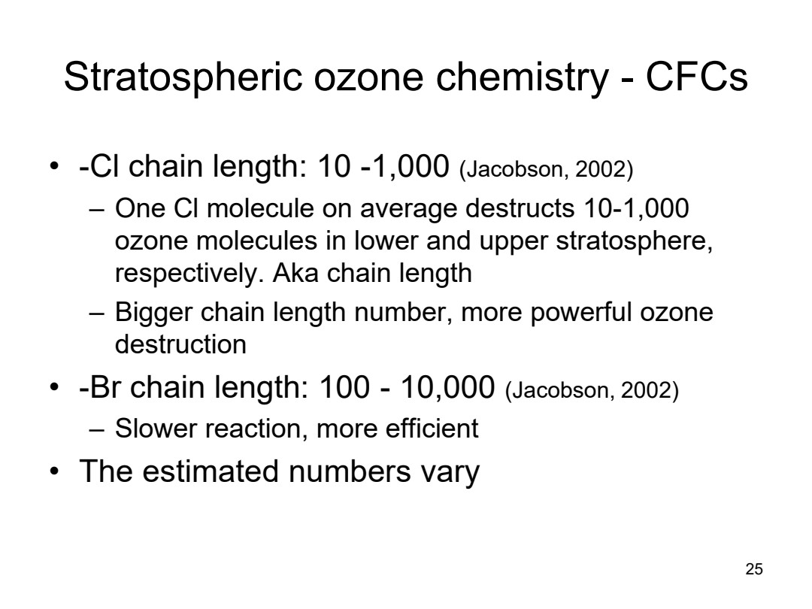

## PDF page 26

Source locator: `ENV4120-07-aciddeposition-antarcticozonehole`, PDF p. 26. [Original PDF page](../../originals/4120/07_AcidDeposition%26AntarcticOzoneHole.pdf#page=26).

Printed slide number candidate: 26 (use PDF page as canonical locator).

Generated navigation topics: Ozone and atmospheric chemistry

Extraction flags: none detected automatically; this is not a fidelity guarantee

### Extracted source text

> Stratospheric ozone chemistry - CFCs
> 26
> • Sink of active chlorine (Cl, ClO)
> – Reactions to form reservoir species: HCl and ClONO2
> • Hydrochloric acid and chlorine nitrate
> – Temporarily store chlorine
> – When sunlight present, can photolyzed back to free 
> chlorine, continue ozone destruction
> • Bromine chemistry is similar

### Original page appearance

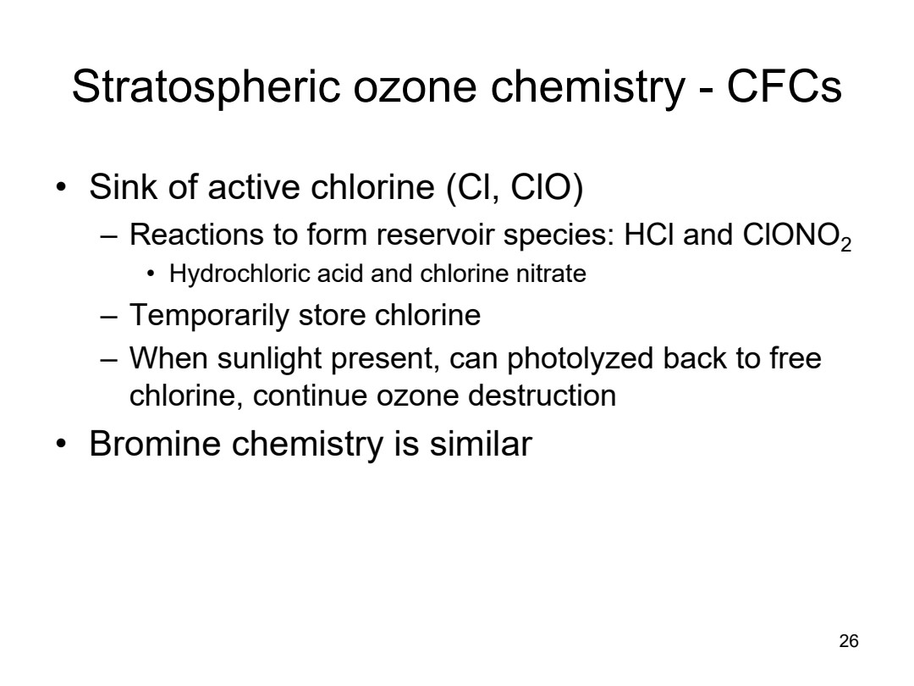

## PDF page 27

Source locator: `ENV4120-07-aciddeposition-antarcticozonehole`, PDF p. 27. [Original PDF page](../../originals/4120/07_AcidDeposition%26AntarcticOzoneHole.pdf#page=27).

Printed slide number candidate: 27 (use PDF page as canonical locator).

Generated navigation topics: Ozone and atmospheric chemistry

Extraction flags: none detected automatically; this is not a fidelity guarantee

### Extracted source text

> Ozone depletion issues
> 27
> • Ozone reduction near N/S poles generally 
> observed in/near spring time
> – Spring time differs for north/south hemisphere
> • One factor: Cl and Br in stratosphere & their 
> chemistry in polar stratospheric clouds (PSC)
> – Recall that active chlorine (Cl, ClO)/Br destroy ozone 
> through generalized catalytic mechanism

### Original page appearance

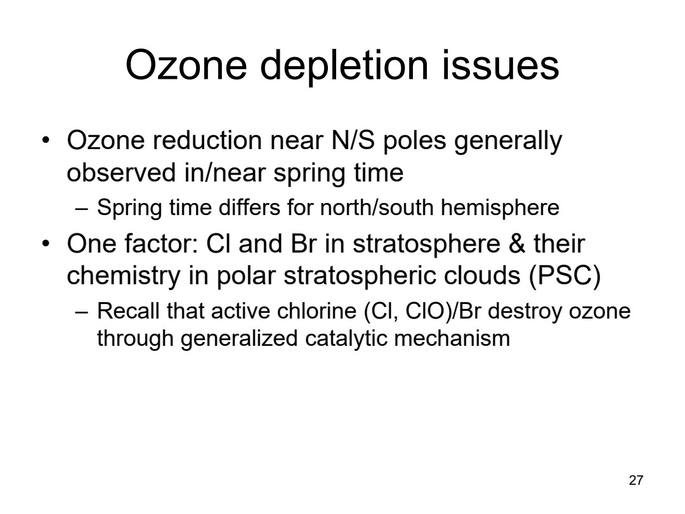

## PDF page 28

Source locator: `ENV4120-07-aciddeposition-antarcticozonehole`, PDF p. 28. [Original PDF page](../../originals/4120/07_AcidDeposition%26AntarcticOzoneHole.pdf#page=28).

Printed slide number candidate: 28 (use PDF page as canonical locator).

Generated navigation topics: Unclassified; inspect source.

Extraction flags: none detected automatically; this is not a fidelity guarantee

### Extracted source text

> Polar stratospheric clouds 
> 28
> Polar Stratospheric Cloud, seen from the NASA DC-8 
> on 14 January 2003 (photograph by Paul Newman, 
> GSFC) http://remus.jpl.nasa.gov/kiruna/a015.htm

### Original page appearance

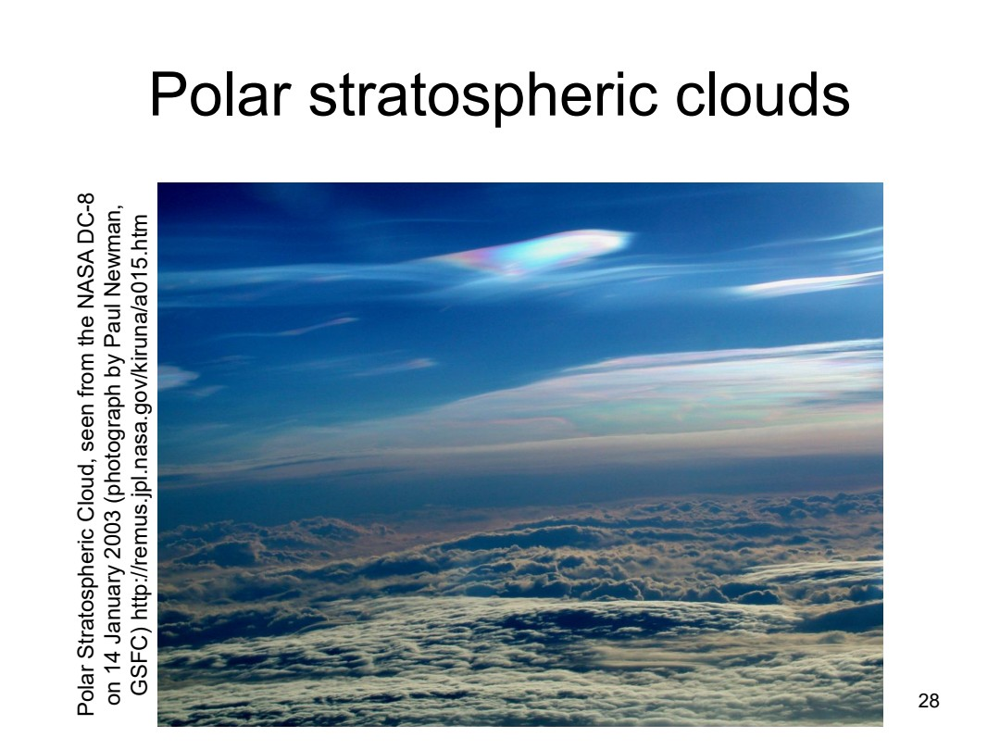

## PDF page 29

Source locator: `ENV4120-07-aciddeposition-antarcticozonehole`, PDF p. 29. [Original PDF page](../../originals/4120/07_AcidDeposition%26AntarcticOzoneHole.pdf#page=29).

Printed slide number candidate: not identified (use PDF page as canonical locator).

Generated navigation topics: Unclassified; inspect source.

Extraction flags: sparse-text

### Extracted source text

> Polar stratospheric clouds 
> 29PSC as seen in Scandinavia (source unknown)

### Original page appearance

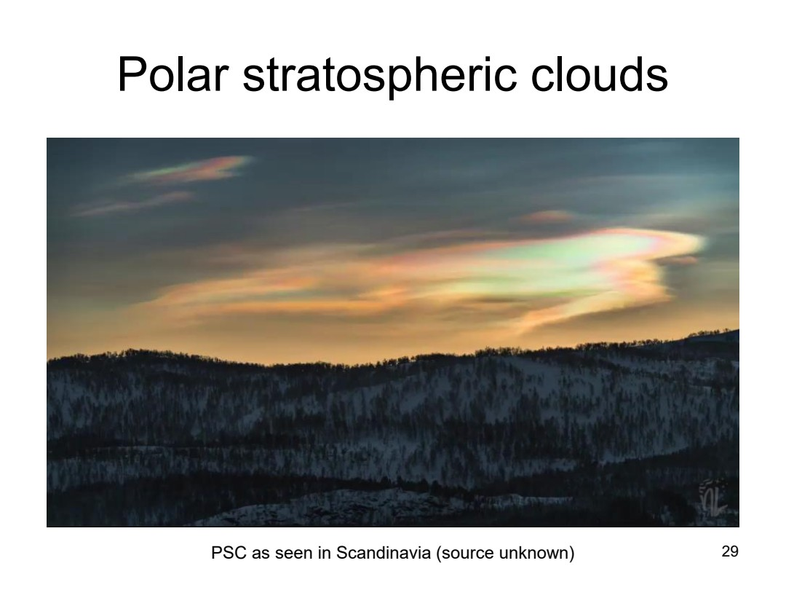

## PDF page 30

Source locator: `ENV4120-07-aciddeposition-antarcticozonehole`, PDF p. 30. [Original PDF page](../../originals/4120/07_AcidDeposition%26AntarcticOzoneHole.pdf#page=30).

Printed slide number candidate: 30 (use PDF page as canonical locator).

Generated navigation topics: Ozone and atmospheric chemistry

Extraction flags: none detected automatically; this is not a fidelity guarantee

### Extracted source text

> Ozone depletion process
> 30
> • During polar night (before spring)
> – Polar stratospheric clouds (PSC) forms → reactions 
> occur inside PSC → convert inactive Cl/Br (such as 
> reservoir species HCl and ClONO2) to species that 
> are photo-chemically active (Cl2, HOCl, ClNO2 etc)
> – Chlorine activation
> • Beginning of polar day (early spring)
> – Photo-chemically active species go through 
> photolysis reaction → release active Cl/Br (Cl, ClO) → 
> catalytically destroy ozone

### Original page appearance

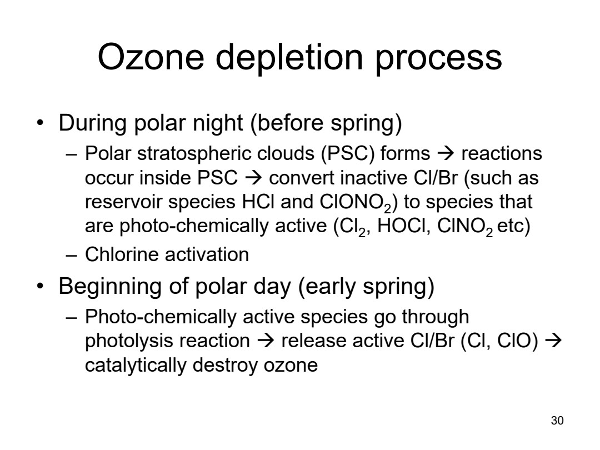

## PDF page 31

Source locator: `ENV4120-07-aciddeposition-antarcticozonehole`, PDF p. 31. [Original PDF page](../../originals/4120/07_AcidDeposition%26AntarcticOzoneHole.pdf#page=31).

Printed slide number candidate: 31 (use PDF page as canonical locator).

Generated navigation topics: Ozone and atmospheric chemistry

Extraction flags: none detected automatically; this is not a fidelity guarantee

### Extracted source text

> Ozone depletion process
> 31
> Ozone depletion process over Antarctica (Figure 4.11 Godish, 2003)

### Original page appearance

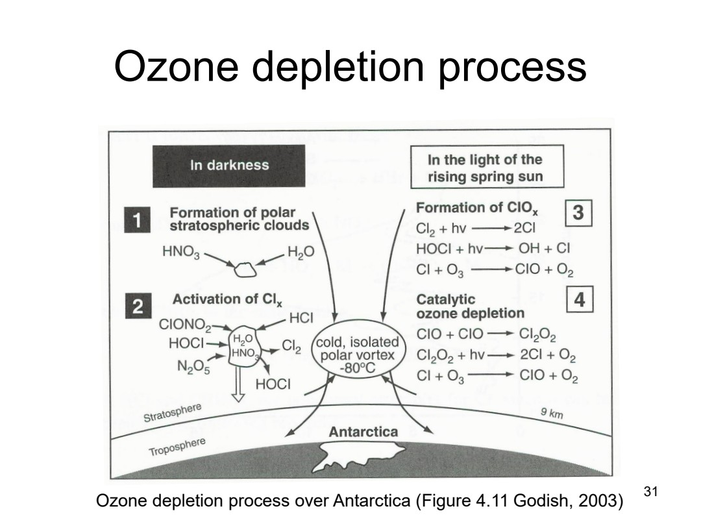

## PDF page 32

Source locator: `ENV4120-07-aciddeposition-antarcticozonehole`, PDF p. 32. [Original PDF page](../../originals/4120/07_AcidDeposition%26AntarcticOzoneHole.pdf#page=32).

Printed slide number candidate: 32 (use PDF page as canonical locator).

Generated navigation topics: Ozone and atmospheric chemistry

Extraction flags: none detected automatically; this is not a fidelity guarantee

### Extracted source text

> Ozone depletion process
> 32
> • Why ozone depletion is less severe in north 
> pole?
> • Temperature higher in Arctic
> – Less PSC formation, less chlorine activation
> – Higher temperature due to difference in land cover
> • Ocean in Arctic vs land in Antarctic
> • Polar vortex not as strong in arctic due to rough terrain

### Original page appearance

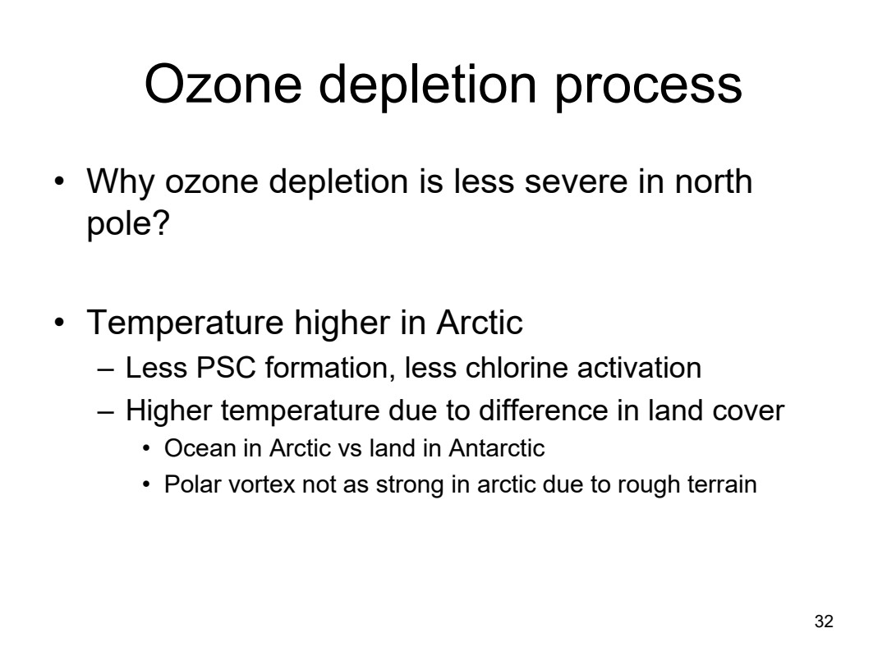

## PDF page 33

Source locator: `ENV4120-07-aciddeposition-antarcticozonehole`, PDF p. 33. [Original PDF page](../../originals/4120/07_AcidDeposition%26AntarcticOzoneHole.pdf#page=33).

Printed slide number candidate: not identified (use PDF page as canonical locator).

Generated navigation topics: Ozone and atmospheric chemistry

Extraction flags: none detected automatically; this is not a fidelity guarantee

### Extracted source text

> Stratospheric Ozone 
> Depletion
> Websites:
> http://ozonewatch.gsfc.nasa.gov/
> http://www.ozonelayer.noaa.gov/
> http://www.youtube.com/watch?v=
> aKHcHmg4WKY

### Original page appearance

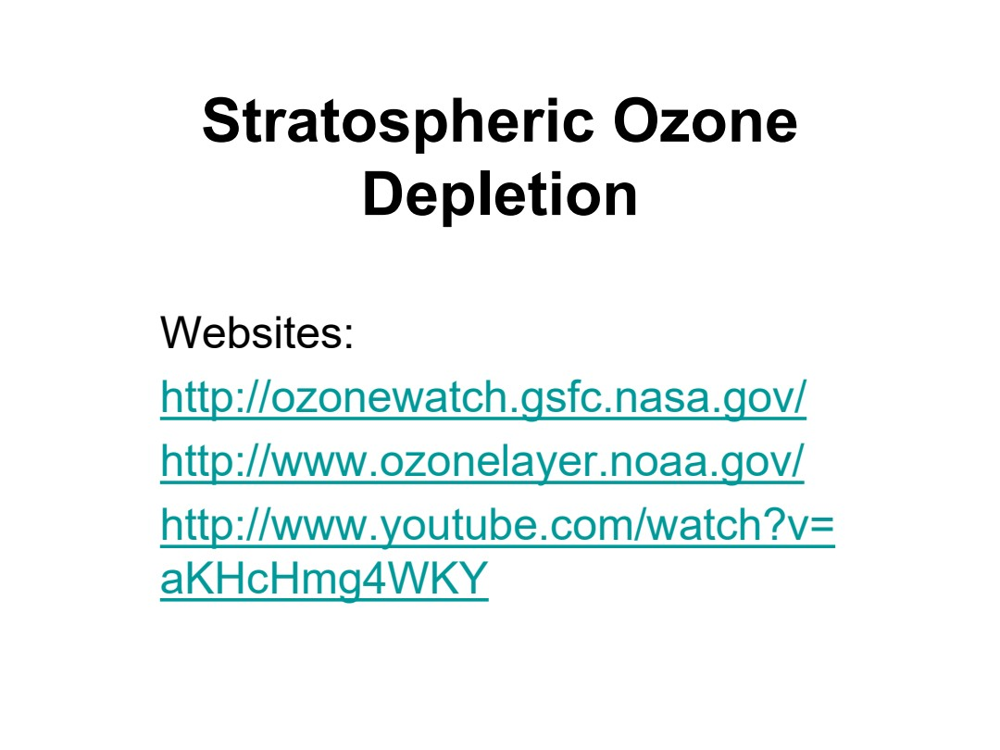
