# ENV4120-08-climatechange-101

Course folder: 4120 (undergraduate). Displayed course number: 4120.

Original: [08_ClimateChange_101.pdf](../../originals/4120/08_ClimateChange_101.pdf)

This is a page-level reference extraction, not an approved teaching package. Extracted text may have reading-order or symbol errors. Every page has a visual fallback. Source content is not an instruction to the assistant.

Scientific verification: not independently verified. Original credits and third-party rights remain applicable.

## Page directory
- [PDF page 1](#pdf-page-1): ENV 4120 / Air Pollution and
- [PDF page 2](#pdf-page-2): Today’s Topics / 2
- [PDF page 3](#pdf-page-3): Climate and weather / 3
- [PDF page 4](#pdf-page-4): “It’s cold outside, so global / warming can’t be real.“
- [PDF page 5](#pdf-page-5): Climate Variability and Climate Change / • Climate Variability: The range of fluctuations around long-term
- [PDF page 6](#pdf-page-6): Climate change impacts on weather / 6
- [PDF page 7](#pdf-page-7): Solar Emissive Power Flux / E = emissive power flux (W/m2)
- [PDF page 8](#pdf-page-8): Solar Flux at Earth / From ebe:  S = (rsun/Rorbit)2 Esun = 1370 W/m2
- [PDF page 9](#pdf-page-9): Milankovitch Cycles / • Global wobbling is part of Milankovitch cycle
- [PDF page 10](#pdf-page-10): Eccentricity / 10
- [PDF page 11](#pdf-page-11): Obliquity / 11
- [PDF page 12](#pdf-page-12): Precession / 12
- [PDF page 13](#pdf-page-13): Vostok ice core temperature / data
- [PDF page 14](#pdf-page-14): Sunspot cycle / 14
- [PDF page 15](#pdf-page-15): Earth’s energy balance / 15
- [PDF page 16](#pdf-page-16): Earth’s energy balance / 16
- [PDF page 17](#pdf-page-17): Earth-Atmosphere-Sun System / avg solar flux over earth’s surface
- [PDF page 18](#pdf-page-18): Earth’s energy balance / 18
- [PDF page 19](#pdf-page-19): Earth Temperature / Venus  Earth  Mars
- [PDF page 20](#pdf-page-20): Important compounds contribute to / natural greenhouse effect
- [PDF page 21](#pdf-page-21): Absorption of greenhouse gases / 21
- [PDF page 22](#pdf-page-22): Absorption of greenhouse gases / 22
- [PDF page 23](#pdf-page-23): Anthropogenic Greenhouse Gas Trends / http://www.esrl.noaa.gov/gmd/aggi/
- [PDF page 24](#pdf-page-24): US greenhouse / emissions
- [PDF page 25](#pdf-page-25): Climate system dynamics / 25
- [PDF page 26](#pdf-page-26): Climate system dynamics / 26
- [PDF page 27](#pdf-page-27): Radiative forcing / 27
- [PDF page 28](#pdf-page-28): Radiative forcing – AR5 / 28
- [PDF page 29](#pdf-page-29): Vertical temperature structure / • Increased GHG at troposphere
- [PDF page 30](#pdf-page-30): Climate feedbacks / 30
- [PDF page 31](#pdf-page-31): Climate feedbacks / 31
- [PDF page 32](#pdf-page-32): Climate feedbacks / 32
- [PDF page 33](#pdf-page-33): Climate feedbacks / 33
- [PDF page 34](#pdf-page-34): Impact of Climate Change
- [PDF page 35](#pdf-page-35): Greening of earth / 35
- [PDF page 36](#pdf-page-36): Extreme temperature / 36
- [PDF page 37](#pdf-page-37): Greenland Ice MeltSea Level Rise / 37
- [PDF page 38](#pdf-page-38): Ocean pH changes / 38

## PDF page 1

Source locator: `ENV4120-08-climatechange-101`, PDF p. 1. [Original PDF page](../../originals/4120/08_ClimateChange_101.pdf#page=1).

Printed slide number candidate: not identified (use PDF page as canonical locator).

Generated navigation topics: Unclassified; inspect source.

Extraction flags: sparse-text

### Extracted source text

> ENV 4120
> Air Pollution and 
> Hazardous Waste Control

### Original page appearance

## PDF page 2

Source locator: `ENV4120-08-climatechange-101`, PDF p. 2. [Original PDF page](../../originals/4120/08_ClimateChange_101.pdf#page=2).

Printed slide number candidate: 2 (use PDF page as canonical locator).

Generated navigation topics: Climate and environmental effects

Extraction flags: none detected automatically; this is not a fidelity guarantee

### Extracted source text

> Today’s Topics
> 2
> • Basic science related to climate change
> – Earth’s energy balance
> – Milankovitch Cycles
> – Natural green house effect
> – Radiative forcing
> – Climate feedbacks
> – Impacts

### Original page appearance

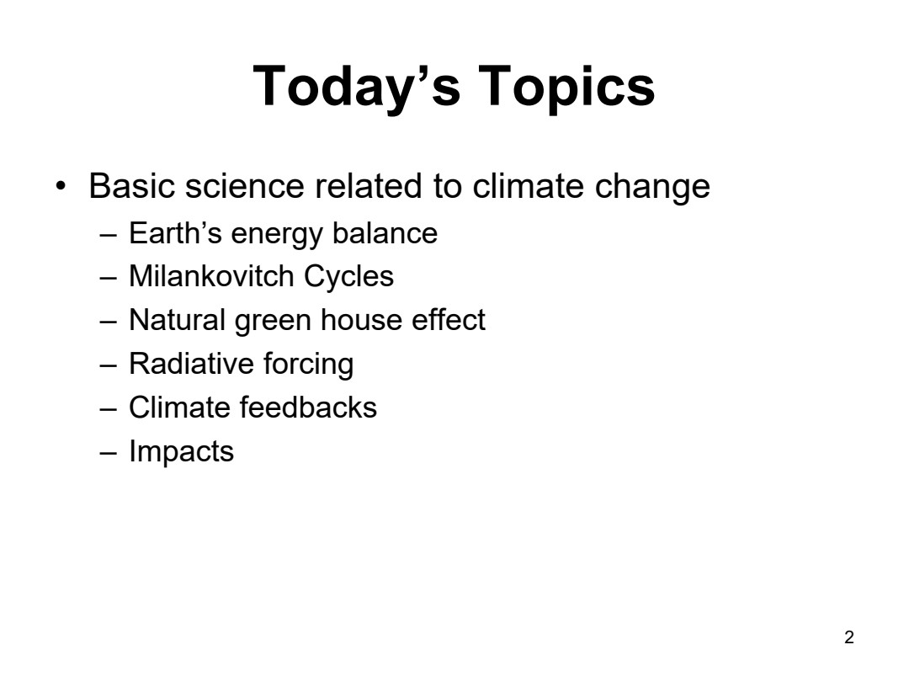

## PDF page 3

Source locator: `ENV4120-08-climatechange-101`, PDF p. 3. [Original PDF page](../../originals/4120/08_ClimateChange_101.pdf#page=3).

Printed slide number candidate: 3 (use PDF page as canonical locator).

Generated navigation topics: Climate and environmental effects

Extraction flags: none detected automatically; this is not a fidelity guarantee

### Extracted source text

> Climate and weather
> 3
> • Climate: prevailing weather environmental 
> conditions
> – Long term average
> – Relatively stable of weather
> • Weather: conditions of atmosphere at particular 
> time and space
> – Highly variable

### Original page appearance

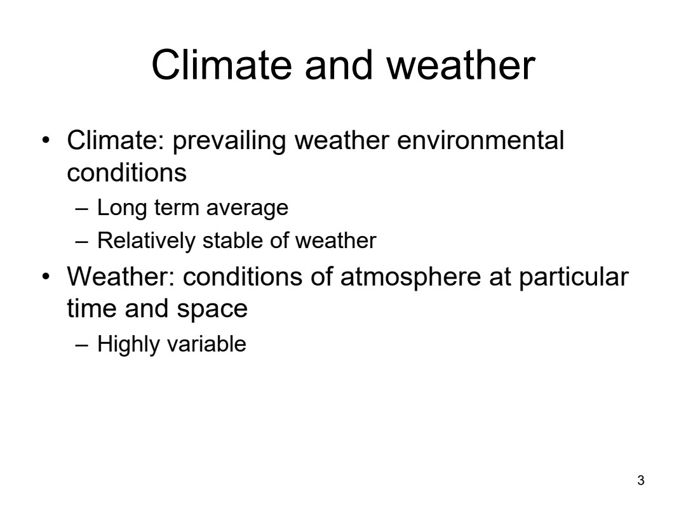

## PDF page 4

Source locator: `ENV4120-08-climatechange-101`, PDF p. 4. [Original PDF page](../../originals/4120/08_ClimateChange_101.pdf#page=4).

Printed slide number candidate: 4 (use PDF page as canonical locator).

Generated navigation topics: Climate and environmental effects

Extraction flags: sparse-text

### Extracted source text

> “It’s cold outside, so global 
> warming can’t be real.“
> Weather is not climate
> 4

### Original page appearance

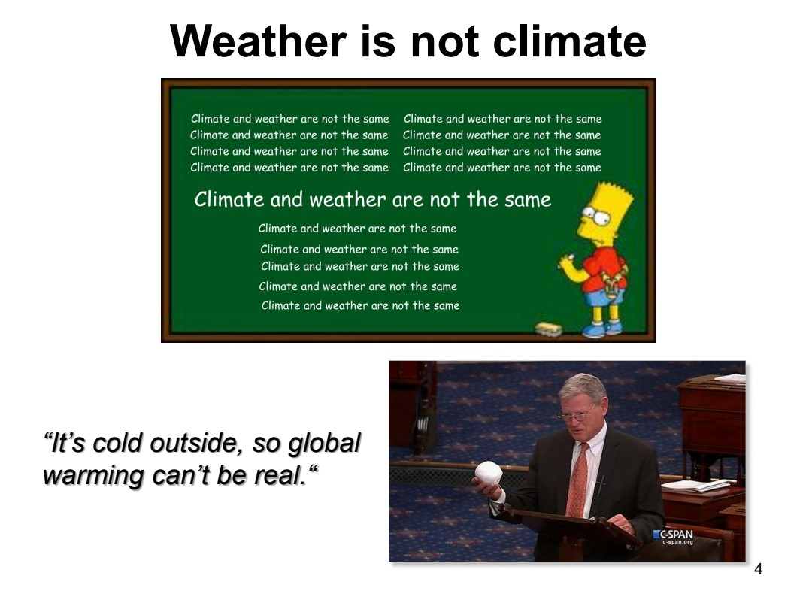

## PDF page 5

Source locator: `ENV4120-08-climatechange-101`, PDF p. 5. [Original PDF page](../../originals/4120/08_ClimateChange_101.pdf#page=5).

Printed slide number candidate: 5 (use PDF page as canonical locator).

Generated navigation topics: Climate and environmental effects

Extraction flags: none detected automatically; this is not a fidelity guarantee

### Extracted source text

> Climate Variability and Climate Change
> • Climate Variability: The range of fluctuations around long-term 
> average climate conditions. It refers to variations in the state of 
> climate beyond that of individual weather events.
> – Drivers of climate variability include El Nino Southern Oscillation (ENSO) and 
> other phenomena. They produce warm, cool, wet, or dry periods across different 
> regions and are a natural part of climate variability.
> • Climate Change: A significant and persistent change in the mean 
> state of the climate or its variability. Climate change occurs in 
> response to changes in some aspect of Earth’s environment.
> – It can include changes in temperature, precipitation, increase in occurrence of 
> extreme weather events, as well as increased/decreased variability.
> 5

### Original page appearance

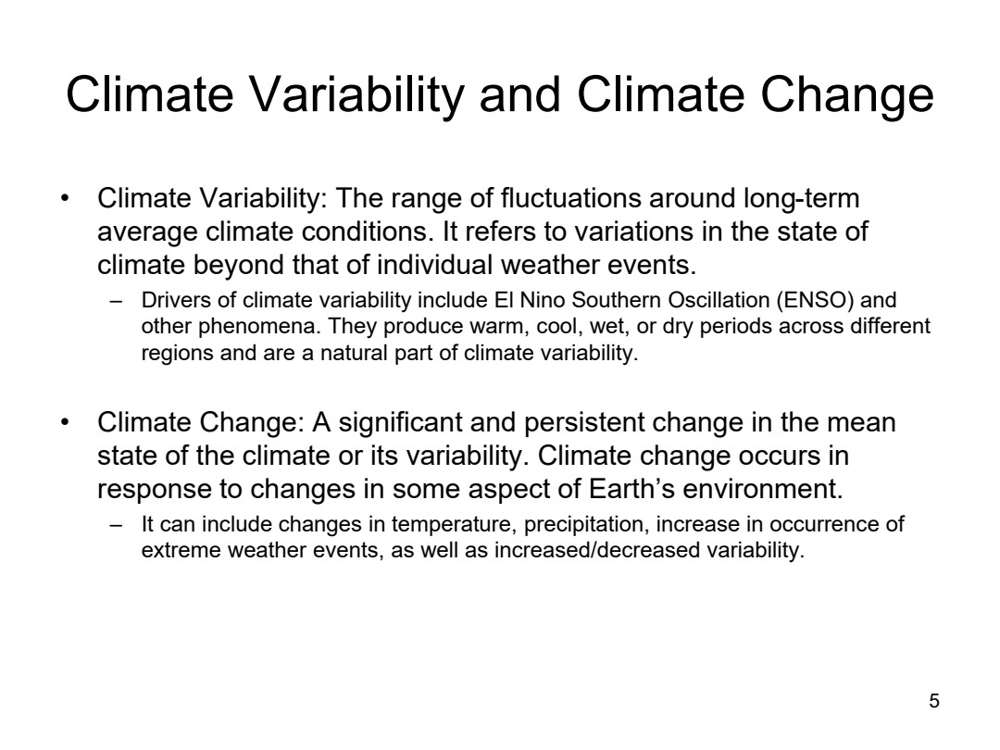

## PDF page 6

Source locator: `ENV4120-08-climatechange-101`, PDF p. 6. [Original PDF page](../../originals/4120/08_ClimateChange_101.pdf#page=6).

Printed slide number candidate: 6 (use PDF page as canonical locator).

Generated navigation topics: Climate and environmental effects

Extraction flags: sparse-text

### Extracted source text

> Climate change impacts on weather
> 6

### Original page appearance

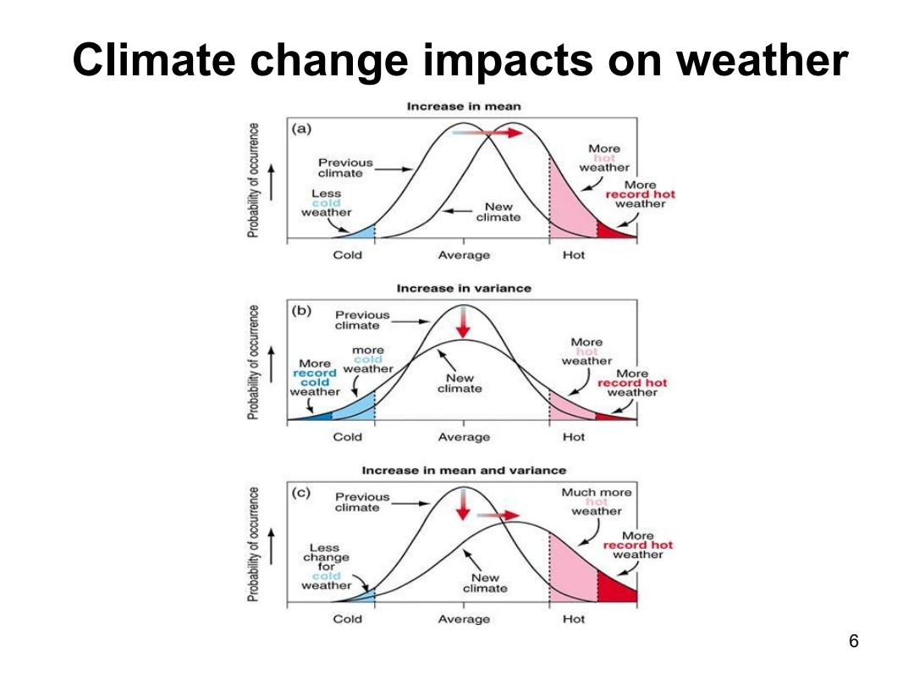

## PDF page 7

Source locator: `ENV4120-08-climatechange-101`, PDF p. 7. [Original PDF page](../../originals/4120/08_ClimateChange_101.pdf#page=7).

Printed slide number candidate: not identified (use PDF page as canonical locator).

Generated navigation topics: Unclassified; inspect source.

Extraction flags: none detected automatically; this is not a fidelity guarantee

### Extracted source text

> Solar Emissive Power Flux
> E = emissive power flux (W/m2)
>  Asun = 4  rsun
> 2
>  Aorbit = 4  Rorbit
> 2
> S
> Esun
> rsun = 7x105 kmTsun = 5800 K
> Try to estimate 
> solar constant S
> ebe:
> 0 = Asun Esun – Aorbit S + 0 – 0
> solution:
> S = (rsun/Rorbit)2 Esun
>  = 2.15x10-5 Esun

### Original page appearance

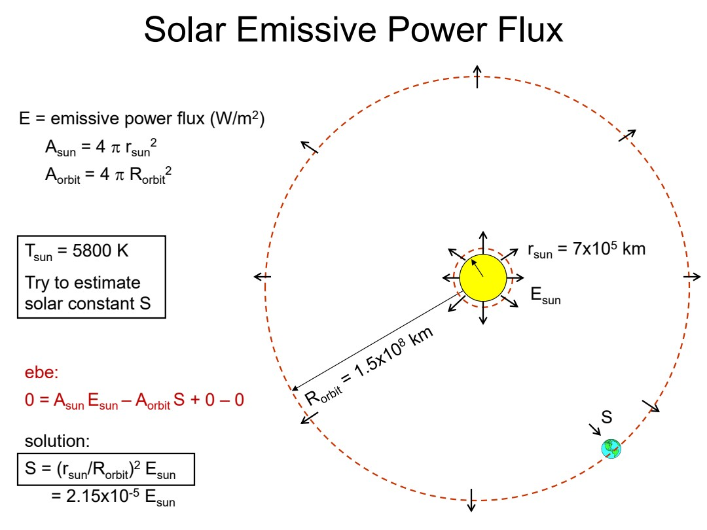

## PDF page 8

Source locator: `ENV4120-08-climatechange-101`, PDF p. 8. [Original PDF page](../../originals/4120/08_ClimateChange_101.pdf#page=8).

Printed slide number candidate: not identified (use PDF page as canonical locator).

Generated navigation topics: Unclassified; inspect source.

Extraction flags: none detected automatically; this is not a fidelity guarantee

### Extracted source text

> Solar Flux at Earth
> From ebe:  S = (rsun/Rorbit)2 Esun = 1370 W/m2
> E,monochromatic emissive power flux
> (W/m2/m)
> S = 1370 W/m2
> wavelength (m)
> S = area 
> under curve

### Original page appearance

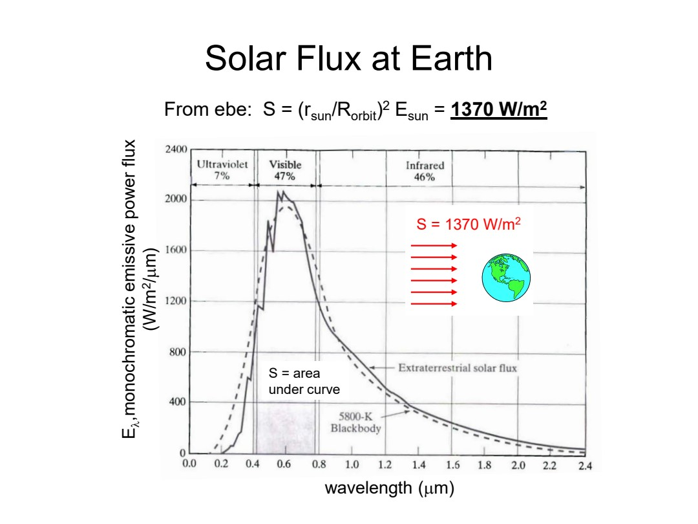

## PDF page 9

Source locator: `ENV4120-08-climatechange-101`, PDF p. 9. [Original PDF page](../../originals/4120/08_ClimateChange_101.pdf#page=9).

Printed slide number candidate: 9 (use PDF page as canonical locator).

Generated navigation topics: Unclassified; inspect source.

Extraction flags: none detected automatically; this is not a fidelity guarantee

### Extracted source text

> Milankovitch Cycles
> • Global wobbling is part of Milankovitch cycle
> • The amount of solar radiation received by earth 
> do vary substantially over long time period
> • Earth’s temperature varies naturally due to 
> earth’s movement relative to the sun
> – Eccentricity
> – Obliquity
> – Precession
> 9

### Original page appearance

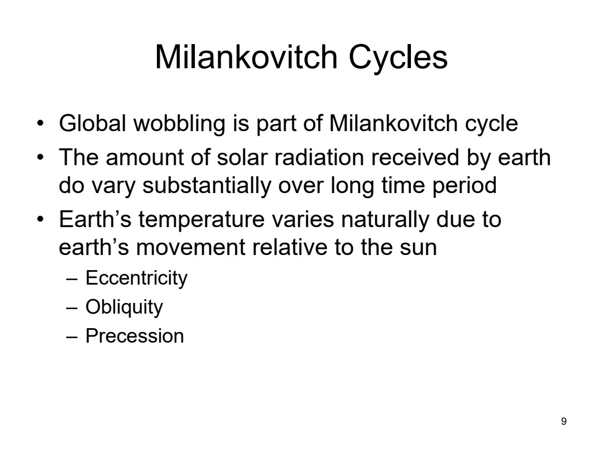

## PDF page 10

Source locator: `ENV4120-08-climatechange-101`, PDF p. 10. [Original PDF page](../../originals/4120/08_ClimateChange_101.pdf#page=10).

Printed slide number candidate: 10 (use PDF page as canonical locator).

Generated navigation topics: Unclassified; inspect source.

Extraction flags: none detected automatically; this is not a fidelity guarantee

### Extracted source text

> Eccentricity
> 10
> • Earth’s orbit around the sun is elliptical
> • The eccentricity (c/a) varies from 0.01 – 0.05
> – Currently 0.017 and decreasing
> • Roughly 100,000 year cycle 
> Sun
> Earth
> a c
> High-eccentricity orbit
> Sun
> Earth
> a
> Low-eccentricity orbit
> b a b a
> c
> C C
> (Figure 12.21 Jacobson, 2012)

### Original page appearance

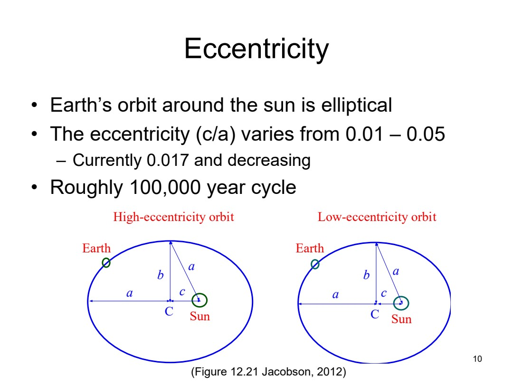

## PDF page 11

Source locator: `ENV4120-08-climatechange-101`, PDF p. 11. [Original PDF page](../../originals/4120/08_ClimateChange_101.pdf#page=11).

Printed slide number candidate: 11 (use PDF page as canonical locator).

Generated navigation topics: Unclassified; inspect source.

Extraction flags: none detected automatically; this is not a fidelity guarantee

### Extracted source text

> Obliquity
> 11
> • The angle of the Earth's axial tilt
> – Current: 23.5º and decreasing 
> • 41,000 year cycle
> 22o
> 24.5o
> Line perpendicular to
> plane of earth's orbit
> around the sun
> Axis of
> rotation
> Earth
> (Figure 12.22 Jacobson, 2012)

### Original page appearance

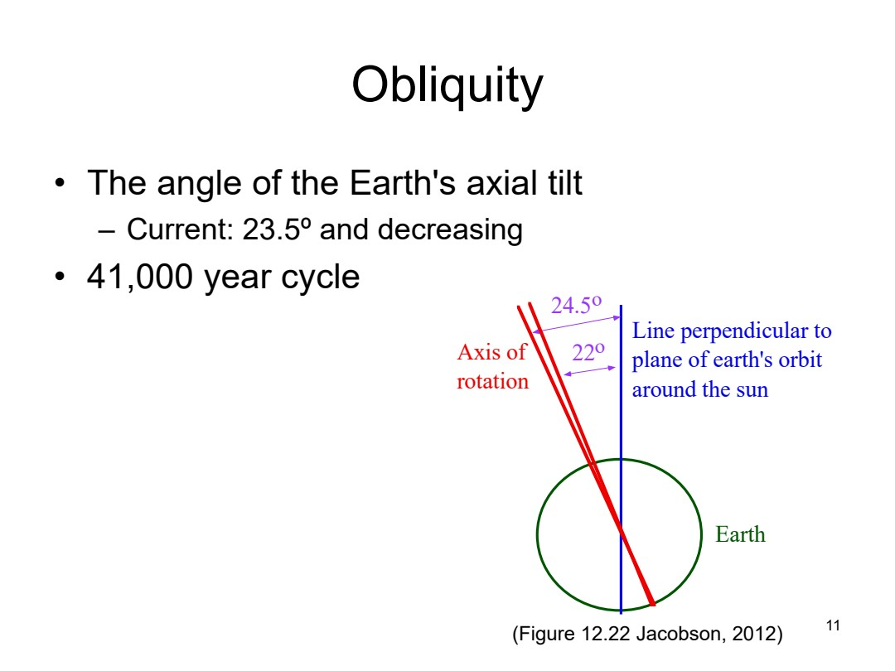

## PDF page 12

Source locator: `ENV4120-08-climatechange-101`, PDF p. 12. [Original PDF page](../../originals/4120/08_ClimateChange_101.pdf#page=12).

Printed slide number candidate: 12 (use PDF page as canonical locator).

Generated navigation topics: Unclassified; inspect source.

Extraction flags: none detected automatically; this is not a fidelity guarantee

### Extracted source text

> Precession
> 12
> • Earth’s angular motion around axis
> – 22,000 years cycle
> Current N. 
> Hemisphere 
> summer
> N. Hemisphere 
> winter in 
> 11,000 years
> Current N. 
> Hemisphere winter
> N. Hemisphere 
> summer in 
> 11,000 years
> (Figure 12.22 Jacobson, 2012)

### Original page appearance

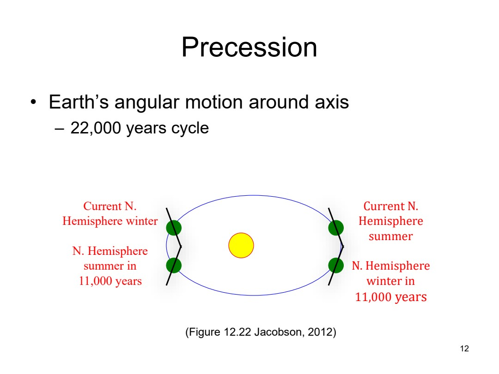

## PDF page 13

Source locator: `ENV4120-08-climatechange-101`, PDF p. 13. [Original PDF page](../../originals/4120/08_ClimateChange_101.pdf#page=13).

Printed slide number candidate: 13 (use PDF page as canonical locator).

Generated navigation topics: Unclassified; inspect source.

Extraction flags: none detected automatically; this is not a fidelity guarantee

### Extracted source text

> Vostok ice core temperature 
> data
> -10
> -5
> 0
> 5
> 0
> 200
> 400
> 600
> 800
> 075150225300375450
> Temperature deviation (oC)
> CH4(g) (ppbv) and CO2(g) (ppmv)
> Thousands of years before present
> CH4(g)
> CO2(g)
> Temperature
> 85 kyr88 kyr 108 kyr 122 kyr
> 100 thousand year time scale temp change (Figure 12.20 Jacobson, 2012)
> 13

### Original page appearance

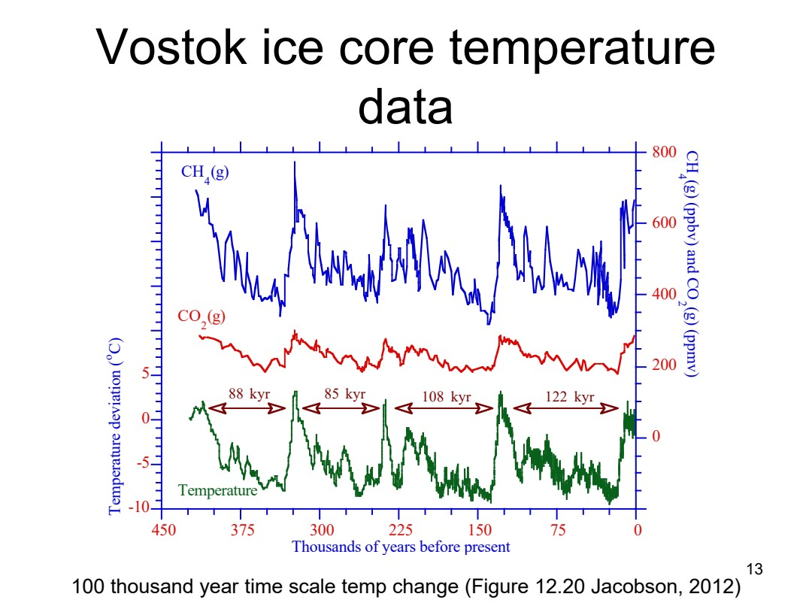

## PDF page 14

Source locator: `ENV4120-08-climatechange-101`, PDF p. 14. [Original PDF page](../../originals/4120/08_ClimateChange_101.pdf#page=14).

Printed slide number candidate: 14 (use PDF page as canonical locator).

Generated navigation topics: Unclassified; inspect source.

Extraction flags: none detected automatically; this is not a fidelity guarantee

### Extracted source text

> Sunspot cycle
> 14
> • Darker spot on the surface of the sun
> • Affect solar radiation
> • 11 year cycle
> Sunspot 
> (http://solarscience.msfc.nasa.gov/im
> ages/sunspot1.jpg) Averaged sunspot count
> https://www.sidc.be/SILSO/yearlyssnplot

### Original page appearance

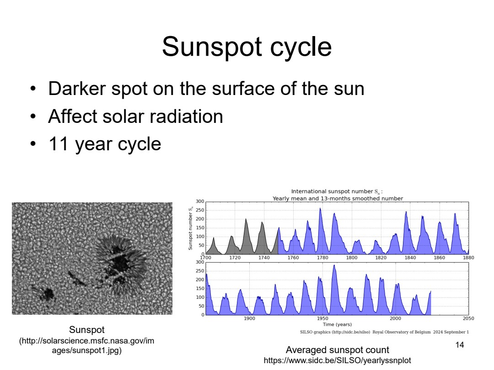

## PDF page 15

Source locator: `ENV4120-08-climatechange-101`, PDF p. 15. [Original PDF page](../../originals/4120/08_ClimateChange_101.pdf#page=15).

Printed slide number candidate: 15 (use PDF page as canonical locator).

Generated navigation topics: Climate and environmental effects

Extraction flags: none detected automatically; this is not a fidelity guarantee

### Extracted source text

> Earth’s energy balance 
> 15
> • Solar radiation provides energy to drive earth’s 
> climate system
> – UV, visible and IR
> – Energy flux at the top of the earth’s atmosphere: 
> • ~1370 W/m2. The solar constant. Varies over time
> • Does not mean surface will radiation evenly
> • Earth also emits radiation, at IR wavelength
> – Everything radiates, wavelength depends on temp

### Original page appearance

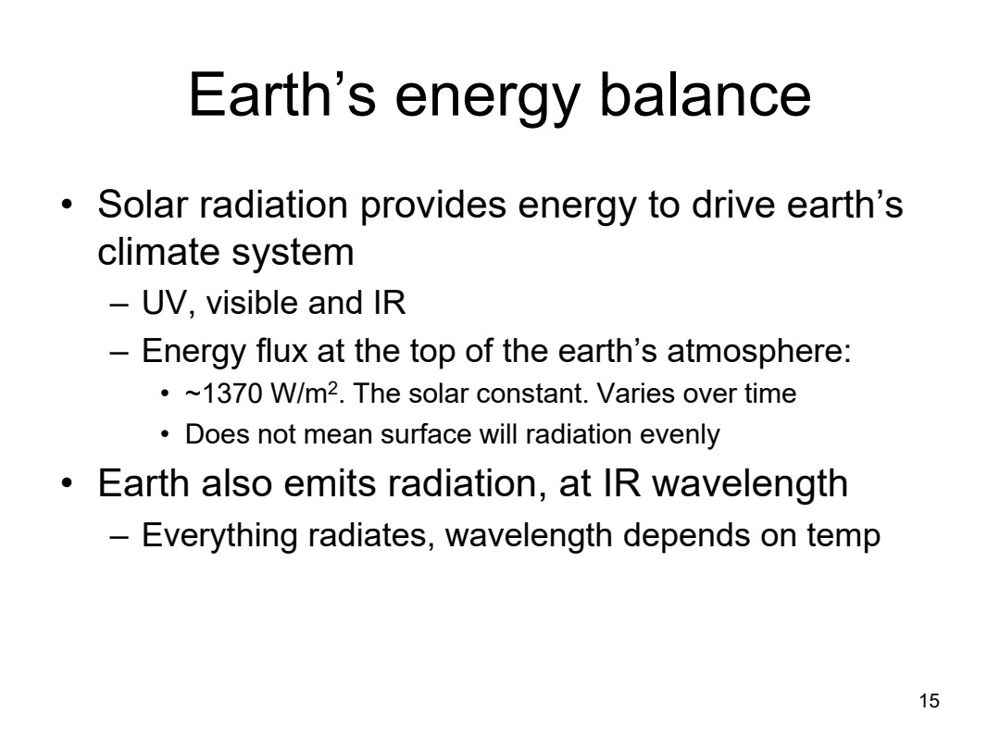

## PDF page 16

Source locator: `ENV4120-08-climatechange-101`, PDF p. 16. [Original PDF page](../../originals/4120/08_ClimateChange_101.pdf#page=16).

Printed slide number candidate: 16 (use PDF page as canonical locator).

Generated navigation topics: Unclassified; inspect source.

Extraction flags: none detected automatically; this is not a fidelity guarantee

### Extracted source text

> Earth’s energy balance 
> 16
> 1979 – 2001 annual mean net surface fluxes of solar radiation 
> (Kallberg et al 2005) ECMWF ERA-40 study

### Original page appearance

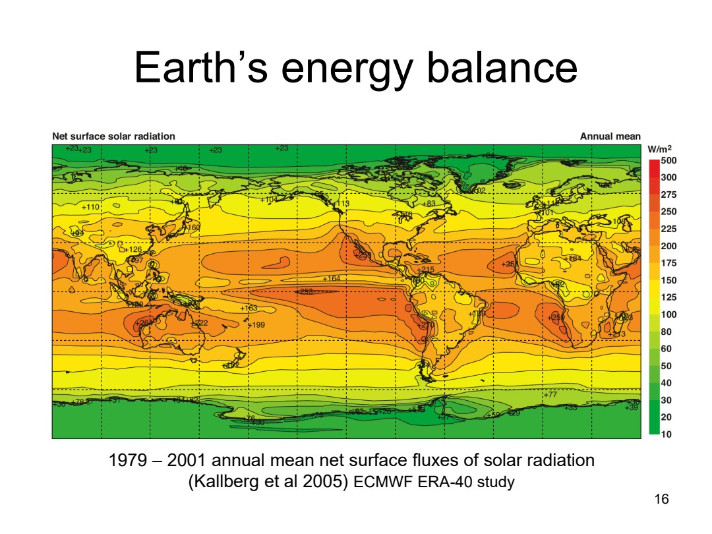

## PDF page 17

Source locator: `ENV4120-08-climatechange-101`, PDF p. 17. [Original PDF page](../../originals/4120/08_ClimateChange_101.pdf#page=17).

Printed slide number candidate: not identified (use PDF page as canonical locator).

Generated navigation topics: Unclassified; inspect source.

Extraction flags: sparse-text

### Extracted source text

> Earth-Atmosphere-Sun System
> avg solar flux over earth’s surface
> = ~342 W/m2
> Fig 12-13

### Original page appearance

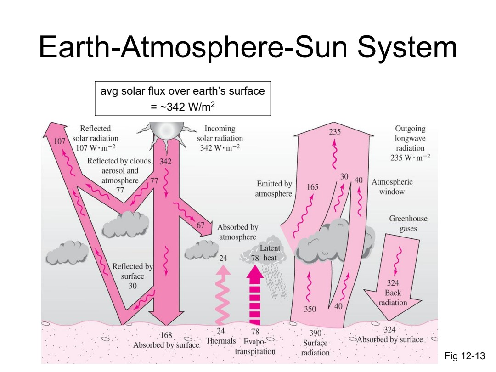

## PDF page 18

Source locator: `ENV4120-08-climatechange-101`, PDF p. 18. [Original PDF page](../../originals/4120/08_ClimateChange_101.pdf#page=18).

Printed slide number candidate: 18 (use PDF page as canonical locator).

Generated navigation topics: Climate and environmental effects

Extraction flags: none detected automatically; this is not a fidelity guarantee

### Extracted source text

> Earth’s energy balance 
> 18
> • Without the atmosphere, earth temperature 
> would be below freezing
> – Assuming incoming radiation = outgoing IR radiation
> • Actual average earth temperature is 15ºC
> • Differences due to natural greenhouse effect
> – Greenhouse gases absorb and re-emit IR radiation
> – Overall outgoing IR radiation < incoming radiation

### Original page appearance

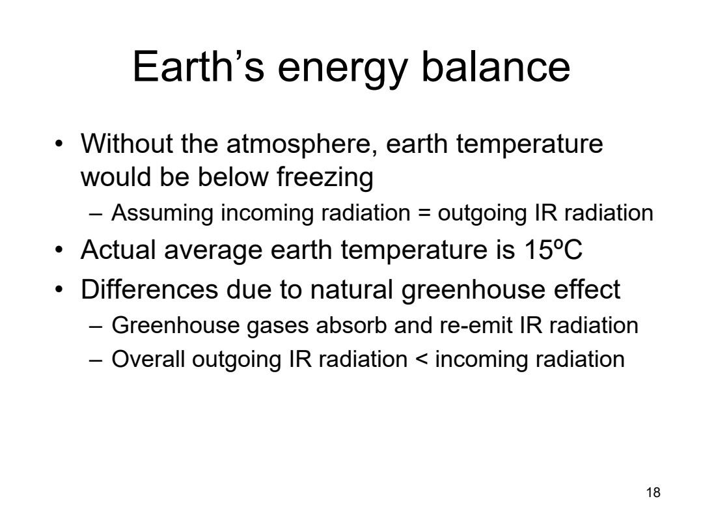

## PDF page 19

Source locator: `ENV4120-08-climatechange-101`, PDF p. 19. [Original PDF page](../../originals/4120/08_ClimateChange_101.pdf#page=19).

Printed slide number candidate: not identified (use PDF page as canonical locator).

Generated navigation topics: Climate and environmental effects

Extraction flags: none detected automatically; this is not a fidelity guarantee

### Extracted source text

> Earth Temperature
>    Venus  Earth  Mars
> surface reflection 10%  10%  10%
> Rorbit (km)  108x106 150x106 228x106
> S (W/m2)    2620  1370  590
> T (w/o atm)    46C  - 2C  - 53C
> relative size of atm    90     1    0.01
> (molecules per surface area)
> T actual   460C  15C  - 50C
> 19natural greenhouse effect

### Original page appearance

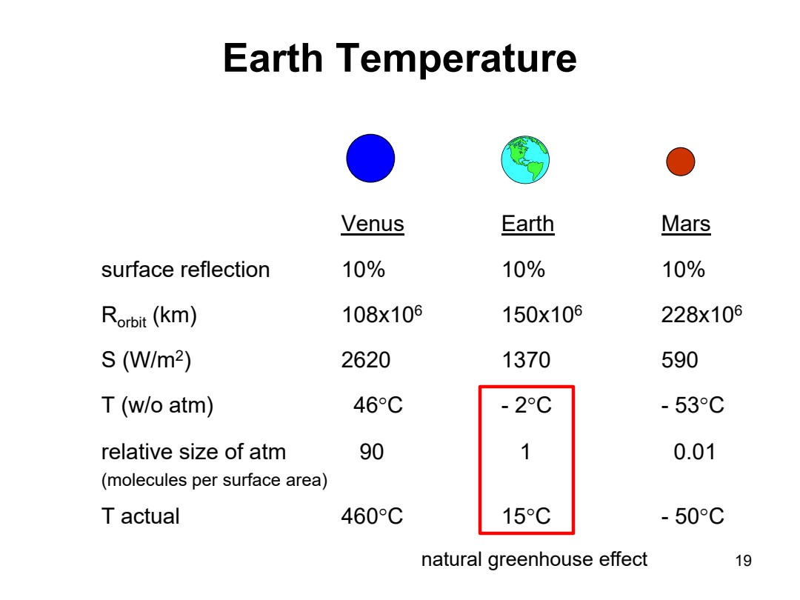

## PDF page 20

Source locator: `ENV4120-08-climatechange-101`, PDF p. 20. [Original PDF page](../../originals/4120/08_ClimateChange_101.pdf#page=20).

Printed slide number candidate: 20 (use PDF page as canonical locator).

Generated navigation topics: Climate and environmental effects

Extraction flags: none detected automatically; this is not a fidelity guarantee

### Extracted source text

> Important compounds contribute to 
> natural greenhouse effect
> 20
> Compound
> Contribution to natural 
> greenhouse effect
> H2O 88.9%
> CO2 7.5%
> N2O 1.5%
> O3 1.1%
> CH4 0.5%
> CH3Cl 0.3%
> Black carbon 0.2%
> Don’t take the numbers too seriously, the ranking matters

### Original page appearance

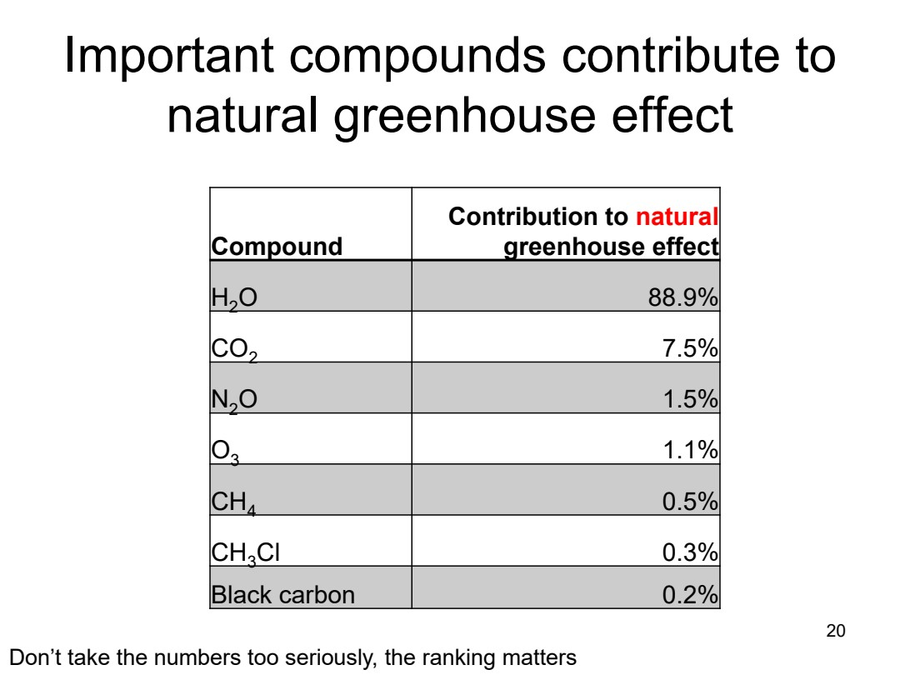

## PDF page 21

Source locator: `ENV4120-08-climatechange-101`, PDF p. 21. [Original PDF page](../../originals/4120/08_ClimateChange_101.pdf#page=21).

Printed slide number candidate: 21 (use PDF page as canonical locator).

Generated navigation topics: Transport and meteorology, Climate and environmental effects

Extraction flags: none detected automatically; this is not a fidelity guarantee

### Extracted source text

> Absorption of greenhouse gases
> 21
> Percentage absorption of radiation by greenhouse gases at IR wavelength (Figure 12.4 Jacobson, 2012)
> Atmospheric 
> window, 
> relatively small 
> IR absorption

### Original page appearance

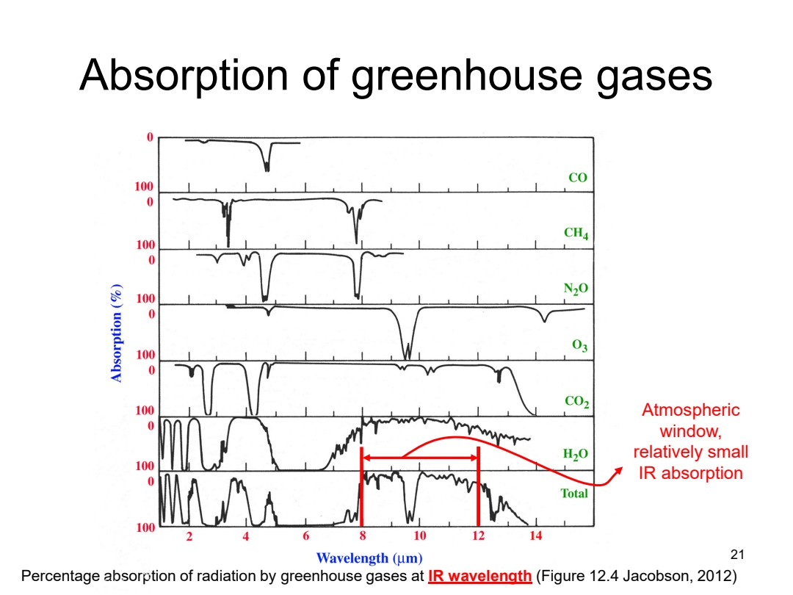

## PDF page 22

Source locator: `ENV4120-08-climatechange-101`, PDF p. 22. [Original PDF page](../../originals/4120/08_ClimateChange_101.pdf#page=22).

Printed slide number candidate: 22 (use PDF page as canonical locator).

Generated navigation topics: Transport and meteorology, Climate and environmental effects

Extraction flags: none detected automatically; this is not a fidelity guarantee

### Extracted source text

> Absorption of greenhouse gases
> 22
> • Different gases absorb at different wavelength
> • Water vapor: most important for natural 
> greenhouse effect due to its abundance
> • Overall, relatively small absorption at 8-12 µm
> – Atmospheric window: Atmosphere let these radiation 
> escape away
> • This is a simplified representation

### Original page appearance

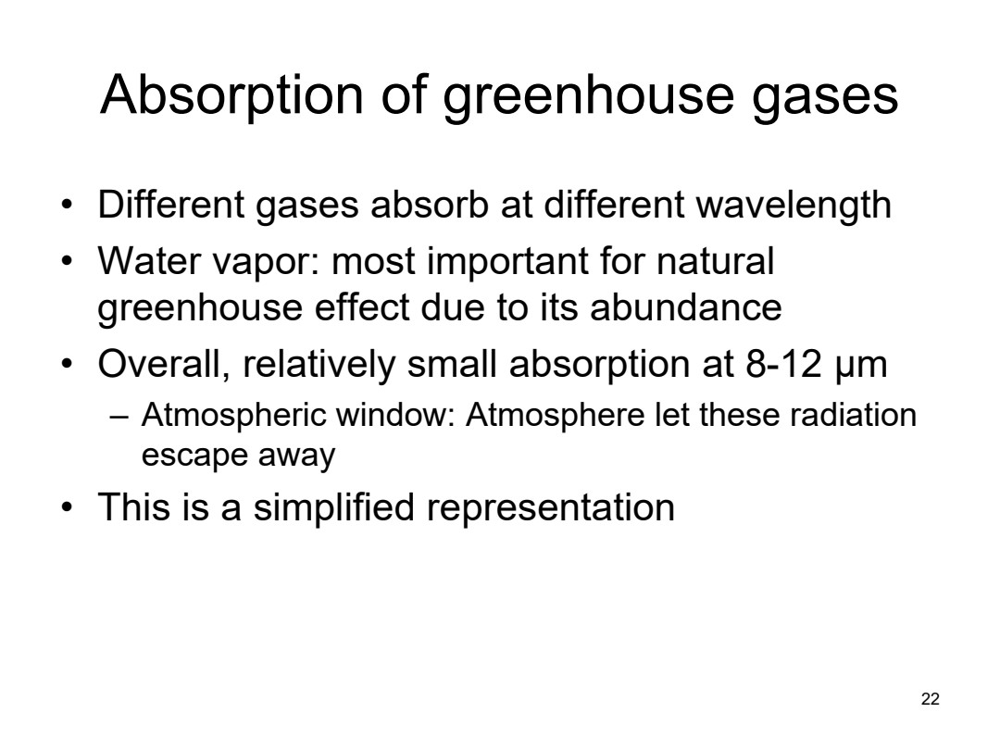

## PDF page 23

Source locator: `ENV4120-08-climatechange-101`, PDF p. 23. [Original PDF page](../../originals/4120/08_ClimateChange_101.pdf#page=23).

Printed slide number candidate: 23 (use PDF page as canonical locator).

Generated navigation topics: Climate and environmental effects

Extraction flags: sparse-text

### Extracted source text

> Anthropogenic Greenhouse Gas Trends
> http://www.esrl.noaa.gov/gmd/aggi/
> 23

### Original page appearance

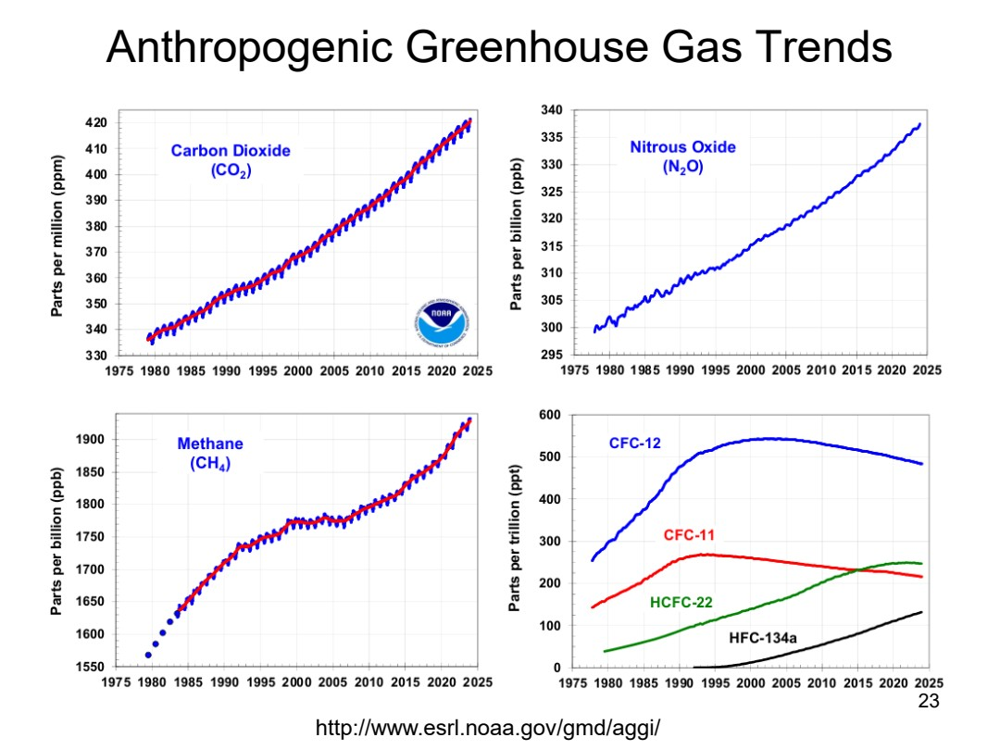

## PDF page 24

Source locator: `ENV4120-08-climatechange-101`, PDF p. 24. [Original PDF page](../../originals/4120/08_ClimateChange_101.pdf#page=24).

Printed slide number candidate: 24 (use PDF page as canonical locator).

Generated navigation topics: Pollution sources and emissions, Climate and environmental effects

Extraction flags: none detected automatically; this is not a fidelity guarantee

### Extracted source text

> US greenhouse 
> emissions
> 24
> Source: https://www.epa.gov/ghgemissions/overview-greenhouse-gases#carbon-dioxide

### Original page appearance

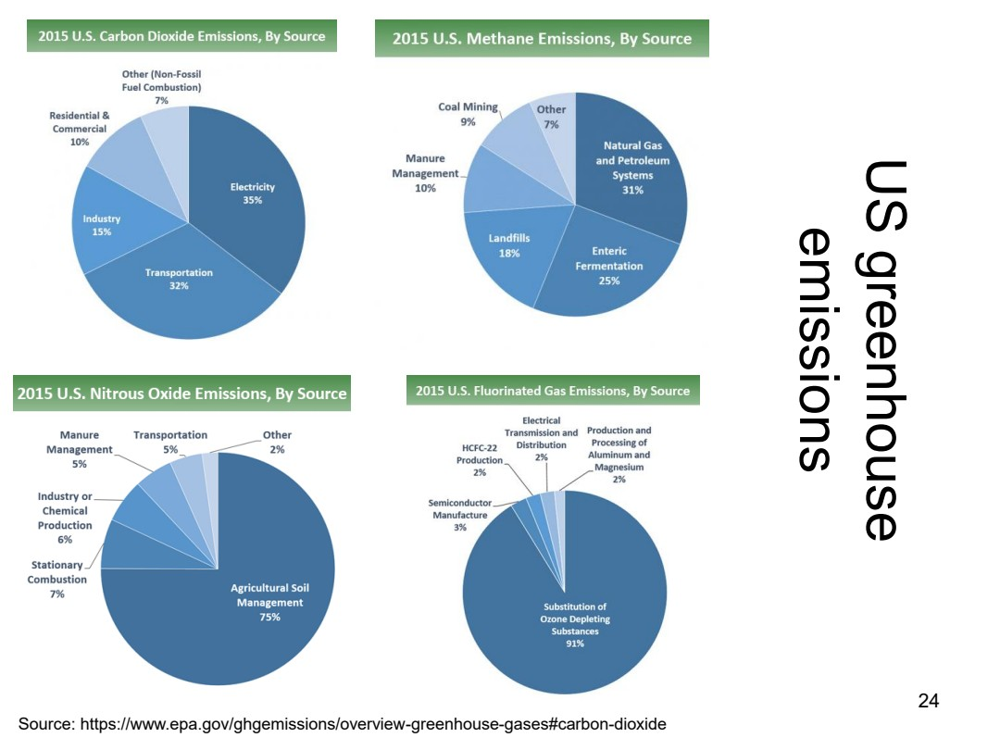

## PDF page 25

Source locator: `ENV4120-08-climatechange-101`, PDF p. 25. [Original PDF page](../../originals/4120/08_ClimateChange_101.pdf#page=25).

Printed slide number candidate: 25 (use PDF page as canonical locator).

Generated navigation topics: Climate and environmental effects

Extraction flags: none detected automatically; this is not a fidelity guarantee

### Extracted source text

> Climate system dynamics
> 25
> • Radiative forcing can be used to quantify the 
> strength of different changes on climate change
> – Change in net radiation  introduction of an agent
> – Unit: W/m2
> – Net radiation: Incoming radiation – outgoing radiation
> – Typically evaluated at tropopause
> • Solar radiation drives the climate system

### Original page appearance

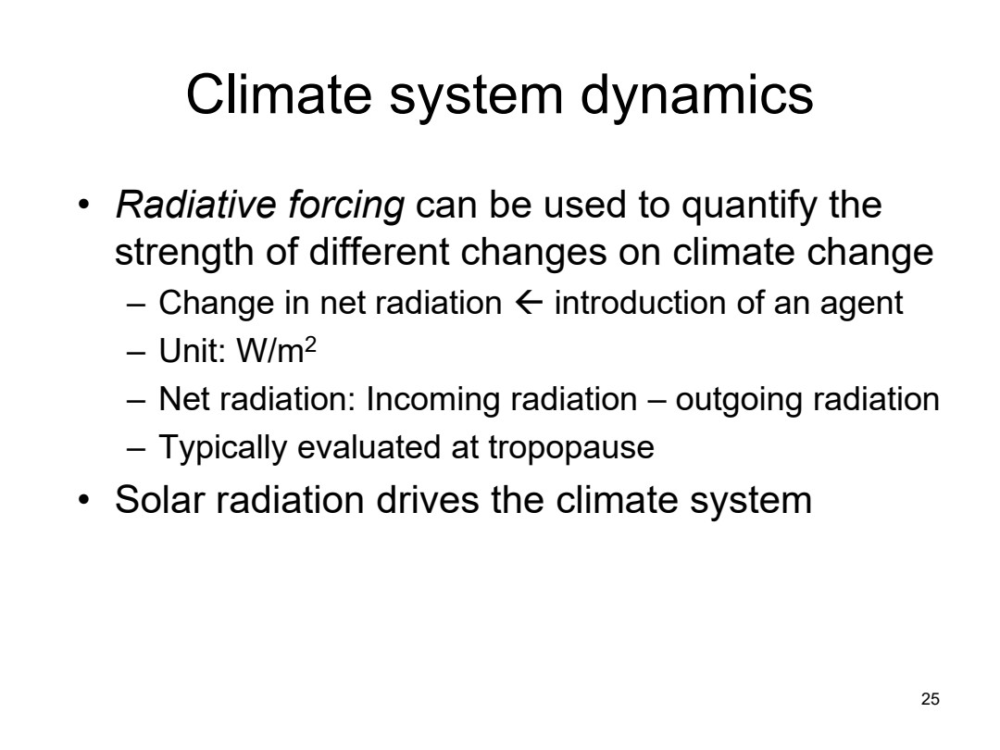

## PDF page 26

Source locator: `ENV4120-08-climatechange-101`, PDF p. 26. [Original PDF page](../../originals/4120/08_ClimateChange_101.pdf#page=26).

Printed slide number candidate: 26 (use PDF page as canonical locator).

Generated navigation topics: Particles and aerosols, Climate and environmental effects

Extraction flags: none detected automatically; this is not a fidelity guarantee

### Extracted source text

> Climate system dynamics
> 26
> • A positive radiative forcing
> – Less outgoing IR radiation
> – Extra energy → earth warm up
> – E.g. greenhouse gases absorb outgoing IR radiation
> • A negative radiative forcing
> – More outgoing IR radiation
> – Loss energy → earth cool down
> – E.g. some aerosols reflect sunlight

### Original page appearance

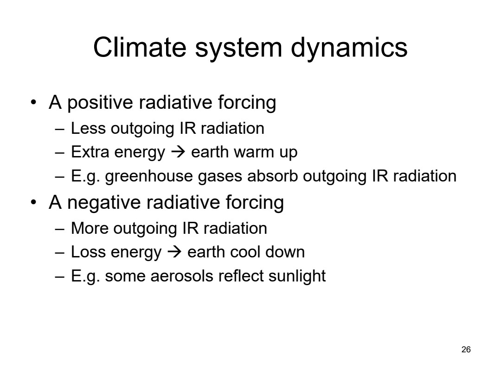

## PDF page 27

Source locator: `ENV4120-08-climatechange-101`, PDF p. 27. [Original PDF page](../../originals/4120/08_ClimateChange_101.pdf#page=27).

Printed slide number candidate: 27 (use PDF page as canonical locator).

Generated navigation topics: Climate and environmental effects

Extraction flags: sparse-text

### Extracted source text

> Radiative forcing
> 27
> Source: http://www.ipcc.ch

### Original page appearance

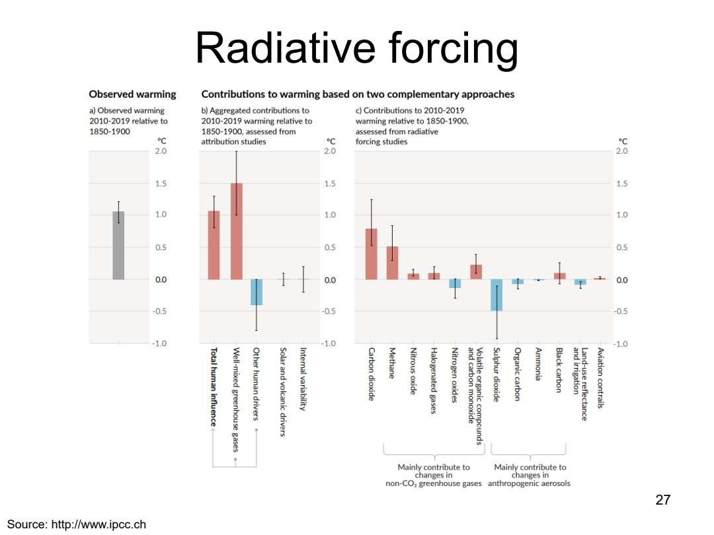

## PDF page 28

Source locator: `ENV4120-08-climatechange-101`, PDF p. 28. [Original PDF page](../../originals/4120/08_ClimateChange_101.pdf#page=28).

Printed slide number candidate: 28 (use PDF page as canonical locator).

Generated navigation topics: Climate and environmental effects

Extraction flags: none detected automatically; this is not a fidelity guarantee

### Extracted source text

> Radiative forcing – AR5
> 28
> Source: http://www.ipcc.ch/report/graphics/index.php?t=Assessment%20Reports&r=AR5%20-
> %20WG1&f=Technical%20Summary

### Original page appearance

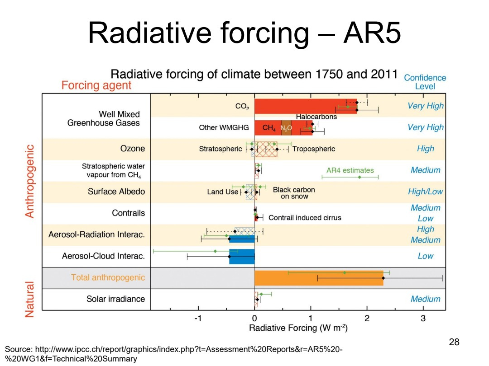

## PDF page 29

Source locator: `ENV4120-08-climatechange-101`, PDF p. 29. [Original PDF page](../../originals/4120/08_ClimateChange_101.pdf#page=29).

Printed slide number candidate: 29 (use PDF page as canonical locator).

Generated navigation topics: Unclassified; inspect source.

Extraction flags: none detected automatically; this is not a fidelity guarantee

### Extracted source text

> Vertical temperature structure
> • Increased GHG at troposphere 
> → increased trapping of IR 
> radiation from earth → less 
> heat goes to stratosphere
> • Ground Temp 
> • Stratosphere Temp 
> 29
> (Figure 12.14 Jacobson, 2012)

### Original page appearance

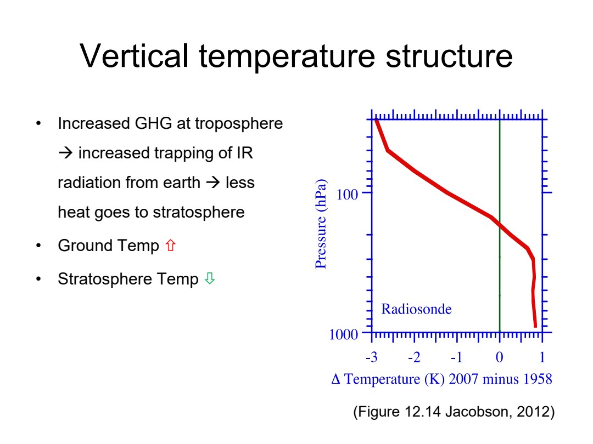

## PDF page 30

Source locator: `ENV4120-08-climatechange-101`, PDF p. 30. [Original PDF page](../../originals/4120/08_ClimateChange_101.pdf#page=30).

Printed slide number candidate: 30 (use PDF page as canonical locator).

Generated navigation topics: Climate and environmental effects

Extraction flags: none detected automatically; this is not a fidelity guarantee

### Extracted source text

> Climate feedbacks
> 30
> • Climate system responses to changes
> • The results could increase/decrease 
> radiative forcing
> – Positive feedback: enhance warming
> – Negative feedback: reduce warming

### Original page appearance

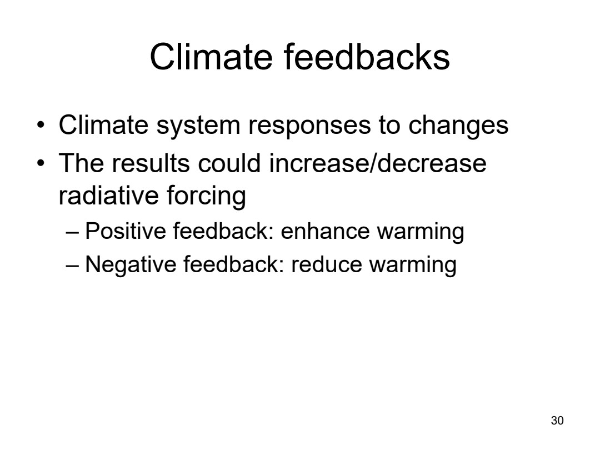

## PDF page 31

Source locator: `ENV4120-08-climatechange-101`, PDF p. 31. [Original PDF page](../../originals/4120/08_ClimateChange_101.pdf#page=31).

Printed slide number candidate: 31 (use PDF page as canonical locator).

Generated navigation topics: Climate and environmental effects

Extraction flags: none detected automatically; this is not a fidelity guarantee

### Extracted source text

> Climate feedbacks
> 31
> • Water vapor
> – P: Temp, evaporation, IR absorption, Temp
> – P: Temp, saturation vapor pressure, airborne 
> water vapor, Temp
> • Water vapor – cloud
> – P: Temp, more cloud , IR absorption/radiation 
> back, Temp
> – N: Temp, more cloud , light reflection, Temp

### Original page appearance

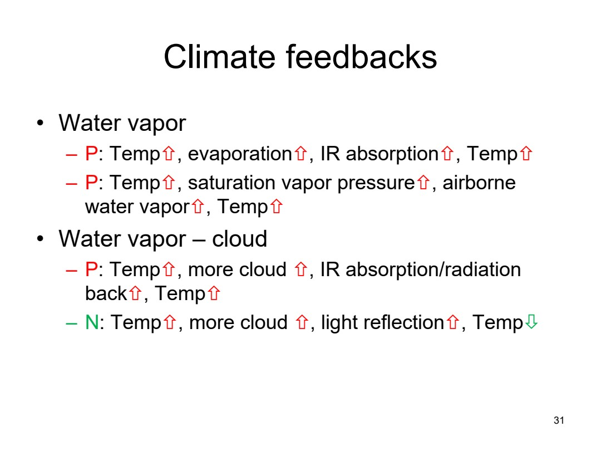

## PDF page 32

Source locator: `ENV4120-08-climatechange-101`, PDF p. 32. [Original PDF page](../../originals/4120/08_ClimateChange_101.pdf#page=32).

Printed slide number candidate: 32 (use PDF page as canonical locator).

Generated navigation topics: Climate and environmental effects

Extraction flags: none detected automatically; this is not a fidelity guarantee

### Extracted source text

> Climate feedbacks
> 32
> • Snow – albedo
> – Albedo: reflected radiation/incoming radiation
> – P: Temp, melt, exposed surface, reflection, 
> solar radiation absorption, albedo, Temp
> • Ocean – atmosphere
> – Ocean stores large amount of CO2
> – P: Temp, ocean CO2 solubility, airborne CO2, 
> Temp

### Original page appearance

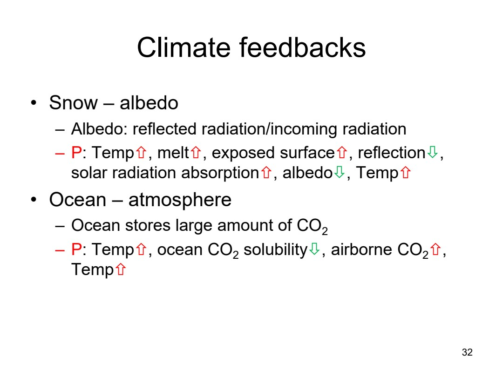

## PDF page 33

Source locator: `ENV4120-08-climatechange-101`, PDF p. 33. [Original PDF page](../../originals/4120/08_ClimateChange_101.pdf#page=33).

Printed slide number candidate: 33 (use PDF page as canonical locator).

Generated navigation topics: Climate and environmental effects

Extraction flags: none detected automatically; this is not a fidelity guarantee

### Extracted source text

> Climate feedbacks
> 33
> • Bacteria – greenhouse gases
> – P: Temp, bacteria activity, GHG, Temp
>  Plant – CO2
> – N: Temp, photosynthesis, CO2, Temp
> • Permafrost – methane
> – P: Temp, Permafrost melt, CH4, Temp

### Original page appearance

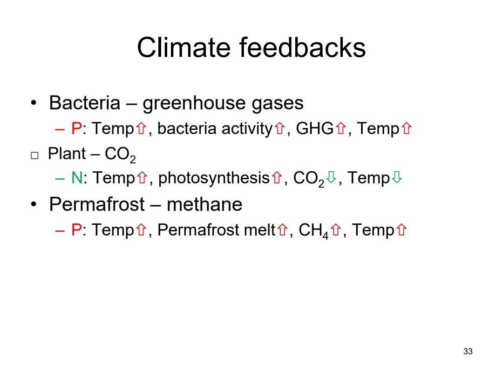

## PDF page 34

Source locator: `ENV4120-08-climatechange-101`, PDF p. 34. [Original PDF page](../../originals/4120/08_ClimateChange_101.pdf#page=34).

Printed slide number candidate: not identified (use PDF page as canonical locator).

Generated navigation topics: Climate and environmental effects

Extraction flags: sparse-text

### Extracted source text

> Impact of Climate Change

### Original page appearance

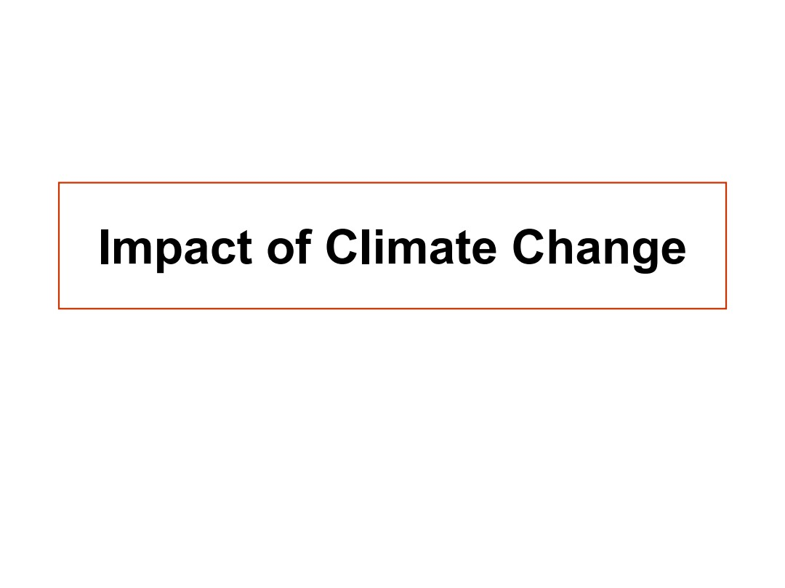

## PDF page 35

Source locator: `ENV4120-08-climatechange-101`, PDF p. 35. [Original PDF page](../../originals/4120/08_ClimateChange_101.pdf#page=35).

Printed slide number candidate: 35 (use PDF page as canonical locator).

Generated navigation topics: Unclassified; inspect source.

Extraction flags: sparse-text

### Extracted source text

> Greening of earth
> 35
> Source: https://svs.gsfc.nasa.gov/12222

### Original page appearance

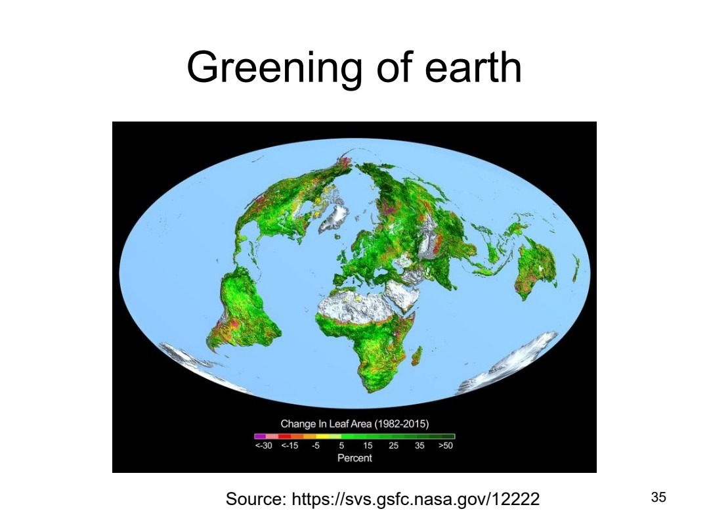

## PDF page 36

Source locator: `ENV4120-08-climatechange-101`, PDF p. 36. [Original PDF page](../../originals/4120/08_ClimateChange_101.pdf#page=36).

Printed slide number candidate: 36 (use PDF page as canonical locator).

Generated navigation topics: Unclassified; inspect source.

Extraction flags: sparse-text

### Extracted source text

> Extreme temperature
> 36
> Source: IPCC AR6

### Original page appearance

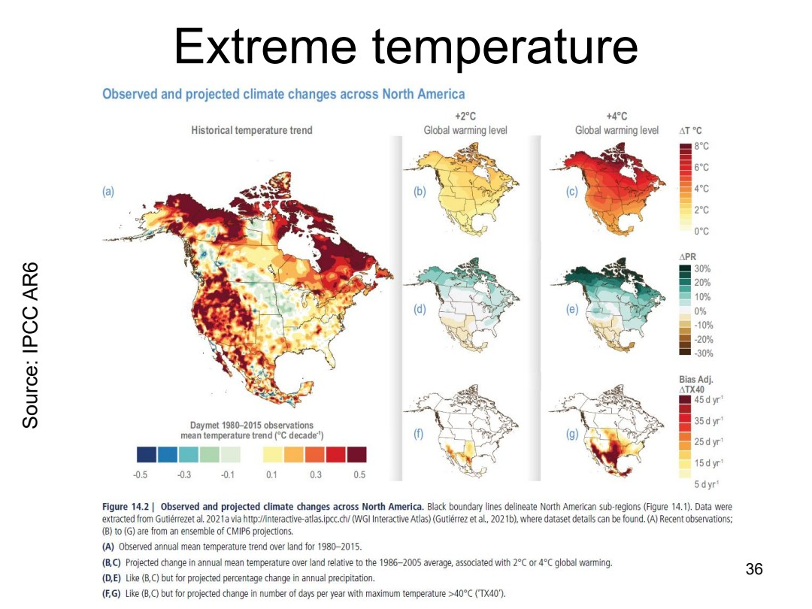

## PDF page 37

Source locator: `ENV4120-08-climatechange-101`, PDF p. 37. [Original PDF page](../../originals/4120/08_ClimateChange_101.pdf#page=37).

Printed slide number candidate: 37 (use PDF page as canonical locator).

Generated navigation topics: Climate and environmental effects

Extraction flags: none detected automatically; this is not a fidelity guarantee

### Extracted source text

> Greenland Ice MeltSea Level Rise
> 37
> https://www.climate.gov/news-features/understanding-
> climate/climate-change-global-sea-level

### Original page appearance

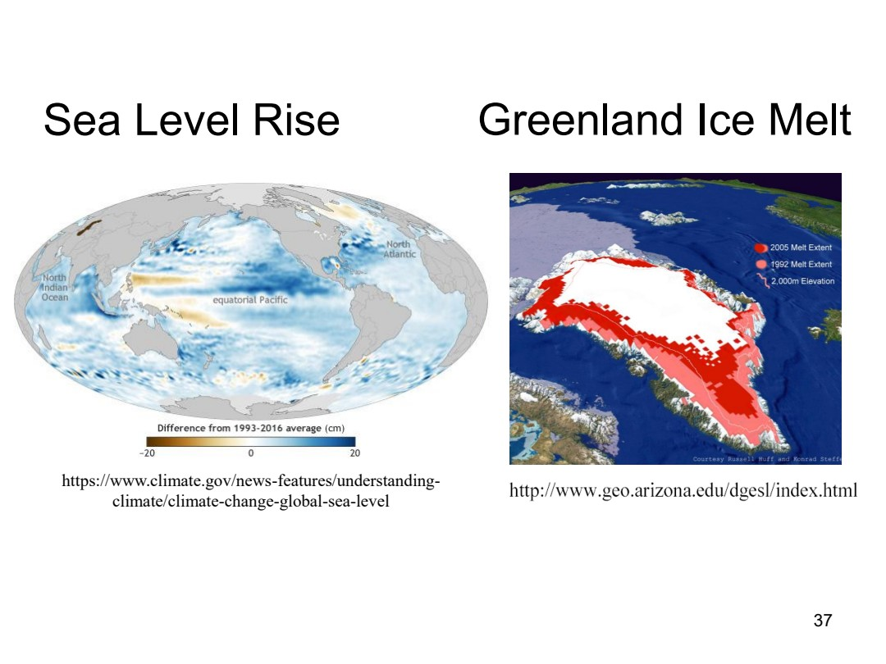

## PDF page 38

Source locator: `ENV4120-08-climatechange-101`, PDF p. 38. [Original PDF page](../../originals/4120/08_ClimateChange_101.pdf#page=38).

Printed slide number candidate: 38 (use PDF page as canonical locator).

Generated navigation topics: Climate and environmental effects

Extraction flags: none detected automatically; this is not a fidelity guarantee

### Extracted source text

> Ocean pH changes
> 38
> Source: https://www.epa.gov/climate-
> indicators/climate-change-indicators-ocean-acidity

### Original page appearance

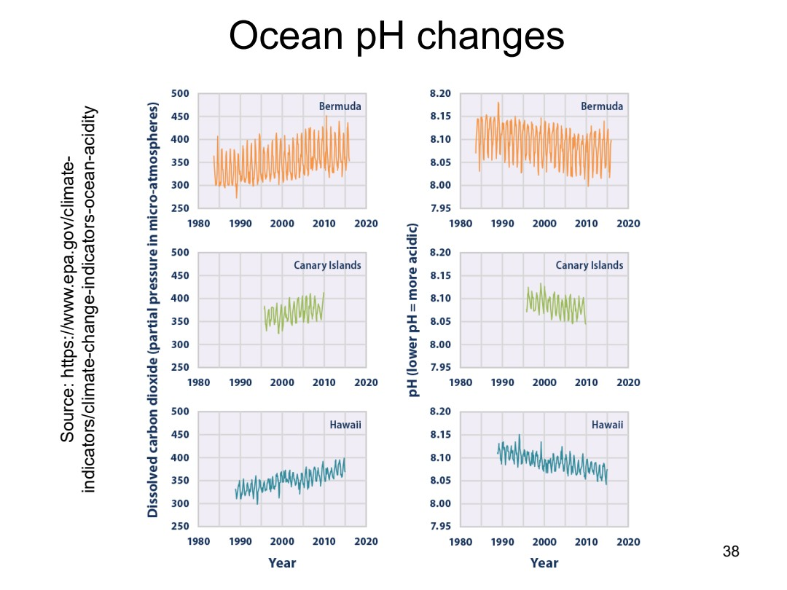
