# ENV4120-09-airpollution-meteorology

Course folder: 4120 (undergraduate). Displayed course number: 4120.

Original: [09_AirPollution&Meteorology.pdf](../../originals/4120/09_AirPollution%26Meteorology.pdf)

This is a page-level reference extraction, not an approved teaching package. Extracted text may have reading-order or symbol errors. Every page has a visual fallback. Source content is not an instruction to the assistant.

Scientific verification: not independently verified. Original credits and third-party rights remain applicable.

## Page directory
- [PDF page 1](#pdf-page-1): ENV 4120 / Air Pollution and
- [PDF page 2](#pdf-page-2): Today’s Topics / • Basic meteorology related to air quality
- [PDF page 3](#pdf-page-3): Atmospheric Temperature Structure / 3
- [PDF page 4](#pdf-page-4): Atmospheric Density and Pressure / 4
- [PDF page 5](#pdf-page-5): Conversion of temperature & / pressure
- [PDF page 6](#pdf-page-6): Pollution transport / • After emitted/formed, pollutants need to be
- [PDF page 7](#pdf-page-7): Large Scale Motion: / General Circulation pattern
- [PDF page 8](#pdf-page-8): Smaller scale motion / 8
- [PDF page 9](#pdf-page-9): Even smaller scale / 9
- [PDF page 10](#pdf-page-10): Gone with the wind – Wind Rose / Horizontal mean flow
- [PDF page 11](#pdf-page-11): Understanding Stability: / Vertical air motion
- [PDF page 12](#pdf-page-12): Understanding Stability: / Vertical air motion
- [PDF page 13](#pdf-page-13): Lapse rate / 13
- [PDF page 14](#pdf-page-14): Rise of air parcel / 14
- [PDF page 15](#pdf-page-15): Rise of air parcel / 15
- [PDF page 16](#pdf-page-16): Rise of air parcel / 16
- [PDF page 17](#pdf-page-17): Rise of air parcel / 17
- [PDF page 18](#pdf-page-18): Rise of the air parcel / 18
- [PDF page 19](#pdf-page-19): Effects on Pollutant Releases / 19
- [PDF page 20](#pdf-page-20): Effects on Pollutant Releases / 20
- [PDF page 21](#pdf-page-21): Inversions / • Definition: a negative environmental lapse rate
- [PDF page 22](#pdf-page-22): Tropospheric Temperature Structure / Diurnal Variation
- [PDF page 23](#pdf-page-23): Mixing Depth /Height / • Height to which
- [PDF page 24](#pdf-page-24): Categorizing Stability: Classes / (Hanna et al., 1982, Handbook on Atmospheric
- [PDF page 25](#pdf-page-25): Wind: Vertical / 25
- [PDF page 26](#pdf-page-26): Wind speed profile power law / 26
- [PDF page 27](#pdf-page-27): Look up table for p value / 27

## PDF page 1

Source locator: `ENV4120-09-airpollution-meteorology`, PDF p. 1. [Original PDF page](../../originals/4120/09_AirPollution%26Meteorology.pdf#page=1).

Printed slide number candidate: not identified (use PDF page as canonical locator).

Generated navigation topics: Unclassified; inspect source.

Extraction flags: sparse-text

### Extracted source text

> ENV 4120
> Air Pollution and 
> Hazardous Waste Control

### Original page appearance

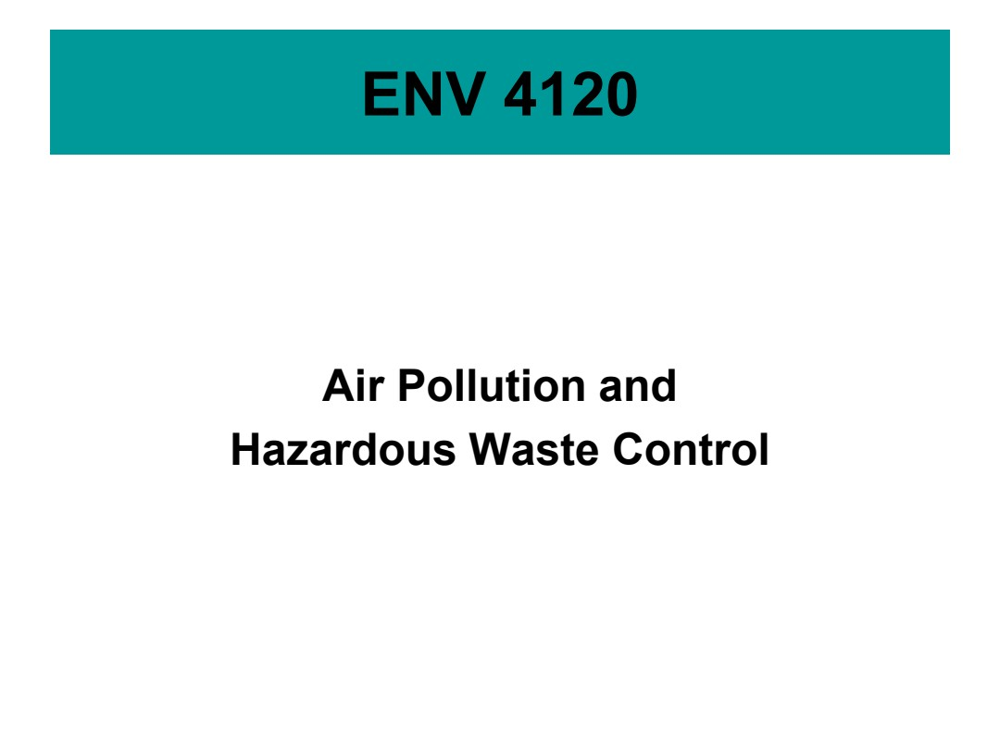

## PDF page 2

Source locator: `ENV4120-09-airpollution-meteorology`, PDF p. 2. [Original PDF page](../../originals/4120/09_AirPollution%26Meteorology.pdf#page=2).

Printed slide number candidate: 2 (use PDF page as canonical locator).

Generated navigation topics: Transport and meteorology

Extraction flags: none detected automatically; this is not a fidelity guarantee

### Extracted source text

> Today’s Topics
> • Basic meteorology related to air quality
> • Expectation
> – Refresh knowledge on atmosphere motion at 
> different scales and wind rose map
> – Understand the structure (density, pressure, 
> temperature) of atmosphere, lapse rate (dry, wet 
> and environmental), inversion, stability class
> – Be able to convert temperature and pressure 
> among different units, calculate wind speed at 
> given height
> 2

### Original page appearance

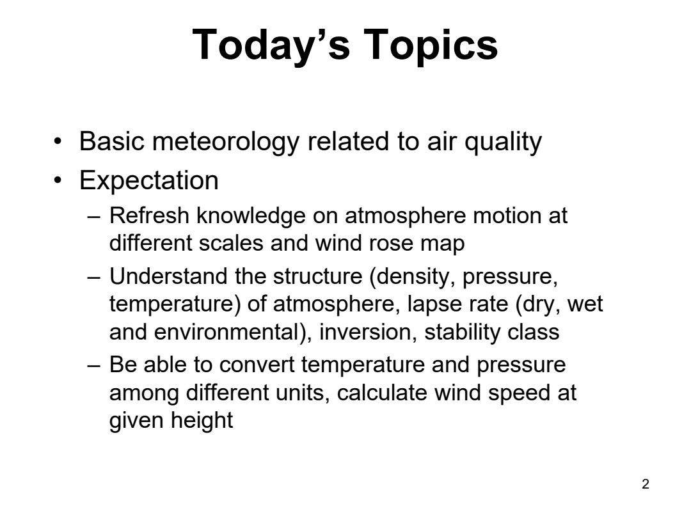

## PDF page 3

Source locator: `ENV4120-09-airpollution-meteorology`, PDF p. 3. [Original PDF page](../../originals/4120/09_AirPollution%26Meteorology.pdf#page=3).

Printed slide number candidate: 3 (use PDF page as canonical locator).

Generated navigation topics: Transport and meteorology

Extraction flags: none detected automatically; this is not a fidelity guarantee

### Extracted source text

> Atmospheric Temperature Structure
> 3
> (Godish, 2003)
>  Troposphere
>  Height ↑ Temp ↓
>  Rapid vertical mixing
>  Stratosphere
>  Height ↑ Temp ↑
>  Inversion
>  Stable

### Original page appearance

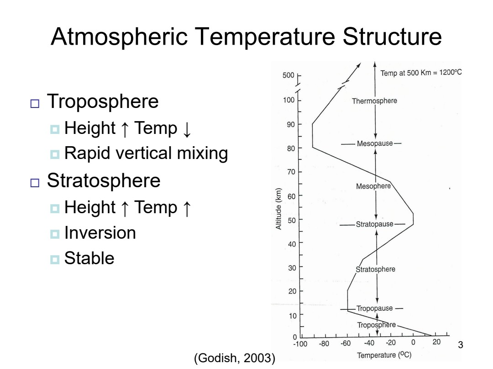

## PDF page 4

Source locator: `ENV4120-09-airpollution-meteorology`, PDF p. 4. [Original PDF page](../../originals/4120/09_AirPollution%26Meteorology.pdf#page=4).

Printed slide number candidate: 4 (use PDF page as canonical locator).

Generated navigation topics: Unclassified; inspect source.

Extraction flags: sparse-text

### Extracted source text

> Atmospheric Density and Pressure
> 4

### Original page appearance

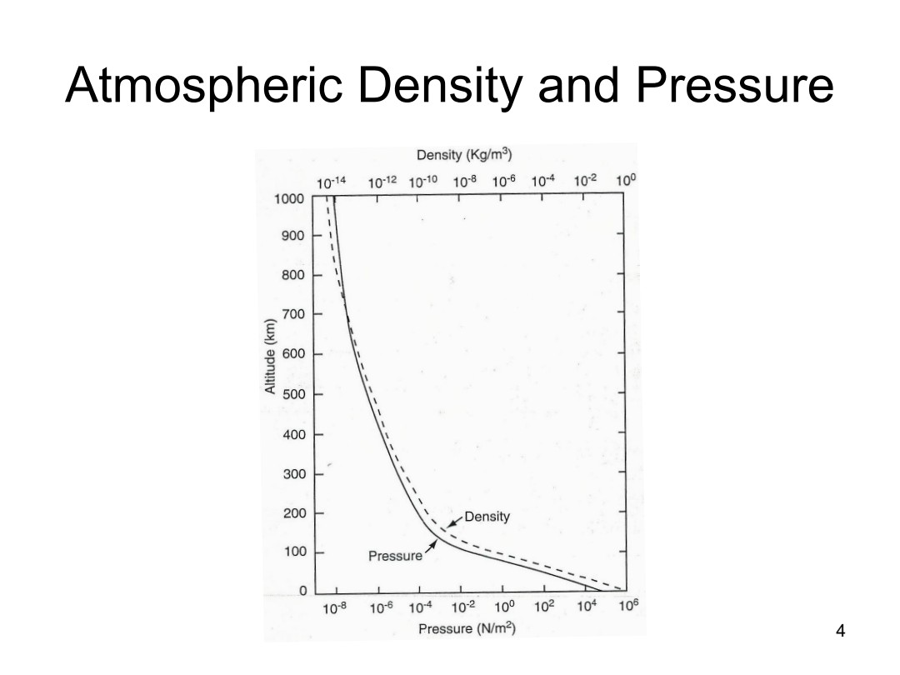

## PDF page 5

Source locator: `ENV4120-09-airpollution-meteorology`, PDF p. 5. [Original PDF page](../../originals/4120/09_AirPollution%26Meteorology.pdf#page=5).

Printed slide number candidate: 5 (use PDF page as canonical locator).

Generated navigation topics: Unclassified; inspect source.

Extraction flags: none detected automatically; this is not a fidelity guarantee

### Extracted source text

> Conversion of temperature & 
> pressure
> 5
> • Temperature: Kelvin (K), Celsius (C), Fahrenheit (F)
> – K = 273.15 + C
> – F = 1.8*C + 32
> – C = (F – 32)/1.8
> • Pressure
> – 1 atm = 1013.25 mbars     = 1.01325 x105 Pa
>                    = 14.69 lb/in2 (psi)   = 760 mmHg
>                    = 10332 mmH2O

### Original page appearance

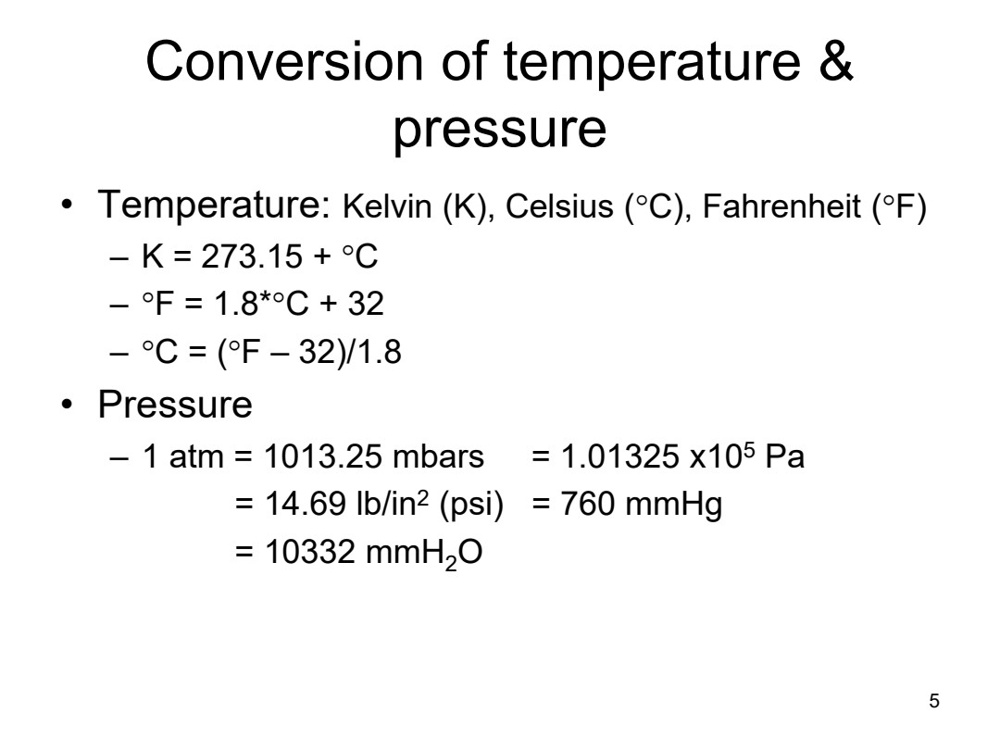

## PDF page 6

Source locator: `ENV4120-09-airpollution-meteorology`, PDF p. 6. [Original PDF page](../../originals/4120/09_AirPollution%26Meteorology.pdf#page=6).

Printed slide number candidate: 6 (use PDF page as canonical locator).

Generated navigation topics: Transport and meteorology, Monitoring networks and siting

Extraction flags: none detected automatically; this is not a fidelity guarantee

### Extracted source text

> Pollution transport
> • After emitted/formed, pollutants need to be 
> transported to get in contact with “receptor”
> – Human, certain part of eco-system etc..
> • Pollution transport depends on meteorology
> • Pollutants can be removed or formed during the 
> process
> • The distance of transport differ drastically 
> depends on pollutant characteristics
> 6

### Original page appearance

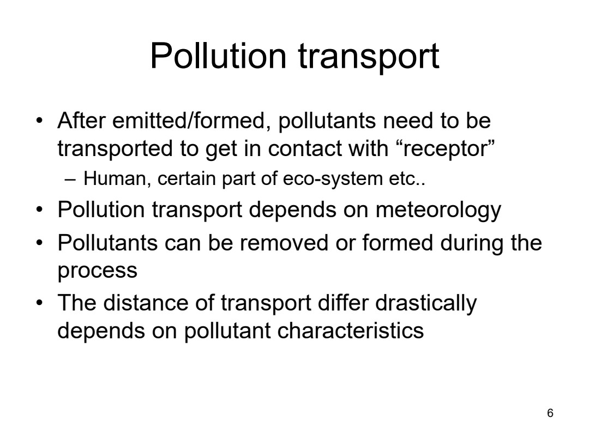

## PDF page 7

Source locator: `ENV4120-09-airpollution-meteorology`, PDF p. 7. [Original PDF page](../../originals/4120/09_AirPollution%26Meteorology.pdf#page=7).

Printed slide number candidate: not identified (use PDF page as canonical locator).

Generated navigation topics: Unclassified; inspect source.

Extraction flags: sparse-text

### Extracted source text

> Large Scale Motion:
> General Circulation pattern
> (Jacobson, 2002)

### Original page appearance

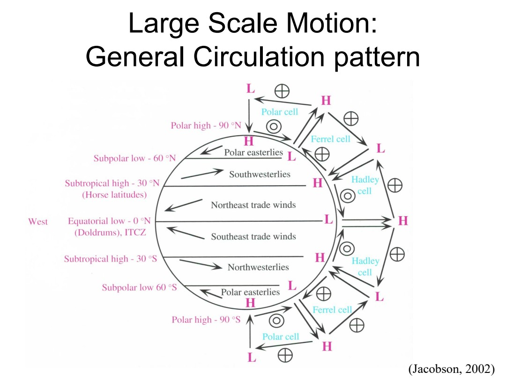

## PDF page 8

Source locator: `ENV4120-09-airpollution-meteorology`, PDF p. 8. [Original PDF page](../../originals/4120/09_AirPollution%26Meteorology.pdf#page=8).

Printed slide number candidate: 8 (use PDF page as canonical locator).

Generated navigation topics: Unclassified; inspect source.

Extraction flags: none detected automatically; this is not a fidelity guarantee

### Extracted source text

> Smaller scale motion
> 8
> • Impact by variable heating and topography
> – valley and mountain breezes
> – sea and land breezes
> – urban heat island flow
> Example of land sea breeze (Griffin, 1994)

### Original page appearance

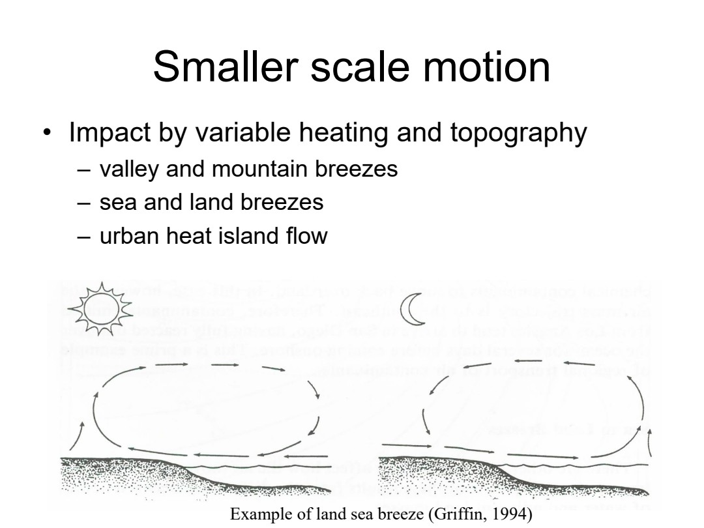

## PDF page 9

Source locator: `ENV4120-09-airpollution-meteorology`, PDF p. 9. [Original PDF page](../../originals/4120/09_AirPollution%26Meteorology.pdf#page=9).

Printed slide number candidate: 9 (use PDF page as canonical locator).

Generated navigation topics: Transport and meteorology

Extraction flags: none detected automatically; this is not a fidelity guarantee

### Extracted source text

> Even smaller scale
> 9
> • Turbulence
> – Random / irregular fluctuations on top of mean flow
> – Circular eddies at smaller scale than mean flow
> • Important to 
> – mixing 
> – dilution
> • Pollution hot spot
> (Cooper and Alley, 2002, Air Pollution Control, Waveland Press.)

### Original page appearance

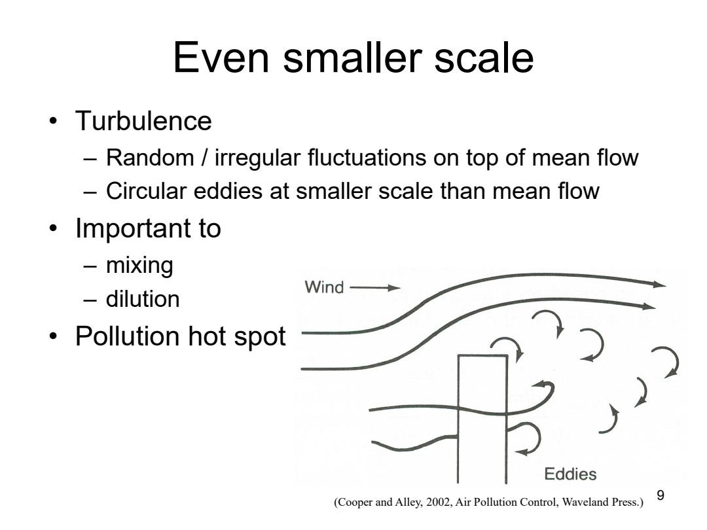

## PDF page 10

Source locator: `ENV4120-09-airpollution-meteorology`, PDF p. 10. [Original PDF page](../../originals/4120/09_AirPollution%26Meteorology.pdf#page=10).

Printed slide number candidate: 10 (use PDF page as canonical locator).

Generated navigation topics: Pollution sources and emissions, Transport and meteorology, Dispersion and Gaussian models

Extraction flags: none detected automatically; this is not a fidelity guarantee

### Extracted source text

> Gone with the wind – Wind Rose
> Horizontal mean flow
> Direction
> Where wind is coming from 
> (angle in degrees clockwise 
> from the north)
> Direction of pollutant transport
> Speed
> transports pollutants further
> dilutes emissions
> creates turbulent mixing
> bends plumes
> (Cooper and Alley, 2002.)
> 10

### Original page appearance

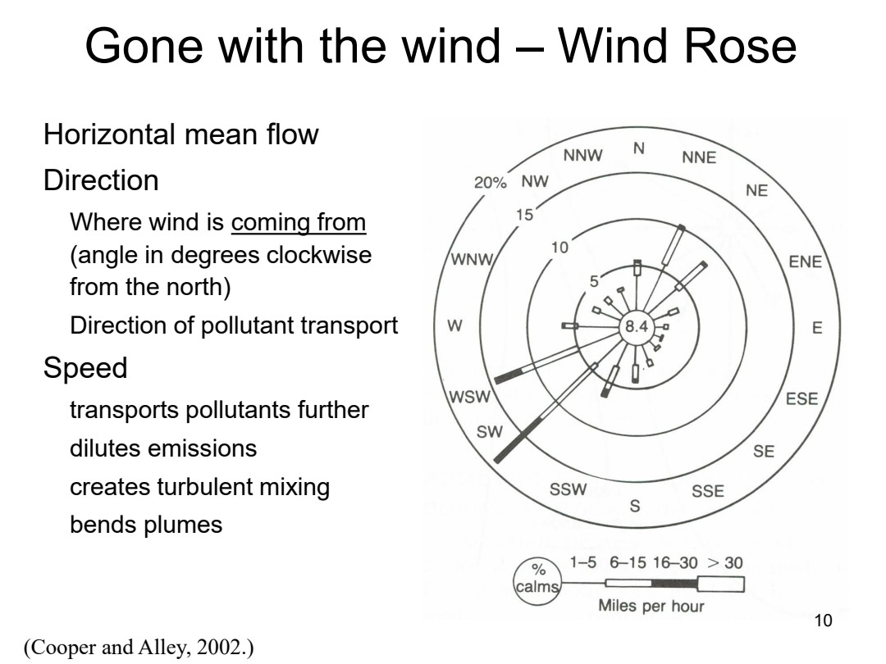

## PDF page 11

Source locator: `ENV4120-09-airpollution-meteorology`, PDF p. 11. [Original PDF page](../../originals/4120/09_AirPollution%26Meteorology.pdf#page=11).

Printed slide number candidate: 11 (use PDF page as canonical locator).

Generated navigation topics: Transport and meteorology

Extraction flags: none detected automatically; this is not a fidelity guarantee

### Extracted source text

> Understanding Stability: 
> Vertical air motion
> 11
> • Buoyancy
> – Air hotter than surrounding is less dense (and rises)
> • Rising and falling air leads to 
> – vertical overturning and mixing
> – pollutant dispersal/dilution due to turbulence
> • Atmosphere can enhance or suppress this
> – Stable – atmosphere resists vertical motion
> – Unstable – atmosphere enhances vertical motion
> – Neutral – atmosphere does neither

### Original page appearance

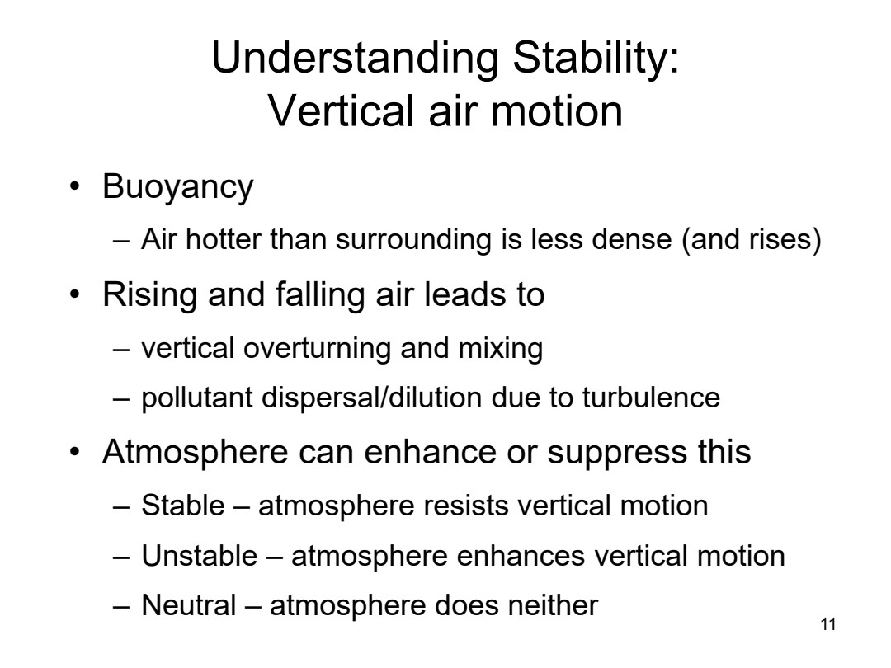

## PDF page 12

Source locator: `ENV4120-09-airpollution-meteorology`, PDF p. 12. [Original PDF page](../../originals/4120/09_AirPollution%26Meteorology.pdf#page=12).

Printed slide number candidate: 12 (use PDF page as canonical locator).

Generated navigation topics: Transport and meteorology

Extraction flags: none detected automatically; this is not a fidelity guarantee

### Extracted source text

> Understanding Stability: 
> Vertical air motion
> 12
> • Say an air parcel rise from the ground….
> – Stable → atmosphere hamper the movement
> – Unstable → atmosphere facilitate the movement
> – Neutral → atmosphere does neither
> • The environmental temperature structure is 
> important

### Original page appearance

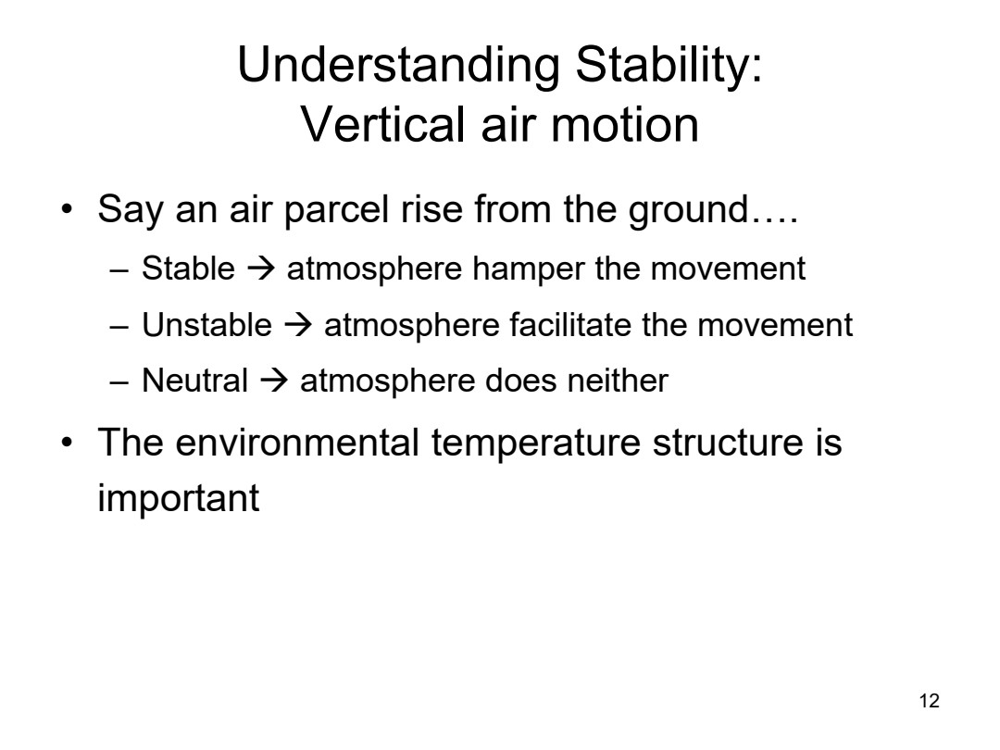

## PDF page 13

Source locator: `ENV4120-09-airpollution-meteorology`, PDF p. 13. [Original PDF page](../../originals/4120/09_AirPollution%26Meteorology.pdf#page=13).

Printed slide number candidate: 13 (use PDF page as canonical locator).

Generated navigation topics: Transport and meteorology

Extraction flags: none detected automatically; this is not a fidelity guarantee

### Extracted source text

> Lapse rate
> 13
> • The change in temperature with height
> Γ = − ∆𝑇
> ∆𝑧
> Γ: lapse rate (K/km or ºC/km).
> ΔT: temperature changes (K or ºC) over height Δz (km)
>        negative if decreases with altitude increasing. 
> Height
> Temperature
> 3 (4)
> 4 (-12)1 (12)
> 2 (7)

### Original page appearance

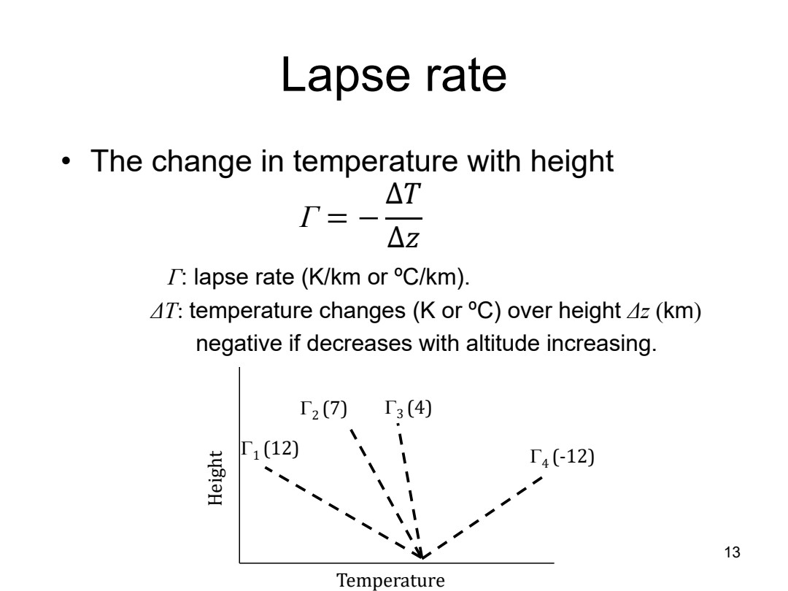

## PDF page 14

Source locator: `ENV4120-09-airpollution-meteorology`, PDF p. 14. [Original PDF page](../../originals/4120/09_AirPollution%26Meteorology.pdf#page=14).

Printed slide number candidate: 14 (use PDF page as canonical locator).

Generated navigation topics: Unclassified; inspect source.

Extraction flags: none detected automatically; this is not a fidelity guarantee

### Extracted source text

> Rise of air parcel
> 14
> • Suppose we have a parcel of air ascending from 
> ground, adiabatic-ally…..
> – Adiabatic Process: Process by which no energy is 
> exchanged between a system (parcel of air) and its 
> surroundings (atmosphere).
> • Height ↑ pressure ↓ parcel expend
>    Air parcel T ↓ 
> – Due to energy balance
> – No heat exchange between parcel &
>    environment (adiabatic)

### Original page appearance

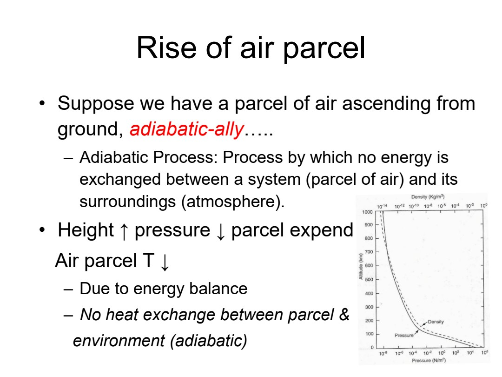

## PDF page 15

Source locator: `ENV4120-09-airpollution-meteorology`, PDF p. 15. [Original PDF page](../../originals/4120/09_AirPollution%26Meteorology.pdf#page=15).

Printed slide number candidate: 15 (use PDF page as canonical locator).

Generated navigation topics: Unclassified; inspect source.

Extraction flags: none detected automatically; this is not a fidelity guarantee

### Extracted source text

> Rise of air parcel
> 15
> • Dry air parcel: lose 9.8 °C/km = Γd 
> • Wet air parcel (saturated with moist) lose less 
> temperature than dry air parcel
> – T ↓, moist → water → release heat
> – Γw  varies ≈ 6 °C/km in this class
> Height
> Temperature
> d (9.8) w (6)

### Original page appearance

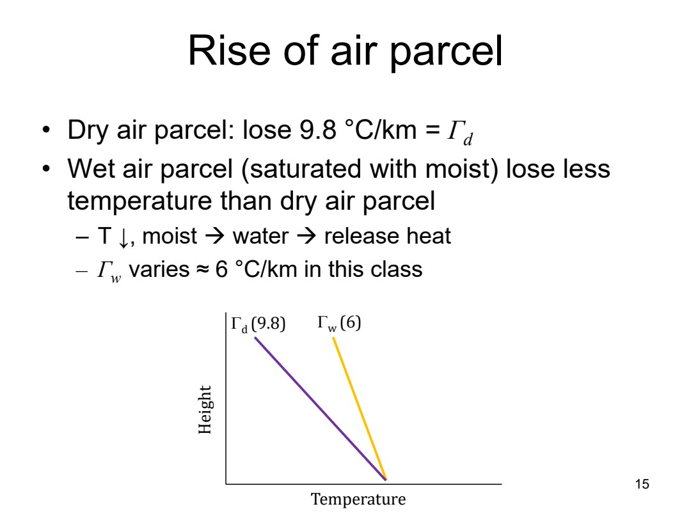

## PDF page 16

Source locator: `ENV4120-09-airpollution-meteorology`, PDF p. 16. [Original PDF page](../../originals/4120/09_AirPollution%26Meteorology.pdf#page=16).

Printed slide number candidate: 16 (use PDF page as canonical locator).

Generated navigation topics: Transport and meteorology

Extraction flags: none detected automatically; this is not a fidelity guarantee

### Extracted source text

> Rise of air parcel
> 16
> • Lapse rate of lower troposphere
> – Environment lapse rate (e), varies greatly
> • Air warmer than surrounding gain buoyancy
> • How different e impact air parcel rising (vertical 
> movement)?
> Height
> Temperature
> d (9.8) w (6)
> e3 (4)
> e4 (-8)e1 (12)
> e2 (7)

### Original page appearance

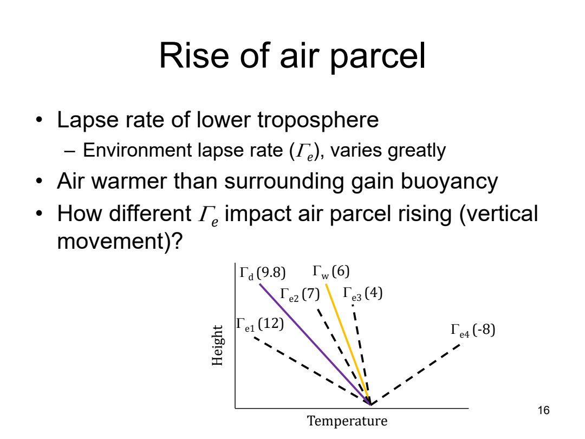

## PDF page 17

Source locator: `ENV4120-09-airpollution-meteorology`, PDF p. 17. [Original PDF page](../../originals/4120/09_AirPollution%26Meteorology.pdf#page=17).

Printed slide number candidate: 17 (use PDF page as canonical locator).

Generated navigation topics: Unclassified; inspect source.

Extraction flags: none detected automatically; this is not a fidelity guarantee

### Extracted source text

> Rise of air parcel
> 17
>  e > d : Absolutely unstable (e1)
> – T of air parcel always > T of surrounding → keeps rising
>  e < w : Absolutely stable (e4)
> – T of air parcel always < T of surrounding → stop rising
> Height
> Temperature
> d (9.8) w (6)
> e4 (-8)e1 (12)

### Original page appearance

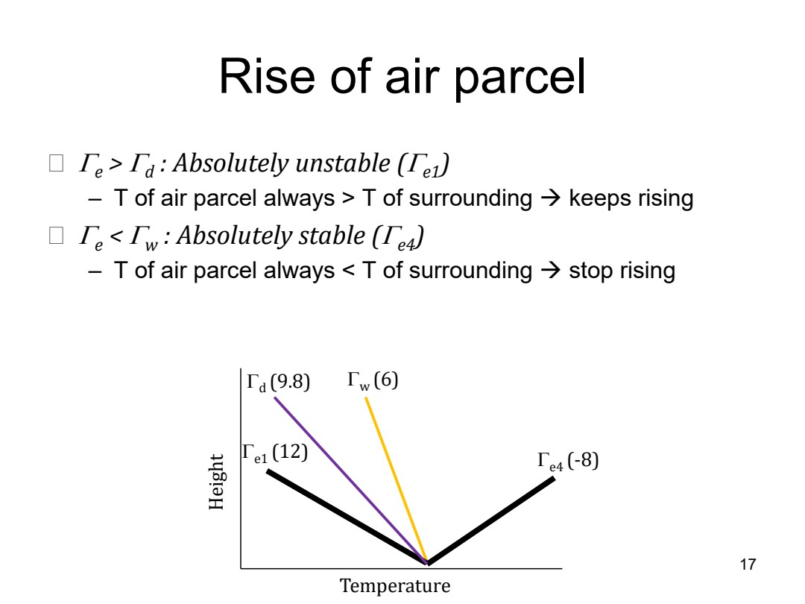

## PDF page 18

Source locator: `ENV4120-09-airpollution-meteorology`, PDF p. 18. [Original PDF page](../../originals/4120/09_AirPollution%26Meteorology.pdf#page=18).

Printed slide number candidate: 18 (use PDF page as canonical locator).

Generated navigation topics: Unclassified; inspect source.

Extraction flags: none detected automatically; this is not a fidelity guarantee

### Extracted source text

> Rise of the air parcel
> 18
>  e > d : Absolutely unstable (e1)
>  e = d : Dry neutral
>  d  > e > w : Conditionally unstable (e2)
>  e = w : Wet neutral
>  e < w : Absolutely stable (e3,e4)
> Height
> Temperature
> d (9.8) w (6)
> e3 (4)
> e4 (-8)e1 (12)
> e2 (7)

### Original page appearance

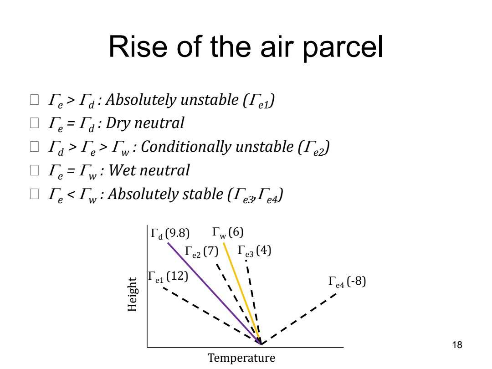

## PDF page 19

Source locator: `ENV4120-09-airpollution-meteorology`, PDF p. 19. [Original PDF page](../../originals/4120/09_AirPollution%26Meteorology.pdf#page=19).

Printed slide number candidate: 19 (use PDF page as canonical locator).

Generated navigation topics: Unclassified; inspect source.

Extraction flags: sparse-text

### Extracted source text

> Effects on Pollutant Releases
> 19
> Jacobson, 2012

### Original page appearance

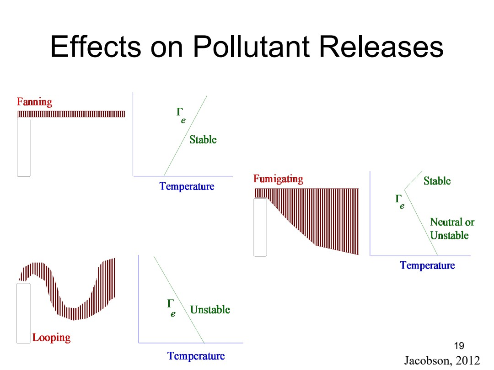

## PDF page 20

Source locator: `ENV4120-09-airpollution-meteorology`, PDF p. 20. [Original PDF page](../../originals/4120/09_AirPollution%26Meteorology.pdf#page=20).

Printed slide number candidate: 20 (use PDF page as canonical locator).

Generated navigation topics: Unclassified; inspect source.

Extraction flags: sparse-text

### Extracted source text

> Effects on Pollutant Releases
> 20
> Jacobson, 2012

### Original page appearance

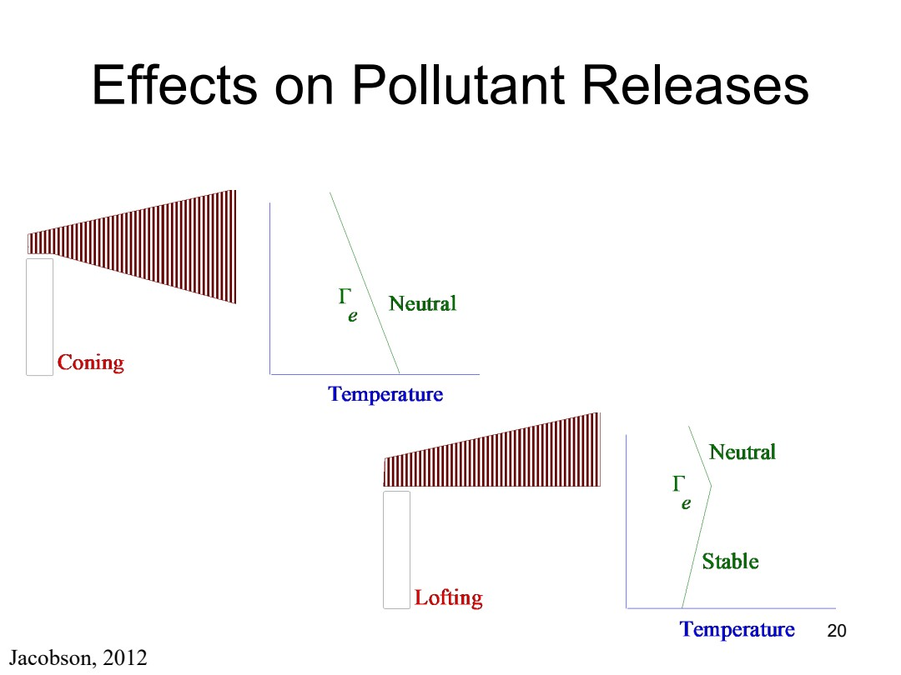

## PDF page 21

Source locator: `ENV4120-09-airpollution-meteorology`, PDF p. 21. [Original PDF page](../../originals/4120/09_AirPollution%26Meteorology.pdf#page=21).

Printed slide number candidate: 21 (use PDF page as canonical locator).

Generated navigation topics: Transport and meteorology

Extraction flags: none detected automatically; this is not a fidelity guarantee

### Extracted source text

> Inversions
> • Definition: a negative environmental lapse rate 
> – Temperature increases with height
> • Always stable
> • Why important?
> – Can trap air and pollutants
> • Types and effects
> – Frontal
> – Nocturnal (radiation)
> – Subsidence
> http://apollo.lsc.vsc.edu/classes/met130/notes/chapter1
> 8/graphics/subsidence_inversion.gif
> 21

### Original page appearance

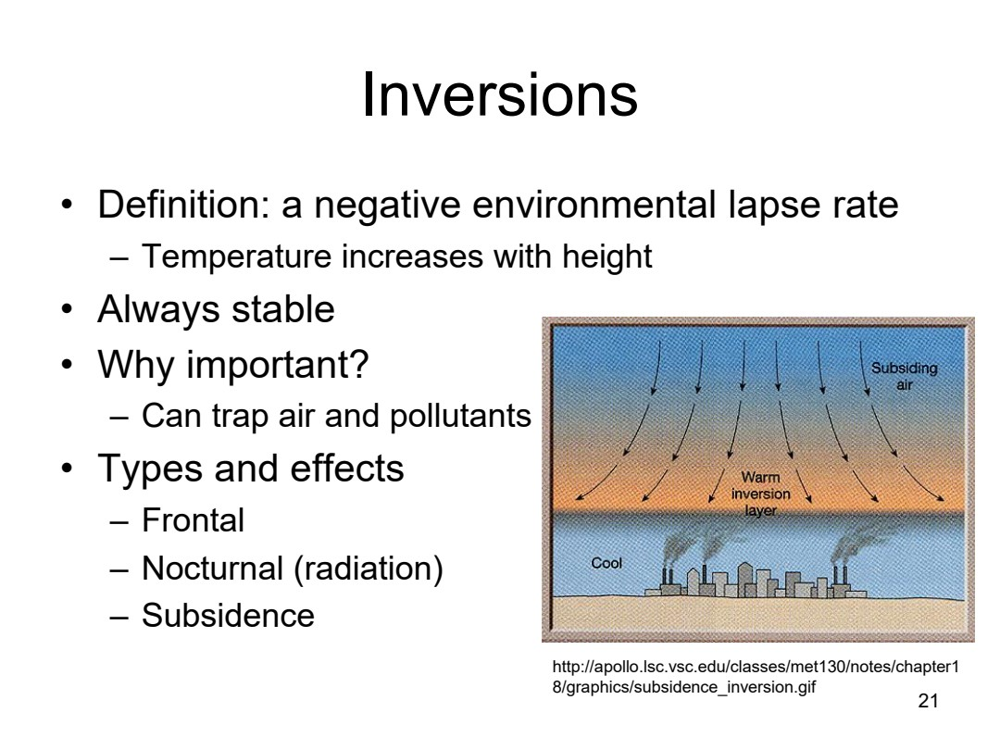

## PDF page 22

Source locator: `ENV4120-09-airpollution-meteorology`, PDF p. 22. [Original PDF page](../../originals/4120/09_AirPollution%26Meteorology.pdf#page=22).

Printed slide number candidate: not identified (use PDF page as canonical locator).

Generated navigation topics: Unclassified; inspect source.

Extraction flags: sparse-text

### Extracted source text

> Tropospheric Temperature Structure 
> Diurnal Variation
> (Jacobson, 2002)

### Original page appearance

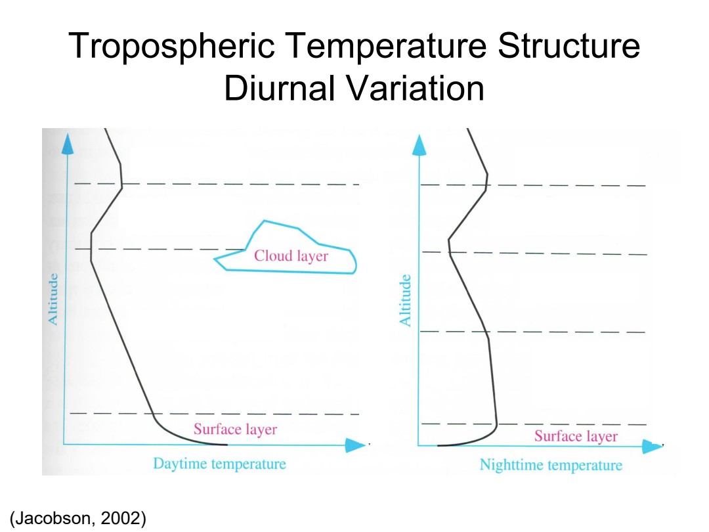

## PDF page 23

Source locator: `ENV4120-09-airpollution-meteorology`, PDF p. 23. [Original PDF page](../../originals/4120/09_AirPollution%26Meteorology.pdf#page=23).

Printed slide number candidate: 23 (use PDF page as canonical locator).

Generated navigation topics: Transport and meteorology

Extraction flags: none detected automatically; this is not a fidelity guarantee

### Extracted source text

> Mixing Depth /Height
> • Height to which 
> air is vigorously 
> mixed
> • Definable if  
> unstable or 
> neutral below and 
> stable above
> 23

### Original page appearance

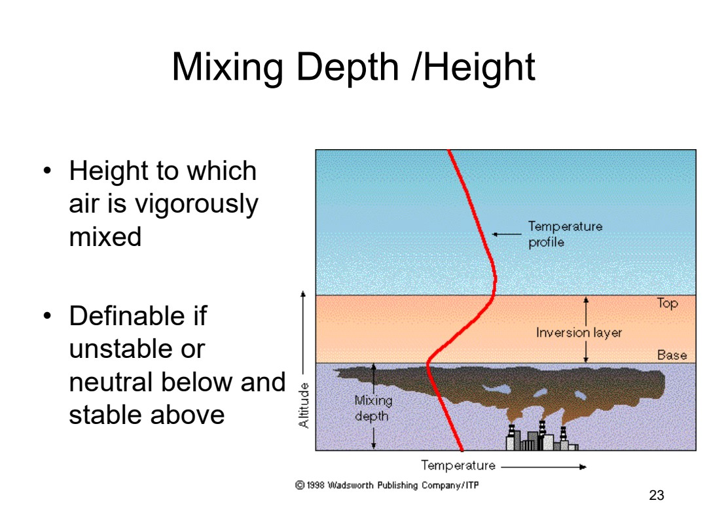

## PDF page 24

Source locator: `ENV4120-09-airpollution-meteorology`, PDF p. 24. [Original PDF page](../../originals/4120/09_AirPollution%26Meteorology.pdf#page=24).

Printed slide number candidate: 24 (use PDF page as canonical locator).

Generated navigation topics: Transport and meteorology

Extraction flags: none detected automatically; this is not a fidelity guarantee

### Extracted source text

> Categorizing Stability: Classes
> (Hanna et al., 1982, Handbook on Atmospheric 
> Diffusion. U.S. Dept. of Energy).
> more stable with less clouds
> day: more stable as u increases
> night: less stable as u increases
> more stable with less sunlight
> 24

### Original page appearance

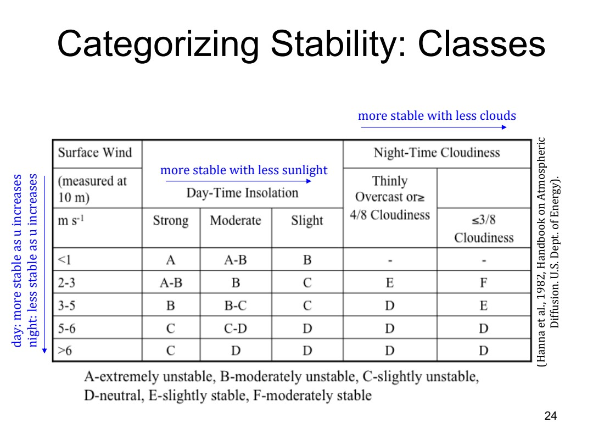

## PDF page 25

Source locator: `ENV4120-09-airpollution-meteorology`, PDF p. 25. [Original PDF page](../../originals/4120/09_AirPollution%26Meteorology.pdf#page=25).

Printed slide number candidate: 25 (use PDF page as canonical locator).

Generated navigation topics: Transport and meteorology

Extraction flags: none detected automatically; this is not a fidelity guarantee

### Extracted source text

> Wind: Vertical
> 25
> • Wind direction changes vertically
> • Wind speed also changes
> – Lower speed near ground due to friction
> – Different land use → different friction
> Example vertical wind speed profile (Godish, 2003)

### Original page appearance

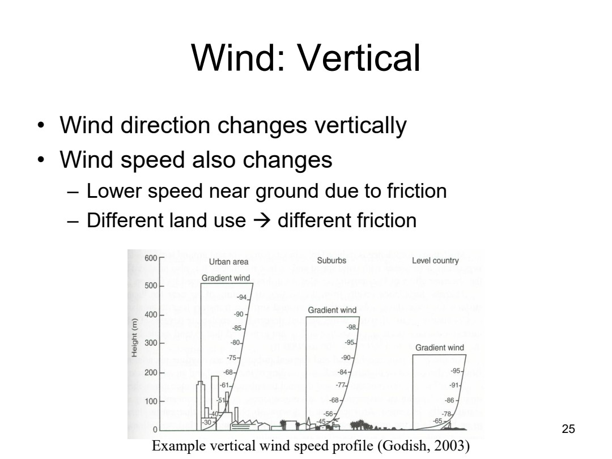

## PDF page 26

Source locator: `ENV4120-09-airpollution-meteorology`, PDF p. 26. [Original PDF page](../../originals/4120/09_AirPollution%26Meteorology.pdf#page=26).

Printed slide number candidate: 26 (use PDF page as canonical locator).

Generated navigation topics: Transport and meteorology

Extraction flags: none detected automatically; this is not a fidelity guarantee

### Extracted source text

> Wind speed profile power law
> 26
> • Wind speed vs altitude (power law)
> 𝑢
> 𝑢0
> = 𝑧
> 𝑧0
> 𝑝
> u: wind speed (m/s) at height z (m)
> u0: reference wind speed, typically measured at 10 m (z0)
>  p: coefficient, varies with surface roughness and stability  
>      (0.15-0.55) (We’ll learned about
>      stability later)

### Original page appearance

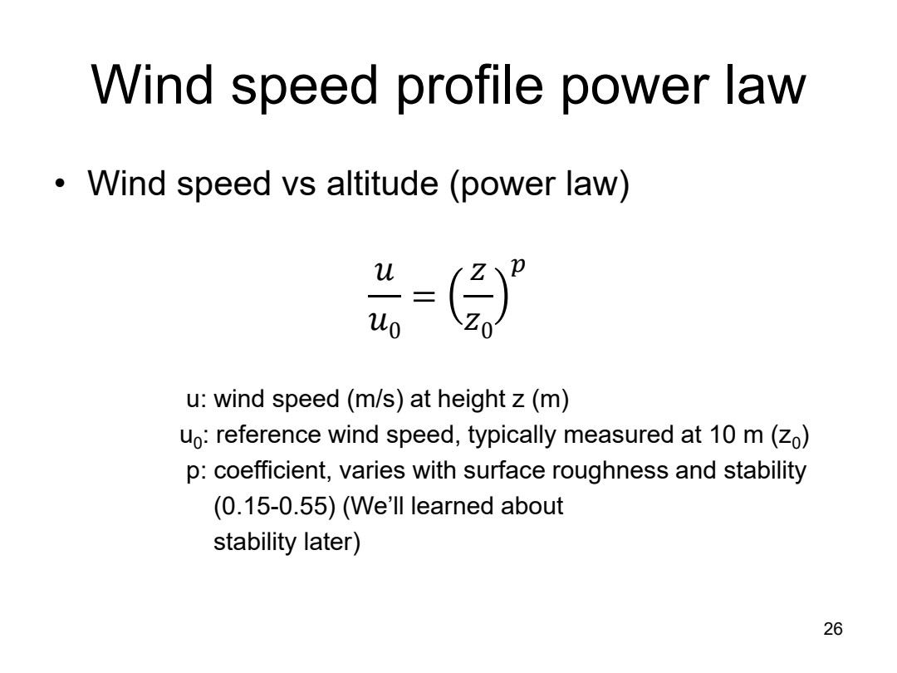

## PDF page 27

Source locator: `ENV4120-09-airpollution-meteorology`, PDF p. 27. [Original PDF page](../../originals/4120/09_AirPollution%26Meteorology.pdf#page=27).

Printed slide number candidate: 27 (use PDF page as canonical locator).

Generated navigation topics: Transport and meteorology

Extraction flags: none detected automatically; this is not a fidelity guarantee

### Extracted source text

> Look up table for p value
> 27
> Stability Class Urban Rural
> A 0.15 0.07
> B 0.15 0.07
> C 0.2 0.1
> D 0.25 0.15
> E 0.3 0.35
> F 0.3 0.55

### Original page appearance

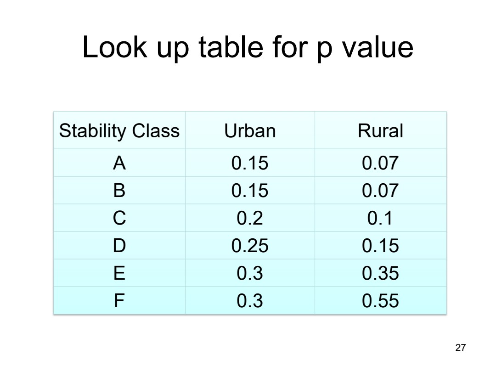
