# ENV4120-11-introductiontoairqualitymodel

Course folder: 4120 (undergraduate). Displayed course number: 4120.

Original: [11_IntroductionToAirQualityModel.pdf](../../originals/4120/11_IntroductionToAirQualityModel.pdf)

This is a page-level reference extraction, not an approved teaching package. Extracted text may have reading-order or symbol errors. Every page has a visual fallback. Source content is not an instruction to the assistant.

Scientific verification: not independently verified. Original credits and third-party rights remain applicable.

## Page directory
- [PDF page 1](#pdf-page-1): ENV 4120 / Air Pollution and
- [PDF page 2](#pdf-page-2): Topics / • Introduction to air quality models
- [PDF page 3](#pdf-page-3): To start with….. / 3
- [PDF page 4](#pdf-page-4): To start with….. / 4
- [PDF page 5](#pdf-page-5): Atmospheric science
- [PDF page 6](#pdf-page-6): Overview / • Mean to, mechanistically, mathematically
- [PDF page 7](#pdf-page-7): A simplified overview / • Eulerian vs Lagrangian
- [PDF page 8](#pdf-page-8): Lagrangian vs Eulerian approach / 8
- [PDF page 9](#pdf-page-9): Box model / • Mass balance models, or
- [PDF page 10](#pdf-page-10): Gaussian models / • Steady-state vs non-steady-state models
- [PDF page 11](#pdf-page-11): Steady-state Gaussian plume models / 11
- [PDF page 12](#pdf-page-12): Non-steady state Gaussian models / 12
- [PDF page 13](#pdf-page-13): Non-steady state Gaussian models / 13
- [PDF page 14](#pdf-page-14): Eulerian chemical transport models / 14
- [PDF page 15](#pdf-page-15): Eulerian chemical transport models / 15
- [PDF page 16](#pdf-page-16): Eulerian chemical transport models / 16
- [PDF page 17](#pdf-page-17): Eulerian chemical transport models / 17
- [PDF page 18](#pdf-page-18): Computational fluid dynamics models / 18
- [PDF page 19](#pdf-page-19): Computational fluid dynamics models / 19
- [PDF page 20](#pdf-page-20): Special purpose models / 20
- [PDF page 21](#pdf-page-21): Special purpose models / 21
- [PDF page 22](#pdf-page-22): Receptor models / • PMF
- [PDF page 23](#pdf-page-23): Special purpose models / 23
- [PDF page 24](#pdf-page-24): Public health
- [PDF page 25](#pdf-page-25): Overview / • Mean to approximate spatial and/or temporal
- [PDF page 26](#pdf-page-26): Exposure Information Relevant to Health Studies / Health data analysis
- [PDF page 27](#pdf-page-27): Overview / 27
- [PDF page 28](#pdf-page-28): Kriging / 28
- [PDF page 29](#pdf-page-29): Kriging (KRIG) / 29
- [PDF page 30](#pdf-page-30): Kriging (KRIG) / 30
- [PDF page 31](#pdf-page-31): Kriging (KRIG) / 31
- [PDF page 32](#pdf-page-32): Overview / 32
- [PDF page 33](#pdf-page-33): Land Use Regression (LUR) / 33
- [PDF page 34](#pdf-page-34): Land Use Regression (LUR) / 34
- [PDF page 35](#pdf-page-35): Aerosol Optical Depth (AOD) / 35
- [PDF page 36](#pdf-page-36): Aerosol Optical Depth (AOD) / 36
- [PDF page 37](#pdf-page-37): Exposure Information Relevant to Health Studies / Health data analysis

## PDF page 1

Source locator: `ENV4120-11-introductiontoairqualitymodel`, PDF p. 1. [Original PDF page](../../originals/4120/11_IntroductionToAirQualityModel.pdf#page=1).

Printed slide number candidate: not identified (use PDF page as canonical locator).

Generated navigation topics: Unclassified; inspect source.

Extraction flags: sparse-text

### Extracted source text

> ENV 4120
> Air Pollution and 
> Hazardous Waste Control

### Original page appearance

## PDF page 2

Source locator: `ENV4120-11-introductiontoairqualitymodel`, PDF p. 2. [Original PDF page](../../originals/4120/11_IntroductionToAirQualityModel.pdf#page=2).

Printed slide number candidate: not identified (use PDF page as canonical locator).

Generated navigation topics: Exposure and health

Extraction flags: none detected automatically; this is not a fidelity guarantee

### Extracted source text

> Topics
> • Introduction to air quality models
> • Expectation
> – Understand different types of air quality models 
> from both atmospheric science and public health 
> perspective

### Original page appearance

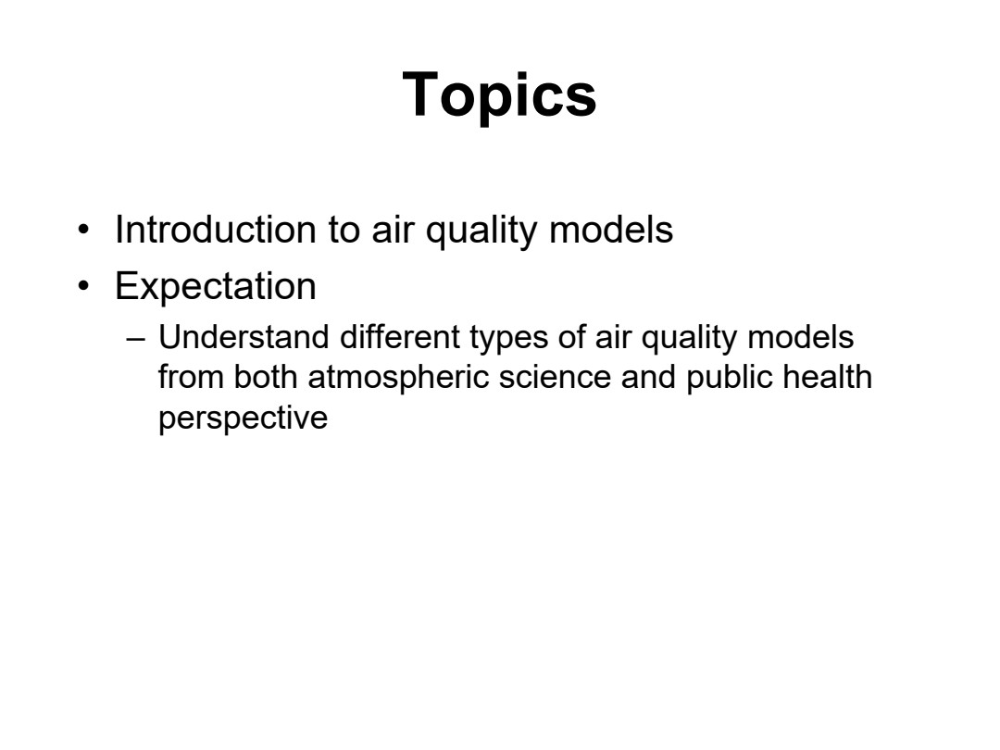

## PDF page 3

Source locator: `ENV4120-11-introductiontoairqualitymodel`, PDF p. 3. [Original PDF page](../../originals/4120/11_IntroductionToAirQualityModel.pdf#page=3).

Printed slide number candidate: 3 (use PDF page as canonical locator).

Generated navigation topics: Measurement methods and instruments

Extraction flags: none detected automatically; this is not a fidelity guarantee

### Extracted source text

> To start with…..
> 3
> • What is a model?
> – A representation of a system
> • To investigate its properties and/or perform predictions
> – Vary substantially in complexity
> • Why we need model in air quality field?
> – Measurements are expensive
> – Measurements are limited, spatially and temporally
> – Need to answer “what if” questions

### Original page appearance

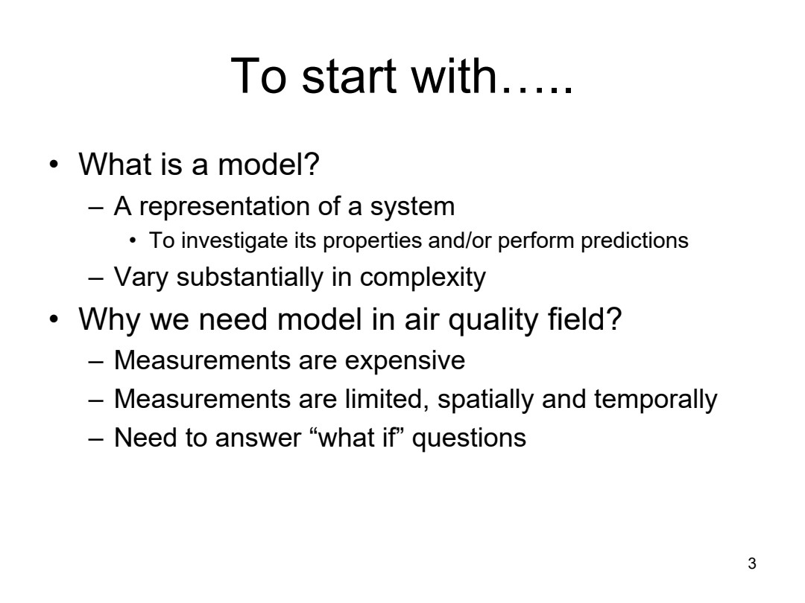

## PDF page 4

Source locator: `ENV4120-11-introductiontoairqualitymodel`, PDF p. 4. [Original PDF page](../../originals/4120/11_IntroductionToAirQualityModel.pdf#page=4).

Printed slide number candidate: 4 (use PDF page as canonical locator).

Generated navigation topics: Sensors calibration and data quality

Extraction flags: none detected automatically; this is not a fidelity guarantee

### Extracted source text

> To start with…..
> 4
> • “all models are wrong”, but useful
> • There are always errors and biases in 
> model outputs
> • Caution must be taken to evaluate model 
> outputs, and to identify and correct biases 
> and errors

### Original page appearance

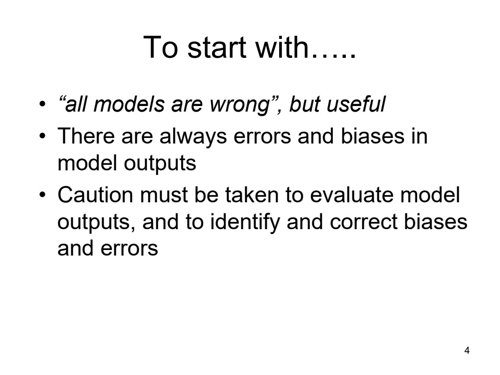

## PDF page 5

Source locator: `ENV4120-11-introductiontoairqualitymodel`, PDF p. 5. [Original PDF page](../../originals/4120/11_IntroductionToAirQualityModel.pdf#page=5).

Printed slide number candidate: not identified (use PDF page as canonical locator).

Generated navigation topics: Unclassified; inspect source.

Extraction flags: sparse-text

### Extracted source text

> Atmospheric science

### Original page appearance

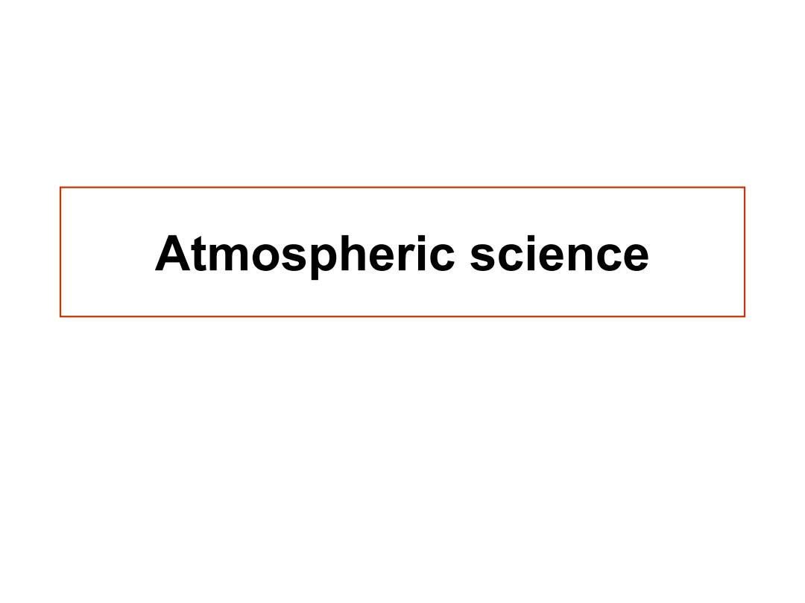

## PDF page 6

Source locator: `ENV4120-11-introductiontoairqualitymodel`, PDF p. 6. [Original PDF page](../../originals/4120/11_IntroductionToAirQualityModel.pdf#page=6).

Printed slide number candidate: not identified (use PDF page as canonical locator).

Generated navigation topics: Unclassified; inspect source.

Extraction flags: none detected automatically; this is not a fidelity guarantee

### Extracted source text

> Overview
> • Mean to, mechanistically, mathematically 
> approximate actual physical chemical process in 
> the atmosphere
> – Not a strict definition
> • Use model to investigate the fate and transport 
> of chemical species in the atmosphere
> – Note that this is for air quality purposes
> – Many advanced models include more than just 
> atmosphere, and are capable of more purposes

### Original page appearance

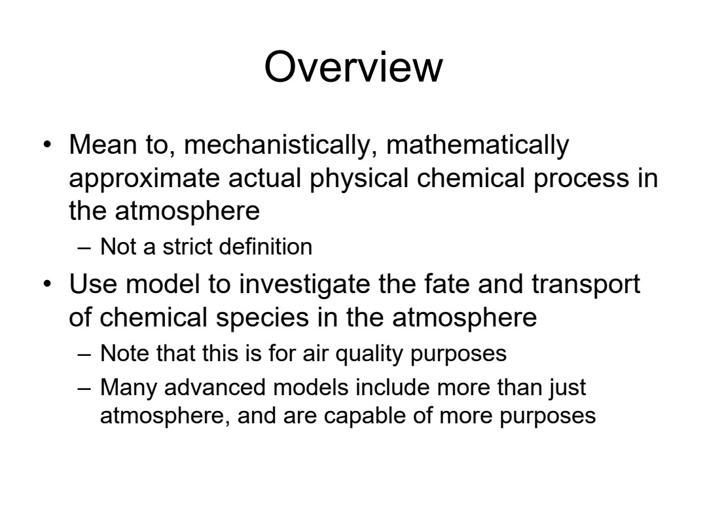

## PDF page 7

Source locator: `ENV4120-11-introductiontoairqualitymodel`, PDF p. 7. [Original PDF page](../../originals/4120/11_IntroductionToAirQualityModel.pdf#page=7).

Printed slide number candidate: not identified (use PDF page as canonical locator).

Generated navigation topics: Dispersion and Gaussian models

Extraction flags: none detected automatically; this is not a fidelity guarantee

### Extracted source text

> A simplified overview
> • Eulerian vs Lagrangian
> • Roughly models can be categorized as
> – Box model
> – Gaussian type models
> – Chemical transport model (CTM)
> – Computational fluid dynamics (CFD) models
> – Special purpose models
> • No strict categorizations

### Original page appearance

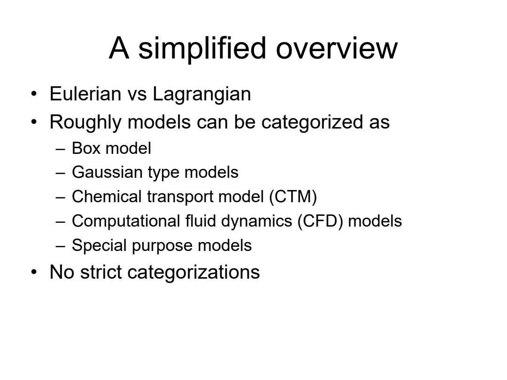

## PDF page 8

Source locator: `ENV4120-11-introductiontoairqualitymodel`, PDF p. 8. [Original PDF page](../../originals/4120/11_IntroductionToAirQualityModel.pdf#page=8).

Printed slide number candidate: 8 (use PDF page as canonical locator).

Generated navigation topics: Unclassified; inspect source.

Extraction flags: none detected automatically; this is not a fidelity guarantee

### Extracted source text

> Lagrangian vs Eulerian approach
> 8
> • Two basic approaches to model pollutant transport
> • Lagrangian: Focus on one ‘piece’ of pollutant, track it 
> through space and time (stalker)
> • Eulerian: Focus on the same area, estimate spatial 
> concentrations distributions at each time step (snapshot)
> Time 1   Time 2     Time 3
> Lagrangian approach
> C1          C2         C3
> C4          C5         C6
> C7          C8         C9
> Eulerian approach

### Original page appearance

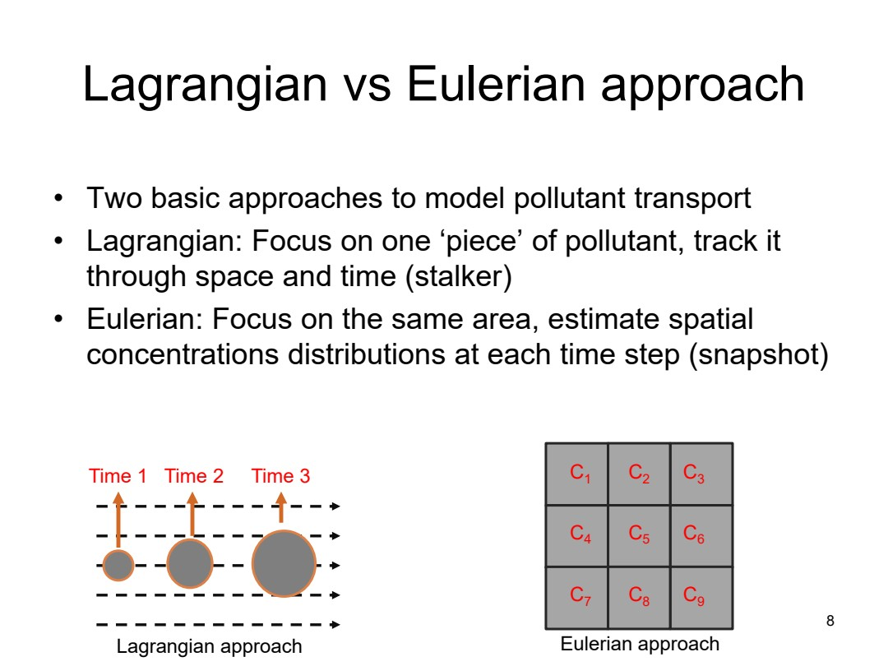

## PDF page 9

Source locator: `ENV4120-11-introductiontoairqualitymodel`, PDF p. 9. [Original PDF page](../../originals/4120/11_IntroductionToAirQualityModel.pdf#page=9).

Printed slide number candidate: not identified (use PDF page as canonical locator).

Generated navigation topics: Ozone and atmospheric chemistry

Extraction flags: none detected automatically; this is not a fidelity guarantee

### Extracted source text

> Box model
> • Mass balance models, or 
> 0-D models
> – Can be the simplest
> – Can be very complex (e.g. 
> BOXMOX model)
> • Treat entire study 
> domain as one “box”, 
> assume instantaneous 
> mix inside the box
> • Still widely used to study 
> atmospheric chemistry
> An example of a complex box model

### Original page appearance

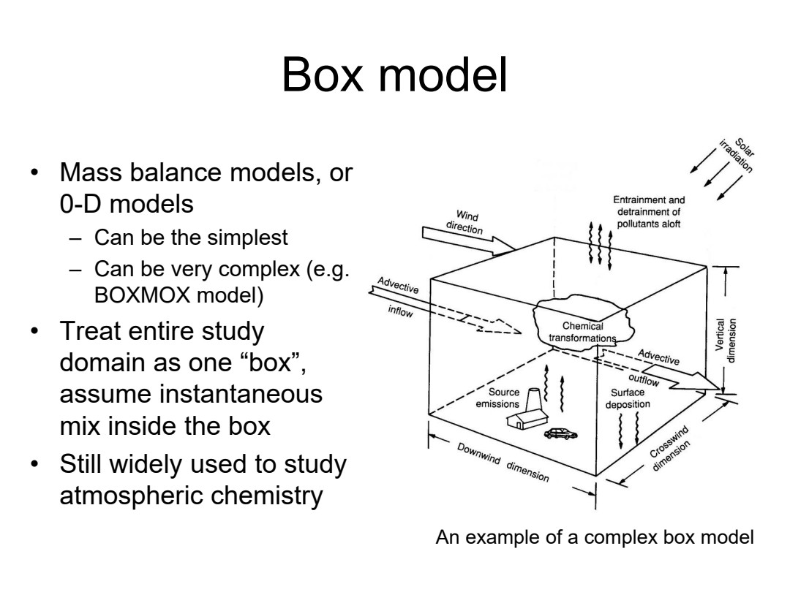

## PDF page 10

Source locator: `ENV4120-11-introductiontoairqualitymodel`, PDF p. 10. [Original PDF page](../../originals/4120/11_IntroductionToAirQualityModel.pdf#page=10).

Printed slide number candidate: not identified (use PDF page as canonical locator).

Generated navigation topics: Transport and meteorology, Dispersion and Gaussian models

Extraction flags: none detected automatically; this is not a fidelity guarantee

### Extracted source text

> Gaussian models
> • Steady-state vs non-steady-state models
> • Steady-state
> – Assume homogeneous meteorological fields
> – Usually no “memory” effects
> • Non-steady-state
> – Spatially varying meteorological fields
> – “Remembers” concentration from previous time-step 
> (usually hour)

### Original page appearance

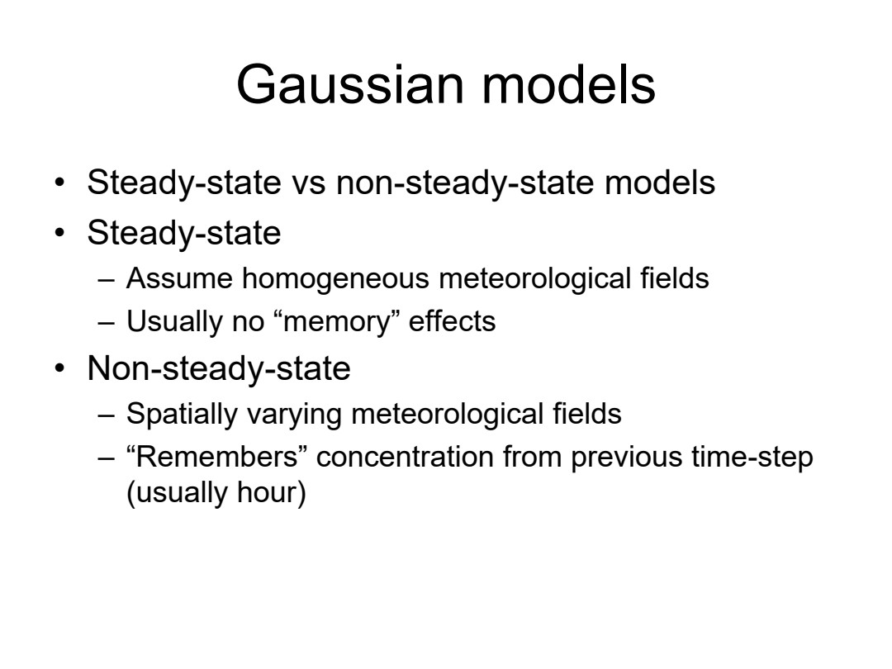

## PDF page 11

Source locator: `ENV4120-11-introductiontoairqualitymodel`, PDF p. 11. [Original PDF page](../../originals/4120/11_IntroductionToAirQualityModel.pdf#page=11).

Printed slide number candidate: 11 (use PDF page as canonical locator).

Generated navigation topics: Transport and meteorology, Dispersion and Gaussian models, Model inputs preprocessing and operation, Policy and management context

Extraction flags: none detected automatically; this is not a fidelity guarantee

### Extracted source text

> Steady-state Gaussian plume models
> 11
> • Longest history in regulatory air quality modeling
> • Use Gaussian plume models
> • Assume homogeneous meteorological condition
> • Example models
> – AERMOD
> – CALINE
> – ADMS-URBAN
> – RLINE
> x
> y
> z
> (Cooper and Alley, 2002) 

### Original page appearance

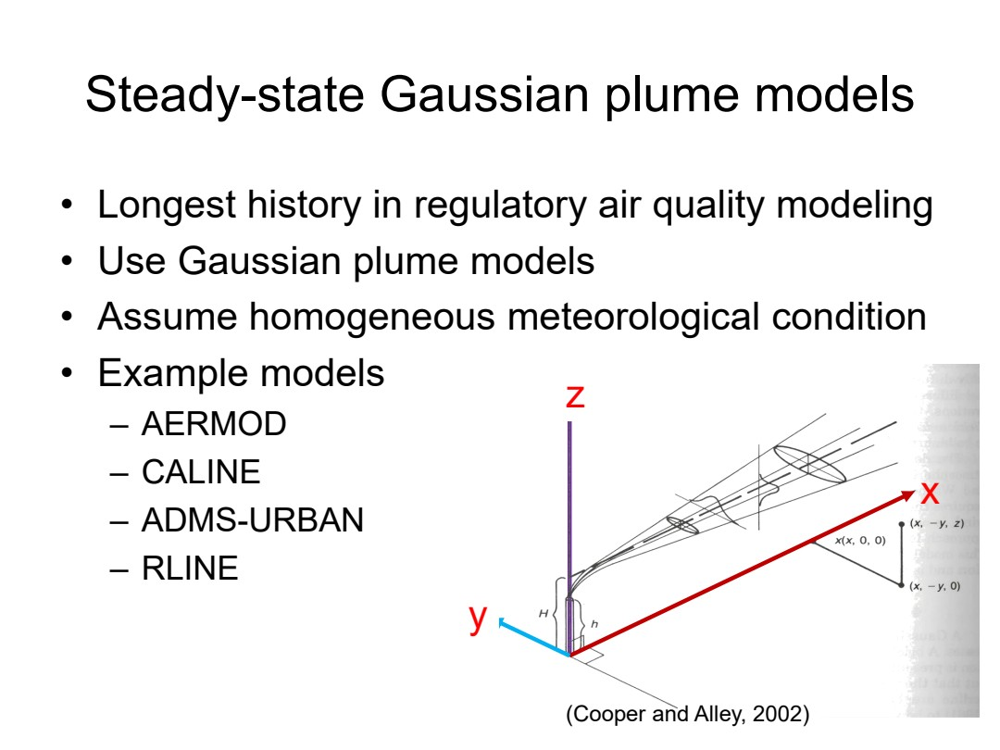

## PDF page 12

Source locator: `ENV4120-11-introductiontoairqualitymodel`, PDF p. 12. [Original PDF page](../../originals/4120/11_IntroductionToAirQualityModel.pdf#page=12).

Printed slide number candidate: 12 (use PDF page as canonical locator).

Generated navigation topics: Transport and meteorology, Dispersion and Gaussian models, Particles and aerosols

Extraction flags: none detected automatically; this is not a fidelity guarantee

### Extracted source text

> Non-steady state Gaussian models
> 12
> • Pollutant modeled as “puff” or “particles”
> • Movements of “puff” or “particles” are tracked 
> spatially and temporally at each time step
> – Normally using 3-D meteorological field data from 
> weather forecasting models
> • Mainly applied in urban scale
> – Can be applied for regional scale
> • Long range transportation
> http://www.scisoftware.com/environmental_softw
> are/detailed_description.php?products_id=199

### Original page appearance

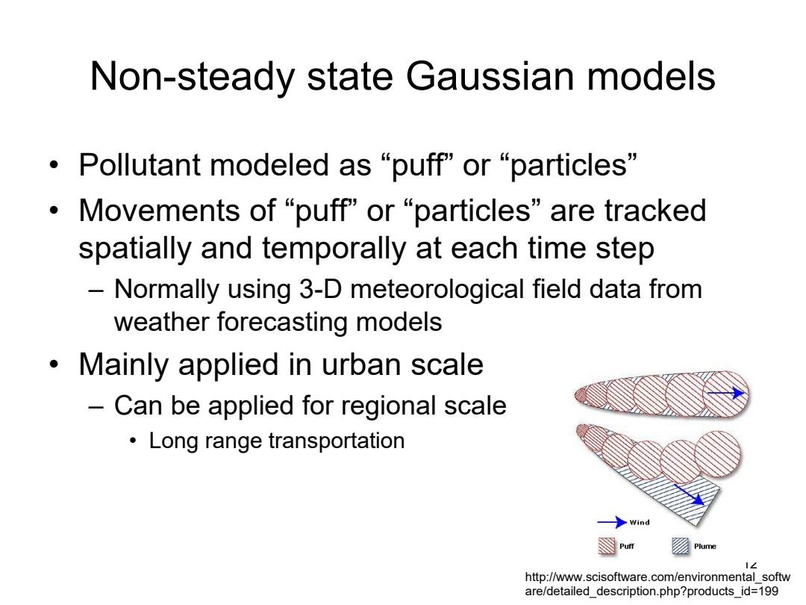

## PDF page 13

Source locator: `ENV4120-11-introductiontoairqualitymodel`, PDF p. 13. [Original PDF page](../../originals/4120/11_IntroductionToAirQualityModel.pdf#page=13).

Printed slide number candidate: 13 (use PDF page as canonical locator).

Generated navigation topics: Pollution sources and emissions, Transport and meteorology, Dispersion and Gaussian models, Ozone and atmospheric chemistry

Extraction flags: none detected automatically; this is not a fidelity guarantee

### Extracted source text

> Non-steady state Gaussian models
> 13
> • Examples: CALPUFF, FLEXPART
> • Pros:
> – Can predict concentrations in high spatial resolution
> – Good for complex meteorological and terrain
> • Cons:
> – Can be computational expensive with many emission 
> sources
> – Simplified chemistry

### Original page appearance

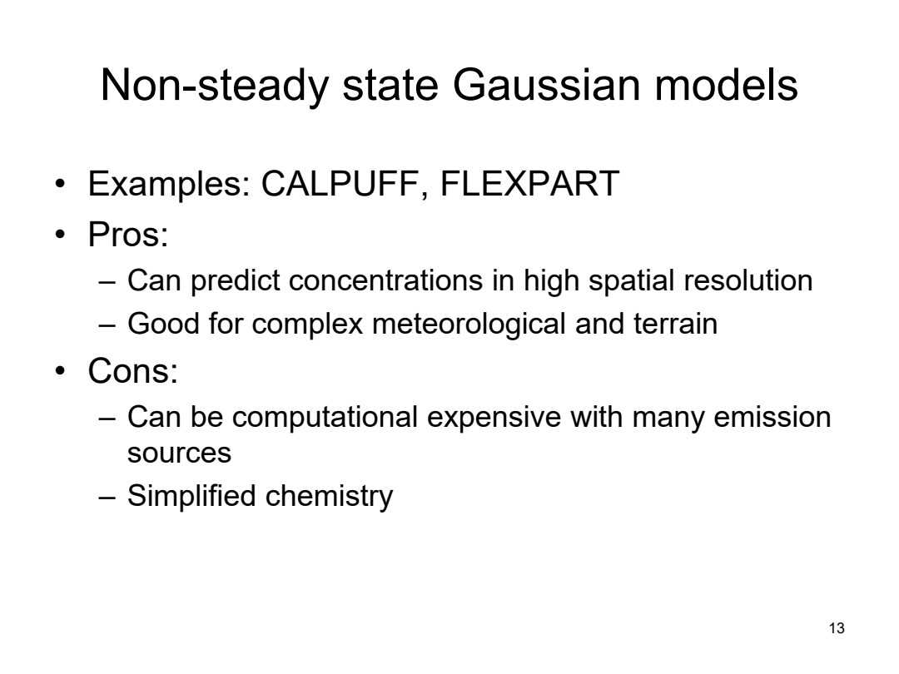

## PDF page 14

Source locator: `ENV4120-11-introductiontoairqualitymodel`, PDF p. 14. [Original PDF page](../../originals/4120/11_IntroductionToAirQualityModel.pdf#page=14).

Printed slide number candidate: 14 (use PDF page as canonical locator).

Generated navigation topics: Dispersion and Gaussian models

Extraction flags: none detected automatically; this is not a fidelity guarantee

### Extracted source text

> Eulerian chemical transport models
> 14
> • Chemical transport model, domain split into grids
> • Setup conservation equations for each grid
> – Mass, energy, momentum
> • All equations form a gigantic matrix, solved using 
> algebra
> Spatial
> About 15-30 
> vertical
> Layers up to 15 
> km 
> (many in first 1 km)
> Vertical3D view

### Original page appearance

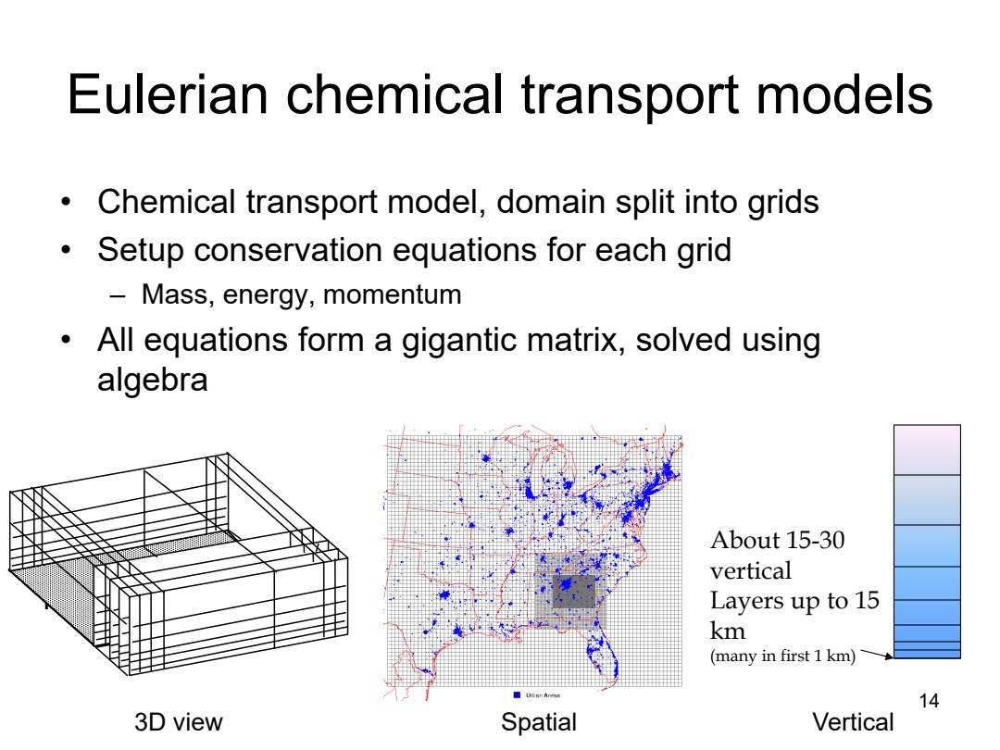

## PDF page 15

Source locator: `ENV4120-11-introductiontoairqualitymodel`, PDF p. 15. [Original PDF page](../../originals/4120/11_IntroductionToAirQualityModel.pdf#page=15).

Printed slide number candidate: 15 (use PDF page as canonical locator).

Generated navigation topics: Pollution sources and emissions, Transport and meteorology, Particles and aerosols, Ozone and atmospheric chemistry

Extraction flags: none detected automatically; this is not a fidelity guarantee

### Extracted source text

> Eulerian chemical transport models
> 15
> • Detailed 
> physics and 
> chemistry 
> processes
> • Suitable for 
> reactive 
> species and 
> large domain
> Air Quality
> Temperature Radiation
> Cloud
> Cover Wind
> Emissions
> 1.  Anthropogenic
> 2.  Geogenic
> 3.  Biogenic
> Sources
> Transported
> Pollutants
> Sources 
> (E,S, BCs)
> Geographical
> Features
> Transport
> (U, K, Vd)
> Turbulence
> Numerical
> Solution
> Techniques
> Surface
> Deposition Sink Processes
> Topography &
> Land use
> Photochemical
> Reactions
> Thermochemical
> Reactions
> Homogeneous
> Processes
> Heterogeneous
> Processes
> Computed 
> Concentrations
> Meteorology
> Aerosol 
> Dynamics
> Chemical
> Processes
> (R)
> Chemistry and 
> Aerosol Dynamics

### Original page appearance

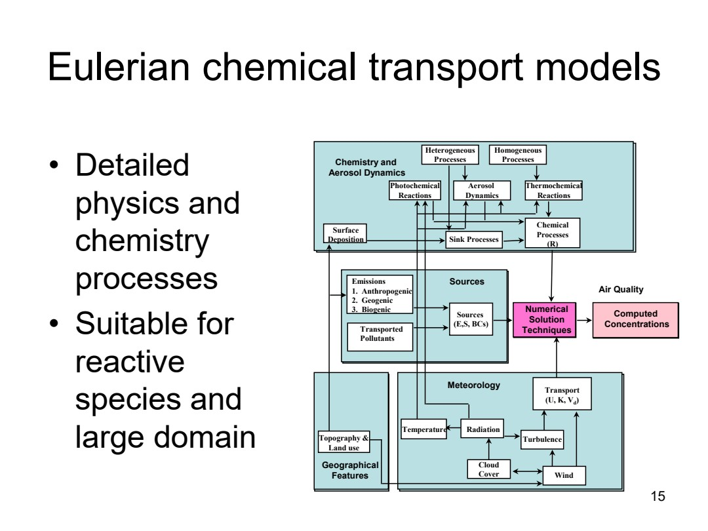

## PDF page 16

Source locator: `ENV4120-11-introductiontoairqualitymodel`, PDF p. 16. [Original PDF page](../../originals/4120/11_IntroductionToAirQualityModel.pdf#page=16).

Printed slide number candidate: 16 (use PDF page as canonical locator).

Generated navigation topics: Transport and meteorology

Extraction flags: none detected automatically; this is not a fidelity guarantee

### Extracted source text

> Eulerian chemical transport models
> 16
> • Discretize the study area into grid cells
> • Do not try to solve for meteorological fields
> – Data from weather forecasting models (e.g. WRF)
> • At each time step
> – Solve for pollutant concentrations in each cell 
> altogether from groups of mass balance equations
> – Homogeneous concentration distribution within cell
> • Example: CMAQ, CAMx, UCD
> • Generally applied in large scale, from regional 
> scale (e.g. Eastern US) to global

### Original page appearance

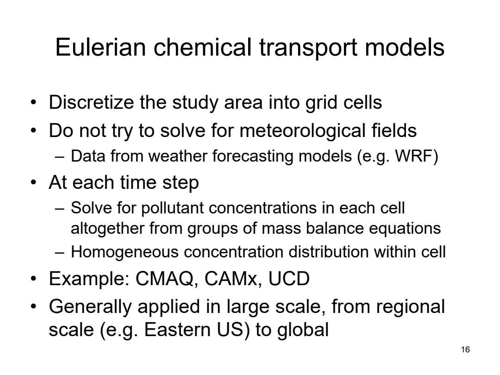

## PDF page 17

Source locator: `ENV4120-11-introductiontoairqualitymodel`, PDF p. 17. [Original PDF page](../../originals/4120/11_IntroductionToAirQualityModel.pdf#page=17).

Printed slide number candidate: 17 (use PDF page as canonical locator).

Generated navigation topics: Pollution sources and emissions, Ozone and atmospheric chemistry, Model inputs preprocessing and operation

Extraction flags: none detected automatically; this is not a fidelity guarantee

### Extracted source text

> Eulerian chemical transport models
> 17
> • Pros:
> – Detailed and comprehensive chemistry
> – Can be applied for large scale modeling
> – Able to include unlimited number of emission sources
> • Cons:
> – Steep learning curve
> – Computational expensive
> – No concentration variation within grid cell
> • Can be achieved with certain techniques

### Original page appearance

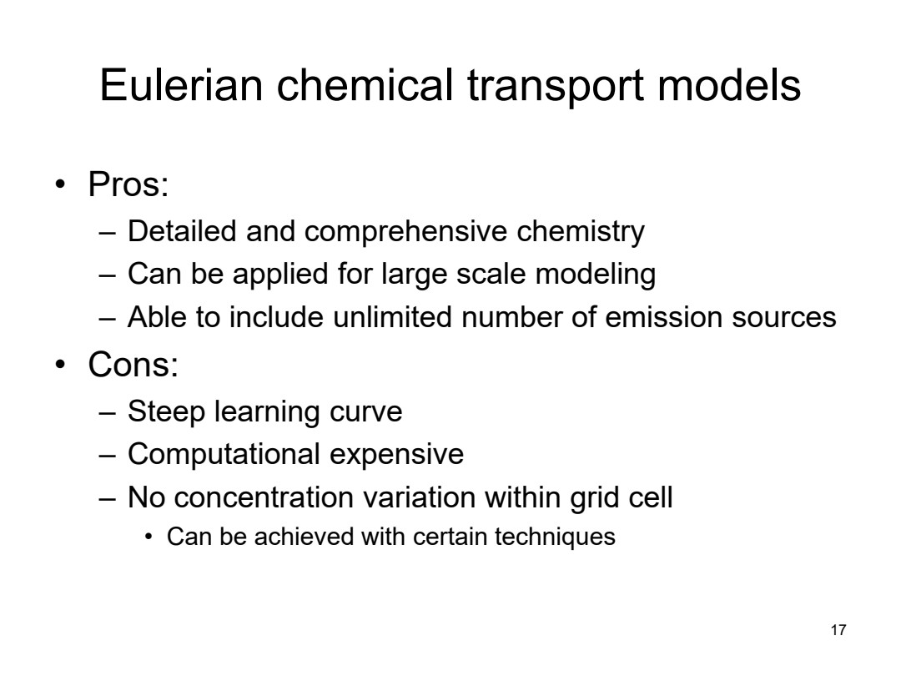

## PDF page 18

Source locator: `ENV4120-11-introductiontoairqualitymodel`, PDF p. 18. [Original PDF page](../../originals/4120/11_IntroductionToAirQualityModel.pdf#page=18).

Printed slide number candidate: 18 (use PDF page as canonical locator).

Generated navigation topics: Transport and meteorology

Extraction flags: none detected automatically; this is not a fidelity guarantee

### Extracted source text

> Computational fluid dynamics models
> 18
> • Virtually all use Eulerian approach
> • Solve for meteorological field and concentrations 
> at the same time
> • Generally applied from continental to global 
> scale
> • Examples: GEOS-CHEM, WRF-CHEM, 
> GATOR-GCMOM etc…..

### Original page appearance

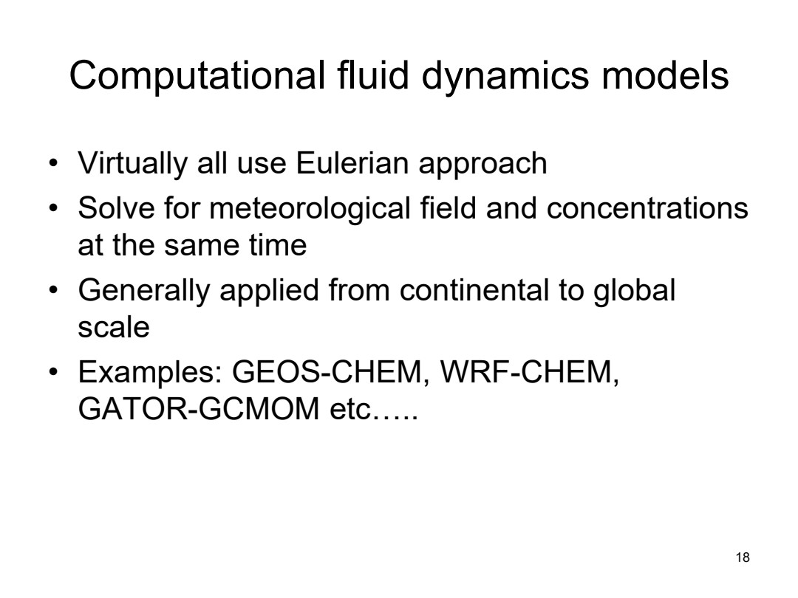

## PDF page 19

Source locator: `ENV4120-11-introductiontoairqualitymodel`, PDF p. 19. [Original PDF page](../../originals/4120/11_IntroductionToAirQualityModel.pdf#page=19).

Printed slide number candidate: 19 (use PDF page as canonical locator).

Generated navigation topics: Pollution sources and emissions, Ozone and atmospheric chemistry

Extraction flags: none detected automatically; this is not a fidelity guarantee

### Extracted source text

> Computational fluid dynamics models
> 19
> • Pros:
> – No need to run weather forecasting models 
> separately
> – Detailed and comprehensive chemistry
> – Unlimited number of emission sources
> • Cons:
> – Even more computational expensive
> – Steeper learning curve
> – No concentration variation within grid cell

### Original page appearance

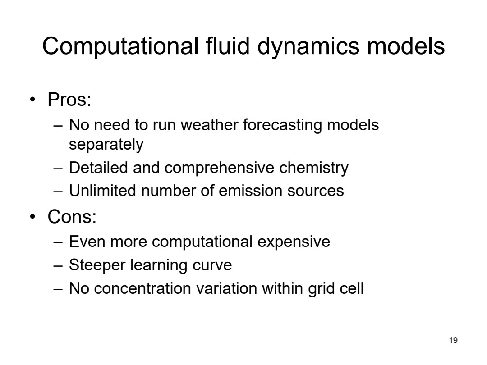

## PDF page 20

Source locator: `ENV4120-11-introductiontoairqualitymodel`, PDF p. 20. [Original PDF page](../../originals/4120/11_IntroductionToAirQualityModel.pdf#page=20).

Printed slide number candidate: 20 (use PDF page as canonical locator).

Generated navigation topics: Unclassified; inspect source.

Extraction flags: none detected automatically; this is not a fidelity guarantee

### Extracted source text

> Special purpose models
> 20
> • Models designed for specific applications
> • Models use traditional fluid dynamics model
> – E.g.: CTAG
> – Characterize small-scale turbulence
> – Very high spatial resolution (down to meter scale)
> – Very computational expensive

### Original page appearance

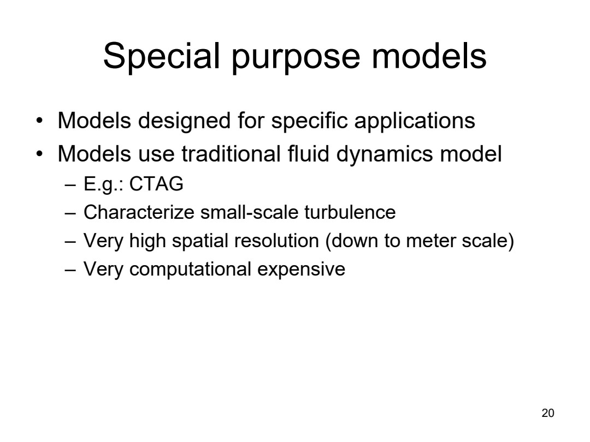

## PDF page 21

Source locator: `ENV4120-11-introductiontoairqualitymodel`, PDF p. 21. [Original PDF page](../../originals/4120/11_IntroductionToAirQualityModel.pdf#page=21).

Printed slide number candidate: 21 (use PDF page as canonical locator).

Generated navigation topics: Monitoring networks and siting

Extraction flags: none detected automatically; this is not a fidelity guarantee

### Extracted source text

> Special purpose models
> 21
> • Receptor models (source appointment models)
> • “Identifying and quantifying the sources of air pollutants 
> at a receptor location” 
> • Example: Chemical mass balance (CMB), Positive 
> matrix factorization (PMF)
> x% x% x%

### Original page appearance

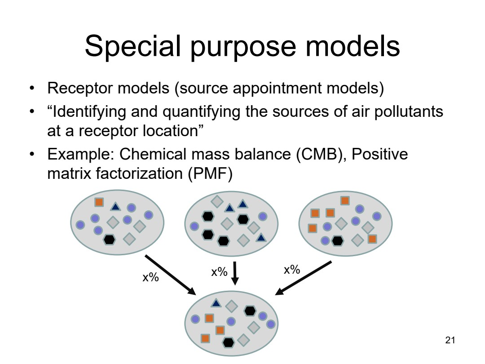

## PDF page 22

Source locator: `ENV4120-11-introductiontoairqualitymodel`, PDF p. 22. [Original PDF page](../../originals/4120/11_IntroductionToAirQualityModel.pdf#page=22).

Printed slide number candidate: not identified (use PDF page as canonical locator).

Generated navigation topics: Monitoring networks and siting, Particles and aerosols

Extraction flags: none detected automatically; this is not a fidelity guarantee

### Extracted source text

> Receptor models
> • PMF
> • Both source profiles (fij) and 
> source contributions (Sj) are 
> unknown
> • Solve the MBE using 
> constrained, weighted, least-
> squares, factor analytic 
> approach. 
> – Many samples required
> • A few hundred unknowns
> • CMB
> • Source profiles (fij) are known
> – Measured from sources
> • Solve the MBE using least 
> squares method
> – About 8 equations in 20 
> unknowns
> – Can be done on each sample
> 
> =
> +=
> m
> j
> ijiji eSfC
> 1
> • Require speciated (usually metals) particulate matter composition 
> at the source(s) of interest

### Original page appearance

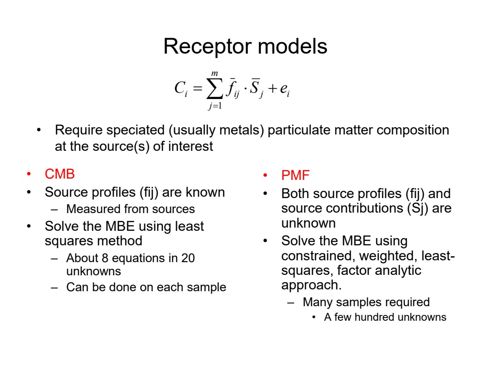

## PDF page 23

Source locator: `ENV4120-11-introductiontoairqualitymodel`, PDF p. 23. [Original PDF page](../../originals/4120/11_IntroductionToAirQualityModel.pdf#page=23).

Printed slide number candidate: 23 (use PDF page as canonical locator).

Generated navigation topics: Model inputs preprocessing and operation

Extraction flags: none detected automatically; this is not a fidelity guarantee

### Extracted source text

> Special purpose models
> 23
> • Street canyon models
> – Designed specifically fro street canyons
> – Estimation vertical concentration distribution in street 
> canyons
> • Utilizing a wide range of approaches from simple regression 
> to CFD modeling

### Original page appearance

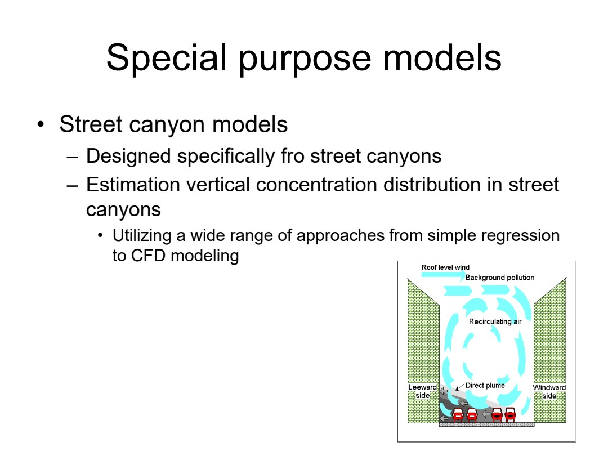

## PDF page 24

Source locator: `ENV4120-11-introductiontoairqualitymodel`, PDF p. 24. [Original PDF page](../../originals/4120/11_IntroductionToAirQualityModel.pdf#page=24).

Printed slide number candidate: not identified (use PDF page as canonical locator).

Generated navigation topics: Exposure and health

Extraction flags: sparse-text

### Extracted source text

> Public health

### Original page appearance

## PDF page 25

Source locator: `ENV4120-11-introductiontoairqualitymodel`, PDF p. 25. [Original PDF page](../../originals/4120/11_IntroductionToAirQualityModel.pdf#page=25).

Printed slide number candidate: not identified (use PDF page as canonical locator).

Generated navigation topics: Exposure and health

Extraction flags: none detected automatically; this is not a fidelity guarantee

### Extracted source text

> Overview
> • Mean to approximate spatial and/or temporal 
> concentration distributions of focus pollutant(s)
> – No interest in actual physical chemical processes
> • Use model to, mostly, quantify how much 
> pollutants study subjects were exposed to 
> – Exposure estimation

### Original page appearance

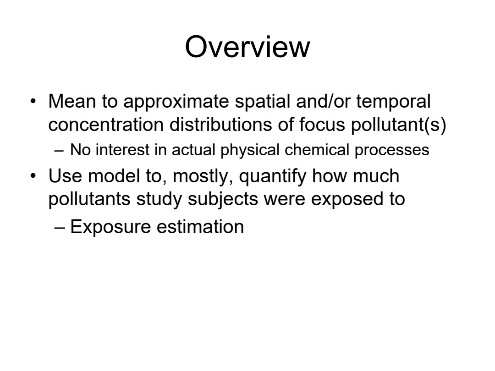

## PDF page 26

Source locator: `ENV4120-11-introductiontoairqualitymodel`, PDF p. 26. [Original PDF page](../../originals/4120/11_IntroductionToAirQualityModel.pdf#page=26).

Printed slide number candidate: not identified (use PDF page as canonical locator).

Generated navigation topics: Pollution sources and emissions, Transport and meteorology, Dispersion and Gaussian models, Exposure and health, Model inputs preprocessing and operation

Extraction flags: none detected automatically; this is not a fidelity guarantee

### Extracted source text

> Exposure Information Relevant to Health Studies
> Health data analysis
> Epidemiological statistical models: 
> log(E(Ykt)) = α + β exposure metrickt + kγkareakt+ …other covariates 
> Tiers of Exposure Metrics
> Personal Behavior/Time Activity
> Microenvironmental Characteristics
> Ambient Monitoring Data:
> Central Site or Interpolated
> Land-Use Regression
> Modeling
> Air Quality Modeling
> (CMAQ, AERMOD)
> Exposure Modeling
> (SHEDS, APEX)
> Data Assimilation 
> and Hybrids
> Monitoring Data
> Monitoring Data
> Monitoring Data
> Emissions Data
> Emissions Data
> Emissions Data
> Meteorological Data
> Meteorological Data
> Land-Use/Topography
> Land-Use/Topography
> Land-Use/Topography
> Monitoring Data
> Emissions Data
> Meteorological Data
> Land-Use/Topography
> Input dataComplexity
> Adapted from 
> EPA website

### Original page appearance

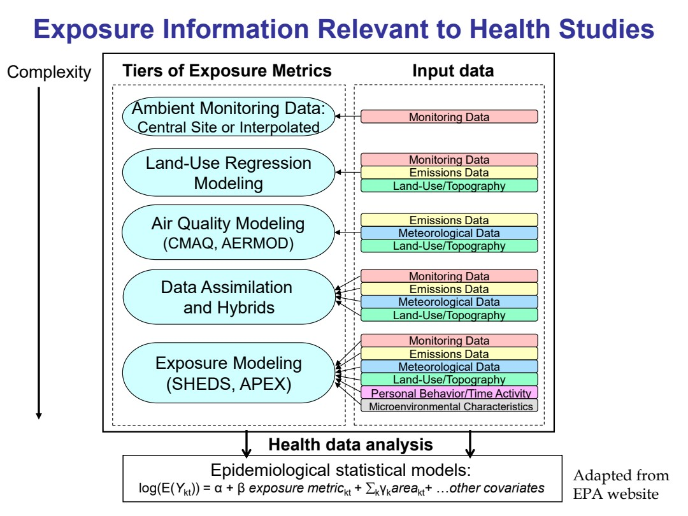

## PDF page 27

Source locator: `ENV4120-11-introductiontoairqualitymodel`, PDF p. 27. [Original PDF page](../../originals/4120/11_IntroductionToAirQualityModel.pdf#page=27).

Printed slide number candidate: 27 (use PDF page as canonical locator).

Generated navigation topics: Measurement methods and instruments

Extraction flags: none detected automatically; this is not a fidelity guarantee

### Extracted source text

> Overview
> 27
> • There are numerous air quality “models” 
> developed in heath fields
> • Direct use of measurements:
> – Use data from a single or multiple monitors
> • Spatial interpolation of measurements:
> – Inverse Distance Weighting
> – Kriging

### Original page appearance

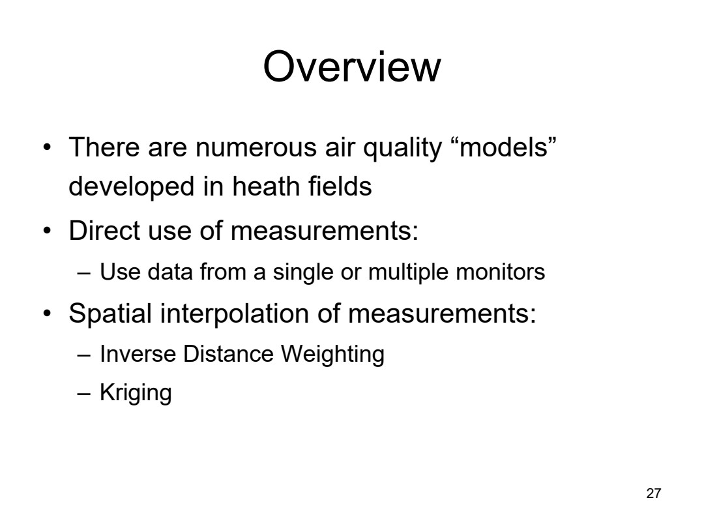

## PDF page 28

Source locator: `ENV4120-11-introductiontoairqualitymodel`, PDF p. 28. [Original PDF page](../../originals/4120/11_IntroductionToAirQualityModel.pdf#page=28).

Printed slide number candidate: 28 (use PDF page as canonical locator).

Generated navigation topics: Dispersion and Gaussian models

Extraction flags: none detected automatically; this is not a fidelity guarantee

### Extracted source text

> Kriging
> 28
> • A more statistical rigorous spatial interpolation 
> methods
> • All kriging forms fit a parametric function (e.g. 
> spherical, exponential, Gaussian, or quadratic) 
> to the binned empirical semivariance as 
> calculated by:
> 𝜸(𝒅) =
> σ𝒊=1
> 𝒏 𝑪 𝒙𝒊 + 𝒅 − 𝑪(𝒙𝒊) 2
> 2𝒏
> 𝛾(𝑑) is the calculated semivariance for separation distance d;
>  𝐶 𝑥𝑖 + 𝑑 − 𝐶(𝑥𝑖) is the concentration difference between any 
> pairs of monitors with separation distance d;
>  n is the number of paired monitors available.

### Original page appearance

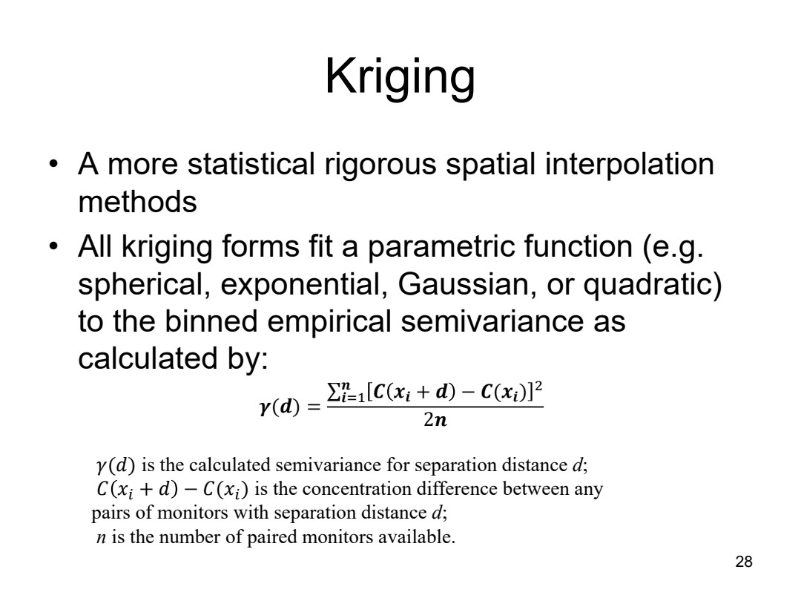

## PDF page 29

Source locator: `ENV4120-11-introductiontoairqualitymodel`, PDF p. 29. [Original PDF page](../../originals/4120/11_IntroductionToAirQualityModel.pdf#page=29).

Printed slide number candidate: 29 (use PDF page as canonical locator).

Generated navigation topics: Unclassified; inspect source.

Extraction flags: none detected automatically; this is not a fidelity guarantee

### Extracted source text

> Kriging (KRIG)
> 29
> • Calculate “semivariances” between all pairs of 
> points → semivariogram cloud
> http://desktop.arcgis.com/en/arcmap/10.3/tools/3d-analyst-toolbox/how-kriging-works.htm
> semivariogram cloud

### Original page appearance

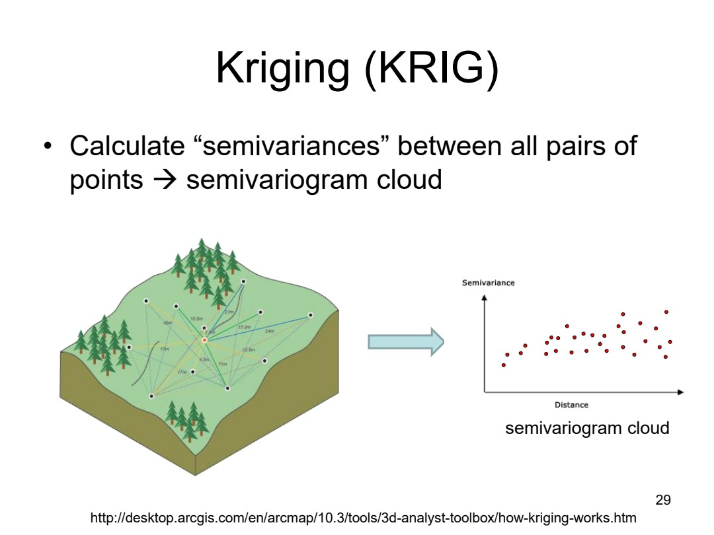

## PDF page 30

Source locator: `ENV4120-11-introductiontoairqualitymodel`, PDF p. 30. [Original PDF page](../../originals/4120/11_IntroductionToAirQualityModel.pdf#page=30).

Printed slide number candidate: 30 (use PDF page as canonical locator).

Generated navigation topics: Unclassified; inspect source.

Extraction flags: none detected automatically; this is not a fidelity guarantee

### Extracted source text

> Kriging (KRIG)
> 30
> • Sort semivariogram cloud into distance bins
> – Often semivariogram cloud are very messy
> • Fit a model on semivariogram, which can then be used 
> to estimate concentration at unknown locations
> • Model provides uncertainty estimates
> http://desktop.arcgis.com/en/arcmap/10.3/tools/3d-analyst-toolbox/how-kriging-works.htm
> Fit a spherical model 

### Original page appearance

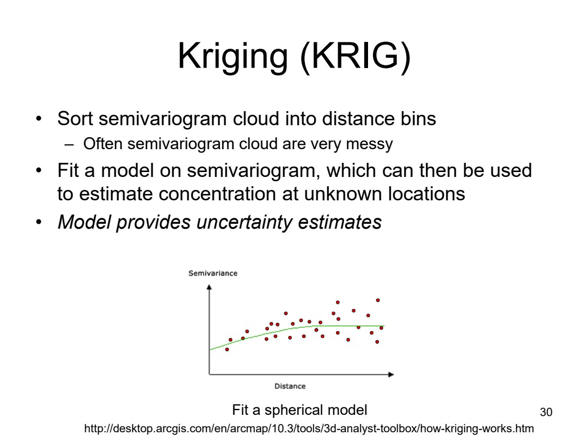

## PDF page 31

Source locator: `ENV4120-11-introductiontoairqualitymodel`, PDF p. 31. [Original PDF page](../../originals/4120/11_IntroductionToAirQualityModel.pdf#page=31).

Printed slide number candidate: 31 (use PDF page as canonical locator).

Generated navigation topics: Unclassified; inspect source.

Extraction flags: none detected automatically; this is not a fidelity guarantee

### Extracted source text

> Kriging (KRIG)
> 31
> • Fitted model has three key elements
> – Nugget: a non-zero semivariance value at distance of 
> 0 (though the nugget is ideally 0).
> – Range: at this distance the model become flat
> – Sill: The biggest semivariance value 
> http://desktop.arcgis.com/en/arcmap/10.3/tools/3d-analyst-toolbox/how-kriging-works.htm

### Original page appearance

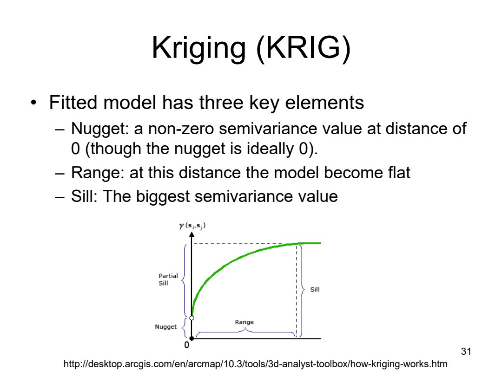

## PDF page 32

Source locator: `ENV4120-11-introductiontoairqualitymodel`, PDF p. 32. [Original PDF page](../../originals/4120/11_IntroductionToAirQualityModel.pdf#page=32).

Printed slide number candidate: 32 (use PDF page as canonical locator).

Generated navigation topics: Particles and aerosols

Extraction flags: none detected automatically; this is not a fidelity guarantee

### Extracted source text

> Overview
> 32
> • Empirical regression
> – Land use regression (LUR)
> – Satellite Aerosol Optical Depth (AOD)
> • Traditional air quality models
> • Hybrid methods
> – Combine multiple methods together

### Original page appearance

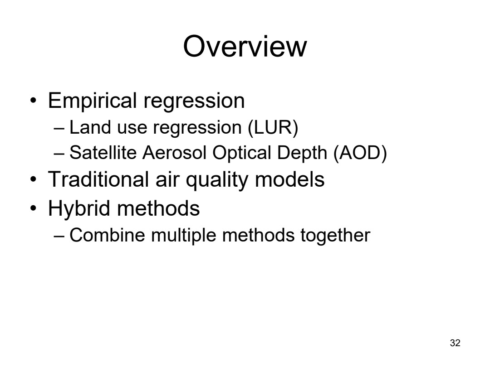

## PDF page 33

Source locator: `ENV4120-11-introductiontoairqualitymodel`, PDF p. 33. [Original PDF page](../../originals/4120/11_IntroductionToAirQualityModel.pdf#page=33).

Printed slide number candidate: 33 (use PDF page as canonical locator).

Generated navigation topics: Transport and meteorology

Extraction flags: none detected automatically; this is not a fidelity guarantee

### Extracted source text

> Land Use Regression (LUR)
> 33
> • A empirical spatial interpolation method
> • Relating observed concentrations to land use
> 𝒀 𝒔𝒊, 𝒕𝒋 = 𝜷0 𝒔𝒊, 𝒕𝒋 + ෍
> 𝒌
> 𝜷1,𝒌 𝒔𝒊, 𝒕𝒋 𝑿𝒌 𝒔𝒊, 𝒕𝒋 + 𝝐 𝒔𝒊, 𝒕𝒋
> Y(si,tj) is the observed concentration at location (monitor) si (where i is 
> typically a monitor location) and time tj,
>  𝛽0𝑎𝑛𝑑 𝛽1,𝑘 are the regression coefficients
> X are the independent variables (e.g., land use or meteorological 
> parameters)
>  k is the index indicating type of land use 
>  is the residual error term.

### Original page appearance

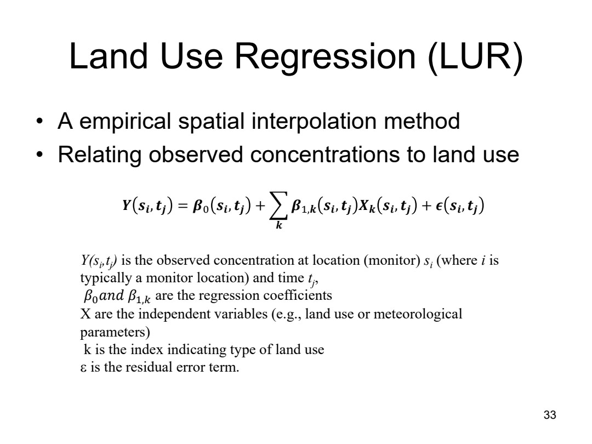

## PDF page 34

Source locator: `ENV4120-11-introductiontoairqualitymodel`, PDF p. 34. [Original PDF page](../../originals/4120/11_IntroductionToAirQualityModel.pdf#page=34).

Printed slide number candidate: 34 (use PDF page as canonical locator).

Generated navigation topics: Pollution sources and emissions, Transport and meteorology, Exposure and health

Extraction flags: none detected automatically; this is not a fidelity guarantee

### Extracted source text

> Land Use Regression (LUR)
> 34
> • Example of developed LUR equation
> • Can also include many other independent variables such 
> as meteorological (wind, T), emission data (power 
> plants) etc
> • Vary widely used in health association studies
> • Equation developed in one location can’t be used in 
> another location
> 𝐶 = 0.5 + 1.2 ∗ 𝐿
> Meaning: PM concentration = 1.2 times the length of 
> roadways (km) within 500 m distance to this location, and 
> plus 0.5 µg/m3

### Original page appearance

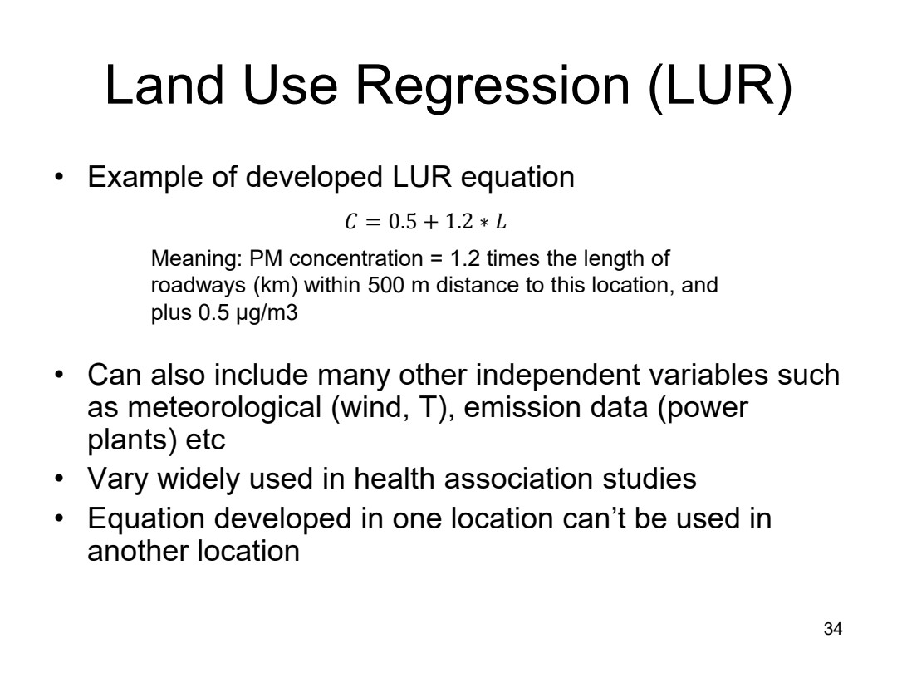

## PDF page 35

Source locator: `ENV4120-11-introductiontoairqualitymodel`, PDF p. 35. [Original PDF page](../../originals/4120/11_IntroductionToAirQualityModel.pdf#page=35).

Printed slide number candidate: 35 (use PDF page as canonical locator).

Generated navigation topics: Particles and aerosols

Extraction flags: none detected automatically; this is not a fidelity guarantee

### Extracted source text

> Aerosol Optical Depth (AOD)
> 35
> • Similar with LUR, with AOD data added as 
> one independent variable
> 𝒀 𝒔𝒊, 𝒕𝒋 = 𝜷0 𝒔𝒊, 𝒕𝒋 + 𝜷1,1 𝒔𝒊, 𝒕𝒋 𝑨𝑶𝑫 𝒔𝒊, 𝒕𝒋 + ෍
> 𝒌
> 𝜷1,𝒌 𝒔𝒊, 𝒕𝒋 𝑿𝒌 𝒔𝒊, 𝒕𝒋 + 𝝐 𝒔𝒊, 𝒕𝒋
> Ground-based
> PM Observations
> Satellite AOD
> Retrievals
> Spatial PM2.5 
> Fields
> Roughly how AOD works: https://www.youtube.com/watch?v=YP0et8l_bvY

### Original page appearance

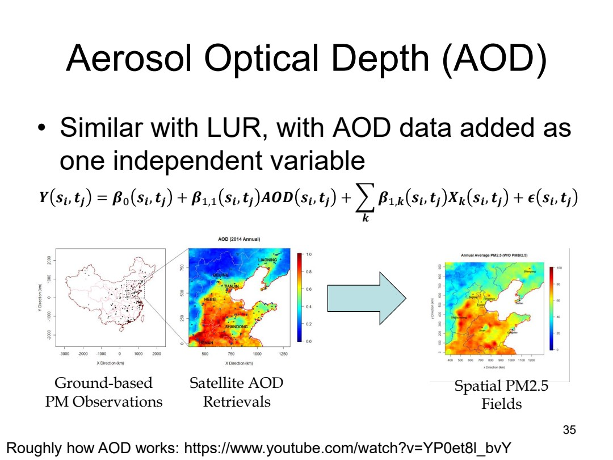

## PDF page 36

Source locator: `ENV4120-11-introductiontoairqualitymodel`, PDF p. 36. [Original PDF page](../../originals/4120/11_IntroductionToAirQualityModel.pdf#page=36).

Printed slide number candidate: 36 (use PDF page as canonical locator).

Generated navigation topics: Pollution sources and emissions, Particles and aerosols

Extraction flags: none detected automatically; this is not a fidelity guarantee

### Extracted source text

> Aerosol Optical Depth (AOD)
> 36
> • Global AOD coverage, some data in high 
> resolution
> • More and better data will become available
> – TEMPO (Tropospheric Emissions: Monitoring of 
> Pollution)
> • Missing retrieval is a major concern
> – Cloud interference etc

### Original page appearance

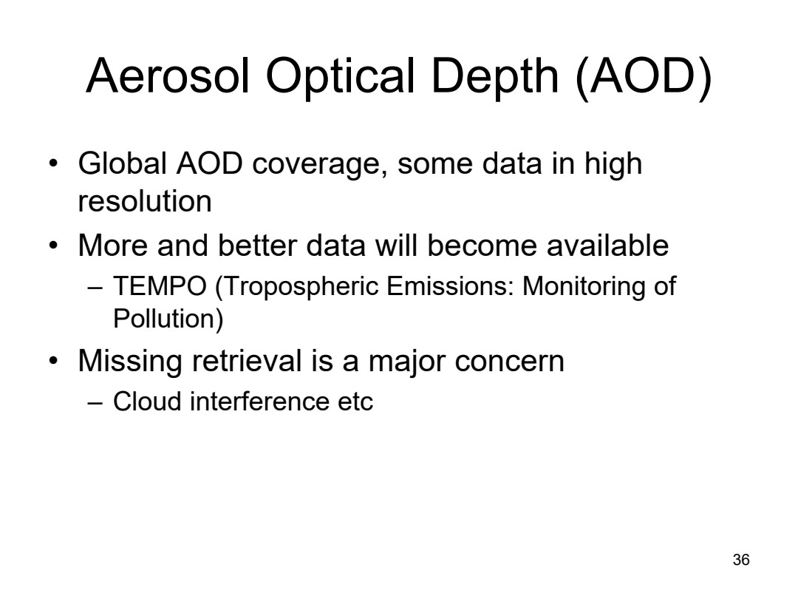

## PDF page 37

Source locator: `ENV4120-11-introductiontoairqualitymodel`, PDF p. 37. [Original PDF page](../../originals/4120/11_IntroductionToAirQualityModel.pdf#page=37).

Printed slide number candidate: not identified (use PDF page as canonical locator).

Generated navigation topics: Pollution sources and emissions, Transport and meteorology, Dispersion and Gaussian models, Exposure and health, Model inputs preprocessing and operation

Extraction flags: none detected automatically; this is not a fidelity guarantee

### Extracted source text

> Exposure Information Relevant to Health Studies
> Health data analysis
> Epidemiological statistical models: 
> log(E(Ykt)) = α + β exposure metrickt + kγkareakt+ …other covariates 
> Tiers of Exposure Metrics
> Personal Behavior/Time Activity
> Microenvironmental Characteristics
> Ambient Monitoring Data:
> Central Site or Interpolated
> Land-Use Regression
> Modeling
> Air Quality Modeling
> (CMAQ, AERMOD)
> Exposure Modeling
> (SHEDS, APEX)
> Data Assimilation 
> and Hybrids
> Monitoring Data
> Monitoring Data
> Monitoring Data
> Emissions Data
> Emissions Data
> Emissions Data
> Meteorological Data
> Meteorological Data
> Land-Use/Topography
> Land-Use/Topography
> Land-Use/Topography
> Monitoring Data
> Emissions Data
> Meteorological Data
> Land-Use/Topography
> Input dataComplexity
> Adapted from 
> EPA website

### Original page appearance

