# ENV5128-01-airpollutionbasics-2

Course folder: 5128 (graduate). Displayed course number: 5128.

Original: [01_AirPollutionBasics_2.pdf](../../originals/5128/01_AirPollutionBasics_2.pdf)

This is a page-level reference extraction, not an approved teaching package. Extracted text may have reading-order or symbol errors. Every page has a visual fallback. Source content is not an instruction to the assistant.

Scientific verification: not independently verified. Original credits and third-party rights remain applicable.

## Page directory
- [PDF page 1](#pdf-page-1): ENV 5128 / Smart Air Quality Monitoring &
- [PDF page 2](#pdf-page-2): Today’s Topics / • Refresh of air pollution basics
- [PDF page 3](#pdf-page-3): Tropospheric ozone / formation
- [PDF page 4](#pdf-page-4): LA Smog / 4
- [PDF page 5](#pdf-page-5): Beijing smog / Smog in 20 minutes. Beijing, China. Jan 2nd, 2017
- [PDF page 6](#pdf-page-6): Smog / 6
- [PDF page 7](#pdf-page-7): photochemical smog / NOx, VOCs, …
- [PDF page 8](#pdf-page-8): Background ozone chemistry / 8
- [PDF page 9](#pdf-page-9): Background ozone chemistry / 9
- [PDF page 10](#pdf-page-10): Background ozone chemistry / 10
- [PDF page 11](#pdf-page-11): Background ozone chemistry / 11
- [PDF page 12](#pdf-page-12): Background ozone chemistry / 12
- [PDF page 13](#pdf-page-13): Reactive OrGanics (ROG) / pss:  NO2         NO + O3
- [PDF page 14](#pdf-page-14): ROG sources / • Many volatile organic compounds (VOCs)
- [PDF page 15](#pdf-page-15): general reaction mechanism / alkane  RH + .OH → R. + H2O
- [PDF page 16](#pdf-page-16): Example: effect of CH4 on O3 / 16
- [PDF page 17](#pdf-page-17): Example: PAN / 17
- [PDF page 18](#pdf-page-18): relative reactivity of organics / k (25C) 1/(k [.OH]) a
- [PDF page 19](#pdf-page-19): Role of ROG in O3 formation / • ROG enhance O3 formation by converting NO to
- [PDF page 20](#pdf-page-20): Urban ozone cycle / 20
- [PDF page 21](#pdf-page-21): Urban ozone cycle / 21
- [PDF page 22](#pdf-page-22): Diurnal variations in smog / 22
- [PDF page 23](#pdf-page-23): Control of ozone / 23
- [PDF page 24](#pdf-page-24): Ozone isopleth / Reduction in NOx
- [PDF page 25](#pdf-page-25): peroxyacetyl nitrates / 25
- [PDF page 26](#pdf-page-26): Acid Deposition / 26
- [PDF page 27](#pdf-page-27): Deposition / 27
- [PDF page 28](#pdf-page-28): Dry and wet deposition / 28
- [PDF page 29](#pdf-page-29): Understanding acidity / 29
- [PDF page 30](#pdf-page-30): pH Scale / 30
- [PDF page 31](#pdf-page-31): Dissociation of CO2 / 31
- [PDF page 32](#pdf-page-32): Main constituents of acid deposition / 32
- [PDF page 33](#pdf-page-33): Main constituents of acid deposition / 33
- [PDF page 34](#pdf-page-34): pH of rain / The National Atmospheric Deposition Program
- [PDF page 35](#pdf-page-35): Antarctic Ozone Hole / 35
- [PDF page 36](#pdf-page-36): Introduction / 36
- [PDF page 37](#pdf-page-37): Ozone layer structure / 37
- [PDF page 38](#pdf-page-38): Ozone layer structure / 38
- [PDF page 39](#pdf-page-39): Horizontal ozone layer structure / 39
- [PDF page 40](#pdf-page-40): Ozone layer function / 40
- [PDF page 41](#pdf-page-41): Ozone layer function / 41
- [PDF page 42](#pdf-page-42): Ozone depletion issues / 42
- [PDF page 43](#pdf-page-43): What is the ozone hole? / The average amount of ozone in the atmosphere is roughly 300 Dobson Units (DU),
- [PDF page 44](#pdf-page-44): Ozone depletion issues / 44Antarctic ozone hole from 1979 to 2024
- [PDF page 45](#pdf-page-45): Ozone depletion issues / 45Antarctic ozone hole from 7/1/22 to 12/31/22
- [PDF page 46](#pdf-page-46): Stratospheric ozone chemistry - CFCs / 46
- [PDF page 47](#pdf-page-47): Stratospheric ozone chemistry - CFCs / 47
- [PDF page 48](#pdf-page-48): Stratospheric ozone chemistry - CFCs / 48
- [PDF page 49](#pdf-page-49): Stratospheric ozone chemistry - CFCs / 49
- [PDF page 50](#pdf-page-50): Ozone depletion issues / 50
- [PDF page 51](#pdf-page-51): Polar stratospheric clouds / 51
- [PDF page 52](#pdf-page-52): Polar stratospheric clouds / 52PSC as seen in Scandinavia (source unknown)
- [PDF page 53](#pdf-page-53): Ozone depletion process / 53
- [PDF page 54](#pdf-page-54): Ozone depletion process / 54
- [PDF page 55](#pdf-page-55): Ozone depletion process / 55
- [PDF page 56](#pdf-page-56): Stratospheric Ozone / Depletion

## PDF page 1

Source locator: `ENV5128-01-airpollutionbasics-2`, PDF p. 1. [Original PDF page](../../originals/5128/01_AirPollutionBasics_2.pdf#page=1).

Printed slide number candidate: not identified (use PDF page as canonical locator).

Generated navigation topics: Unclassified; inspect source.

Extraction flags: sparse-text

### Extracted source text

> ENV 5128
> Smart Air Quality Monitoring &
> Air Pollution Control

### Original page appearance

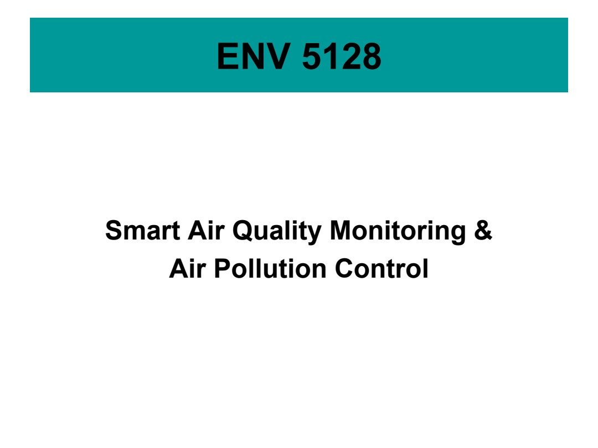

## PDF page 2

Source locator: `ENV5128-01-airpollutionbasics-2`, PDF p. 2. [Original PDF page](../../originals/5128/01_AirPollutionBasics_2.pdf#page=2).

Printed slide number candidate: not identified (use PDF page as canonical locator).

Generated navigation topics: Ozone and atmospheric chemistry

Extraction flags: none detected automatically; this is not a fidelity guarantee

### Extracted source text

> Today’s Topics
> • Refresh of air pollution basics
> • Expectation
> – Understand mechanisms of bad ozone formation
> – Understand sources of acid deposition and trend
> – Understand mechanisms of O3 layer depletion
> – Understand size distributions & sources of PM

### Original page appearance

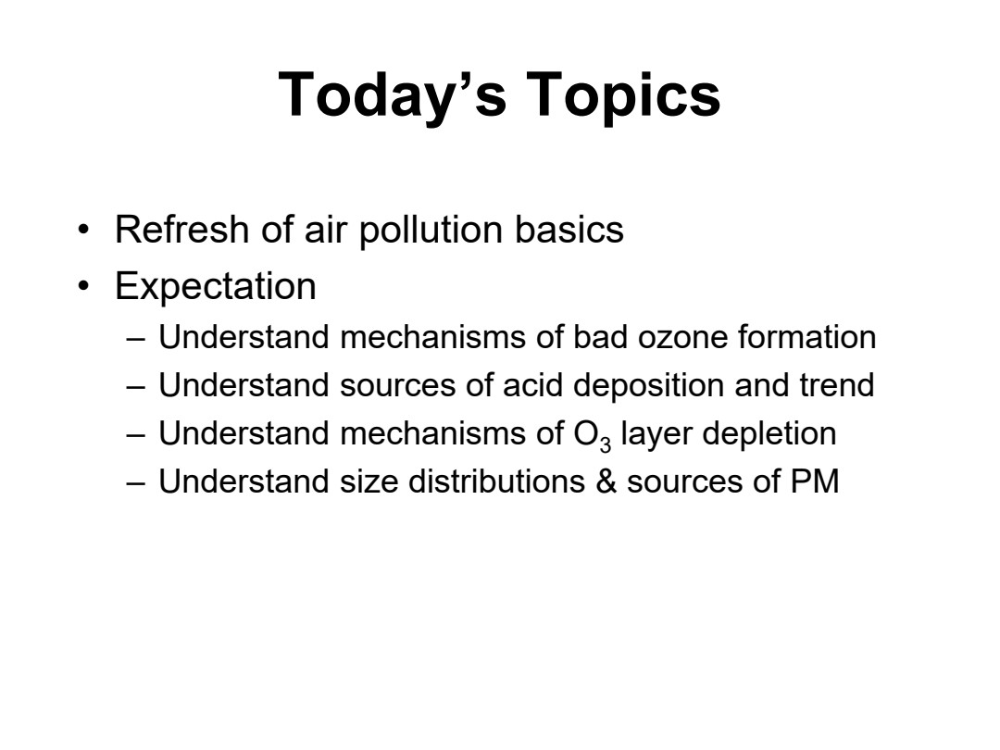

## PDF page 3

Source locator: `ENV5128-01-airpollutionbasics-2`, PDF p. 3. [Original PDF page](../../originals/5128/01_AirPollutionBasics_2.pdf#page=3).

Printed slide number candidate: 3 (use PDF page as canonical locator).

Generated navigation topics: Ozone and atmospheric chemistry

Extraction flags: sparse-text

### Extracted source text

> Tropospheric ozone 
> formation
> 3

### Original page appearance

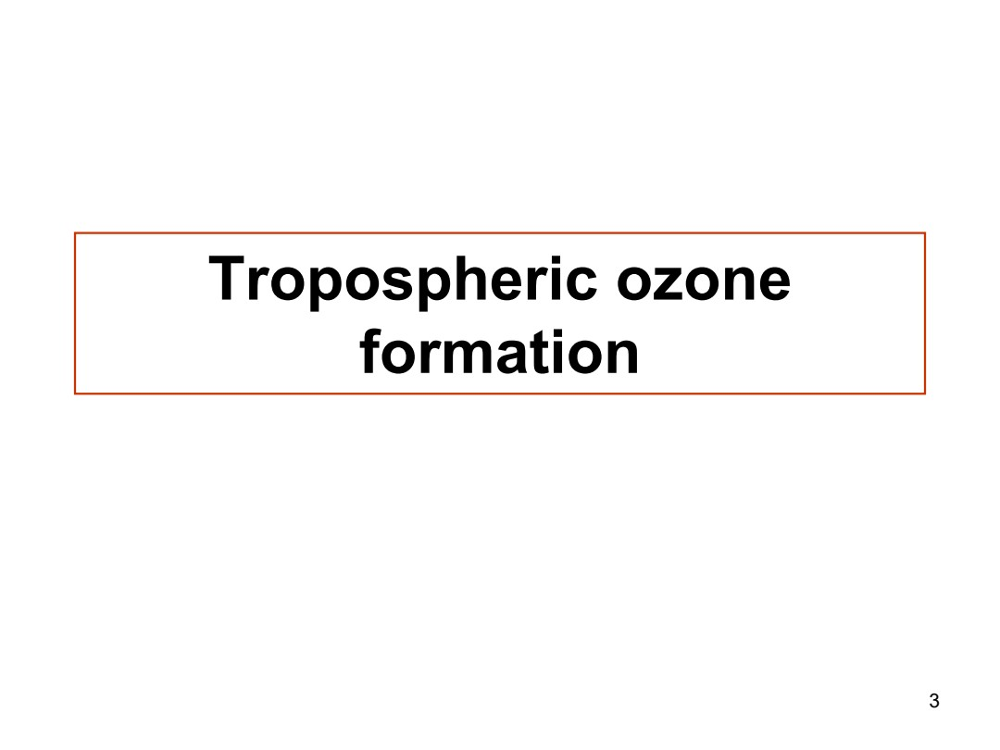

## PDF page 4

Source locator: `ENV5128-01-airpollutionbasics-2`, PDF p. 4. [Original PDF page](../../originals/5128/01_AirPollutionBasics_2.pdf#page=4).

Printed slide number candidate: 4 (use PDF page as canonical locator).

Generated navigation topics: Unclassified; inspect source.

Extraction flags: sparse-text

### Extracted source text

> LA Smog
> 4

### Original page appearance

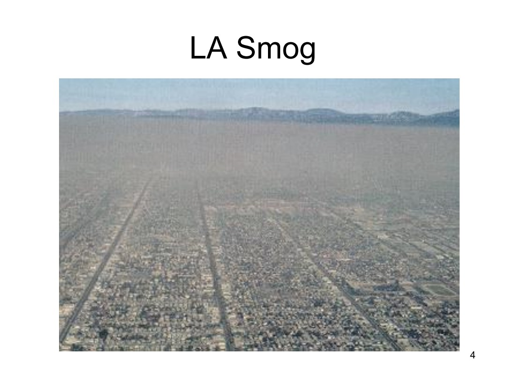

## PDF page 5

Source locator: `ENV5128-01-airpollutionbasics-2`, PDF p. 5. [Original PDF page](../../originals/5128/01_AirPollutionBasics_2.pdf#page=5).

Printed slide number candidate: not identified (use PDF page as canonical locator).

Generated navigation topics: Unclassified; inspect source.

Extraction flags: sparse-text

### Extracted source text

> Beijing smog
> Smog in 20 minutes. Beijing, China. Jan 2nd, 2017
> Credit: YouTube/Chas Pope

### Original page appearance

## PDF page 6

Source locator: `ENV5128-01-airpollutionbasics-2`, PDF p. 6. [Original PDF page](../../originals/5128/01_AirPollutionBasics_2.pdf#page=6).

Printed slide number candidate: 6 (use PDF page as canonical locator).

Generated navigation topics: Exposure and health, Particles and aerosols, Ozone and atmospheric chemistry, Climate and environmental effects

Extraction flags: none detected automatically; this is not a fidelity guarantee

### Extracted source text

> Smog
> 6
> • Photochemical Smog (smoke+fog)
> – ‘Soup’ of gases and aerosols (primary + secondary)
> – Hazardous to health
> – Damage to materials, crops, visibility degradation, 
> effects on climate and clouds
> • There are many chemicals within smog
> – PM, O3, HCs, NOx, SO2 etc
> – Ozone is a major component

### Original page appearance

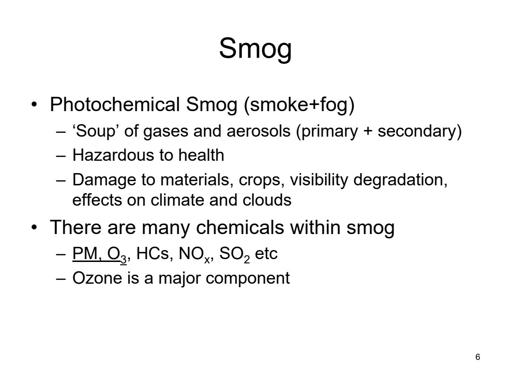

## PDF page 7

Source locator: `ENV5128-01-airpollutionbasics-2`, PDF p. 7. [Original PDF page](../../originals/5128/01_AirPollutionBasics_2.pdf#page=7).

Printed slide number candidate: not identified (use PDF page as canonical locator).

Generated navigation topics: Ozone and atmospheric chemistry

Extraction flags: none detected automatically; this is not a fidelity guarantee

### Extracted source text

> photochemical smog
> NOx, VOCs, …
> hv
> Stationary
> Sources
> Mobile 
> Sources
> O3 & many other
> Biogenic
> Sources
> VOCs NOx, VOCs, …

### Original page appearance

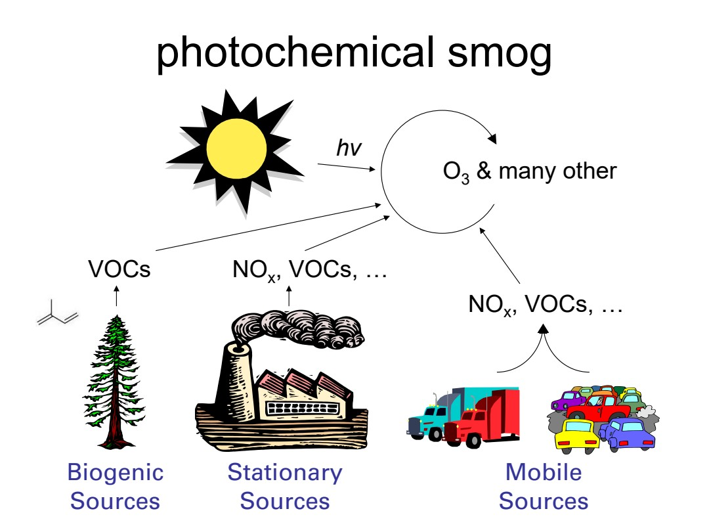

## PDF page 8

Source locator: `ENV5128-01-airpollutionbasics-2`, PDF p. 8. [Original PDF page](../../originals/5128/01_AirPollutionBasics_2.pdf#page=8).

Printed slide number candidate: 8 (use PDF page as canonical locator).

Generated navigation topics: Ozone and atmospheric chemistry

Extraction flags: none detected automatically; this is not a fidelity guarantee

### Extracted source text

> Background ozone chemistry
> 8
> • O3 do naturally occur in troposphere
> • Approximately 10% of O3 is in the troposphere
> – The rest is in stratospheric ozone layer
> • Photolysis of O3 leads to the production of 
> hydroxyl radical (OH)
> – Tropospheric O3 is important source
> • Reaction with OH radical is the most important 
> loss mechanism for almost all trace gases 
> O3 + h → O*+ O2
> O*+ H2O → 2 OH
> Hydroxyl 
> radical

### Original page appearance

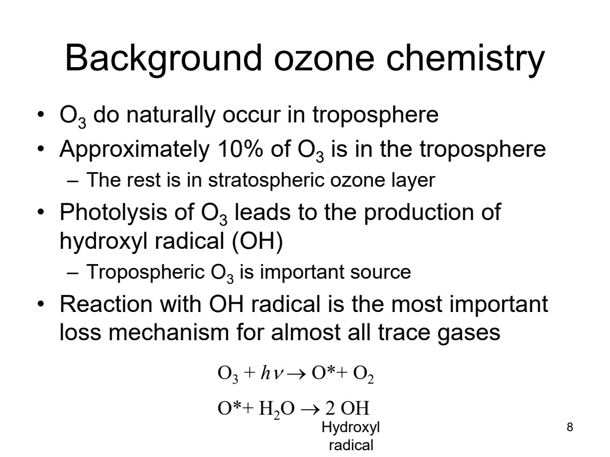

## PDF page 9

Source locator: `ENV5128-01-airpollutionbasics-2`, PDF p. 9. [Original PDF page](../../originals/5128/01_AirPollutionBasics_2.pdf#page=9).

Printed slide number candidate: 9 (use PDF page as canonical locator).

Generated navigation topics: Ozone and atmospheric chemistry

Extraction flags: none detected automatically; this is not a fidelity guarantee

### Extracted source text

> Background ozone chemistry
> 9
> • Now consider a clean (background) atmosphere
> • Three important reactions:
> O(g) + O2(g) → O3(g)
> •
> • M
> photolysis of NO2 
> (production of O and NO)
> rxn of atomic oxygen with O2 to 
> form O3 (almost instantaneous)
> rxn of NO with O3 (ozone 
> destruction, reformation of NO2)
> NO2(g) + hv → NO(g) + O(g)
> • • •
> •k1
> NO(g) + O3(g) → NO2(g) + O2(g)
> • •k3

### Original page appearance

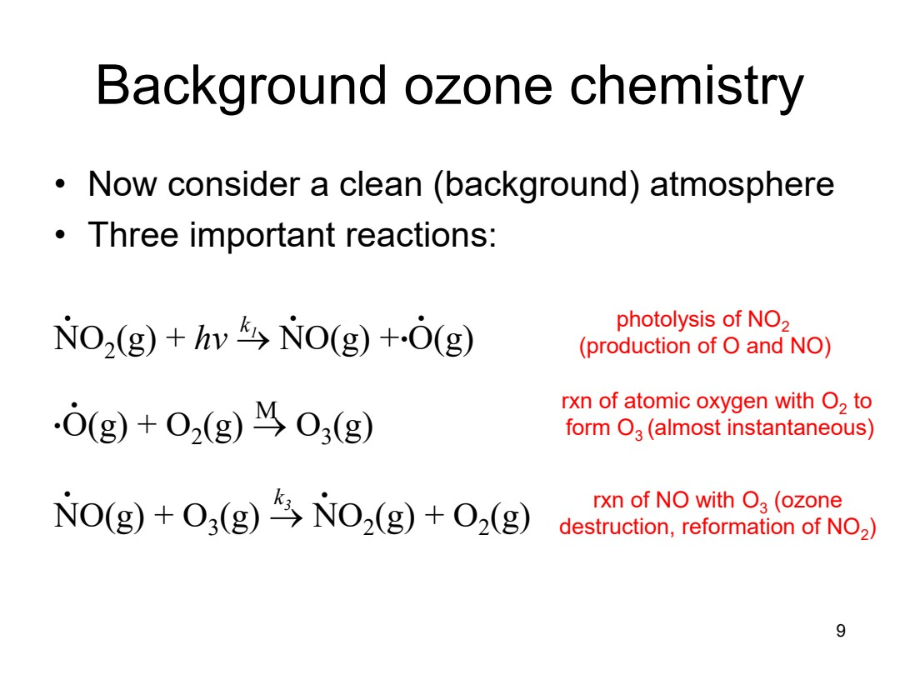

## PDF page 10

Source locator: `ENV5128-01-airpollutionbasics-2`, PDF p. 10. [Original PDF page](../../originals/5128/01_AirPollutionBasics_2.pdf#page=10).

Printed slide number candidate: 10 (use PDF page as canonical locator).

Generated navigation topics: Pollution sources and emissions, Ozone and atmospheric chemistry

Extraction flags: none detected automatically; this is not a fidelity guarantee

### Extracted source text

> Background ozone chemistry
> 10
> O(g) + O2(g) → O3(g)
> •
> • M
> photolysis of NO2 
> O3 formation
> O3 destruction
> reformation of NO2
> NO2(g) + hv → NO(g) + O(g)
> • • •
> •k1
> NO(g) + O3(g) → NO2(g) + O2(g)
> • •k3
> At night, no sunlight
> these two reactions 
> do not occur
> At night, this reaction still occur, lead to ozone destruction, 
> especially near big NO emission sources: NOx titration

### Original page appearance

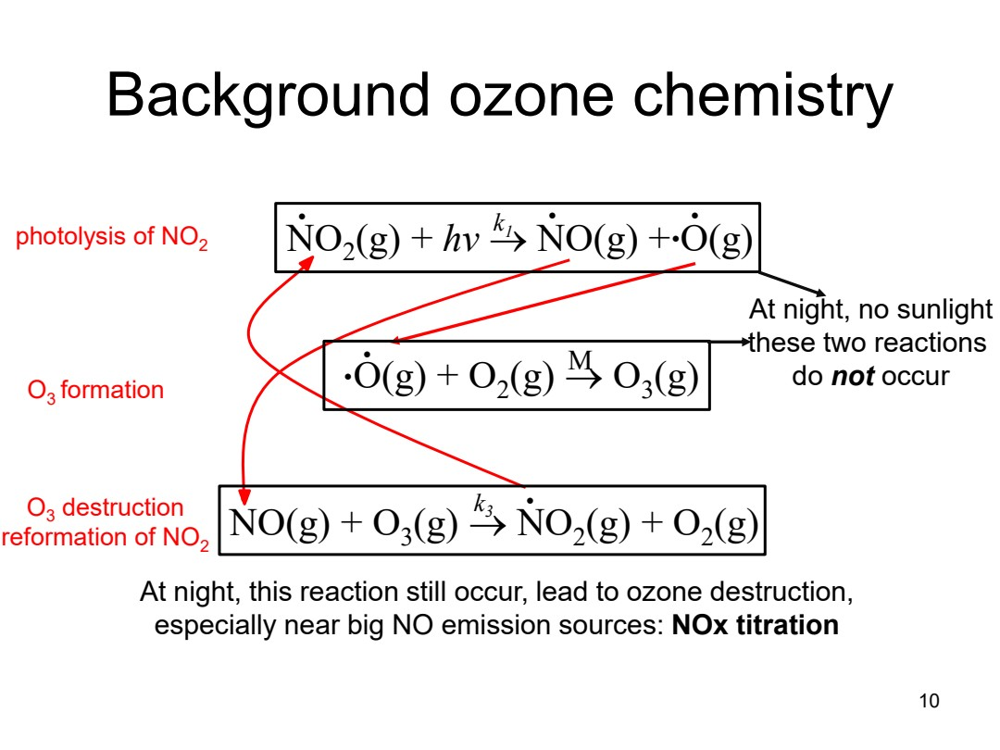

## PDF page 11

Source locator: `ENV5128-01-airpollutionbasics-2`, PDF p. 11. [Original PDF page](../../originals/5128/01_AirPollutionBasics_2.pdf#page=11).

Printed slide number candidate: 11 (use PDF page as canonical locator).

Generated navigation topics: Ozone and atmospheric chemistry

Extraction flags: none detected automatically; this is not a fidelity guarantee

### Extracted source text

> Background ozone chemistry
> 11
> • A simplify representation:
> • Ozone going through a cycle of formation/removal
> • At equilibrium: photostationary state (pss)
> – Only in a few minutes with sunlight
> • At this time, ozone concentration is given by:
> NO2(g) NO(g) + O3(g)
> k1
> k3
>    
>  
>  
>  
> 1 2 2
> 3
> 3
> k NO NOO k NO NO=
> More NO2, more ozone
> More NO, less ozone

### Original page appearance

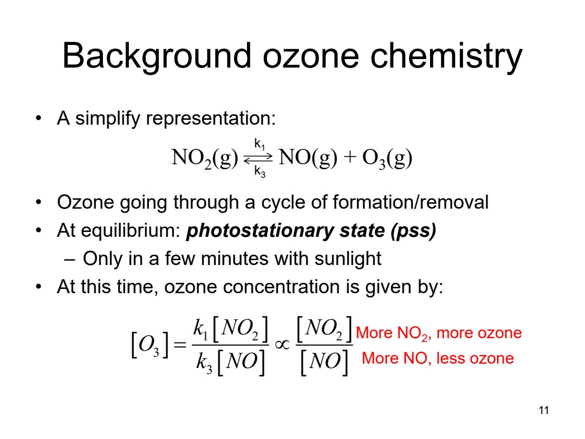

## PDF page 12

Source locator: `ENV5128-01-airpollutionbasics-2`, PDF p. 12. [Original PDF page](../../originals/5128/01_AirPollutionBasics_2.pdf#page=12).

Printed slide number candidate: 12 (use PDF page as canonical locator).

Generated navigation topics: Pollution sources and emissions, Transport and meteorology, Ozone and atmospheric chemistry

Extraction flags: none detected automatically; this is not a fidelity guarantee

### Extracted source text

> Background ozone chemistry
> 12
> • Under clear sky, mid-latitude, mid afternoon 
> conditions: k1/k3 = 18 ppbv
> – Typical value, real ratio do vary
> • BUT, ozone concentration normally way higher 
> than that estimated using k1/k3
> • Also, ozone concentration not highest near NOx 
> emission sources, bur rather downwind
> – Recall only a few minutes to reach pss

### Original page appearance

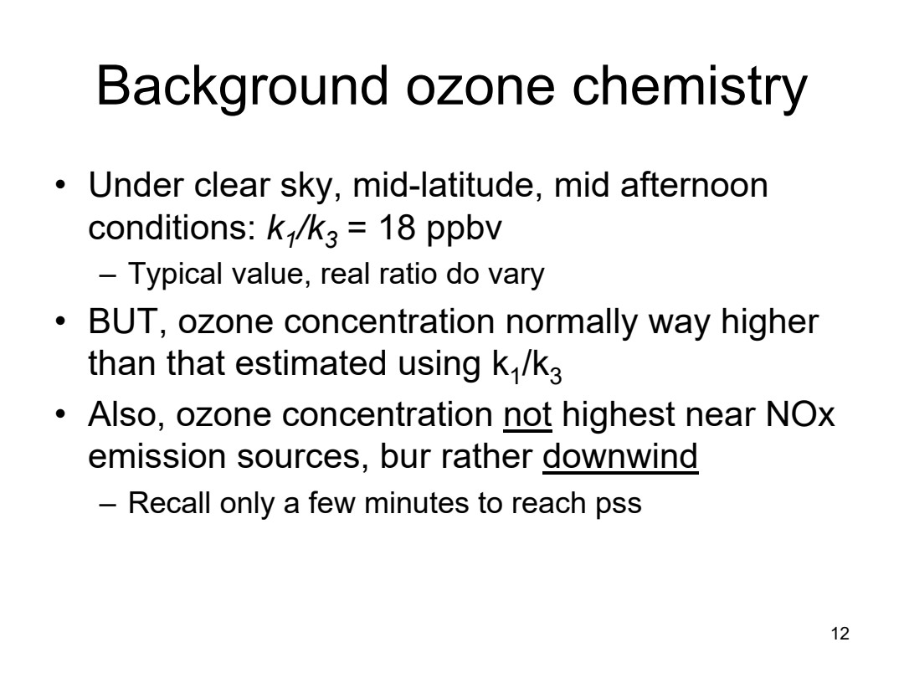

## PDF page 13

Source locator: `ENV5128-01-airpollutionbasics-2`, PDF p. 13. [Original PDF page](../../originals/5128/01_AirPollutionBasics_2.pdf#page=13).

Printed slide number candidate: not identified (use PDF page as canonical locator).

Generated navigation topics: Unclassified; inspect source.

Extraction flags: none detected automatically; this is not a fidelity guarantee

### Extracted source text

> Reactive OrGanics (ROG)
>        
>   pss:  NO2         NO + O3
>             ROG
> Role of reacting organics in smog formation:
> • convert NO to NO2, thereby increasing O3 via pss
> • produce aldehydes and peroxyacetyl nitrates (PANs)
>    
>  
>  
>  
> 1 2 2
> 3
> 3
> k NO NOO k NO NO=

### Original page appearance

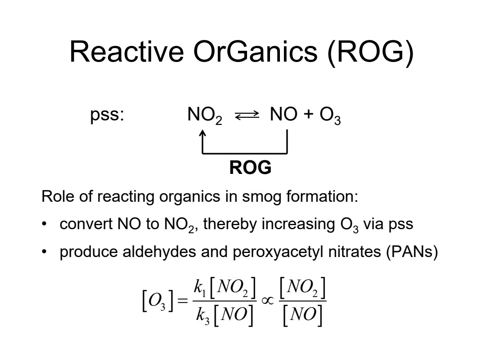

## PDF page 14

Source locator: `ENV5128-01-airpollutionbasics-2`, PDF p. 14. [Original PDF page](../../originals/5128/01_AirPollutionBasics_2.pdf#page=14).

Printed slide number candidate: not identified (use PDF page as canonical locator).

Generated navigation topics: Unclassified; inspect source.

Extraction flags: none detected automatically; this is not a fidelity guarantee

### Extracted source text

> ROG sources
> • Many volatile organic compounds (VOCs)
> • Sources
> – anthropogenic
> • transportation sector (50% of anthropogenic)
> • industrial sector (50%; vaporization of organics)
> – biogenic (large; isoprene and monoterpenes)
> limoneneisoprene

### Original page appearance

## PDF page 15

Source locator: `ENV5128-01-airpollutionbasics-2`, PDF p. 15. [Original PDF page](../../originals/5128/01_AirPollutionBasics_2.pdf#page=15).

Printed slide number candidate: not identified (use PDF page as canonical locator).

Generated navigation topics: Ozone and atmospheric chemistry

Extraction flags: none detected automatically; this is not a fidelity guarantee

### Extracted source text

> general reaction mechanism
> alkane  RH + .OH → R. + H2O
>     R. + O2 → RO2.
>     RO2. + NO → NO2 + RO.
> RO. + O2 → HO2. + R'CHO
> HO2. + NO → NO2 + .OH
> aldehyde R'CHO + .OH → R'CO. + H2O
>     R'CO. + O2 → R'C(O)O2.
>     R'C(O)O2. + NO → R'C(O)O. + NO2
>     R'C(O)O. → R'. + CO2
> NO converted to NO2 
> aldehydes (R'CHO) are formed
> PANs (peroxyacetyl nitrates) can be formed:
> RC(O)O2. + NO2   RC(O)O2NO2
> RH + 2 O2 + 2 NO → 
> R’CHO + H2O + 2 NO2 
> (R' has 1 less C than R)
> R

### Original page appearance

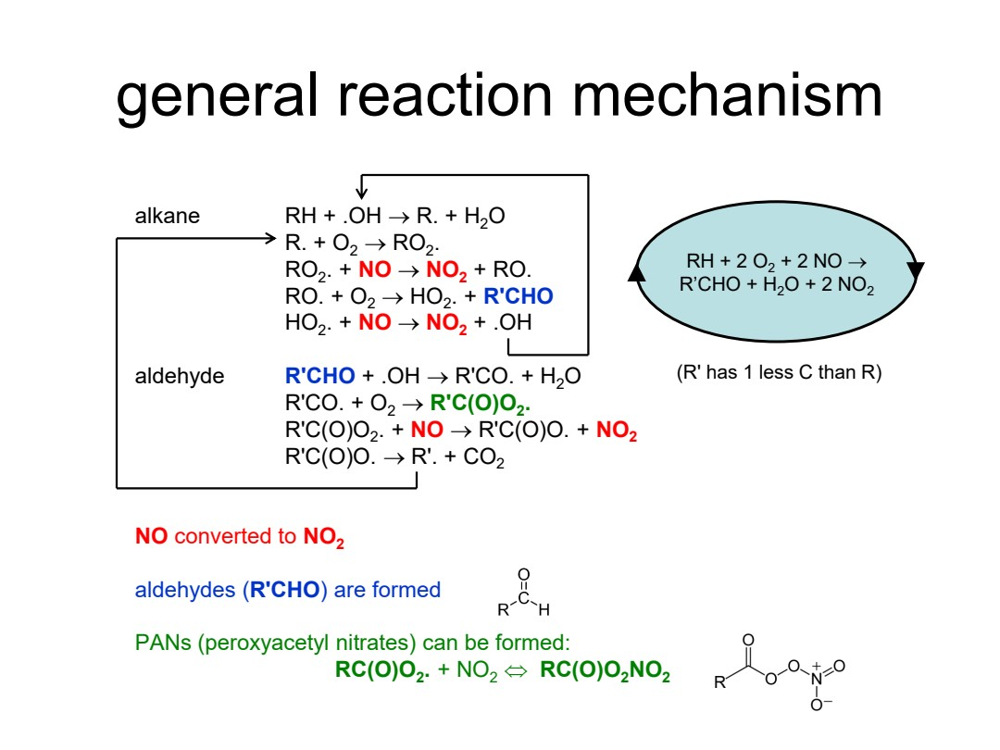

## PDF page 16

Source locator: `ENV5128-01-airpollutionbasics-2`, PDF p. 16. [Original PDF page](../../originals/5128/01_AirPollutionBasics_2.pdf#page=16).

Printed slide number candidate: 16 (use PDF page as canonical locator).

Generated navigation topics: Ozone and atmospheric chemistry

Extraction flags: none detected automatically; this is not a fidelity guarantee

### Extracted source text

> Example: effect of CH4 on O3
> 16
> • Methane is the most abundant organic gas in 
> the atmosphere (8-12 years of e-folding lifetime).
> CH4 + OH → CH3 + H2O
> CH3 + O2 → CH3O2
> M
> NO + CH3O2 → CH3O + NO2
> O(g) + O2(g) → O3(g)
> •
> • M
> NO2(g) + hv → NO(g) + O(g)
> • k1
> NO(g) + O3(g) → NO2(g) + O2(g)
> • •k3
> Ozone cycle
> Methoxy
> radical
> Methyl
>  radical
> Methylperoxy 
> radical
> • •
> • •
> •• ••
> Convert NO to NO2, increase 
> [NO2]/[NO] ratio → increase O3
> Important source of 
> water vapor in the 
> stratosphere

### Original page appearance

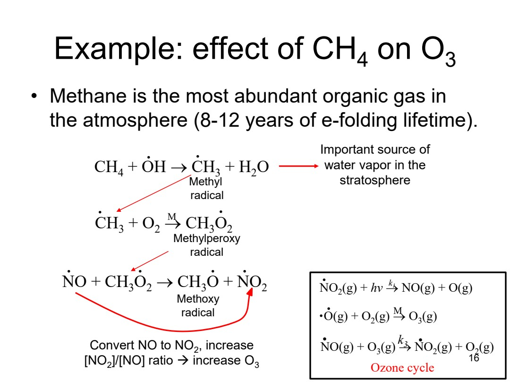

## PDF page 17

Source locator: `ENV5128-01-airpollutionbasics-2`, PDF p. 17. [Original PDF page](../../originals/5128/01_AirPollutionBasics_2.pdf#page=17).

Printed slide number candidate: 17 (use PDF page as canonical locator).

Generated navigation topics: Ozone and atmospheric chemistry

Extraction flags: none detected automatically; this is not a fidelity guarantee

### Extracted source text

> Example: PAN
> 17
> • Acetaldehyde is an important product of ethane 
> oxidation, precursor to peroxyacetyl nitrate (PAN)
> C2H5O + O2 → CH3CHO + HO2
> • •
> Ethoxy
> radical
> From oxidation of 
> ethane
> Acetaldehyde
> Enhance ozone 
> formation
> C2H5O + OH → acetyl radical → peroxyacetyl radical 
> M 
> O2
> ՜ ՚
> M 
> peroxyacetyl radical + NO2 CH3C(=O)O2NO2 
> PAN

### Original page appearance

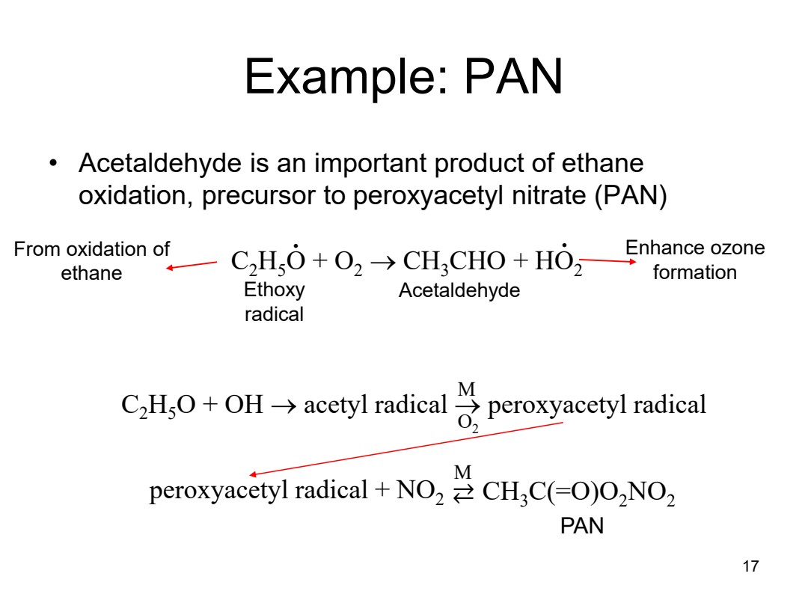

## PDF page 18

Source locator: `ENV5128-01-airpollutionbasics-2`, PDF p. 18. [Original PDF page](../../originals/5128/01_AirPollutionBasics_2.pdf#page=18).

Printed slide number candidate: not identified (use PDF page as canonical locator).

Generated navigation topics: Unclassified; inspect source.

Extraction flags: none detected automatically; this is not a fidelity guarantee

### Extracted source text

> relative reactivity of organics
>         k (25C) 1/(k [.OH]) a
>         cm3 molecule-1 s-1
> CO + .OH → CO2 + H.    1.5x10-13  36 days
> CH4 + .OH → CH3. + H2O   6.3x10-15  3 years
> C2H6 + .OH → C2H5. + H2O 2.6x10-13 30 days
> C3H8 + .OH → C3H7. + H2O 1.2x10-12 7 days
> other alkanes, CnH2n+2 + .OH → …     6 hrs - 7 days
> C2H4 + .OH → .CH2-CH2OH   8.5x10-12  22 hours
> C3H6 + .OH → CH3-.CH-CH2OH  2.6x10-11  7 hours
> other alkenes, CnH2n + .OH → …     2 - 8 hours
> RCHO + .OH → RC.O + H2O 2 - 12 hours
> aTime takes for reactant concentration drop to 37%, assuming 
> [.OH] = 0.06 ppt = 1.5x106 molecules/cm3

### Original page appearance

## PDF page 19

Source locator: `ENV5128-01-airpollutionbasics-2`, PDF p. 19. [Original PDF page](../../originals/5128/01_AirPollutionBasics_2.pdf#page=19).

Printed slide number candidate: 19 (use PDF page as canonical locator).

Generated navigation topics: Pollution sources and emissions, Transport and meteorology, Ozone and atmospheric chemistry

Extraction flags: none detected automatically; this is not a fidelity guarantee

### Extracted source text

> Role of ROG in O3 formation
> • ROG enhance O3 formation by converting NO to 
> NO2, but it take time for their effects to kick in
> • While wind carry the mixture of NOx and ROG 
> away, reactions occur that increase O3 
> concentration.
> • Highest  ozone concentration not found near 
> NOx emission sources (urban regions), but 
> rather downwind 
> • ROG reaction produce aldehydes, many are 
> human carcinogen
> 19

### Original page appearance

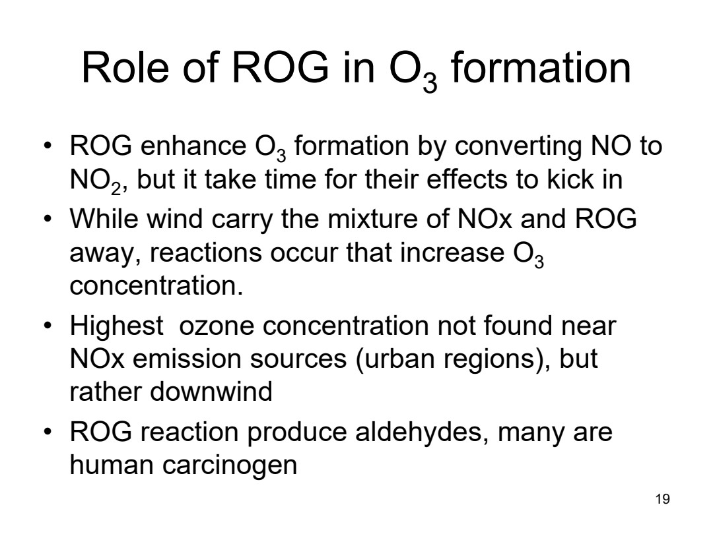

## PDF page 20

Source locator: `ENV5128-01-airpollutionbasics-2`, PDF p. 20. [Original PDF page](../../originals/5128/01_AirPollutionBasics_2.pdf#page=20).

Printed slide number candidate: 20 (use PDF page as canonical locator).

Generated navigation topics: Ozone and atmospheric chemistry

Extraction flags: sparse-text

### Extracted source text

> Urban ozone cycle
> 20
> Ryerson, T. B., et al. (2001) Science, 292:719-722.

### Original page appearance

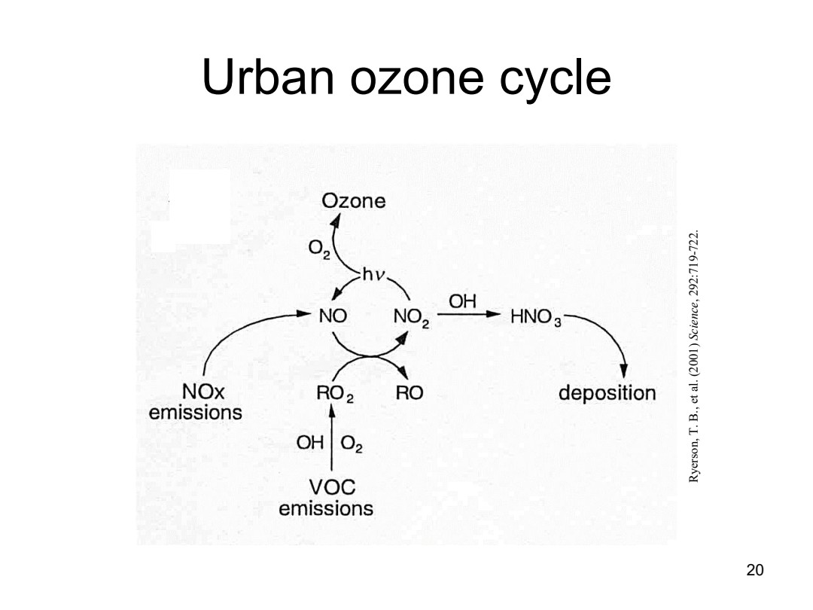

## PDF page 21

Source locator: `ENV5128-01-airpollutionbasics-2`, PDF p. 21. [Original PDF page](../../originals/5128/01_AirPollutionBasics_2.pdf#page=21).

Printed slide number candidate: 21 (use PDF page as canonical locator).

Generated navigation topics: Ozone and atmospheric chemistry

Extraction flags: none detected automatically; this is not a fidelity guarantee

### Extracted source text

> Urban ozone cycle
> 21
> • Ozone formation potential of different VOCs 
> differs depending on 
> – Abundance of reactant
> – Rate of initial attack on precursor (by OH)
> – # of NO → NO2 conversions per VOC molecule
> • Number of cycles
> – Potential of ROG as an NO2 sink
> • e.g. formation of PAN

### Original page appearance

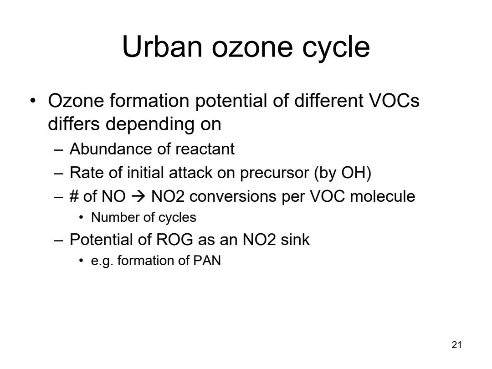

## PDF page 22

Source locator: `ENV5128-01-airpollutionbasics-2`, PDF p. 22. [Original PDF page](../../originals/5128/01_AirPollutionBasics_2.pdf#page=22).

Printed slide number candidate: 22 (use PDF page as canonical locator).

Generated navigation topics: Pollution sources and emissions, Transport and meteorology, Ozone and atmospheric chemistry

Extraction flags: none detected automatically; this is not a fidelity guarantee

### Extracted source text

> Diurnal variations in smog
> 22
> Typical pollutant concentration variation during one day (Godish, 2003)
> Morning rush hour 
> and inversion 
> NO 
> conversion
> intermediate products 
> of HC chemistry
> Sunlight, 
> photochemistry
> Three important factors: Emissions, Mixing height, Chemistry

### Original page appearance

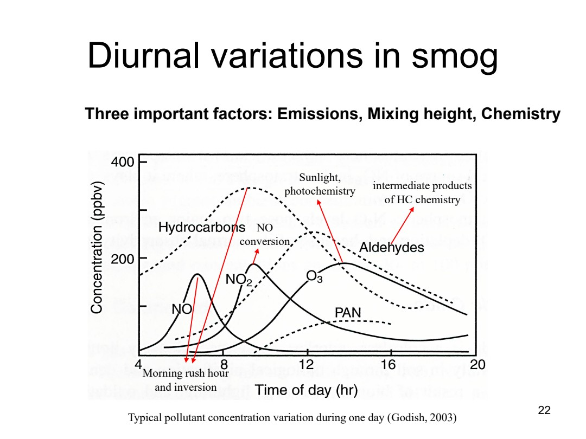

## PDF page 23

Source locator: `ENV5128-01-airpollutionbasics-2`, PDF p. 23. [Original PDF page](../../originals/5128/01_AirPollutionBasics_2.pdf#page=23).

Printed slide number candidate: 23 (use PDF page as canonical locator).

Generated navigation topics: Pollution sources and emissions, Transport and meteorology, Ozone and atmospheric chemistry

Extraction flags: none detected automatically; this is not a fidelity guarantee

### Extracted source text

> Control of ozone
> 23
> • As a secondary pollutants, ozone concentration 
> typically reaches max at 50-100 km downwind
> • Reduction in NOx/VOC emissions does not 
> necessarily reduce ozone concentration
> • Depending on where you are at the ozone 
> isopleth
> – Ozone concentration ~ VOC & NOx concentration

### Original page appearance

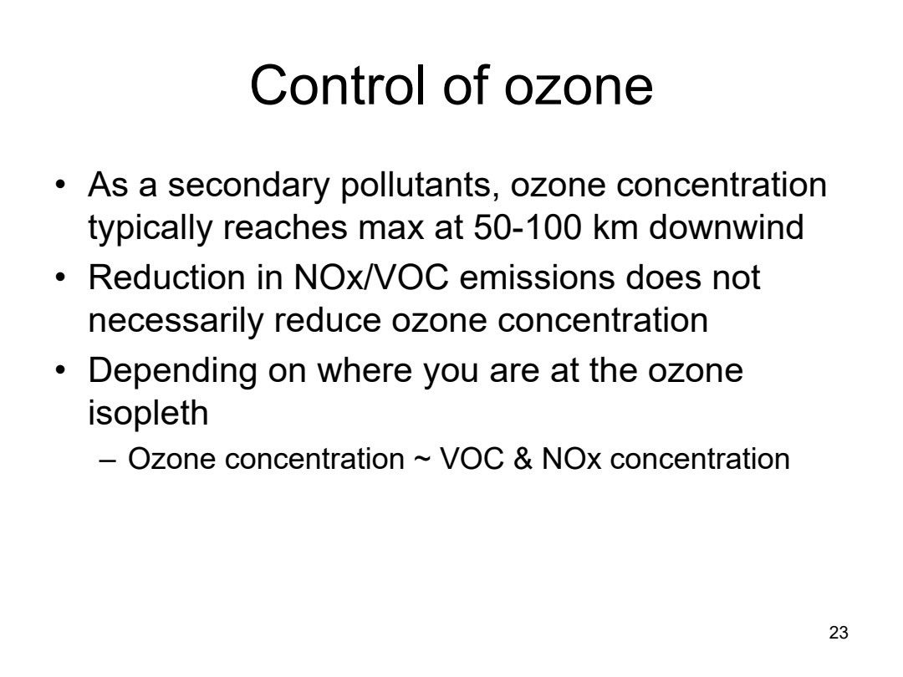

## PDF page 24

Source locator: `ENV5128-01-airpollutionbasics-2`, PDF p. 24. [Original PDF page](../../originals/5128/01_AirPollutionBasics_2.pdf#page=24).

Printed slide number candidate: not identified (use PDF page as canonical locator).

Generated navigation topics: Ozone and atmospheric chemistry

Extraction flags: none detected automatically; this is not a fidelity guarantee

### Extracted source text

> Ozone isopleth
> Reduction in NOx 
> increase O3. 
> Reduction in VOC 
> decrease O3.
> NOx limited
> VOC limited
> Reduction in NOx 
> decrease O3. 
> Reduction in VOC 
> no effect on O3.

### Original page appearance

## PDF page 25

Source locator: `ENV5128-01-airpollutionbasics-2`, PDF p. 25. [Original PDF page](../../originals/5128/01_AirPollutionBasics_2.pdf#page=25).

Printed slide number candidate: 25 (use PDF page as canonical locator).

Generated navigation topics: Exposure and health, Ozone and atmospheric chemistry

Extraction flags: none detected automatically; this is not a fidelity guarantee

### Extracted source text

> peroxyacetyl nitrates
> 25
> • Important component of photochemical smog
> – Damage plants, eye irritant, powerful tear gas
> – “Explosive” reaction
> • Potential serious health effects
> • Stable when cold, but quickly decomposed when hot
> – Last for long time when rises to upper atmosphere
> • Can be transported long distance (can be global)
> – Quickly decomposed if brought down near surface

### Original page appearance

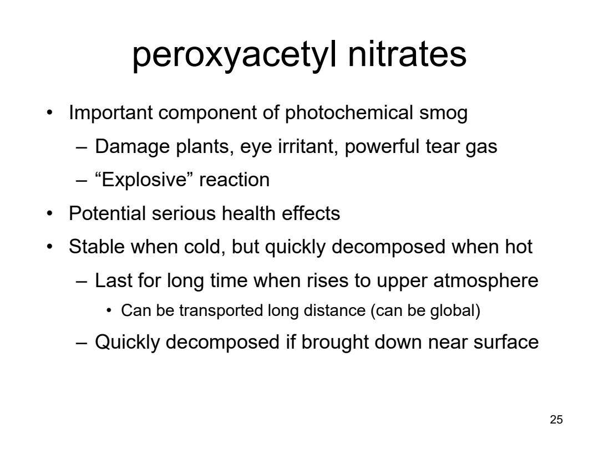

## PDF page 26

Source locator: `ENV5128-01-airpollutionbasics-2`, PDF p. 26. [Original PDF page](../../originals/5128/01_AirPollutionBasics_2.pdf#page=26).

Printed slide number candidate: 26 (use PDF page as canonical locator).

Generated navigation topics: Ozone and atmospheric chemistry

Extraction flags: sparse-text

### Extracted source text

> Acid Deposition
> 26

### Original page appearance

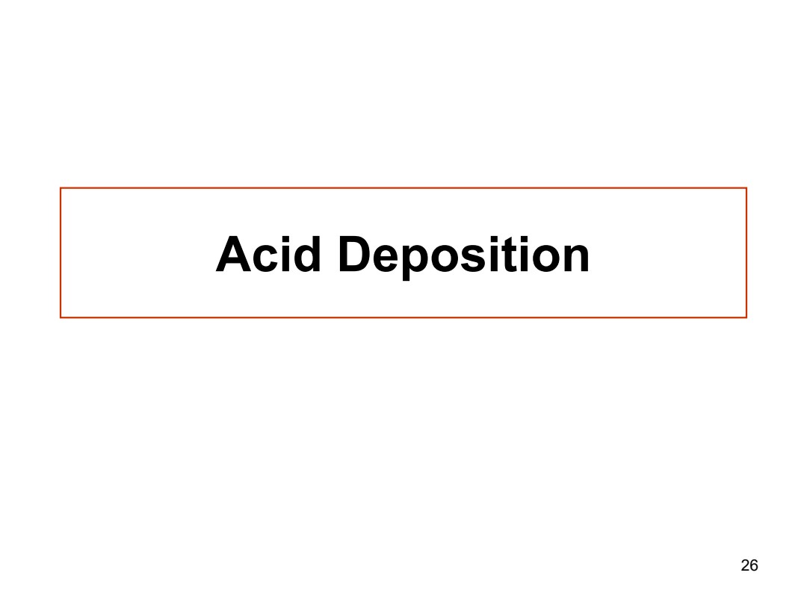

## PDF page 27

Source locator: `ENV5128-01-airpollutionbasics-2`, PDF p. 27. [Original PDF page](../../originals/5128/01_AirPollutionBasics_2.pdf#page=27).

Printed slide number candidate: 27 (use PDF page as canonical locator).

Generated navigation topics: Unclassified; inspect source.

Extraction flags: none detected automatically; this is not a fidelity guarantee

### Extracted source text

> Deposition
> 27
> • Transfer of pollutants (and pollutant products) 
> from the atmosphere to the earth’s surface
> • Have effects at many scales
> – Acidification of lakes (and soils)
> – Material degradation
> – Toxic metals deposition (e.g. Hg)
> – Persistent organic pollutants
> – Nitrogen input to ecosystems

### Original page appearance

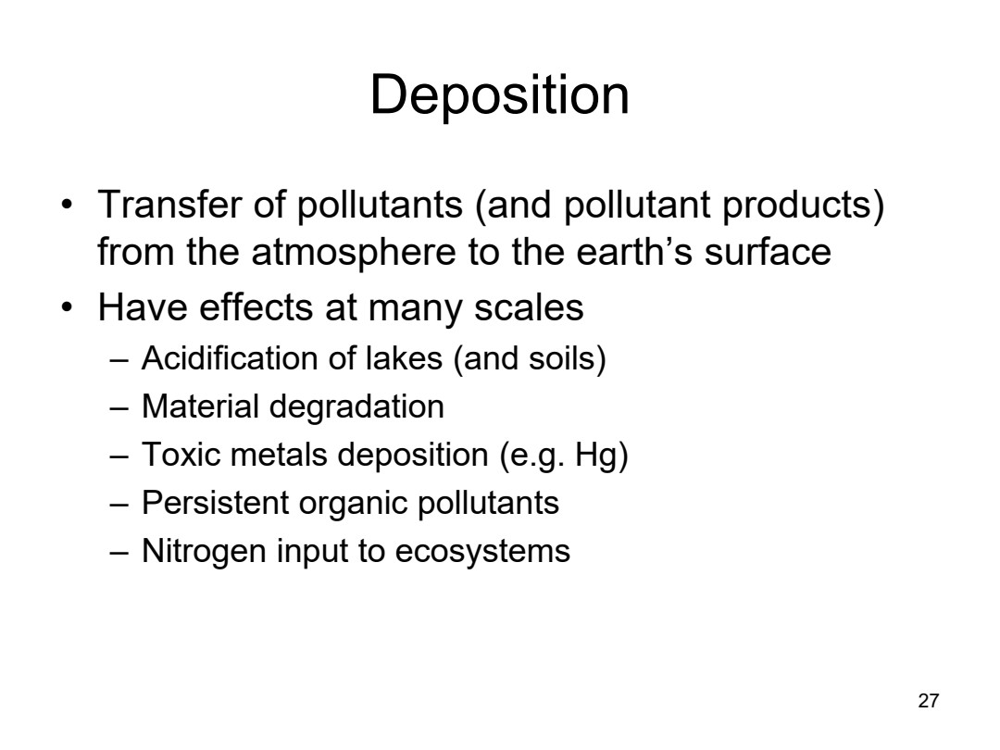

## PDF page 28

Source locator: `ENV5128-01-airpollutionbasics-2`, PDF p. 28. [Original PDF page](../../originals/5128/01_AirPollutionBasics_2.pdf#page=28).

Printed slide number candidate: 28 (use PDF page as canonical locator).

Generated navigation topics: Ozone and atmospheric chemistry

Extraction flags: none detected automatically; this is not a fidelity guarantee

### Extracted source text

> Dry and wet deposition
> 28
> • Dry deposition: Direct deposition to surfaces
> • Wet deposition: Precipitation involved deposition
> • Acid deposition: Creation and transport of acid 
> constituents from atmosphere to earth surface
> – Can be both dry and wet deposition
> – Chemical reactions usually involved in both gaseous 
> and aqueous phase

### Original page appearance

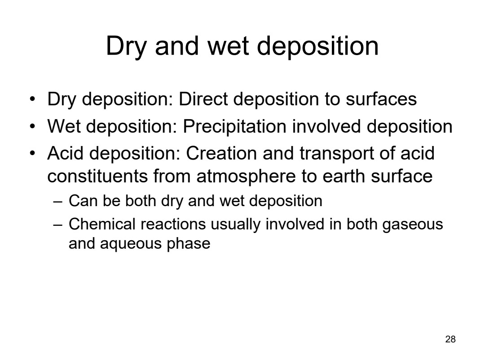

## PDF page 29

Source locator: `ENV5128-01-airpollutionbasics-2`, PDF p. 29. [Original PDF page](../../originals/5128/01_AirPollutionBasics_2.pdf#page=29).

Printed slide number candidate: 29 (use PDF page as canonical locator).

Generated navigation topics: Unclassified; inspect source.

Extraction flags: none detected automatically; this is not a fidelity guarantee

### Extracted source text

> Understanding acidity
> 29
> • Acidity ~ the amount of dissociated H+ ions
> – Characterized by pH value
> pH = -log10[H+]
>                   [H+]: molarity (molar or moles/liter)
> • Chemical releases [H+] ions → lower pH → 
> increase acidity
> • Chemical take up [H+] ions → higher pH → 
> decrease acidity

### Original page appearance

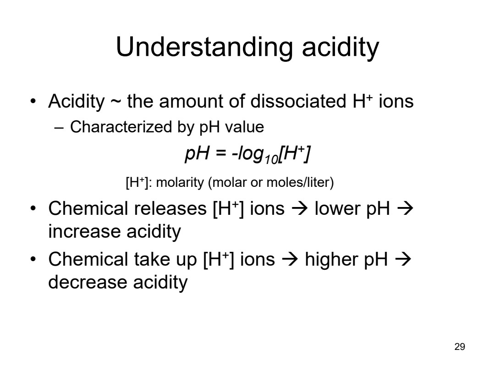

## PDF page 30

Source locator: `ENV5128-01-airpollutionbasics-2`, PDF p. 30. [Original PDF page](../../originals/5128/01_AirPollutionBasics_2.pdf#page=30).

Printed slide number candidate: 30 (use PDF page as canonical locator).

Generated navigation topics: Unclassified; inspect source.

Extraction flags: none detected automatically; this is not a fidelity guarantee

### Extracted source text

> pH Scale
> 30
> 0 1 2 3 4 5 6 7 8 9 10 11 12 13 14
> Natural
> rainwater
> (5-5.6)
> Distilled
> water
> (7.0)
> pH
> Sea
> water
> (7.8-8.3)
> Battery
> acid
> (1.0)
> Acid
> rain, fog
> (2-5.6)
> More acidic More basic or alkaline
> Lemon
> juice
> (2.2)
> Vinegar
> CH3COOH(aq)
> (2.8)
> Apples
> (3.1)
> Milk
> (6.6)
> Baking
> soda
> NaHCO3(aq)
> (8.2)
> Ammonium
> hydroxide
> NH4OH(aq)
> (11.1)
> Lye
> NaOH(aq)
> (13.0)
> Slaked lime
> Ca(OH)2(aq)
> (12.4)
> pH scale (Figure 10.3 Jacobson, 2012)

### Original page appearance

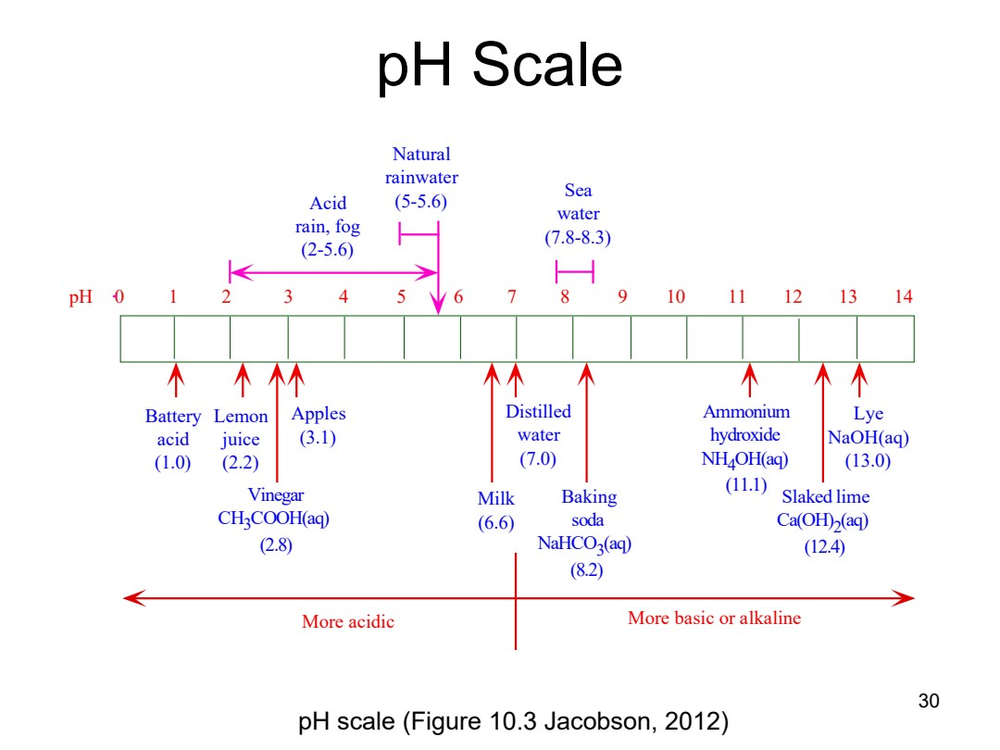

## PDF page 31

Source locator: `ENV5128-01-airpollutionbasics-2`, PDF p. 31. [Original PDF page](../../originals/5128/01_AirPollutionBasics_2.pdf#page=31).

Printed slide number candidate: 31 (use PDF page as canonical locator).

Generated navigation topics: Unclassified; inspect source.

Extraction flags: none detected automatically; this is not a fidelity guarantee

### Extracted source text

> Dissociation of CO2
> 31
> • Rain water is slightly acidic naturally (pH ~= 5.6) 
> due to dissolved CO2
> • Acid rain: rain water with pH < 5
> CO2 + H2O ⇆ H2CO3
> H2CO3 ⇆ H+ + HCO3
> -
> HCO3
> - ⇆ H+ + CO3
> 2-
> • Overall, we have
> CO2 + H2O ⇆ 2 H+ + CO3
> 2-
> Carbonic Acid
> Bicarbonate ion
> Carbonate ion

### Original page appearance

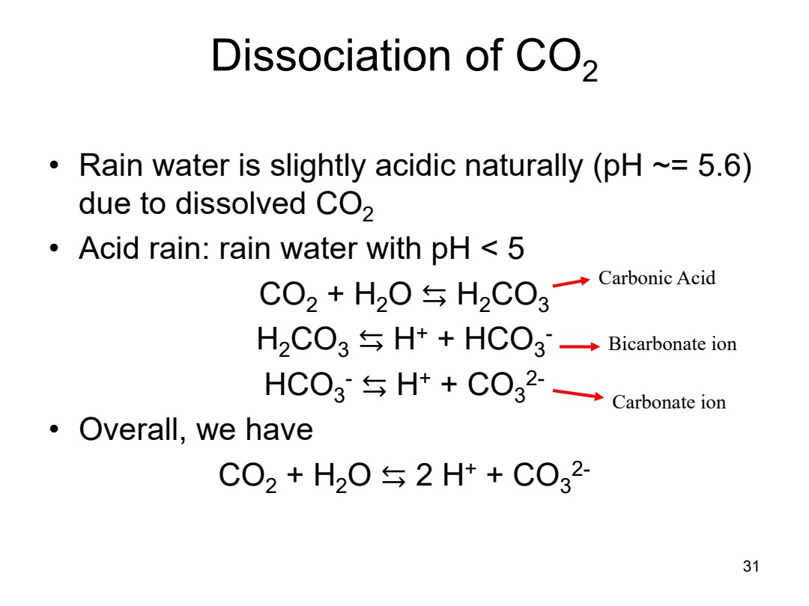

## PDF page 32

Source locator: `ENV5128-01-airpollutionbasics-2`, PDF p. 32. [Original PDF page](../../originals/5128/01_AirPollutionBasics_2.pdf#page=32).

Printed slide number candidate: 32 (use PDF page as canonical locator).

Generated navigation topics: Pollution sources and emissions, Ozone and atmospheric chemistry

Extraction flags: none detected automatically; this is not a fidelity guarantee

### Extracted source text

> Main constituents of acid deposition
> 32
> • H2SO4
> – Most important in eastern U.S (60 to 70 % of excess 
> acidity)
> – From emitted SO2 
> – 70% of SO2 emissions are anthropogenic in U.S.
> • HNO3 
> – More important in western U.S.
> – Near polluted cities with fog (such as LA)
> – From emitted NOx
> – 85% of NOx emissions are anthropogenic in U.S

### Original page appearance

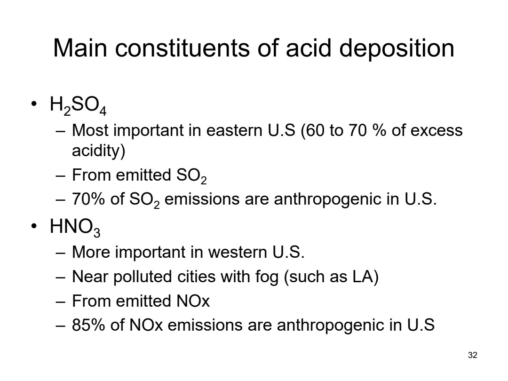

## PDF page 33

Source locator: `ENV5128-01-airpollutionbasics-2`, PDF p. 33. [Original PDF page](../../originals/5128/01_AirPollutionBasics_2.pdf#page=33).

Printed slide number candidate: 33 (use PDF page as canonical locator).

Generated navigation topics: Pollution sources and emissions, Ozone and atmospheric chemistry

Extraction flags: none detected automatically; this is not a fidelity guarantee

### Extracted source text

> Main constituents of acid deposition
> 33
> • HCl
> – Wood burning or industrial processing emissions
> – Waste incineration
> – Only about 5% of acidity
> • Role of other acids are not as important
> – Formic (HCOOH) & acetic acid (vinegar, CH3COOH)
> • Acid rain control is very successful in US due to 
> increasingly stringent emission controls

### Original page appearance

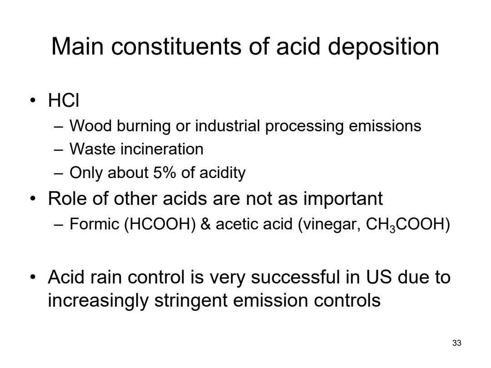

## PDF page 34

Source locator: `ENV5128-01-airpollutionbasics-2`, PDF p. 34. [Original PDF page](../../originals/5128/01_AirPollutionBasics_2.pdf#page=34).

Printed slide number candidate: 34 (use PDF page as canonical locator).

Generated navigation topics: Ozone and atmospheric chemistry

Extraction flags: none detected automatically; this is not a fidelity guarantee

### Extracted source text

> pH of rain
> The National Atmospheric Deposition Program 
> (NADP) monitors precipitation chemistry, National 
> Trends Network (NTN), https://nadp.slh.wisc.edu/
> 1985
> 1990
> 1995
> 2000
> 2005
> 2010
> 2015
> 34

### Original page appearance

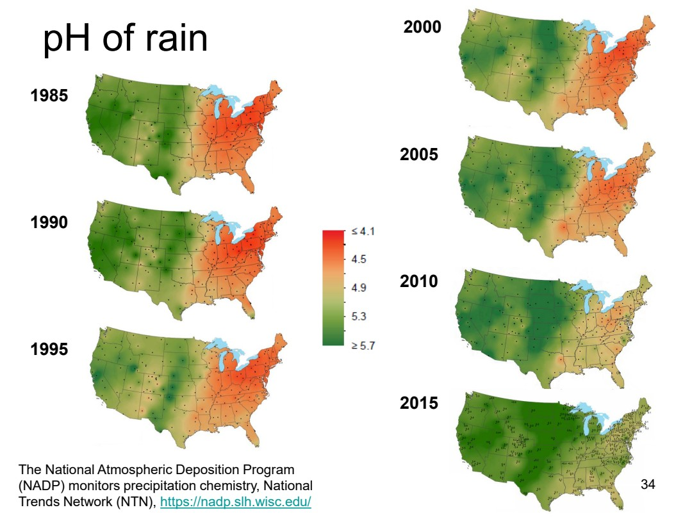

## PDF page 35

Source locator: `ENV5128-01-airpollutionbasics-2`, PDF p. 35. [Original PDF page](../../originals/5128/01_AirPollutionBasics_2.pdf#page=35).

Printed slide number candidate: 35 (use PDF page as canonical locator).

Generated navigation topics: Ozone and atmospheric chemistry

Extraction flags: sparse-text

### Extracted source text

> Antarctic Ozone Hole
> 35

### Original page appearance

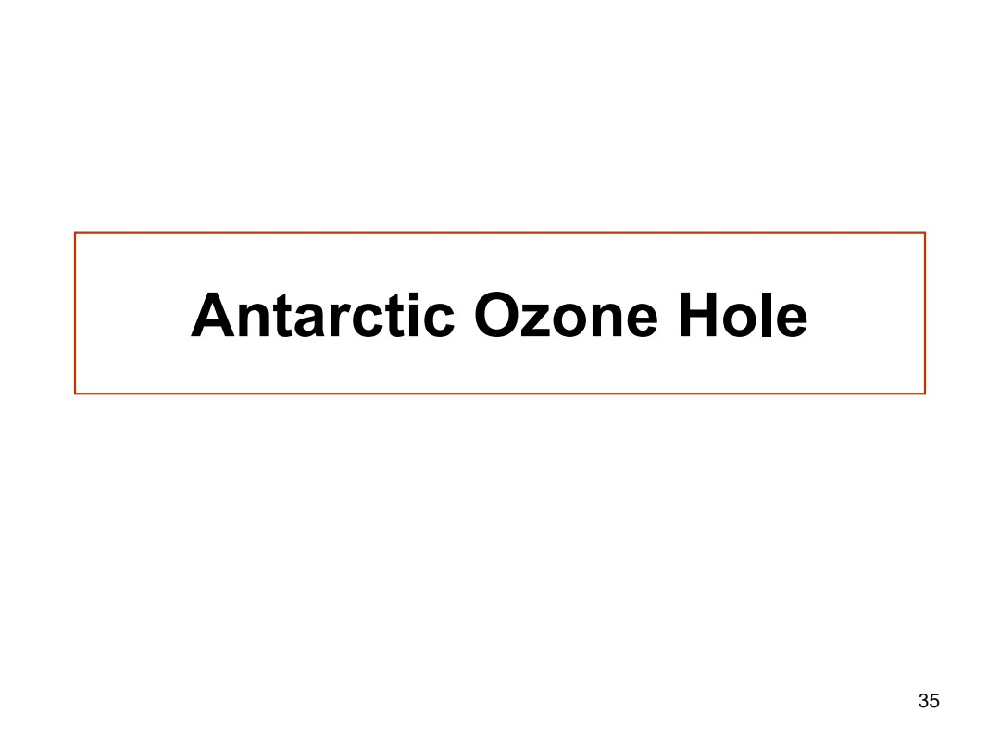

## PDF page 36

Source locator: `ENV5128-01-airpollutionbasics-2`, PDF p. 36. [Original PDF page](../../originals/5128/01_AirPollutionBasics_2.pdf#page=36).

Printed slide number candidate: 36 (use PDF page as canonical locator).

Generated navigation topics: Exposure and health, Ozone and atmospheric chemistry

Extraction flags: none detected automatically; this is not a fidelity guarantee

### Extracted source text

> Introduction
> 36
> • Ozone presented in both troposphere and 
> stratosphere
> • In troposphere → bad ozone
> – Health effect when exposed to
> – Contribute to global warming
> • In stratosphere → good ozone
> – Absorbs harmful UV
> • 90% of ozone are in stratosphere

### Original page appearance

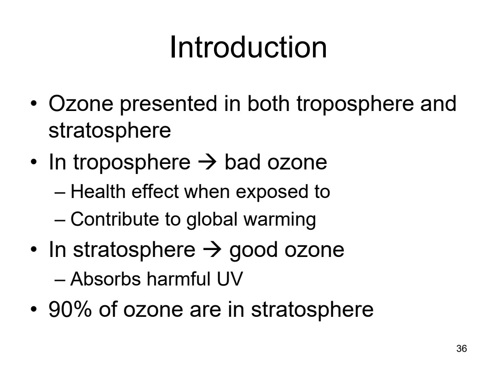

## PDF page 37

Source locator: `ENV5128-01-airpollutionbasics-2`, PDF p. 37. [Original PDF page](../../originals/5128/01_AirPollutionBasics_2.pdf#page=37).

Printed slide number candidate: 37 (use PDF page as canonical locator).

Generated navigation topics: Ozone and atmospheric chemistry

Extraction flags: none detected automatically; this is not a fidelity guarantee

### Extracted source text

> Ozone layer structure
> 37
> • Vertically: peak at 25-32 km altitude
> – Sweet spot with just enough UV and O2 to form O3
> – Different chemistry with ground level ozone formation!

### Original page appearance

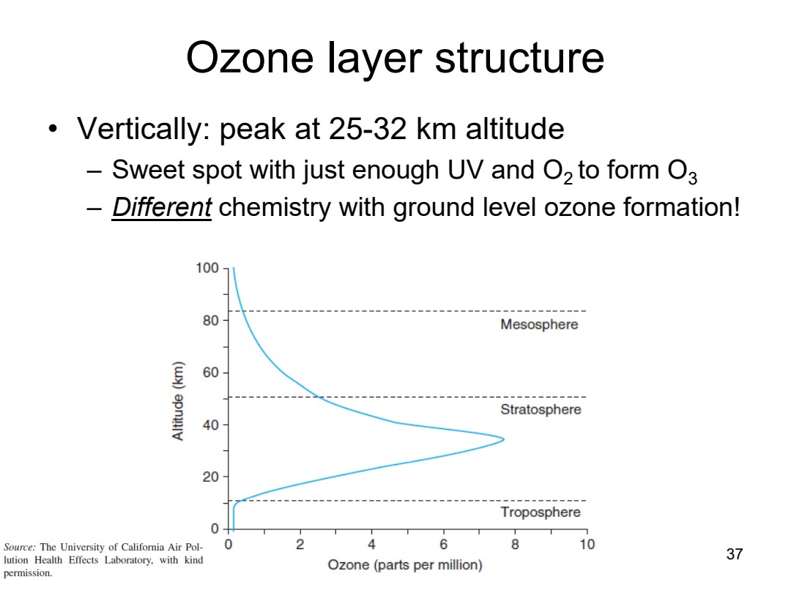

## PDF page 38

Source locator: `ENV5128-01-airpollutionbasics-2`, PDF p. 38. [Original PDF page](../../originals/5128/01_AirPollutionBasics_2.pdf#page=38).

Printed slide number candidate: 38 (use PDF page as canonical locator).

Generated navigation topics: Ozone and atmospheric chemistry, Policy and management context

Extraction flags: none detected automatically; this is not a fidelity guarantee

### Extracted source text

> Ozone layer structure
> 38
> • Traditionally, ozone concentration 
> expressed in Dubson Unit (DU)
> – Layer of gas that would be 10 µm think under 
> standard temperature and pressure
> – Globally ozone average concentration ~ 300 
> DU
> • Ozone concentration varies vertically and 
> horizontally

### Original page appearance

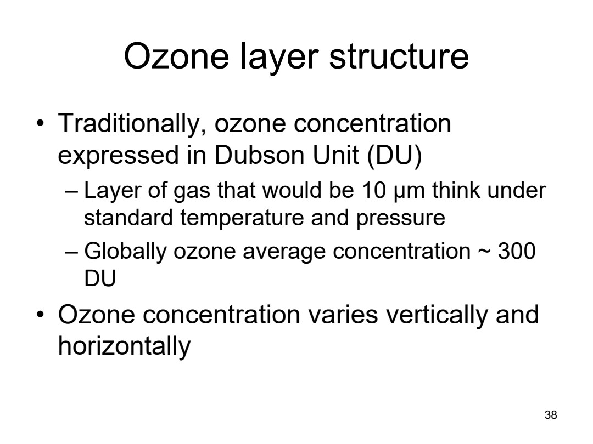

## PDF page 39

Source locator: `ENV5128-01-airpollutionbasics-2`, PDF p. 39. [Original PDF page](../../originals/5128/01_AirPollutionBasics_2.pdf#page=39).

Printed slide number candidate: 39 (use PDF page as canonical locator).

Generated navigation topics: Ozone and atmospheric chemistry

Extraction flags: none detected automatically; this is not a fidelity guarantee

### Extracted source text

> Horizontal ozone layer structure
> 39
> Ozone concentration variation with time & 
> latitude as measured by NASA TOMS 
> satellite (Jacobson, 2002)
> Low at equator
> North hemisphere 
> high in north 
> spring
> South 
> hemisphere high 
> in south spring
> Antarctic 
> ozone hole

### Original page appearance

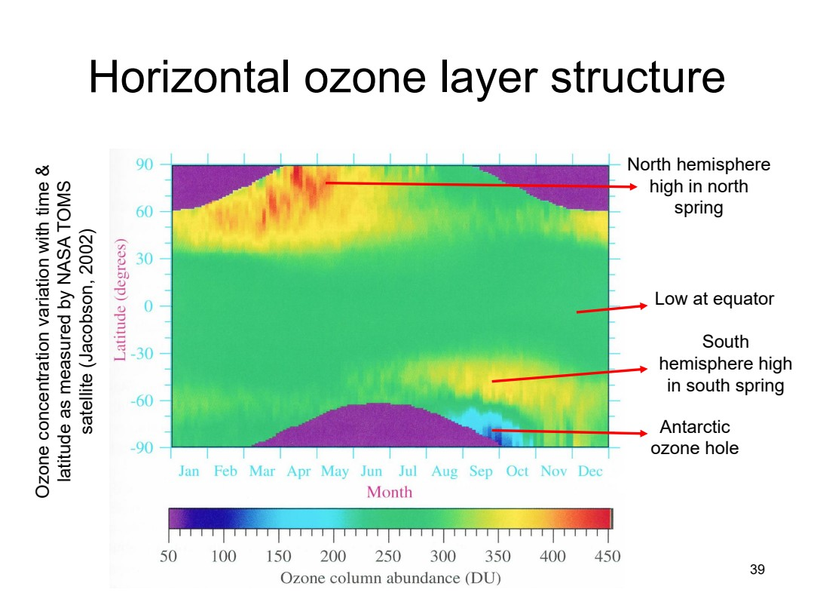

## PDF page 40

Source locator: `ENV5128-01-airpollutionbasics-2`, PDF p. 40. [Original PDF page](../../originals/5128/01_AirPollutionBasics_2.pdf#page=40).

Printed slide number candidate: 40 (use PDF page as canonical locator).

Generated navigation topics: Ozone and atmospheric chemistry

Extraction flags: sparse-text

### Extracted source text

> Ozone layer function
> 40
> • Ozone absorbs harmful UV radiation 

### Original page appearance

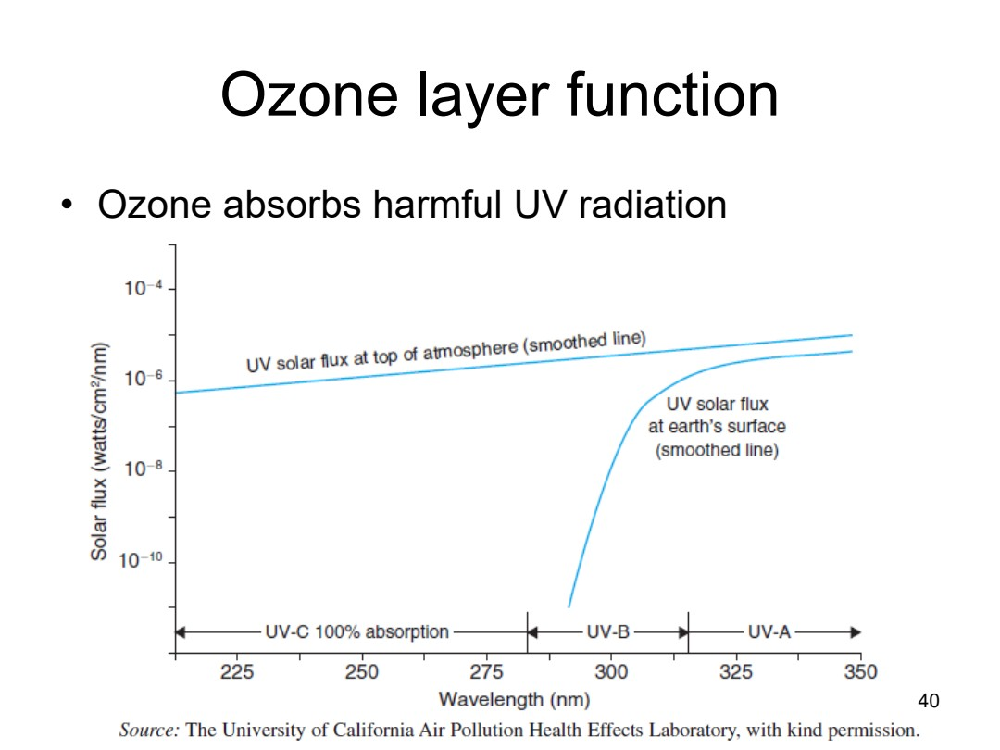

## PDF page 41

Source locator: `ENV5128-01-airpollutionbasics-2`, PDF p. 41. [Original PDF page](../../originals/5128/01_AirPollutionBasics_2.pdf#page=41).

Printed slide number candidate: 41 (use PDF page as canonical locator).

Generated navigation topics: Ozone and atmospheric chemistry

Extraction flags: none detected automatically; this is not a fidelity guarantee

### Extracted source text

> Ozone layer function
> 41
> • Ozone absorbs UV radiation between 250-
> 345 nm
> – Strongly at 310 nm
> – Weakly between 310-345 nm
> – N2, O2 absorbs far-UV (10-250 nm)
> • Allow little UV-C, some UV-B and most 
> UV-A reaches troposphere
> • Some say, without ozone layer, no life 
> form as we know will exist

### Original page appearance

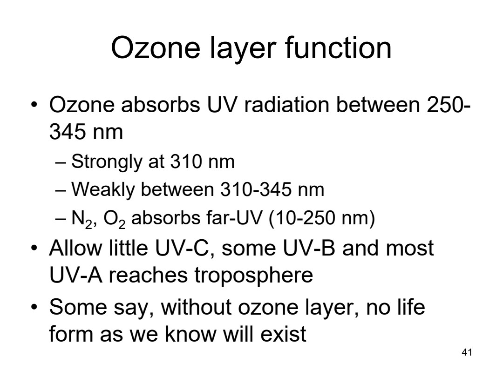

## PDF page 42

Source locator: `ENV5128-01-airpollutionbasics-2`, PDF p. 42. [Original PDF page](../../originals/5128/01_AirPollutionBasics_2.pdf#page=42).

Printed slide number candidate: 42 (use PDF page as canonical locator).

Generated navigation topics: Ozone and atmospheric chemistry

Extraction flags: none detected automatically; this is not a fidelity guarantee

### Extracted source text

> Ozone depletion issues
> 42
> • Largest ozone reduction observed near N/S poles
> • Substantial ozone reduction above Antarctic observed 
> at the beginning of southern hemisphere spring
> – Antarctic ozone hole
> – Up to 70% reduction
> – When ozone column abundance < 220 DU: ozone hole
> • Ozone reduction in Arctic also observed
> – Less severe (up to 25%)
> – Arctic ozone dent

### Original page appearance

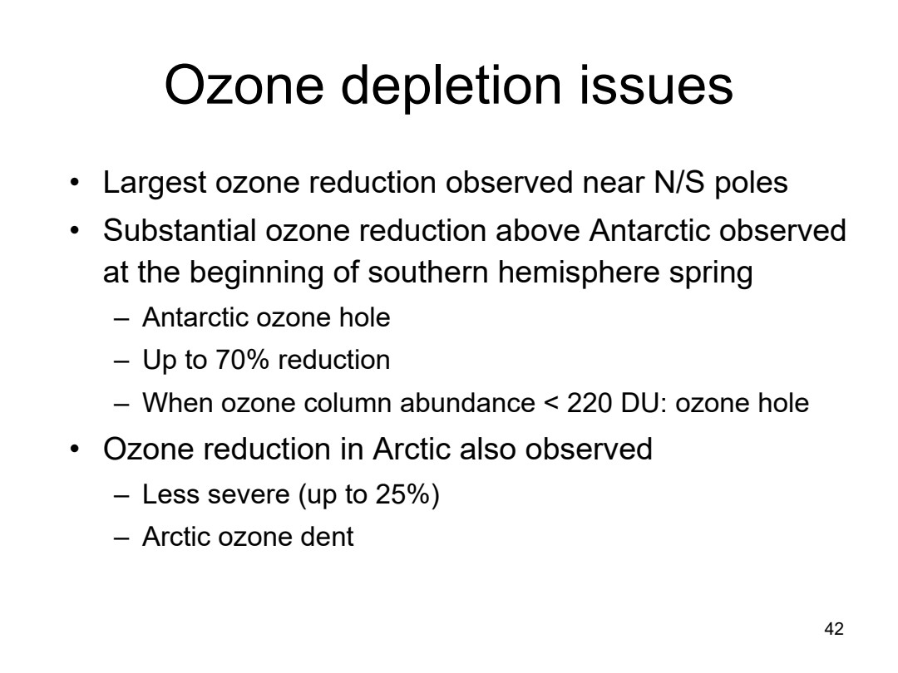

## PDF page 43

Source locator: `ENV5128-01-airpollutionbasics-2`, PDF p. 43. [Original PDF page](../../originals/5128/01_AirPollutionBasics_2.pdf#page=43).

Printed slide number candidate: not identified (use PDF page as canonical locator).

Generated navigation topics: Measurement methods and instruments, Ozone and atmospheric chemistry

Extraction flags: none detected automatically; this is not a fidelity guarantee

### Extracted source text

> What is the ozone hole?
> The average amount of ozone in the atmosphere is roughly 300 Dobson Units (DU), 
> equivalent to a layer 3 mm thick. Instruments on ground (at Halley) and above Antarctica 
> measured an acute drop in total atmospheric ozone during October in the early 1980s.
> The ozone “hole” is an area where ozone 
> concentration drops to below 220 DU.
> October 4, 2024
> ozone hole areaaverage ozone concentration (1 DU = 0.01 mm thickness)
> ozone hole 
> (<220 DU)
> avg = 300 DU
> October data; instruments located on ground at Halley and 
> high above Antarctica (Total Ozone Mapping Spectrometer 
> [TOMS] and Ozone Monitoring Instrument [OMI]).
> 220
> http://ozonewatch.gsfc.nasa.gov/facts/history_SH.html

### Original page appearance

## PDF page 44

Source locator: `ENV5128-01-airpollutionbasics-2`, PDF p. 44. [Original PDF page](../../originals/5128/01_AirPollutionBasics_2.pdf#page=44).

Printed slide number candidate: not identified (use PDF page as canonical locator).

Generated navigation topics: Ozone and atmospheric chemistry

Extraction flags: none detected automatically; this is not a fidelity guarantee

### Extracted source text

> Ozone depletion issues
> 44Antarctic ozone hole from 1979 to 2024
> (NASA Ozone watch http://ozonewatch.gsfc.nasa.gov/monthly/SH.html)

### Original page appearance

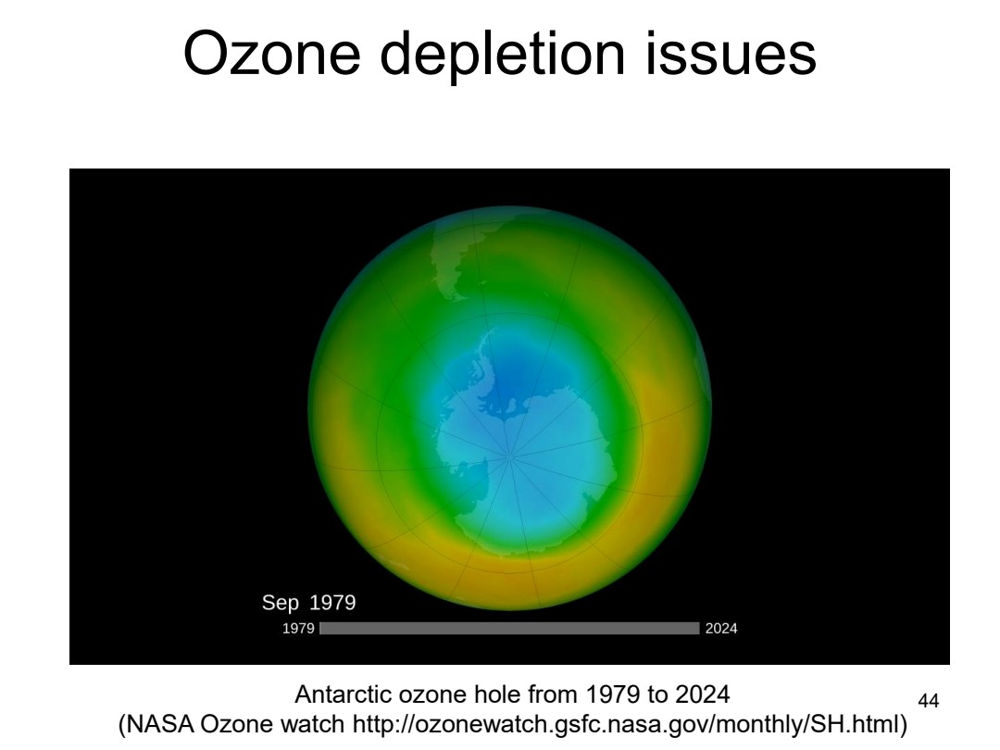

## PDF page 45

Source locator: `ENV5128-01-airpollutionbasics-2`, PDF p. 45. [Original PDF page](../../originals/5128/01_AirPollutionBasics_2.pdf#page=45).

Printed slide number candidate: not identified (use PDF page as canonical locator).

Generated navigation topics: Ozone and atmospheric chemistry

Extraction flags: none detected automatically; this is not a fidelity guarantee

### Extracted source text

> Ozone depletion issues
> 45Antarctic ozone hole from 7/1/22 to 12/31/22
> (NASA Ozone watch http://ozonewatch.gsfc.nasa.gov/monthly/SH.html)

### Original page appearance

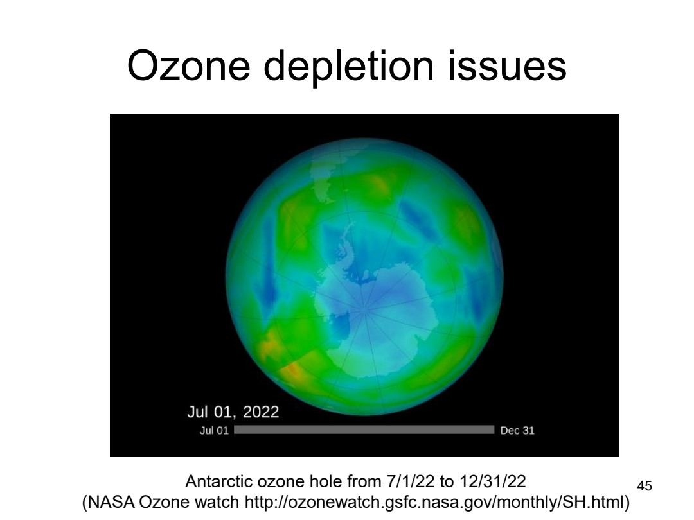

## PDF page 46

Source locator: `ENV5128-01-airpollutionbasics-2`, PDF p. 46. [Original PDF page](../../originals/5128/01_AirPollutionBasics_2.pdf#page=46).

Printed slide number candidate: 46 (use PDF page as canonical locator).

Generated navigation topics: Ozone and atmospheric chemistry

Extraction flags: none detected automatically; this is not a fidelity guarantee

### Extracted source text

> Stratospheric ozone chemistry - CFCs
> 46
> • Chlorofluorocarbons (CFC)
> – Contains chlorine (Cl) and fluorine (F)
> – Produced synthetically
> – Cheap, nontoxic, nonflammable, nonexplosive, 
> insoluble, relatively inert
> – Used in refrigeration, spray cans, blowing agent
> – Average lifetime ~ 75 years
> • There are also other halogenated species: 
> HCFCs, HFCs, bromine containing chemicals…

### Original page appearance

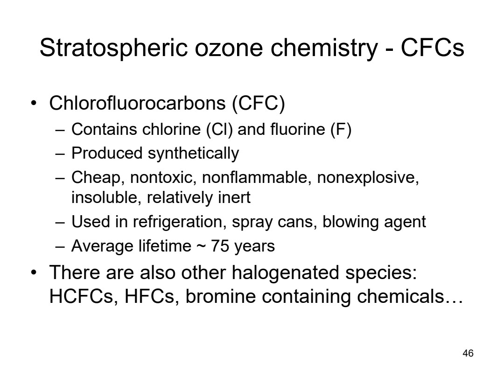

## PDF page 47

Source locator: `ENV5128-01-airpollutionbasics-2`, PDF p. 47. [Original PDF page](../../originals/5128/01_AirPollutionBasics_2.pdf#page=47).

Printed slide number candidate: 47 (use PDF page as canonical locator).

Generated navigation topics: Ozone and atmospheric chemistry

Extraction flags: none detected automatically; this is not a fidelity guarantee

### Extracted source text

> Stratospheric ozone chemistry - CFCs
> 47
> • In stratosphere, CFC break down when exposed 
> to far-UV, release ClOx and atomic chlorine
> • CFC don’t break down in troposphere (why?)
> – Hence climb to stratosphere
> • Destruct ozone through the generalized catalytic 
> ozone destruction mechanism
> Cl + O3 → ClO + O2
> ClO + O → Cl + O2
> NET:        O + O₃ → 2O₂
> active chlorine

### Original page appearance

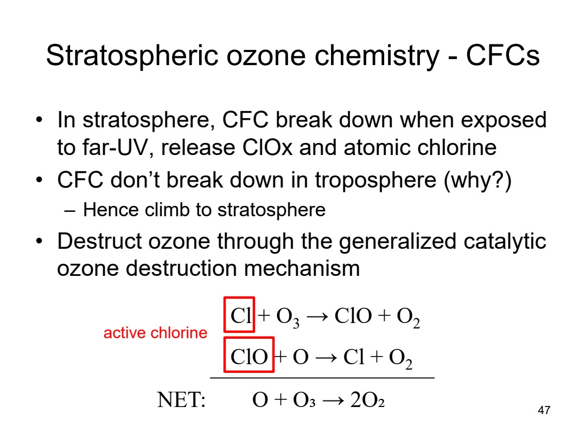

## PDF page 48

Source locator: `ENV5128-01-airpollutionbasics-2`, PDF p. 48. [Original PDF page](../../originals/5128/01_AirPollutionBasics_2.pdf#page=48).

Printed slide number candidate: 48 (use PDF page as canonical locator).

Generated navigation topics: Ozone and atmospheric chemistry

Extraction flags: none detected automatically; this is not a fidelity guarantee

### Extracted source text

> Stratospheric ozone chemistry - CFCs
> 48
> • -Cl chain length: 10 -1,000 (Jacobson, 2002)
> – One Cl molecule on average destructs 10-1,000 
> ozone molecules in lower and upper stratosphere, 
> respectively. Aka chain length
> – Bigger chain length number, more powerful ozone 
> destruction
> • -Br chain length: 100 - 10,000 (Jacobson, 2002)
> – Slower reaction, more efficient
> • The estimated numbers vary

### Original page appearance

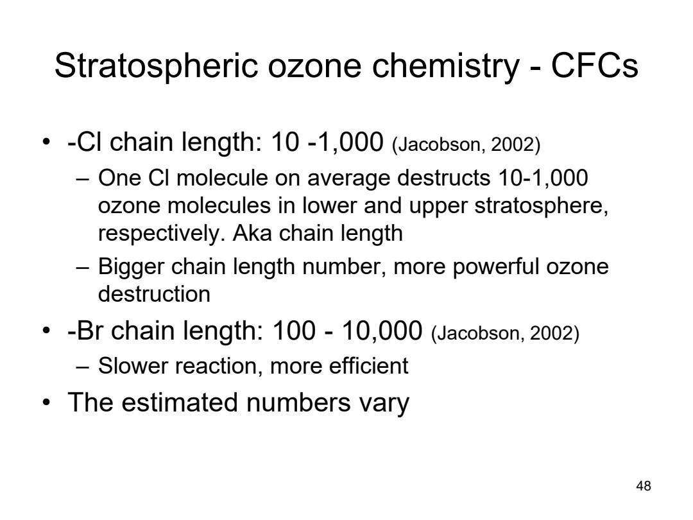

## PDF page 49

Source locator: `ENV5128-01-airpollutionbasics-2`, PDF p. 49. [Original PDF page](../../originals/5128/01_AirPollutionBasics_2.pdf#page=49).

Printed slide number candidate: 49 (use PDF page as canonical locator).

Generated navigation topics: Ozone and atmospheric chemistry

Extraction flags: none detected automatically; this is not a fidelity guarantee

### Extracted source text

> Stratospheric ozone chemistry - CFCs
> 49
> • Sink of active chlorine (Cl, ClO)
> – Reactions to form reservoir species: HCl and ClONO2
> • Hydrochloric acid and chlorine nitrate
> – Temporarily store chlorine
> – When sunlight present, can photolyzed back to free 
> chlorine, continue ozone destruction
> • Bromine chemistry is similar

### Original page appearance

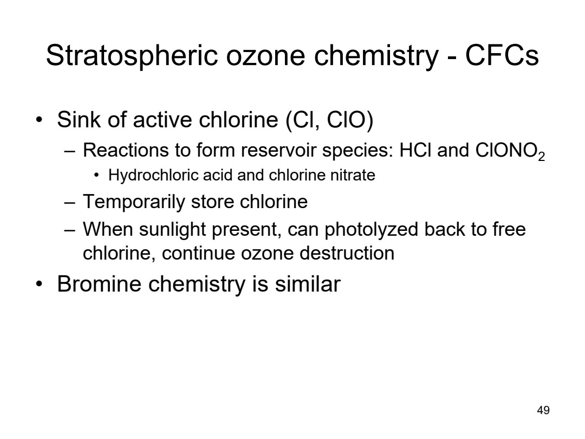

## PDF page 50

Source locator: `ENV5128-01-airpollutionbasics-2`, PDF p. 50. [Original PDF page](../../originals/5128/01_AirPollutionBasics_2.pdf#page=50).

Printed slide number candidate: 50 (use PDF page as canonical locator).

Generated navigation topics: Ozone and atmospheric chemistry

Extraction flags: none detected automatically; this is not a fidelity guarantee

### Extracted source text

> Ozone depletion issues
> 50
> • Ozone reduction near N/S poles generally 
> observed in/near spring time
> – Spring time differs for north/south hemisphere
> • One factor: Cl and Br in stratosphere & their 
> chemistry in polar stratospheric clouds (PSC)
> – Recall that active chlorine (Cl, ClO)/Br destroy ozone 
> through generalized catalytic mechanism

### Original page appearance

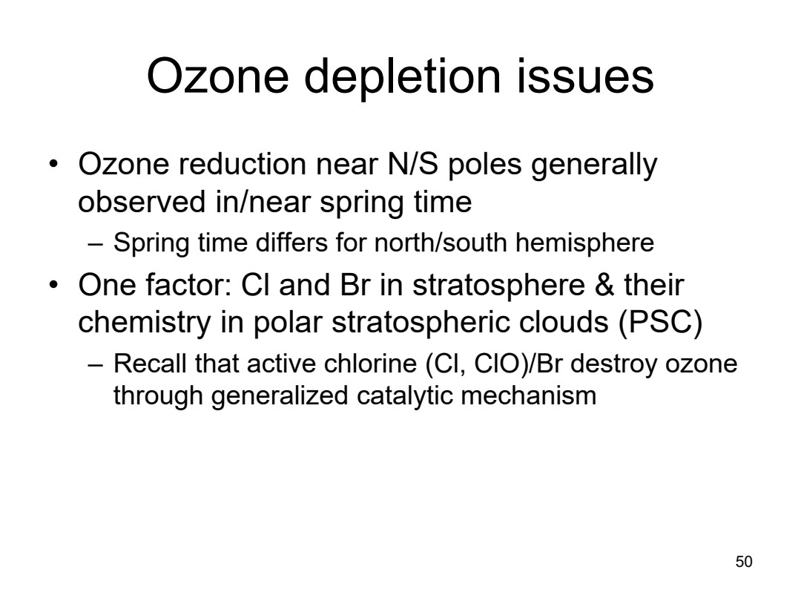

## PDF page 51

Source locator: `ENV5128-01-airpollutionbasics-2`, PDF p. 51. [Original PDF page](../../originals/5128/01_AirPollutionBasics_2.pdf#page=51).

Printed slide number candidate: 51 (use PDF page as canonical locator).

Generated navigation topics: Unclassified; inspect source.

Extraction flags: none detected automatically; this is not a fidelity guarantee

### Extracted source text

> Polar stratospheric clouds 
> 51
> Polar Stratospheric Cloud, seen from the NASA DC-8 
> on 14 January 2003 (photograph by Paul Newman, 
> GSFC) http://remus.jpl.nasa.gov/kiruna/a015.htm

### Original page appearance

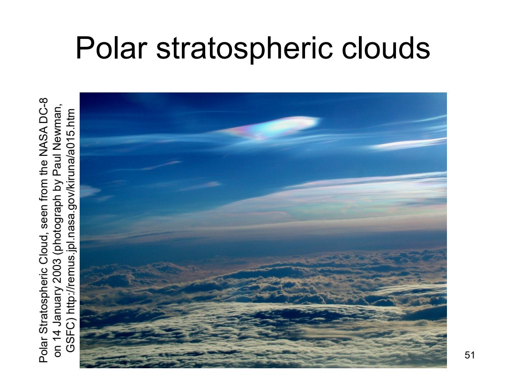

## PDF page 52

Source locator: `ENV5128-01-airpollutionbasics-2`, PDF p. 52. [Original PDF page](../../originals/5128/01_AirPollutionBasics_2.pdf#page=52).

Printed slide number candidate: not identified (use PDF page as canonical locator).

Generated navigation topics: Unclassified; inspect source.

Extraction flags: sparse-text

### Extracted source text

> Polar stratospheric clouds 
> 52PSC as seen in Scandinavia (source unknown)

### Original page appearance

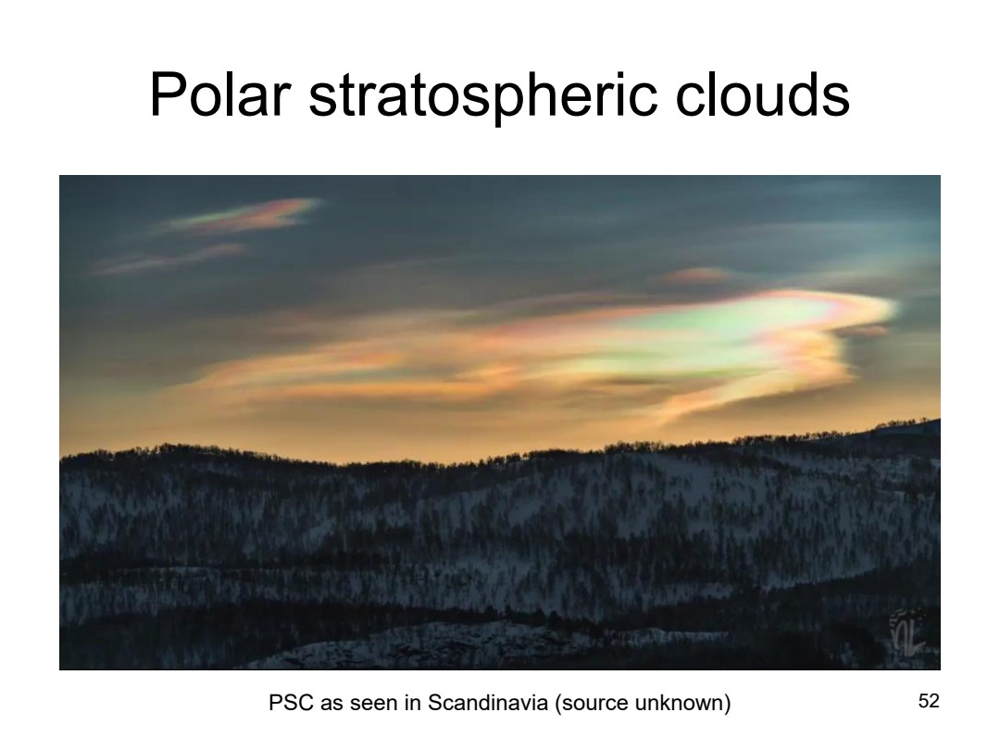

## PDF page 53

Source locator: `ENV5128-01-airpollutionbasics-2`, PDF p. 53. [Original PDF page](../../originals/5128/01_AirPollutionBasics_2.pdf#page=53).

Printed slide number candidate: 53 (use PDF page as canonical locator).

Generated navigation topics: Ozone and atmospheric chemistry

Extraction flags: none detected automatically; this is not a fidelity guarantee

### Extracted source text

> Ozone depletion process
> 53
> • During polar night (before spring)
> – Polar stratospheric clouds (PSC) forms → reactions 
> occur inside PSC → convert inactive Cl/Br (such as 
> reservoir species HCl and ClONO2) to species that 
> are photo-chemically active (Cl2, HOCl, ClNO2 etc)
> – Chlorine activation
> • Beginning of polar day (early spring)
> – Photo-chemically active species go through 
> photolysis reaction → release active Cl/Br (Cl, ClO) → 
> catalytically destroy ozone

### Original page appearance

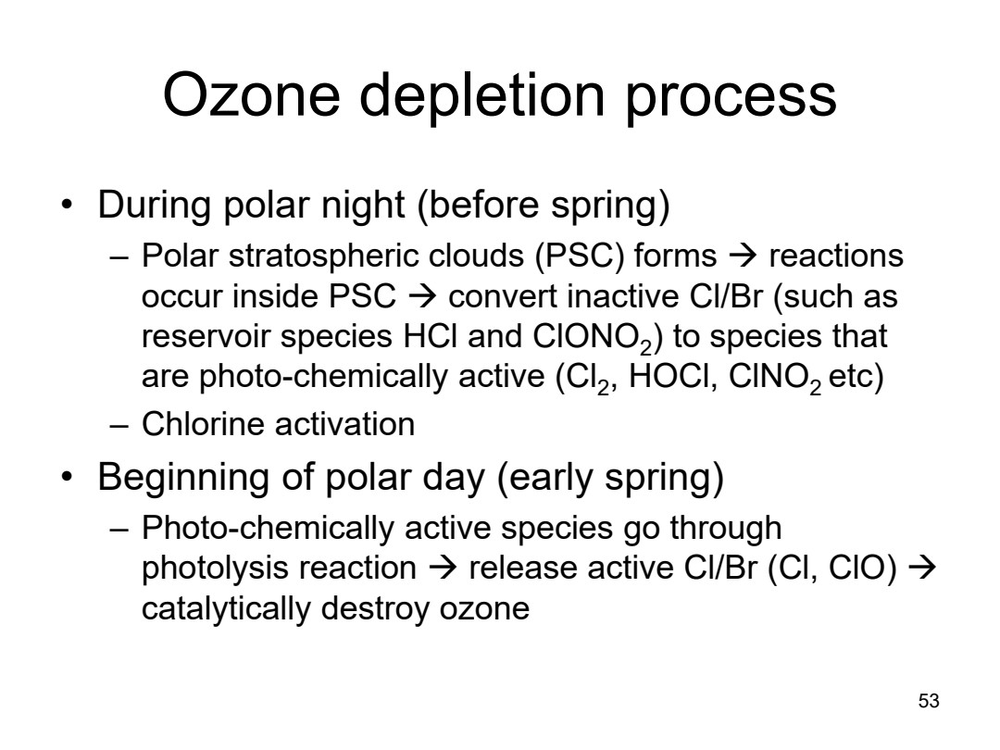

## PDF page 54

Source locator: `ENV5128-01-airpollutionbasics-2`, PDF p. 54. [Original PDF page](../../originals/5128/01_AirPollutionBasics_2.pdf#page=54).

Printed slide number candidate: 54 (use PDF page as canonical locator).

Generated navigation topics: Ozone and atmospheric chemistry

Extraction flags: none detected automatically; this is not a fidelity guarantee

### Extracted source text

> Ozone depletion process
> 54
> Ozone depletion process over Antarctica (Figure 4.11 Godish, 2003)

### Original page appearance

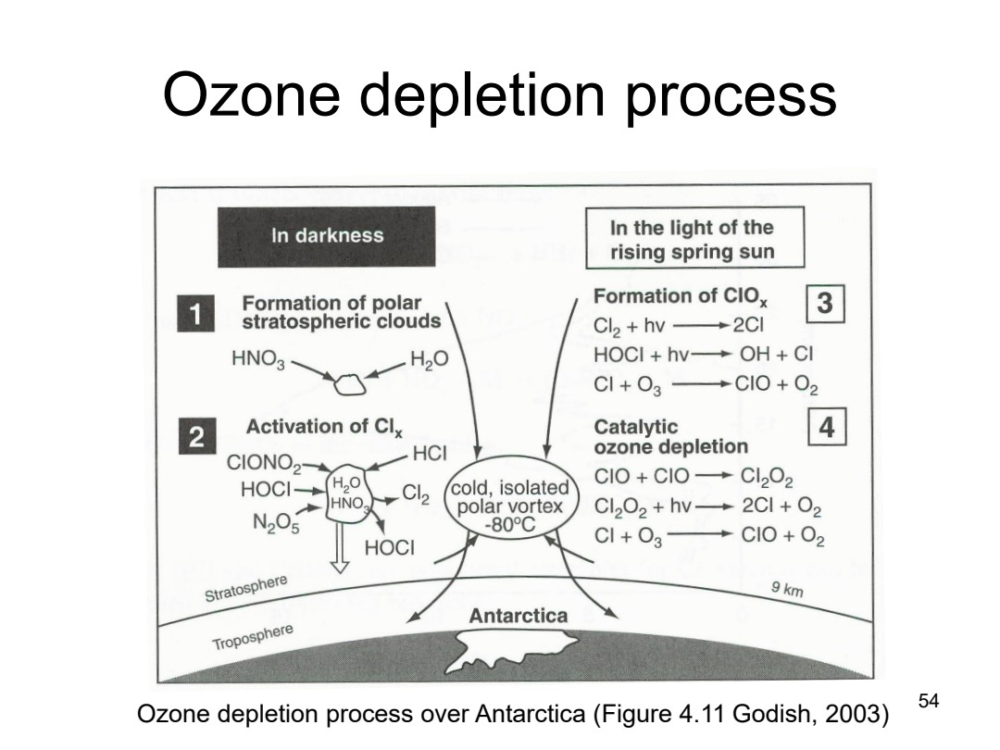

## PDF page 55

Source locator: `ENV5128-01-airpollutionbasics-2`, PDF p. 55. [Original PDF page](../../originals/5128/01_AirPollutionBasics_2.pdf#page=55).

Printed slide number candidate: 55 (use PDF page as canonical locator).

Generated navigation topics: Ozone and atmospheric chemistry

Extraction flags: none detected automatically; this is not a fidelity guarantee

### Extracted source text

> Ozone depletion process
> 55
> • Why ozone depletion is less severe in north 
> pole?
> • Temperature higher in Arctic
> – Less PSC formation, less chlorine activation
> – Higher temperature due to difference in land cover
> • Ocean in Arctic vs land in Antarctic
> • Polar vortex not as strong in arctic due to rough terrain

### Original page appearance

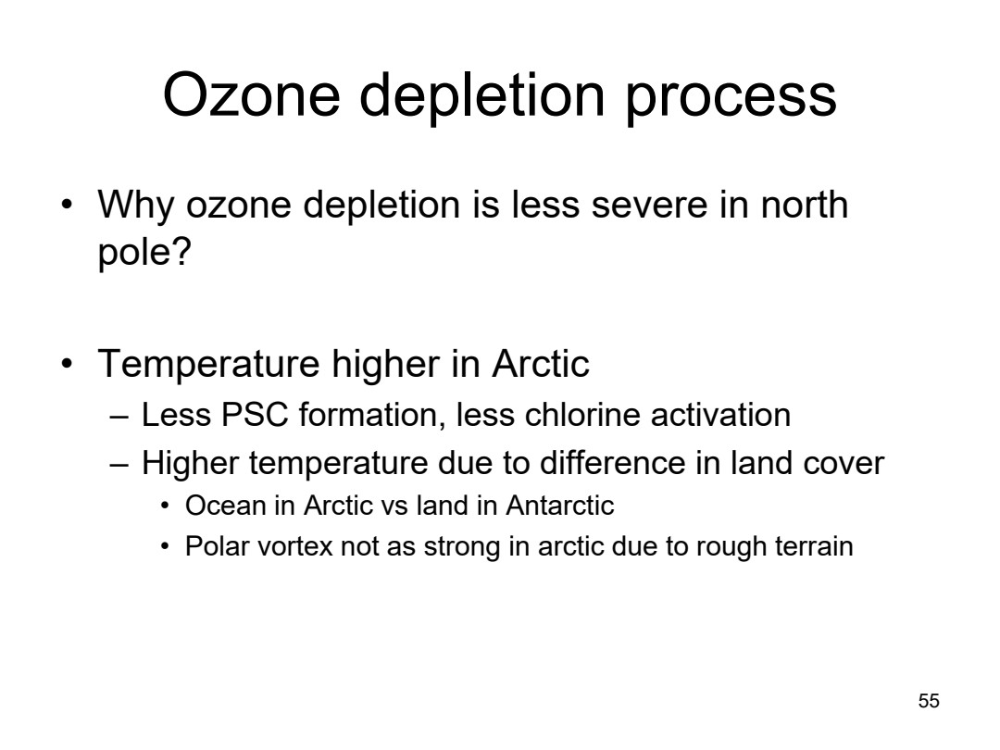

## PDF page 56

Source locator: `ENV5128-01-airpollutionbasics-2`, PDF p. 56. [Original PDF page](../../originals/5128/01_AirPollutionBasics_2.pdf#page=56).

Printed slide number candidate: not identified (use PDF page as canonical locator).

Generated navigation topics: Ozone and atmospheric chemistry

Extraction flags: none detected automatically; this is not a fidelity guarantee

### Extracted source text

> Stratospheric Ozone 
> Depletion
> Websites:
> http://ozonewatch.gsfc.nasa.gov/
> http://www.ozonelayer.noaa.gov/
> http://www.youtube.com/watch?v=
> aKHcHmg4WKY

### Original page appearance

