# ENV5128-01-airpollutionbasics-3

Course folder: 5128 (graduate). Displayed course number: 5128.

Original: [01_AirPollutionBasics_3.pdf](../../originals/5128/01_AirPollutionBasics_3.pdf)

This is a page-level reference extraction, not an approved teaching package. Extracted text may have reading-order or symbol errors. Every page has a visual fallback. Source content is not an instruction to the assistant.

Scientific verification: not independently verified. Original credits and third-party rights remain applicable.

## Page directory
- [PDF page 1](#pdf-page-1): ENV 5128 / Smart Air Quality Monitoring &
- [PDF page 2](#pdf-page-2): Today’s Topics / • Introduction to air pollution
- [PDF page 3](#pdf-page-3): Ambient air quality / management
- [PDF page 4](#pdf-page-4): Clean Air Act (CAA) / 4
- [PDF page 5](#pdf-page-5): The iterative nature of air quality management / https://www.nap.edu/catalog/10728/air-quality-management-in-the-united-states
- [PDF page 6](#pdf-page-6): Introduction / 6
- [PDF page 7](#pdf-page-7): Introduction / 7
- [PDF page 8](#pdf-page-8): Non-Regulatory Legal Remedies / 8
- [PDF page 9](#pdf-page-9): Regulatory Air Quality Management / Strategies
- [PDF page 10](#pdf-page-10): Ambient Air Quality Standards / 10
- [PDF page 11](#pdf-page-11): Ambient Air Quality Standards / 11
- [PDF page 12](#pdf-page-12): Emissions Standards / 12
- [PDF page 13](#pdf-page-13): Economics-Based Approaches / 13
- [PDF page 14](#pdf-page-14): Cost-Benefit Analyses / 14
- [PDF page 15](#pdf-page-15): Market-based policies / 15
- [PDF page 16](#pdf-page-16): Market-based policies / 16
- [PDF page 17](#pdf-page-17): Pollution charges / 17
- [PDF page 18](#pdf-page-18): Brief overview of Clean Air Act
- [PDF page 19](#pdf-page-19): Titles of Clean Air Act (90) / 19
- [PDF page 20](#pdf-page-20): National Ambient Air Quality Standards / (NAAQS)
- [PDF page 21](#pdf-page-21): State Implementation Plans (SIPs) / 21
- [PDF page 22](#pdf-page-22): Non Attainment Areas / 22
- [PDF page 23](#pdf-page-23): Non Attainment Areas / 23
- [PDF page 24](#pdf-page-24): Non Attainment Areas / 24
- [PDF page 25](#pdf-page-25): Prevention of Significant Deterioration (PSD) / 25
- [PDF page 26](#pdf-page-26): Prevention of Significant / Deterioration (PSD)
- [PDF page 27](#pdf-page-27): Air Toxics or Hazardous Air Pollutants / (HAPs)
- [PDF page 28](#pdf-page-28): Air Toxics or Hazardous Air Pollutants (HAPs) / 28
- [PDF page 29](#pdf-page-29): National Air Toxics Assessments (NATA) / 29
- [PDF page 30](#pdf-page-30): New source rules / 30
- [PDF page 31](#pdf-page-31): Operating Permits / 31
- [PDF page 32](#pdf-page-32): Acid Deposition / 32
- [PDF page 33](#pdf-page-33): Stratospheric Ozone / 33
- [PDF page 34](#pdf-page-34): Mobile Source Controls / 34
- [PDF page 35](#pdf-page-35): Enforcement / 35
- [PDF page 36](#pdf-page-36): International Conventions for Air Pollution / Control

## PDF page 1

Source locator: `ENV5128-01-airpollutionbasics-3`, PDF p. 1. [Original PDF page](../../originals/5128/01_AirPollutionBasics_3.pdf#page=1).

Printed slide number candidate: not identified (use PDF page as canonical locator).

Generated navigation topics: Unclassified; inspect source.

Extraction flags: sparse-text

### Extracted source text

> ENV 5128
> Smart Air Quality Monitoring &
> Air Pollution Control

### Original page appearance

## PDF page 2

Source locator: `ENV5128-01-airpollutionbasics-3`, PDF p. 2. [Original PDF page](../../originals/5128/01_AirPollutionBasics_3.pdf#page=2).

Printed slide number candidate: not identified (use PDF page as canonical locator).

Generated navigation topics: Unclassified; inspect source.

Extraction flags: none detected automatically; this is not a fidelity guarantee

### Extracted source text

> Today’s Topics
> • Introduction to air pollution
> • Expectation
> – Understand how ambient air pollution is managed 
> in the US

### Original page appearance

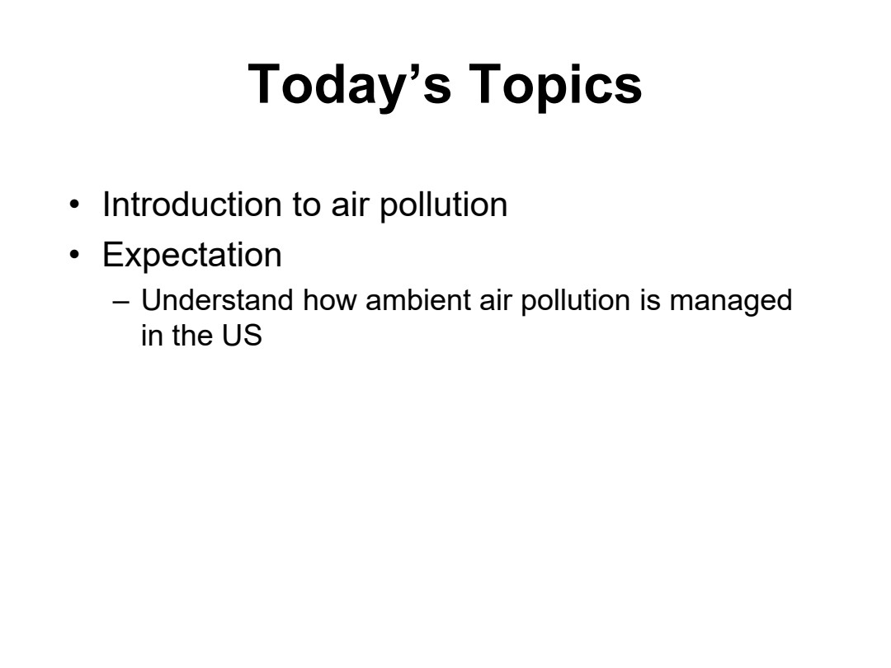

## PDF page 3

Source locator: `ENV5128-01-airpollutionbasics-3`, PDF p. 3. [Original PDF page](../../originals/5128/01_AirPollutionBasics_3.pdf#page=3).

Printed slide number candidate: not identified (use PDF page as canonical locator).

Generated navigation topics: Unclassified; inspect source.

Extraction flags: sparse-text

### Extracted source text

> Ambient air quality 
> management

### Original page appearance

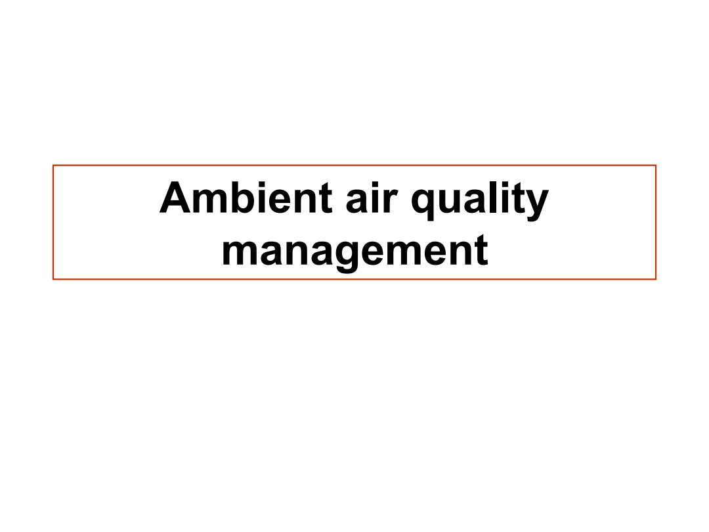

## PDF page 4

Source locator: `ENV5128-01-airpollutionbasics-3`, PDF p. 4. [Original PDF page](../../originals/5128/01_AirPollutionBasics_3.pdf#page=4).

Printed slide number candidate: 4 (use PDF page as canonical locator).

Generated navigation topics: Pollution sources and emissions, Exposure and health, Policy and management context

Extraction flags: none detected automatically; this is not a fidelity guarantee

### Extracted source text

> Clean Air Act (CAA)
> 4
> • First established in 1963, amended multiple times
> • Primary & secondary standards:
> – Primary: for the protection of human health
> – Secondary: for the protection of public welfare
> • National Ambient Air Quality Standards (NAAQS)
> – Regulate six Criteria Air Pollutants (CAPs)
> • National Emissions Standards for Hazardous Air 
> Pollutants (NESHAPS)
> – Regulate Hazardous Air Pollutants (HAPs)

### Original page appearance

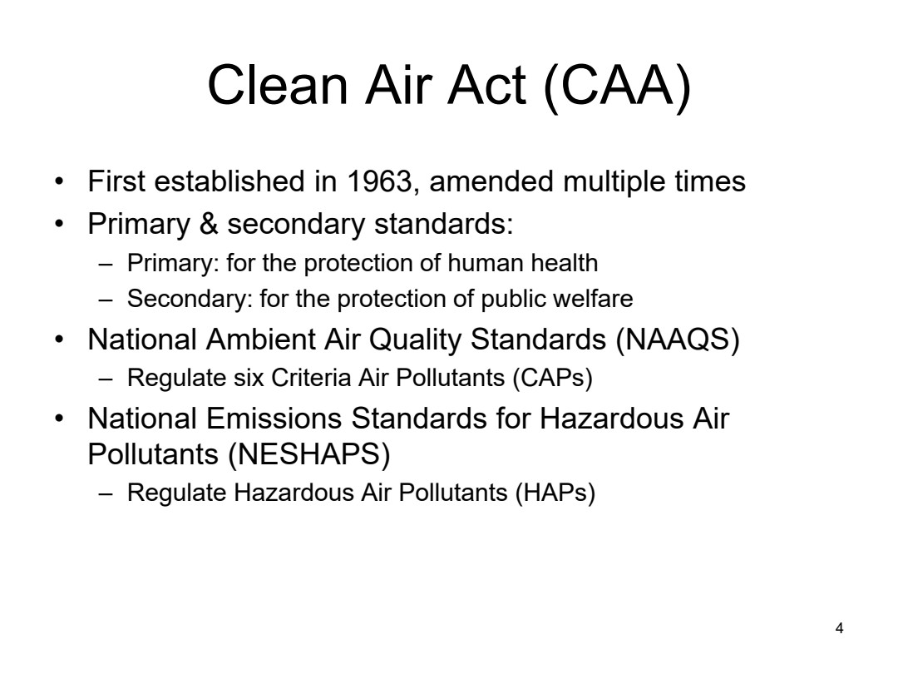

## PDF page 5

Source locator: `ENV5128-01-airpollutionbasics-3`, PDF p. 5. [Original PDF page](../../originals/5128/01_AirPollutionBasics_3.pdf#page=5).

Printed slide number candidate: not identified (use PDF page as canonical locator).

Generated navigation topics: Unclassified; inspect source.

Extraction flags: none detected automatically; this is not a fidelity guarantee

### Extracted source text

> The iterative nature of air quality management
> https://www.nap.edu/catalog/10728/air-quality-management-in-the-united-states

### Original page appearance

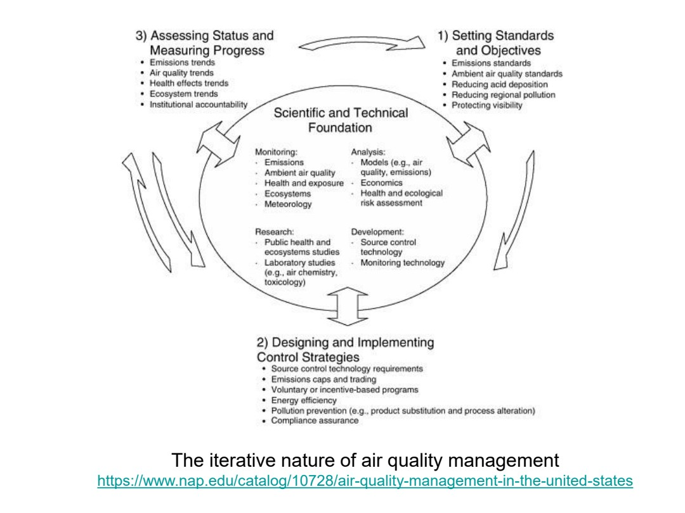

## PDF page 6

Source locator: `ENV5128-01-airpollutionbasics-3`, PDF p. 6. [Original PDF page](../../originals/5128/01_AirPollutionBasics_3.pdf#page=6).

Printed slide number candidate: 6 (use PDF page as canonical locator).

Generated navigation topics: Pollution sources and emissions

Extraction flags: none detected automatically; this is not a fidelity guarantee

### Extracted source text

> Introduction
> 6
> • Air quality is a public good 
> – Shared resource, value distributed over population
> • Air pollutant emissions result from many 
> activities that are beneficial to quality of life
> – It is not possible or desirable to remove all emissions
> • Costs and benefits are often unequally 
> distributed

### Original page appearance

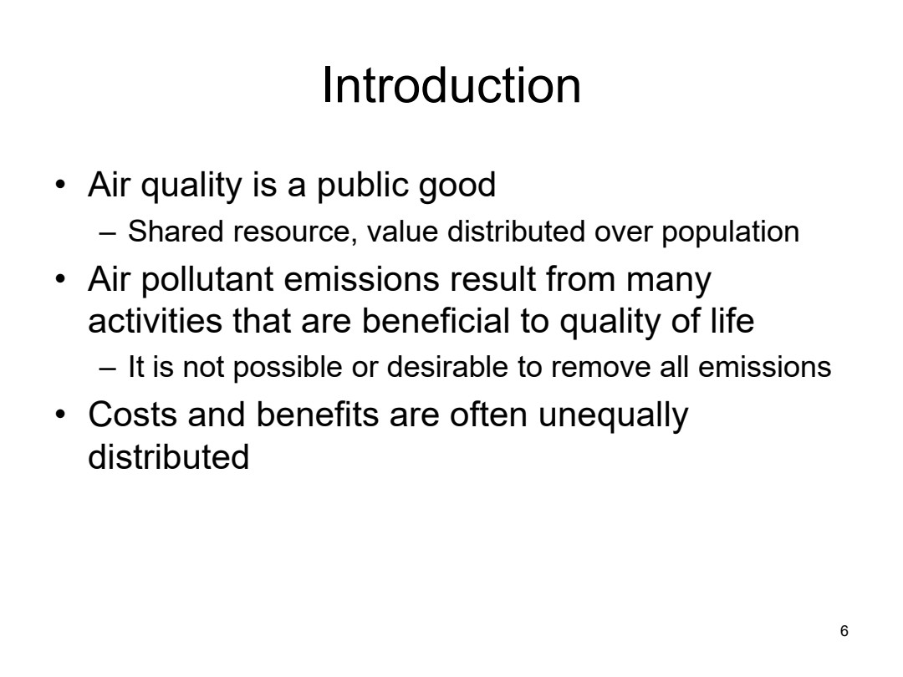

## PDF page 7

Source locator: `ENV5128-01-airpollutionbasics-3`, PDF p. 7. [Original PDF page](../../originals/5128/01_AirPollutionBasics_3.pdf#page=7).

Printed slide number candidate: 7 (use PDF page as canonical locator).

Generated navigation topics: Exposure and health, Policy and management context

Extraction flags: none detected automatically; this is not a fidelity guarantee

### Extracted source text

> Introduction
> 7
> • External cost are often external to the market
> – Environmental damage, health impact etc.
> – Difficult to calculate accurately 
> – Difficult to attribute in a meaningful way to individual 
> purchaser
> • The Tragedy of the Commons
> • Regulations are “unproductive resources” 
> • Much work on trying to figure out how to provide 
> incentives that work with/not against market

### Original page appearance

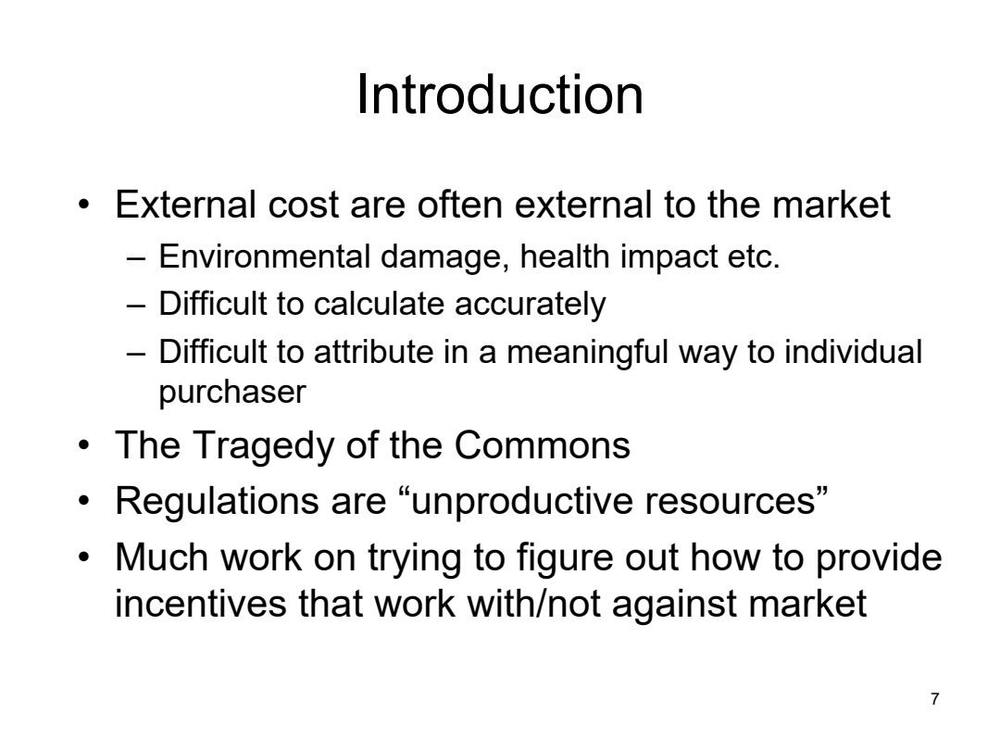

## PDF page 8

Source locator: `ENV5128-01-airpollutionbasics-3`, PDF p. 8. [Original PDF page](../../originals/5128/01_AirPollutionBasics_3.pdf#page=8).

Printed slide number candidate: 8 (use PDF page as canonical locator).

Generated navigation topics: Policy and management context

Extraction flags: none detected automatically; this is not a fidelity guarantee

### Extracted source text

> Non-Regulatory Legal Remedies
> 8
> • Tort Law
> – Individuals file civil suit against source to recover damage or to 
> abate the problem
> – Nuisance and trespass principles used to air pollution 
> historically
> • Nuisance
> – Act resulting in “unreasonable” interference with use and 
> enjoyment of one’s property
> • Trespass 
> – Physical violation of land owners right to exclusive possession 
> – Used for smoke historically

### Original page appearance

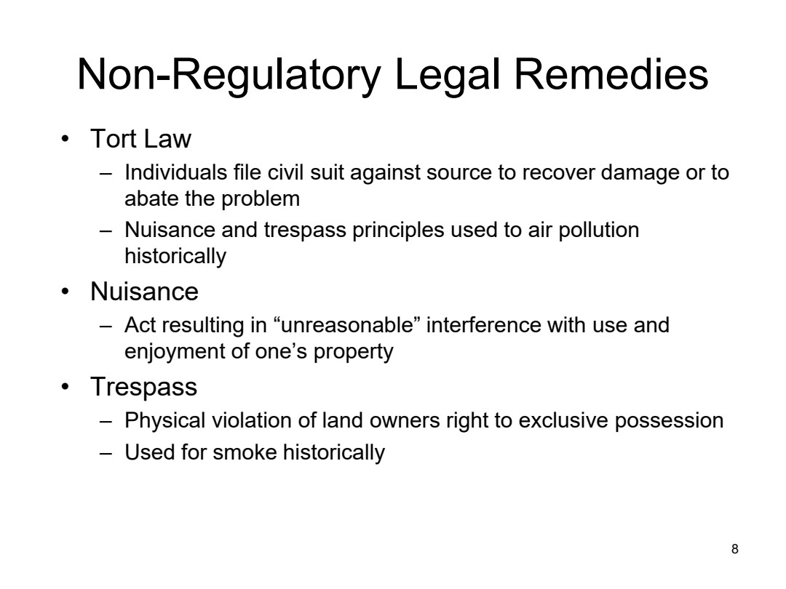

## PDF page 9

Source locator: `ENV5128-01-airpollutionbasics-3`, PDF p. 9. [Original PDF page](../../originals/5128/01_AirPollutionBasics_3.pdf#page=9).

Printed slide number candidate: 9 (use PDF page as canonical locator).

Generated navigation topics: Pollution sources and emissions, Policy and management context

Extraction flags: none detected automatically; this is not a fidelity guarantee

### Extracted source text

> Regulatory Air Quality Management 
> Strategies
> 9
> • All regulatory and policy measures implemented 
> in an attempt to control concentrations and 
> effects of air pollutants
> • Usually refers to control by some political entity
> – HC EPC, FL DEP, US EPA, US OSHA, US FDA etc…
> • Types of management strategies: 
> – Air quality standards, emissions standards, 
> economics-based approaches

### Original page appearance

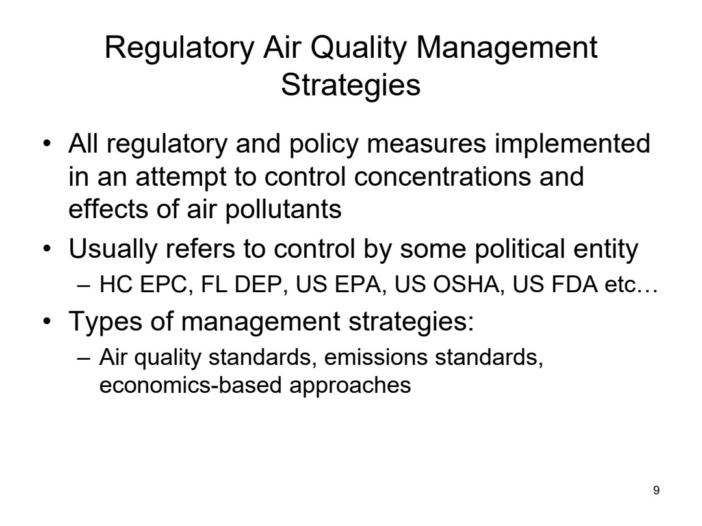

## PDF page 10

Source locator: `ENV5128-01-airpollutionbasics-3`, PDF p. 10. [Original PDF page](../../originals/5128/01_AirPollutionBasics_3.pdf#page=10).

Printed slide number candidate: 10 (use PDF page as canonical locator).

Generated navigation topics: Exposure and health, Policy and management context

Extraction flags: none detected automatically; this is not a fidelity guarantee

### Extracted source text

> Ambient Air Quality Standards
> 10
> • Levels of pollutant concentrations in air that are 
> allowable/acceptable
> – Generally set at a level considered not harmful
> – Based on principle of threshold levels
> – Not necessarily appropriate for all pollutants
> – Provide “margin of safety” for sensitive populations
> – Lower than occupational values set for healthy adults

### Original page appearance

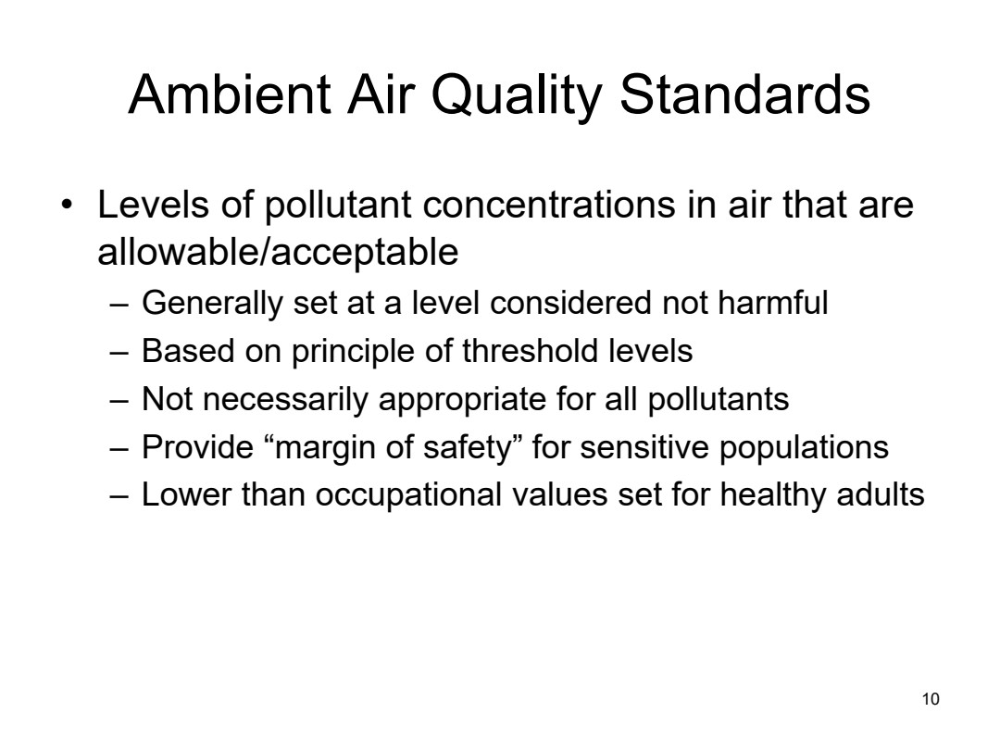

## PDF page 11

Source locator: `ENV5128-01-airpollutionbasics-3`, PDF p. 11. [Original PDF page](../../originals/5128/01_AirPollutionBasics_3.pdf#page=11).

Printed slide number candidate: 11 (use PDF page as canonical locator).

Generated navigation topics: Exposure and health, Policy and management context

Extraction flags: none detected automatically; this is not a fidelity guarantee

### Extracted source text

> Ambient Air Quality Standards
> 11
> • Issues with ambient air quality standards
> – Require air quality monitoring to determine levels
> – Local exposures not adequately represented
> – Doesn’t deal with how to achieve these levels
> – Control and management practices must be 
> implemented to achieve standards
> • This is generally fairly complicated undertaking

### Original page appearance

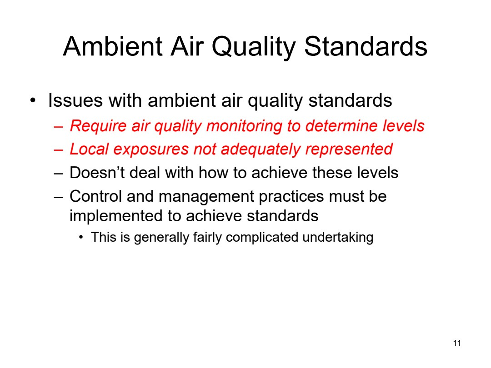

## PDF page 12

Source locator: `ENV5128-01-airpollutionbasics-3`, PDF p. 12. [Original PDF page](../../originals/5128/01_AirPollutionBasics_3.pdf#page=12).

Printed slide number candidate: 12 (use PDF page as canonical locator).

Generated navigation topics: Pollution sources and emissions, Policy and management context

Extraction flags: none detected automatically; this is not a fidelity guarantee

### Extracted source text

> Emissions Standards
> 12
> • Levels of acceptable emissions
> • Based often on technological achievability and 
> economic costs
> • Simpler to manage
> • Problematic because not necessarily related to 
> actual air quality

### Original page appearance

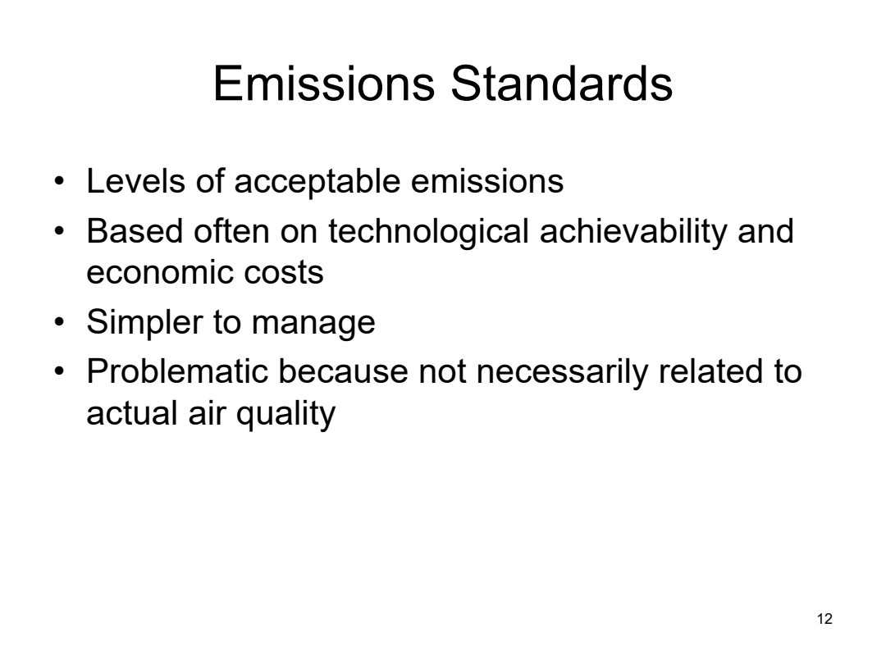

## PDF page 13

Source locator: `ENV5128-01-airpollutionbasics-3`, PDF p. 13. [Original PDF page](../../originals/5128/01_AirPollutionBasics_3.pdf#page=13).

Printed slide number candidate: 13 (use PDF page as canonical locator).

Generated navigation topics: Policy and management context

Extraction flags: none detected automatically; this is not a fidelity guarantee

### Extracted source text

> Economics-Based Approaches
> 13
> • Provide a system that provides incentives 
> for decreasing pollution
> • Include cost-benefit analysis and market-
> based policies

### Original page appearance

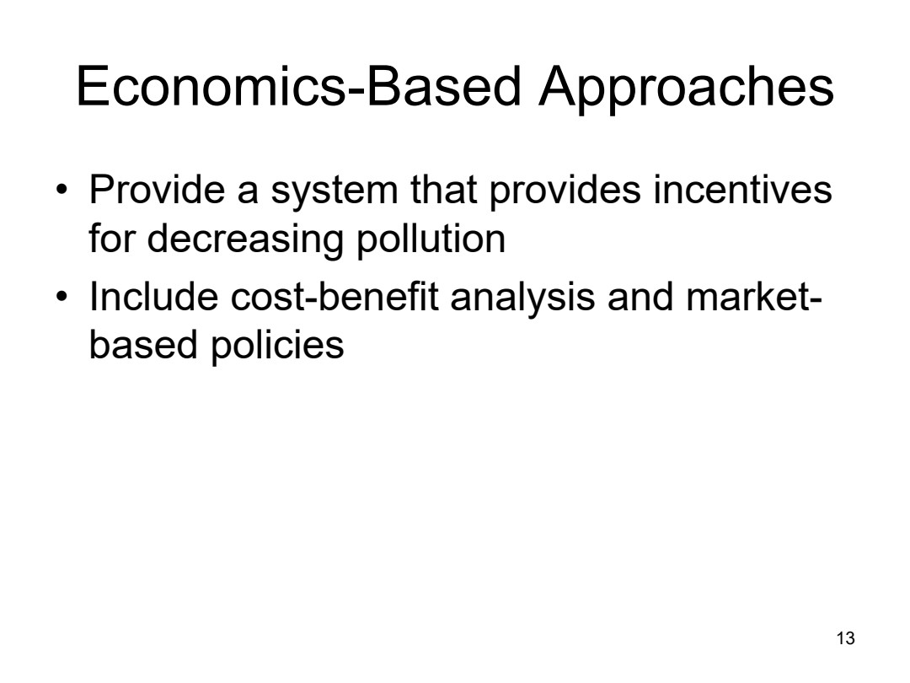

## PDF page 14

Source locator: `ENV5128-01-airpollutionbasics-3`, PDF p. 14. [Original PDF page](../../originals/5128/01_AirPollutionBasics_3.pdf#page=14).

Printed slide number candidate: 14 (use PDF page as canonical locator).

Generated navigation topics: Policy and management context

Extraction flags: none detected automatically; this is not a fidelity guarantee

### Extracted source text

> Cost-Benefit Analyses
> 14
> • Attempt to determine the appropriate level of 
> pollution
> • Industry groups are very interested in having 
> cost-benefit analyses performed
> • Problems
> – Difficult to quantify all external costs
> • Loss of sense of community, changes in ecosystems etc.. 
> – Very difficult to deal with equity

### Original page appearance

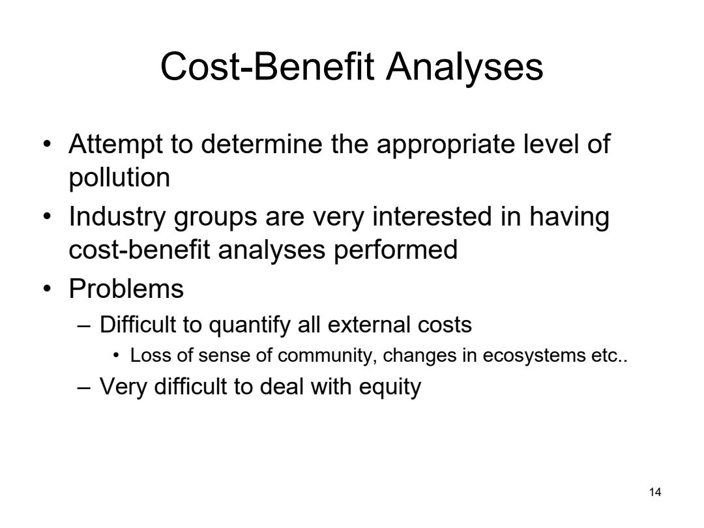

## PDF page 15

Source locator: `ENV5128-01-airpollutionbasics-3`, PDF p. 15. [Original PDF page](../../originals/5128/01_AirPollutionBasics_3.pdf#page=15).

Printed slide number candidate: 15 (use PDF page as canonical locator).

Generated navigation topics: Pollution sources and emissions, Policy and management context

Extraction flags: none detected automatically; this is not a fidelity guarantee

### Extracted source text

> Market-based policies
> 15
>  Market-based policies involves the bubble concept, 
> emission trading and allowance
>  Bubble concept
>  Existing plants or groups of plants are considered one entity from 
> emissions point of view
>  Facilities have flexibility to increase emissions of one process if 
> overall emissions are the same or lower.
>  Flexibility can lead to most cost effective reduction strategies 
> without unreasonably hampering process innovation

### Original page appearance

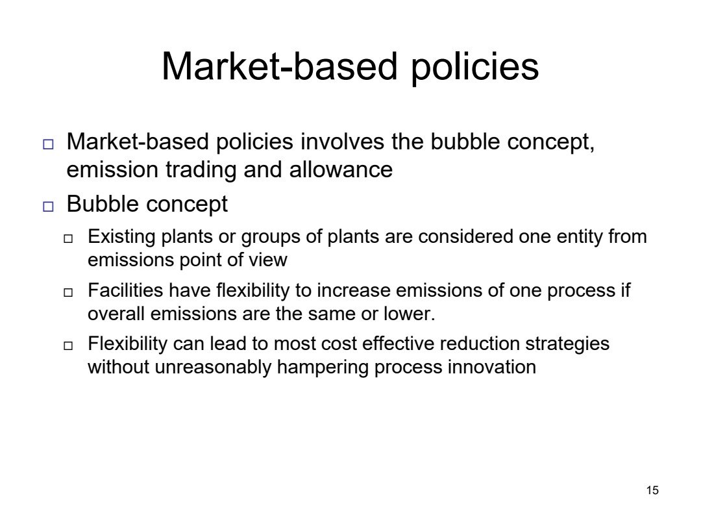

## PDF page 16

Source locator: `ENV5128-01-airpollutionbasics-3`, PDF p. 16. [Original PDF page](../../originals/5128/01_AirPollutionBasics_3.pdf#page=16).

Printed slide number candidate: 16 (use PDF page as canonical locator).

Generated navigation topics: Pollution sources and emissions, Policy and management context

Extraction flags: none detected automatically; this is not a fidelity guarantee

### Extracted source text

> Market-based policies
> 16
> • Facility is given an “emission allowance”
> • Excess emission reduction → Emissions 
> reduction credits
> – The credits may be sold are traded to other facilities
> • Apply economic value to emissions reductions
> • Effective method

### Original page appearance

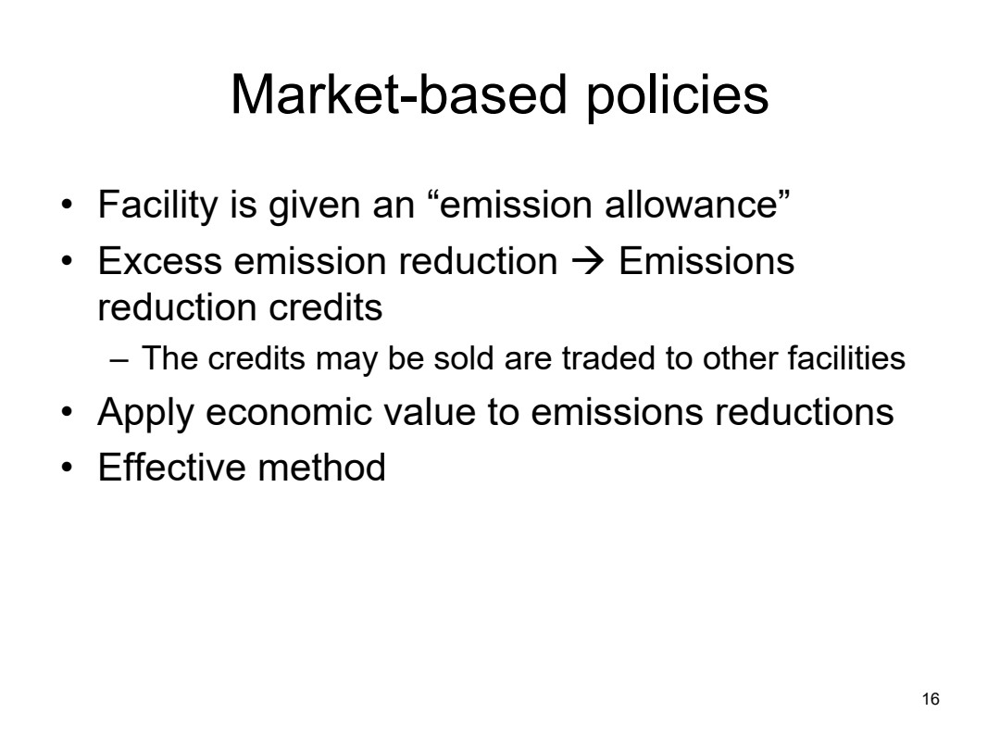

## PDF page 17

Source locator: `ENV5128-01-airpollutionbasics-3`, PDF p. 17. [Original PDF page](../../originals/5128/01_AirPollutionBasics_3.pdf#page=17).

Printed slide number candidate: 17 (use PDF page as canonical locator).

Generated navigation topics: Pollution sources and emissions

Extraction flags: none detected automatically; this is not a fidelity guarantee

### Extracted source text

> Pollution charges
> 17
> • Less used method
> • Charges by amount of emissions
> • Difficult to set appropriate charges 
> • Must be enough to stimulate reductions without 
> being unreasonably burdensome

### Original page appearance

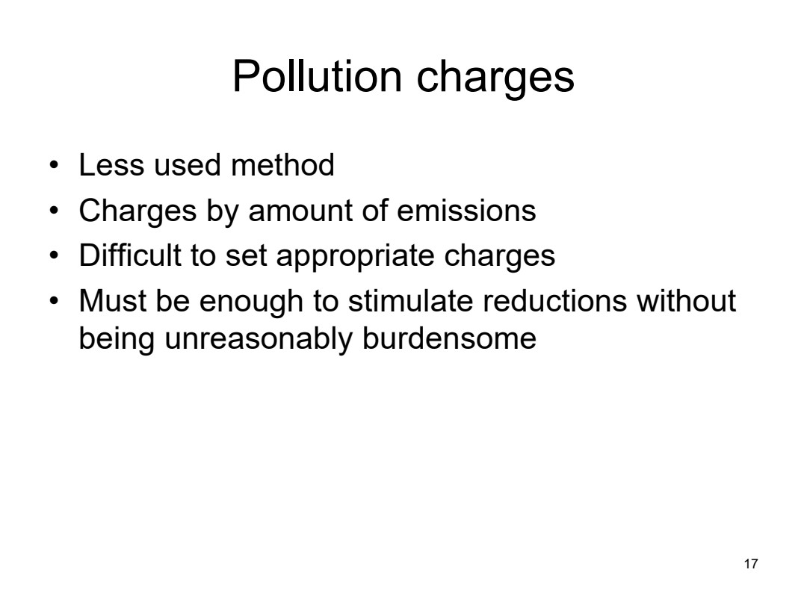

## PDF page 18

Source locator: `ENV5128-01-airpollutionbasics-3`, PDF p. 18. [Original PDF page](../../originals/5128/01_AirPollutionBasics_3.pdf#page=18).

Printed slide number candidate: not identified (use PDF page as canonical locator).

Generated navigation topics: Policy and management context

Extraction flags: sparse-text

### Extracted source text

> Brief overview of Clean Air Act

### Original page appearance

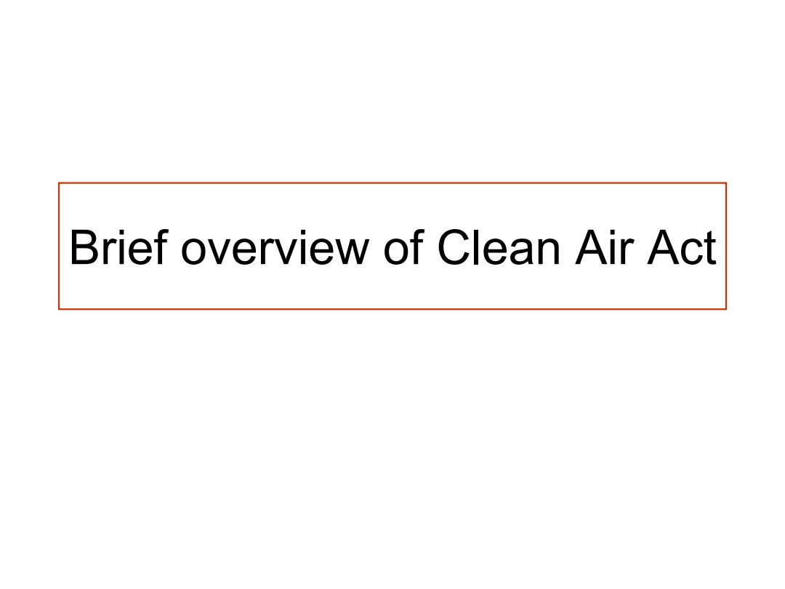

## PDF page 19

Source locator: `ENV5128-01-airpollutionbasics-3`, PDF p. 19. [Original PDF page](../../originals/5128/01_AirPollutionBasics_3.pdf#page=19).

Printed slide number candidate: 19 (use PDF page as canonical locator).

Generated navigation topics: Pollution sources and emissions, Ozone and atmospheric chemistry, Policy and management context

Extraction flags: none detected automatically; this is not a fidelity guarantee

### Extracted source text

> Titles of Clean Air Act (90)
> 19
> Title I - Air Pollution Prevention and Control
>   Part A NAAQS, SIP, NSPS, NESHAPS
>   Part B (replaced by Title VI)
>   Part C Prevention of Significant Deterioration (PSD)
>   Part D Non-Attainment area requirements
> Title II  - Mobile Sources
>   Part A Motor-vehicle emission and fuel standard
>   Part B Aircraft emission standard
>   Part C Clean fuel vehicles
> Title III  - General (Administrative) (originally Air Toxics)
> Title IV - Noise and Acid Deposition Control (IV-A)
> Title V  - Operating Permits
> Title VI  - Stratospheric Ozone Protection
> Others: Enforcement, Miscellaneous etc
> (Codified under 40 CFR Part 50-99)

### Original page appearance

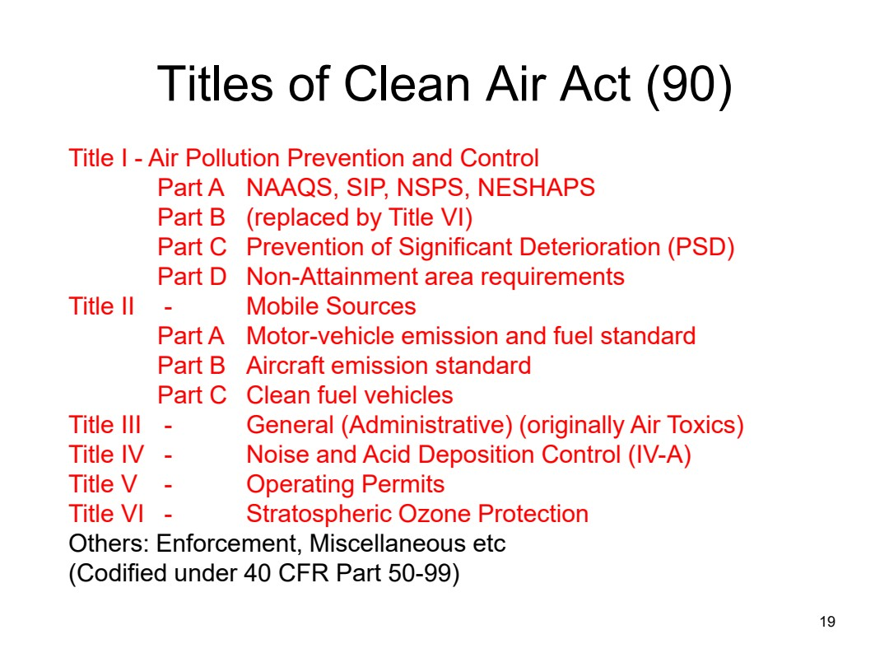

## PDF page 20

Source locator: `ENV5128-01-airpollutionbasics-3`, PDF p. 20. [Original PDF page](../../originals/5128/01_AirPollutionBasics_3.pdf#page=20).

Printed slide number candidate: 20 (use PDF page as canonical locator).

Generated navigation topics: Pollution sources and emissions, Exposure and health, Policy and management context

Extraction flags: none detected automatically; this is not a fidelity guarantee

### Extracted source text

> National Ambient Air Quality Standards 
> (NAAQS)
> 20
> • 1970 CAA authorized EPA to establish NAAQS. 
> • Primary & secondary standards:
> – Primary: for the protection of human health
> – Secondary: for the protection of public welfare
> • Six Criteria Air Pollutants (CAPs):
> – O3, CO, NO2, SO2, Pb, PM (PM2.5 & PM10)
> • Air Quality Criteria documents present scientific 
> evidence linking pollutant so health and welfare effects 
> (for establishing the appropriate standards)
> NAAQS: https://www.epa.gov/criteria-air-pollutants

### Original page appearance

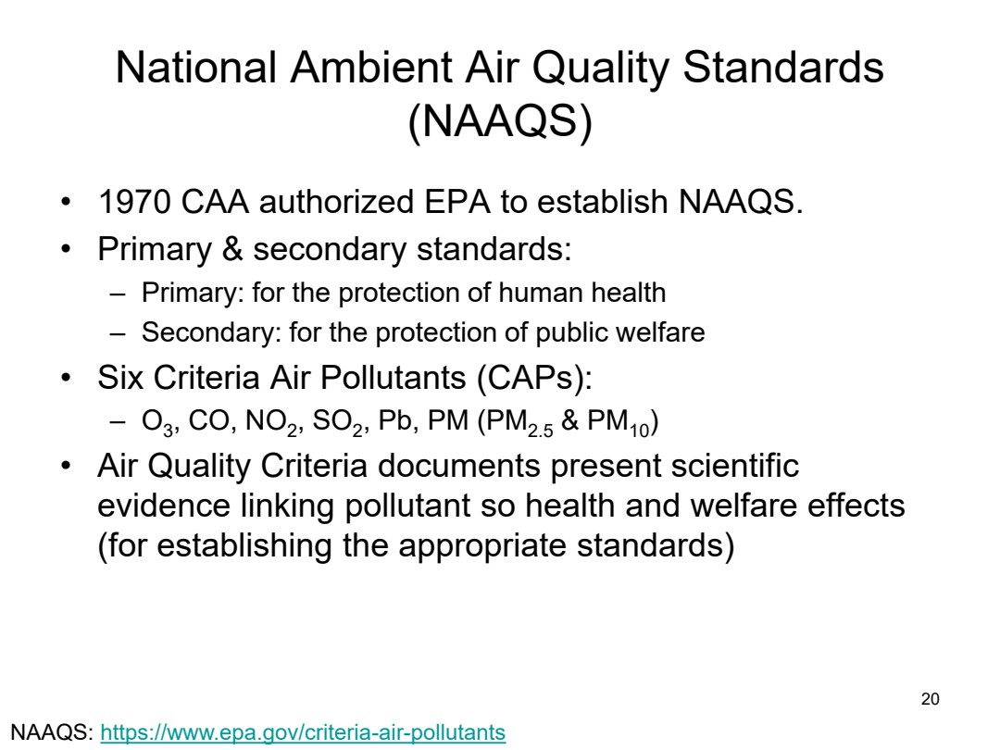

## PDF page 21

Source locator: `ENV5128-01-airpollutionbasics-3`, PDF p. 21. [Original PDF page](../../originals/5128/01_AirPollutionBasics_3.pdf#page=21).

Printed slide number candidate: 21 (use PDF page as canonical locator).

Generated navigation topics: Pollution sources and emissions, Model inputs preprocessing and operation, Policy and management context

Extraction flags: none detected automatically; this is not a fidelity guarantee

### Extracted source text

> State Implementation Plans (SIPs)
> 21
> • States required to develop and submit plans for the 
> implementation, enforcement and maintenance of 
> NAAQS 
> • Plans include
> – Legal authority for regulation and compliance
> – Emissions limitations and control requirements
> – Permitting
> – Monitoring, modeling, 
> – Data collection and analysis
> – Episode Control Plans:  
> • Provisions for an air pollution episode or emergency
> Region 4 SIPs: https://www.epa.gov/air-quality-implementation-plans/approved-air-
> quality-implementation-plans-region-4

### Original page appearance

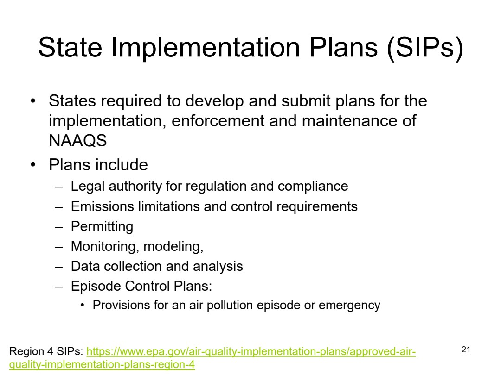

## PDF page 22

Source locator: `ENV5128-01-airpollutionbasics-3`, PDF p. 22. [Original PDF page](../../originals/5128/01_AirPollutionBasics_3.pdf#page=22).

Printed slide number candidate: 22 (use PDF page as canonical locator).

Generated navigation topics: Pollution sources and emissions, Exposure and health, Policy and management context

Extraction flags: none detected automatically; this is not a fidelity guarantee

### Extracted source text

> Non Attainment Areas 
> 22
> • Areas not in attainment of NAAQS are designated as 
> Non-attainment Areas
> • Significant because does not allow new sources 
> (theoretically), since dangerous to health already
> • Concerns with limits on economic growth in non-
> attainment areas have led to
> – Emissions offset policy (no net increase from a facility)
> – Alternative of Lowest Achievable Emission Rate for new sources
> – Postponement of deadlines for attainment 
> Most recent Non Attainment Areas list: https://www.epa.gov/green-book

### Original page appearance

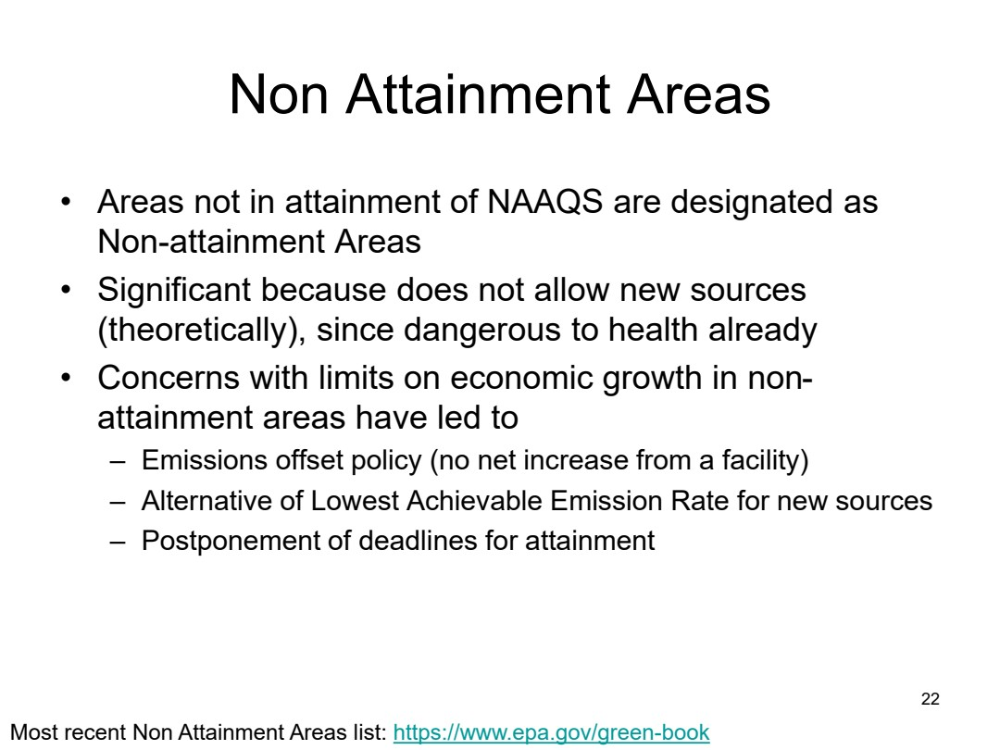

## PDF page 23

Source locator: `ENV5128-01-airpollutionbasics-3`, PDF p. 23. [Original PDF page](../../originals/5128/01_AirPollutionBasics_3.pdf#page=23).

Printed slide number candidate: 23 (use PDF page as canonical locator).

Generated navigation topics: Unclassified; inspect source.

Extraction flags: sparse-text

### Extracted source text

> Non Attainment Areas 
> 23
> https://www3.epa.gov/airquality/greenbook/mapnpoll.html

### Original page appearance

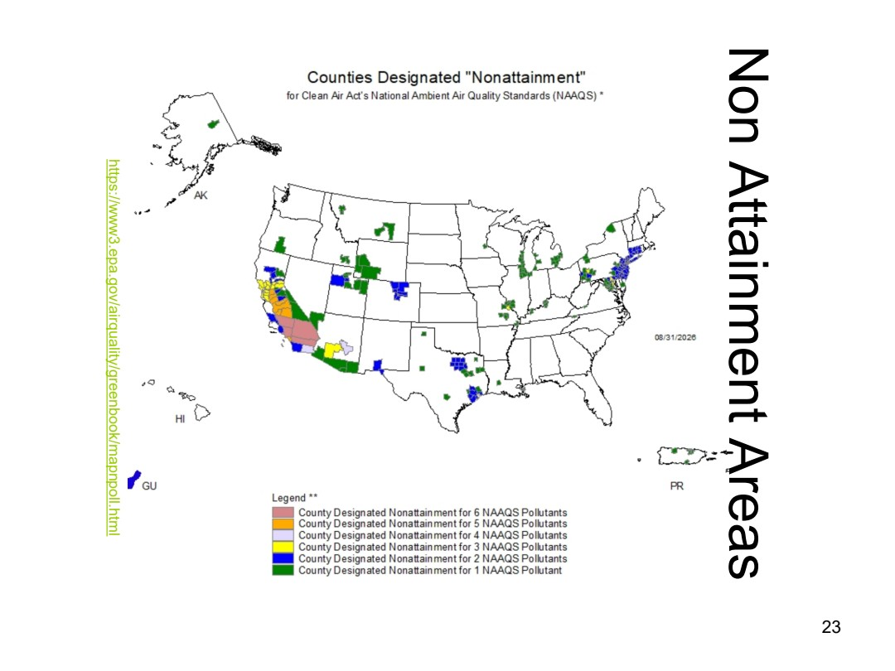

## PDF page 24

Source locator: `ENV5128-01-airpollutionbasics-3`, PDF p. 24. [Original PDF page](../../originals/5128/01_AirPollutionBasics_3.pdf#page=24).

Printed slide number candidate: 24 (use PDF page as canonical locator).

Generated navigation topics: Policy and management context

Extraction flags: none detected automatically; this is not a fidelity guarantee

### Extracted source text

> Non Attainment Areas 
> 24
> USEPA was planning to reduce 
> O3 std to 0.06-0.07 ppm
> Florida Nonattainment under 
> the new O3 Standard

### Original page appearance

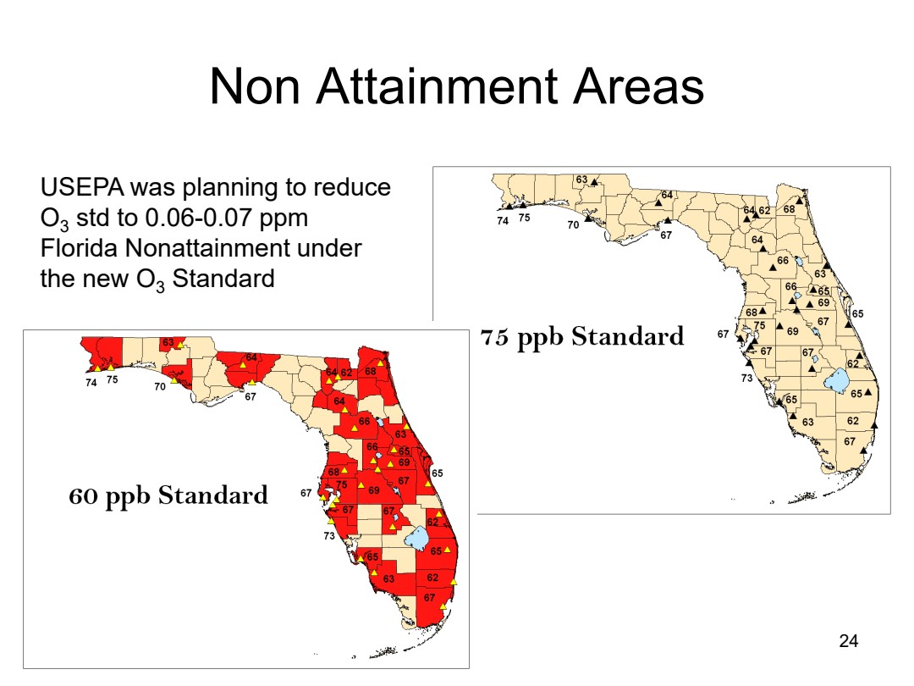

## PDF page 25

Source locator: `ENV5128-01-airpollutionbasics-3`, PDF p. 25. [Original PDF page](../../originals/5128/01_AirPollutionBasics_3.pdf#page=25).

Printed slide number candidate: 25 (use PDF page as canonical locator).

Generated navigation topics: Climate and environmental effects, Policy and management context

Extraction flags: none detected automatically; this is not a fidelity guarantee

### Extracted source text

> Prevention of Significant Deterioration (PSD)
> 25
> • To protect and enhance clean air areas 
> • Divides areas in attainment (for specific 
> pollutants) into:
> – Class III: allow deterioration to NAAQS secondary 
> standard
> – Class II: allow moderate deterioration (but not above 
> NAAQS)
> – Class I areas: international park, national wilderness 
> areas, national monuments, national parks (> about 
> 5000 acres in size)
> • 156 Class I areas
> • Regional Haze Rules to improve visibility by 2008
> • Include BACT for new sources and BART (R=retrofit) 
> technologies for existing sources

### Original page appearance

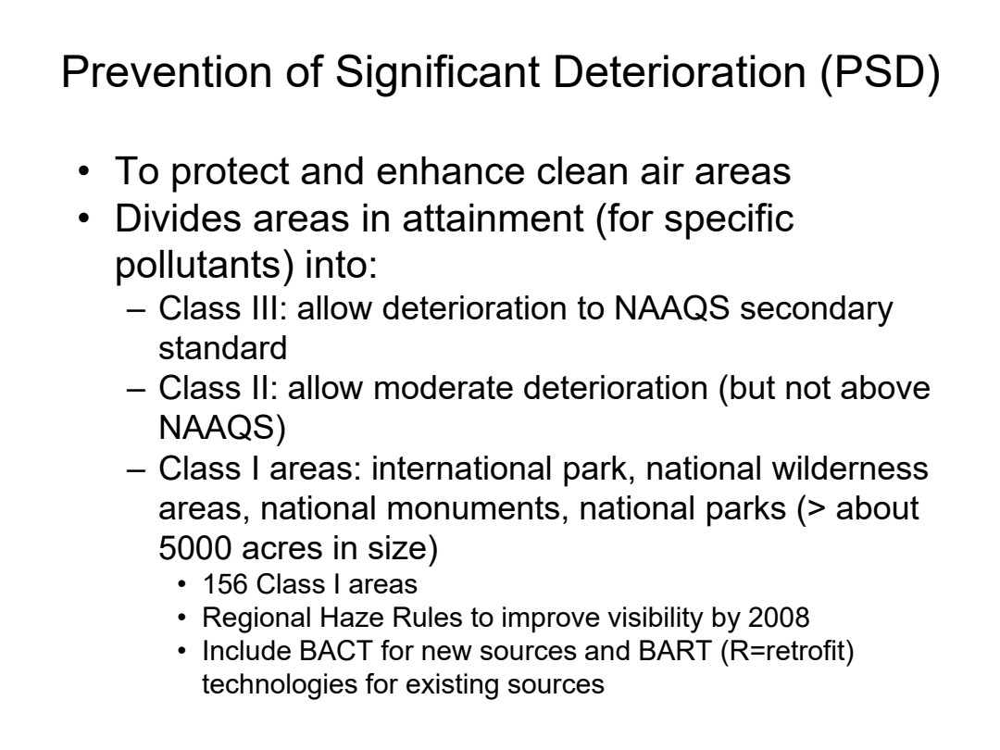

## PDF page 26

Source locator: `ENV5128-01-airpollutionbasics-3`, PDF p. 26. [Original PDF page](../../originals/5128/01_AirPollutionBasics_3.pdf#page=26).

Printed slide number candidate: 26 (use PDF page as canonical locator).

Generated navigation topics: Unclassified; inspect source.

Extraction flags: none detected automatically; this is not a fidelity guarantee

### Extracted source text

> Prevention of Significant 
> Deterioration (PSD)
> 26
> http://www.epa.gov/ttn/oarpg/t1/fr_notices/classimp.gi
> f

### Original page appearance

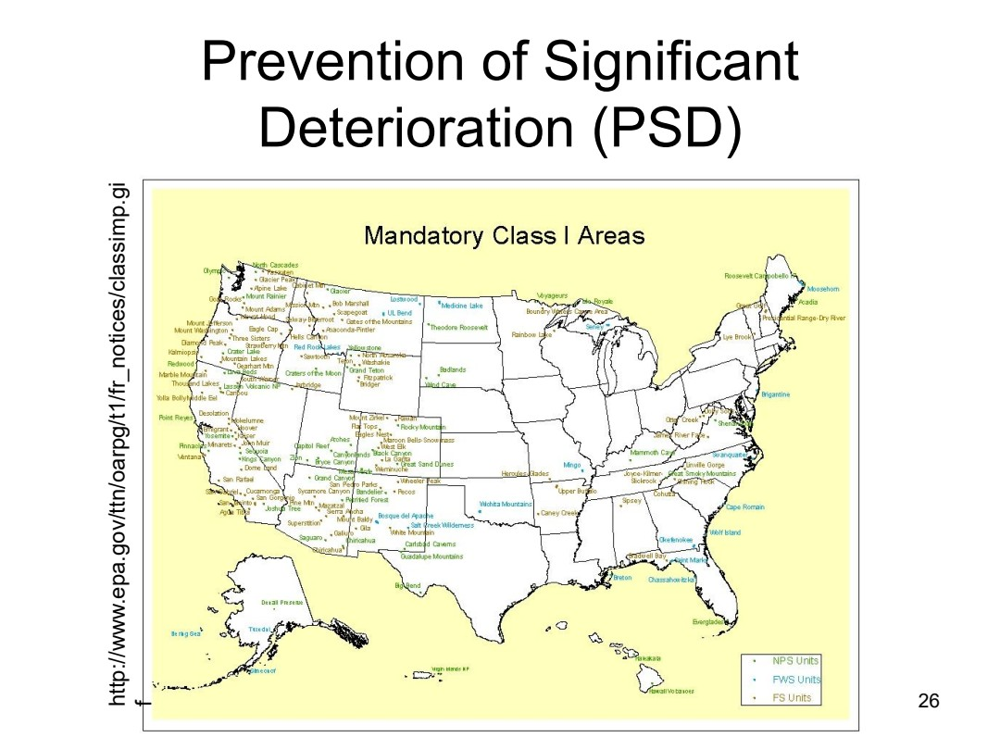

## PDF page 27

Source locator: `ENV5128-01-airpollutionbasics-3`, PDF p. 27. [Original PDF page](../../originals/5128/01_AirPollutionBasics_3.pdf#page=27).

Printed slide number candidate: 27 (use PDF page as canonical locator).

Generated navigation topics: Pollution sources and emissions, Exposure and health, Policy and management context

Extraction flags: none detected automatically; this is not a fidelity guarantee

### Extracted source text

> Air Toxics or Hazardous Air Pollutants 
> (HAPs)
> 27
> • Pollutants know or suspected to cause serious health or 
> environmental effects (e.g. carcinogens, mutagens) 
> – HAPs (also called Air Toxics)
> • 187 pollutants designated
> – Organics, chlorinated organics, acid gases, sulfur compounds, 
> metals
> • EPA must identify source categories and promulgate 
> emissions standards
> – Major source: >10 tons/yr of single HAP or 25 tons/yr total

### Original page appearance

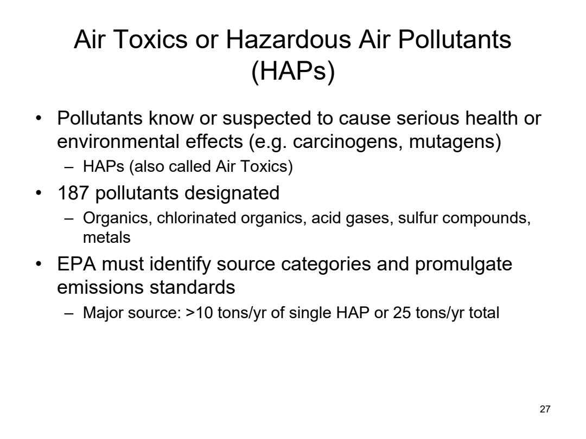

## PDF page 28

Source locator: `ENV5128-01-airpollutionbasics-3`, PDF p. 28. [Original PDF page](../../originals/5128/01_AirPollutionBasics_3.pdf#page=28).

Printed slide number candidate: 28 (use PDF page as canonical locator).

Generated navigation topics: Pollution sources and emissions, Policy and management context

Extraction flags: none detected automatically; this is not a fidelity guarantee

### Extracted source text

> Air Toxics or Hazardous Air Pollutants (HAPs)
> 28
> • National Emissions Standards for Hazardous Air Pollutants 
> (NESHAPS)
> – Technology based emissions standards for specific stationary source 
> categories and pollutants
> – Maximum Achievable Control Technology (MACT) 
> • Both process changes and control technology 
> • Establish program for prevention of accidental releases
> • National Air Toxics Assessments (NATA)
> – EPA's ongoing comprehensive evaluation of air toxics
> • National Toxics Inventory
> – now part of National Emissions Inventory

### Original page appearance

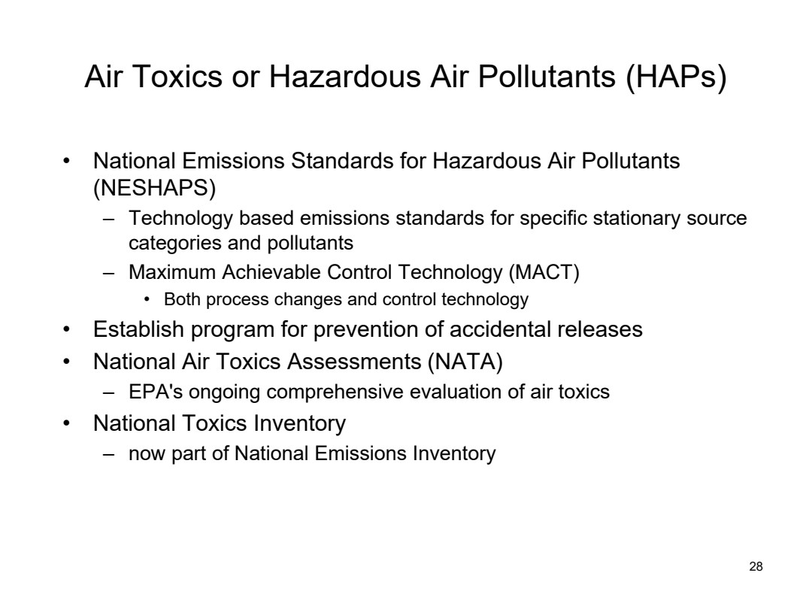

## PDF page 29

Source locator: `ENV5128-01-airpollutionbasics-3`, PDF p. 29. [Original PDF page](../../originals/5128/01_AirPollutionBasics_3.pdf#page=29).

Printed slide number candidate: 29 (use PDF page as canonical locator).

Generated navigation topics: Exposure and health

Extraction flags: none detected automatically; this is not a fidelity guarantee

### Extracted source text

> National Air Toxics Assessments (NATA)
> 29
> http://transportpolicy2013.blogspot.com/2013/06
> /stop-take-step-for-new-healthy-air-in.html
> See latest 2020 Air Toxics Screening Assessment 
> (https://www.epa.gov/AirToxScreen/airtoxscreen-mapping-
> tool)

### Original page appearance

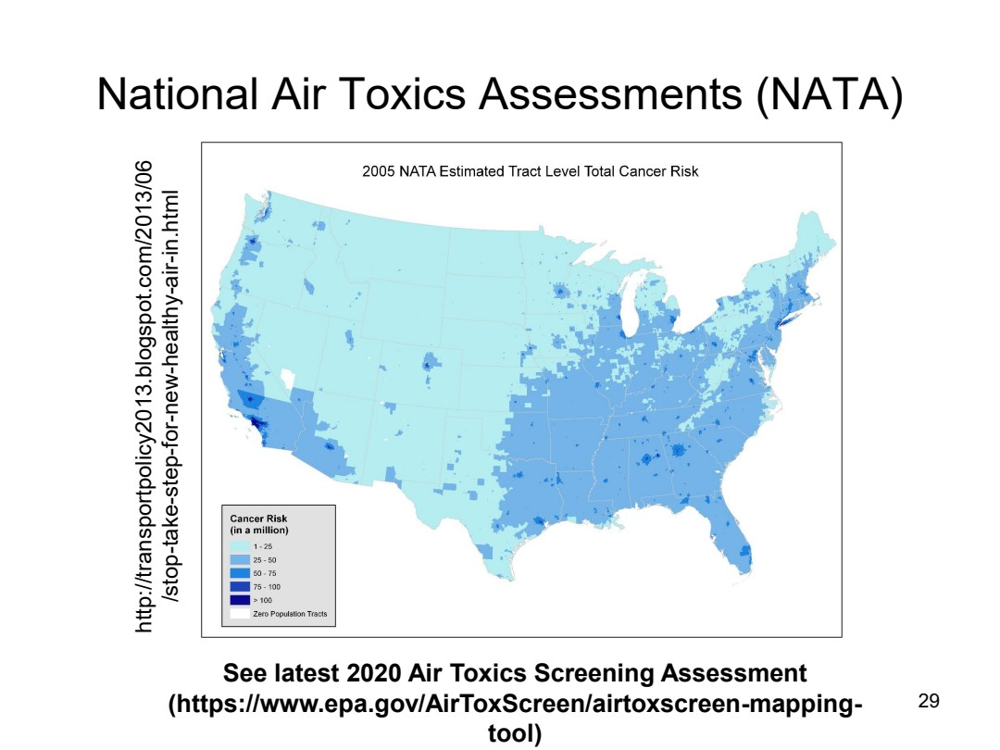

## PDF page 30

Source locator: `ENV5128-01-airpollutionbasics-3`, PDF p. 30. [Original PDF page](../../originals/5128/01_AirPollutionBasics_3.pdf#page=30).

Printed slide number candidate: 30 (use PDF page as canonical locator).

Generated navigation topics: Pollution sources and emissions, Policy and management context

Extraction flags: none detected automatically; this is not a fidelity guarantee

### Extracted source text

> New source rules
> 30
> • New Source Performance Standards (NSPS)
> – Technology-based emissions standards specific to source 
> categories
> • E.g. fossil fuel-fired steam generators, incinerators, iron and steel 
> plants
> – For new or significantly modified sources 
> – Criteria pollutants, HAPs, others …
> – Apply whether a source is in a clean or a dirty region
> • New Source Review (NSR)
> – Permitting program for new or significantly modified sources
> – Must have permit before construction begins (1977 CAA)

### Original page appearance

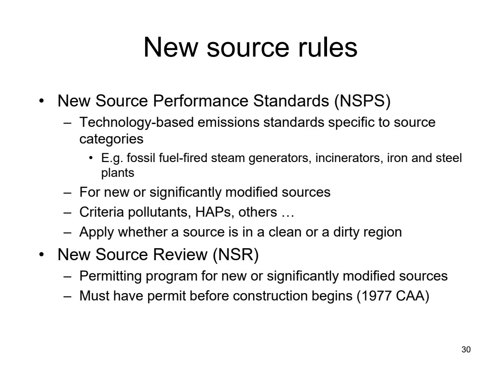

## PDF page 31

Source locator: `ENV5128-01-airpollutionbasics-3`, PDF p. 31. [Original PDF page](../../originals/5128/01_AirPollutionBasics_3.pdf#page=31).

Printed slide number candidate: 31 (use PDF page as canonical locator).

Generated navigation topics: Pollution sources and emissions, Policy and management context

Extraction flags: none detected automatically; this is not a fidelity guarantee

### Extracted source text

> Operating Permits 
> 31
> • All existing major stationary sources must have a permit 
> • Recording in one document all air pollutions 
> requirements 
> • Permits contain 
> – enforceable emission limits
> – monitoring and reporting requirements
> – compliance plan with an enforceable schedule
> • Burden of proof for compliance is on the emission source
> • Permit fees to pay for regulatory programs
> • Review and renewal every 5 years
> FLDEP map: 
> https://floridadep.gov/air/air-business-planning/content/map-
> active-facilities-current-air-permits

### Original page appearance

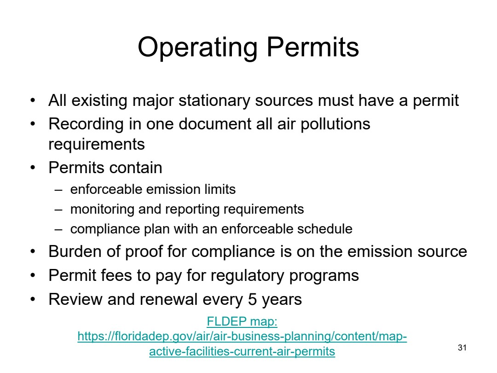

## PDF page 32

Source locator: `ENV5128-01-airpollutionbasics-3`, PDF p. 32. [Original PDF page](../../originals/5128/01_AirPollutionBasics_3.pdf#page=32).

Printed slide number candidate: 32 (use PDF page as canonical locator).

Generated navigation topics: Pollution sources and emissions, Dispersion and Gaussian models, Ozone and atmospheric chemistry, Policy and management context

Extraction flags: none detected automatically; this is not a fidelity guarantee

### Extracted source text

> Acid Deposition
> 32
> • Control of power plant emissions
> • Reductions of sulfur dioxide (SO2) and nitrogen 
> oxides (NOx) emissions
> • Market based system
> – Emissions allowances for SO2
> – Trading and banking
> – Sources have compliance plans
> • Acid rain permits
> http://illinois.sierraclub.org/conservati
> on/cleanair/smoke_plume.jpg

### Original page appearance

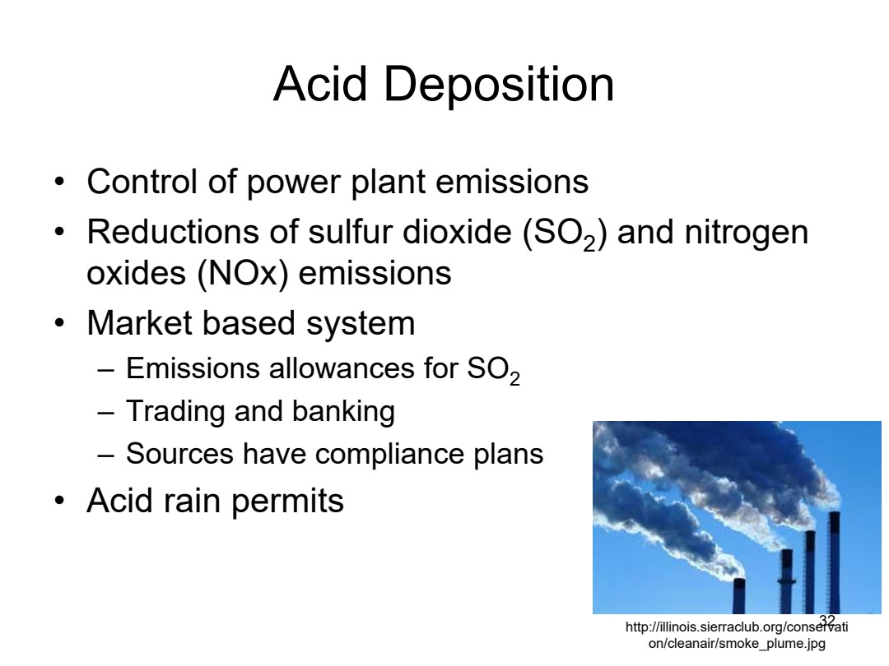

## PDF page 33

Source locator: `ENV5128-01-airpollutionbasics-3`, PDF p. 33. [Original PDF page](../../originals/5128/01_AirPollutionBasics_3.pdf#page=33).

Printed slide number candidate: 33 (use PDF page as canonical locator).

Generated navigation topics: Ozone and atmospheric chemistry

Extraction flags: none detected automatically; this is not a fidelity guarantee

### Extracted source text

> Stratospheric Ozone 
> 33
> • Phase-out schedule
> – Class I - starting in 2000
> • CFCs, Br-halons, carbon tetrachloride, methyl chloroform
> – Class II - starting in 2015
> • HCFCs
> • Monitoring, reporting and labeling requirements
> • National recycling program
> • Development of safe alternatives
> A story from Nature: 
> https://www.nature.com/articles/d41586-019-02109-2

### Original page appearance

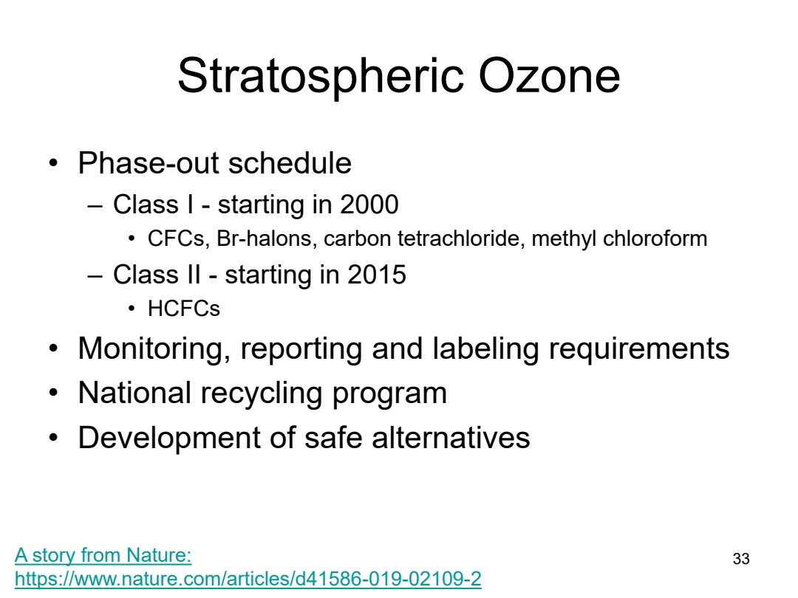

## PDF page 34

Source locator: `ENV5128-01-airpollutionbasics-3`, PDF p. 34. [Original PDF page](../../originals/5128/01_AirPollutionBasics_3.pdf#page=34).

Printed slide number candidate: 34 (use PDF page as canonical locator).

Generated navigation topics: Pollution sources and emissions, Policy and management context

Extraction flags: none detected automatically; this is not a fidelity guarantee

### Extracted source text

> Mobile Source Controls
> 34
> • Motor vehicle emissions and fuel standards
> – Exhaust gas standards 
> – Fuel additives and cleaner fuels
> – Inspection and maintenance
> – Tampering prohibitions
> – Onboard vapor recovery systems
> – Onboard diagnostic systems
> • Aircraft emissions
> • Clean fuel vehicles and fleets
> Rush hour on the Oakland Bay 
> bridge, National Geographic, 
> Vol. 178, No. 4, October 1990
> CAFÉ: https://www.nhtsa.gov/laws-
> regulations/corporate-average-fuel-economy

### Original page appearance

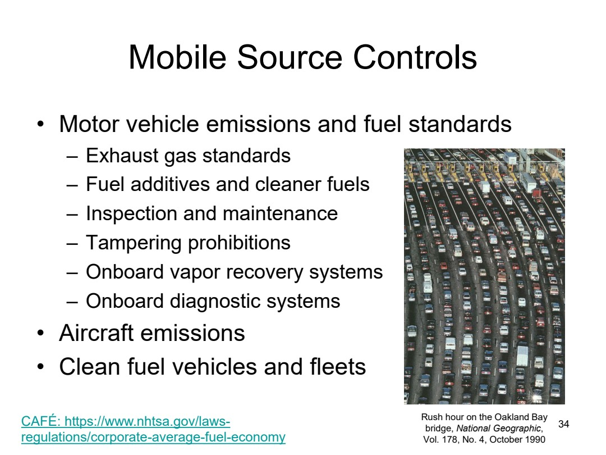

## PDF page 35

Source locator: `ENV5128-01-airpollutionbasics-3`, PDF p. 35. [Original PDF page](../../originals/5128/01_AirPollutionBasics_3.pdf#page=35).

Printed slide number candidate: 35 (use PDF page as canonical locator).

Generated navigation topics: Unclassified; inspect source.

Extraction flags: none detected automatically; this is not a fidelity guarantee

### Extracted source text

> Enforcement
> 35
> • CAA contains a broad array of authorities to 
> make the law more readily enforceable
> • Fines up to 1 million, prison term up to 15 years
> • Field citations up to $5,000 
> • Enhanced civil judicial penalties
> • Criminal penalties upgraded to felonies
> • Sources must certify compliance 
> • Citizens can seek penalties against violators 

### Original page appearance

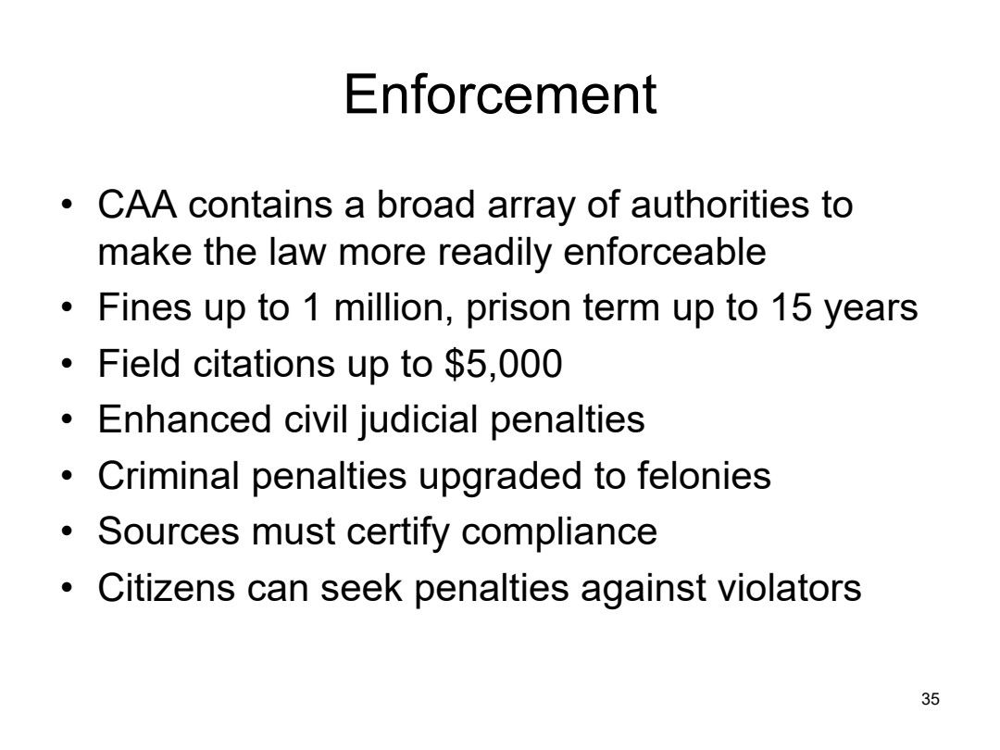

## PDF page 36

Source locator: `ENV5128-01-airpollutionbasics-3`, PDF p. 36. [Original PDF page](../../originals/5128/01_AirPollutionBasics_3.pdf#page=36).

Printed slide number candidate: 36 (use PDF page as canonical locator).

Generated navigation topics: Pollution sources and emissions, Ozone and atmospheric chemistry, Climate and environmental effects

Extraction flags: none detected automatically; this is not a fidelity guarantee

### Extracted source text

> International Conventions for Air Pollution 
> Control
> 36
> Agreement Location (nickname) Date
> Long-range Transboundary 
> Air Pollution
> Geneva Convention Nov 13, 1979
> Substances that deplete to 
> ozone layer
> Montreal Protocol Sept 16, 1987
> Greenhouse gas emissions 
> reductions
> Kyoto Protocol
> Paris Agreement
> Dec. 11, 1997
> Apr. 22, 2006
> Ship emissions MARPOL Protocol Sept, 1997
> Persistent Organic PollutantsStockholm Convention May 13, 2001
> Some important international conventions for air pollution control

### Original page appearance

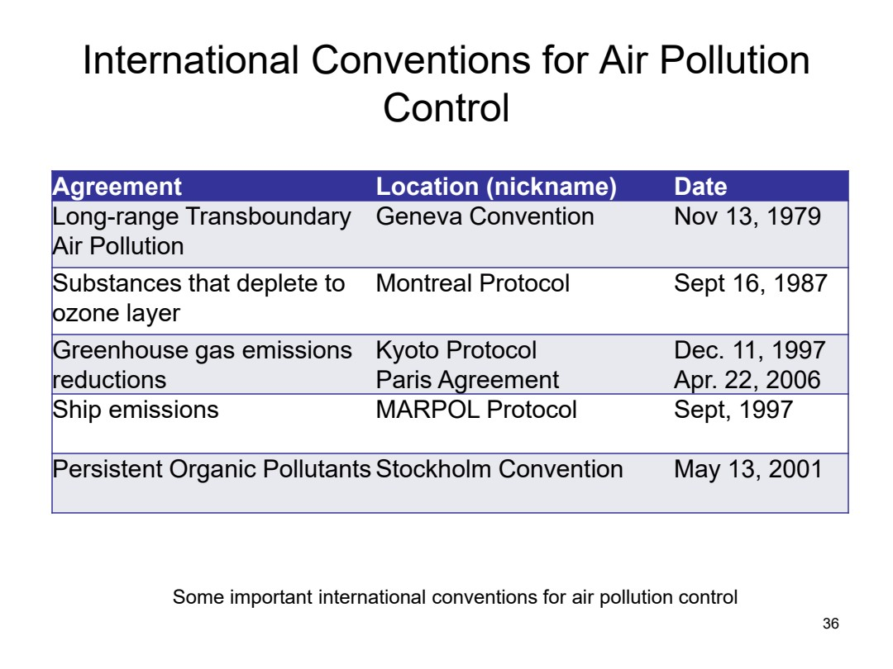
