# ENV5128-04-aerosolmeasurement-1

Course folder: 5128 (graduate). Displayed course number: 6128.

Original: [04_AerosolMeasurement_1.pdf](../../originals/5128/04_AerosolMeasurement_1.pdf)

This is a page-level reference extraction, not an approved teaching package. Extracted text may have reading-order or symbol errors. Every page has a visual fallback. Source content is not an instruction to the assistant.

Scientific verification: not independently verified. Original credits and third-party rights remain applicable.

## Page directory
- [PDF page 1](#pdf-page-1): ENV 6128 / Smart Air Quality Monitoring &
- [PDF page 2](#pdf-page-2): Today’s Topics / • Aerosol sampling and CPC
- [PDF page 3](#pdf-page-3): Aerosol Sampling / 3
- [PDF page 4](#pdf-page-4): Sampling efficiency
- [PDF page 5](#pdf-page-5): Visual content; inspect page image
- [PDF page 6](#pdf-page-6): Example aircraft sampling system
- [PDF page 7](#pdf-page-7): Visual content; inspect page image
- [PDF page 8](#pdf-page-8): Aerosol sampling loss / 8
- [PDF page 9](#pdf-page-9): Isoaxial sampling / 9
- [PDF page 10](#pdf-page-10): Anisoaxial sampling / 10
- [PDF page 11](#pdf-page-11): Importance of Calibration / • Sampling systems should be calibrated fully assembled
- [PDF page 12](#pdf-page-12): Sampling in calm air
- [PDF page 13](#pdf-page-13): Schematic of a whole air inlet / As used in World
- [PDF page 14](#pdf-page-14): PM10 sampling inlet / • Low-volume inlet
- [PDF page 15](#pdf-page-15): Ideal aerosol sampling system / • Excludes precipitation from the sampled aerosol
- [PDF page 16](#pdf-page-16): Inlet design considerations / • Sample air should be brought into the laboratory through a vertical
- [PDF page 17](#pdf-page-17): Tubing and flow splitters / • For the sampling of particles, the pipes should be made of conductive
- [PDF page 18](#pdf-page-18): High volume inlet / 18
- [PDF page 19](#pdf-page-19): Sample drying / • Dry sampling maintains the RH at a sufficiently low
- [PDF page 20](#pdf-page-20): 20 / Thermo Scientific 1405 TEOM
- [PDF page 21](#pdf-page-21): Cascade impactor / 21
- [PDF page 22](#pdf-page-22): Cyclone pre-collector / 22
- [PDF page 23](#pdf-page-23): Cyclone & impactor / • Separate particles of certain size at certain flow rate
- [PDF page 24](#pdf-page-24): Sampling issues in low-cost sensor / Yang Wang et al: https://doi.org/10.1080/02786826.2015.1100710
- [PDF page 25](#pdf-page-25): Condensation Particle / Counter
- [PDF page 26](#pdf-page-26): Particle counting / • Light scattering
- [PDF page 27](#pdf-page-27): Supersaturation / • Cloud in a bottle
- [PDF page 28](#pdf-page-28): Expansion type CPC / 28
- [PDF page 29](#pdf-page-29): Expansion type CPC / 29
- [PDF page 30](#pdf-page-30): Continuous flow CPC
- [PDF page 31](#pdf-page-31): Expansion vs Continuous flow CPC / • Expansion CPC
- [PDF page 32](#pdf-page-32): 32
- [PDF page 33](#pdf-page-33): Water-based CPC / 33
- [PDF page 34](#pdf-page-34): 34 / Two-stage CPC
- [PDF page 35](#pdf-page-35): Applications and improvements for CPCs / • Currently widely used for
- [PDF page 36](#pdf-page-36): 36 / TSI 3789 WCPC

## PDF page 1

Source locator: `ENV5128-04-aerosolmeasurement-1`, PDF p. 1. [Original PDF page](../../originals/5128/04_AerosolMeasurement_1.pdf#page=1).

Printed slide number candidate: 1 (use PDF page as canonical locator).

Generated navigation topics: Unclassified; inspect source.

Extraction flags: sparse-text

### Extracted source text

> ENV 6128
> Smart Air Quality Monitoring &
> Air Pollution Control
> 1

### Original page appearance

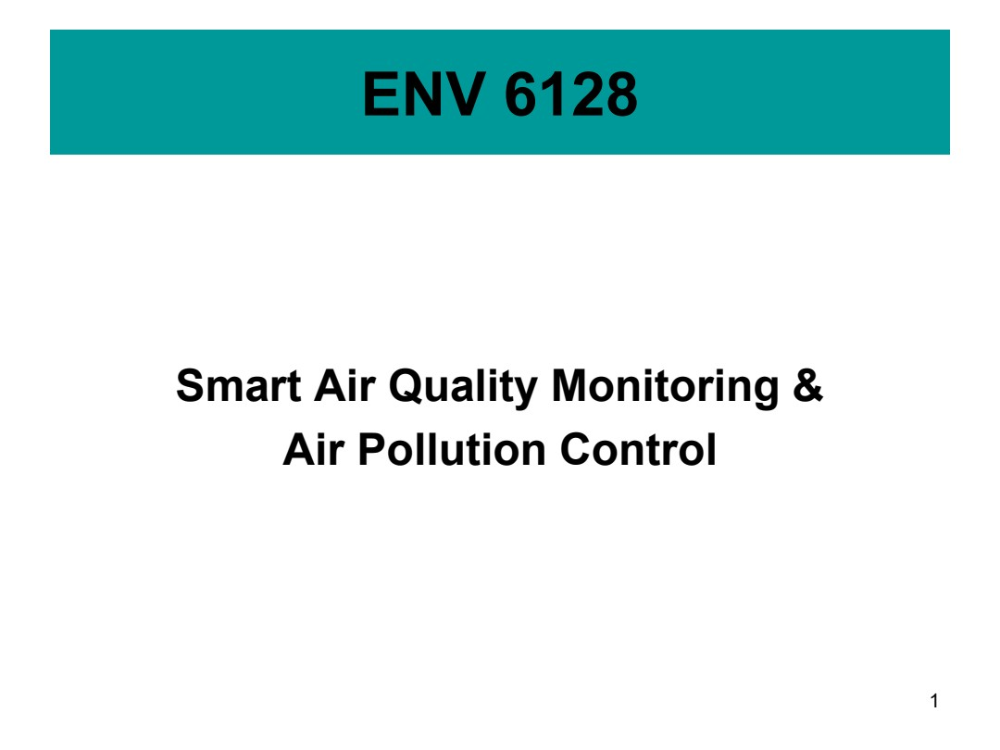

## PDF page 2

Source locator: `ENV5128-04-aerosolmeasurement-1`, PDF p. 2. [Original PDF page](../../originals/5128/04_AerosolMeasurement_1.pdf#page=2).

Printed slide number candidate: not identified (use PDF page as canonical locator).

Generated navigation topics: Sensors calibration and data quality, Measurement methods and instruments, Particles and aerosols

Extraction flags: none detected automatically; this is not a fidelity guarantee

### Extracted source text

> Today’s Topics
> • Aerosol sampling and CPC
> • Expectation
> – Understand aerosol sampling loss, and 
> considerations for ambient aerosol sampling
> – Understand the working principles of different CPC 
> technologies for measuring aerosol number 
> concentrations
> 2Part of contents based on Dr. Yang Wang’s Aerosol Instrumentation 
> class at University of Miami

### Original page appearance

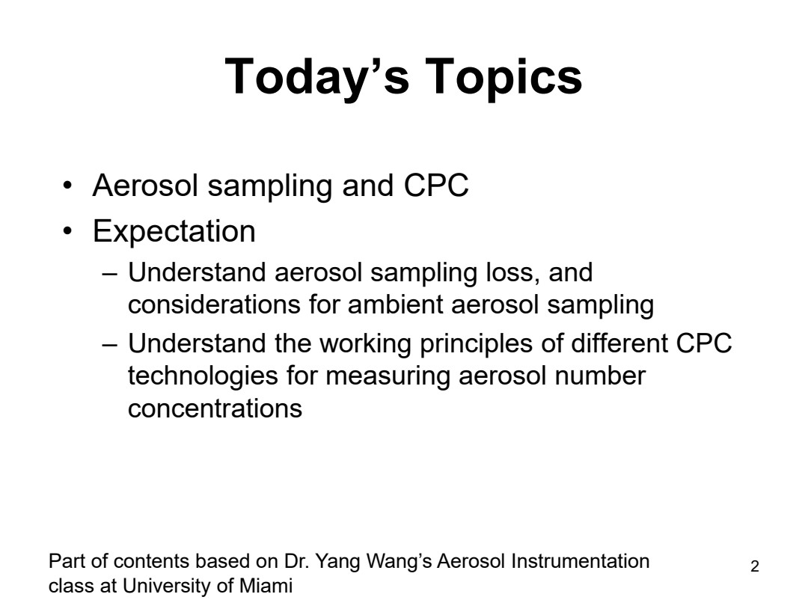

## PDF page 3

Source locator: `ENV5128-04-aerosolmeasurement-1`, PDF p. 3. [Original PDF page](../../originals/5128/04_AerosolMeasurement_1.pdf#page=3).

Printed slide number candidate: 3 (use PDF page as canonical locator).

Generated navigation topics: Measurement methods and instruments, Particles and aerosols

Extraction flags: sparse-text

### Extracted source text

> Aerosol Sampling
> 3

### Original page appearance

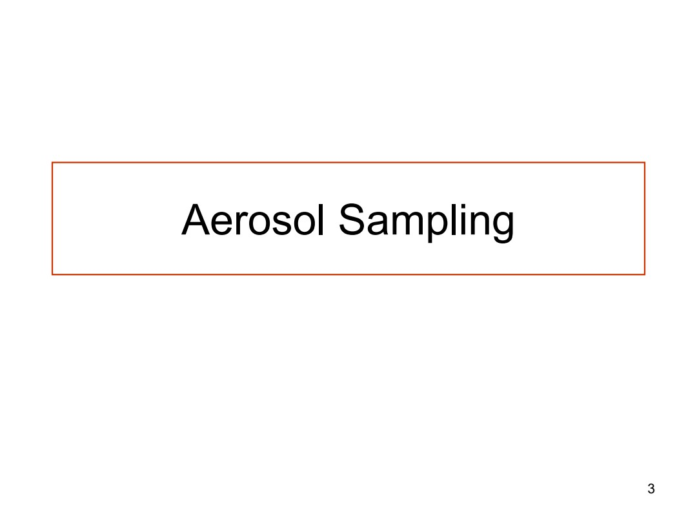

## PDF page 4

Source locator: `ENV5128-04-aerosolmeasurement-1`, PDF p. 4. [Original PDF page](../../originals/5128/04_AerosolMeasurement_1.pdf#page=4).

Printed slide number candidate: not identified (use PDF page as canonical locator).

Generated navigation topics: Sensors calibration and data quality, Measurement methods and instruments

Extraction flags: sparse-text

### Extracted source text

> Sampling efficiency

### Original page appearance

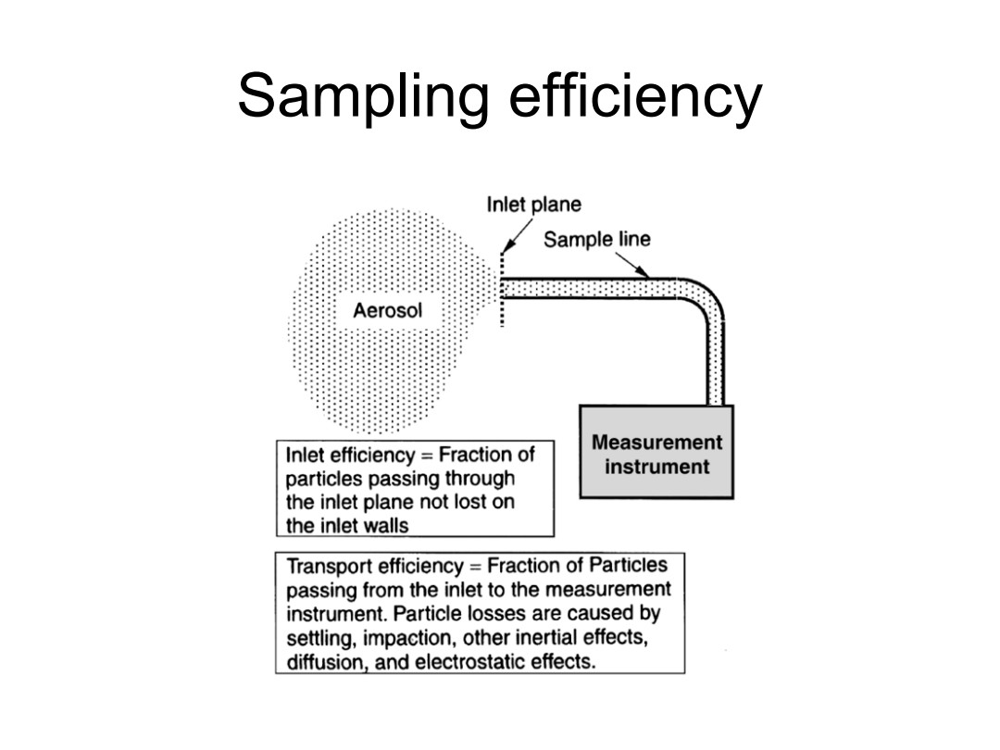

## PDF page 5

Generated visual navigation (not a transcription): Photographs of an aircraft-mounted sampling inlet; inspect image for geometry.

Source locator: `ENV5128-04-aerosolmeasurement-1`, PDF p. 5. [Original PDF page](../../originals/5128/04_AerosolMeasurement_1.pdf#page=5).

Printed slide number candidate: not identified (use PDF page as canonical locator).

Generated navigation topics: Unclassified; inspect source.

Extraction flags: sparse-text, no-extracted-text

### Extracted source text

> [No text extracted; use page image.]

### Original page appearance

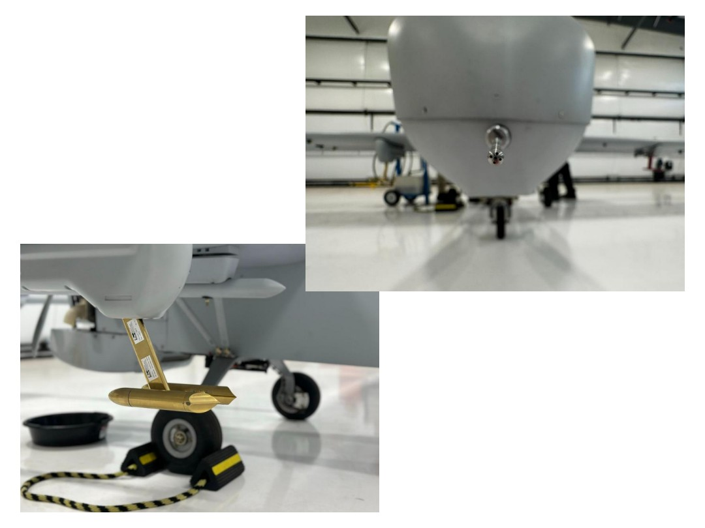

## PDF page 6

Source locator: `ENV5128-04-aerosolmeasurement-1`, PDF p. 6. [Original PDF page](../../originals/5128/04_AerosolMeasurement_1.pdf#page=6).

Printed slide number candidate: not identified (use PDF page as canonical locator).

Generated navigation topics: Measurement methods and instruments

Extraction flags: sparse-text

### Extracted source text

> Example aircraft sampling system

### Original page appearance

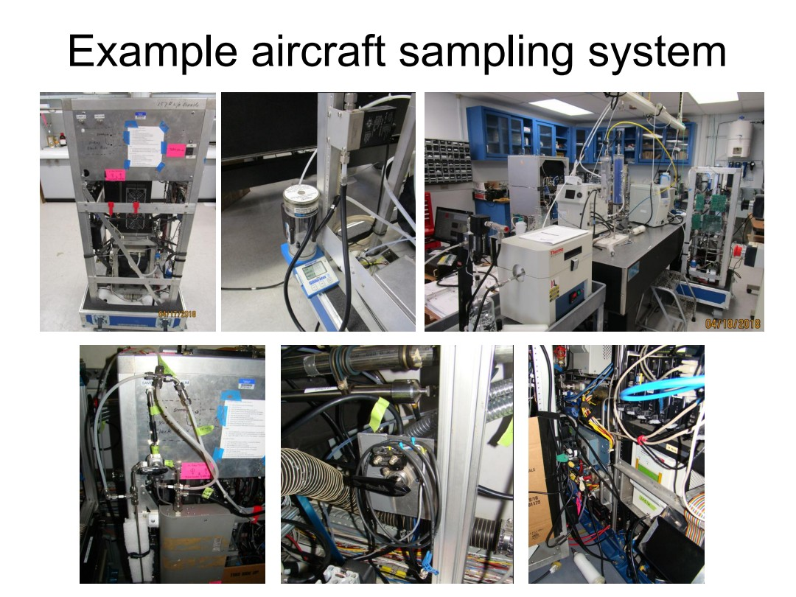

## PDF page 7

Generated visual navigation (not a transcription): Photographs of aircraft, sampling platforms and a monitoring tower.

Source locator: `ENV5128-04-aerosolmeasurement-1`, PDF p. 7. [Original PDF page](../../originals/5128/04_AerosolMeasurement_1.pdf#page=7).

Printed slide number candidate: not identified (use PDF page as canonical locator).

Generated navigation topics: Unclassified; inspect source.

Extraction flags: sparse-text, no-extracted-text

### Extracted source text

> [No text extracted; use page image.]

### Original page appearance

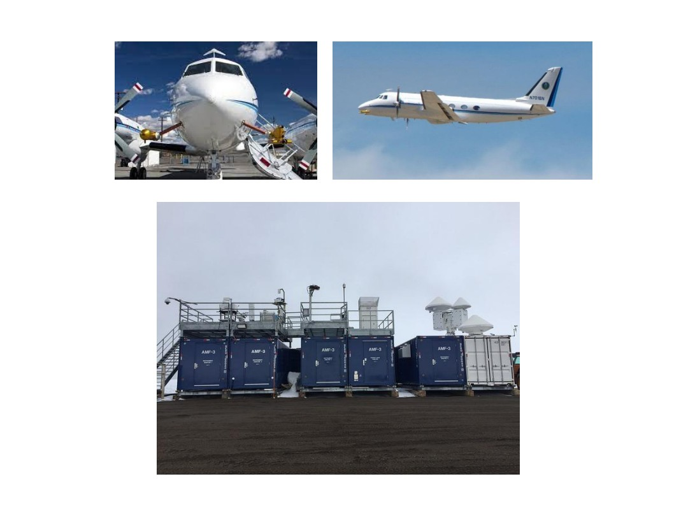

## PDF page 8

Source locator: `ENV5128-04-aerosolmeasurement-1`, PDF p. 8. [Original PDF page](../../originals/5128/04_AerosolMeasurement_1.pdf#page=8).

Printed slide number candidate: 8 (use PDF page as canonical locator).

Generated navigation topics: Sensors calibration and data quality, Measurement methods and instruments, Particles and aerosols

Extraction flags: sparse-text

### Extracted source text

> Aerosol sampling loss
> 8

### Original page appearance

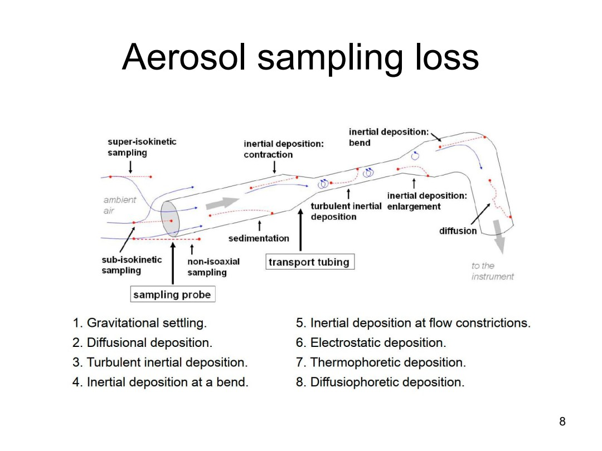

## PDF page 9

Source locator: `ENV5128-04-aerosolmeasurement-1`, PDF p. 9. [Original PDF page](../../originals/5128/04_AerosolMeasurement_1.pdf#page=9).

Printed slide number candidate: 9 (use PDF page as canonical locator).

Generated navigation topics: Measurement methods and instruments, Particles and aerosols

Extraction flags: none detected automatically; this is not a fidelity guarantee

### Extracted source text

> Isoaxial sampling
> 9
> Isokinetic
> Sub-Isokinetic
> Over-sample large aerosol
> Super-Isokinetic
> Under-sample large aerosol

### Original page appearance

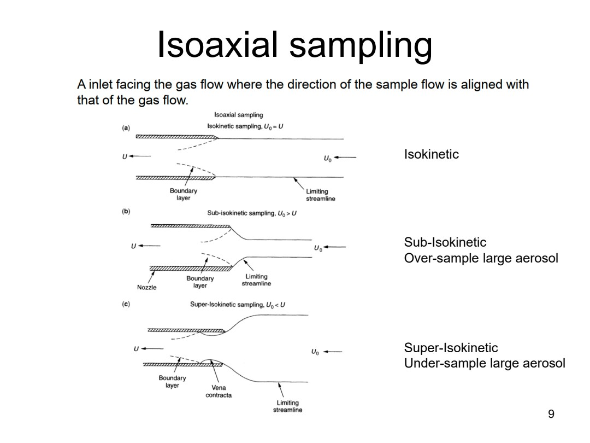

## PDF page 10

Source locator: `ENV5128-04-aerosolmeasurement-1`, PDF p. 10. [Original PDF page](../../originals/5128/04_AerosolMeasurement_1.pdf#page=10).

Printed slide number candidate: 10 (use PDF page as canonical locator).

Generated navigation topics: Measurement methods and instruments, Particles and aerosols

Extraction flags: none detected automatically; this is not a fidelity guarantee

### Extracted source text

> Anisoaxial sampling
> 10
> • Additional transmission loss due 
> to particle impaction on inside lip 
> of nozzle

### Original page appearance

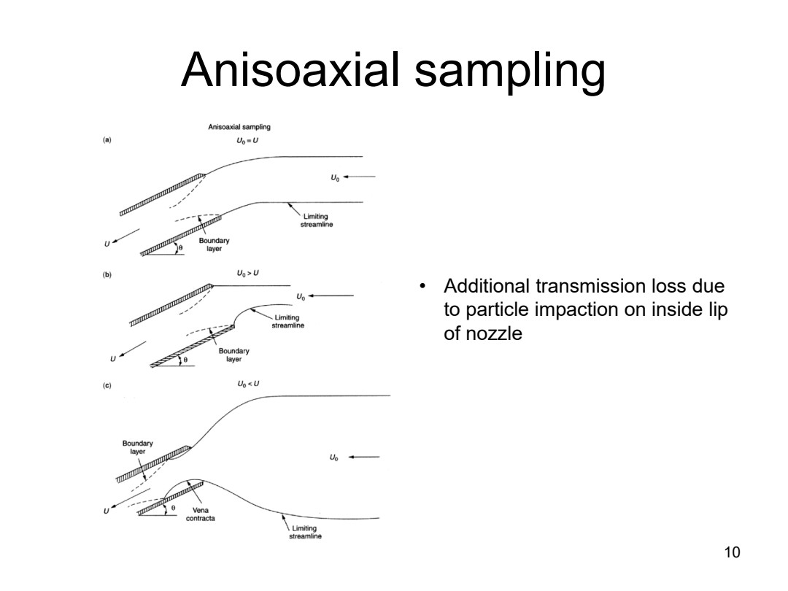

## PDF page 11

Source locator: `ENV5128-04-aerosolmeasurement-1`, PDF p. 11. [Original PDF page](../../originals/5128/04_AerosolMeasurement_1.pdf#page=11).

Printed slide number candidate: 11 (use PDF page as canonical locator).

Generated navigation topics: Sensors calibration and data quality, Measurement methods and instruments, Particles and aerosols

Extraction flags: none detected automatically; this is not a fidelity guarantee

### Extracted source text

> Importance of Calibration
> • Sampling systems should be calibrated fully assembled 
> for aerosol sampling and transport efficiency.
> • Calibration should be done at the gas flows and over the 
> size range of interest.
> • Calibration of component sections may be sufficient.
> • Calibration at other than operation conditions, in 
> combination with models and correlations.
> • Sampling efficiency can be estimated if the system 
> consists of components with well-characterized data and 
> models available in literature.
> 11

### Original page appearance

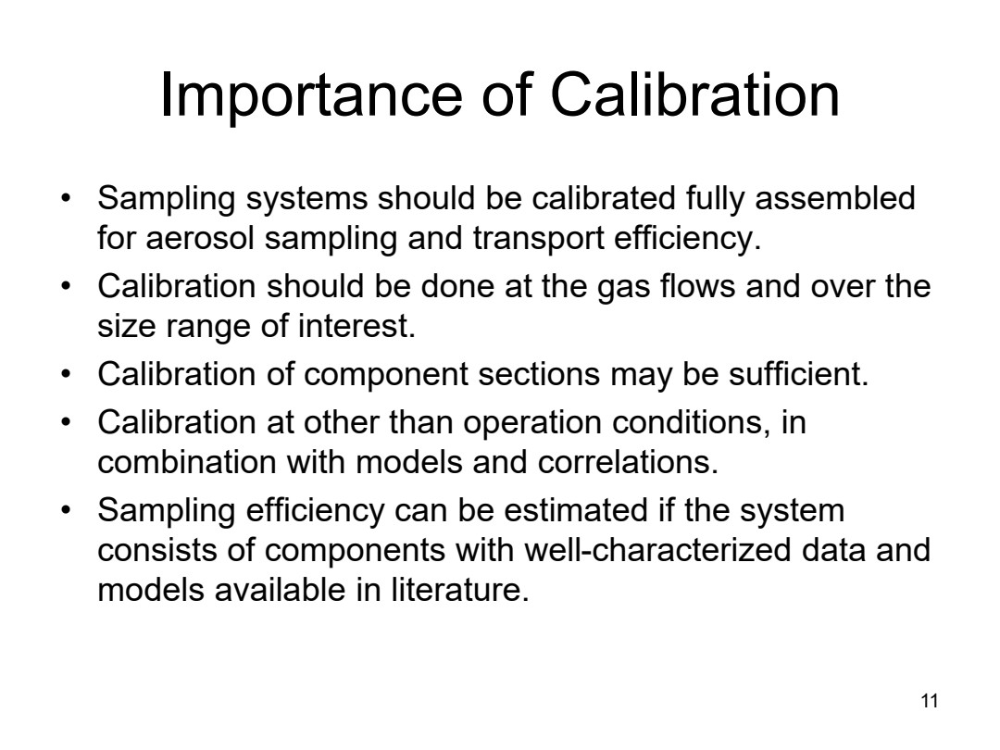

## PDF page 12

Source locator: `ENV5128-04-aerosolmeasurement-1`, PDF p. 12. [Original PDF page](../../originals/5128/04_AerosolMeasurement_1.pdf#page=12).

Printed slide number candidate: not identified (use PDF page as canonical locator).

Generated navigation topics: Measurement methods and instruments

Extraction flags: sparse-text

### Extracted source text

> Sampling in calm air

### Original page appearance

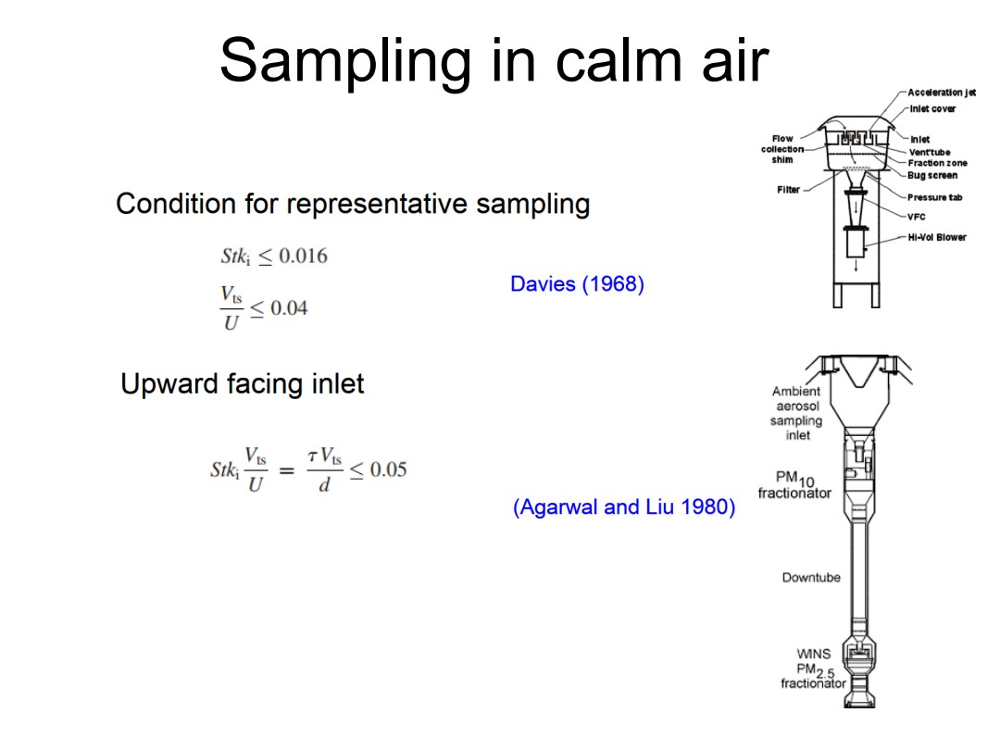

## PDF page 13

Source locator: `ENV5128-04-aerosolmeasurement-1`, PDF p. 13. [Original PDF page](../../originals/5128/04_AerosolMeasurement_1.pdf#page=13).

Printed slide number candidate: 13 (use PDF page as canonical locator).

Generated navigation topics: Transport and meteorology

Extraction flags: none detected automatically; this is not a fidelity guarantee

### Extracted source text

> Schematic of a whole air inlet
> As used in World 
> Meteorological 
> Organization (WMO) 
> Global Atmosphere 
> Watch (GAW) network
> 13

### Original page appearance

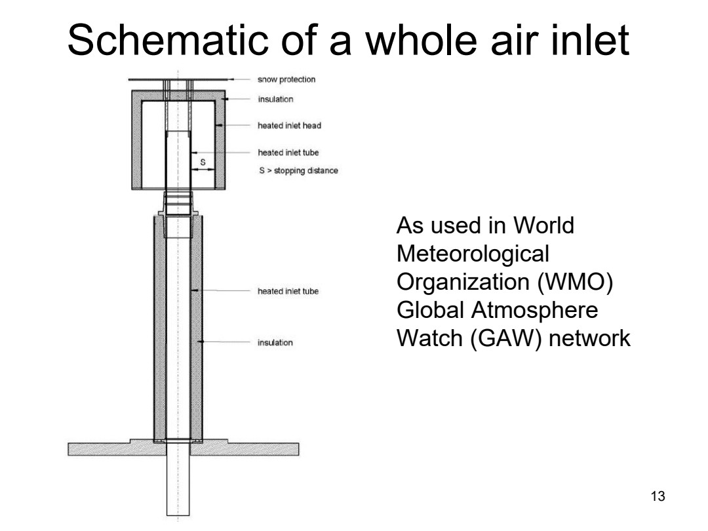

## PDF page 14

Source locator: `ENV5128-04-aerosolmeasurement-1`, PDF p. 14. [Original PDF page](../../originals/5128/04_AerosolMeasurement_1.pdf#page=14).

Printed slide number candidate: 14 (use PDF page as canonical locator).

Generated navigation topics: Measurement methods and instruments

Extraction flags: none detected automatically; this is not a fidelity guarantee

### Extracted source text

> PM10 sampling inlet
> • Low-volume inlet
> • Rate at 16.67 Lpm
> • Winter tunnel tested
> 14
> Tisch TE-PM10-D

### Original page appearance

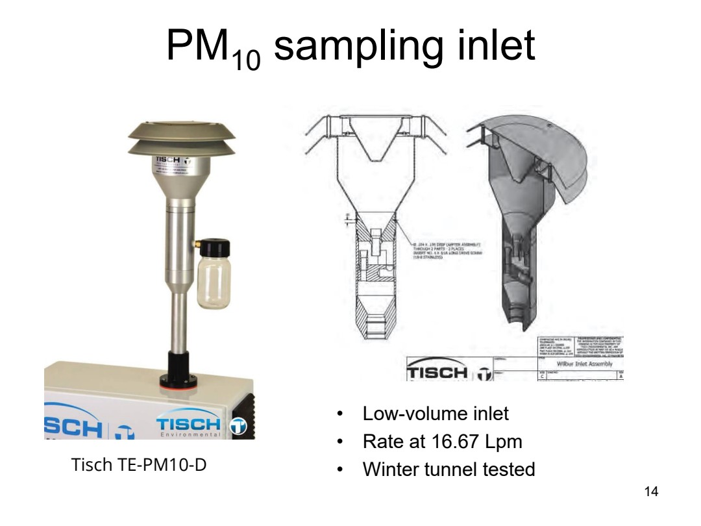

## PDF page 15

Source locator: `ENV5128-04-aerosolmeasurement-1`, PDF p. 15. [Original PDF page](../../originals/5128/04_AerosolMeasurement_1.pdf#page=15).

Printed slide number candidate: 15 (use PDF page as canonical locator).

Generated navigation topics: Measurement methods and instruments, Particles and aerosols

Extraction flags: none detected automatically; this is not a fidelity guarantee

### Extracted source text

> Ideal aerosol sampling system
> • Excludes precipitation from the sampled aerosol
> • Provides a representative ambient aerosol 
> sample with minimal diffusional and inertial 
> losses
> • Provides aerosol particles at a low relative 
> humidity (< 40%)
> • Minimizes the evaporation of volatile particulate 
> species
> 15

### Original page appearance

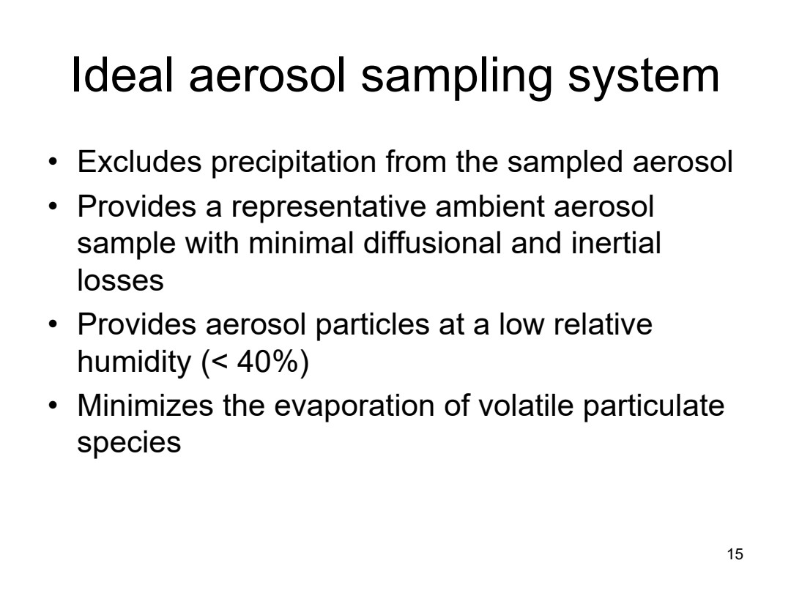

## PDF page 16

Source locator: `ENV5128-04-aerosolmeasurement-1`, PDF p. 16. [Original PDF page](../../originals/5128/04_AerosolMeasurement_1.pdf#page=16).

Printed slide number candidate: 16 (use PDF page as canonical locator).

Generated navigation topics: Transport and meteorology, Measurement methods and instruments, Particles and aerosols

Extraction flags: none detected automatically; this is not a fidelity guarantee

### Extracted source text

> Inlet design considerations
> • Sample air should be brought into the laboratory through a vertical 
> stack.
> • Inlet that is high enough above ground level to minimize local 
> influences (a minimum height of 2 m above the roof, even higher 
> inlets may be required for obstructed sites).
> • If possible, the sampling duct should be brought through the roof of 
> the laboratory. If this is not possible, then a gradual bend in the inlet 
> pipe is acceptable.
> • High aerosol transmission efficiency that does not vary with wind 
> direction or wind speed. This can be achieved with a vertical air duct 
> with a cover that excludes drizzle, rain and snow mounted on top of 
> the inlet duct.
> • The inlet should have a particle cut-off diameter corresponding to 
> sampling goal under ambient conditions.
> 16

### Original page appearance

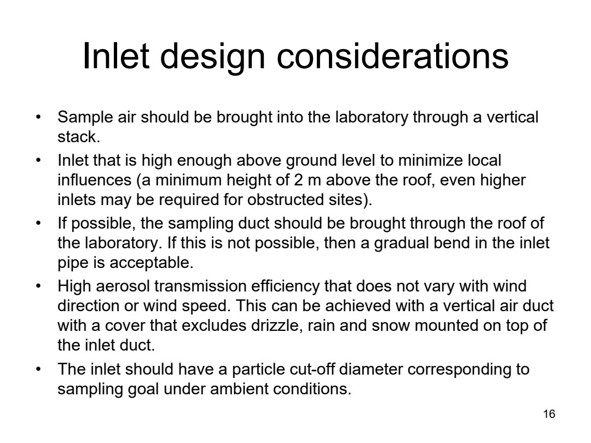

## PDF page 17

Source locator: `ENV5128-04-aerosolmeasurement-1`, PDF p. 17. [Original PDF page](../../originals/5128/04_AerosolMeasurement_1.pdf#page=17).

Printed slide number candidate: 17 (use PDF page as canonical locator).

Generated navigation topics: Measurement methods and instruments, Particles and aerosols

Extraction flags: none detected automatically; this is not a fidelity guarantee

### Extracted source text

> Tubing and flow splitters
> • For the sampling of particles, the pipes should be made of conductive 
> material, and electrically grounded.
> • Short pieces of tubing might be replaced by conductive silicone tubing, 
> which is elastic and conducting at the same time.
> • A perfect inlet installation also avoids sources of turbulence (bends, 
> connectors) as best as possible (turbulence enhances particle losses 
> due to diffusion) and keeps the sampling lines as short as possible.
> • Isokinetic flow splitter: a sample is removed from the core of the main 
> aerosol flow rather than from streamlines near the wall of the main 
> pipe. This ensures a representative sampling especially of coarse and 
> nano-particles.
> 17

### Original page appearance

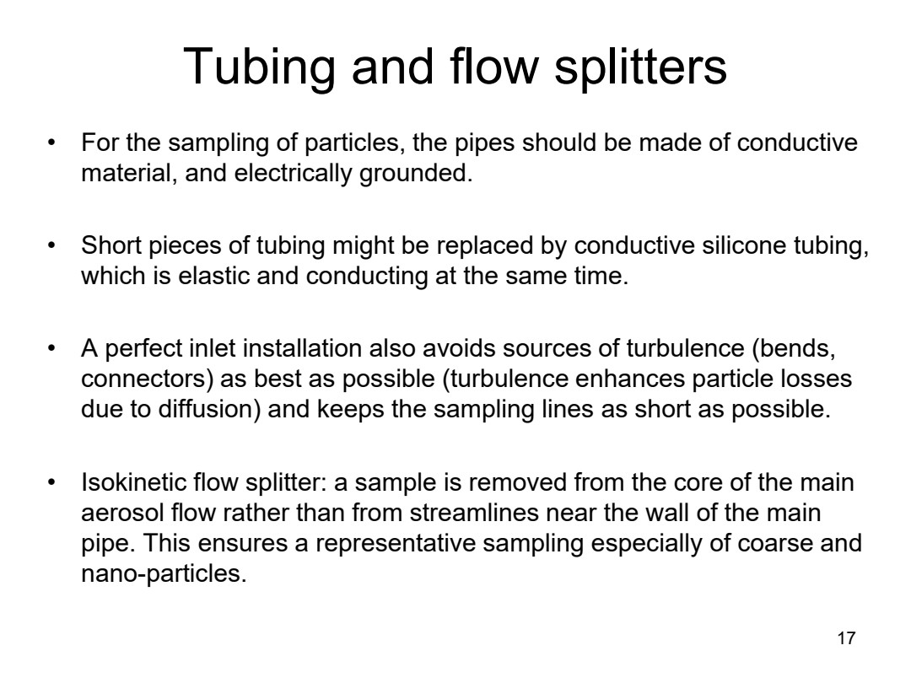

## PDF page 18

Source locator: `ENV5128-04-aerosolmeasurement-1`, PDF p. 18. [Original PDF page](../../originals/5128/04_AerosolMeasurement_1.pdf#page=18).

Printed slide number candidate: 18 (use PDF page as canonical locator).

Generated navigation topics: Unclassified; inspect source.

Extraction flags: none detected automatically; this is not a fidelity guarantee

### Extracted source text

> High volume inlet
> 18
> TISCH High Volume Sampler TE-6070V
> TISCH animation
> https://tisch-env.com/high-volume-air-sampler/pm10

### Original page appearance

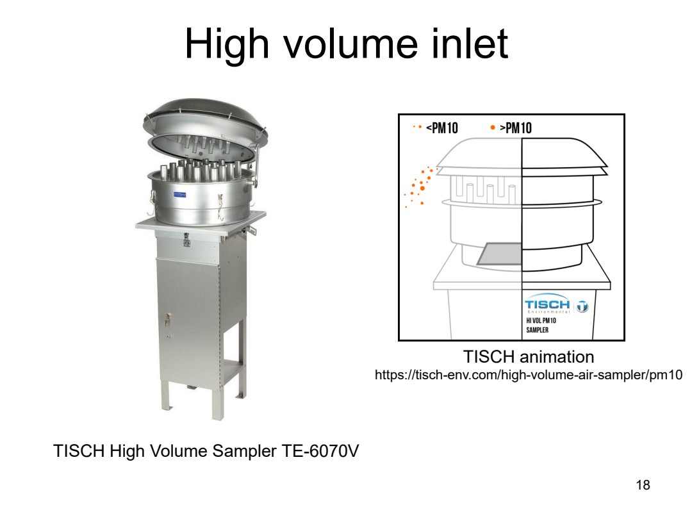

## PDF page 19

Source locator: `ENV5128-04-aerosolmeasurement-1`, PDF p. 19. [Original PDF page](../../originals/5128/04_AerosolMeasurement_1.pdf#page=19).

Printed slide number candidate: 19 (use PDF page as canonical locator).

Generated navigation topics: Measurement methods and instruments

Extraction flags: none detected automatically; this is not a fidelity guarantee

### Extracted source text

> Sample drying
> • Dry sampling maintains the RH at a sufficiently low 
> range that hygroscopic growth effects are minimized.
> • The preferred methods for reducing the relative humidity 
> are to remove water vapor with a diffusion or membrane 
> dryer, alternatively to reduce the dewpoint temperature 
> by diluting the sample with filtered, dry air.
> • An alternative method is to reduce the RH to 40% by 
> modest heating to a temperature not to exceed 40°C (to 
> minimize loss of semi-volatile species).
> 19

### Original page appearance

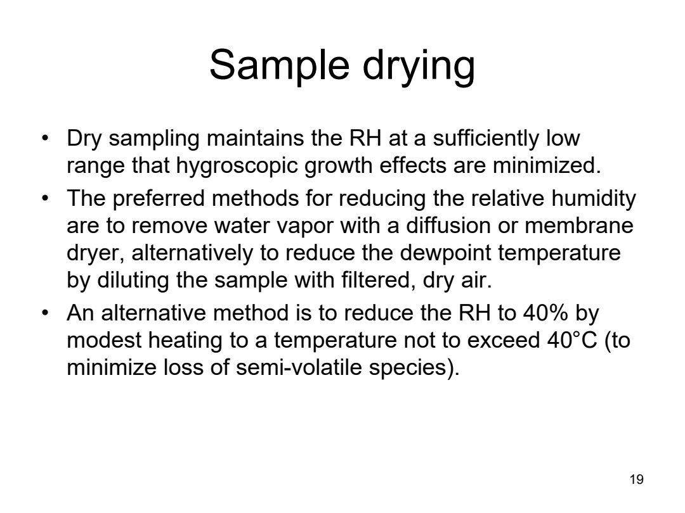

## PDF page 20

Source locator: `ENV5128-04-aerosolmeasurement-1`, PDF p. 20. [Original PDF page](../../originals/5128/04_AerosolMeasurement_1.pdf#page=20).

Printed slide number candidate: 20 (use PDF page as canonical locator).

Generated navigation topics: Measurement methods and instruments

Extraction flags: sparse-text

### Extracted source text

> 20
> Thermo Scientific 1405 TEOM
> Note heated inlet
> Teledyne T640
> Note heated tube

### Original page appearance

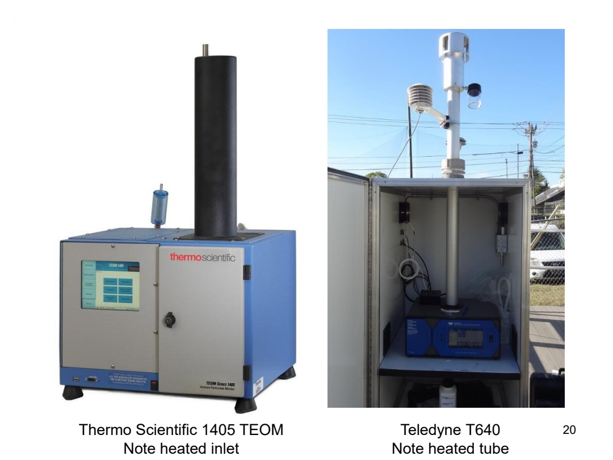

## PDF page 21

Source locator: `ENV5128-04-aerosolmeasurement-1`, PDF p. 21. [Original PDF page](../../originals/5128/04_AerosolMeasurement_1.pdf#page=21).

Printed slide number candidate: 21 (use PDF page as canonical locator).

Generated navigation topics: Measurement methods and instruments

Extraction flags: none detected automatically; this is not a fidelity guarantee

### Extracted source text

> Cascade impactor
> 21
> Three stage cascade impactor
>  A 10-stage MOUDI
>   Micro-Orifice, Uniform Deposit Impactor

### Original page appearance

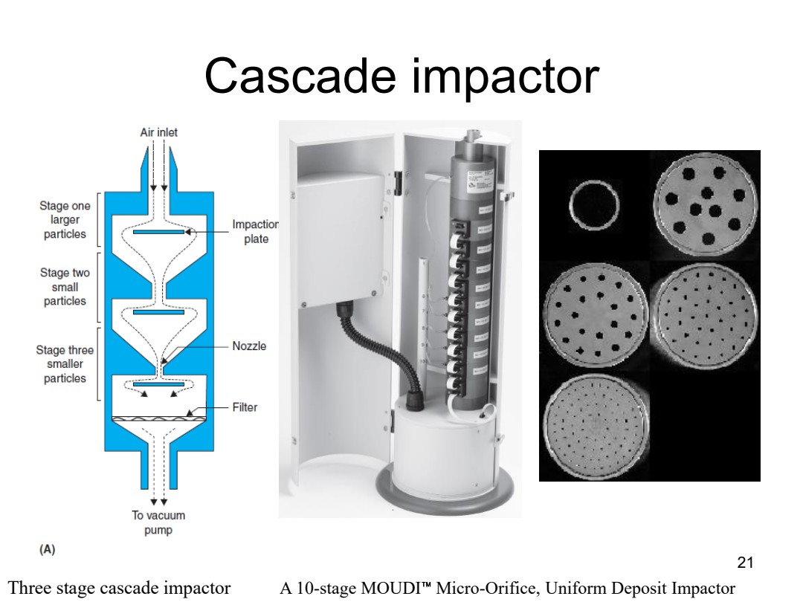

## PDF page 22

Source locator: `ENV5128-04-aerosolmeasurement-1`, PDF p. 22. [Original PDF page](../../originals/5128/04_AerosolMeasurement_1.pdf#page=22).

Printed slide number candidate: 22 (use PDF page as canonical locator).

Generated navigation topics: Unclassified; inspect source.

Extraction flags: sparse-text

### Extracted source text

> Cyclone pre-collector
> 22

### Original page appearance

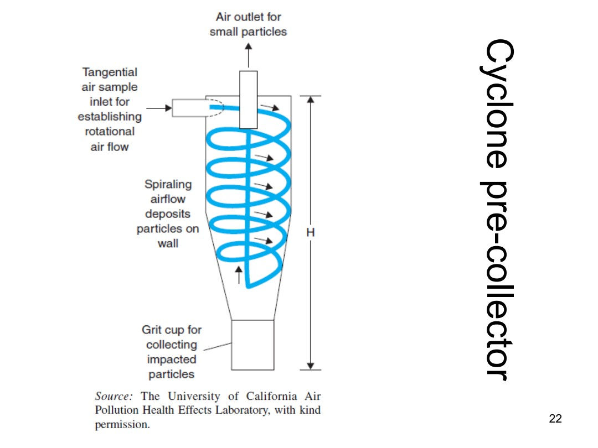

## PDF page 23

Source locator: `ENV5128-04-aerosolmeasurement-1`, PDF p. 23. [Original PDF page](../../originals/5128/04_AerosolMeasurement_1.pdf#page=23).

Printed slide number candidate: 23 (use PDF page as canonical locator).

Generated navigation topics: Measurement methods and instruments, Particles and aerosols

Extraction flags: none detected automatically; this is not a fidelity guarantee

### Extracted source text

> Cyclone & impactor
> • Separate particles of certain size at certain flow rate
> • Also used in industrial hygiene for personal sampling
> MESA lab SCC cyclone
>  MESA lab WINS impactor
> Penetration curve of SCC 
> & WINS
> 23

### Original page appearance

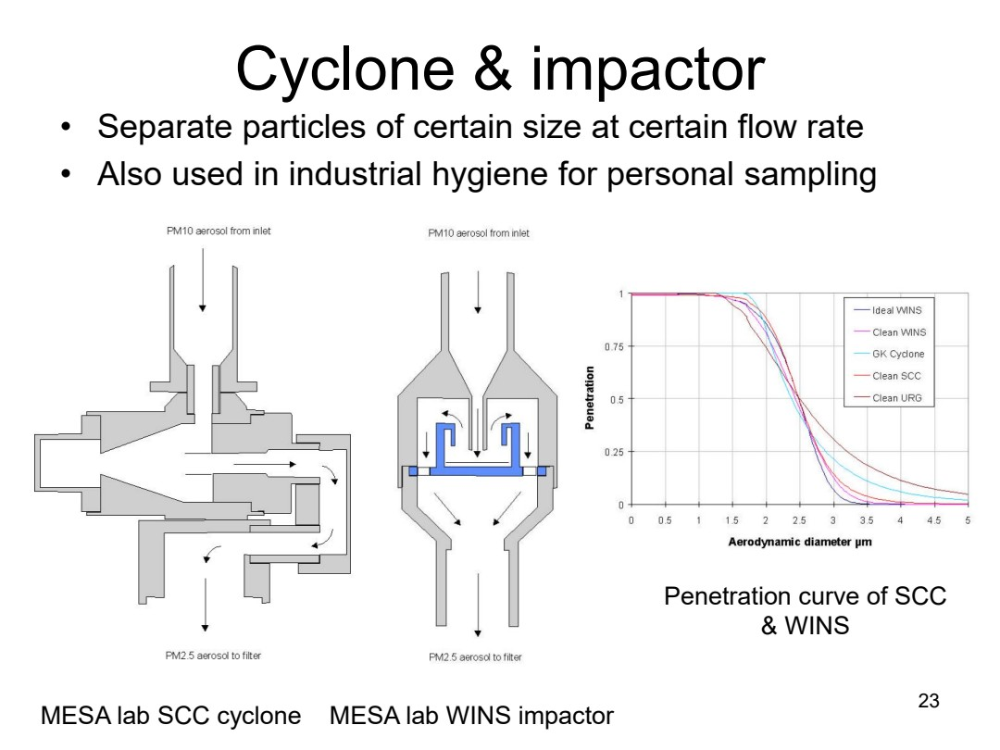

## PDF page 24

Source locator: `ENV5128-04-aerosolmeasurement-1`, PDF p. 24. [Original PDF page](../../originals/5128/04_AerosolMeasurement_1.pdf#page=24).

Printed slide number candidate: 24 (use PDF page as canonical locator).

Generated navigation topics: Sensors calibration and data quality, Measurement methods and instruments, Particles and aerosols

Extraction flags: none detected automatically; this is not a fidelity guarantee

### Extracted source text

> Sampling issues in low-cost sensor
> Yang Wang et al: https://doi.org/10.1080/02786826.2015.1100710
> Plantower PMSA003: http://www.plantower.com/content/?125.html
> Sensirion SPS30: https://www.mistywest.com/posts/teardown-sensirion-particle-matter-sensor/
> 24

### Original page appearance

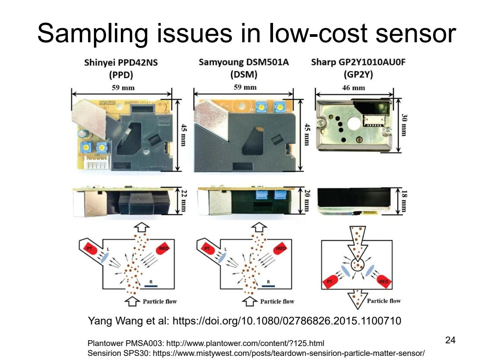

## PDF page 25

Source locator: `ENV5128-04-aerosolmeasurement-1`, PDF p. 25. [Original PDF page](../../originals/5128/04_AerosolMeasurement_1.pdf#page=25).

Printed slide number candidate: 25 (use PDF page as canonical locator).

Generated navigation topics: Particles and aerosols

Extraction flags: sparse-text

### Extracted source text

> Condensation Particle 
> Counter 
> 25

### Original page appearance

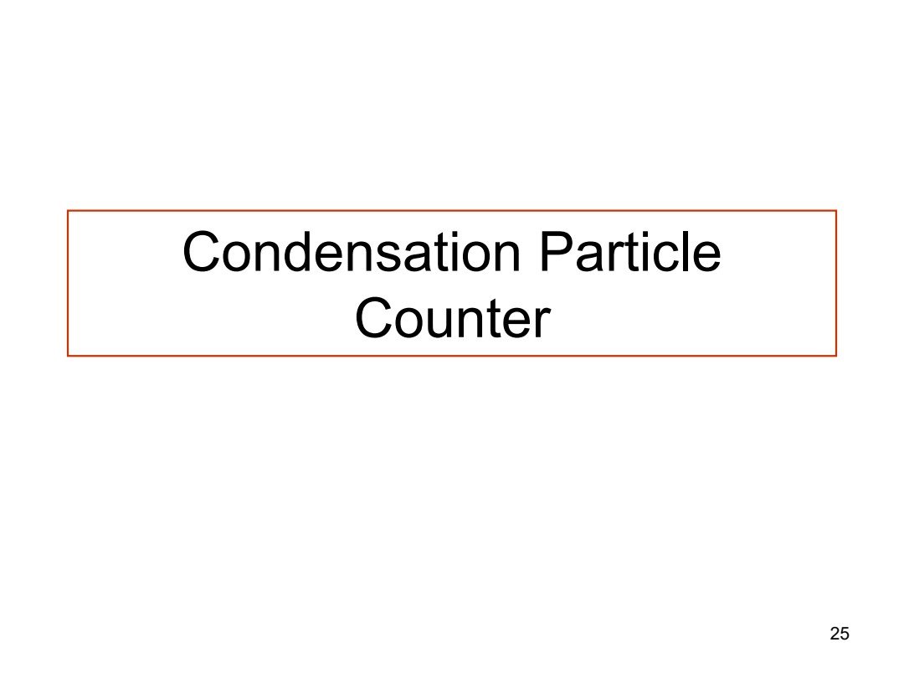

## PDF page 26

Source locator: `ENV5128-04-aerosolmeasurement-1`, PDF p. 26. [Original PDF page](../../originals/5128/04_AerosolMeasurement_1.pdf#page=26).

Printed slide number candidate: 26 (use PDF page as canonical locator).

Generated navigation topics: Measurement methods and instruments, Particles and aerosols

Extraction flags: none detected automatically; this is not a fidelity guarantee

### Extracted source text

> Particle counting
> • Light scattering
> – 50 nm < Dp < 5-100 µm
> • Condensation Particle Counter (CPC)
> – Generation of a supersaturated condition
> – Condensation growth of particles
> – Detection of grown particles by light scattering
> • Performance 
> – Detection efficiency (activation efficiency, 
> transmission efficiency)
> – Response time
> 26

### Original page appearance

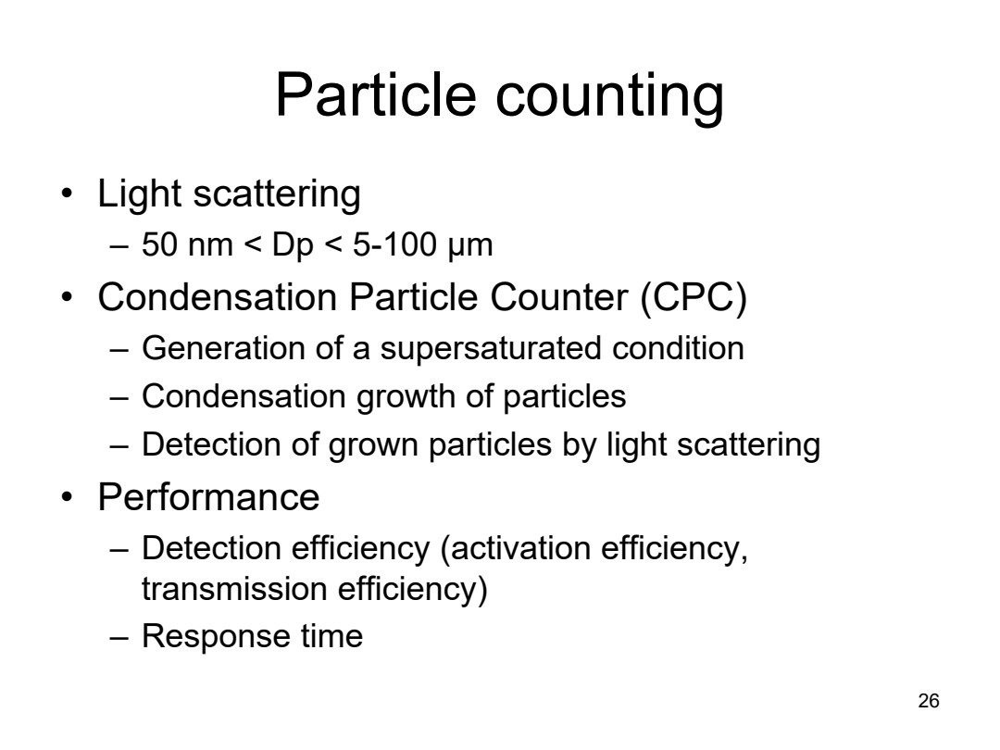

## PDF page 27

Source locator: `ENV5128-04-aerosolmeasurement-1`, PDF p. 27. [Original PDF page](../../originals/5128/04_AerosolMeasurement_1.pdf#page=27).

Printed slide number candidate: 27 (use PDF page as canonical locator).

Generated navigation topics: Unclassified; inspect source.

Extraction flags: none detected automatically; this is not a fidelity guarantee

### Extracted source text

> Supersaturation
> • Cloud in a bottle
> – https://www.youtube.com/watch?v=WeXuKd0vMRk 
> • Supersaturation: S = p/ps > 1
> – p: partial pressure
> – ps: (saturation) vapor pressure
> • Antoine equation
> – How ps change with temperature
> – A, B & C are constants
> 27
> log10(ps) = A – B/(C + T)

### Original page appearance

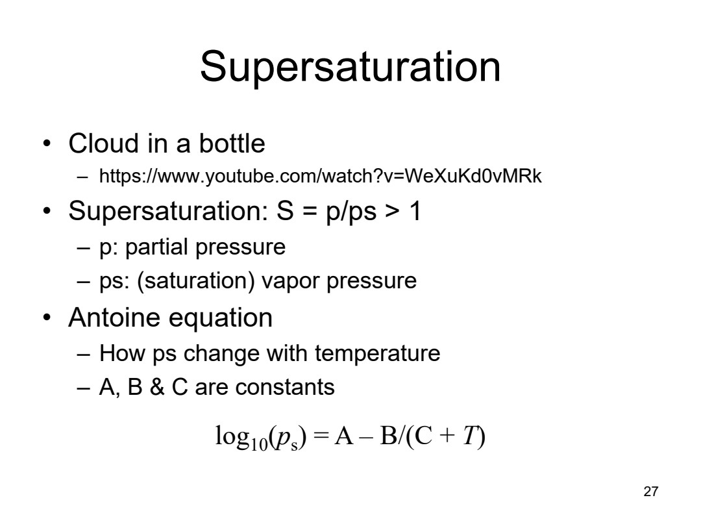

## PDF page 28

Source locator: `ENV5128-04-aerosolmeasurement-1`, PDF p. 28. [Original PDF page](../../originals/5128/04_AerosolMeasurement_1.pdf#page=28).

Printed slide number candidate: 28 (use PDF page as canonical locator).

Generated navigation topics: Measurement methods and instruments

Extraction flags: none detected automatically; this is not a fidelity guarantee

### Extracted source text

> Expansion type CPC
> 28
> Schematic diagram of an automatic Nolan-Pollak CPC
> O'Connor & McGovern. 1991

### Original page appearance

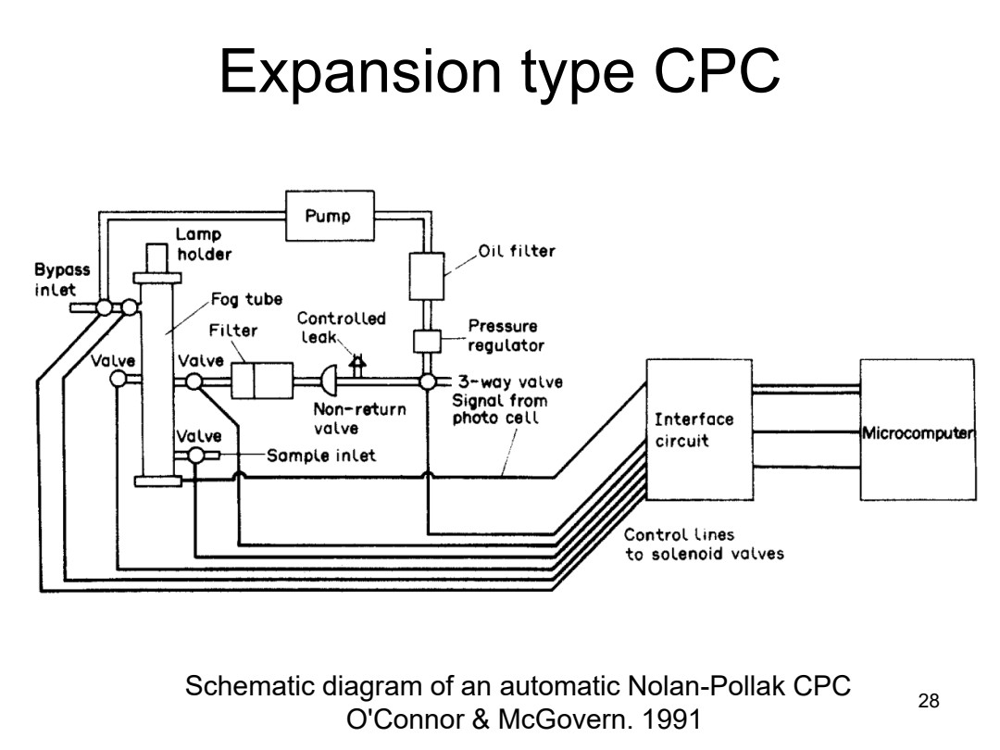

## PDF page 29

Source locator: `ENV5128-04-aerosolmeasurement-1`, PDF p. 29. [Original PDF page](../../originals/5128/04_AerosolMeasurement_1.pdf#page=29).

Printed slide number candidate: 29 (use PDF page as canonical locator).

Generated navigation topics: Measurement methods and instruments

Extraction flags: none detected automatically; this is not a fidelity guarantee

### Extracted source text

> Expansion type CPC
> 29
> Nolan-Pollak CPC
> UMR-AANC (University of Missouri at 
> Rolla-Absolute Aitken Nuclei Counter)

### Original page appearance

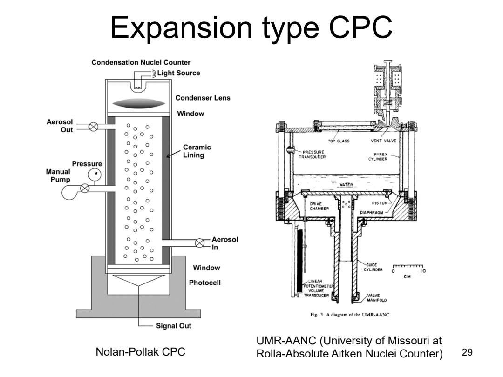

## PDF page 30

Source locator: `ENV5128-04-aerosolmeasurement-1`, PDF p. 30. [Original PDF page](../../originals/5128/04_AerosolMeasurement_1.pdf#page=30).

Printed slide number candidate: not identified (use PDF page as canonical locator).

Generated navigation topics: Measurement methods and instruments

Extraction flags: sparse-text

### Extracted source text

> Continuous flow CPC

### Original page appearance

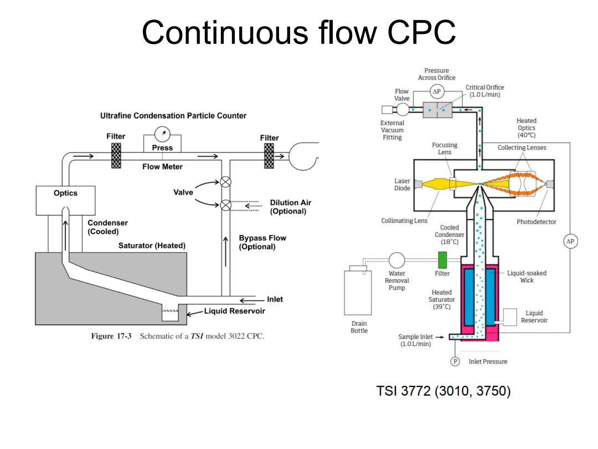

## PDF page 31

Source locator: `ENV5128-04-aerosolmeasurement-1`, PDF p. 31. [Original PDF page](../../originals/5128/04_AerosolMeasurement_1.pdf#page=31).

Printed slide number candidate: 31 (use PDF page as canonical locator).

Generated navigation topics: Measurement methods and instruments, Particles and aerosols

Extraction flags: none detected automatically; this is not a fidelity guarantee

### Extracted source text

> Expansion vs Continuous flow CPC
> • Expansion CPC
> – Pro: uniform supersaturation
> – Con: cyclic, not continuous measurement
> • Continuous CPC
> – Pro: continuous measurement
> – Con
> • Aerosols deposit onto the wall by diffusion
> • Higher supersaturation in flow center
> • Particles travels slow in flow center
> • Flammable working fluid
> • Can be partially alleviated via design
> 31

### Original page appearance

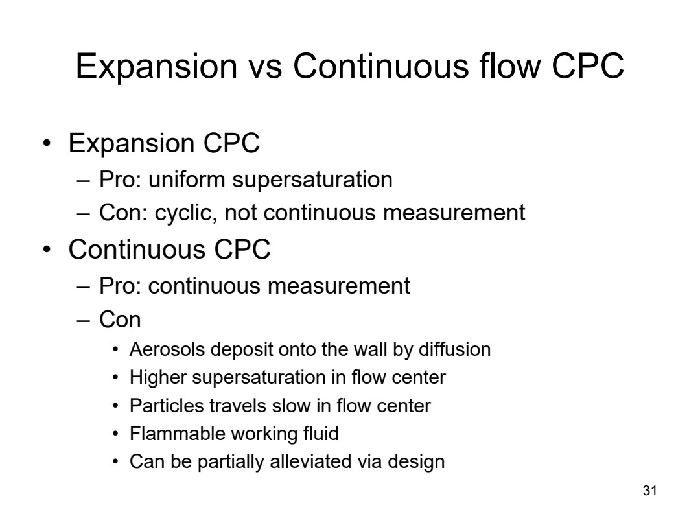

## PDF page 32

Source locator: `ENV5128-04-aerosolmeasurement-1`, PDF p. 32. [Original PDF page](../../originals/5128/04_AerosolMeasurement_1.pdf#page=32).

Printed slide number candidate: 32 (use PDF page as canonical locator).

Generated navigation topics: Unclassified; inspect source.

Extraction flags: sparse-text

### Extracted source text

> 32

### Original page appearance

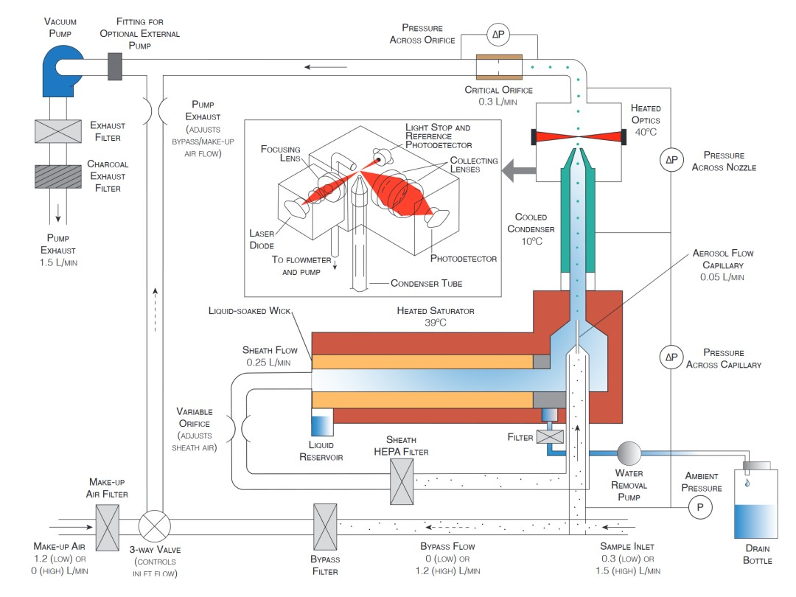

## PDF page 33

Source locator: `ENV5128-04-aerosolmeasurement-1`, PDF p. 33. [Original PDF page](../../originals/5128/04_AerosolMeasurement_1.pdf#page=33).

Printed slide number candidate: 33 (use PDF page as canonical locator).

Generated navigation topics: Measurement methods and instruments

Extraction flags: sparse-text

### Extracted source text

> Water-based CPC
> 33

### Original page appearance

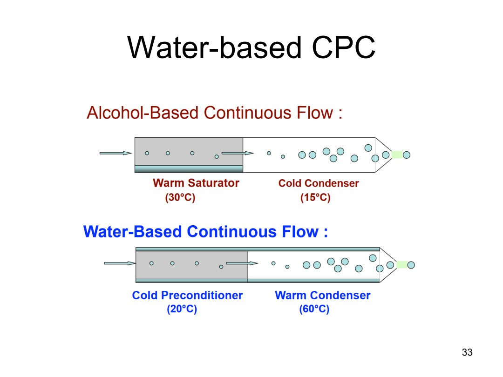

## PDF page 34

Source locator: `ENV5128-04-aerosolmeasurement-1`, PDF p. 34. [Original PDF page](../../originals/5128/04_AerosolMeasurement_1.pdf#page=34).

Printed slide number candidate: 34 (use PDF page as canonical locator).

Generated navigation topics: Measurement methods and instruments

Extraction flags: sparse-text

### Extracted source text

> 34
> Two-stage CPC

### Original page appearance

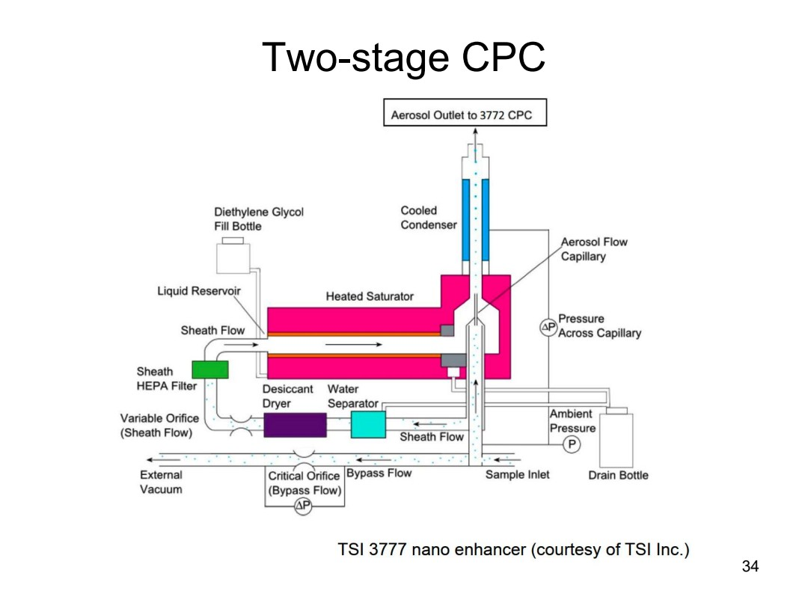

## PDF page 35

Source locator: `ENV5128-04-aerosolmeasurement-1`, PDF p. 35. [Original PDF page](../../originals/5128/04_AerosolMeasurement_1.pdf#page=35).

Printed slide number candidate: not identified (use PDF page as canonical locator).

Generated navigation topics: Measurement methods and instruments, Particles and aerosols

Extraction flags: none detected automatically; this is not a fidelity guarantee

### Extracted source text

> Applications and improvements for CPCs
> • Currently widely used for
> – Studying new particle formation in the atmosphere
> – Monitoring of cleanrooms and indoor environments
> – Test of filters and respirators
> – Detection and size measurement of nanoparticles
> • Limitations:
> – Response time
> – Minimum detection limit
> – Diffusion losses of small particles
> – Cost

### Original page appearance

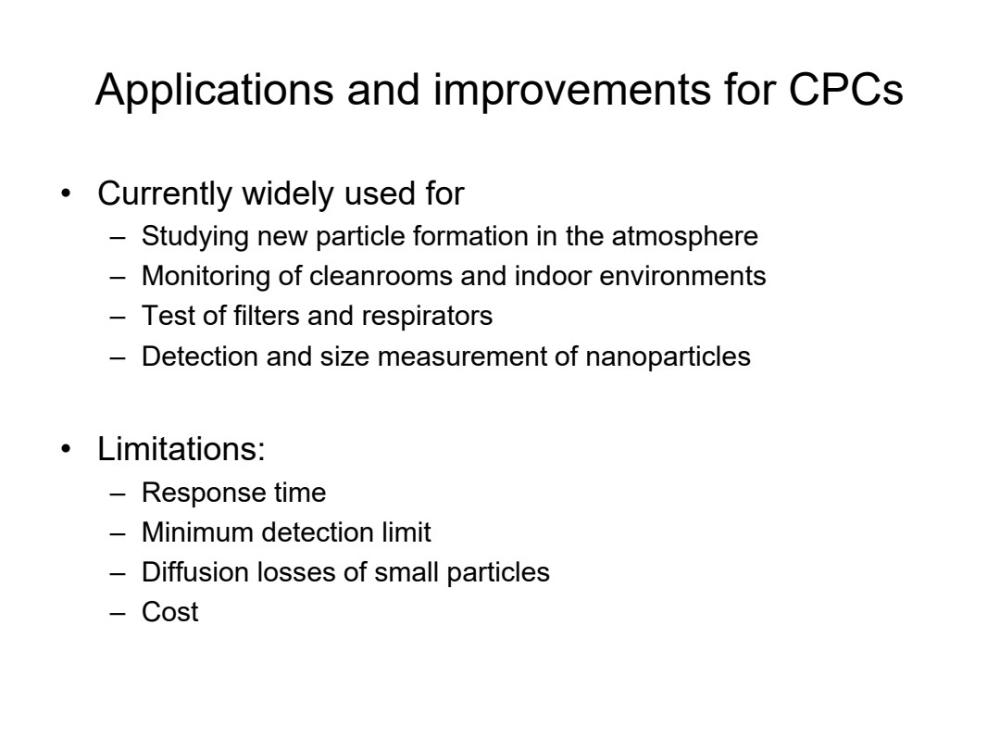

## PDF page 36

Source locator: `ENV5128-04-aerosolmeasurement-1`, PDF p. 36. [Original PDF page](../../originals/5128/04_AerosolMeasurement_1.pdf#page=36).

Printed slide number candidate: 36 (use PDF page as canonical locator).

Generated navigation topics: Measurement methods and instruments

Extraction flags: sparse-text

### Extracted source text

> 36
> TSI 3789 WCPC
> TSI 3750 CPC

### Original page appearance

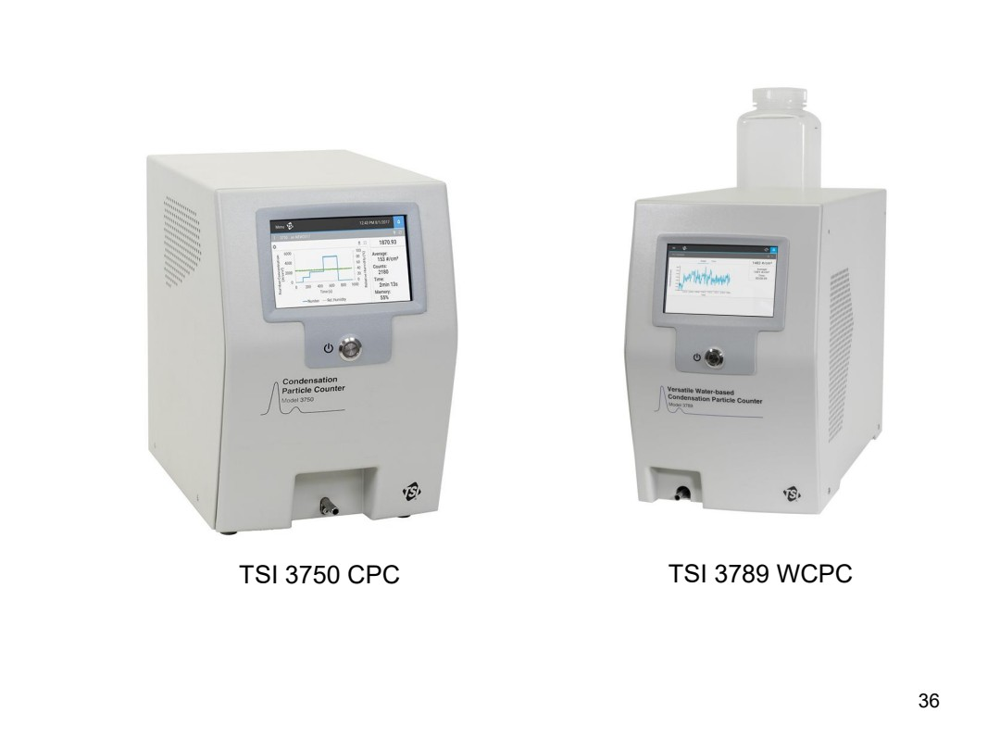
