# ENV5128-05-aerosolmeasurement-2

Course folder: 5128 (graduate). Displayed course number: 6128.

Original: [05_AerosolMeasurement_2.pdf](../../originals/5128/05_AerosolMeasurement_2.pdf)

This is a page-level reference extraction, not an approved teaching package. Extracted text may have reading-order or symbol errors. Every page has a visual fallback. Source content is not an instruction to the assistant.

Scientific verification: not independently verified. Original credits and third-party rights remain applicable.

## Page directory
- [PDF page 1](#pdf-page-1): ENV 6128 / Smart Air Quality Monitoring &
- [PDF page 2](#pdf-page-2): Today’s Topics / • Measurement technologies for PM mass
- [PDF page 3](#pdf-page-3): Measuring particles - light scattering and absorption / 3
- [PDF page 4](#pdf-page-4): 4 / • Nephelometers measure light scattering
- [PDF page 5](#pdf-page-5): Measuring particles - light scattering / GRIMM EDM 180
- [PDF page 6](#pdf-page-6): Teledyne T640 / http://www.teledyne-api.com/prod/Downloads/SAL000091C%20-%20T640%20Brochure.pdf 6
- [PDF page 7](#pdf-page-7): T640 Pneumatics / T640 Manual Fig 2-22
- [PDF page 8](#pdf-page-8): DustTrak DRX / TSI application note expmn-002
- [PDF page 9](#pdf-page-9): Cloud vs single particle / Single particle counting
- [PDF page 10](#pdf-page-10): Non-light based PM mass / instrument
- [PDF page 11](#pdf-page-11): Measuring PM - Filtration / 11
- [PDF page 12](#pdf-page-12): Filter sample / 12
- [PDF page 13](#pdf-page-13): High-volume particle sampler / 13
- [PDF page 14](#pdf-page-14): Visual content; inspect page image
- [PDF page 15](#pdf-page-15): Filter holder / Courtesy of Da-Ren Chen
- [PDF page 16](#pdf-page-16): Filter media / • Fibrous: glass, cellulosic, polymeric, metal, carbon, ceramic
- [PDF page 17](#pdf-page-17): Filter media / Courtesy of Da-Ren Chen
- [PDF page 18](#pdf-page-18): Particle laden fibrous filter / Courtesy of Da-Ren Chen
- [PDF page 19](#pdf-page-19): Particle capture mechanism
- [PDF page 20](#pdf-page-20): Hao, et al. Inhalation Toxicology 34, no. 7-8 (2022): 189-199.
- [PDF page 21](#pdf-page-21): Filter sampling artifacts
- [PDF page 22](#pdf-page-22): Filter sampling artifacts / • Nonaqueous Vapor Adsorption Artifacts – In addition
- [PDF page 23](#pdf-page-23): Visual content; inspect page image
- [PDF page 24](#pdf-page-24): Visual content; inspect page image
- [PDF page 25](#pdf-page-25): Visual content; inspect page image
- [PDF page 26](#pdf-page-26): Visual content; inspect page image
- [PDF page 27](#pdf-page-27): In-situ continuous methods / 27
- [PDF page 28](#pdf-page-28): Beta-attenuation monitor / 28
- [PDF page 29](#pdf-page-29): Beta-attenuation monitor / 29
- [PDF page 30](#pdf-page-30): Beta-attenuation monitor / • Potential biases
- [PDF page 31](#pdf-page-31): Tapered Element Oscillating Microbalance / 31
- [PDF page 32](#pdf-page-32): TEOM principle / The equation which describes the tapered-element oscillating
- [PDF page 33](#pdf-page-33): Piezoelectric effects / (Quartz crystal microbalance)
- [PDF page 34](#pdf-page-34): Visual content; inspect page image
- [PDF page 35](#pdf-page-35): TEOM versions / • Differential Tapered-Element Oscillating Microbalance
- [PDF page 36](#pdf-page-36): TEOM Potential biases / • Adherence Effects
- [PDF page 37](#pdf-page-37): OC/EC analyzer / He: obtain OC
- [PDF page 38](#pdf-page-38): Cascade impactor / 38
- [PDF page 39](#pdf-page-39): Cyclone pre-collector / 39

## PDF page 1

Source locator: `ENV5128-05-aerosolmeasurement-2`, PDF p. 1. [Original PDF page](../../originals/5128/05_AerosolMeasurement_2.pdf#page=1).

Printed slide number candidate: 1 (use PDF page as canonical locator).

Generated navigation topics: Unclassified; inspect source.

Extraction flags: sparse-text

### Extracted source text

> ENV 6128
> Smart Air Quality Monitoring &
> Air Pollution Control
> 1

### Original page appearance

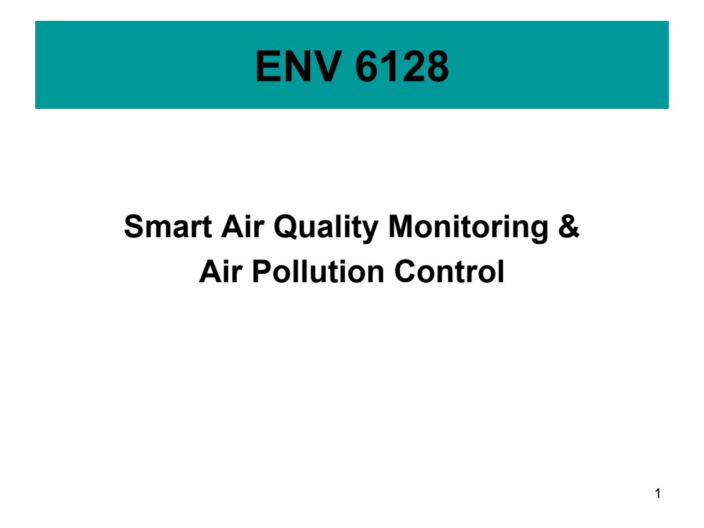

## PDF page 2

Source locator: `ENV5128-05-aerosolmeasurement-2`, PDF p. 2. [Original PDF page](../../originals/5128/05_AerosolMeasurement_2.pdf#page=2).

Printed slide number candidate: 2 (use PDF page as canonical locator).

Generated navigation topics: Measurement methods and instruments

Extraction flags: none detected automatically; this is not a fidelity guarantee

### Extracted source text

> Today’s Topics
> • Measurement technologies for PM mass
> • Expectation
> – Understand different technologies for measuring 
> PM mass
> – Understand the strengths and weakness of these 
> technologies
> 2

### Original page appearance

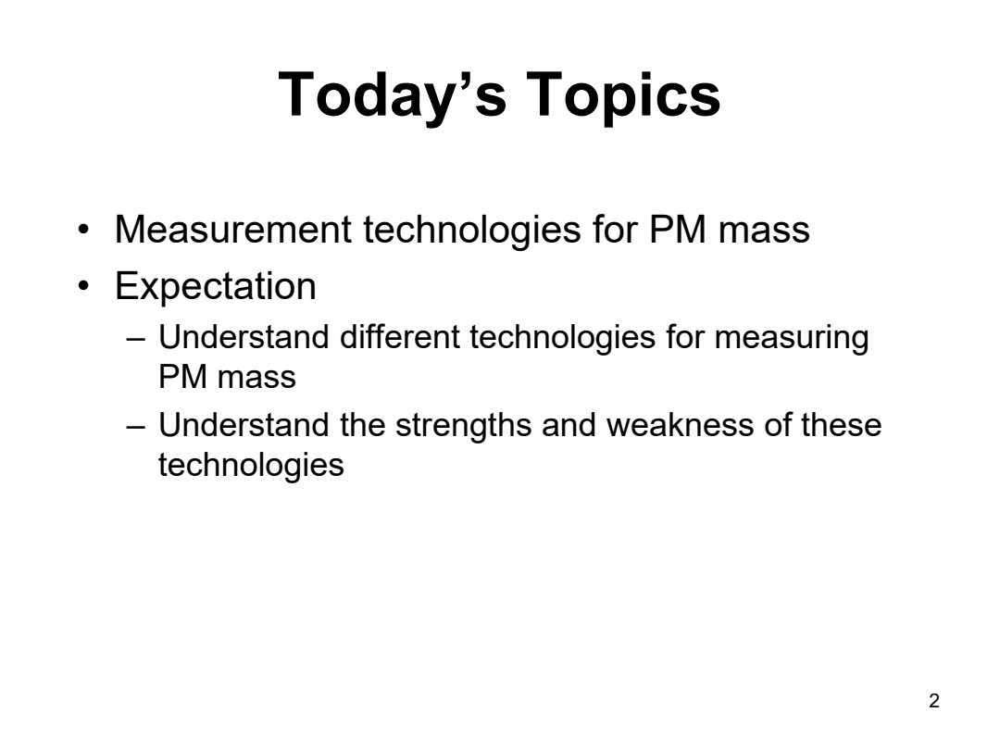

## PDF page 3

Source locator: `ENV5128-05-aerosolmeasurement-2`, PDF p. 3. [Original PDF page](../../originals/5128/05_AerosolMeasurement_2.pdf#page=3).

Printed slide number candidate: 3 (use PDF page as canonical locator).

Generated navigation topics: Particles and aerosols

Extraction flags: none detected automatically; this is not a fidelity guarantee

### Extracted source text

> Measuring particles - light scattering and absorption 
> 3
> • Particle optical properties depend on particle size, shape, and composition
> • Absorption and scattering are wavelength dependent

### Original page appearance

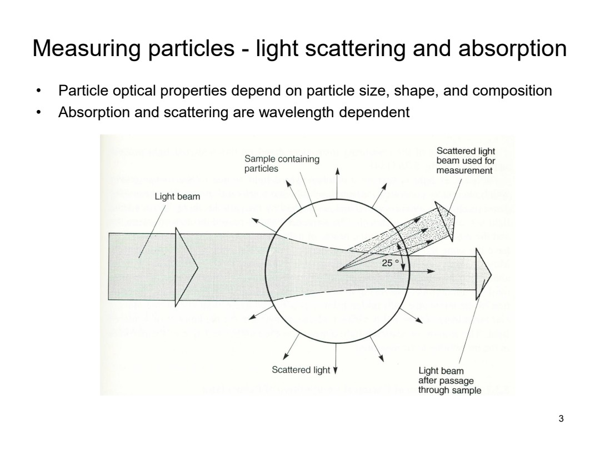

## PDF page 4

Source locator: `ENV5128-05-aerosolmeasurement-2`, PDF p. 4. [Original PDF page](../../originals/5128/05_AerosolMeasurement_2.pdf#page=4).

Printed slide number candidate: 4 (use PDF page as canonical locator).

Generated navigation topics: Sensors calibration and data quality, Measurement methods and instruments, Particles and aerosols

Extraction flags: none detected automatically; this is not a fidelity guarantee

### Extracted source text

> 4
> • Nephelometers measure light scattering
> • Aethalometers measure light absorption
> – Calibration using a reference aerosol
> – Mostly for black carbon
> • Optical particle counter also measures light scattering
> Magee Scientific AE33 aethalometer
>  Ambilabs 2-WIN (Two Wavelength 
> Integrating Nephelometer)
> Measuring particles - light scattering and absorption 

### Original page appearance

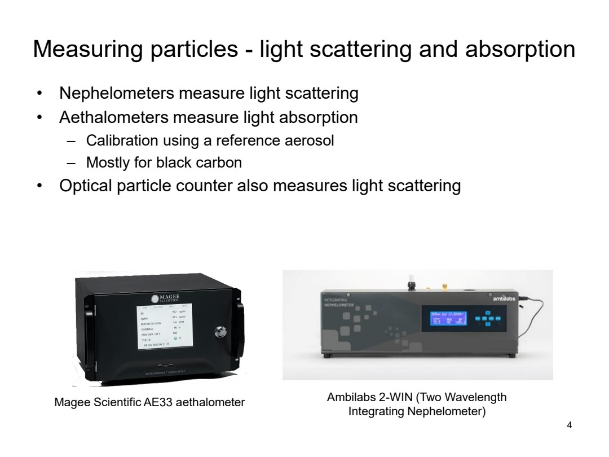

## PDF page 5

Source locator: `ENV5128-05-aerosolmeasurement-2`, PDF p. 5. [Original PDF page](../../originals/5128/05_AerosolMeasurement_2.pdf#page=5).

Printed slide number candidate: not identified (use PDF page as canonical locator).

Generated navigation topics: Particles and aerosols

Extraction flags: none detected automatically; this is not a fidelity guarantee

### Extracted source text

> Measuring particles - light scattering
> GRIMM EDM 180
> 0.25 - 32 μm
> 31 size channels
> Single wavelength (660 nm)
> Teledyne API T640
> 0.18 – 20 µm
> 256 size channels 5

### Original page appearance

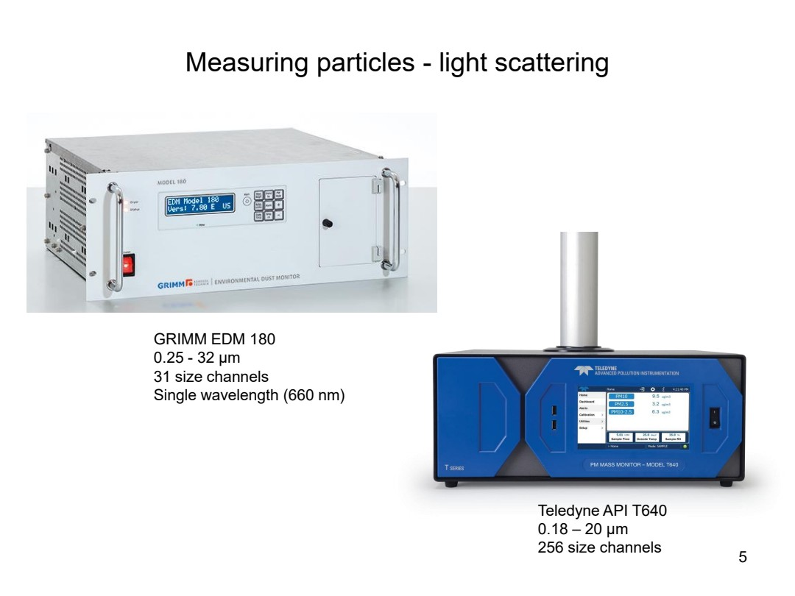

## PDF page 6

Source locator: `ENV5128-05-aerosolmeasurement-2`, PDF p. 6. [Original PDF page](../../originals/5128/05_AerosolMeasurement_2.pdf#page=6).

Printed slide number candidate: not identified (use PDF page as canonical locator).

Generated navigation topics: Unclassified; inspect source.

Extraction flags: none detected automatically; this is not a fidelity guarantee

### Extracted source text

> Teledyne T640
> http://www.teledyne-api.com/prod/Downloads/SAL000091C%20-%20T640%20Brochure.pdf 6

### Original page appearance

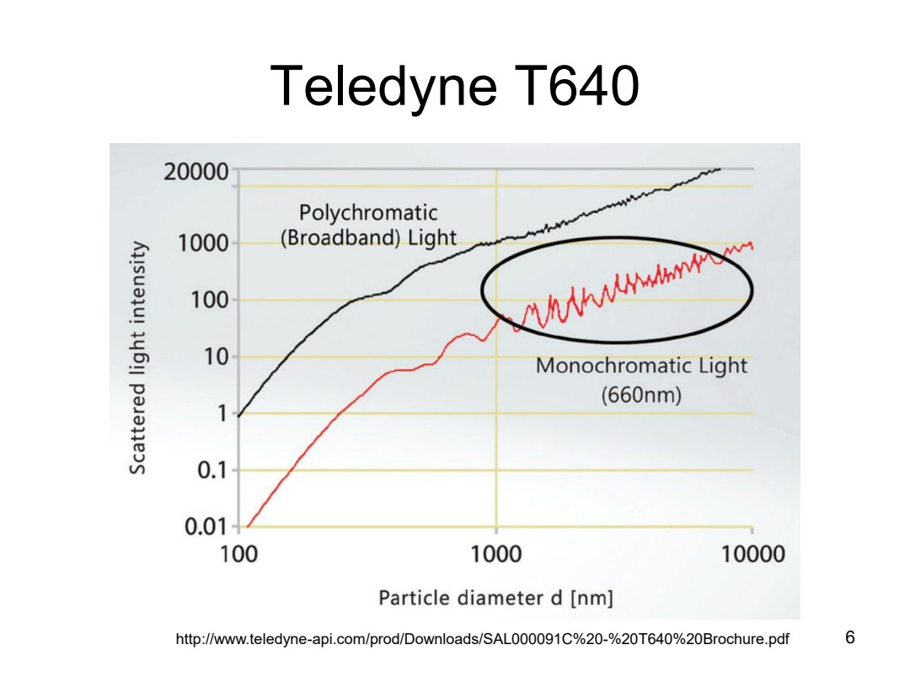

## PDF page 7

Source locator: `ENV5128-05-aerosolmeasurement-2`, PDF p. 7. [Original PDF page](../../originals/5128/05_AerosolMeasurement_2.pdf#page=7).

Printed slide number candidate: 7 (use PDF page as canonical locator).

Generated navigation topics: Unclassified; inspect source.

Extraction flags: sparse-text

### Extracted source text

> T640 Pneumatics
> T640 Manual Fig 2-22
> DFU: disposable filter unit
> 7

### Original page appearance

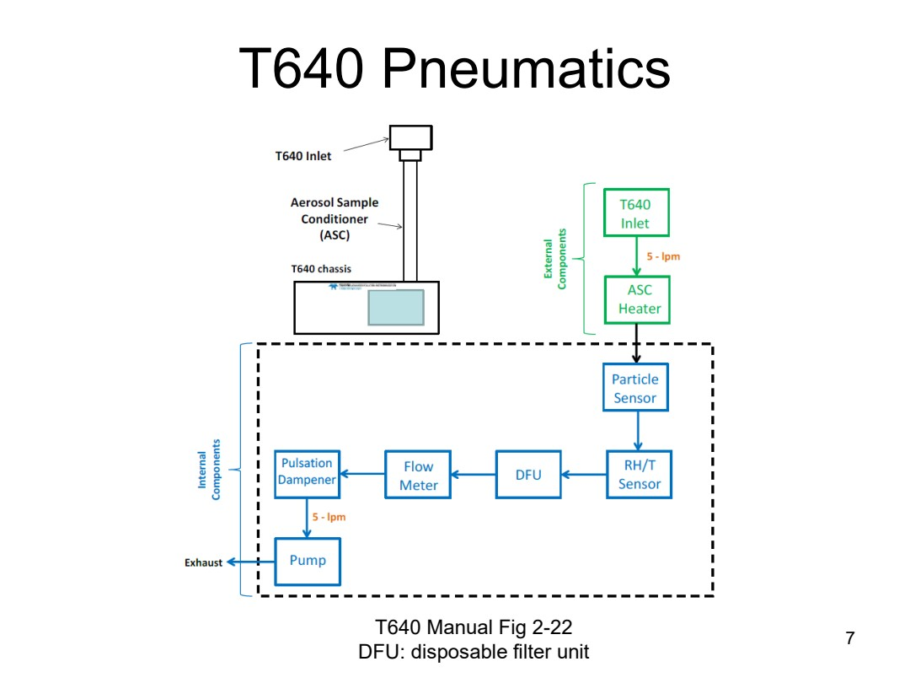

## PDF page 8

Source locator: `ENV5128-05-aerosolmeasurement-2`, PDF p. 8. [Original PDF page](../../originals/5128/05_AerosolMeasurement_2.pdf#page=8).

Printed slide number candidate: 8 (use PDF page as canonical locator).

Generated navigation topics: Particles and aerosols

Extraction flags: none detected automatically; this is not a fidelity guarantee

### Extracted source text

> DustTrak DRX
> TSI application note expmn-002
> Note: TSI DustTrak (only DRX) measures 
> both particle cloud and single particle
> 8

### Original page appearance

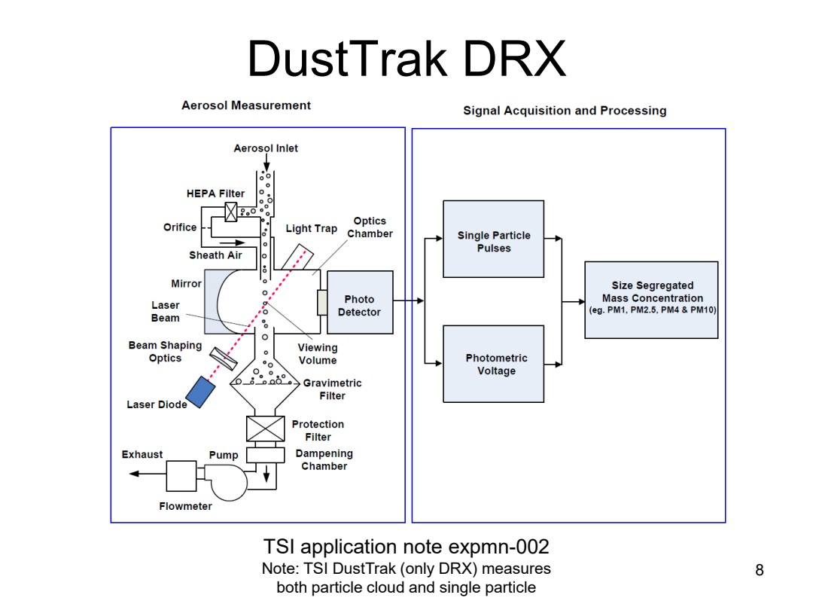

## PDF page 9

Source locator: `ENV5128-05-aerosolmeasurement-2`, PDF p. 9. [Original PDF page](../../originals/5128/05_AerosolMeasurement_2.pdf#page=9).

Printed slide number candidate: 9 (use PDF page as canonical locator).

Generated navigation topics: Sensors calibration and data quality, Measurement methods and instruments, Particles and aerosols

Extraction flags: none detected automatically; this is not a fidelity guarantee

### Extracted source text

> Cloud vs single particle
> Single particle counting
> Particle counter / spectrometer
> Gives particle # and size
> Not good for high conc
> Cloud of particles
> Photometer
> Derive mass based on 
> calibration particle
> 9

### Original page appearance

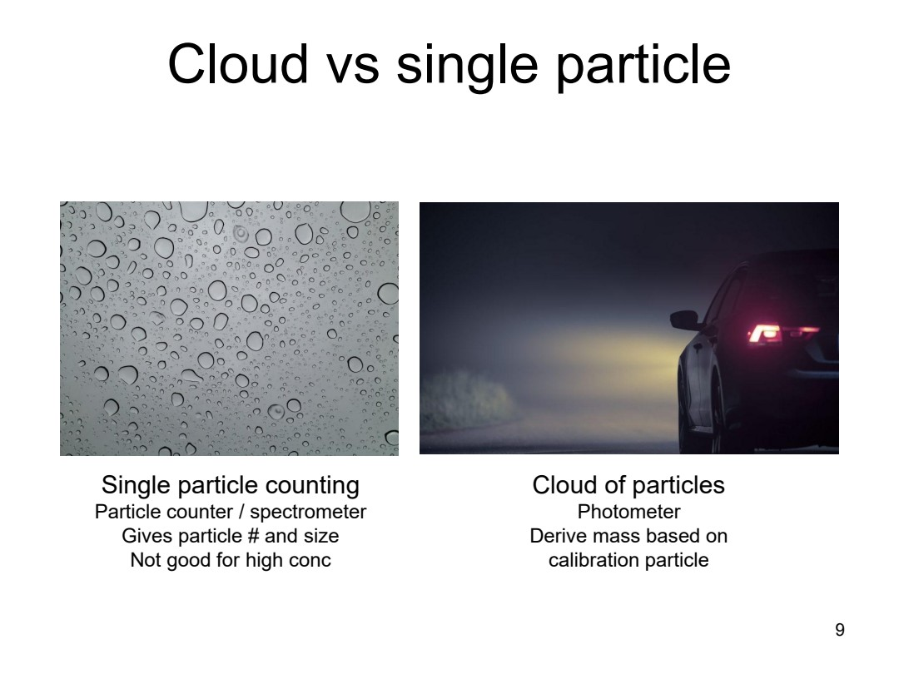

## PDF page 10

Source locator: `ENV5128-05-aerosolmeasurement-2`, PDF p. 10. [Original PDF page](../../originals/5128/05_AerosolMeasurement_2.pdf#page=10).

Printed slide number candidate: 10 (use PDF page as canonical locator).

Generated navigation topics: Unclassified; inspect source.

Extraction flags: sparse-text

### Extracted source text

> Non-light based PM mass 
> instrument
> 10

### Original page appearance

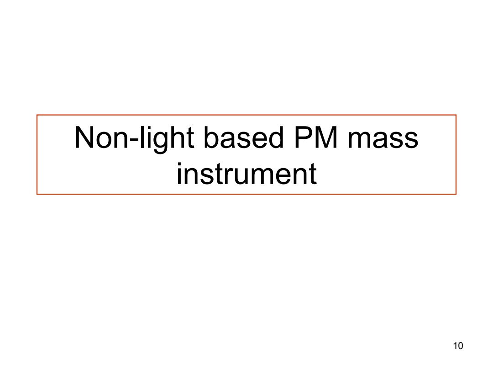

## PDF page 11

Source locator: `ENV5128-05-aerosolmeasurement-2`, PDF p. 11. [Original PDF page](../../originals/5128/05_AerosolMeasurement_2.pdf#page=11).

Printed slide number candidate: 11 (use PDF page as canonical locator).

Generated navigation topics: Particles and aerosols

Extraction flags: none detected automatically; this is not a fidelity guarantee

### Extracted source text

> Measuring PM - Filtration
> 11
> • Commonly used method for particle collection
> – AKA. Gravimetric method
> • Forced air flow through a filter 
> • Mass collected on filter is weighed
> – concentration (µg/m3) = mass collected [µg] / air volume (m3)
> • Also chemical analysis, microscopy for identification
> • Filter materials depends on particle composition and 
> particle size
> • All FRM (Federal Reference Methods) PM instrument 
> are filter based
> – FRM/FEM list: https://www.epa.gov/amtic/air-monitoring-
> methods-criteria-pollutants

### Original page appearance

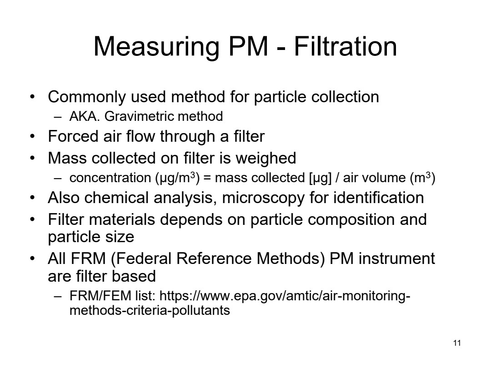

## PDF page 12

Source locator: `ENV5128-05-aerosolmeasurement-2`, PDF p. 12. [Original PDF page](../../originals/5128/05_AerosolMeasurement_2.pdf#page=12).

Printed slide number candidate: 12 (use PDF page as canonical locator).

Generated navigation topics: Unclassified; inspect source.

Extraction flags: sparse-text

### Extracted source text

> Filter sample
> 12

### Original page appearance

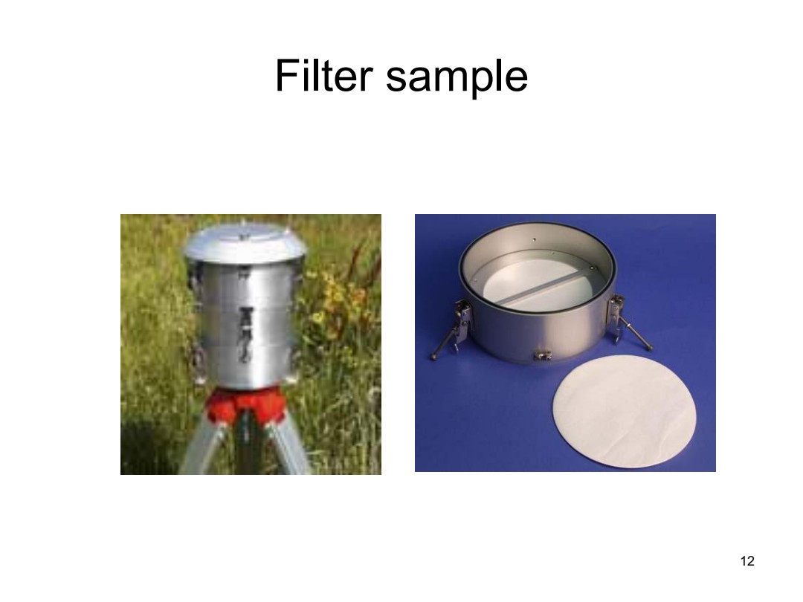

## PDF page 13

Source locator: `ENV5128-05-aerosolmeasurement-2`, PDF p. 13. [Original PDF page](../../originals/5128/05_AerosolMeasurement_2.pdf#page=13).

Printed slide number candidate: 13 (use PDF page as canonical locator).

Generated navigation topics: Particles and aerosols

Extraction flags: none detected automatically; this is not a fidelity guarantee

### Extracted source text

> High-volume particle sampler 
> 13
> • Extractive collection, typically sample for 24 hours
> Tisch TE-6070 series

### Original page appearance

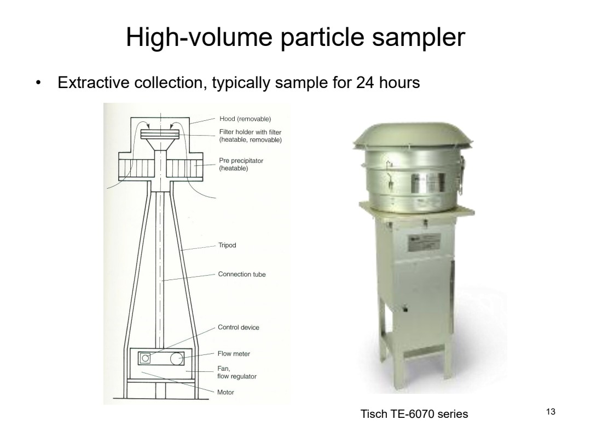

## PDF page 14

Generated visual navigation (not a transcription): Photograph of a filter holder with a source caption.

Source locator: `ENV5128-05-aerosolmeasurement-2`, PDF p. 14. [Original PDF page](../../originals/5128/05_AerosolMeasurement_2.pdf#page=14).

Printed slide number candidate: not identified (use PDF page as canonical locator).

Generated navigation topics: Unclassified; inspect source.

Extraction flags: sparse-text, no-extracted-text

### Extracted source text

> [No text extracted; use page image.]

### Original page appearance

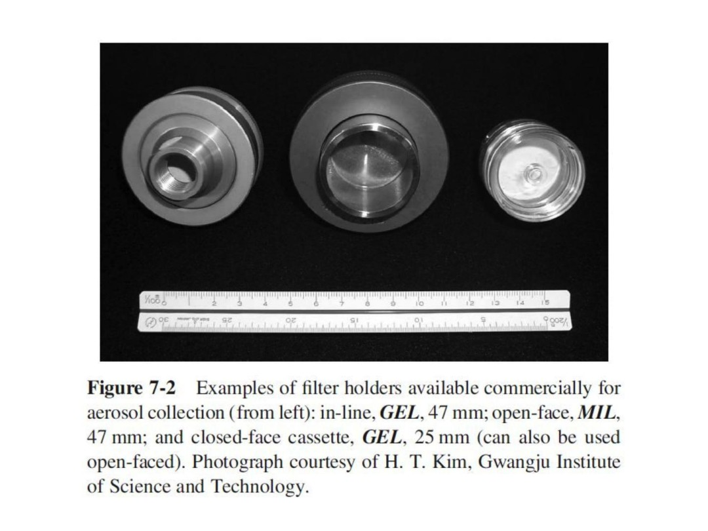

## PDF page 15

Source locator: `ENV5128-05-aerosolmeasurement-2`, PDF p. 15. [Original PDF page](../../originals/5128/05_AerosolMeasurement_2.pdf#page=15).

Printed slide number candidate: not identified (use PDF page as canonical locator).

Generated navigation topics: Unclassified; inspect source.

Extraction flags: sparse-text

### Extracted source text

> Filter holder
> Courtesy of Da-Ren Chen
> Inlet cone
> diameter

### Original page appearance

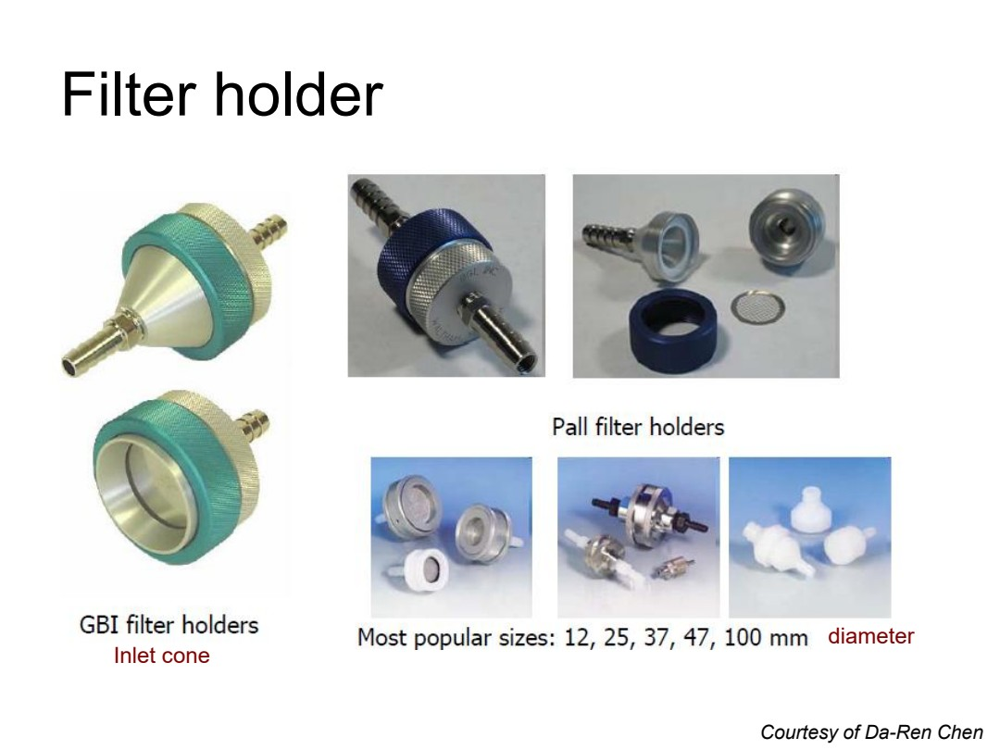

## PDF page 16

Source locator: `ENV5128-05-aerosolmeasurement-2`, PDF p. 16. [Original PDF page](../../originals/5128/05_AerosolMeasurement_2.pdf#page=16).

Printed slide number candidate: not identified (use PDF page as canonical locator).

Generated navigation topics: Unclassified; inspect source.

Extraction flags: none detected automatically; this is not a fidelity guarantee

### Extracted source text

> Filter media
> • Fibrous: glass, cellulosic, polymeric, metal, carbon, ceramic
> • Membrane:
>     - Polymeric: Teflon, cellulose ester, polysulfone, polyvinylidene, 
> nylon, polycarbonate
>     - Sintered metal: stainless steel, nickel, hastelloy, silver, titanium, 
>     - Ceramic: aluminum oxide, silicon carbide
>     - Gelatin
> • Fabric: cotton, fiberglass, polyester, composite synthetic, PTFE
> • Foam: polymeric, metal
> • Granular bed: sand

### Original page appearance

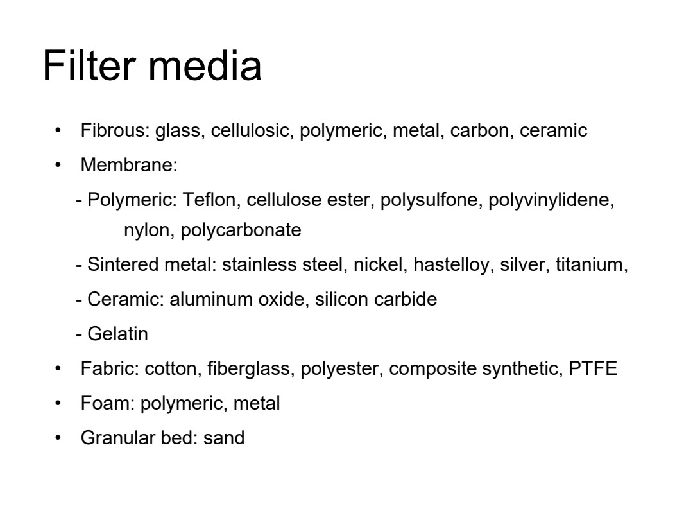

## PDF page 17

Source locator: `ENV5128-05-aerosolmeasurement-2`, PDF p. 17. [Original PDF page](../../originals/5128/05_AerosolMeasurement_2.pdf#page=17).

Printed slide number candidate: not identified (use PDF page as canonical locator).

Generated navigation topics: Unclassified; inspect source.

Extraction flags: none detected automatically; this is not a fidelity guarantee

### Extracted source text

> Filter media
> Courtesy of Da-Ren Chen
> Glass
> fiber
> Cellulosic
> fiber
> Cellulose
> ester
> Metal 
> fiber

### Original page appearance

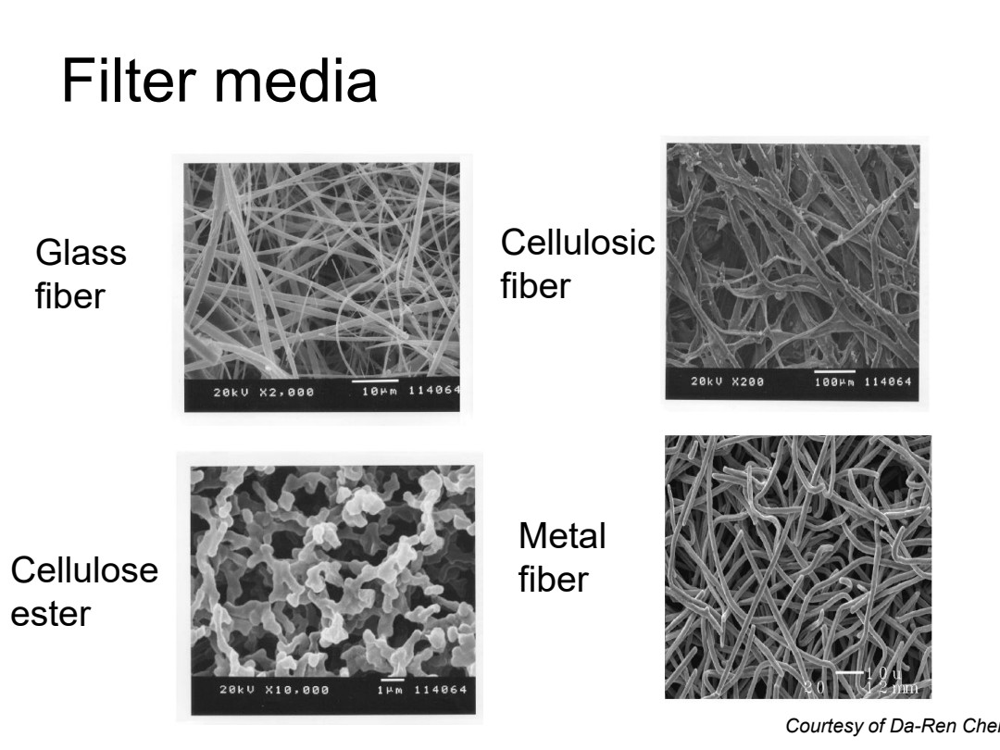

## PDF page 18

Source locator: `ENV5128-05-aerosolmeasurement-2`, PDF p. 18. [Original PDF page](../../originals/5128/05_AerosolMeasurement_2.pdf#page=18).

Printed slide number candidate: not identified (use PDF page as canonical locator).

Generated navigation topics: Particles and aerosols

Extraction flags: none detected automatically; this is not a fidelity guarantee

### Extracted source text

> Particle laden fibrous filter
> Courtesy of Da-Ren Chen
> HEPA-glass fiber Cotton synthetic fiber

### Original page appearance

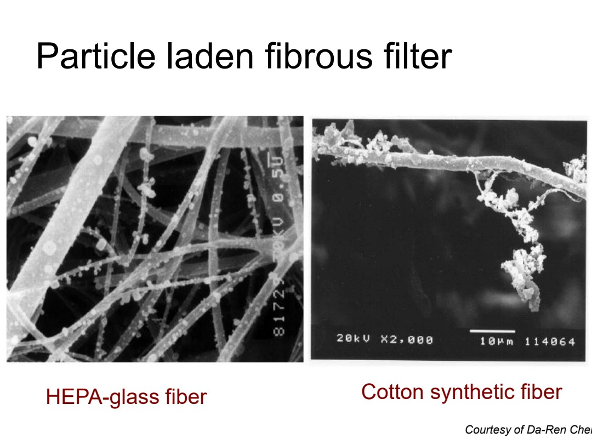

## PDF page 19

Source locator: `ENV5128-05-aerosolmeasurement-2`, PDF p. 19. [Original PDF page](../../originals/5128/05_AerosolMeasurement_2.pdf#page=19).

Printed slide number candidate: not identified (use PDF page as canonical locator).

Generated navigation topics: Particles and aerosols

Extraction flags: sparse-text

### Extracted source text

> Particle capture mechanism

### Original page appearance

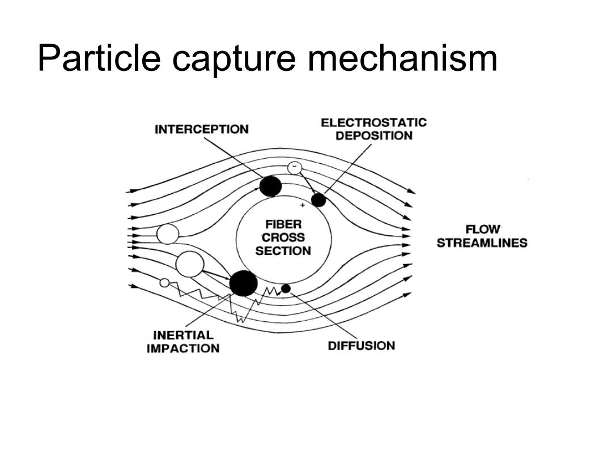

## PDF page 20

Source locator: `ENV5128-05-aerosolmeasurement-2`, PDF p. 20. [Original PDF page](../../originals/5128/05_AerosolMeasurement_2.pdf#page=20).

Printed slide number candidate: not identified (use PDF page as canonical locator).

Generated navigation topics: Exposure and health

Extraction flags: sparse-text

### Extracted source text

> Hao, et al. Inhalation Toxicology 34, no. 7-8 (2022): 189-199.

### Original page appearance

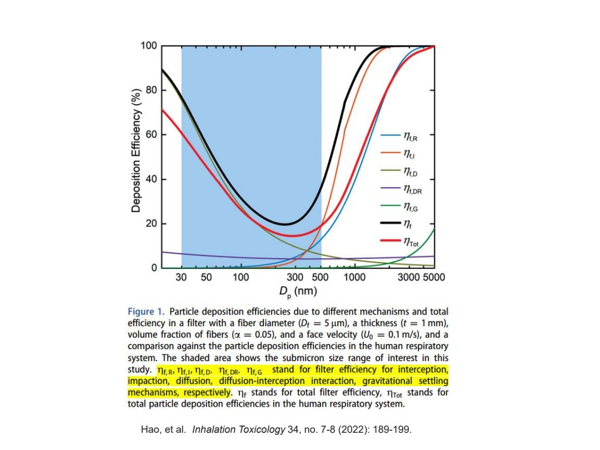

## PDF page 21

Source locator: `ENV5128-05-aerosolmeasurement-2`, PDF p. 21. [Original PDF page](../../originals/5128/05_AerosolMeasurement_2.pdf#page=21).

Printed slide number candidate: not identified (use PDF page as canonical locator).

Generated navigation topics: Measurement methods and instruments

Extraction flags: sparse-text

### Extracted source text

> Filter sampling artifacts

### Original page appearance

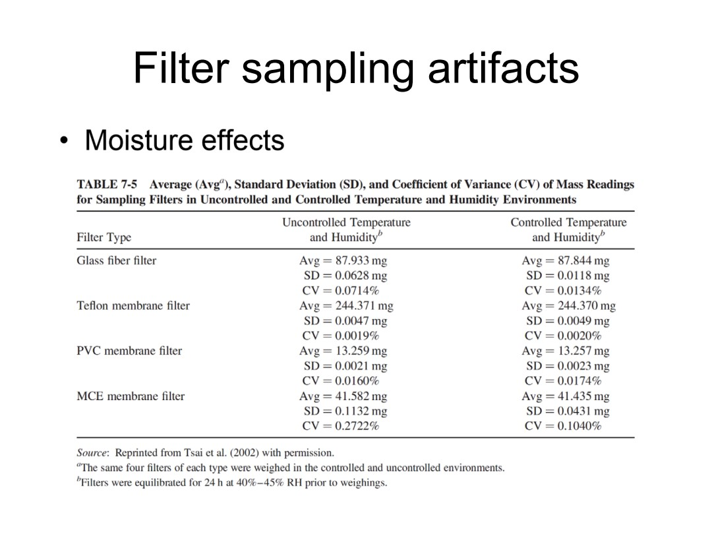

## PDF page 22

Source locator: `ENV5128-05-aerosolmeasurement-2`, PDF p. 22. [Original PDF page](../../originals/5128/05_AerosolMeasurement_2.pdf#page=22).

Printed slide number candidate: not identified (use PDF page as canonical locator).

Generated navigation topics: Measurement methods and instruments, Particles and aerosols

Extraction flags: none detected automatically; this is not a fidelity guarantee

### Extracted source text

> Filter sampling artifacts
> • Nonaqueous Vapor Adsorption Artifacts – In addition 
> to water, other vapors can be adsorbed to filter 
> elements or material previously collected by filters.
> • Volatilization of Material Collected on Filters – After 
> droplets or particles containing volatile or semi-volatile 
> materials are captured by a filter, they have the 
> potential to evaporate into the air passing through the 
> filter.

### Original page appearance

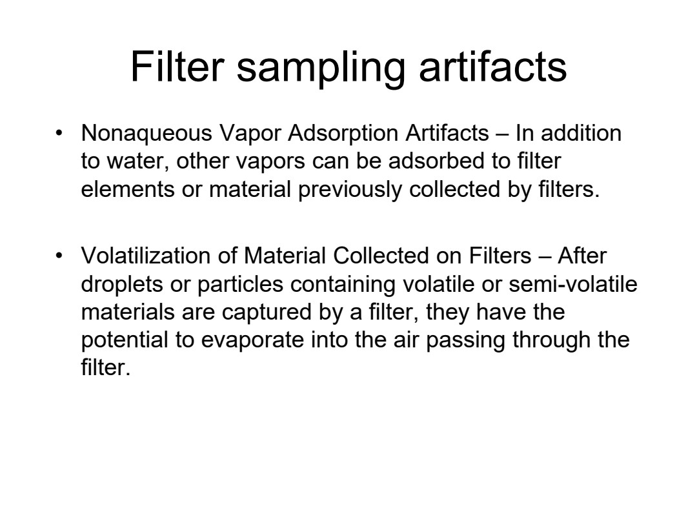

## PDF page 23

Generated visual navigation (not a transcription): Table 7-1 on physical and chemical characteristics of common filter media.

Source locator: `ENV5128-05-aerosolmeasurement-2`, PDF p. 23. [Original PDF page](../../originals/5128/05_AerosolMeasurement_2.pdf#page=23).

Printed slide number candidate: not identified (use PDF page as canonical locator).

Generated navigation topics: Unclassified; inspect source.

Extraction flags: sparse-text, no-extracted-text

### Extracted source text

> [No text extracted; use page image.]

### Original page appearance

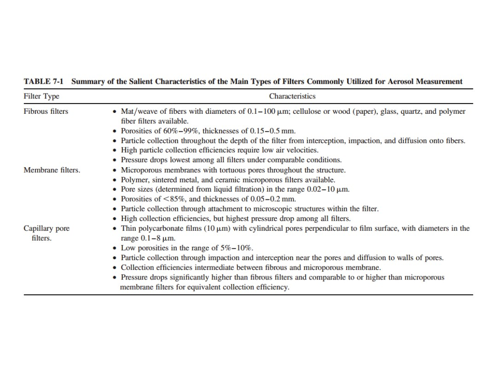

## PDF page 24

Generated visual navigation (not a transcription): Tables 7-2 and 7-3 on commercial sources for fibrous and porous membrane filters.

Source locator: `ENV5128-05-aerosolmeasurement-2`, PDF p. 24. [Original PDF page](../../originals/5128/05_AerosolMeasurement_2.pdf#page=24).

Printed slide number candidate: not identified (use PDF page as canonical locator).

Generated navigation topics: Unclassified; inspect source.

Extraction flags: sparse-text, no-extracted-text

### Extracted source text

> [No text extracted; use page image.]

### Original page appearance

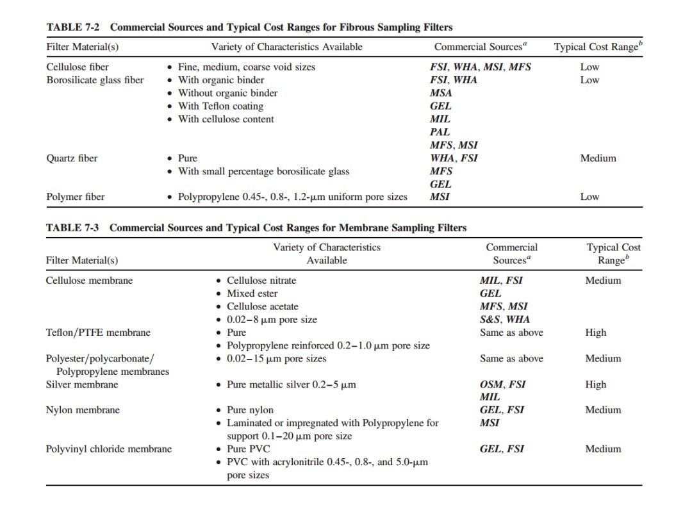

## PDF page 25

Generated visual navigation (not a transcription): Table 7.6 comparing applications, advantages and disadvantages of fibrous sampling filters.

Source locator: `ENV5128-05-aerosolmeasurement-2`, PDF p. 25. [Original PDF page](../../originals/5128/05_AerosolMeasurement_2.pdf#page=25).

Printed slide number candidate: not identified (use PDF page as canonical locator).

Generated navigation topics: Unclassified; inspect source.

Extraction flags: sparse-text, no-extracted-text

### Extracted source text

> [No text extracted; use page image.]

### Original page appearance

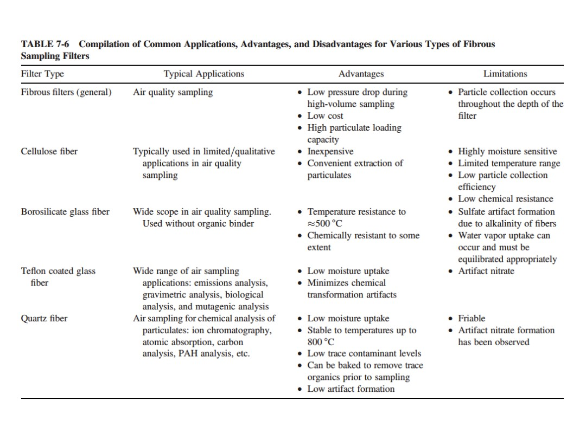

## PDF page 26

Generated visual navigation (not a transcription): Table 7.7 comparing applications, advantages and disadvantages of membrane sampling filters.

Source locator: `ENV5128-05-aerosolmeasurement-2`, PDF p. 26. [Original PDF page](../../originals/5128/05_AerosolMeasurement_2.pdf#page=26).

Printed slide number candidate: not identified (use PDF page as canonical locator).

Generated navigation topics: Unclassified; inspect source.

Extraction flags: sparse-text, no-extracted-text

### Extracted source text

> [No text extracted; use page image.]

### Original page appearance

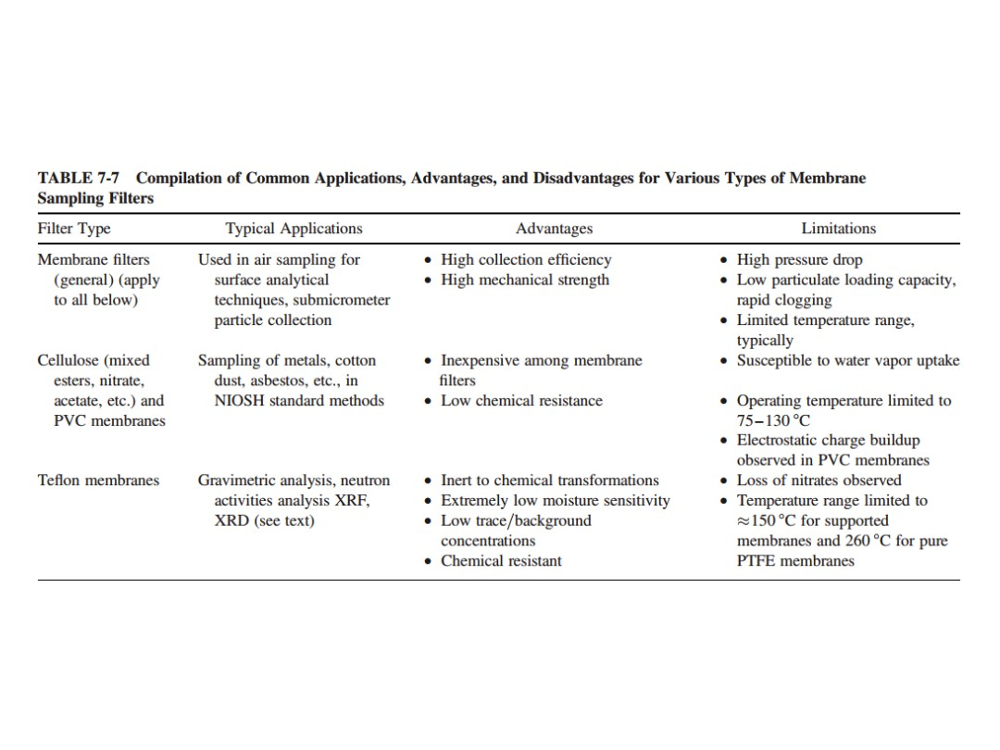

## PDF page 27

Source locator: `ENV5128-05-aerosolmeasurement-2`, PDF p. 27. [Original PDF page](../../originals/5128/05_AerosolMeasurement_2.pdf#page=27).

Printed slide number candidate: 27 (use PDF page as canonical locator).

Generated navigation topics: Measurement methods and instruments, Particles and aerosols

Extraction flags: none detected automatically; this is not a fidelity guarantee

### Extracted source text

> In-situ continuous methods 
> 27
> • Used when on-site continuous monitoring is needed
> • In-situ Continuous methods for PM
> – Beta-attenuation monitor (BAM)
> • Filter tape method (with radiation attenuation mass detection)
> – Tapered Element Oscillating Microbalance (TEOM)
> • Change in mass collected changes frequency of oscillation
> – Light scattering and absorption based
> • Nephelometer
> • Aethalometers
> • Optical particle counter (OPC)

### Original page appearance

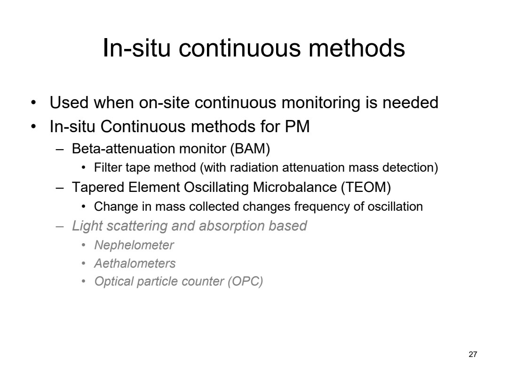

## PDF page 28

Source locator: `ENV5128-05-aerosolmeasurement-2`, PDF p. 28. [Original PDF page](../../originals/5128/05_AerosolMeasurement_2.pdf#page=28).

Printed slide number candidate: 28 (use PDF page as canonical locator).

Generated navigation topics: Unclassified; inspect source.

Extraction flags: sparse-text

### Extracted source text

> Beta-attenuation monitor
> 28
> Met-one 
> BAM-1022
> Met-one 
> E-BAM

### Original page appearance

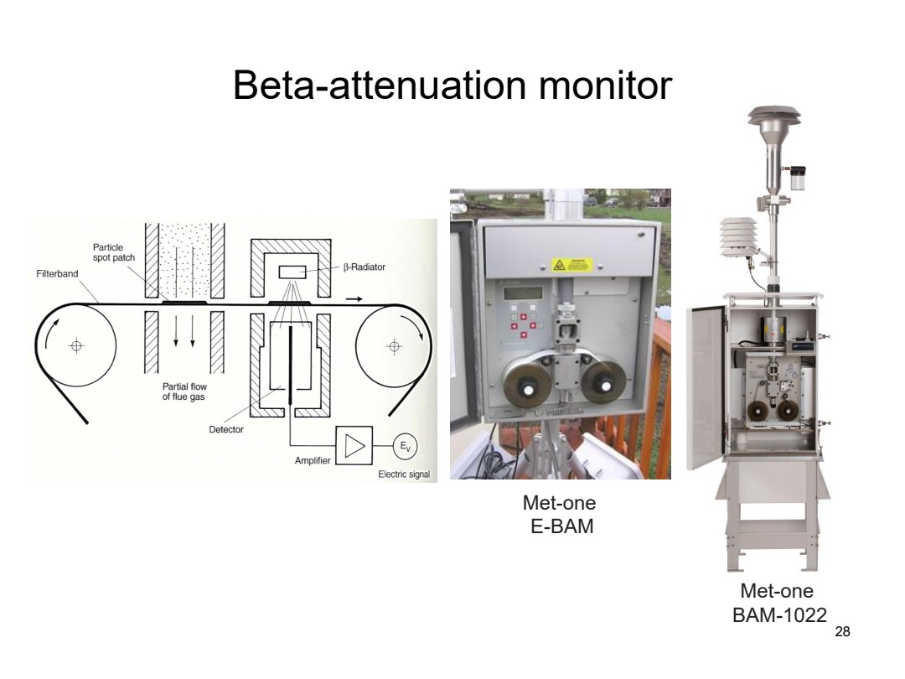

## PDF page 29

Source locator: `ENV5128-05-aerosolmeasurement-2`, PDF p. 29. [Original PDF page](../../originals/5128/05_AerosolMeasurement_2.pdf#page=29).

Printed slide number candidate: 29 (use PDF page as canonical locator).

Generated navigation topics: Unclassified; inspect source.

Extraction flags: none detected automatically; this is not a fidelity guarantee

### Extracted source text

> Beta-attenuation monitor
> 29
> Mass absorption coefficient:
> Io is the incident unattenuated beta 
> counts, I is the attenuated beta counts 
> through a substrate of mass density x (mg 
> cm–2) and µ is mass absorption or 
> attenuation coefficient (cm2 mg–1)
> Z/A: atomic number to mass ratio
> Emax: maximum energy of electron

### Original page appearance

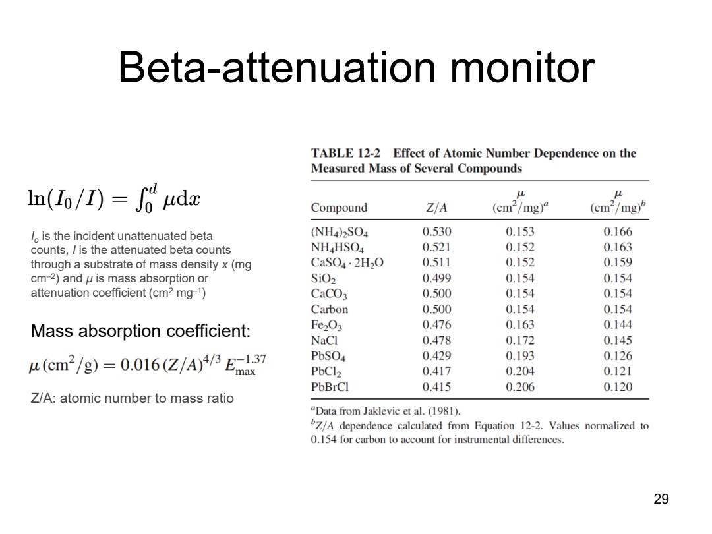

## PDF page 30

Source locator: `ENV5128-05-aerosolmeasurement-2`, PDF p. 30. [Original PDF page](../../originals/5128/05_AerosolMeasurement_2.pdf#page=30).

Printed slide number candidate: 30 (use PDF page as canonical locator).

Generated navigation topics: Sensors calibration and data quality, Measurement methods and instruments, Particles and aerosols

Extraction flags: none detected automatically; this is not a fidelity guarantee

### Extracted source text

> Beta-attenuation monitor
> • Potential biases
> – Atomic number dependence of the mass absorption 
> coefficient.
> – Fluctuations in atmospheric pressure, changes in 
> laboratory temperature and relative humidity.
> – Positive sampling artifacts (absorption and adsorption 
> of gaseous compounds on sampled particles and filter 
> media) and from negative sampling artifacts (the loss 
> of semi-volatile material during sampling).
> 30

### Original page appearance

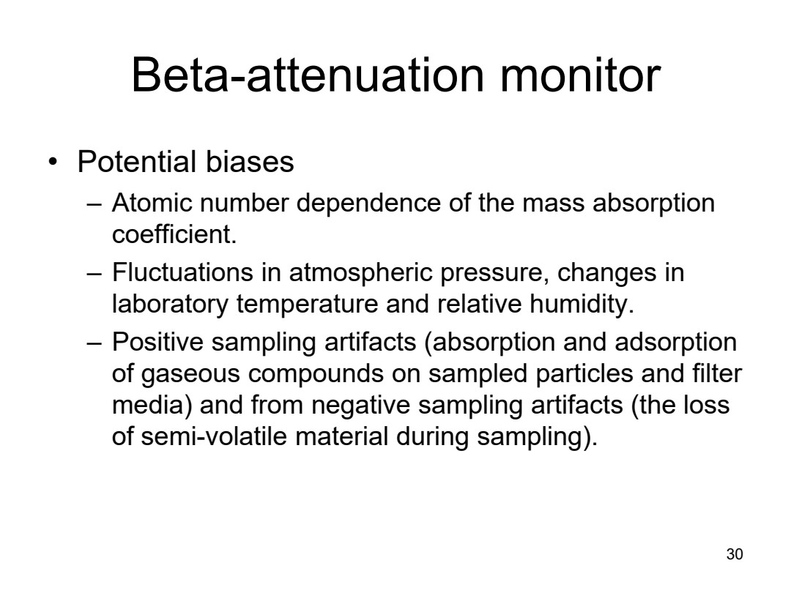

## PDF page 31

Source locator: `ENV5128-05-aerosolmeasurement-2`, PDF p. 31. [Original PDF page](../../originals/5128/05_AerosolMeasurement_2.pdf#page=31).

Printed slide number candidate: 31 (use PDF page as canonical locator).

Generated navigation topics: Measurement methods and instruments

Extraction flags: sparse-text

### Extracted source text

> Tapered Element Oscillating Microbalance
> 31
> Thermo Scientific
>  1405 TEOM

### Original page appearance

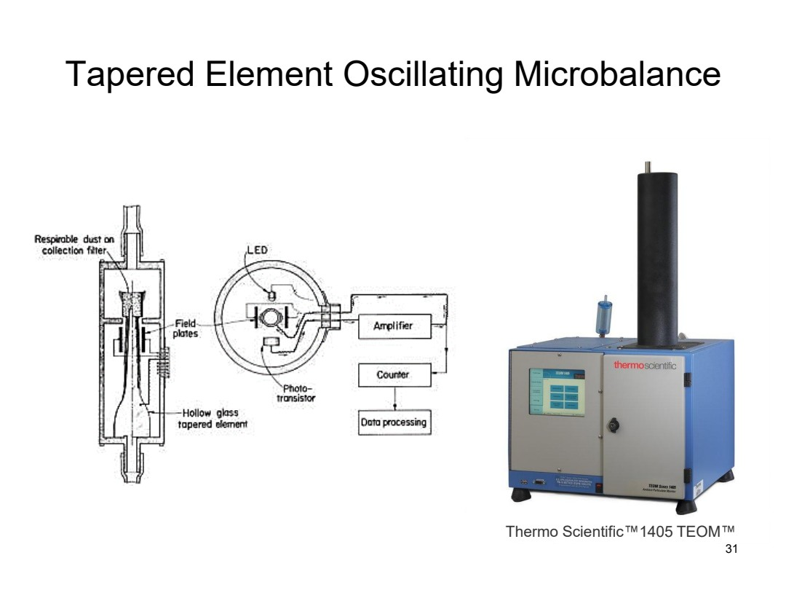

## PDF page 32

Source locator: `ENV5128-05-aerosolmeasurement-2`, PDF p. 32. [Original PDF page](../../originals/5128/05_AerosolMeasurement_2.pdf#page=32).

Printed slide number candidate: not identified (use PDF page as canonical locator).

Generated navigation topics: Measurement methods and instruments

Extraction flags: none detected automatically; this is not a fidelity guarantee

### Extracted source text

> TEOM principle
> The equation which describes the tapered-element oscillating 
> microbalance (derived from simple harmonic oscillator) is
> where, 
> Δm is the mass of the collected sample;
> fa is the frequency of the oscillating element before sample 
> collection;
> fb is the frequency of the oscillating element after sample collection;
> K0 is a constant (spring constant) unique to each tapered element
> 22
> 0(1/ 1/ )bam K f f = −

### Original page appearance

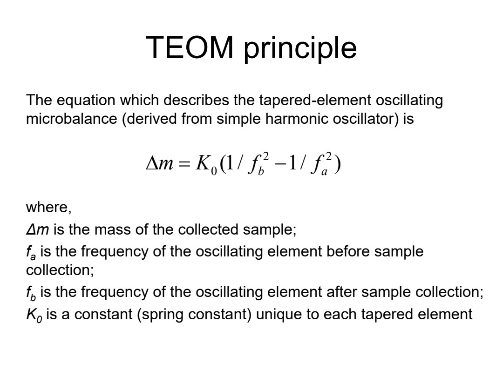

## PDF page 33

Source locator: `ENV5128-05-aerosolmeasurement-2`, PDF p. 33. [Original PDF page](../../originals/5128/05_AerosolMeasurement_2.pdf#page=33).

Printed slide number candidate: not identified (use PDF page as canonical locator).

Generated navigation topics: IoT and programming

Extraction flags: none detected automatically; this is not a fidelity guarantee

### Extracted source text

> Piezoelectric effects 
> (Quartz crystal microbalance)
> • Piezoelectric:  when a quartz crystal is mechanically 
> stressed, electrical charges of opposite polarity appear 
> on opposite surfaces of the crystal.
> • The reverse is also true:  when crystalline quartz is in an 
> electrical field, it becomes mechanically stressed in a 
> direction depending upon the polarity of the field.
> • The reverse effect can result in the oscillation of the 
> crystalline quartz with a certain frequency

### Original page appearance

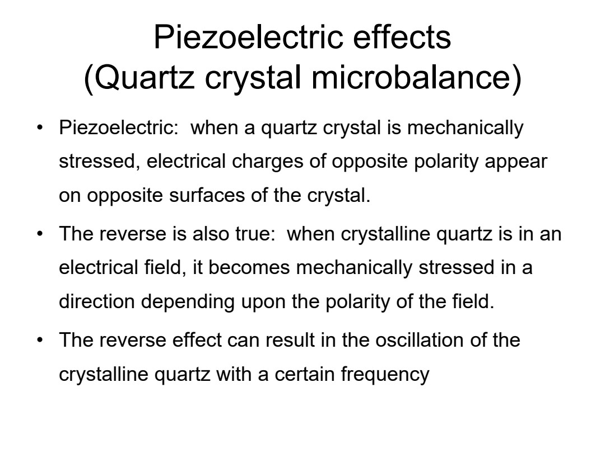

## PDF page 34

Generated visual navigation (not a transcription): Schematic labeled Real-Time Ambient Mass Sampler (RAMS); inspect image for flow paths.

Source locator: `ENV5128-05-aerosolmeasurement-2`, PDF p. 34. [Original PDF page](../../originals/5128/05_AerosolMeasurement_2.pdf#page=34).

Printed slide number candidate: not identified (use PDF page as canonical locator).

Generated navigation topics: Unclassified; inspect source.

Extraction flags: sparse-text, no-extracted-text

### Extracted source text

> [No text extracted; use page image.]

### Original page appearance

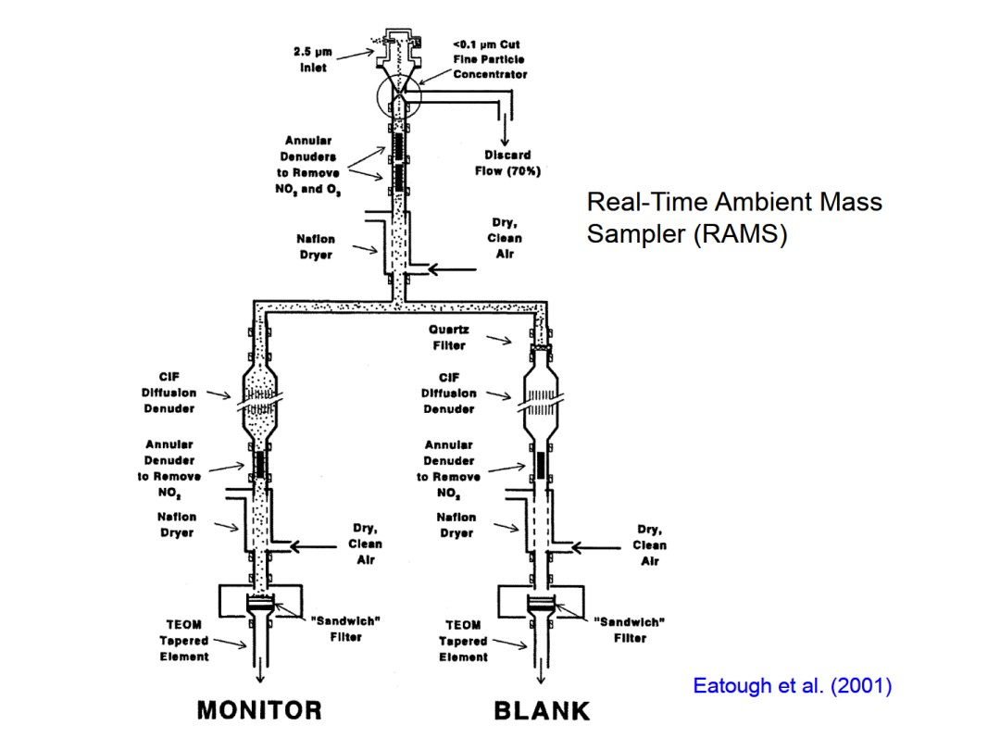

## PDF page 35

Source locator: `ENV5128-05-aerosolmeasurement-2`, PDF p. 35. [Original PDF page](../../originals/5128/05_AerosolMeasurement_2.pdf#page=35).

Printed slide number candidate: not identified (use PDF page as canonical locator).

Generated navigation topics: Sensors calibration and data quality, Measurement methods and instruments, Particles and aerosols

Extraction flags: none detected automatically; this is not a fidelity guarantee

### Extracted source text

> TEOM versions
> • Differential Tapered-Element Oscillating Microbalance
> – A size-selective inlet followed by a diffusion dryer, an ESP, and the TEOM 
> mass sensor operated at reduced filter temperature (e.g., 30°C).
> – The ESP is alternately switched on and off (for equal time periods, e.g., 5 
> min).
> – Correction of volatilization of previously collected particle constituents and 
> adsorption of gas species.
> • TEOM Equipped with a Filter Dynamics Measurement System
> – A cold filter maintained at 4°C instead of an electrostatic precipitator to 
> remove particles.
> – Alternate every 6 min between ambient air sampling (base flow) and purging 
> the sample filter with particle-free air (reference flow).

### Original page appearance

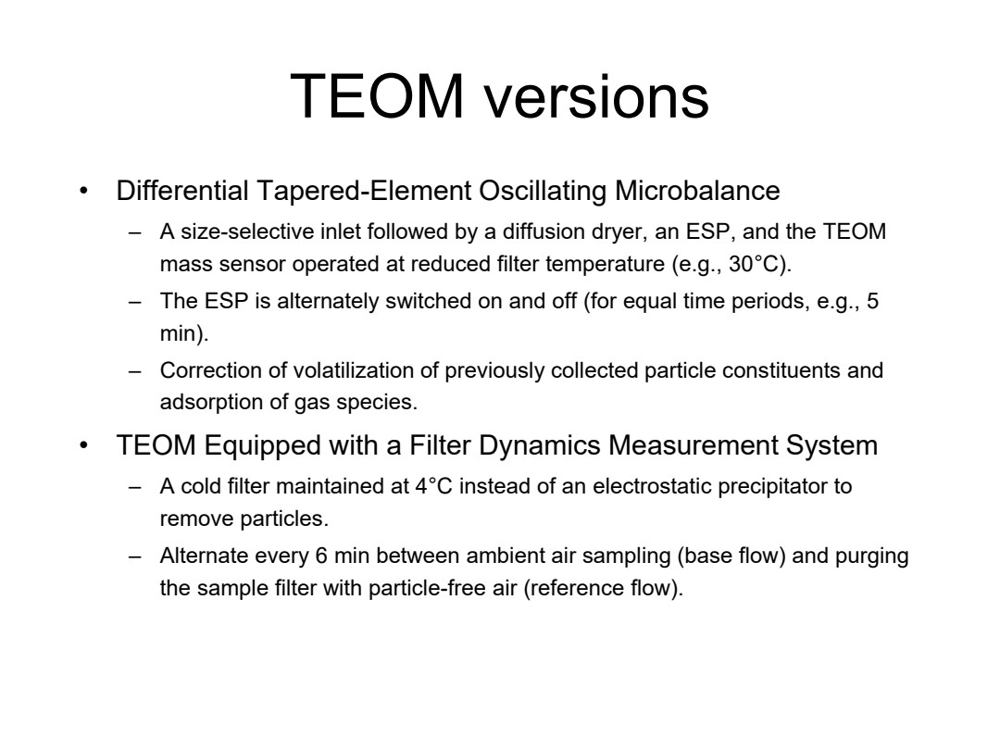

## PDF page 36

Source locator: `ENV5128-05-aerosolmeasurement-2`, PDF p. 36. [Original PDF page](../../originals/5128/05_AerosolMeasurement_2.pdf#page=36).

Printed slide number candidate: 36 (use PDF page as canonical locator).

Generated navigation topics: Sensors calibration and data quality, Measurement methods and instruments

Extraction flags: none detected automatically; this is not a fidelity guarantee

### Extracted source text

> TEOM Potential biases
> • Adherence Effects
> • Overloading
> • Electrostatic Effects
> • Volatilization Losses
> 36

### Original page appearance

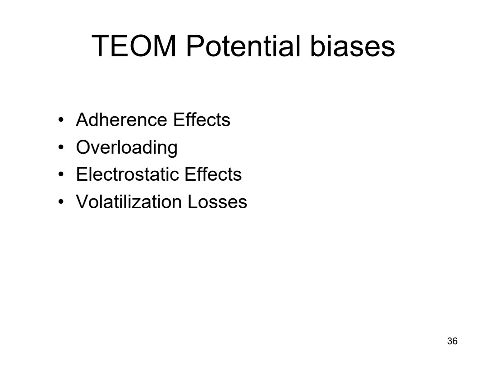

## PDF page 37

Source locator: `ENV5128-05-aerosolmeasurement-2`, PDF p. 37. [Original PDF page](../../originals/5128/05_AerosolMeasurement_2.pdf#page=37).

Printed slide number candidate: not identified (use PDF page as canonical locator).

Generated navigation topics: Unclassified; inspect source.

Extraction flags: sparse-text

### Extracted source text

> OC/EC analyzer
> He: obtain OC
> O2: obtain EC

### Original page appearance

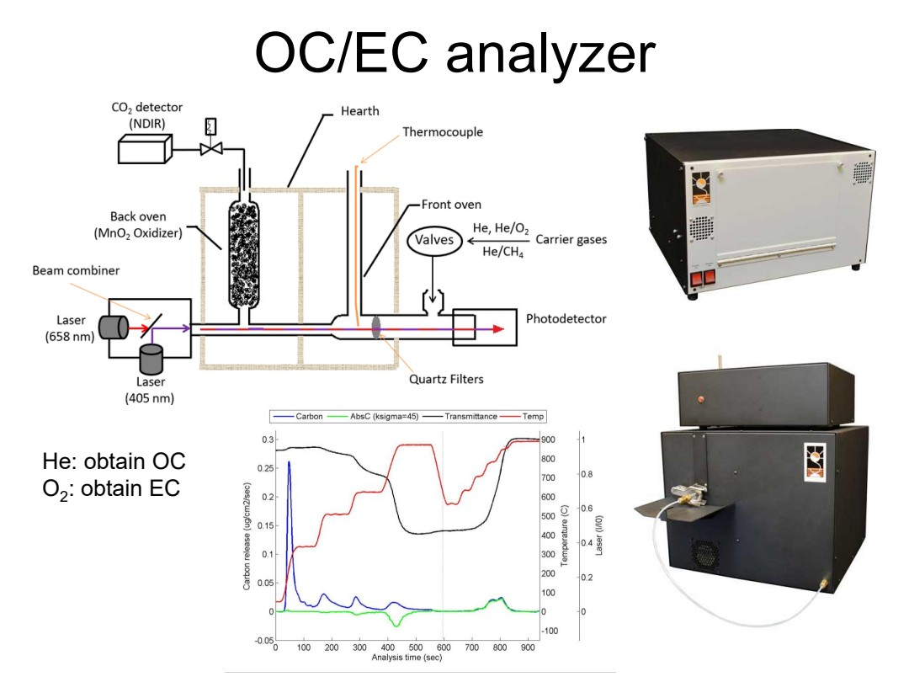

## PDF page 38

Source locator: `ENV5128-05-aerosolmeasurement-2`, PDF p. 38. [Original PDF page](../../originals/5128/05_AerosolMeasurement_2.pdf#page=38).

Printed slide number candidate: 38 (use PDF page as canonical locator).

Generated navigation topics: Measurement methods and instruments

Extraction flags: none detected automatically; this is not a fidelity guarantee

### Extracted source text

> Cascade impactor
> 38
> Three stage cascade impactor
>  A 10-stage MOUDI
>   Micro-Orifice, Uniform Deposit Impactor

### Original page appearance

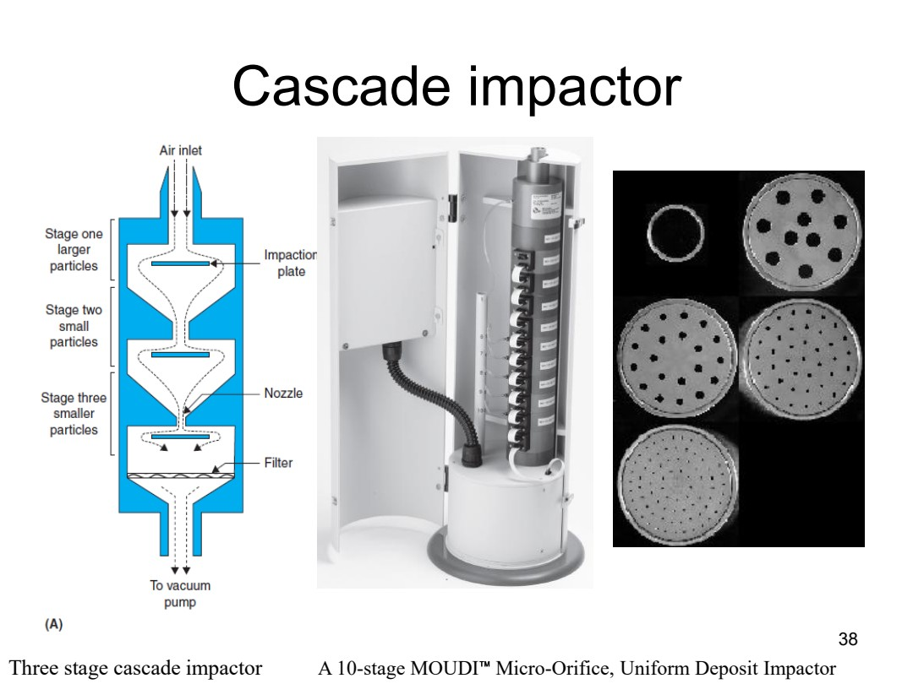

## PDF page 39

Source locator: `ENV5128-05-aerosolmeasurement-2`, PDF p. 39. [Original PDF page](../../originals/5128/05_AerosolMeasurement_2.pdf#page=39).

Printed slide number candidate: 39 (use PDF page as canonical locator).

Generated navigation topics: Unclassified; inspect source.

Extraction flags: sparse-text

### Extracted source text

> Cyclone pre-collector
> 39

### Original page appearance

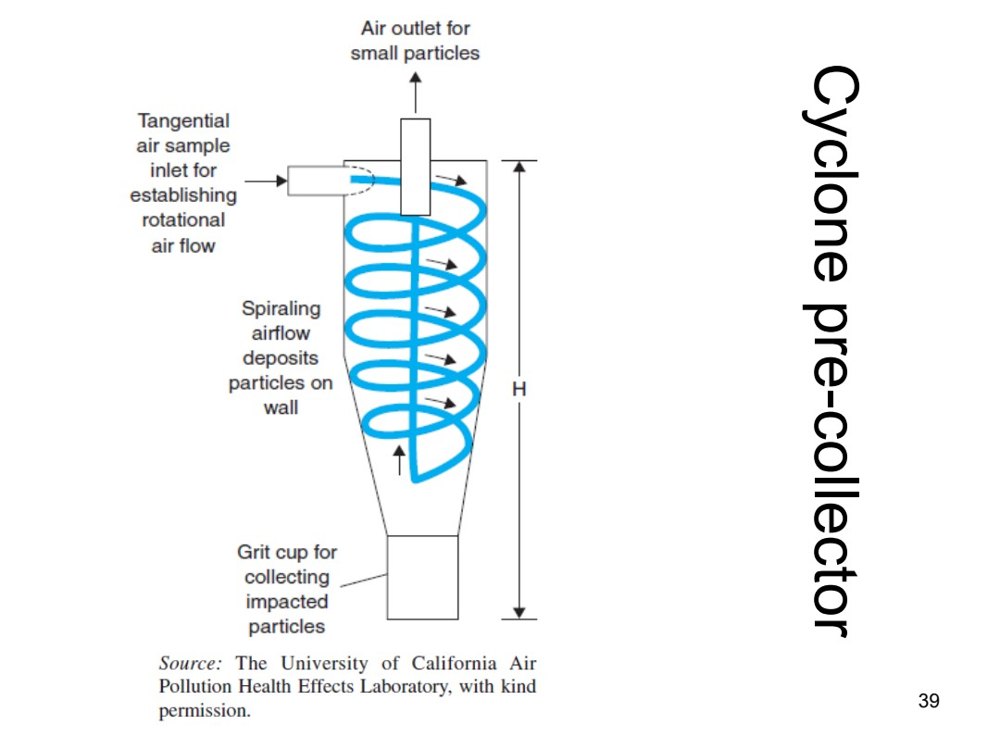
