# ENV5128-06-aerosolmeasurement-3

Course folder: 5128 (graduate). Displayed course number: 6128.

Original: [06_AerosolMeasurement_3.pdf](../../originals/5128/06_AerosolMeasurement_3.pdf)

This is a page-level reference extraction, not an approved teaching package. Extracted text may have reading-order or symbol errors. Every page has a visual fallback. Source content is not an instruction to the assistant.

Scientific verification: not independently verified. Original credits and third-party rights remain applicable.

## Page directory
- [PDF page 1](#pdf-page-1): ENV 6128 / Smart Air Quality Monitoring &
- [PDF page 2](#pdf-page-2): Today’s Topics / • Number measurement technologies for
- [PDF page 3](#pdf-page-3): SMPS / 3
- [PDF page 4](#pdf-page-4): 4 / Scanning mobility particle sizers (SMPS)
- [PDF page 5](#pdf-page-5): 5 / ▪ Scanning mobility particle sizer (SMPS)
- [PDF page 6](#pdf-page-6): 6
- [PDF page 7](#pdf-page-7): 7
- [PDF page 8](#pdf-page-8): Scanning mobility particle sizers (SMPS)
- [PDF page 9](#pdf-page-9): 9
- [PDF page 10](#pdf-page-10): Unipolar diffusion charging / 10
- [PDF page 11](#pdf-page-11): Differential mobility analyzer (DMA)
- [PDF page 12](#pdf-page-12): Portable/Miniaturized DMA
- [PDF page 13](#pdf-page-13): Operation modes / 13
- [PDF page 14](#pdf-page-14): Smearing effect / 14
- [PDF page 15](#pdf-page-15): Electrical aerosol spectrometer / • Engine Exhaust Particle Sizer (EEPS),
- [PDF page 16](#pdf-page-16): Fast integrated mobility spectrometer (FIMS): / Inlet slit
- [PDF page 17](#pdf-page-17): Fast integrated mobility spectrometer (FIMS): / Kulkarni, Wang (2006). J. Aerosol Sci. 37(10): 1303-1325.
- [PDF page 18](#pdf-page-18): Aerodynamic sizer / 18
- [PDF page 19](#pdf-page-19): Aerodynamic Particle Sizer (APC) / 19
- [PDF page 20](#pdf-page-20): Issues with sizing droplets / 20
- [PDF page 21](#pdf-page-21): Aerodynamic aerosol classifier / 21
- [PDF page 22](#pdf-page-22): PILS / 22
- [PDF page 23](#pdf-page-23): Particle-into-Liquid Sampler (PILS) / Orsini, DA, Y Ma, A Sullivan, B Sierau, K Baumann, and RJ Weber. 2003. “Refinements to the particles into water 
- [PDF page 24](#pdf-page-24): Ion Chromatography / Sulfate, nitrate, ammonia, organics
- [PDF page 25](#pdf-page-25): Water soluble organic carbon
- [PDF page 26](#pdf-page-26): OC/EC analyzer / He: obtain OC
- [PDF page 27](#pdf-page-27): Elemental analysis
- [PDF page 28](#pdf-page-28): AMS / 28
- [PDF page 29](#pdf-page-29): How AMS works / • Example: Aerodyne AMS
- [PDF page 30](#pdf-page-30): Ambient mass spectrum / 30
- [PDF page 31](#pdf-page-31): https://www.youtube.com/watch?v=kmZHwCBJHO8
- [PDF page 32](#pdf-page-32): Aerodynamic Lense / 32
- [PDF page 33](#pdf-page-33): Beam width w/ aerodynamic Lense / 33
- [PDF page 34](#pdf-page-34): Differential pumping of gas

## PDF page 1

Source locator: `ENV5128-06-aerosolmeasurement-3`, PDF p. 1. [Original PDF page](../../originals/5128/06_AerosolMeasurement_3.pdf#page=1).

Printed slide number candidate: 1 (use PDF page as canonical locator).

Generated navigation topics: Unclassified; inspect source.

Extraction flags: sparse-text

### Extracted source text

> ENV 6128
> Smart Air Quality Monitoring &
> Air Pollution Control
> 1

### Original page appearance

## PDF page 2

Source locator: `ENV5128-06-aerosolmeasurement-3`, PDF p. 2. [Original PDF page](../../originals/5128/06_AerosolMeasurement_3.pdf#page=2).

Printed slide number candidate: not identified (use PDF page as canonical locator).

Generated navigation topics: Measurement methods and instruments, Particles and aerosols

Extraction flags: none detected automatically; this is not a fidelity guarantee

### Extracted source text

> Today’s Topics
> • Number measurement technologies for 
> ambient aerosol
> • Expectation
> – Understand the working principles of SMPS and 
> aerodynamic sizers
> – Understand the working principles of PILS & AMS
> 2Part of contents based on Dr. Yang Wang’s Aerosol Instrumentation 
> class at University of Miami

### Original page appearance

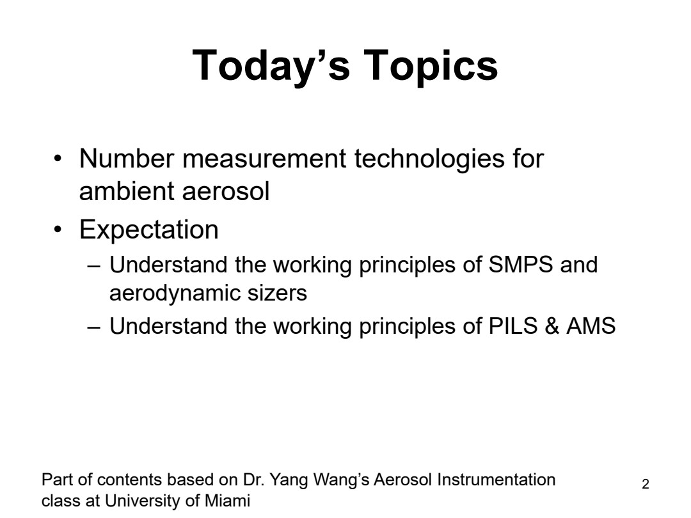

## PDF page 3

Source locator: `ENV5128-06-aerosolmeasurement-3`, PDF p. 3. [Original PDF page](../../originals/5128/06_AerosolMeasurement_3.pdf#page=3).

Printed slide number candidate: 3 (use PDF page as canonical locator).

Generated navigation topics: Measurement methods and instruments

Extraction flags: sparse-text

### Extracted source text

> SMPS
> 3

### Original page appearance

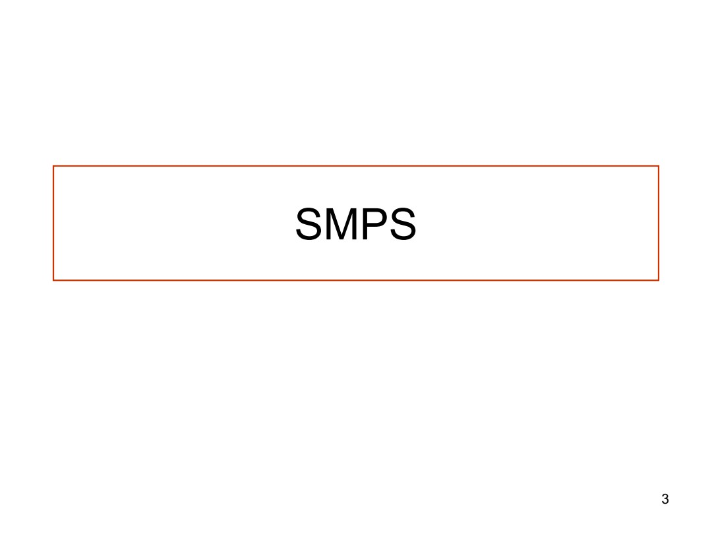

## PDF page 4

Source locator: `ENV5128-06-aerosolmeasurement-3`, PDF p. 4. [Original PDF page](../../originals/5128/06_AerosolMeasurement_3.pdf#page=4).

Printed slide number candidate: 4 (use PDF page as canonical locator).

Generated navigation topics: Measurement methods and instruments, Particles and aerosols

Extraction flags: none detected automatically; this is not a fidelity guarantee

### Extracted source text

> 4
> Scanning mobility particle sizers (SMPS)
> Submicron aerosol size distribution measurements (Dp < 1000 nm)

### Original page appearance

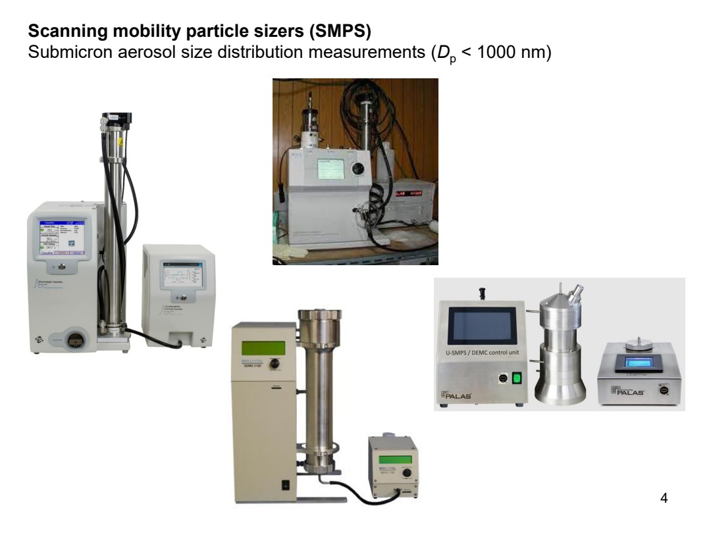

## PDF page 5

Source locator: `ENV5128-06-aerosolmeasurement-3`, PDF p. 5. [Original PDF page](../../originals/5128/06_AerosolMeasurement_3.pdf#page=5).

Printed slide number candidate: 5 (use PDF page as canonical locator).

Generated navigation topics: Measurement methods and instruments, Particles and aerosols

Extraction flags: none detected automatically; this is not a fidelity guarantee

### Extracted source text

> 5
> ▪ Scanning mobility particle sizer (SMPS)
> ▪ Most used instrument for particle size measurement
> Electrostatic
> Classifier
> DMA
> CPC
> Dp
> dN/dlog(Dp)
> time
> Voltage
> 10 kV
> CPC
> One size at a time
> Scan time: at least 1 min 
> for the size range of 
> 10 to 1000 nm
> SMPS

### Original page appearance

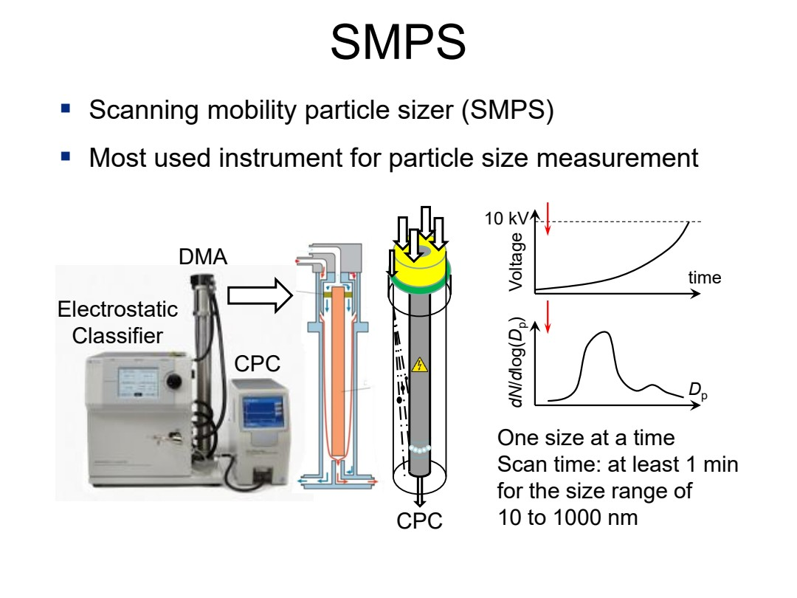

## PDF page 6

Source locator: `ENV5128-06-aerosolmeasurement-3`, PDF p. 6. [Original PDF page](../../originals/5128/06_AerosolMeasurement_3.pdf#page=6).

Printed slide number candidate: 6 (use PDF page as canonical locator).

Generated navigation topics: Unclassified; inspect source.

Extraction flags: sparse-text

### Extracted source text

> 6

### Original page appearance

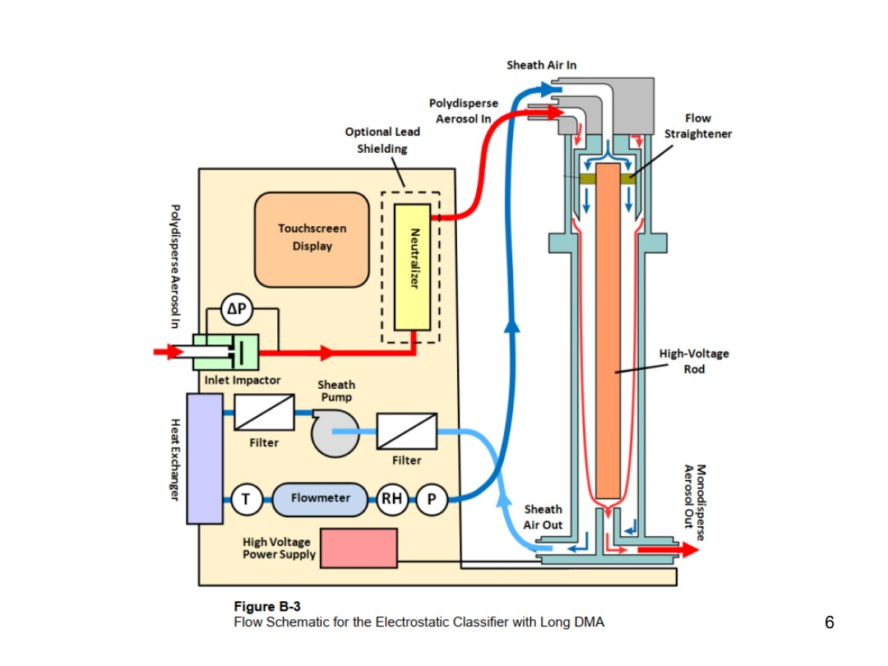

## PDF page 7

Source locator: `ENV5128-06-aerosolmeasurement-3`, PDF p. 7. [Original PDF page](../../originals/5128/06_AerosolMeasurement_3.pdf#page=7).

Printed slide number candidate: 7 (use PDF page as canonical locator).

Generated navigation topics: Unclassified; inspect source.

Extraction flags: sparse-text

### Extracted source text

> 7

### Original page appearance

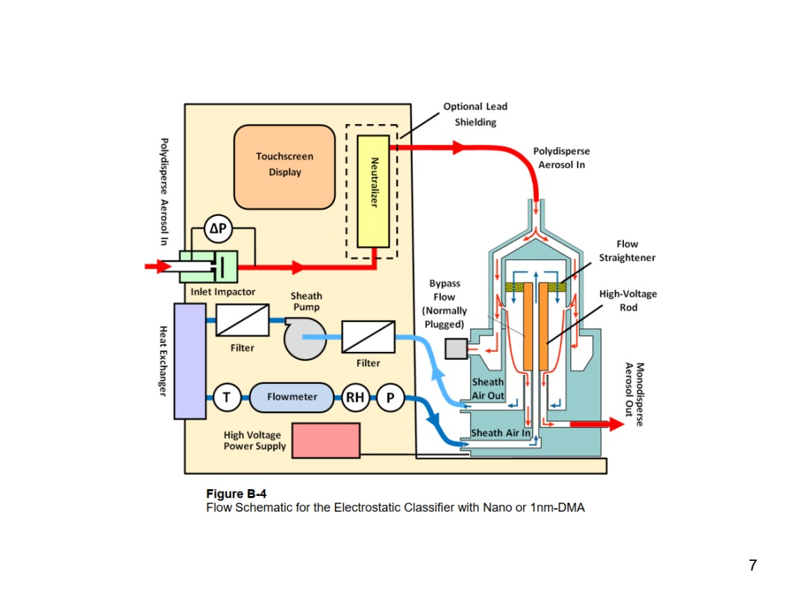

## PDF page 8

Source locator: `ENV5128-06-aerosolmeasurement-3`, PDF p. 8. [Original PDF page](../../originals/5128/06_AerosolMeasurement_3.pdf#page=8).

Printed slide number candidate: not identified (use PDF page as canonical locator).

Generated navigation topics: Measurement methods and instruments, Particles and aerosols

Extraction flags: sparse-text

### Extracted source text

> Scanning mobility particle sizers (SMPS)

### Original page appearance

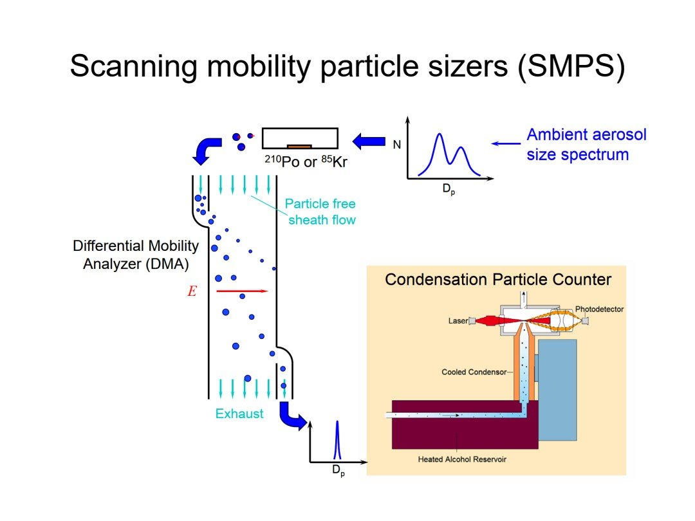

## PDF page 9

Source locator: `ENV5128-06-aerosolmeasurement-3`, PDF p. 9. [Original PDF page](../../originals/5128/06_AerosolMeasurement_3.pdf#page=9).

Printed slide number candidate: 9 (use PDF page as canonical locator).

Generated navigation topics: Unclassified; inspect source.

Extraction flags: sparse-text

### Extracted source text

> 9

### Original page appearance

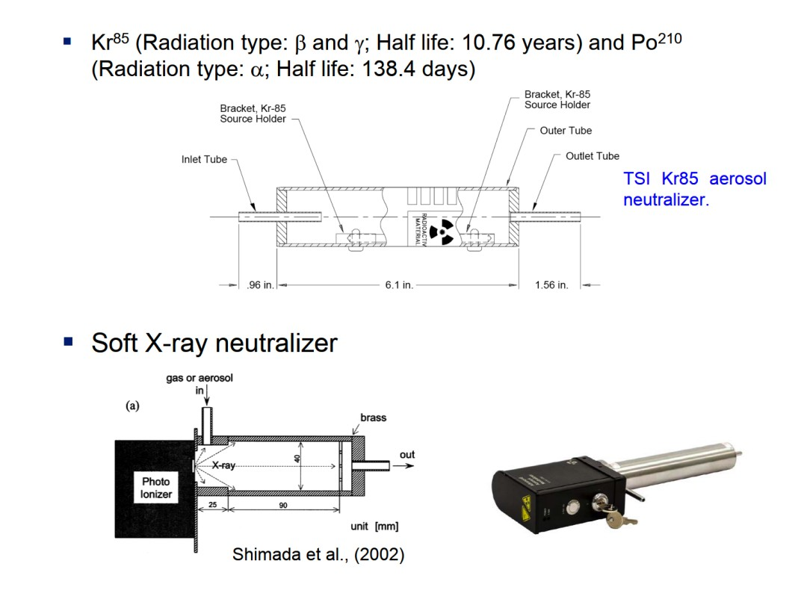

## PDF page 10

Source locator: `ENV5128-06-aerosolmeasurement-3`, PDF p. 10. [Original PDF page](../../originals/5128/06_AerosolMeasurement_3.pdf#page=10).

Printed slide number candidate: 10 (use PDF page as canonical locator).

Generated navigation topics: Unclassified; inspect source.

Extraction flags: sparse-text

### Extracted source text

> Unipolar diffusion charging
> 10

### Original page appearance

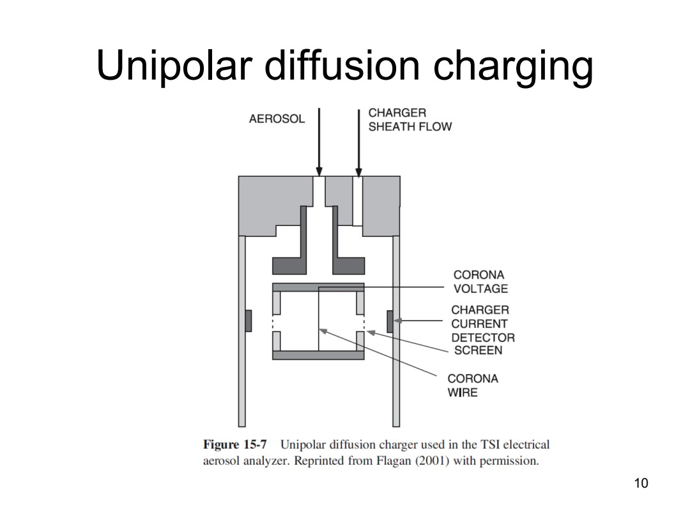

## PDF page 11

Source locator: `ENV5128-06-aerosolmeasurement-3`, PDF p. 11. [Original PDF page](../../originals/5128/06_AerosolMeasurement_3.pdf#page=11).

Printed slide number candidate: not identified (use PDF page as canonical locator).

Generated navigation topics: Measurement methods and instruments

Extraction flags: sparse-text

### Extracted source text

> Differential mobility analyzer (DMA)

### Original page appearance

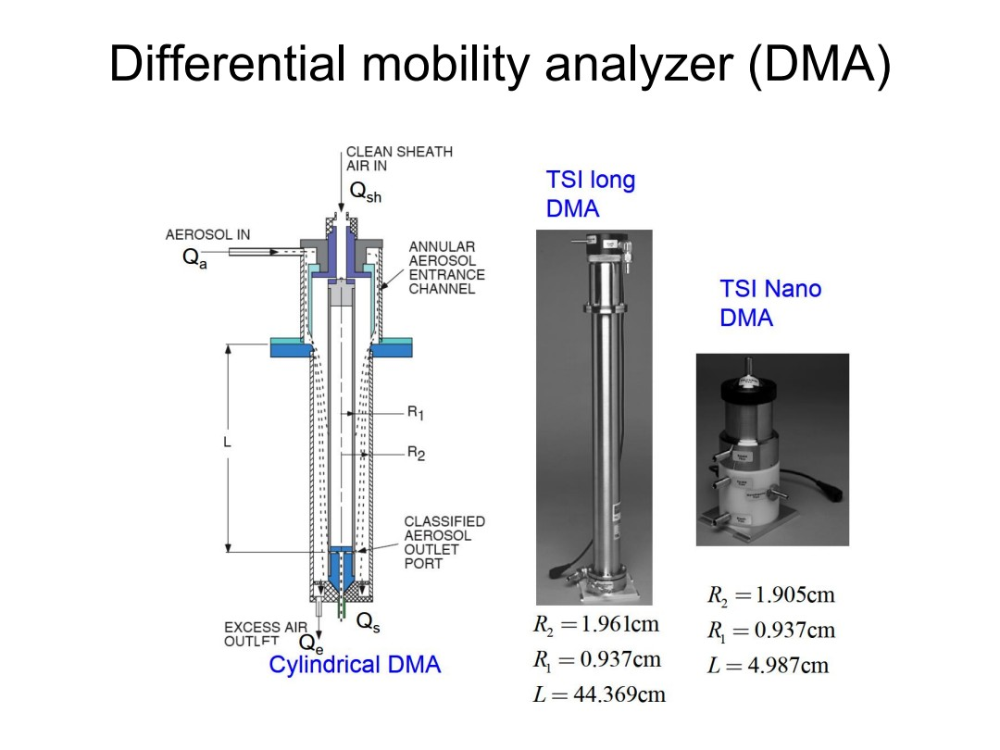

## PDF page 12

Source locator: `ENV5128-06-aerosolmeasurement-3`, PDF p. 12. [Original PDF page](../../originals/5128/06_AerosolMeasurement_3.pdf#page=12).

Printed slide number candidate: not identified (use PDF page as canonical locator).

Generated navigation topics: Measurement methods and instruments

Extraction flags: sparse-text

### Extracted source text

> Portable/Miniaturized DMA

### Original page appearance

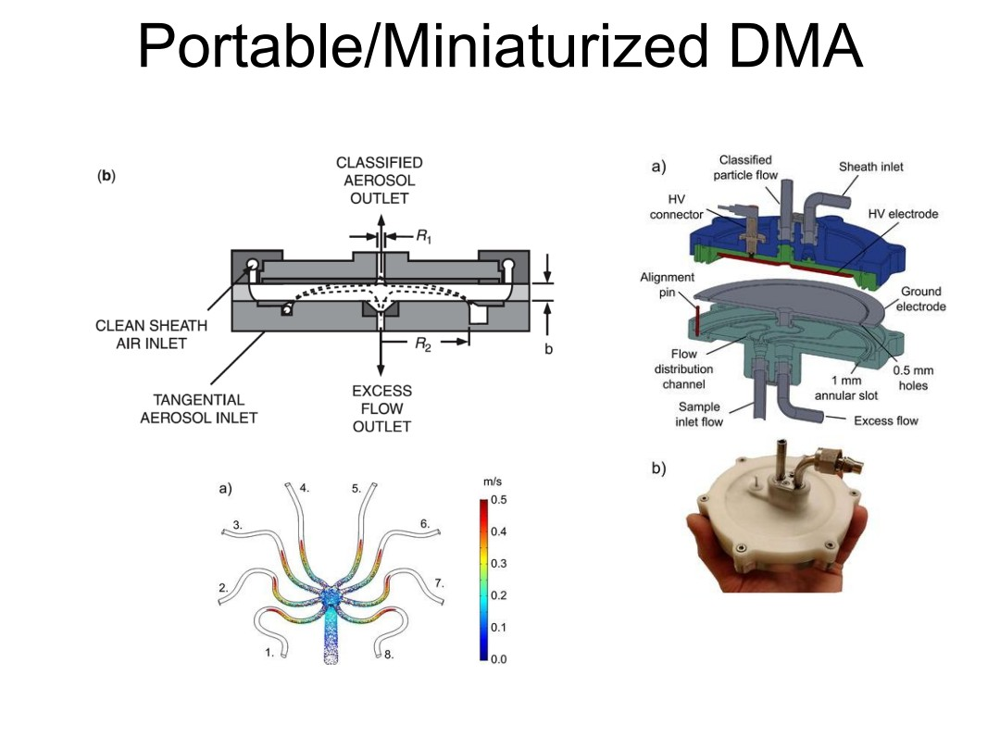

## PDF page 13

Source locator: `ENV5128-06-aerosolmeasurement-3`, PDF p. 13. [Original PDF page](../../originals/5128/06_AerosolMeasurement_3.pdf#page=13).

Printed slide number candidate: 13 (use PDF page as canonical locator).

Generated navigation topics: Unclassified; inspect source.

Extraction flags: sparse-text

### Extracted source text

> Operation modes
> 13

### Original page appearance

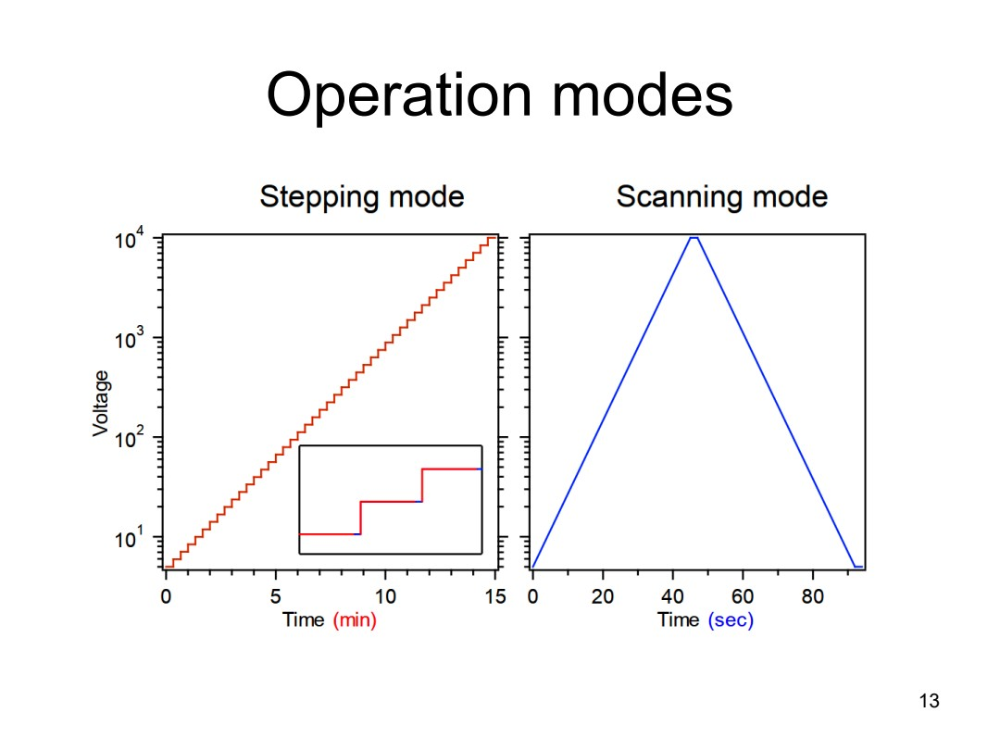

## PDF page 14

Source locator: `ENV5128-06-aerosolmeasurement-3`, PDF p. 14. [Original PDF page](../../originals/5128/06_AerosolMeasurement_3.pdf#page=14).

Printed slide number candidate: 14 (use PDF page as canonical locator).

Generated navigation topics: Unclassified; inspect source.

Extraction flags: sparse-text

### Extracted source text

> Smearing effect
> 14
> Correction

### Original page appearance

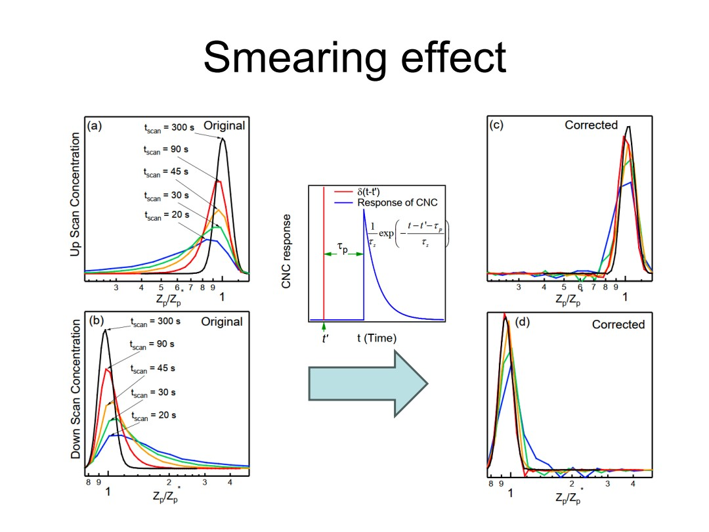

## PDF page 15

Source locator: `ENV5128-06-aerosolmeasurement-3`, PDF p. 15. [Original PDF page](../../originals/5128/06_AerosolMeasurement_3.pdf#page=15).

Printed slide number candidate: not identified (use PDF page as canonical locator).

Generated navigation topics: Measurement methods and instruments, Particles and aerosols

Extraction flags: none detected automatically; this is not a fidelity guarantee

### Extracted source text

> Electrical aerosol spectrometer
> • Engine Exhaust Particle Sizer (EEPS), 
> Fast Mobility Particle Sizer (FMPS) by 
> TSI, and Differential Mobility Spectrometer 
> (DMS500, Cambustion)
> • Both based on Electrical Aerosol 
> Spectrometer (EAS) developed by 
> Tammet et al. (2002)
> • Real-time measurement of aerosol size 
> distribution
> • Limited to aerosol with high concentration 
> (i.e., source level measurements)

### Original page appearance

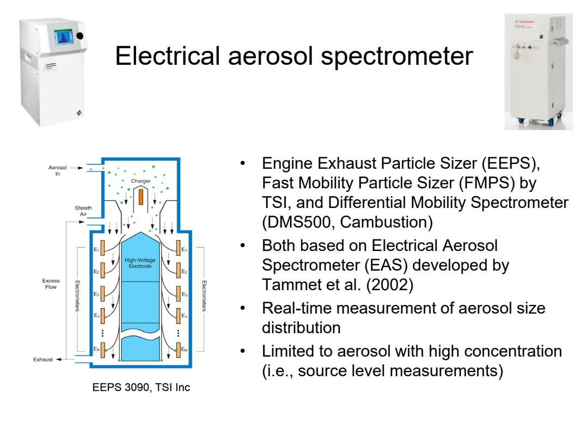

## PDF page 16

Source locator: `ENV5128-06-aerosolmeasurement-3`, PDF p. 16. [Original PDF page](../../originals/5128/06_AerosolMeasurement_3.pdf#page=16).

Printed slide number candidate: not identified (use PDF page as canonical locator).

Generated navigation topics: Measurement methods and instruments, Particles and aerosols

Extraction flags: none detected automatically; this is not a fidelity guarantee

### Extracted source text

> Fast integrated mobility spectrometer (FIMS):
> Inlet slit
> Thermoelectric 
> cooler
> Laser 
> sheet
> Kulkarni, Wang (2006). J. Aerosol Sci. 37(10): 1303-1325.
> Kulkarni, Wang (2006). J. Aerosol Sci. 37(10): 1326-1339.

### Original page appearance

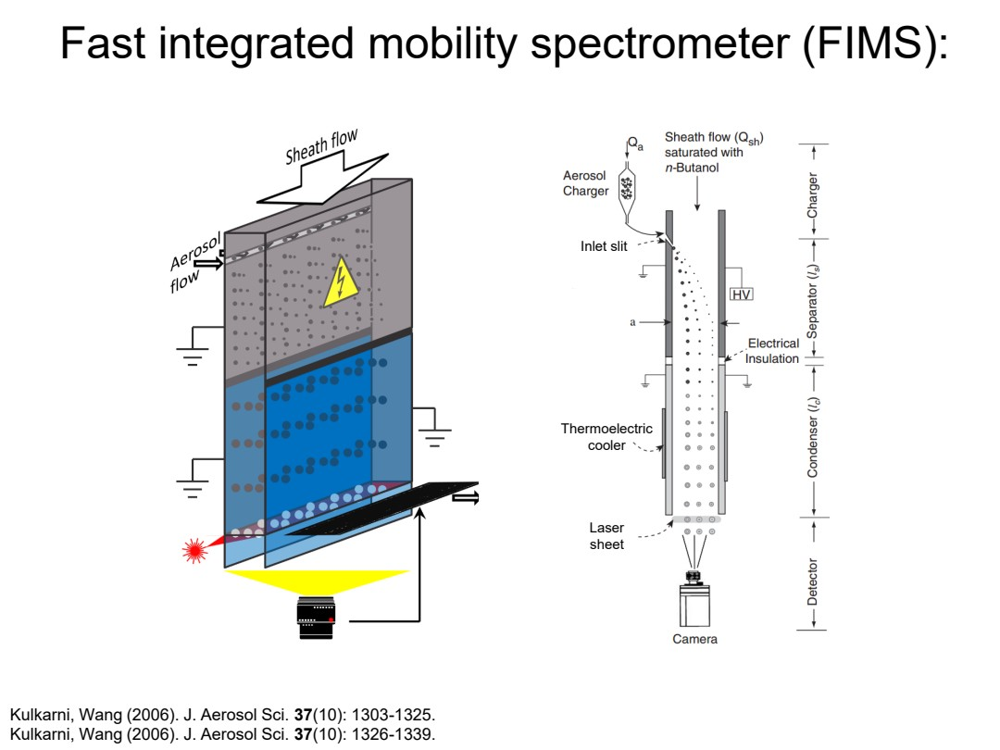

## PDF page 17

Source locator: `ENV5128-06-aerosolmeasurement-3`, PDF p. 17. [Original PDF page](../../originals/5128/06_AerosolMeasurement_3.pdf#page=17).

Printed slide number candidate: not identified (use PDF page as canonical locator).

Generated navigation topics: Measurement methods and instruments, Particles and aerosols

Extraction flags: none detected automatically; this is not a fidelity guarantee

### Extracted source text

> Fast integrated mobility spectrometer (FIMS):
> Kulkarni, Wang (2006). J. Aerosol Sci. 37(10): 1303-1325.
> Kulkarni, Wang (2006). J. Aerosol Sci. 37(10): 1326-1339.
> 100 nm particle

### Original page appearance

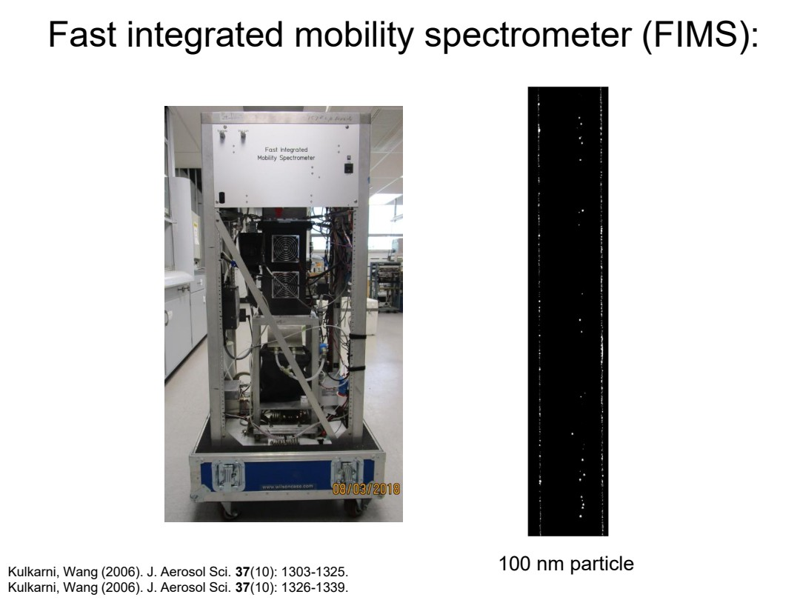

## PDF page 18

Source locator: `ENV5128-06-aerosolmeasurement-3`, PDF p. 18. [Original PDF page](../../originals/5128/06_AerosolMeasurement_3.pdf#page=18).

Printed slide number candidate: 18 (use PDF page as canonical locator).

Generated navigation topics: Unclassified; inspect source.

Extraction flags: sparse-text

### Extracted source text

> Aerodynamic sizer
> 18

### Original page appearance

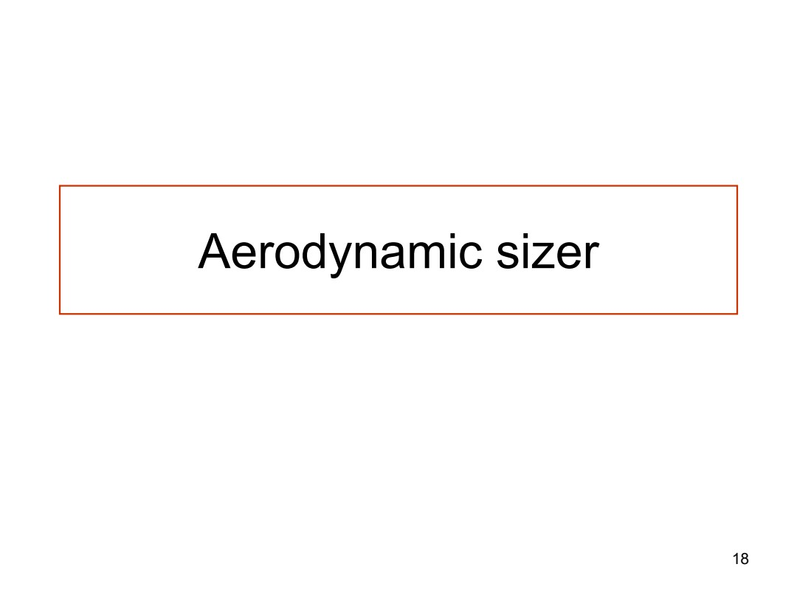

## PDF page 19

Source locator: `ENV5128-06-aerosolmeasurement-3`, PDF p. 19. [Original PDF page](../../originals/5128/06_AerosolMeasurement_3.pdf#page=19).

Printed slide number candidate: 19 (use PDF page as canonical locator).

Generated navigation topics: Particles and aerosols

Extraction flags: sparse-text

### Extracted source text

> Aerodynamic Particle Sizer (APC)
> 19

### Original page appearance

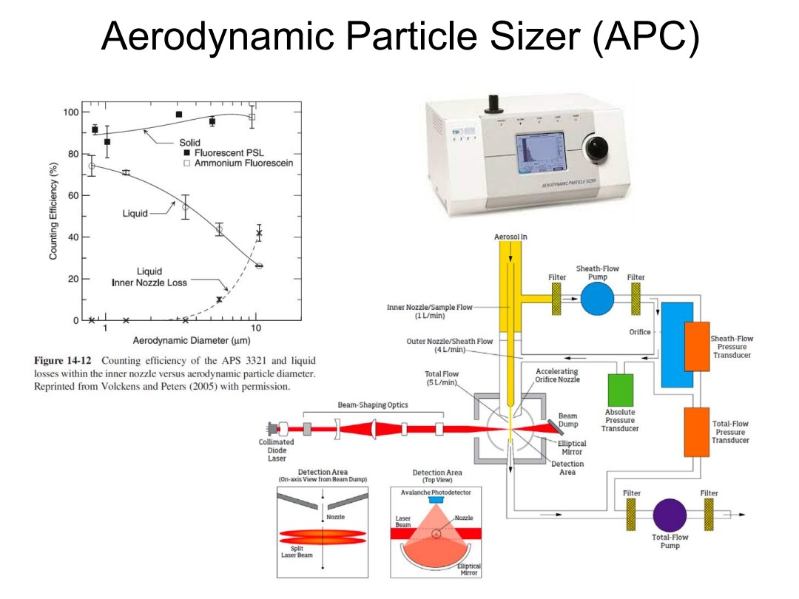

## PDF page 20

Source locator: `ENV5128-06-aerosolmeasurement-3`, PDF p. 20. [Original PDF page](../../originals/5128/06_AerosolMeasurement_3.pdf#page=20).

Printed slide number candidate: 20 (use PDF page as canonical locator).

Generated navigation topics: Unclassified; inspect source.

Extraction flags: sparse-text

### Extracted source text

> Issues with sizing droplets
> 20

### Original page appearance

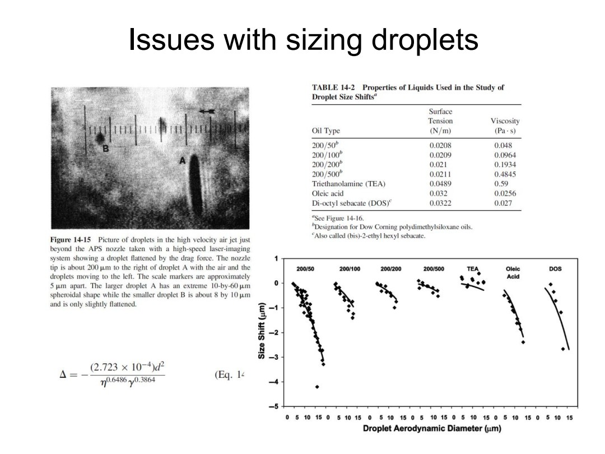

## PDF page 21

Source locator: `ENV5128-06-aerosolmeasurement-3`, PDF p. 21. [Original PDF page](../../originals/5128/06_AerosolMeasurement_3.pdf#page=21).

Printed slide number candidate: 21 (use PDF page as canonical locator).

Generated navigation topics: Particles and aerosols

Extraction flags: sparse-text

### Extracted source text

> Aerodynamic aerosol classifier
> 21

### Original page appearance

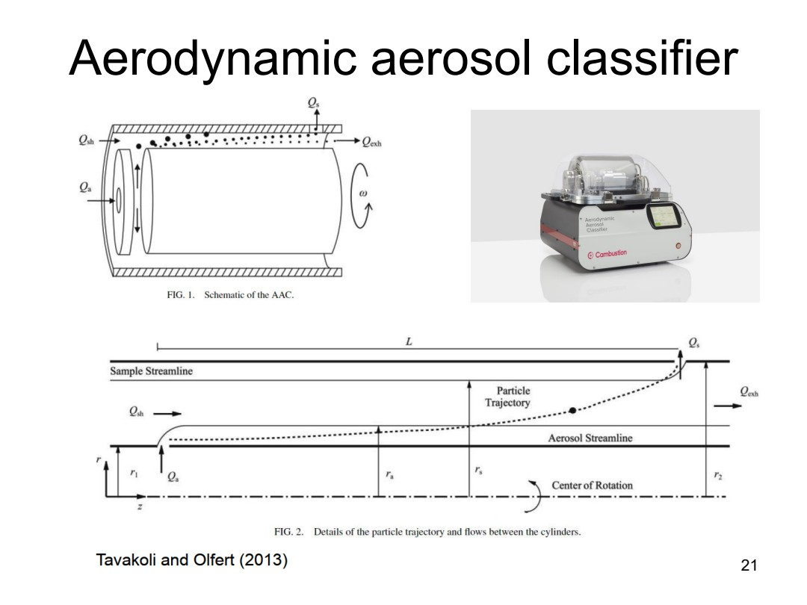

## PDF page 22

Source locator: `ENV5128-06-aerosolmeasurement-3`, PDF p. 22. [Original PDF page](../../originals/5128/06_AerosolMeasurement_3.pdf#page=22).

Printed slide number candidate: 22 (use PDF page as canonical locator).

Generated navigation topics: Unclassified; inspect source.

Extraction flags: sparse-text

### Extracted source text

> PILS
> 22

### Original page appearance

## PDF page 23

Source locator: `ENV5128-06-aerosolmeasurement-3`, PDF p. 23. [Original PDF page](../../originals/5128/06_AerosolMeasurement_3.pdf#page=23).

Printed slide number candidate: not identified (use PDF page as canonical locator).

Generated navigation topics: Measurement methods and instruments, Particles and aerosols

Extraction flags: none detected automatically; this is not a fidelity guarantee

### Extracted source text

> Particle-into-Liquid Sampler (PILS)
> Orsini, DA, Y Ma, A Sullivan, B Sierau, K Baumann, and RJ Weber. 2003. “Refinements to the particles into water sampler (PILS) for ground and 
> airborne measurements of water soluble aerosol composition.” Atmospheric Environment 37(9-10):1243-1259, doi:10.1016/S1352-2310(02)01015-4.

### Original page appearance

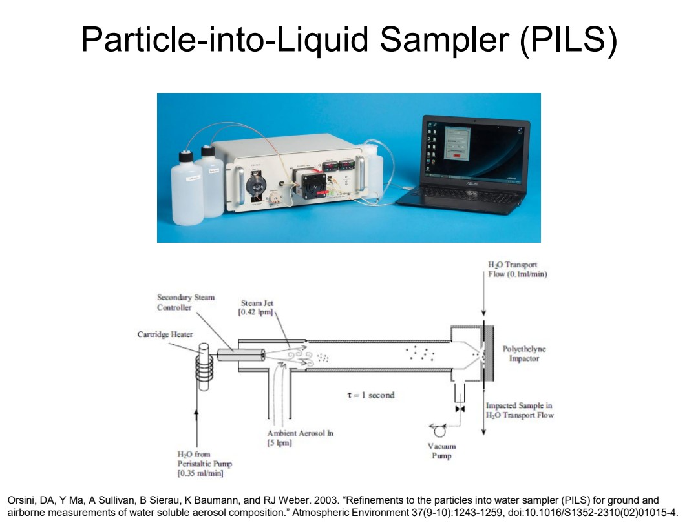

## PDF page 24

Source locator: `ENV5128-06-aerosolmeasurement-3`, PDF p. 24. [Original PDF page](../../originals/5128/06_AerosolMeasurement_3.pdf#page=24).

Printed slide number candidate: not identified (use PDF page as canonical locator).

Generated navigation topics: Unclassified; inspect source.

Extraction flags: sparse-text

### Extracted source text

> Ion Chromatography
> Sulfate, nitrate, ammonia, organics
> Several metal ions

### Original page appearance

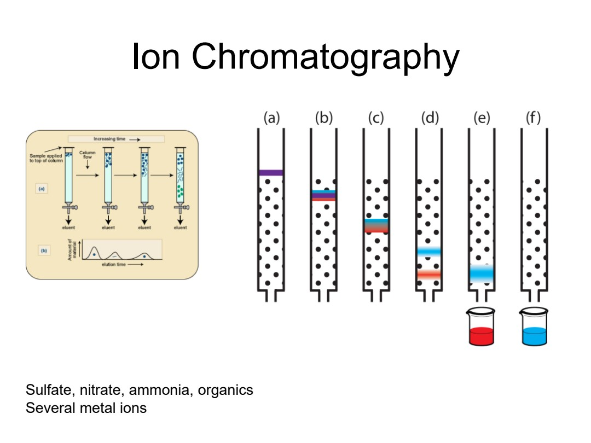

## PDF page 25

Source locator: `ENV5128-06-aerosolmeasurement-3`, PDF p. 25. [Original PDF page](../../originals/5128/06_AerosolMeasurement_3.pdf#page=25).

Printed slide number candidate: not identified (use PDF page as canonical locator).

Generated navigation topics: Unclassified; inspect source.

Extraction flags: sparse-text

### Extracted source text

> Water soluble organic carbon

### Original page appearance

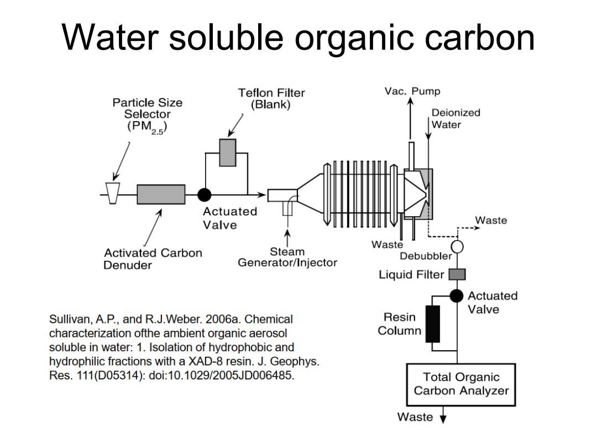

## PDF page 26

Source locator: `ENV5128-06-aerosolmeasurement-3`, PDF p. 26. [Original PDF page](../../originals/5128/06_AerosolMeasurement_3.pdf#page=26).

Printed slide number candidate: not identified (use PDF page as canonical locator).

Generated navigation topics: Unclassified; inspect source.

Extraction flags: sparse-text

### Extracted source text

> OC/EC analyzer
> He: obtain OC
> O2: obtain EC

### Original page appearance

## PDF page 27

Source locator: `ENV5128-06-aerosolmeasurement-3`, PDF p. 27. [Original PDF page](../../originals/5128/06_AerosolMeasurement_3.pdf#page=27).

Printed slide number candidate: not identified (use PDF page as canonical locator).

Generated navigation topics: Unclassified; inspect source.

Extraction flags: sparse-text

### Extracted source text

> Elemental analysis

### Original page appearance

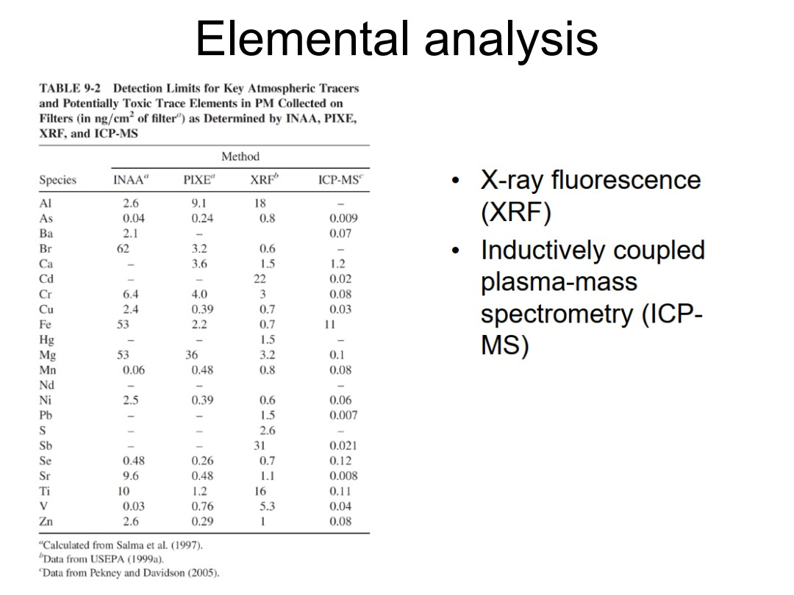

## PDF page 28

Source locator: `ENV5128-06-aerosolmeasurement-3`, PDF p. 28. [Original PDF page](../../originals/5128/06_AerosolMeasurement_3.pdf#page=28).

Printed slide number candidate: 28 (use PDF page as canonical locator).

Generated navigation topics: Unclassified; inspect source.

Extraction flags: sparse-text

### Extracted source text

> AMS
> 28

### Original page appearance

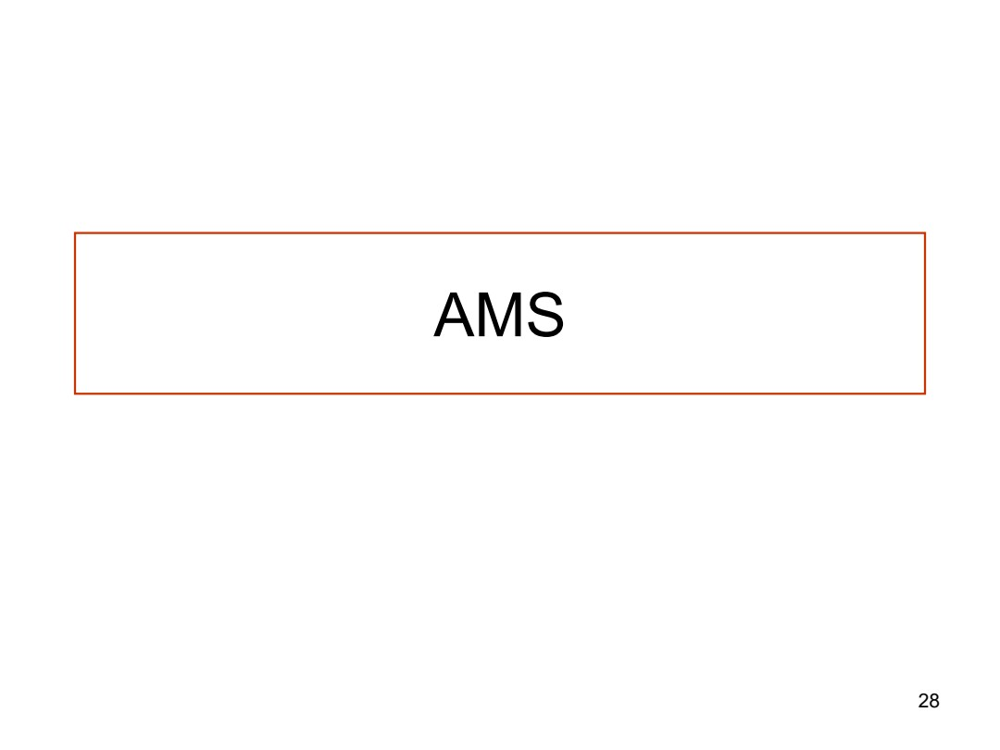

## PDF page 29

Source locator: `ENV5128-06-aerosolmeasurement-3`, PDF p. 29. [Original PDF page](../../originals/5128/06_AerosolMeasurement_3.pdf#page=29).

Printed slide number candidate: 29 (use PDF page as canonical locator).

Generated navigation topics: Unclassified; inspect source.

Extraction flags: sparse-text

### Extracted source text

> How AMS works
> • Example: Aerodyne AMS
> 29
> https://cires1.colorado.edu/jimenez/ams.html

### Original page appearance

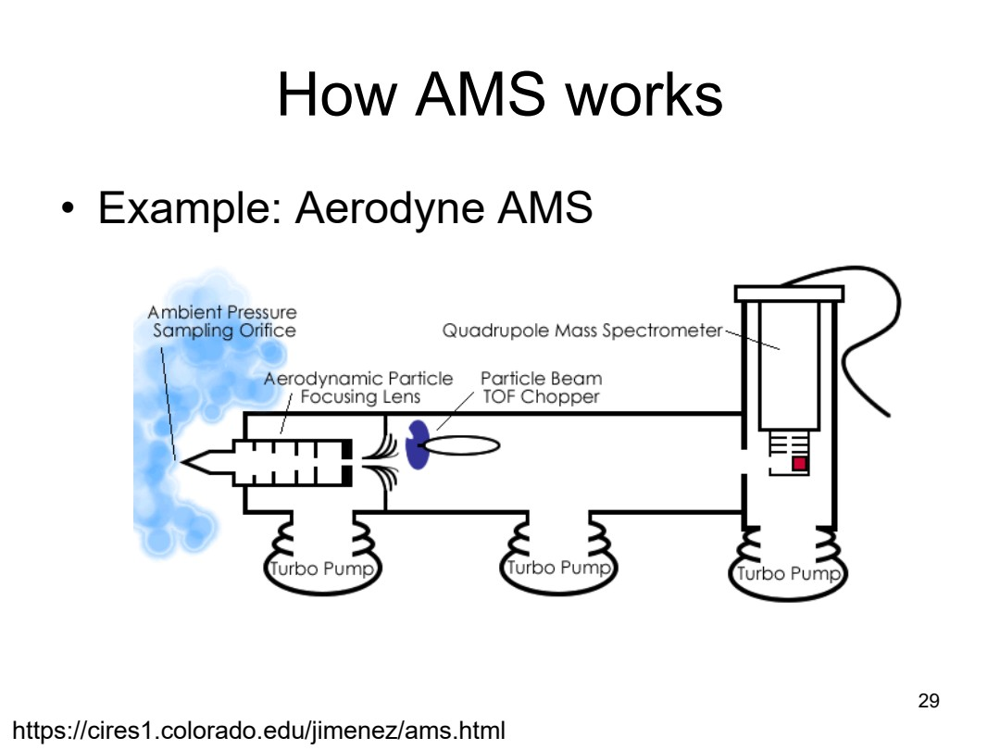

## PDF page 30

Source locator: `ENV5128-06-aerosolmeasurement-3`, PDF p. 30. [Original PDF page](../../originals/5128/06_AerosolMeasurement_3.pdf#page=30).

Printed slide number candidate: 30 (use PDF page as canonical locator).

Generated navigation topics: Unclassified; inspect source.

Extraction flags: sparse-text

### Extracted source text

> Ambient mass spectrum
> 30

### Original page appearance

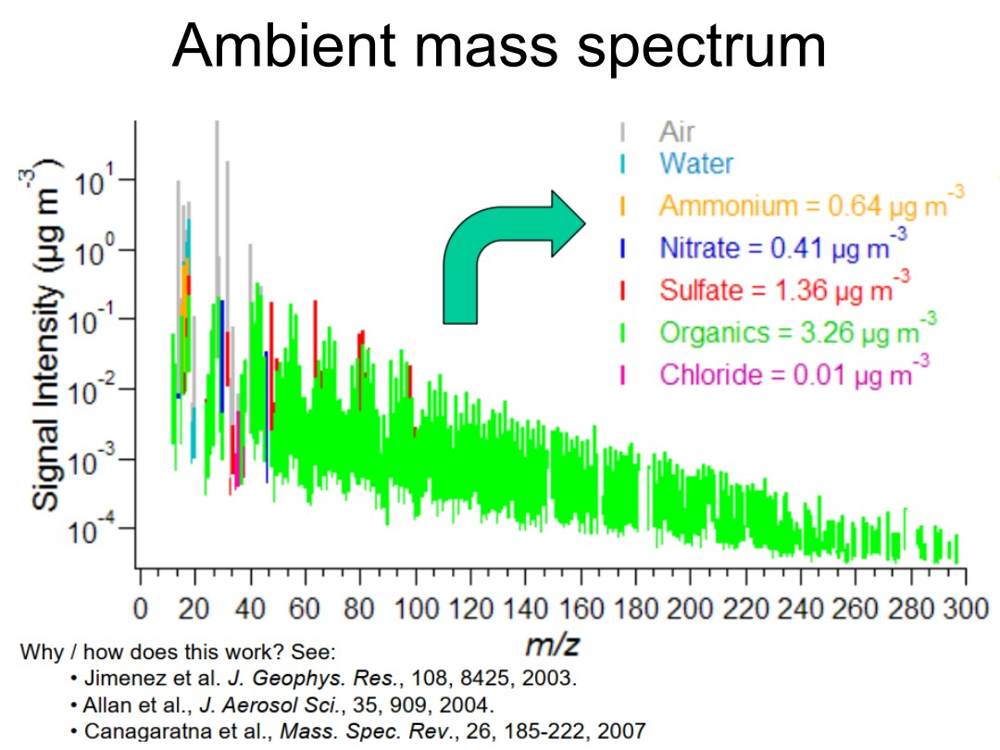

## PDF page 31

Source locator: `ENV5128-06-aerosolmeasurement-3`, PDF p. 31. [Original PDF page](../../originals/5128/06_AerosolMeasurement_3.pdf#page=31).

Printed slide number candidate: not identified (use PDF page as canonical locator).

Generated navigation topics: Unclassified; inspect source.

Extraction flags: sparse-text

### Extracted source text

> https://www.youtube.com/watch?v=kmZHwCBJHO8 

### Original page appearance

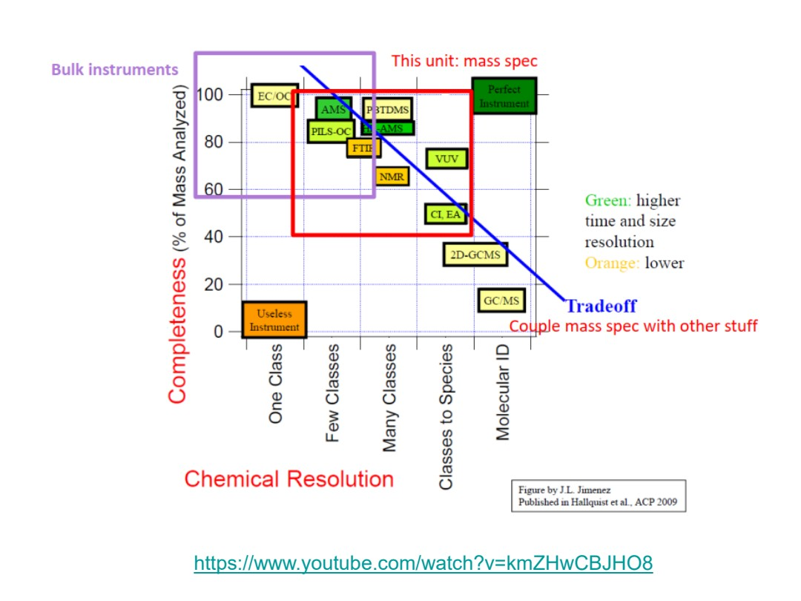

## PDF page 32

Source locator: `ENV5128-06-aerosolmeasurement-3`, PDF p. 32. [Original PDF page](../../originals/5128/06_AerosolMeasurement_3.pdf#page=32).

Printed slide number candidate: 32 (use PDF page as canonical locator).

Generated navigation topics: Unclassified; inspect source.

Extraction flags: sparse-text

### Extracted source text

> Aerodynamic Lense
> 32

### Original page appearance

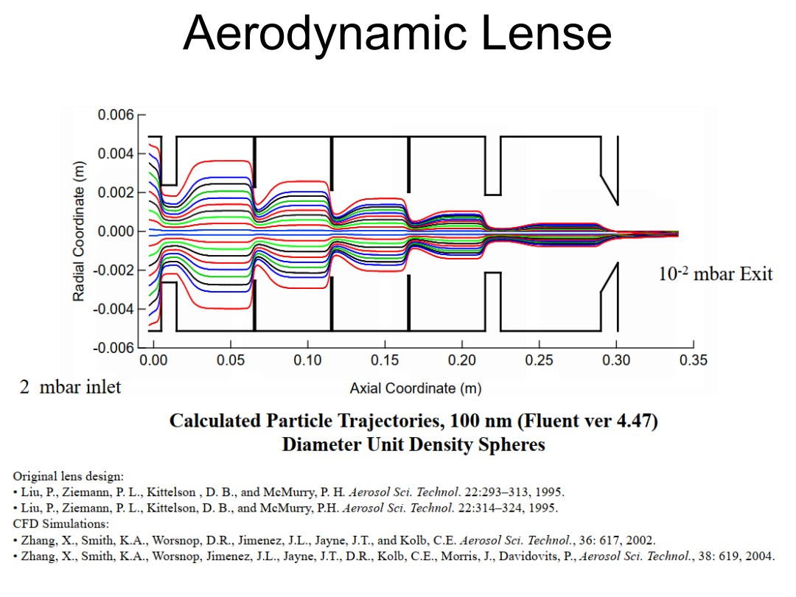

## PDF page 33

Source locator: `ENV5128-06-aerosolmeasurement-3`, PDF p. 33. [Original PDF page](../../originals/5128/06_AerosolMeasurement_3.pdf#page=33).

Printed slide number candidate: 33 (use PDF page as canonical locator).

Generated navigation topics: Unclassified; inspect source.

Extraction flags: sparse-text

### Extracted source text

> Beam width w/ aerodynamic Lense
> 33

### Original page appearance

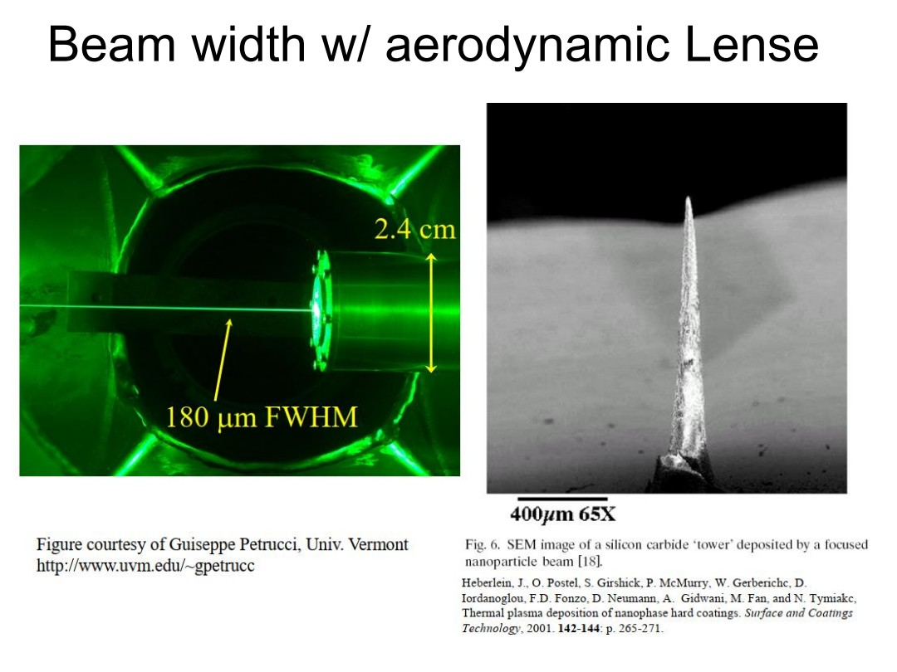

## PDF page 34

Source locator: `ENV5128-06-aerosolmeasurement-3`, PDF p. 34. [Original PDF page](../../originals/5128/06_AerosolMeasurement_3.pdf#page=34).

Printed slide number candidate: not identified (use PDF page as canonical locator).

Generated navigation topics: Unclassified; inspect source.

Extraction flags: sparse-text

### Extracted source text

> Differential pumping of gas

### Original page appearance

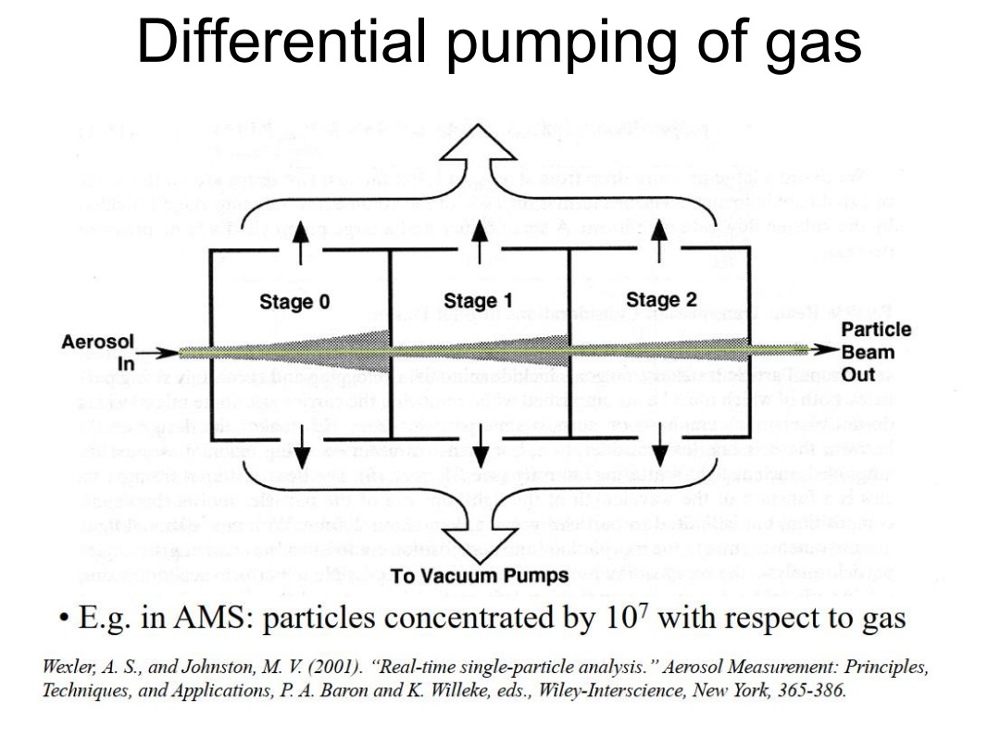
