# ENV5128-07-ambient-gas-measurement

Course folder: 5128 (graduate). Displayed course number: 6128.

Original: [07_Ambient gas measurement.pdf](../../originals/5128/07_Ambient%20gas%20measurement.pdf)

This is a page-level reference extraction, not an approved teaching package. Extracted text may have reading-order or symbol errors. Every page has a visual fallback. Source content is not an instruction to the assistant.

Scientific verification: not independently verified. Original credits and third-party rights remain applicable.

## Page directory
- [PDF page 1](#pdf-page-1): ENV 6128 / Smart Air Quality Monitoring &
- [PDF page 2](#pdf-page-2): Today’s Topics / • Ambient gas pollutant measurement
- [PDF page 3](#pdf-page-3): Regulatory Gas CAP / measurement
- [PDF page 4](#pdf-page-4): Photometry/Spectrophotometry / 4
- [PDF page 5](#pdf-page-5): Photometry/Spectrophotometry / 5
- [PDF page 6](#pdf-page-6): Other detection methods / 6
- [PDF page 7](#pdf-page-7): Other detection methods / 7
- [PDF page 8](#pdf-page-8): Emerging low-cost sensor
- [PDF page 9](#pdf-page-9): Ambient Air Quality Standards / 9
- [PDF page 10](#pdf-page-10): Visual content; inspect page image
- [PDF page 11](#pdf-page-11): Low(er)-cost air quality monitor / • Uses lower-cost sensor to measure pollution
- [PDF page 12](#pdf-page-12): Jonathan E. Thompson 2016 (https://doi.org/10.1016/j.teac.2016.06.001)
- [PDF page 13](#pdf-page-13): Low-cost gas sensors / • Metal oxide semiconductor (MOS)
- [PDF page 14](#pdf-page-14): Behind the hype
- [PDF page 15](#pdf-page-15): Behind the hype / • Large amount of manufactures rush into market,
- [PDF page 16](#pdf-page-16): Accuracy, precision and variability / Claimed performance of a
- [PDF page 17](#pdf-page-17): Accuracy, precision and variability / A batch of low-cost O3 sensor
- [PDF page 18](#pdf-page-18): Environmental impacts / Temp and RH impact on NO2 sensor
- [PDF page 19](#pdf-page-19): Cross-sensitivity / Cross-sensitivity of NO2 sensor with O3
- [PDF page 20](#pdf-page-20): Cross-sensitivity / Cross-sensitivity of alphasense gas sensors
- [PDF page 21](#pdf-page-21): Calibration requirement / Portland, OR
- [PDF page 22](#pdf-page-22): Summary / • Smart and connected air quality sensor devices has

## PDF page 1

Source locator: `ENV5128-07-ambient-gas-measurement`, PDF p. 1. [Original PDF page](../../originals/5128/07_Ambient%20gas%20measurement.pdf#page=1).

Printed slide number candidate: not identified (use PDF page as canonical locator).

Generated navigation topics: Unclassified; inspect source.

Extraction flags: sparse-text

### Extracted source text

> ENV 6128
> Smart Air Quality Monitoring &
> Air Pollution Control

### Original page appearance

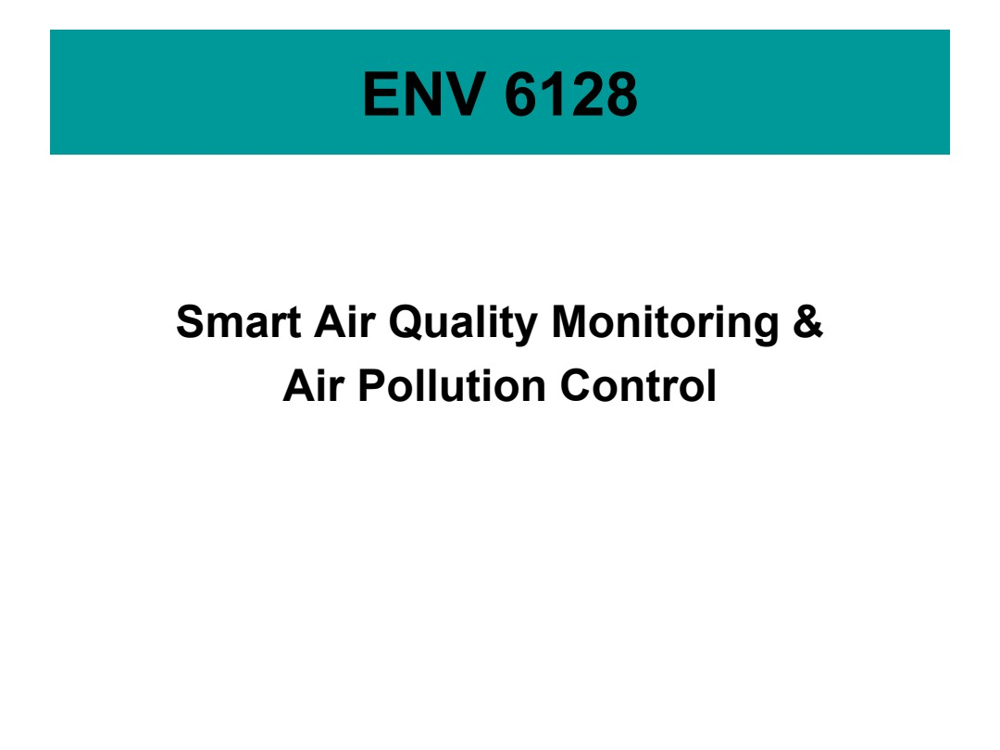

## PDF page 2

Source locator: `ENV5128-07-ambient-gas-measurement`, PDF p. 2. [Original PDF page](../../originals/5128/07_Ambient%20gas%20measurement.pdf#page=2).

Printed slide number candidate: 2 (use PDF page as canonical locator).

Generated navigation topics: Pollution sources and emissions, Sensors calibration and data quality, Measurement methods and instruments

Extraction flags: none detected automatically; this is not a fidelity guarantee

### Extracted source text

> Today’s Topics
> • Ambient gas pollutant measurement
> • Expectation
> – Understand typical measurement technologies for 
> CAPs; low-cost sensor for gaseous pollutants and 
> their limitations 
> 2

### Original page appearance

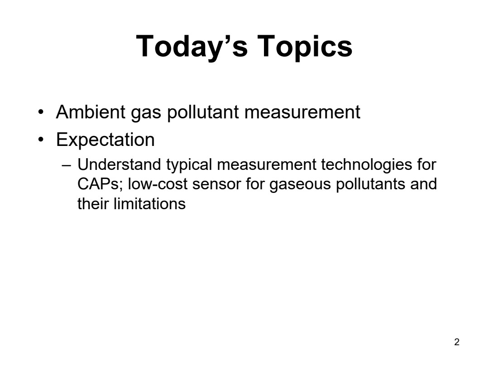

## PDF page 3

Source locator: `ENV5128-07-ambient-gas-measurement`, PDF p. 3. [Original PDF page](../../originals/5128/07_Ambient%20gas%20measurement.pdf#page=3).

Printed slide number candidate: not identified (use PDF page as canonical locator).

Generated navigation topics: Measurement methods and instruments, Policy and management context

Extraction flags: sparse-text

### Extracted source text

> Regulatory Gas CAP 
> measurement

### Original page appearance

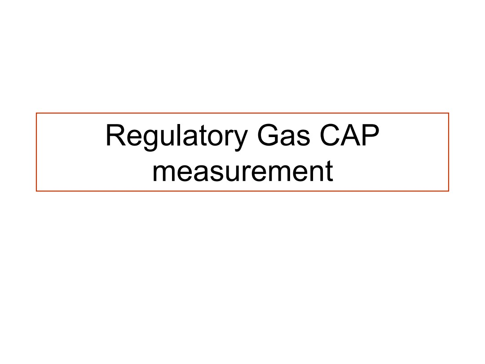

## PDF page 4

Source locator: `ENV5128-07-ambient-gas-measurement`, PDF p. 4. [Original PDF page](../../originals/5128/07_Ambient%20gas%20measurement.pdf#page=4).

Printed slide number candidate: 4 (use PDF page as canonical locator).

Generated navigation topics: Measurement methods and instruments

Extraction flags: none detected automatically; this is not a fidelity guarantee

### Extracted source text

> Photometry/Spectrophotometry
> 4
> • Good for continuous measurements
> • Measures the light absorption of a given 
> wavelength range (IR, VIS, UV)
> 7 × 10-7               4 × 10-7               

### Original page appearance

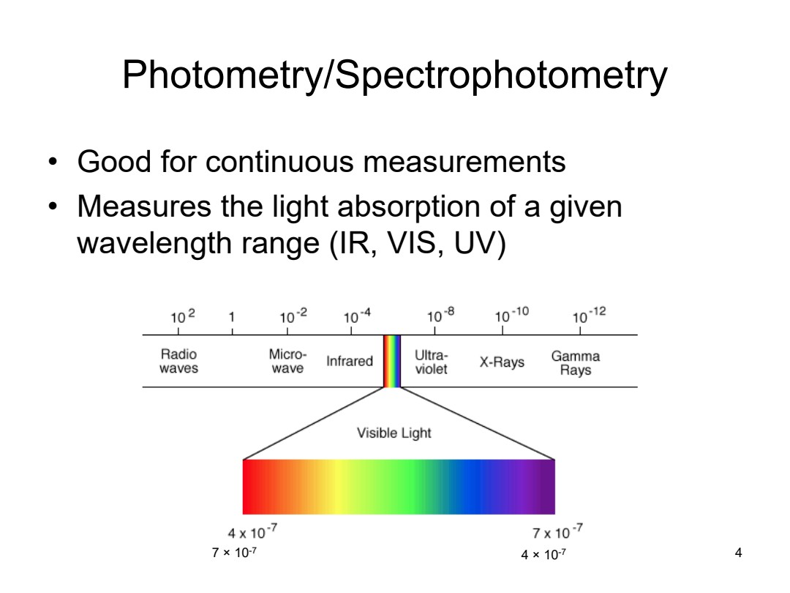

## PDF page 5

Source locator: `ENV5128-07-ambient-gas-measurement`, PDF p. 5. [Original PDF page](../../originals/5128/07_Ambient%20gas%20measurement.pdf#page=5).

Printed slide number candidate: 5 (use PDF page as canonical locator).

Generated navigation topics: Measurement methods and instruments

Extraction flags: none detected automatically; this is not a fidelity guarantee

### Extracted source text

> Photometry/Spectrophotometry
> 5
> • Gases selectively absorb a specific wavelengths
> – IR (0.75 – 100 µm) used primarily for CO 
> – VIS (380 – 750 nm) used primarily for NO2
> – UV (10 – 380 nm) used for O3, NOx, SO2, HCHO, and others
> • Attenuation of radiation measured to determine 
> absorption  
> 2B tech Model 405 NOx monitor (405 nm)
> 2B tech Model 205 O3 monitor (254 nm)

### Original page appearance

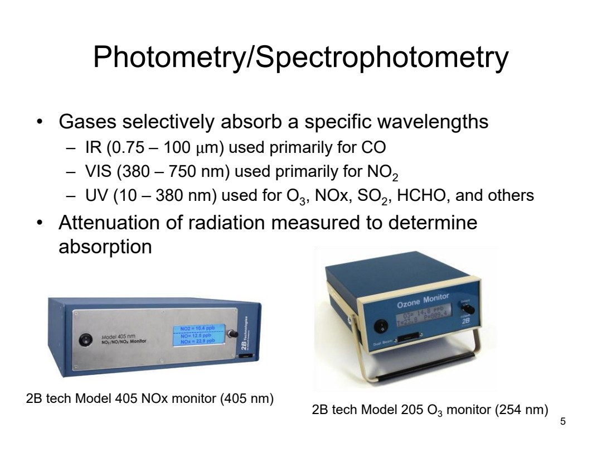

## PDF page 6

Source locator: `ENV5128-07-ambient-gas-measurement`, PDF p. 6. [Original PDF page](../../originals/5128/07_Ambient%20gas%20measurement.pdf#page=6).

Printed slide number candidate: 6 (use PDF page as canonical locator).

Generated navigation topics: Measurement methods and instruments, Ozone and atmospheric chemistry

Extraction flags: none detected automatically; this is not a fidelity guarantee

### Extracted source text

> Other detection methods
> 6
> • Chemiluminescence
> – Chemical reaction used to excite molecules which then 
> luminescence (give off light)
> – Degree of luminescence gives concentration
> – e.g: NOx and O3
> • UV Fluorescence
> – Similar to photometry but light given off (at a specific 
> wavelength) due to excitation of molecule by UV light
> – Used for SO2
> Teledyne Model T200 NO/NO2/NOx analyzer
>  Teledyne Model T100 SO2 analyzer

### Original page appearance

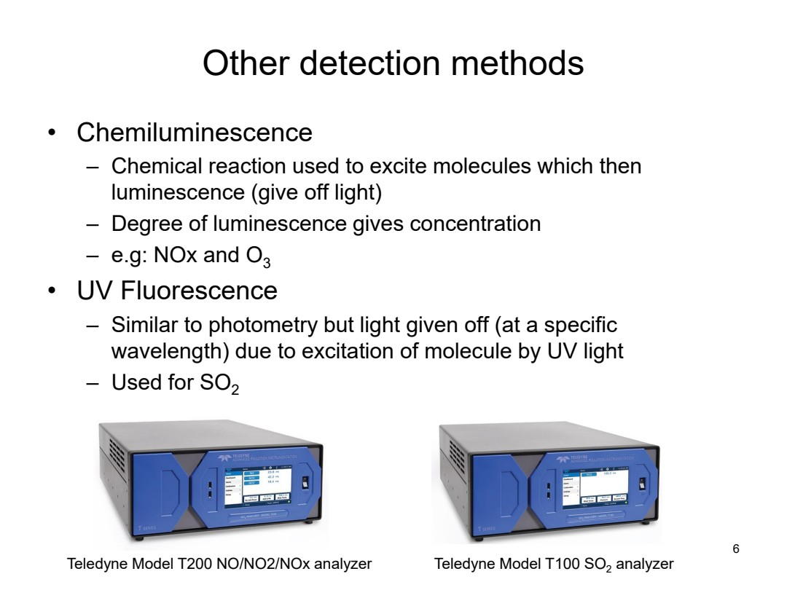

## PDF page 7

Source locator: `ENV5128-07-ambient-gas-measurement`, PDF p. 7. [Original PDF page](../../originals/5128/07_Ambient%20gas%20measurement.pdf#page=7).

Printed slide number candidate: 7 (use PDF page as canonical locator).

Generated navigation topics: Pollution sources and emissions

Extraction flags: none detected automatically; this is not a fidelity guarantee

### Extracted source text

> Other detection methods
> 7
> • Cavity Attenuated Phase Shift (CAPS) spectroscopy
> – The presence of gas distort on/off pattern of incoming light
> – Used for NO2
> Teledyne Model T500U CAPS NO2 analyzer
> https://www.aerodyne.com/wp-content/uploads/2020/02/CAPSNO2.pdf

### Original page appearance

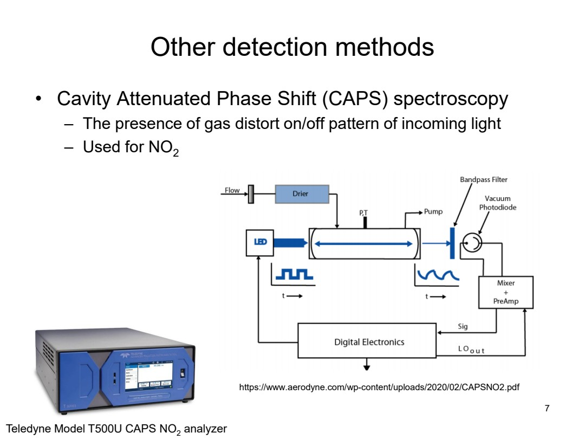

## PDF page 8

Source locator: `ENV5128-07-ambient-gas-measurement`, PDF p. 8. [Original PDF page](../../originals/5128/07_Ambient%20gas%20measurement.pdf#page=8).

Printed slide number candidate: not identified (use PDF page as canonical locator).

Generated navigation topics: Sensors calibration and data quality

Extraction flags: sparse-text

### Extracted source text

> Emerging low-cost sensor

### Original page appearance

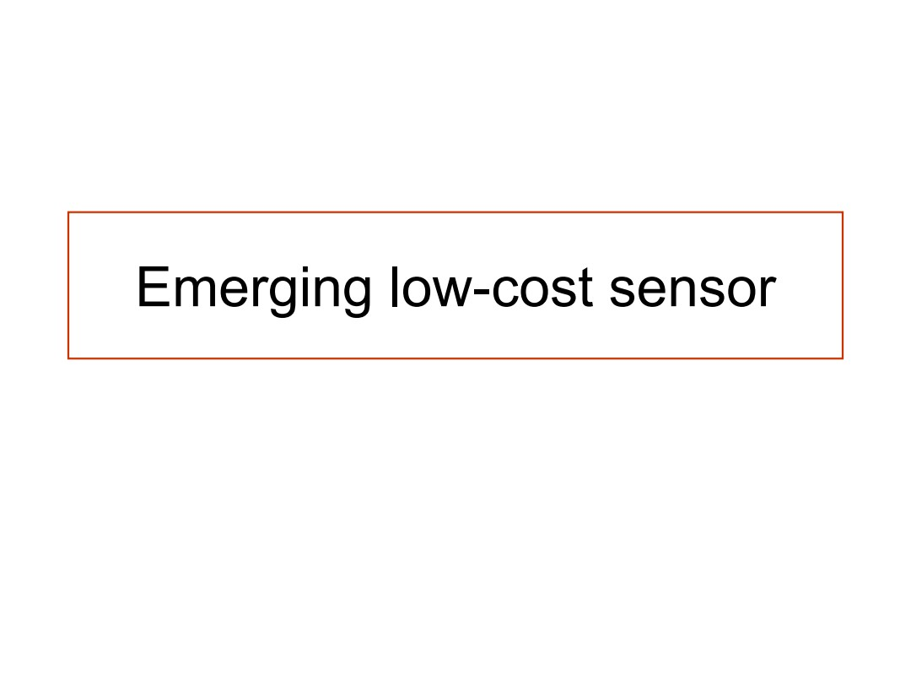

## PDF page 9

Source locator: `ENV5128-07-ambient-gas-measurement`, PDF p. 9. [Original PDF page](../../originals/5128/07_Ambient%20gas%20measurement.pdf#page=9).

Printed slide number candidate: 9 (use PDF page as canonical locator).

Generated navigation topics: Pollution sources and emissions, Exposure and health, Monitoring networks and siting, Measurement methods and instruments, Policy and management context

Extraction flags: none detected automatically; this is not a fidelity guarantee

### Extracted source text

> Ambient Air Quality Standards
> 9
> • Regulatory monitoring
> – Use Federal Reference Method (FRM) and Federal Equivalent 
> Method (FEM) instrument
> • Accurate but costly: equipment, power, site, maintenance, data 
> transmission, personal etc
> – Measurement stations limited spatially and temporally
> • Pollution concentration could change drastically spatially 
> and temporally
> – More so for primary pollutants, especially traffic-related 
> pollutants such as CO, NOx 
> FL monitoring network in FL: https://floridadep.gov/air/air-monitoring/content/air-quality-today
> Oakland, CA Google Street View vehicle monitoring: 
> https://www.edf.org/airqualitymaps/oakland/pollution-and-health-concerns-west-oakland

### Original page appearance

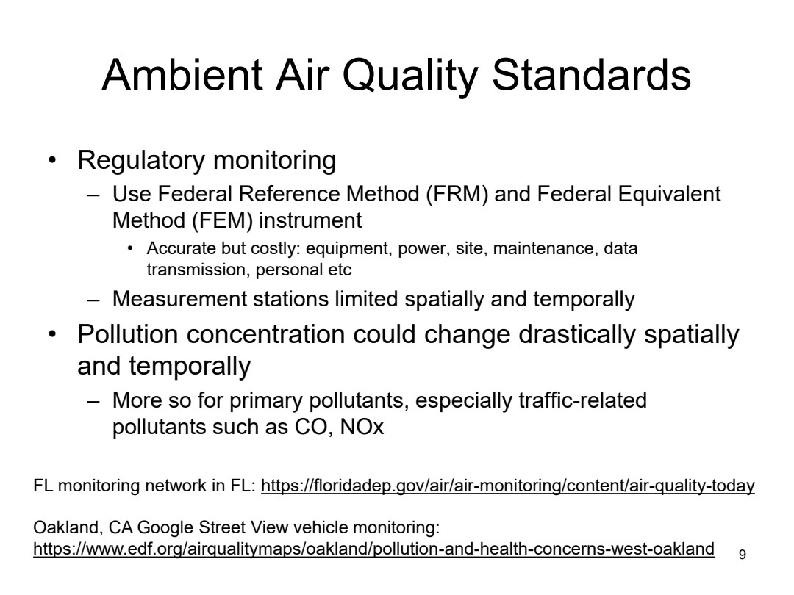

## PDF page 10

Generated visual navigation (not a transcription): Photographic collection of air-monitoring instruments.

Source locator: `ENV5128-07-ambient-gas-measurement`, PDF p. 10. [Original PDF page](../../originals/5128/07_Ambient%20gas%20measurement.pdf#page=10).

Printed slide number candidate: not identified (use PDF page as canonical locator).

Generated navigation topics: Unclassified; inspect source.

Extraction flags: sparse-text, no-extracted-text

### Extracted source text

> [No text extracted; use page image.]

### Original page appearance

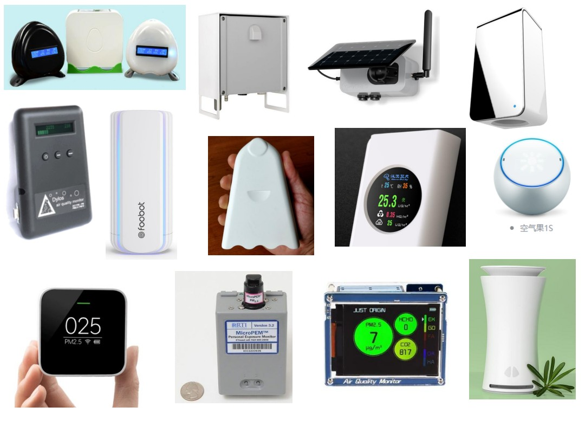

## PDF page 11

Source locator: `ENV5128-07-ambient-gas-measurement`, PDF p. 11. [Original PDF page](../../originals/5128/07_Ambient%20gas%20measurement.pdf#page=11).

Printed slide number candidate: not identified (use PDF page as canonical locator).

Generated navigation topics: Sensors calibration and data quality, Particles and aerosols, Ozone and atmospheric chemistry

Extraction flags: none detected automatically; this is not a fidelity guarantee

### Extracted source text

> Low(er)-cost air quality monitor
> • Uses lower-cost sensor to measure pollution
> • For particulate matter
> – Mostly optical particle counters
> – Count particle # at limited sizes, convert to mass
> • For gases pollutants
> – A wide variety of sensors
> – Metal oxides, electrochemical, photochemical, non-
> dispersive infrared etc
> • Able to measure near-real-time concentration
> • Easy integration into “smart” networks

### Original page appearance

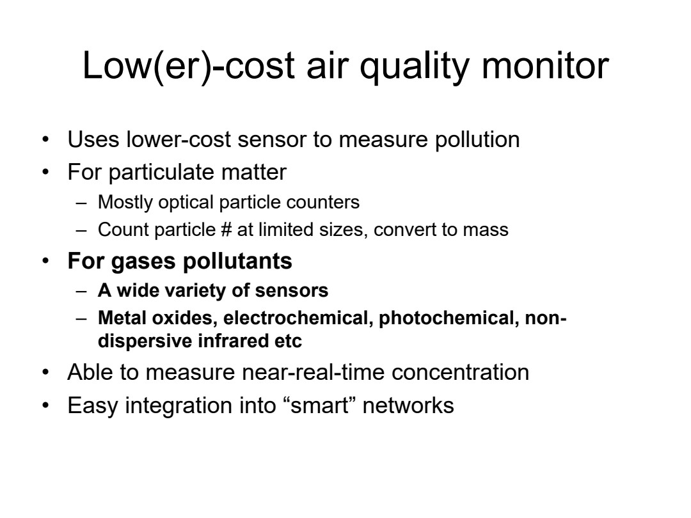

## PDF page 12

Source locator: `ENV5128-07-ambient-gas-measurement`, PDF p. 12. [Original PDF page](../../originals/5128/07_Ambient%20gas%20measurement.pdf#page=12).

Printed slide number candidate: not identified (use PDF page as canonical locator).

Generated navigation topics: Unclassified; inspect source.

Extraction flags: sparse-text

### Extracted source text

> Jonathan E. Thompson 2016 (https://doi.org/10.1016/j.teac.2016.06.001) 

### Original page appearance

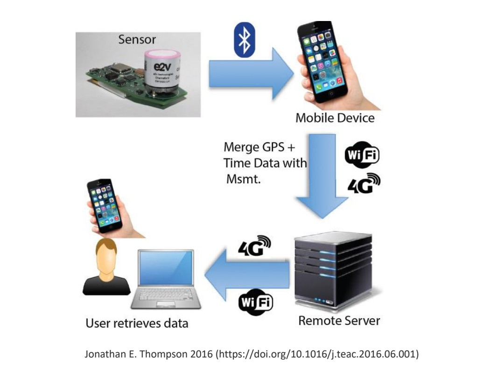

## PDF page 13

Source locator: `ENV5128-07-ambient-gas-measurement`, PDF p. 13. [Original PDF page](../../originals/5128/07_Ambient%20gas%20measurement.pdf#page=13).

Printed slide number candidate: not identified (use PDF page as canonical locator).

Generated navigation topics: Sensors calibration and data quality, Ozone and atmospheric chemistry

Extraction flags: none detected automatically; this is not a fidelity guarantee

### Extracted source text

> Low-cost gas sensors
> • Metal oxide semiconductor (MOS)
> – Conductivity changes when metal oxide 
> surface exposed to target gas
> • Electrochemical
> – Redox reaction due to target gas produce 
> measurable current
> • Non-Dispersive InfraRed (NDIR)
> – Similar method as described in previous 
> slides 
> Figaro TGS2611 CH4 sensor
> Alpahsense electrochemical 
> sensors
> Sensirion SCD30 NDIR CO2 
> sensor
> More infor read: Jonathan E. Thompson 2016 
> (https://doi.org/10.1016/j.teac.2016.06.001) 

### Original page appearance

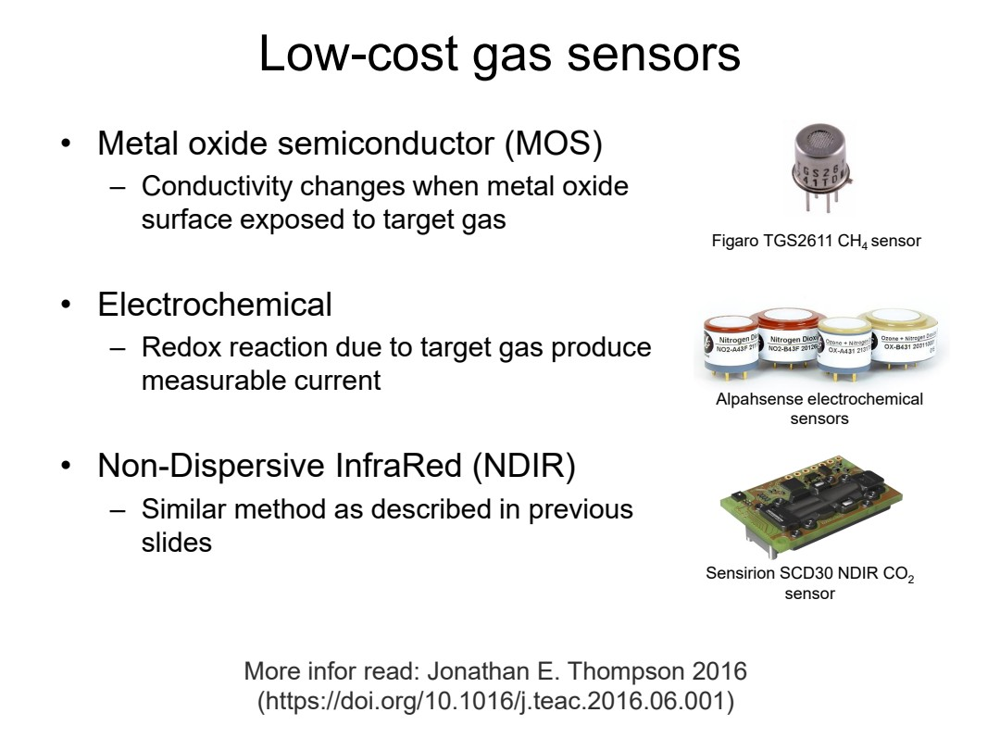

## PDF page 14

Source locator: `ENV5128-07-ambient-gas-measurement`, PDF p. 14. [Original PDF page](../../originals/5128/07_Ambient%20gas%20measurement.pdf#page=14).

Printed slide number candidate: not identified (use PDF page as canonical locator).

Generated navigation topics: Unclassified; inspect source.

Extraction flags: sparse-text

### Extracted source text

> Behind the hype

### Original page appearance

## PDF page 15

Source locator: `ENV5128-07-ambient-gas-measurement`, PDF p. 15. [Original PDF page](../../originals/5128/07_Ambient%20gas%20measurement.pdf#page=15).

Printed slide number candidate: not identified (use PDF page as canonical locator).

Generated navigation topics: Transport and meteorology, Sensors calibration and data quality, Measurement methods and instruments

Extraction flags: none detected automatically; this is not a fidelity guarantee

### Extracted source text

> Behind the hype
> • Large amount of manufactures rush into market, 
> many with limited understanding on air pollution
> • Can we trust the data?
> – Measurement accuracy
> – Inter-unit variability (precision)
> – Environmental impact (temperature, humidity etc)
> – Cross-sensitivity
> – Long-term stability
> – Calibration requirement

### Original page appearance

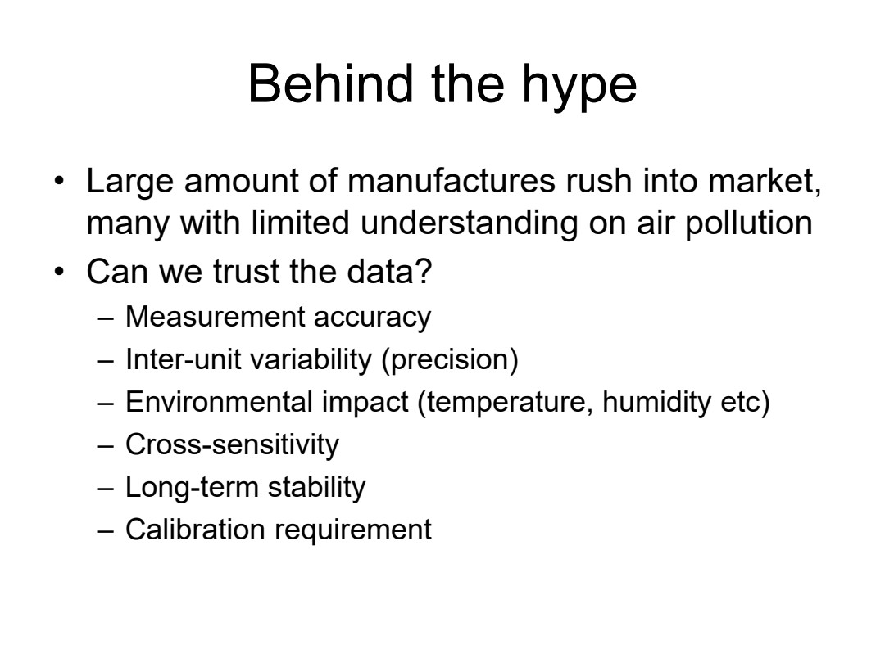

## PDF page 16

Source locator: `ENV5128-07-ambient-gas-measurement`, PDF p. 16. [Original PDF page](../../originals/5128/07_Ambient%20gas%20measurement.pdf#page=16).

Printed slide number candidate: not identified (use PDF page as canonical locator).

Generated navigation topics: Sensors calibration and data quality

Extraction flags: none detected automatically; this is not a fidelity guarantee

### Extracted source text

> Accuracy, precision and variability
> Claimed performance of a 
> low-cost OPC PM sensor
> Responses to the same test 
> gas from gas sensors of the 
> same brand and same model
> Correlations between 2 
> co-located PM sensors 
> of brand 1
> Correlations between 2 
> co-located PM sensors 
> of brand 2

### Original page appearance

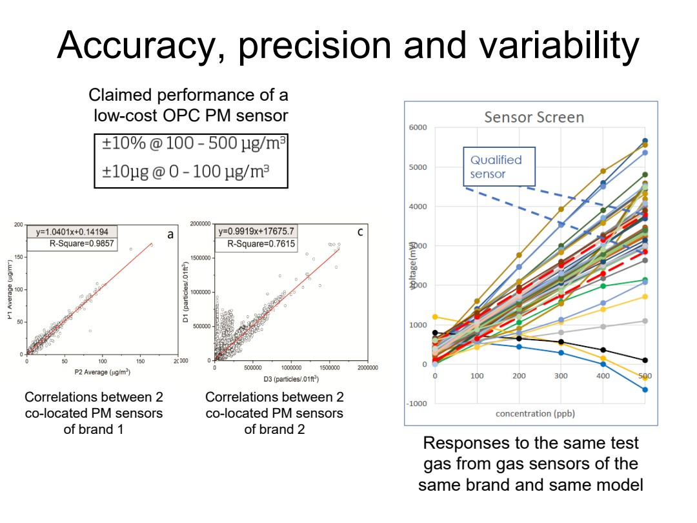

## PDF page 17

Source locator: `ENV5128-07-ambient-gas-measurement`, PDF p. 17. [Original PDF page](../../originals/5128/07_Ambient%20gas%20measurement.pdf#page=17).

Printed slide number candidate: not identified (use PDF page as canonical locator).

Generated navigation topics: Sensors calibration and data quality

Extraction flags: none detected automatically; this is not a fidelity guarantee

### Extracted source text

> Accuracy, precision and variability
> A batch of low-cost O3 sensor
> A batch of low-cost NO2 sensor
> Lewis et al: https://www.wmo.int/pages/prog/arep/gaw/documents/01_Lewis_LowCostSensors.pdf

### Original page appearance

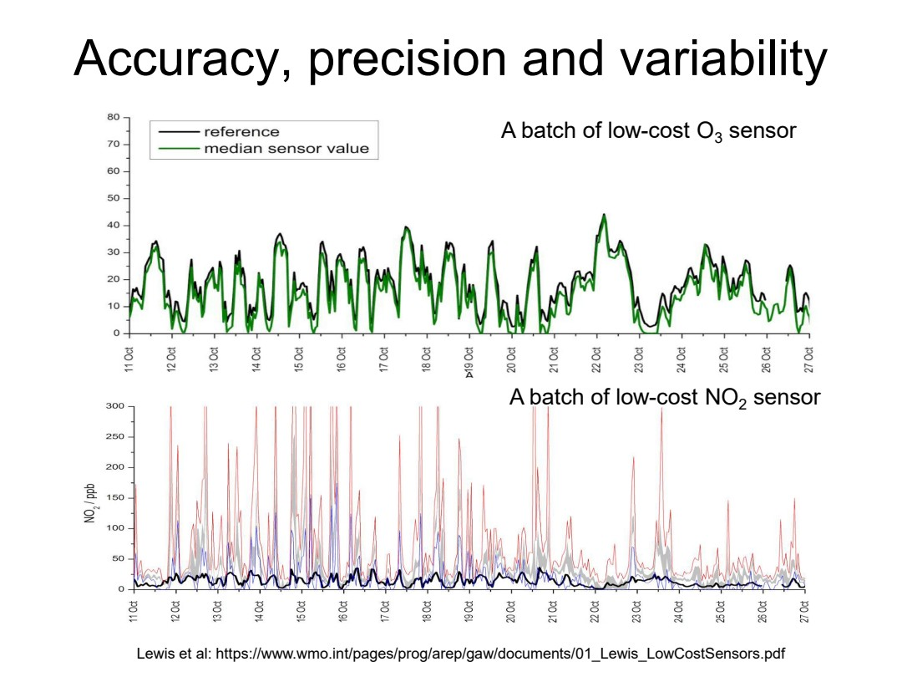

## PDF page 18

Source locator: `ENV5128-07-ambient-gas-measurement`, PDF p. 18. [Original PDF page](../../originals/5128/07_Ambient%20gas%20measurement.pdf#page=18).

Printed slide number candidate: not identified (use PDF page as canonical locator).

Generated navigation topics: Sensors calibration and data quality

Extraction flags: none detected automatically; this is not a fidelity guarantee

### Extracted source text

> Environmental impacts
> Temp and RH impact on NO2 sensor
> From AQ-SPEC evaluation 
> http://www.aqmd.gov/docs/default-source/aq-spec/laboratory-evaluations/aeroqual-aqy-(v0-5)---lab-evaluation.pdf?sfvrsn=6

### Original page appearance

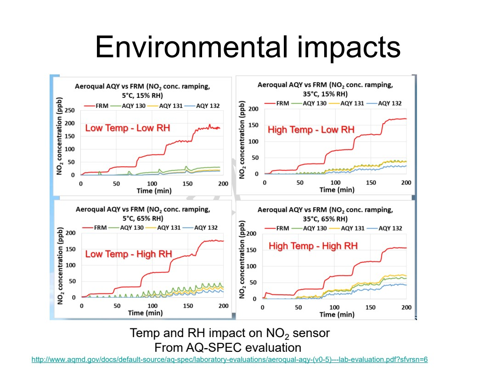

## PDF page 19

Source locator: `ENV5128-07-ambient-gas-measurement`, PDF p. 19. [Original PDF page](../../originals/5128/07_Ambient%20gas%20measurement.pdf#page=19).

Printed slide number candidate: not identified (use PDF page as canonical locator).

Generated navigation topics: Sensors calibration and data quality

Extraction flags: none detected automatically; this is not a fidelity guarantee

### Extracted source text

> Cross-sensitivity
> Cross-sensitivity of NO2 sensor with O3
> From AQ-SPEC evaluation 
> http://www.aqmd.gov/docs/default-source/aq-spec/laboratory-evaluations/aeroqual-aqy-(v0-5)---lab-evaluation.pdf?sfvrsn=6

### Original page appearance

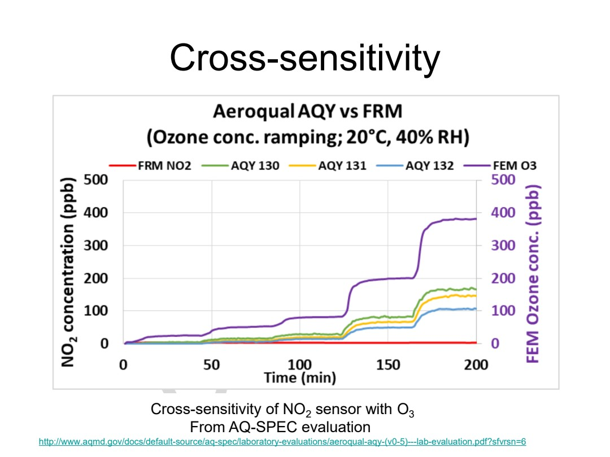

## PDF page 20

Source locator: `ENV5128-07-ambient-gas-measurement`, PDF p. 20. [Original PDF page](../../originals/5128/07_Ambient%20gas%20measurement.pdf#page=20).

Printed slide number candidate: not identified (use PDF page as canonical locator).

Generated navigation topics: Sensors calibration and data quality

Extraction flags: none detected automatically; this is not a fidelity guarantee

### Extracted source text

> Cross-sensitivity
> Cross-sensitivity of alphasense gas sensors
> Lewis et al: https://www.wmo.int/pages/prog/arep/gaw/documents/01_Lewis_LowCostSensors.pdf

### Original page appearance

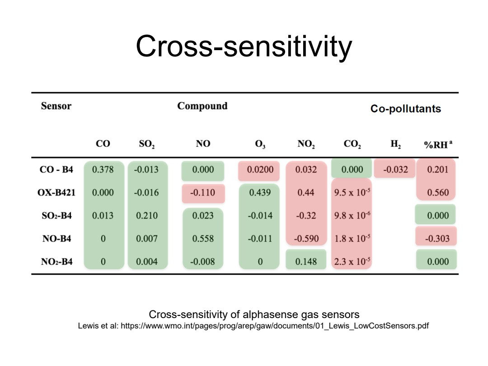

## PDF page 21

Source locator: `ENV5128-07-ambient-gas-measurement`, PDF p. 21. [Original PDF page](../../originals/5128/07_Ambient%20gas%20measurement.pdf#page=21).

Printed slide number candidate: not identified (use PDF page as canonical locator).

Generated navigation topics: Sensors calibration and data quality

Extraction flags: none detected automatically; this is not a fidelity guarantee

### Extracted source text

> Calibration requirement
> Portland, OR
> Riverside, CA
> Atlanta, GA
> NO2
> Varying performance of the same model monitor at different locations

### Original page appearance

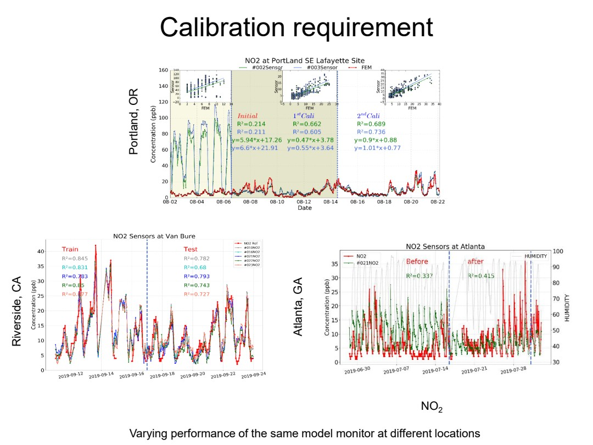

## PDF page 22

Source locator: `ENV5128-07-ambient-gas-measurement`, PDF p. 22. [Original PDF page](../../originals/5128/07_Ambient%20gas%20measurement.pdf#page=22).

Printed slide number candidate: not identified (use PDF page as canonical locator).

Generated navigation topics: Sensors calibration and data quality, Policy and management context

Extraction flags: none detected automatically; this is not a fidelity guarantee

### Extracted source text

> Summary
> • Smart and connected air quality sensor devices has 
> great potentials to substantially change the landscape of 
> traditional air quality monitoring
> • Currently a booming and fast-expanding market, with 
> many devices with varying performances
> • Data quality remain a significant concern
> • Without careful QA/QC, data collected could be 
> misleading, or even useless
> • The vast majority of smart air sensor data can NOT be 
> used for regulatory decision making

### Original page appearance

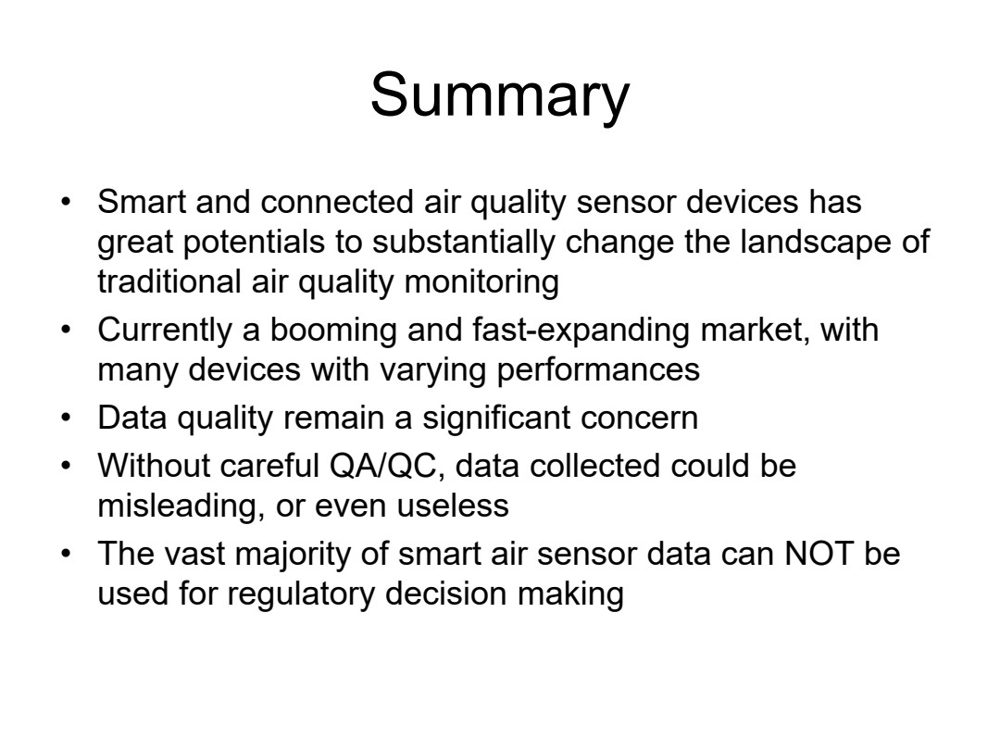
