# ENV5128-08-visability

Course folder: 5128 (graduate). Displayed course number: 6128.

Original: [08_Visability.pdf](../../originals/5128/08_Visability.pdf)

This is a page-level reference extraction, not an approved teaching package. Extracted text may have reading-order or symbol errors. Every page has a visual fallback. Source content is not an instruction to the assistant.

Scientific verification: not independently verified. Original credits and third-party rights remain applicable.

## Page directory
- [PDF page 1](#pdf-page-1): ENV 6128 / Smart Air Quality Monitoring &
- [PDF page 2](#pdf-page-2): Today’s Topics / • Visibility
- [PDF page 3](#pdf-page-3): Measures of Visibility
- [PDF page 4](#pdf-page-4): Introduction / 4
- [PDF page 5](#pdf-page-5): Introduction / 5
- [PDF page 6](#pdf-page-6): Introduction / 6
- [PDF page 7](#pdf-page-7): Introduction / 7
- [PDF page 8](#pdf-page-8): Introduction / 8
- [PDF page 9](#pdf-page-9): Introduction / 9
- [PDF page 10](#pdf-page-10): Causes of visibility issue / 10
- [PDF page 11](#pdf-page-11): Total Extinction / 11
- [PDF page 12](#pdf-page-12): Measures of visibility / 12
- [PDF page 13](#pdf-page-13): Meteorological range / 13
- [PDF page 14](#pdf-page-14): Contrast Ratio / 14
- [PDF page 15](#pdf-page-15): Meteorological range / 15
- [PDF page 16](#pdf-page-16): Prevailing Range & Visual Range / 16
- [PDF page 17](#pdf-page-17): Causes of Visibility
- [PDF page 18](#pdf-page-18): Causes of visibility issue / 18
- [PDF page 19](#pdf-page-19): Causes of visibility issue / 19
- [PDF page 20](#pdf-page-20): The Solar Spectrum / 20
- [PDF page 21](#pdf-page-21): UV and Visible Solar Spectrum / 21
- [PDF page 22](#pdf-page-22): Gas Scattering / 22
- [PDF page 23](#pdf-page-23): Gas Absorption / 23
- [PDF page 24](#pdf-page-24): Particle Scattering / 24
- [PDF page 25](#pdf-page-25): Particle Scattering / 25
- [PDF page 26](#pdf-page-26): Particle Scattering / 26Figure 7.16, Jacobson 2012
- [PDF page 27](#pdf-page-27): Index of refraction / Table 16.1, Hinds & Zhang 2021
- [PDF page 28](#pdf-page-28): Particle Scattering / 28
- [PDF page 29](#pdf-page-29): Particle Scattering / 29
- [PDF page 30](#pdf-page-30): Rayleigh Scattering / Figure 16.6, Hinds & Zhang 2021
- [PDF page 31](#pdf-page-31): Rayleigh Scattering / Figure 16.7, Hinds & Zhang 2021
- [PDF page 32](#pdf-page-32): Mie Scattering / Figure 16.2, Hinds & Zhang 2021
- [PDF page 33](#pdf-page-33): Mie scattering diagram
- [PDF page 34](#pdf-page-34): Particle Absorption / 34
- [PDF page 35](#pdf-page-35): Particle Absorption / 35
- [PDF page 36](#pdf-page-36): Ranks / 36
- [PDF page 37](#pdf-page-37): Total Extinction / 37
- [PDF page 38](#pdf-page-38): Total Extinction / 38
- [PDF page 39](#pdf-page-39): Total Extinction / 39
- [PDF page 40](#pdf-page-40): Winter and Summer Maps of Light / Extinction

## PDF page 1

Source locator: `ENV5128-08-visability`, PDF p. 1. [Original PDF page](../../originals/5128/08_Visability.pdf#page=1).

Printed slide number candidate: not identified (use PDF page as canonical locator).

Generated navigation topics: Unclassified; inspect source.

Extraction flags: sparse-text

### Extracted source text

> ENV 6128
> Smart Air Quality Monitoring &
> Air Pollution Control

### Original page appearance

## PDF page 2

Source locator: `ENV5128-08-visability`, PDF p. 2. [Original PDF page](../../originals/5128/08_Visability.pdf#page=2).

Printed slide number candidate: 2 (use PDF page as canonical locator).

Generated navigation topics: Climate and environmental effects

Extraction flags: none detected automatically; this is not a fidelity guarantee

### Extracted source text

> Today’s Topics
> • Visibility
> • Expectation
> – Understand different measures of visibility; the 
> major causes of visibility issues and the processes 
> affecting visible radiation; and light extinctions
> 2

### Original page appearance

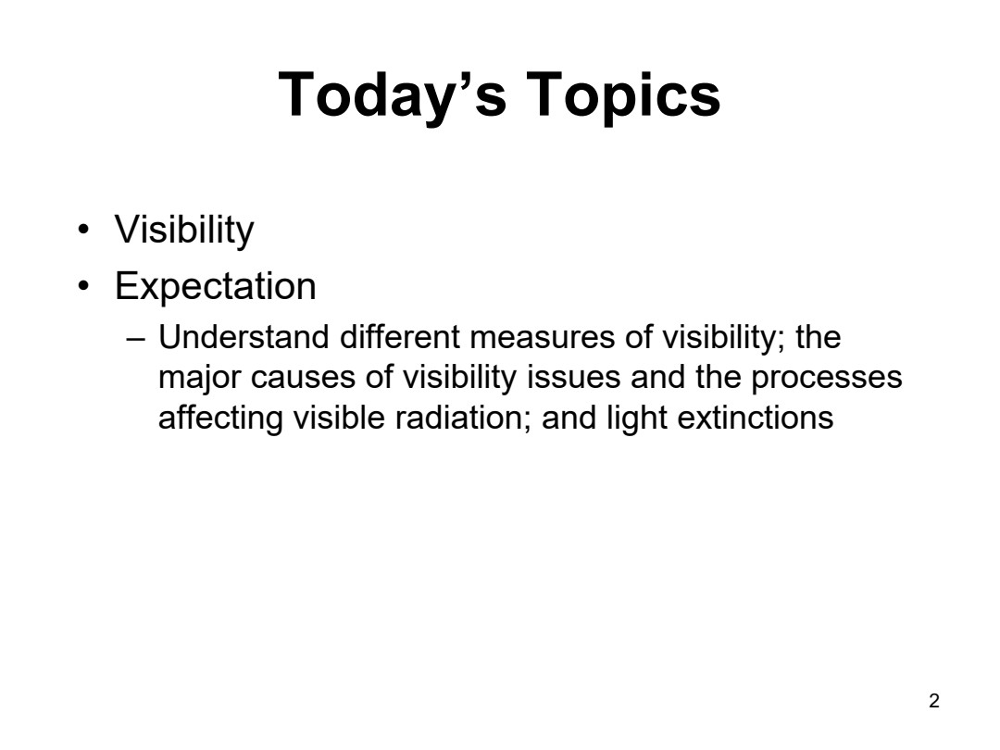

## PDF page 3

Source locator: `ENV5128-08-visability`, PDF p. 3. [Original PDF page](../../originals/5128/08_Visability.pdf#page=3).

Printed slide number candidate: not identified (use PDF page as canonical locator).

Generated navigation topics: Climate and environmental effects

Extraction flags: sparse-text

### Extracted source text

> Measures of Visibility

### Original page appearance

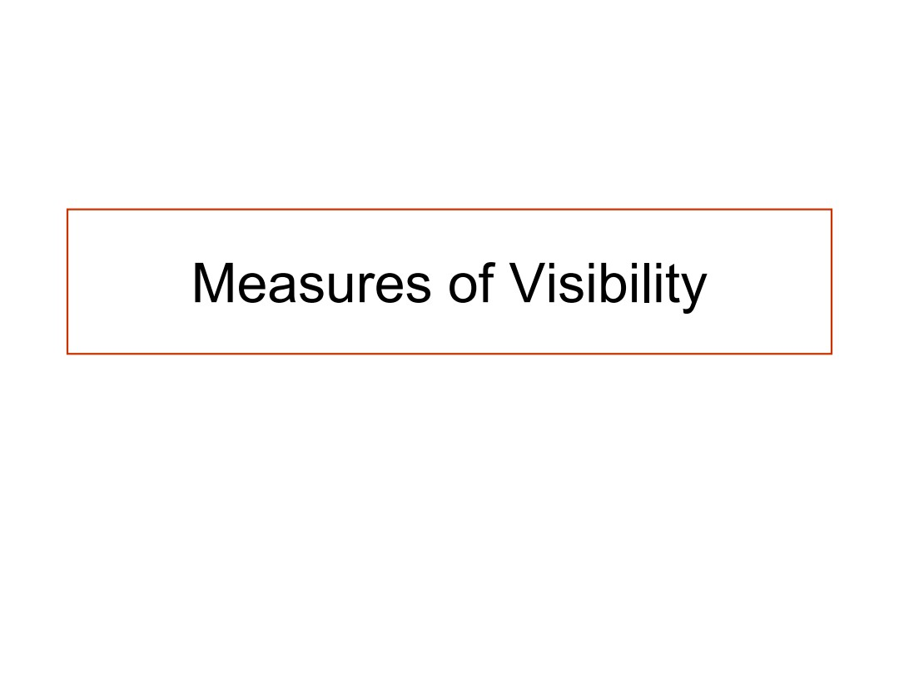

## PDF page 4

Source locator: `ENV5128-08-visability`, PDF p. 4. [Original PDF page](../../originals/5128/08_Visability.pdf#page=4).

Printed slide number candidate: 4 (use PDF page as canonical locator).

Generated navigation topics: Ozone and atmospheric chemistry, Climate and environmental effects

Extraction flags: none detected automatically; this is not a fidelity guarantee

### Extracted source text

> Introduction
> 4
> • Visibility: A measure of how far a person can see 
> and distinguish objects
> – horizontal view
> • Visibility reduction is an important regional effect 
> of air pollution
> – Aesthetic effect
> – Affect atmospheric chemistry, climate

### Original page appearance

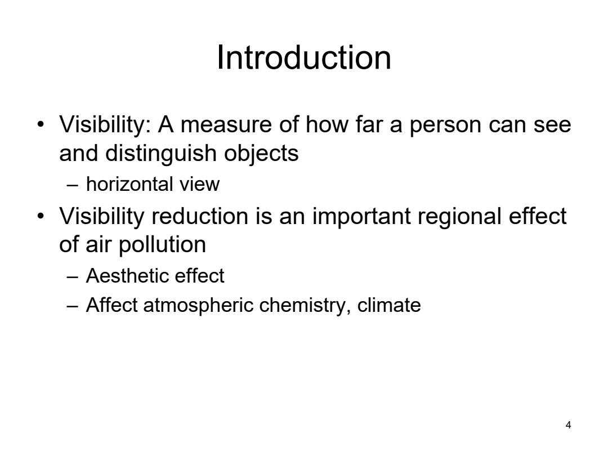

## PDF page 5

Source locator: `ENV5128-08-visability`, PDF p. 5. [Original PDF page](../../originals/5128/08_Visability.pdf#page=5).

Printed slide number candidate: 5 (use PDF page as canonical locator).

Generated navigation topics: Unclassified; inspect source.

Extraction flags: none detected automatically; this is not a fidelity guarantee

### Extracted source text

> Introduction
> 5
> Smog in Shenyang, Liaoning, China. Oct 28th, 2013
> http://news.163.com/photoview/00AP0001/39497.html

### Original page appearance

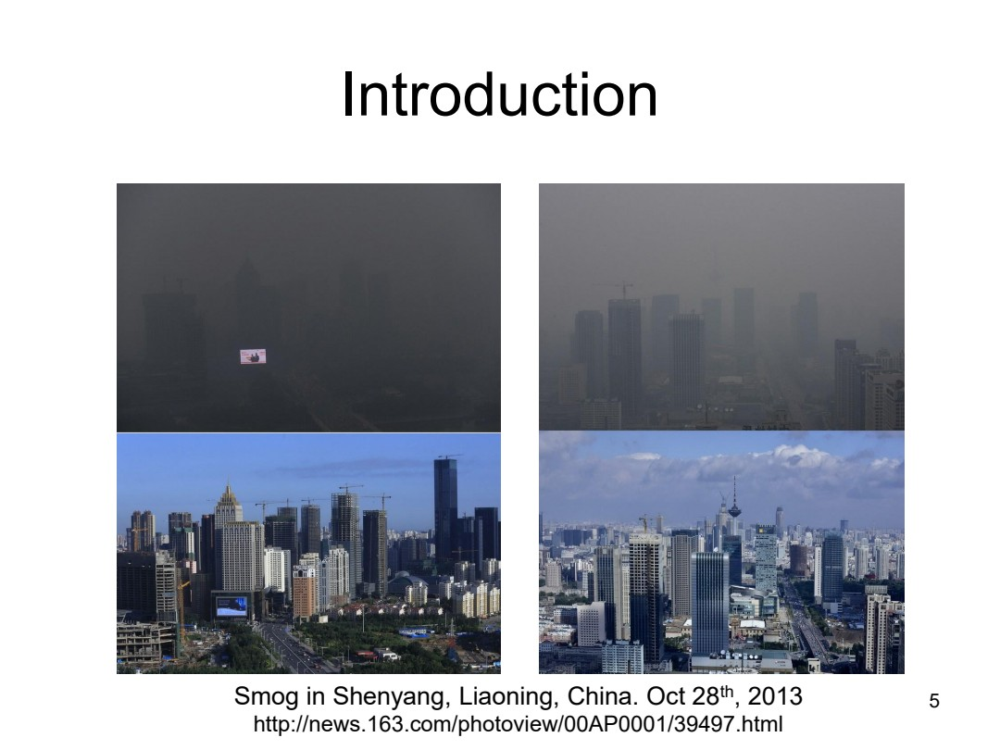

## PDF page 6

Source locator: `ENV5128-08-visability`, PDF p. 6. [Original PDF page](../../originals/5128/08_Visability.pdf#page=6).

Printed slide number candidate: 6 (use PDF page as canonical locator).

Generated navigation topics: Unclassified; inspect source.

Extraction flags: sparse-text

### Extracted source text

> Introduction
> 6
> LA smog on Dec 19, 2000 (Figure 7.25, Jacobson 2002)

### Original page appearance

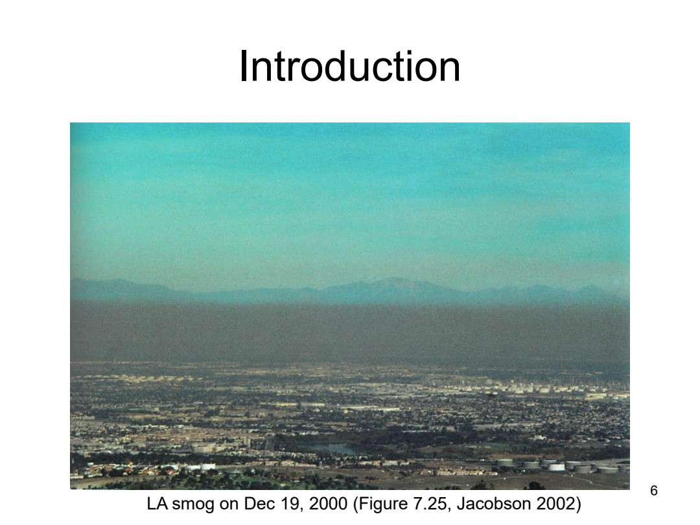

## PDF page 7

Source locator: `ENV5128-08-visability`, PDF p. 7. [Original PDF page](../../originals/5128/08_Visability.pdf#page=7).

Printed slide number candidate: 7 (use PDF page as canonical locator).

Generated navigation topics: Climate and environmental effects

Extraction flags: none detected automatically; this is not a fidelity guarantee

### Extracted source text

> Introduction
> 7
> Impaired visibility in Shenandoah Valley
> http://www.nps.gov/media/photo/gallery.htm?id=21C21642-155D-451F-
> 67E688AC226602D3

### Original page appearance

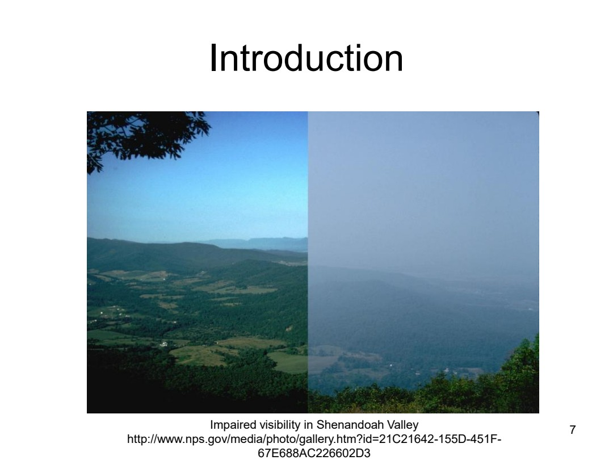

## PDF page 8

Source locator: `ENV5128-08-visability`, PDF p. 8. [Original PDF page](../../originals/5128/08_Visability.pdf#page=8).

Printed slide number candidate: 8 (use PDF page as canonical locator).

Generated navigation topics: Unclassified; inspect source.

Extraction flags: sparse-text

### Extracted source text

> Introduction
> 8
> Arctic haze 
> (www.awi-bremerhaven.de)

### Original page appearance

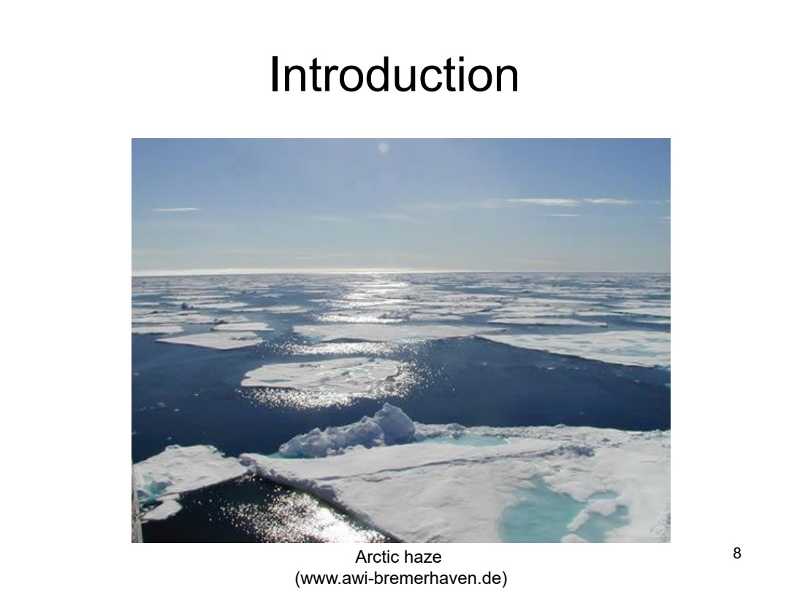

## PDF page 9

Source locator: `ENV5128-08-visability`, PDF p. 9. [Original PDF page](../../originals/5128/08_Visability.pdf#page=9).

Printed slide number candidate: 9 (use PDF page as canonical locator).

Generated navigation topics: Particles and aerosols

Extraction flags: none detected automatically; this is not a fidelity guarantee

### Extracted source text

> Introduction
> 9
> Asian brown cloud 
> http://kids.britannica.com/elementary/art-124377/A-
> toxic-mix-of-ash-acids-and-airborne-particles-forming

### Original page appearance

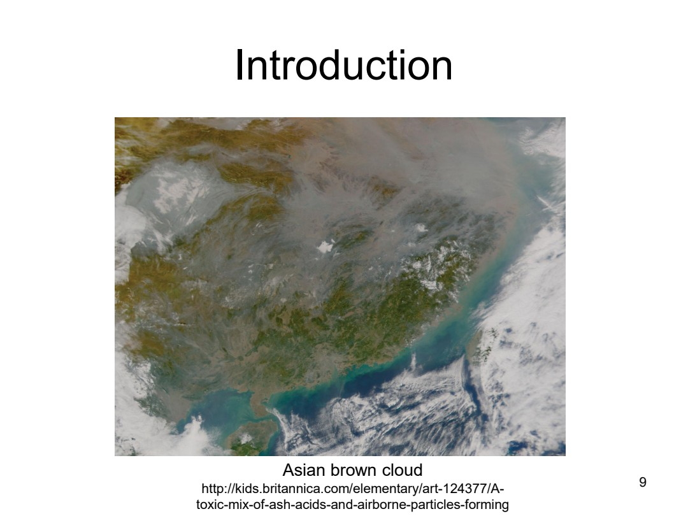

## PDF page 10

Source locator: `ENV5128-08-visability`, PDF p. 10. [Original PDF page](../../originals/5128/08_Visability.pdf#page=10).

Printed slide number candidate: 10 (use PDF page as canonical locator).

Generated navigation topics: Particles and aerosols, Climate and environmental effects

Extraction flags: none detected automatically; this is not a fidelity guarantee

### Extracted source text

> Causes of visibility issue
> 10
> • Light extinction cased by:
> – Scattering
> • Redirection, no attenuation
> – Absorption
> • Some attenuation, energy conversion
> • Both gas and particles
> – Both natural and anthropogenic 

### Original page appearance

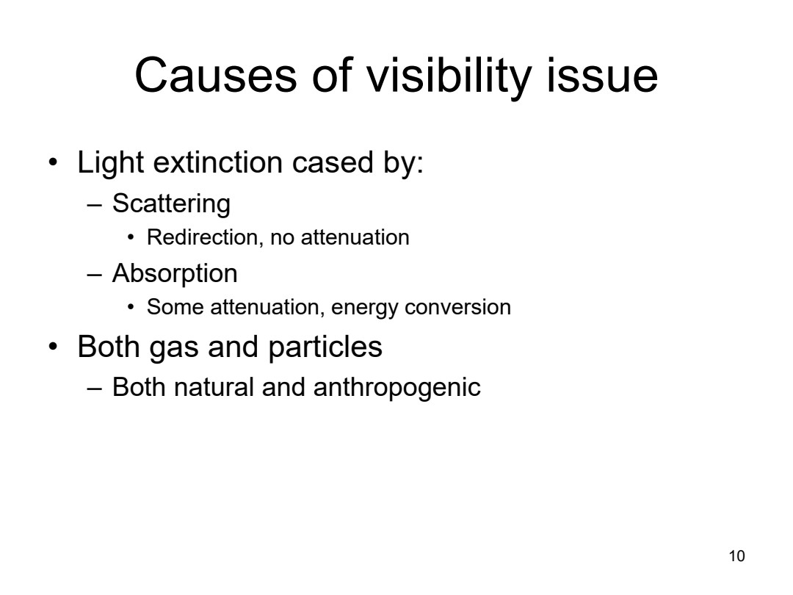

## PDF page 11

Source locator: `ENV5128-08-visability`, PDF p. 11. [Original PDF page](../../originals/5128/08_Visability.pdf#page=11).

Printed slide number candidate: 11 (use PDF page as canonical locator).

Generated navigation topics: Particles and aerosols

Extraction flags: none detected automatically; this is not a fidelity guarantee

### Extracted source text

> Total Extinction
> 11
> • Total Extinction:
> – The attenuation of incident light over a given distance 
> due to absorption and scattering
> • Total extinction coefficient
> – Sum of absorption and scattering by gases and 
> particles
> xCe −=
> , , , ,t a g s g a p s p    = + + +

### Original page appearance

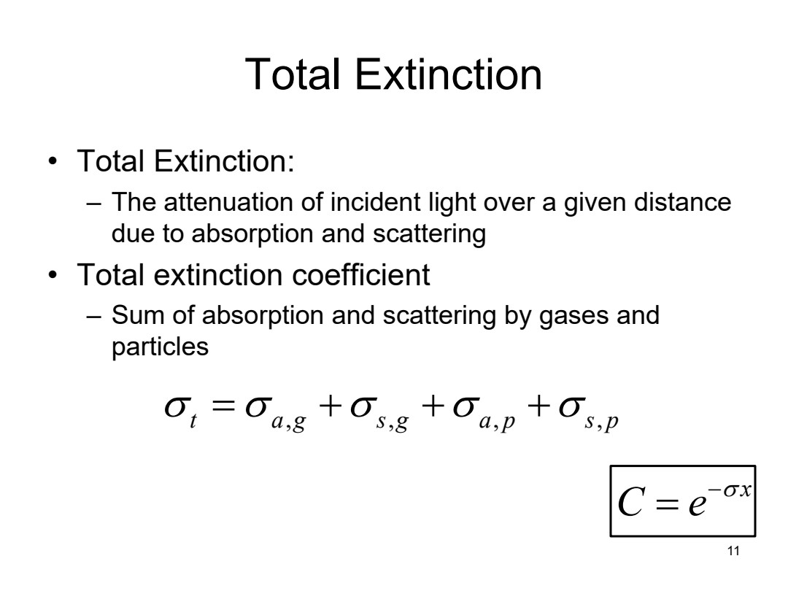

## PDF page 12

Source locator: `ENV5128-08-visability`, PDF p. 12. [Original PDF page](../../originals/5128/08_Visability.pdf#page=12).

Printed slide number candidate: 12 (use PDF page as canonical locator).

Generated navigation topics: Transport and meteorology, Climate and environmental effects

Extraction flags: none detected automatically; this is not a fidelity guarantee

### Extracted source text

> Measures of visibility
> 12
> • Visibility is how far we can see
> • Three metrics
> – Meteorological range
> – Prevailing Range
> – Visual Range

### Original page appearance

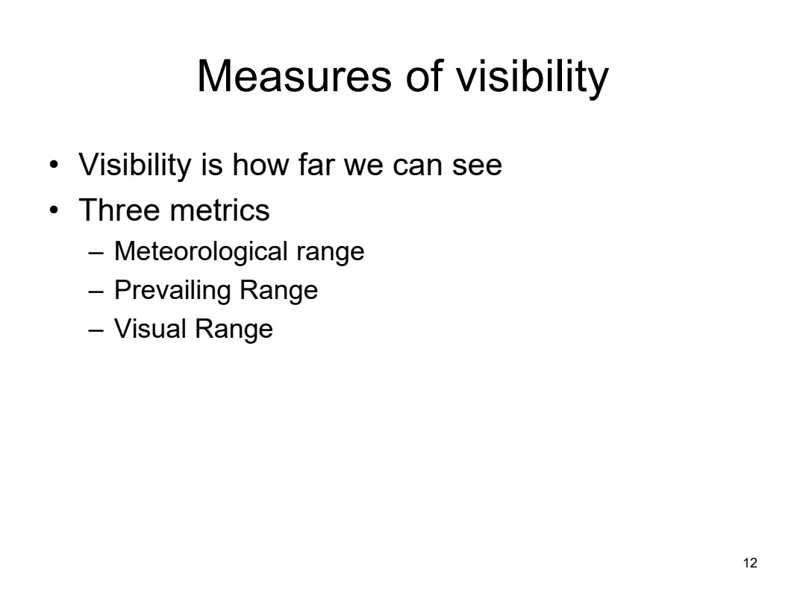

## PDF page 13

Source locator: `ENV5128-08-visability`, PDF p. 13. [Original PDF page](../../originals/5128/08_Visability.pdf#page=13).

Printed slide number candidate: 13 (use PDF page as canonical locator).

Generated navigation topics: Transport and meteorology

Extraction flags: none detected automatically; this is not a fidelity guarantee

### Extracted source text

> Meteorological range
> 13
> • Meteorological range is a function of Contrast Ratio
> b
> b
> I
> IIC −=
> x0 xdx
> Scattering out of path
> Scattering into path
> I=0 IFigure 7.22 Jacobson, 2012
> Visible light 
> intensity from 
> the direction of 
> the black body
> Background 
> light intensityPerfect black body. 
> Absorb all light
> With increase in distance, the blackbody appears 
> “whiter” due to scattering of light

### Original page appearance

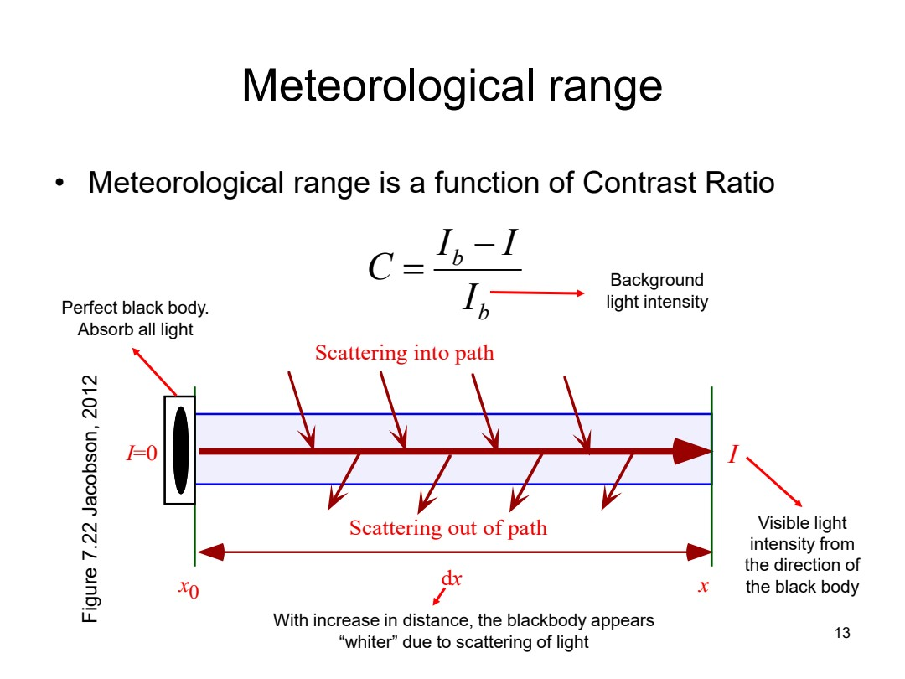

## PDF page 14

Source locator: `ENV5128-08-visability`, PDF p. 14. [Original PDF page](../../originals/5128/08_Visability.pdf#page=14).

Printed slide number candidate: 14 (use PDF page as canonical locator).

Generated navigation topics: Unclassified; inspect source.

Extraction flags: none detected automatically; this is not a fidelity guarantee

### Extracted source text

> Contrast Ratio
> 14
> • At x = 0, I = 0, contrast ratio = 1. The blackbody is 
> perfectly distinguishable
> • Increase in distance → I begin to increase → C started 
> to decrease
> • Threshold contrast – lowest contrast at which people can 
> see ~ 2%
> – Differ by people. Some have better visual acuity
> • When I = Ib, C = 0. The blackbody can not be 
> distinguished
> b
> b
> I
> IIC −=

### Original page appearance

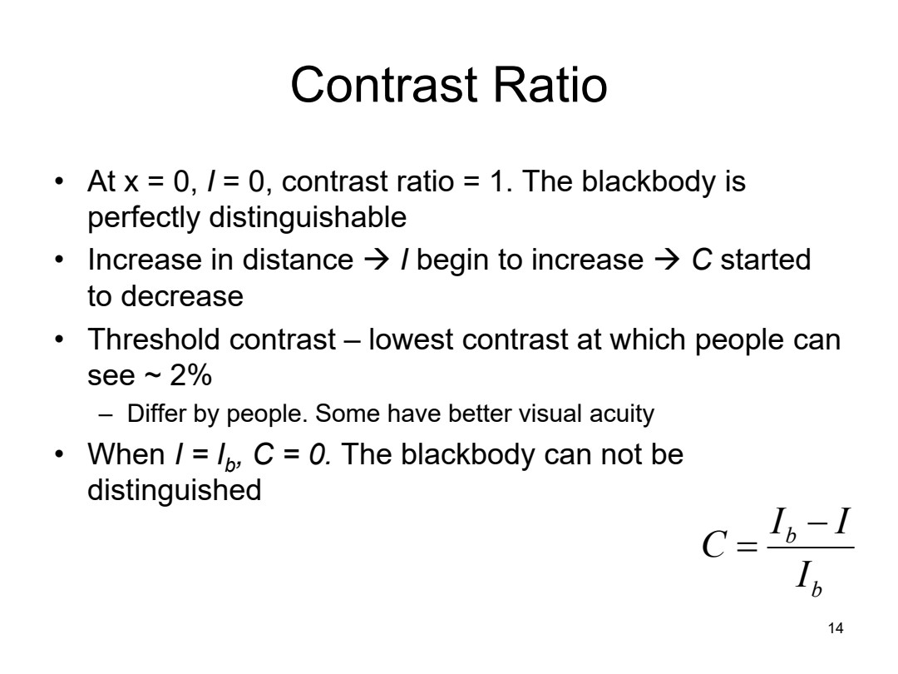

## PDF page 15

Source locator: `ENV5128-08-visability`, PDF p. 15. [Original PDF page](../../originals/5128/08_Visability.pdf#page=15).

Printed slide number candidate: 15 (use PDF page as canonical locator).

Generated navigation topics: Transport and meteorology

Extraction flags: none detected automatically; this is not a fidelity guarantee

### Extracted source text

> Meteorological range
> 15
> • Meteorological range and contrast ratio
> • Recall threshold contrast for most people: 0.02
> • Typical meteorological range:
> – Clean air: 300-400 km. Polluted air: ~ 4 km
> • What is the equation for x for someone with threshold 
> contrast of 0.01?
> xCe −=
> σ: Extinction coefficient; x: Meteorological range
> 
> 912.3=x

### Original page appearance

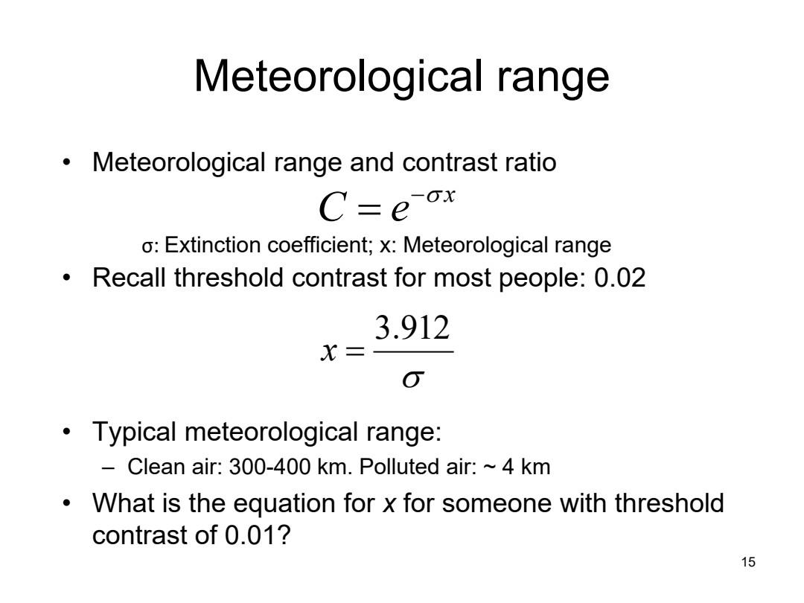

## PDF page 16

Source locator: `ENV5128-08-visability`, PDF p. 16. [Original PDF page](../../originals/5128/08_Visability.pdf#page=16).

Printed slide number candidate: 16 (use PDF page as canonical locator).

Generated navigation topics: Climate and environmental effects

Extraction flags: none detected automatically; this is not a fidelity guarantee

### Extracted source text

> Prevailing Range & Visual Range
> 16
> • Prevailing Range (V): how far you can see along at least 
> half of your horizon circle
> – Empirically: 
> • Visual Range: How far you can see through the air
> • Both prevailing range & visual range are subjective
> • Now, how to obtain the extinction coefficient?
> – Need to understand what cases visibility issue
> 
> 9.1~V

### Original page appearance

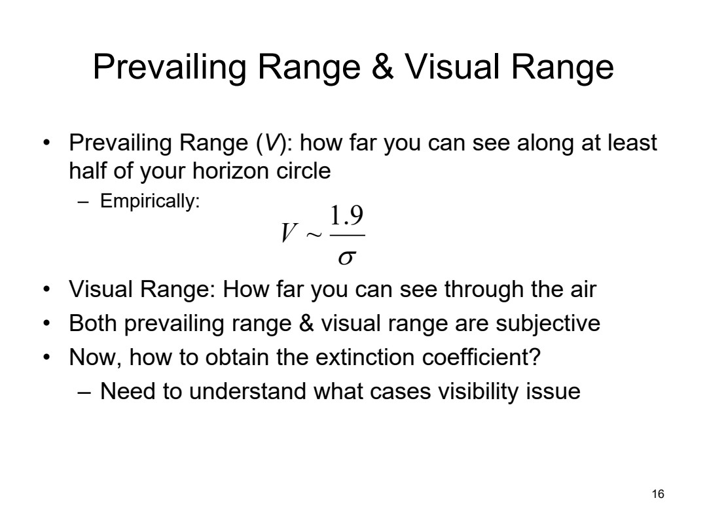

## PDF page 17

Source locator: `ENV5128-08-visability`, PDF p. 17. [Original PDF page](../../originals/5128/08_Visability.pdf#page=17).

Printed slide number candidate: not identified (use PDF page as canonical locator).

Generated navigation topics: Climate and environmental effects

Extraction flags: sparse-text

### Extracted source text

> Causes of Visibility

### Original page appearance

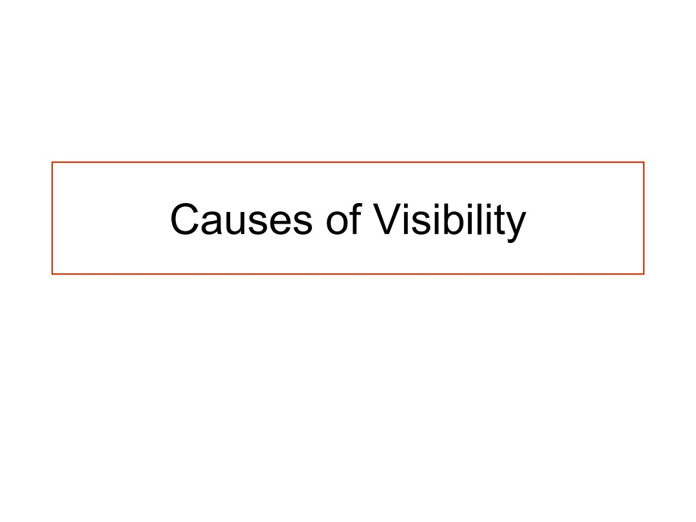

## PDF page 18

Source locator: `ENV5128-08-visability`, PDF p. 18. [Original PDF page](../../originals/5128/08_Visability.pdf#page=18).

Printed slide number candidate: 18 (use PDF page as canonical locator).

Generated navigation topics: Particles and aerosols, Climate and environmental effects

Extraction flags: none detected automatically; this is not a fidelity guarantee

### Extracted source text

> Causes of visibility issue
> 18
> • Light extinction cased by:
> – Scattering
> • Redirection, no attenuation
> – Absorption
> • Some attenuation, energy conversion
> • Both gas and particles
> – Both natural and anthropogenic 

### Original page appearance

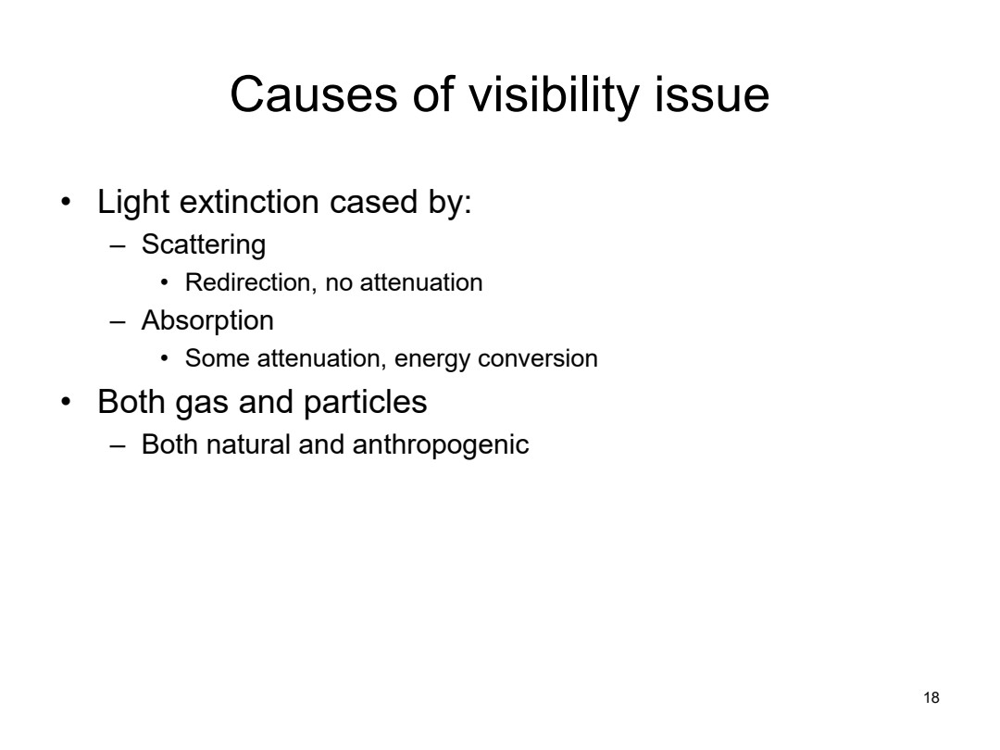

## PDF page 19

Source locator: `ENV5128-08-visability`, PDF p. 19. [Original PDF page](../../originals/5128/08_Visability.pdf#page=19).

Printed slide number candidate: 19 (use PDF page as canonical locator).

Generated navigation topics: Particles and aerosols, Climate and environmental effects

Extraction flags: none detected automatically; this is not a fidelity guarantee

### Extracted source text

> Causes of visibility issue
> 19
> • In clean air, visibility limited to about 300 ~ 400 
> kilometers due to air molecule (scattering)
> • Visibility depends on altitude due to density 
> (number concentration) of air molecules
> • RH has significant effects as hygroscopic 
> particles take up water 

### Original page appearance

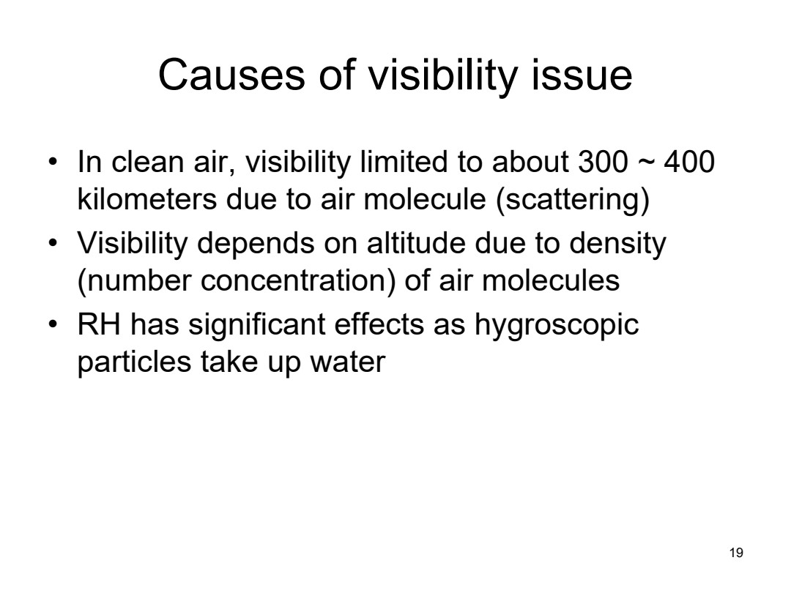

## PDF page 20

Source locator: `ENV5128-08-visability`, PDF p. 20. [Original PDF page](../../originals/5128/08_Visability.pdf#page=20).

Printed slide number candidate: 20 (use PDF page as canonical locator).

Generated navigation topics: Unclassified; inspect source.

Extraction flags: sparse-text

### Extracted source text

> The Solar Spectrum
> 20
>  
> Jacobson 2002

### Original page appearance

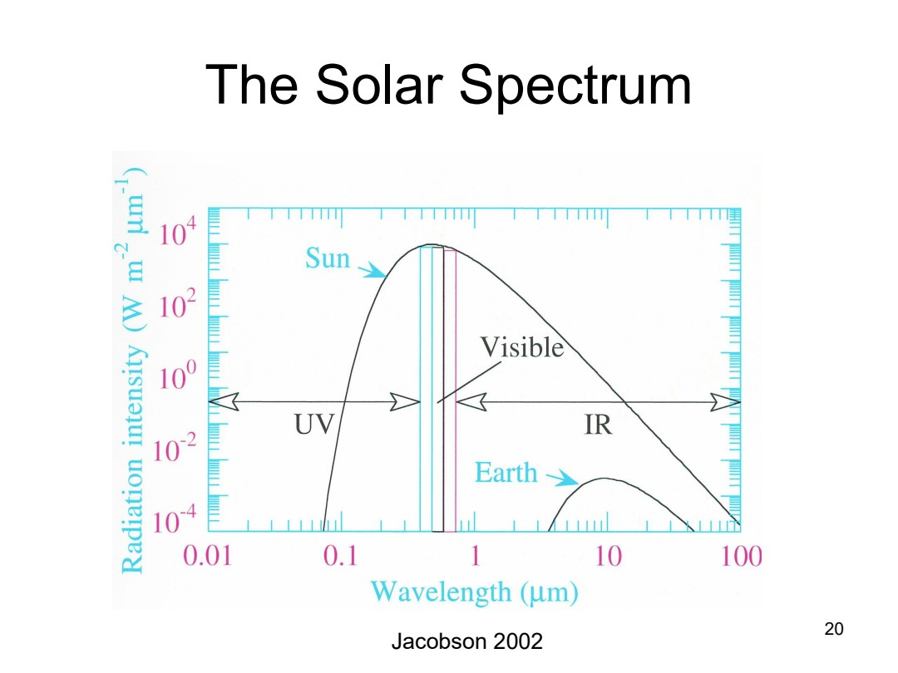

## PDF page 21

Source locator: `ENV5128-08-visability`, PDF p. 21. [Original PDF page](../../originals/5128/08_Visability.pdf#page=21).

Printed slide number candidate: 21 (use PDF page as canonical locator).

Generated navigation topics: Unclassified; inspect source.

Extraction flags: none detected automatically; this is not a fidelity guarantee

### Extracted source text

> UV and Visible Solar Spectrum
> 21
>  
> Jacobson 2002
> 0.38 – 0.5 m
> 0.5 – 0.6 m
> 0.6 – 0.75 m
> Human visual acuity 
> peaks at 0.55 m

### Original page appearance

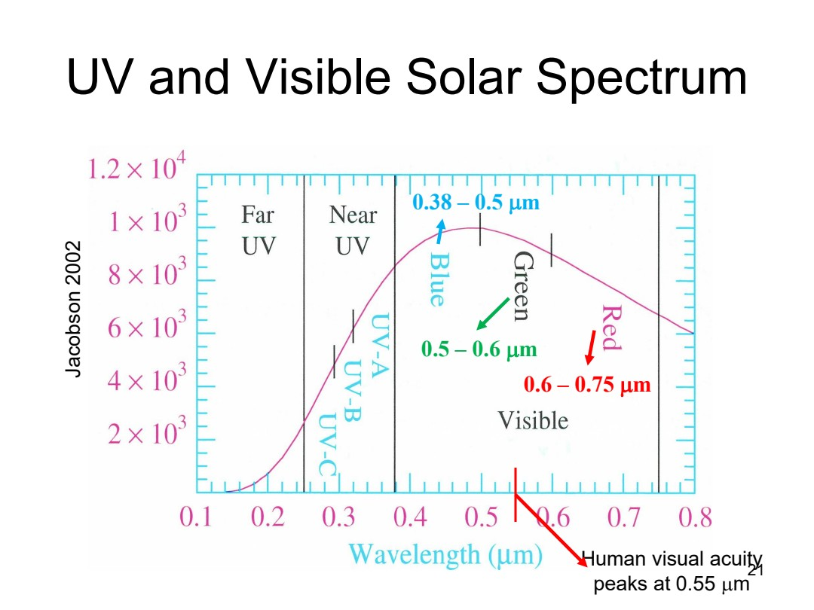

## PDF page 22

Source locator: `ENV5128-08-visability`, PDF p. 22. [Original PDF page](../../originals/5128/08_Visability.pdf#page=22).

Printed slide number candidate: 22 (use PDF page as canonical locator).

Generated navigation topics: Unclassified; inspect source.

Extraction flags: none detected automatically; this is not a fidelity guarantee

### Extracted source text

> Gas Scattering
> 22
>  Gas Scattering
>  Rayleigh Scattering (D/λ < 0.03)
> ◼ gas molecules ~ 0.00005 µm, visible light ~ 0.5 µm
>  All gas scatters
> ◼ N2, O2, Ar, H2O most important
>  Prefer short wavelength (toward blue → blue sky)

### Original page appearance

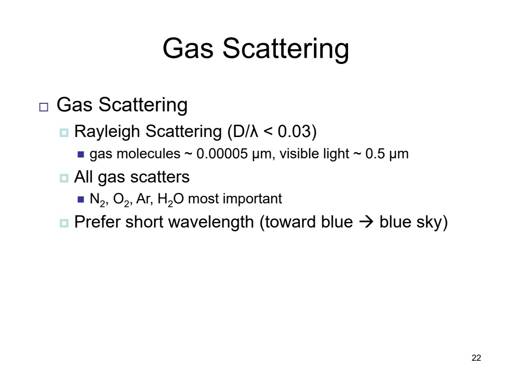

## PDF page 23

Source locator: `ENV5128-08-visability`, PDF p. 23. [Original PDF page](../../originals/5128/08_Visability.pdf#page=23).

Printed slide number candidate: 23 (use PDF page as canonical locator).

Generated navigation topics: Climate and environmental effects

Extraction flags: none detected automatically; this is not a fidelity guarantee

### Extracted source text

> Gas Absorption
> 23
>  Gas Absorption
>  Only a few gases absorb visible wavelength
>  NO2 (< 0.71 µm)
> ◼ Most important gas absorber, especially in polluted air
>  NO3 (< 0.67 µm)
> ◼ Quickly go away with presence of sunlight
> ◼ Not very important to visibility
>  O3 (<0.35 UV, 0.45-0.75 µm)
> ◼ Not very important to visibility since relatively weak absorber 
> for visible light

### Original page appearance

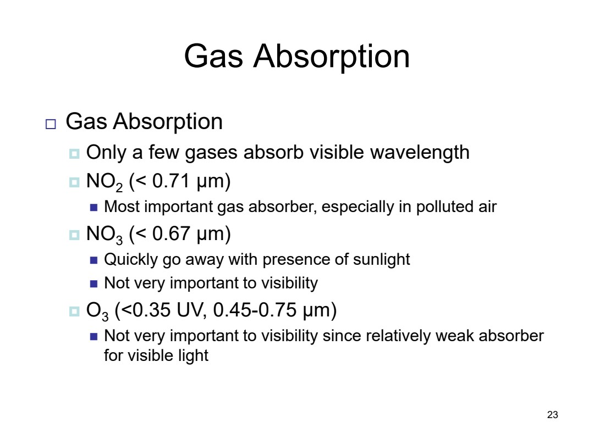

## PDF page 24

Source locator: `ENV5128-08-visability`, PDF p. 24. [Original PDF page](../../originals/5128/08_Visability.pdf#page=24).

Printed slide number candidate: 24 (use PDF page as canonical locator).

Generated navigation topics: Particles and aerosols

Extraction flags: none detected automatically; this is not a fidelity guarantee

### Extracted source text

> Particle Scattering
> 24
> • All particles scatter 
> • Angle of scattering depends on composition, 
> size, and shape of particle
> • Scattering is a combination of
> – Refraction
> – Reflection
> – Diffraction

### Original page appearance

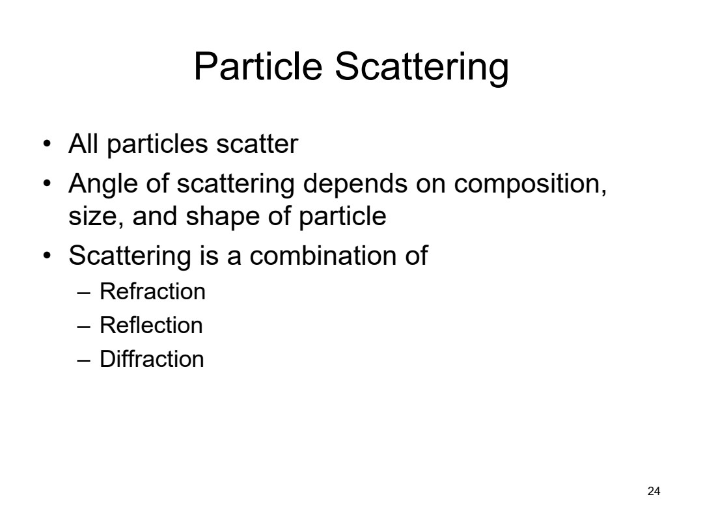

## PDF page 25

Source locator: `ENV5128-08-visability`, PDF p. 25. [Original PDF page](../../originals/5128/08_Visability.pdf#page=25).

Printed slide number candidate: 25 (use PDF page as canonical locator).

Generated navigation topics: Particles and aerosols

Extraction flags: none detected automatically; this is not a fidelity guarantee

### Extracted source text

> Particle Scattering
> 25
> Reflection
> i r
> i= r 
> Air
> Particle Higher density
> Lower density1
> 2
> Refraction Snell’s Law: n2sin= n1sin1
> n = real index of refraction
>     = cvacuum/ cmedium
> c = speed of light
>    = 3.0 x 108 m/s in vacuum
> Diffraction
> 21

### Original page appearance

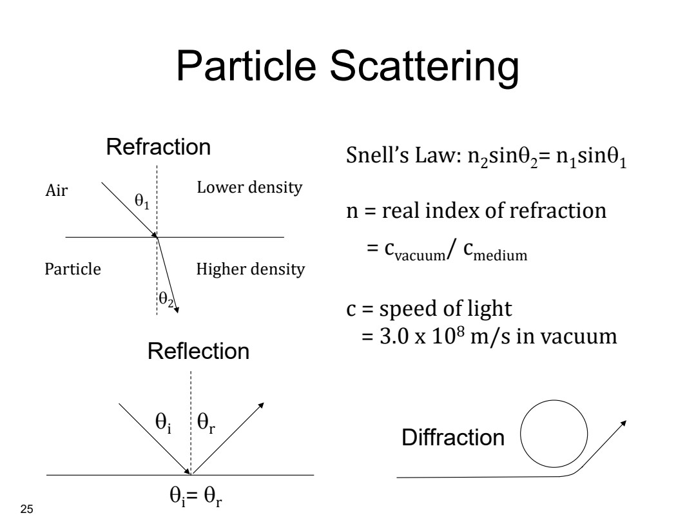

## PDF page 26

Source locator: `ENV5128-08-visability`, PDF p. 26. [Original PDF page](../../originals/5128/08_Visability.pdf#page=26).

Printed slide number candidate: not identified (use PDF page as canonical locator).

Generated navigation topics: Particles and aerosols

Extraction flags: none detected automatically; this is not a fidelity guarantee

### Extracted source text

> Particle Scattering
> 26Figure 7.16, Jacobson 2012
> A: reflected
> B: refracted
> C: diffracted
> D: refracted, reflected twice, then refracted
> E: refracted, reflected once, then refracted
> A   Sidescattering
> B
> C
> D Sidescattering
> E
> Backscattering
> Forward
> scattering

### Original page appearance

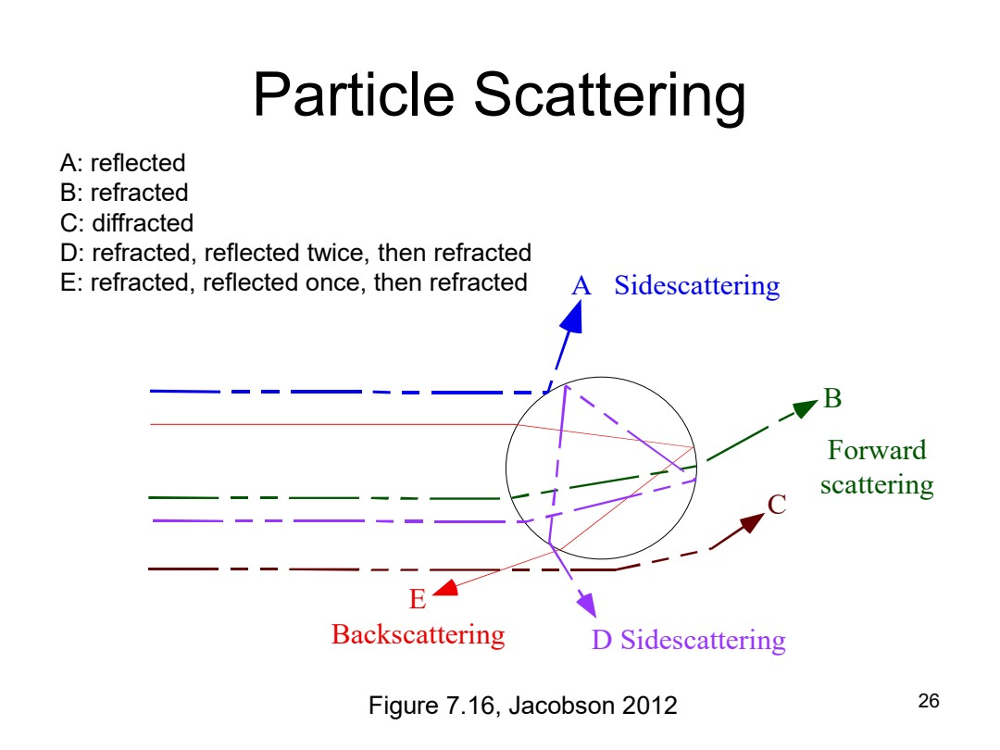

## PDF page 27

Source locator: `ENV5128-08-visability`, PDF p. 27. [Original PDF page](../../originals/5128/08_Visability.pdf#page=27).

Printed slide number candidate: not identified (use PDF page as canonical locator).

Generated navigation topics: Unclassified; inspect source.

Extraction flags: sparse-text

### Extracted source text

> Index of refraction
> Table 16.1, Hinds & Zhang 2021

### Original page appearance

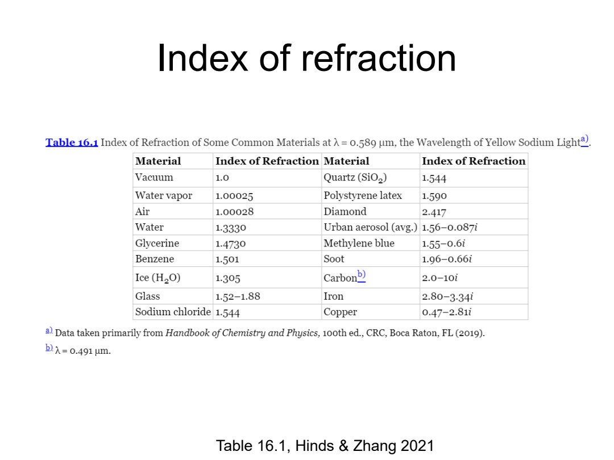

## PDF page 28

Source locator: `ENV5128-08-visability`, PDF p. 28. [Original PDF page](../../originals/5128/08_Visability.pdf#page=28).

Printed slide number candidate: 28 (use PDF page as canonical locator).

Generated navigation topics: Particles and aerosols

Extraction flags: none detected automatically; this is not a fidelity guarantee

### Extracted source text

> Particle Scattering
> 28
> • Real index of refraction varies for different 
> wavelengths of light
> • Particle in different size ranges scatter differently
> – Smaller than wavelength (D/λ < 0.03): Raleigh 
> scattering (forward and backward). Generally, for 
> particles < 0.05 µm
> – Same order as wavelength, 0.03 < D/λ < 32: Mie 
> scattering (preferentially forward)
> – More forward as particle size increases
> – Generally particle > 100 µm geometric scattering

### Original page appearance

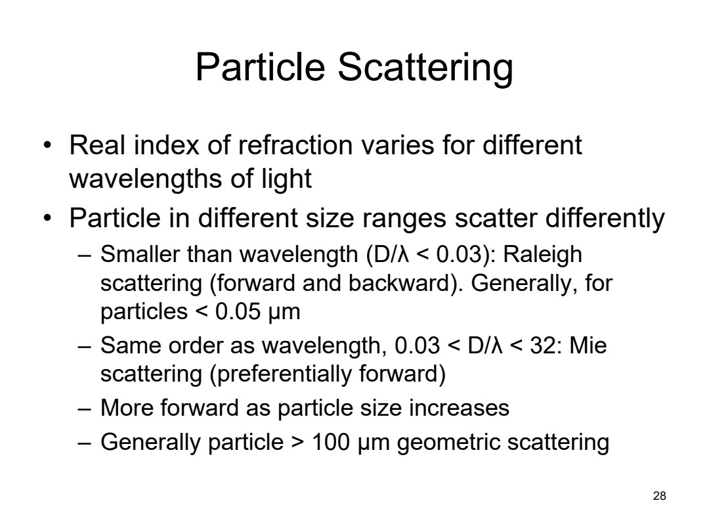

## PDF page 29

Source locator: `ENV5128-08-visability`, PDF p. 29. [Original PDF page](../../originals/5128/08_Visability.pdf#page=29).

Printed slide number candidate: 29 (use PDF page as canonical locator).

Generated navigation topics: Particles and aerosols

Extraction flags: sparse-text

### Extracted source text

> Particle Scattering
> 29
> Figure 5-1 Phalen

### Original page appearance

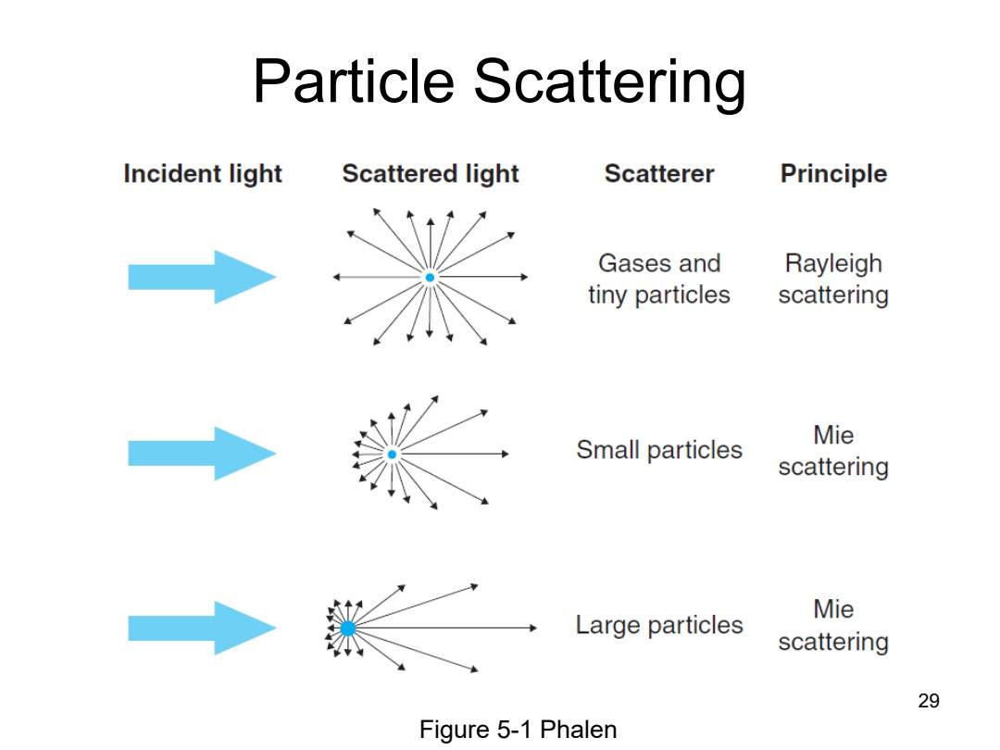

## PDF page 30

Source locator: `ENV5128-08-visability`, PDF p. 30. [Original PDF page](../../originals/5128/08_Visability.pdf#page=30).

Printed slide number candidate: not identified (use PDF page as canonical locator).

Generated navigation topics: Unclassified; inspect source.

Extraction flags: sparse-text

### Extracted source text

> Rayleigh Scattering 
> Figure 16.6, Hinds & Zhang 2021

### Original page appearance

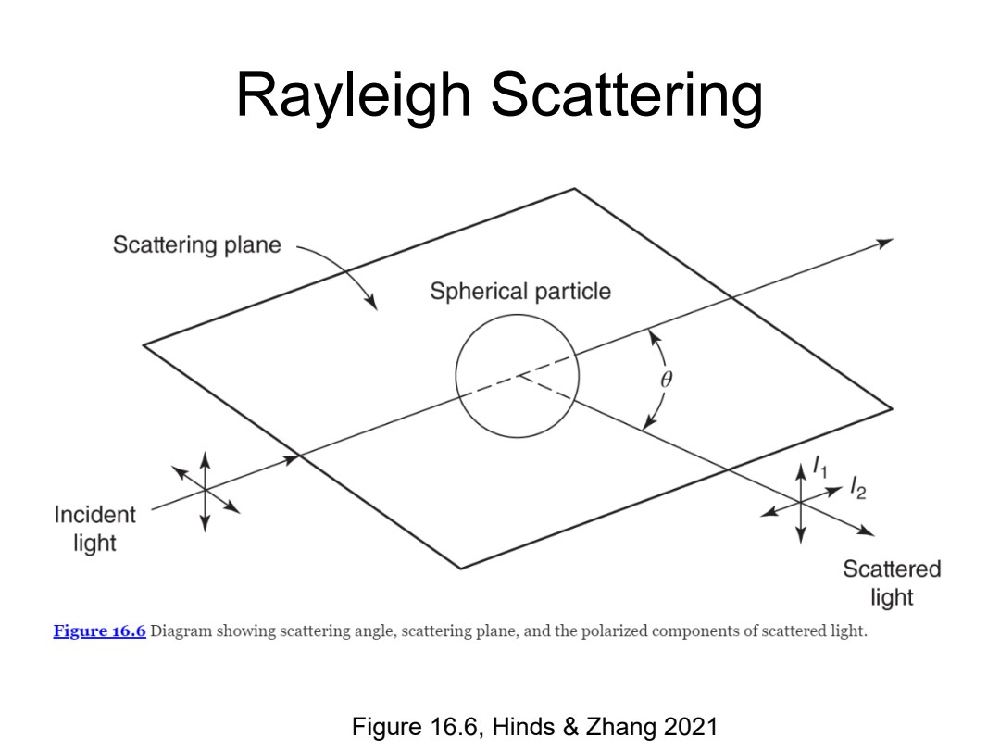

## PDF page 31

Source locator: `ENV5128-08-visability`, PDF p. 31. [Original PDF page](../../originals/5128/08_Visability.pdf#page=31).

Printed slide number candidate: not identified (use PDF page as canonical locator).

Generated navigation topics: Unclassified; inspect source.

Extraction flags: sparse-text

### Extracted source text

> Rayleigh Scattering 
> Figure 16.7, Hinds & Zhang 2021

### Original page appearance

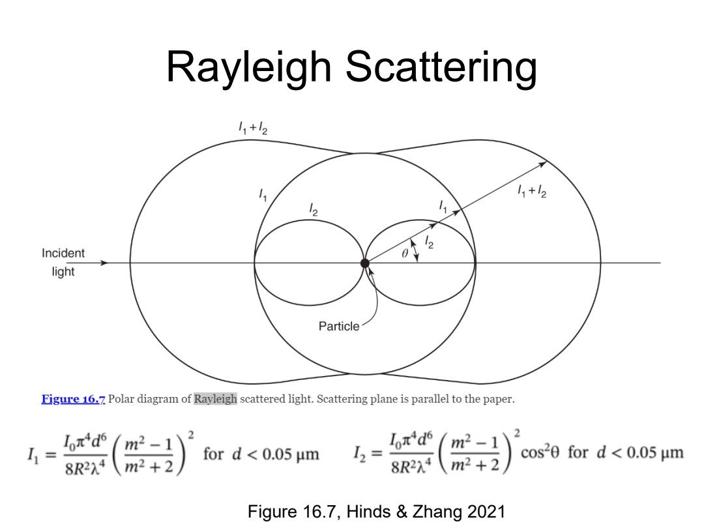

## PDF page 32

Source locator: `ENV5128-08-visability`, PDF p. 32. [Original PDF page](../../originals/5128/08_Visability.pdf#page=32).

Printed slide number candidate: not identified (use PDF page as canonical locator).

Generated navigation topics: Unclassified; inspect source.

Extraction flags: sparse-text

### Extracted source text

> Mie Scattering 
> Figure 16.2, Hinds & Zhang 2021

### Original page appearance

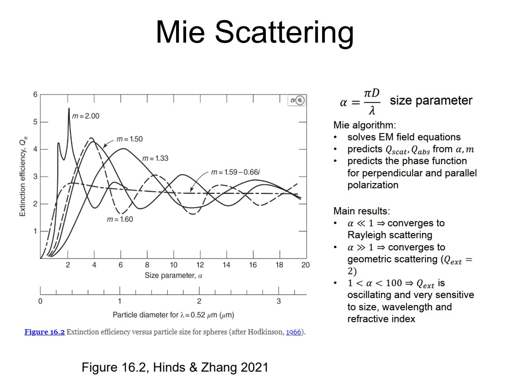

## PDF page 33

Source locator: `ENV5128-08-visability`, PDF p. 33. [Original PDF page](../../originals/5128/08_Visability.pdf#page=33).

Printed slide number candidate: not identified (use PDF page as canonical locator).

Generated navigation topics: Unclassified; inspect source.

Extraction flags: sparse-text

### Extracted source text

> Mie scattering diagram 

### Original page appearance

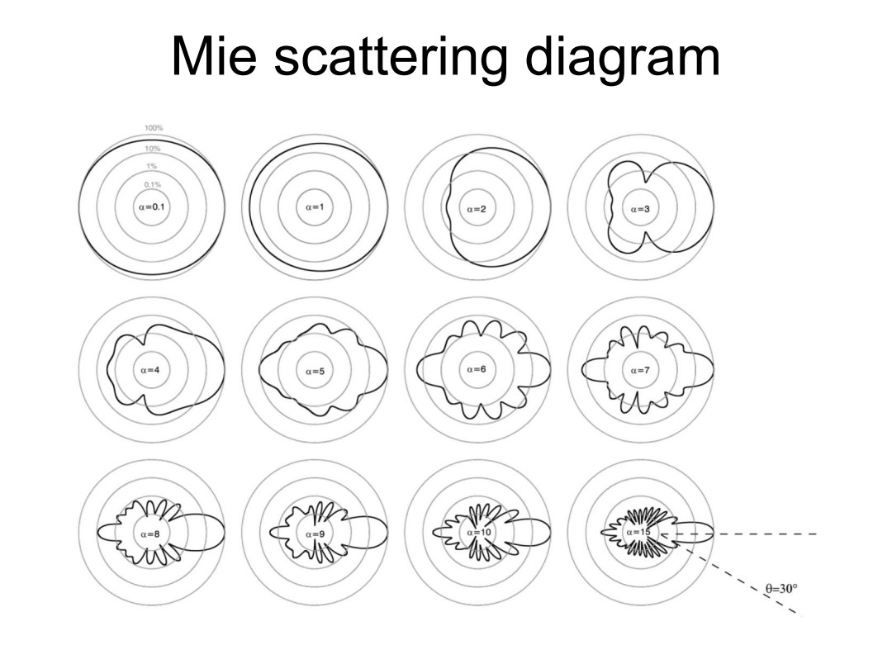

## PDF page 34

Source locator: `ENV5128-08-visability`, PDF p. 34. [Original PDF page](../../originals/5128/08_Visability.pdf#page=34).

Printed slide number candidate: 34 (use PDF page as canonical locator).

Generated navigation topics: Particles and aerosols

Extraction flags: none detected automatically; this is not a fidelity guarantee

### Extracted source text

> Particle Absorption
> 34
> • Particles are made up of different components
> – Each component absorbs differently
> – Characterized by their imaginary index of refraction k
> • Particles absorb preferentially at IR wavelengths
> – Cloud effects on surface heating

### Original page appearance

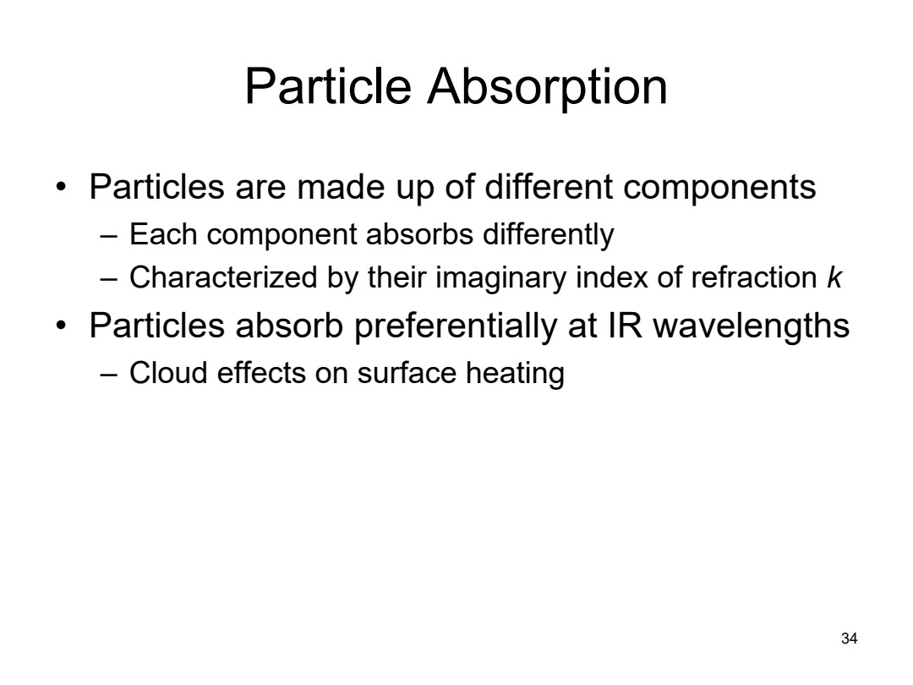

## PDF page 35

Source locator: `ENV5128-08-visability`, PDF p. 35. [Original PDF page](../../originals/5128/08_Visability.pdf#page=35).

Printed slide number candidate: 35 (use PDF page as canonical locator).

Generated navigation topics: Particles and aerosols

Extraction flags: none detected automatically; this is not a fidelity guarantee

### Extracted source text

> Particle Absorption
> 35
> • Only some components of particles absorb 
> visible wavelengths
> – Black/elemental carbon (C)
> • Most important absorber of all visible wavelengths
> – Brown/organic carbon
> – Hematite (Fe2O3)
> • In soil dust
> – Aluminum oxide (Al2O3)
> • In soil-dust and combustion particles
> – PAHs and nitrated aromatics
> • Absorb blue light preferentially

### Original page appearance

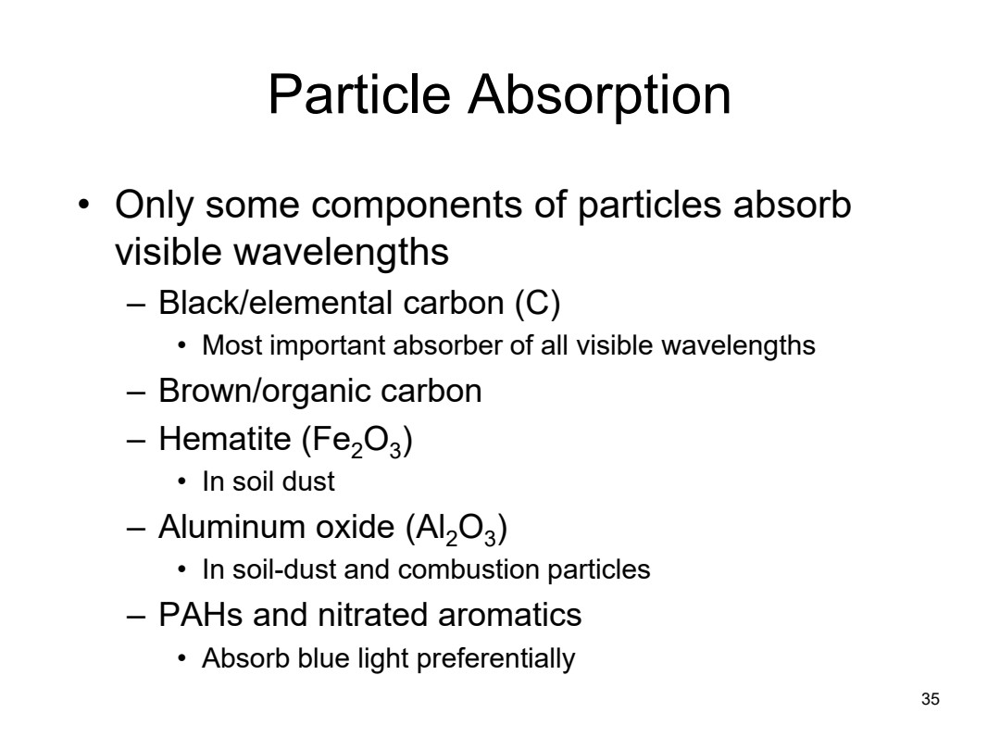

## PDF page 36

Source locator: `ENV5128-08-visability`, PDF p. 36. [Original PDF page](../../originals/5128/08_Visability.pdf#page=36).

Printed slide number candidate: 36 (use PDF page as canonical locator).

Generated navigation topics: Particles and aerosols

Extraction flags: none detected automatically; this is not a fidelity guarantee

### Extracted source text

> Ranks
> 36
> • Clean air:
> – Gas scattering (N2, O2, Ar, H2O) most important
> – The other three has similar effects
> • Polluted air:
> – Particle scattering (60%-95%)
> • H2O, SO4
> 2-, OC, NO3
> -
> – Particle absorption (5%-40%)
> • Black/elemental carbon
> – NO2 gas absorption (5%-40%)
> – Gas scattering

### Original page appearance

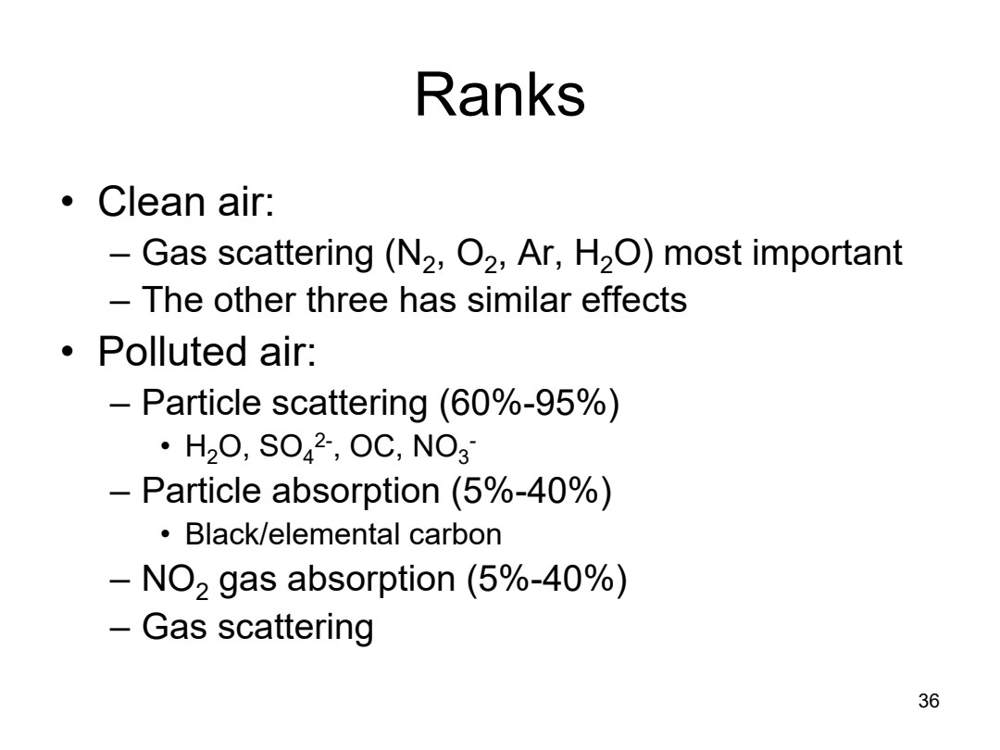

## PDF page 37

Source locator: `ENV5128-08-visability`, PDF p. 37. [Original PDF page](../../originals/5128/08_Visability.pdf#page=37).

Printed slide number candidate: 37 (use PDF page as canonical locator).

Generated navigation topics: Particles and aerosols

Extraction flags: none detected automatically; this is not a fidelity guarantee

### Extracted source text

> Total Extinction
> 37
> • Total Extinction:
> – The attenuation of incident light over a given distance 
> due to absorption and scattering
> • Total extinction coefficient
> – Sum of absorption and scattering by gases and 
> particles
> xCe −=
> , , , ,t a g s g a p s p    = + + +

### Original page appearance

## PDF page 38

Source locator: `ENV5128-08-visability`, PDF p. 38. [Original PDF page](../../originals/5128/08_Visability.pdf#page=38).

Printed slide number candidate: 38 (use PDF page as canonical locator).

Generated navigation topics: Unclassified; inspect source.

Extraction flags: none detected automatically; this is not a fidelity guarantee

### Extracted source text

> Total Extinction
> 38
> • Total extinction coefficient can be calculated based on 
> PM/gas concentrations (not required)
> • Can also be empirically estimated
> • A quick example from EPA-454/B-03-005:
>      t ~  (3)f(RH)[sulfate] + (3)f(RH)[nitrate]
>           +(4)[Organic carbon mass]
>           +(10)[black carbon]
>           +(1)[Soil] + (0.6)[Coarse mass] + 10

### Original page appearance

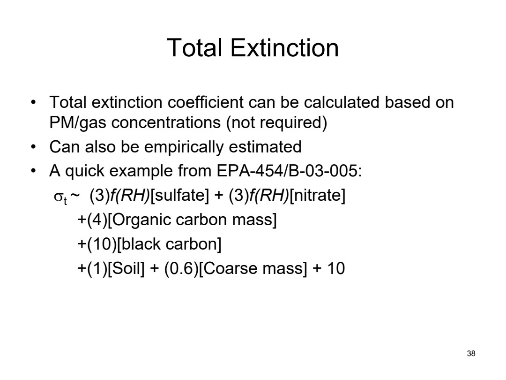

## PDF page 39

Source locator: `ENV5128-08-visability`, PDF p. 39. [Original PDF page](../../originals/5128/08_Visability.pdf#page=39).

Printed slide number candidate: 39 (use PDF page as canonical locator).

Generated navigation topics: Policy and management context

Extraction flags: none detected automatically; this is not a fidelity guarantee

### Extracted source text

> Total Extinction
> 39
> • Regulatory: unit for t is Mm-1
> – Inverse megameter (10-6 m-1)
> • t can varies from:
> – Clean air: 10 Mm-1
> – Very polluted 1000 Mm-1
> • Convert to km-1: 0.01 – 1 km-1
> • Deciview also used
> 𝑑𝑣 = 10 ln(𝜎𝑡/10)

### Original page appearance

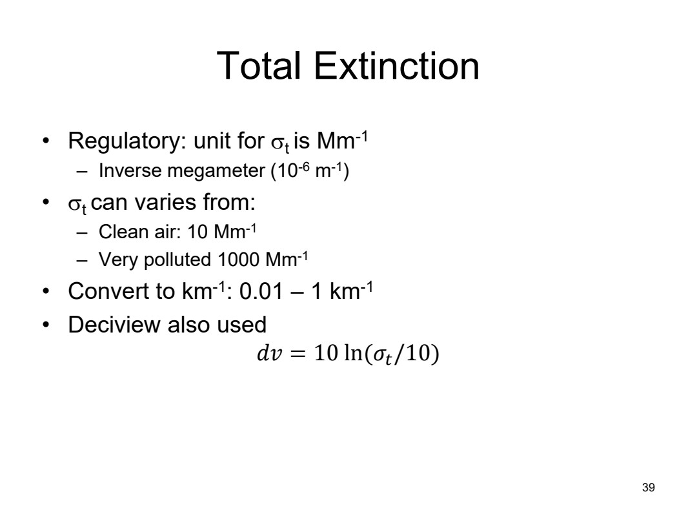

## PDF page 40

Source locator: `ENV5128-08-visability`, PDF p. 40. [Original PDF page](../../originals/5128/08_Visability.pdf#page=40).

Printed slide number candidate: 40 (use PDF page as canonical locator).

Generated navigation topics: Unclassified; inspect source.

Extraction flags: sparse-text

### Extracted source text

> Winter and Summer Maps of Light 
> Extinction
> 40
> Figure 7.24, Jacobson 2012

### Original page appearance

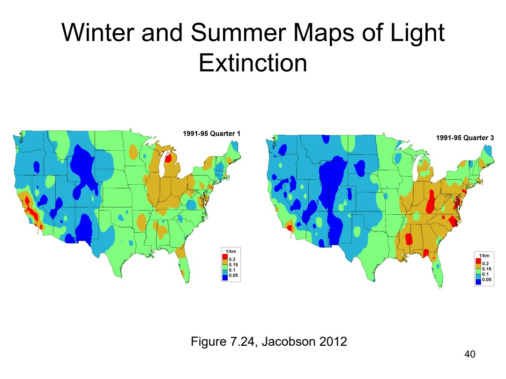
