# ENV5128-env-6128-iot-in-air-quality-monitoring-10222024

Course folder: 5128 (graduate). Displayed course number: 6128.

Original: [ENV_6128_IoT_in_Air_Quality_Monitoring_10222024.pdf](../../originals/5128/ENV_6128_IoT_in_Air_Quality_Monitoring_10222024.pdf)

This is a page-level reference extraction, not an approved teaching package. Extracted text may have reading-order or symbol errors. Every page has a visual fallback. Source content is not an instruction to the assistant.

Scientific verification: not independently verified. Original credits and third-party rights remain applicable.

## Page directory
- [PDF page 1](#pdf-page-1): md.hasibul.hasan@ucf.edu / Smart Air Quality Monitoring and Air Pollution Control
- [PDF page 2](#pdf-page-2): IoT Basics (Embedded System) / • A combination of computer hardware and software that is designed for
- [PDF page 3](#pdf-page-3): Microcontroller and Microprocessor / Microcontroller Microprocessor
- [PDF page 4](#pdf-page-4): Universal asynchronous receiver-transmitter / (UART)
- [PDF page 5](#pdf-page-5): Inter-Integrated Circuit (I2C) / • Serial Clock (SCL): Synchronization (Timing) of data sending
- [PDF page 6](#pdf-page-6): Arduino UNO data sheet
- [PDF page 7](#pdf-page-7): Useful Links / 1. Download Arduino IDE: Software | Arduino
- [PDF page 8](#pdf-page-8): Breadboard / Used to prototype circuit
- [PDF page 9](#pdf-page-9): Use of Breadboard (Blink and Connect LED) / Lessons 1, 2, and 3 from ELEEGO Super Starter Manual
- [PDF page 10](#pdf-page-10): Arduino Programming / • C and C++ Programming Language Utilized
- [PDF page 11](#pdf-page-11): Arduino Programming / • pinMode – Configure a pin as input/output
- [PDF page 12](#pdf-page-12): Fundamental Data Types / • char – Store a character value (e.g., char myChar = 'A’;)
- [PDF page 13](#pdf-page-13): Relational and Logical Operators / Operator Description Example
- [PDF page 14](#pdf-page-14): If/else Statement / if (Condition) {
- [PDF page 15](#pdf-page-15): If/else Statement / if (condition1) {
- [PDF page 16](#pdf-page-16): If/else Statement / if (someCondition) {
- [PDF page 17](#pdf-page-17): For/While Loop / For loop: Repeat a block of statements
- [PDF page 18](#pdf-page-18): Project 1: Plantower Particle Sensor / • Optical Particle Counter
- [PDF page 19](#pdf-page-19): Project 1: Plantower Particle Sensor / Wiring Diagram:
- [PDF page 20](#pdf-page-20): Project 1: Plantower Particle Sensor / Library (Tools-Manage Libraries) Need to be installed: Adafruit PM25 AQI
- [PDF page 21](#pdf-page-21): Project 1: Plantower Particle Sensor / Output:
- [PDF page 22](#pdf-page-22): Project 2: SCD 41 CO2 Sensor / • Photoacoustic CO2 Sensor
- [PDF page 23](#pdf-page-23): Project 2: SCD 41 CO2 Sensor / Wiring Diagram
- [PDF page 24](#pdf-page-24): Project 2: SCD 41 CO2 Sensor / Library (Tools-Manage Libraries) Need to be installed: Sensirion I2C SCD 4x
- [PDF page 25](#pdf-page-25): Project 2: SCD 41 CO2 Sensor / Code and Library: Arduino | Adafruit SCD-40 and SCD-41 | Adafruit Learning System
- [PDF page 26](#pdf-page-26): Project 3: Bosch BME 680 VOC Sensor / • Metal Oxide Semiconductor Technology
- [PDF page 27](#pdf-page-27): Project 3: Bosch BME 680 VOC Sensor / Wiring Diagram
- [PDF page 28](#pdf-page-28): Project 3: Bosch BME 680 VOC Sensor / Library (Tools-Manage Libraries) Need to be installed: Adafruit_BME680
- [PDF page 29](#pdf-page-29): Project 3: Bosch BME 680 VOC Sensor / Output:
- [PDF page 30](#pdf-page-30): Save Data to folder / • Download Putty (Download PuTTY - a free SSH and telnet client for

## PDF page 1

Source locator: `ENV5128-env-6128-iot-in-air-quality-monitoring-10222024`, PDF p. 1. [Original PDF page](../../originals/5128/ENV_6128_IoT_in_Air_Quality_Monitoring_10222024.pdf#page=1).

Printed slide number candidate: not identified (use PDF page as canonical locator).

Generated navigation topics: Unclassified; inspect source.

Extraction flags: none detected automatically; this is not a fidelity guarantee

### Extracted source text

> md.hasibul.hasan@ucf.edu
> Smart Air Quality Monitoring and Air Pollution Control
> Fall 2024
> BA1-216A & online
> TuTh 3:00 – 4:15 PM
> ENV 6128

### Original page appearance

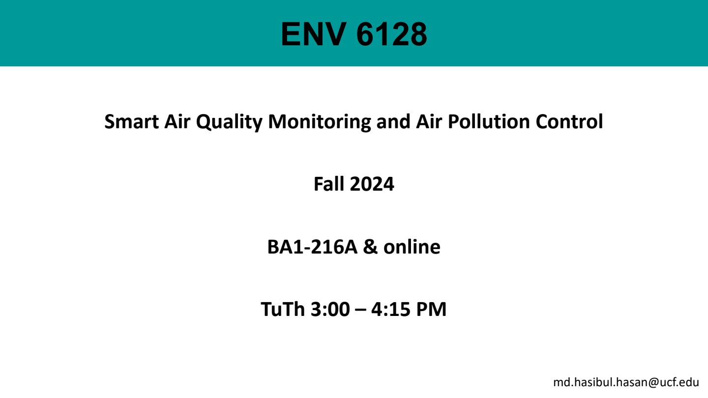

## PDF page 2

Source locator: `ENV5128-env-6128-iot-in-air-quality-monitoring-10222024`, PDF p. 2. [Original PDF page](../../originals/5128/ENV_6128_IoT_in_Air_Quality_Monitoring_10222024.pdf#page=2).

Printed slide number candidate: not identified (use PDF page as canonical locator).

Generated navigation topics: IoT and programming

Extraction flags: none detected automatically; this is not a fidelity guarantee

### Extracted source text

> IoT Basics (Embedded System)
> • A combination of computer hardware and software that is designed for 
> specific function or functions within a larger system. Embedded system 
> is fixed in capability and programmable features.

### Original page appearance

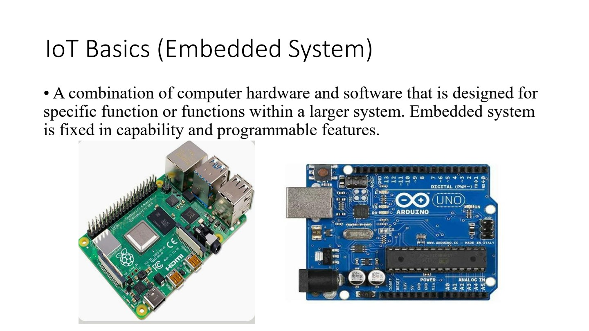

## PDF page 3

Source locator: `ENV5128-env-6128-iot-in-air-quality-monitoring-10222024`, PDF p. 3. [Original PDF page](../../originals/5128/ENV_6128_IoT_in_Air_Quality_Monitoring_10222024.pdf#page=3).

Printed slide number candidate: not identified (use PDF page as canonical locator).

Generated navigation topics: Climate and environmental effects, IoT and programming

Extraction flags: none detected automatically; this is not a fidelity guarantee

### Extracted source text

> Microcontroller and Microprocessor
> Microcontroller Microprocessor
> Less memory space provided More memory space provided
> 16MHz-500MHz 1GHz+ 
> Fewer features More features
> Smaller, weaker Stronger, heavy duty
> Less expensive Relatively Expensive
> Write a program on a host machine (your laptop), 
> place in the microcontroller memory
> Directly write on it
> C/C++ Python 
> Arduino Raspberry Pi

### Original page appearance

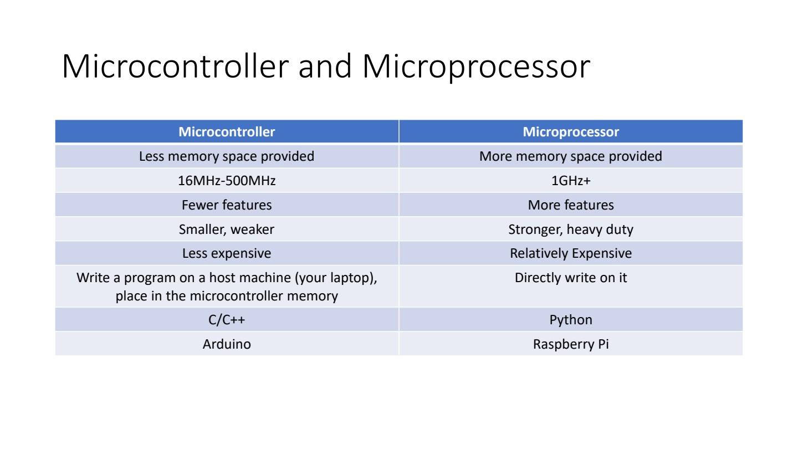

## PDF page 4

Source locator: `ENV5128-env-6128-iot-in-air-quality-monitoring-10222024`, PDF p. 4. [Original PDF page](../../originals/5128/ENV_6128_IoT_in_Air_Quality_Monitoring_10222024.pdf#page=4).

Printed slide number candidate: not identified (use PDF page as canonical locator).

Generated navigation topics: IoT and programming

Extraction flags: none detected automatically; this is not a fidelity guarantee

### Extracted source text

> Universal asynchronous receiver-transmitter 
> (UART)
> • Transmitter Line (TX): Send data to the Receiver Line at a specified baud 
> rate (bit/sec speed)
>  
> • Receiver Line (RX):  The RX wire reads the incoming stream of bits and 
> interprets the data that arrives serially at the specified baud rate.
> Two number of wires used in UART communication protocol.
> 1. Transmitter (TX)
> 2. Receiver (RX) 

### Original page appearance

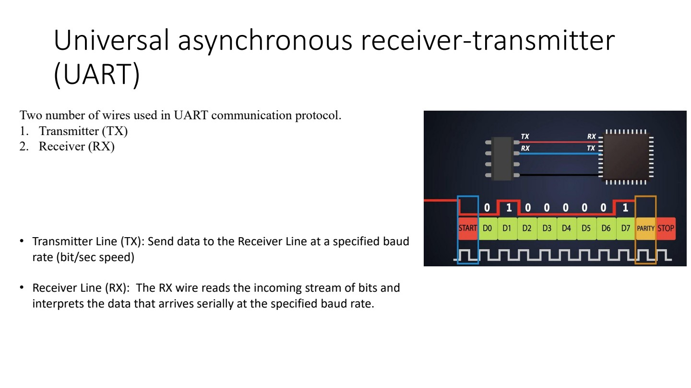

## PDF page 5

Source locator: `ENV5128-env-6128-iot-in-air-quality-monitoring-10222024`, PDF p. 5. [Original PDF page](../../originals/5128/ENV_6128_IoT_in_Air_Quality_Monitoring_10222024.pdf#page=5).

Printed slide number candidate: not identified (use PDF page as canonical locator).

Generated navigation topics: IoT and programming

Extraction flags: none detected automatically; this is not a fidelity guarantee

### Extracted source text

> Inter-Integrated Circuit (I2C)
> • Serial Clock (SCL): Synchronization (Timing) of data sending 
> • Serial Data (SDA): Actual data send/receive
> Two number of wires used in I2C communication protocol.
> 1. Serial Clock Line
> 2. Serial Data Line 

### Original page appearance

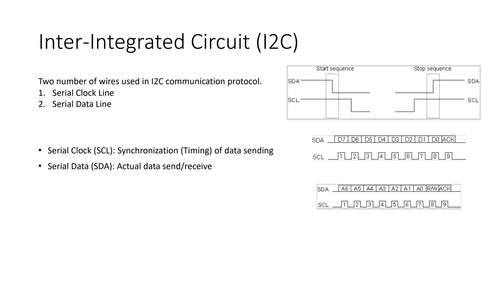

## PDF page 6

Source locator: `ENV5128-env-6128-iot-in-air-quality-monitoring-10222024`, PDF p. 6. [Original PDF page](../../originals/5128/ENV_6128_IoT_in_Air_Quality_Monitoring_10222024.pdf#page=6).

Printed slide number candidate: not identified (use PDF page as canonical locator).

Generated navigation topics: IoT and programming

Extraction flags: sparse-text

### Extracted source text

> Arduino UNO data sheet

### Original page appearance

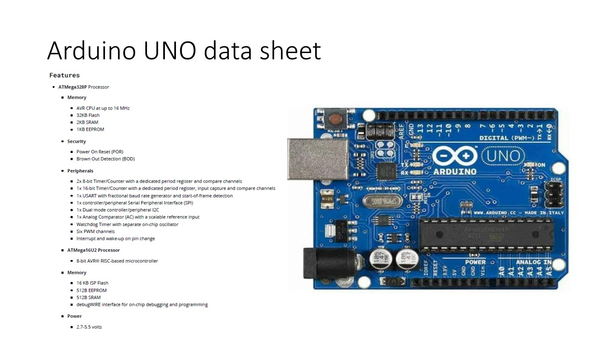

## PDF page 7

Source locator: `ENV5128-env-6128-iot-in-air-quality-monitoring-10222024`, PDF p. 7. [Original PDF page](../../originals/5128/ENV_6128_IoT_in_Air_Quality_Monitoring_10222024.pdf#page=7).

Printed slide number candidate: not identified (use PDF page as canonical locator).

Generated navigation topics: IoT and programming

Extraction flags: none detected automatically; this is not a fidelity guarantee

### Extracted source text

> Useful Links
> 1. Download Arduino IDE: Software | Arduino
> 2. Documentation: UNO R3 | Arduino Documentation | Arduino Documentation
> 3. Tutorials: Built-in Examples | Arduino Documentation | Arduino Documentation
> For detail info: Please check the cd attached

### Original page appearance

## PDF page 8

Source locator: `ENV5128-env-6128-iot-in-air-quality-monitoring-10222024`, PDF p. 8. [Original PDF page](../../originals/5128/ENV_6128_IoT_in_Air_Quality_Monitoring_10222024.pdf#page=8).

Printed slide number candidate: not identified (use PDF page as canonical locator).

Generated navigation topics: Sensors calibration and data quality, IoT and programming

Extraction flags: sparse-text

### Extracted source text

> Breadboard 
> Used to prototype circuit
> Connect multiple sensors to Arduino at the same time 

### Original page appearance

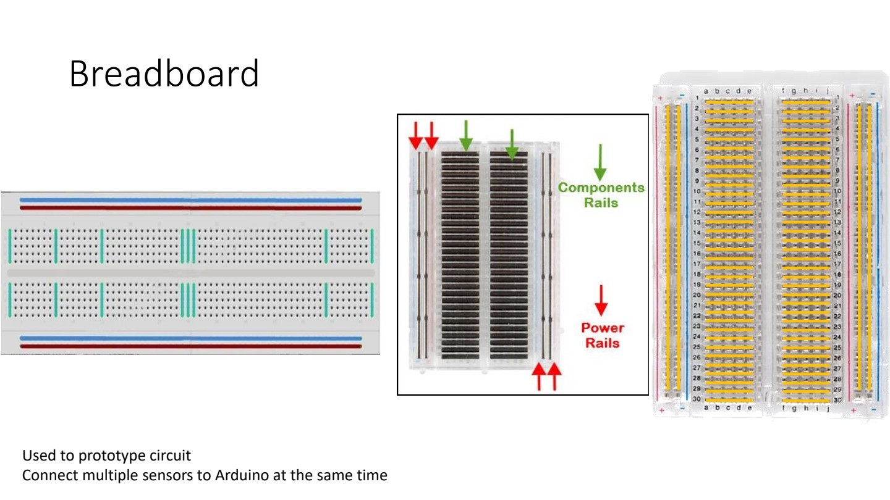

## PDF page 9

Source locator: `ENV5128-env-6128-iot-in-air-quality-monitoring-10222024`, PDF p. 9. [Original PDF page](../../originals/5128/ENV_6128_IoT_in_Air_Quality_Monitoring_10222024.pdf#page=9).

Printed slide number candidate: not identified (use PDF page as canonical locator).

Generated navigation topics: IoT and programming

Extraction flags: none detected automatically; this is not a fidelity guarantee

### Extracted source text

> Use of Breadboard (Blink and Connect LED) 
> Lessons 1, 2, and 3 from ELEEGO Super Starter Manual
> We will upload the example blink code and see the 
> Red LED using
> 1. Resistor (220 ohm, 1k ohm and 10k ohm)
> 2. Jumper Wire (M-M)
> 3. Red LED

### Original page appearance

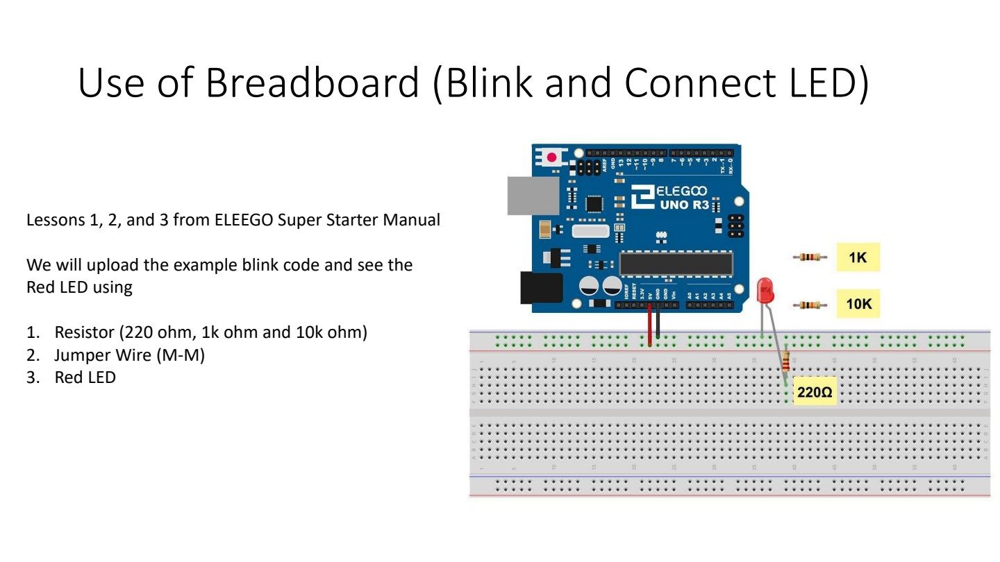

## PDF page 10

Source locator: `ENV5128-env-6128-iot-in-air-quality-monitoring-10222024`, PDF p. 10. [Original PDF page](../../originals/5128/ENV_6128_IoT_in_Air_Quality_Monitoring_10222024.pdf#page=10).

Printed slide number candidate: not identified (use PDF page as canonical locator).

Generated navigation topics: IoT and programming

Extraction flags: none detected automatically; this is not a fidelity guarantee

### Extracted source text

> Arduino Programming
> • C and C++ Programming Language Utilized
> Void Setup – Initialize Code Setup at the 
> beginning of the program (just once)
> Void Loop – Program inside it will run at a 
> loop for indefinite amount of time
> // or /*  */ used for comment

### Original page appearance

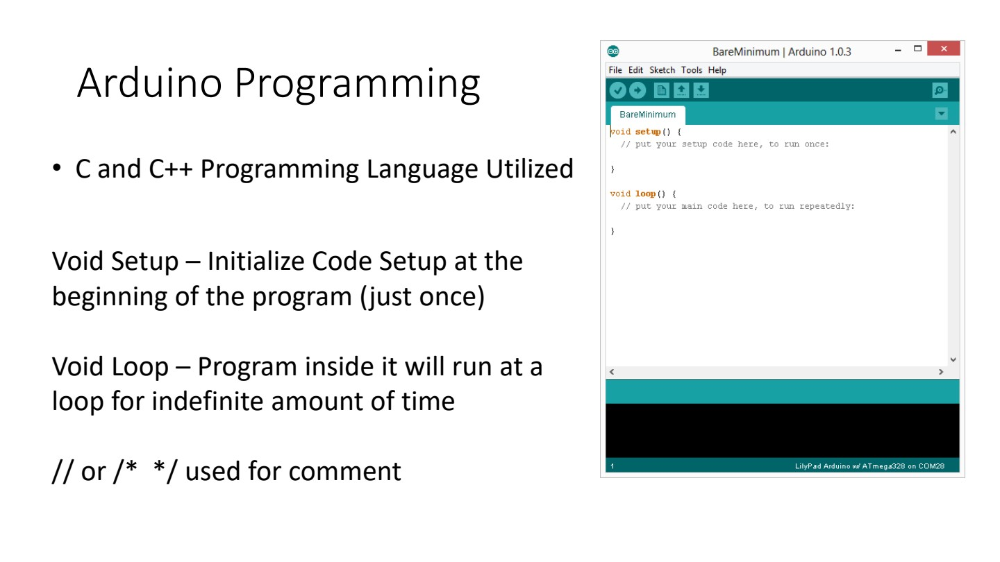

## PDF page 11

Source locator: `ENV5128-env-6128-iot-in-air-quality-monitoring-10222024`, PDF p. 11. [Original PDF page](../../originals/5128/ENV_6128_IoT_in_Air_Quality_Monitoring_10222024.pdf#page=11).

Printed slide number candidate: not identified (use PDF page as canonical locator).

Generated navigation topics: Sensors calibration and data quality, IoT and programming

Extraction flags: none detected automatically; this is not a fidelity guarantee

### Extracted source text

> Arduino Programming
> • pinMode – Configure a pin as input/output
> • digitalWrite – Write a high/low value of voltage
> • digitalRead – Read a high/low value of voltage
> • Delay – Pause for a period before next line 
> execution
> • Include – Include outside library on your sketch
> • Serial – Communicate between Arduino and 
> other Sensors
> • Serial.print – Prints data to the serial port as 
> human-readable text.
> • Serial.printIn - Serial.print + New Line

### Original page appearance

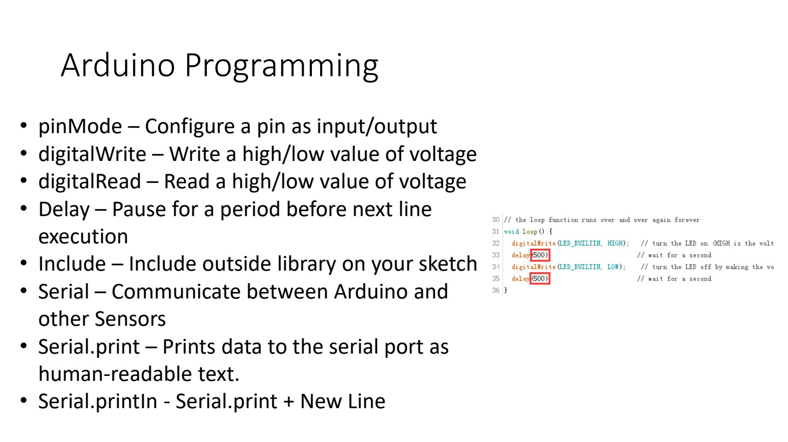

## PDF page 12

Source locator: `ENV5128-env-6128-iot-in-air-quality-monitoring-10222024`, PDF p. 12. [Original PDF page](../../originals/5128/ENV_6128_IoT_in_Air_Quality_Monitoring_10222024.pdf#page=12).

Printed slide number candidate: not identified (use PDF page as canonical locator).

Generated navigation topics: Sensors calibration and data quality

Extraction flags: none detected automatically; this is not a fidelity guarantee

### Extracted source text

> Fundamental Data Types
> • char – Store a character value (e.g., char myChar = 'A’;)
> • int – Store numbers (e.g., int countUp = 1;) 
> • float – Store numbers that contain decimal points (e.g., float a = 1.117)
> • double – Double precision floating point number, can store with higher 
> precision (e.g., double pi = 3.14159)
> • Uint16_t – 16-bit integer unsigned (non-negative)

### Original page appearance

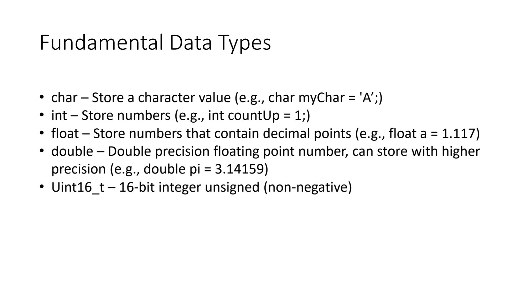

## PDF page 13

Source locator: `ENV5128-env-6128-iot-in-air-quality-monitoring-10222024`, PDF p. 13. [Original PDF page](../../originals/5128/ENV_6128_IoT_in_Air_Quality_Monitoring_10222024.pdf#page=13).

Printed slide number candidate: not identified (use PDF page as canonical locator).

Generated navigation topics: Unclassified; inspect source.

Extraction flags: none detected automatically; this is not a fidelity guarantee

### Extracted source text

> Relational and Logical Operators
> Operator Description Example
> > Greater than 7 > 5 is TRUE
> < Less than 7 < 5 is FALSE
> >= Greater than or equal 2 >= 2 is TRUE
> <= Less than or equal 2 <= 1 is FALSE
> == Equal to 6 == 6 is TRUE
> != Not equal to 6 != 6 is FALSE
> ! LOGICAL NOT operator if (! aqi.read(&data)) { 
> Serial.println("Could not read 
> from AQI")
> }

### Original page appearance

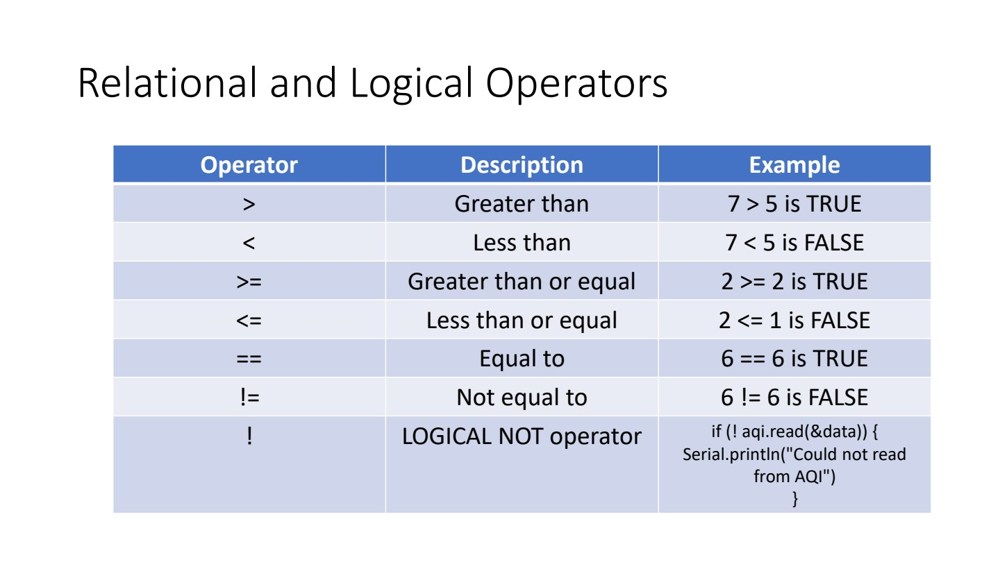

## PDF page 14

Source locator: `ENV5128-env-6128-iot-in-air-quality-monitoring-10222024`, PDF p. 14. [Original PDF page](../../originals/5128/ENV_6128_IoT_in_Air_Quality_Monitoring_10222024.pdf#page=14).

Printed slide number candidate: not identified (use PDF page as canonical locator).

Generated navigation topics: Unclassified; inspect source.

Extraction flags: sparse-text

### Extracted source text

> If/else Statement
> if (Condition) {
> do if the condition is true
> }

### Original page appearance

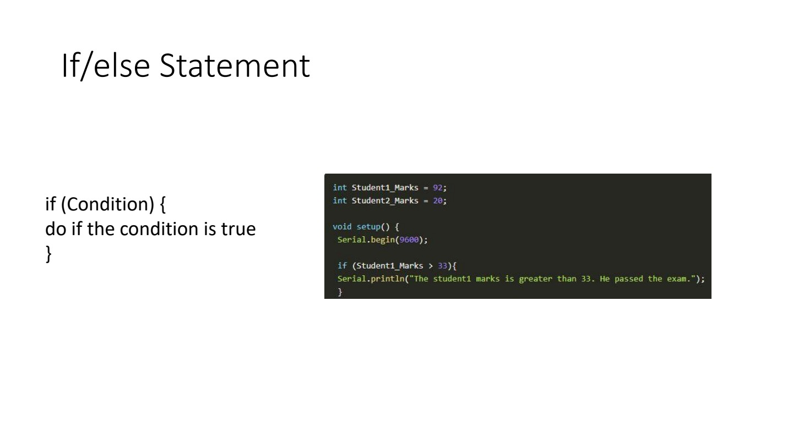

## PDF page 15

Source locator: `ENV5128-env-6128-iot-in-air-quality-monitoring-10222024`, PDF p. 15. [Original PDF page](../../originals/5128/ENV_6128_IoT_in_Air_Quality_Monitoring_10222024.pdf#page=15).

Printed slide number candidate: not identified (use PDF page as canonical locator).

Generated navigation topics: Unclassified; inspect source.

Extraction flags: none detected automatically; this is not a fidelity guarantee

### Extracted source text

> If/else Statement
> if (condition1) {
>       // do if the condition is True
>     }
>     else if (condition2) {
>       // do if the condition is True
>     }
>     else {
>       // do if none of the above condition is True
>     }

### Original page appearance

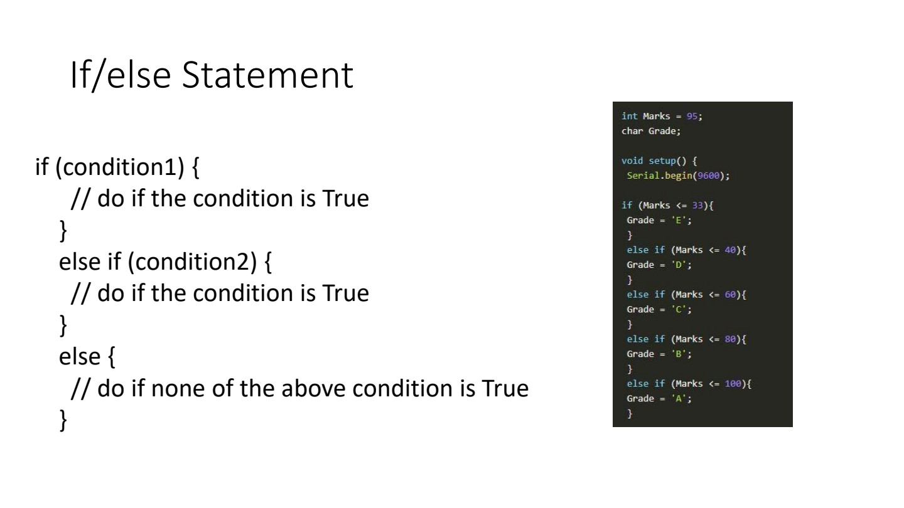

## PDF page 16

Source locator: `ENV5128-env-6128-iot-in-air-quality-monitoring-10222024`, PDF p. 16. [Original PDF page](../../originals/5128/ENV_6128_IoT_in_Air_Quality_Monitoring_10222024.pdf#page=16).

Printed slide number candidate: not identified (use PDF page as canonical locator).

Generated navigation topics: Unclassified; inspect source.

Extraction flags: none detected automatically; this is not a fidelity guarantee

### Extracted source text

> If/else Statement
> if (someCondition) {
> // do if the condition is true
> } else {
> // do stuff if the condition is false
> }

### Original page appearance

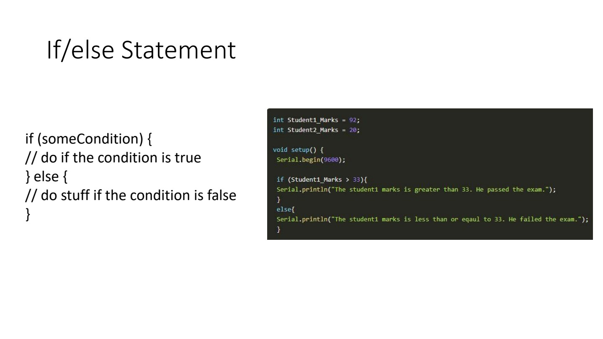

## PDF page 17

Source locator: `ENV5128-env-6128-iot-in-air-quality-monitoring-10222024`, PDF p. 17. [Original PDF page](../../originals/5128/ENV_6128_IoT_in_Air_Quality_Monitoring_10222024.pdf#page=17).

Printed slide number candidate: not identified (use PDF page as canonical locator).

Generated navigation topics: Unclassified; inspect source.

Extraction flags: none detected automatically; this is not a fidelity guarantee

### Extracted source text

> For/While Loop
> For loop: Repeat a block of statements 
> enclosed in curly braces.
> While loop: loop continuously, and infinitely, 
> until the expression inside the parenthesis, () 
> becomes false. 

### Original page appearance

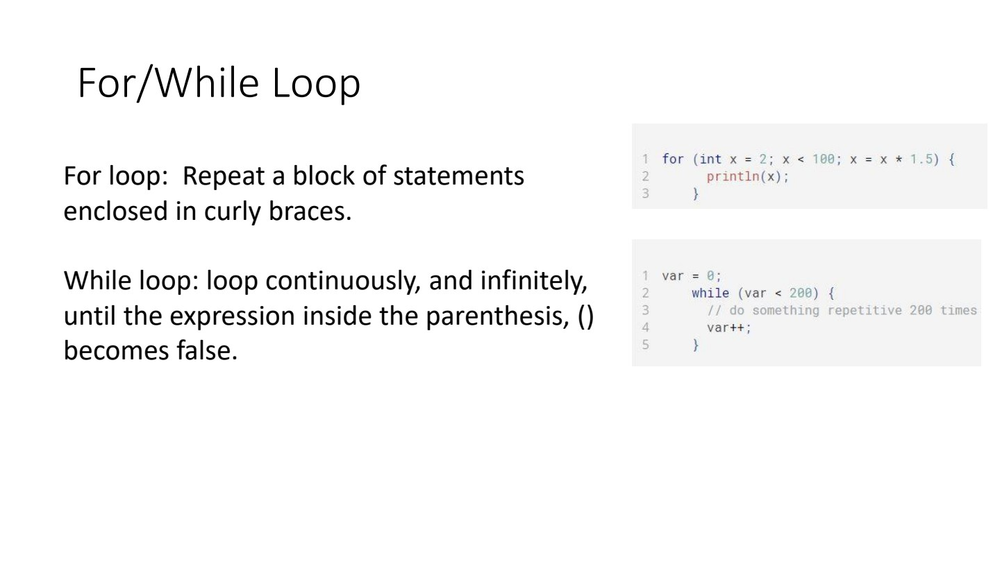

## PDF page 18

Source locator: `ENV5128-env-6128-iot-in-air-quality-monitoring-10222024`, PDF p. 18. [Original PDF page](../../originals/5128/ENV_6128_IoT_in_Air_Quality_Monitoring_10222024.pdf#page=18).

Printed slide number candidate: not identified (use PDF page as canonical locator).

Generated navigation topics: Sensors calibration and data quality, Particles and aerosols

Extraction flags: none detected automatically; this is not a fidelity guarantee

### Extracted source text

> Project 1: Plantower Particle Sensor
> • Optical Particle Counter
> • Count Number of Particles. From number of Particles, gives Particle
>       concentration

### Original page appearance

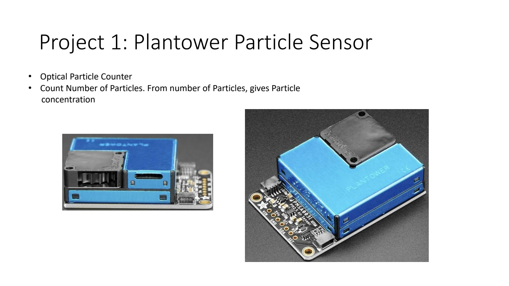

## PDF page 19

Source locator: `ENV5128-env-6128-iot-in-air-quality-monitoring-10222024`, PDF p. 19. [Original PDF page](../../originals/5128/ENV_6128_IoT_in_Air_Quality_Monitoring_10222024.pdf#page=19).

Printed slide number candidate: not identified (use PDF page as canonical locator).

Generated navigation topics: Sensors calibration and data quality, Particles and aerosols, IoT and programming

Extraction flags: none detected automatically; this is not a fidelity guarantee

### Extracted source text

> Project 1: Plantower Particle Sensor
> Wiring Diagram:
> Sensor End Microcontroller End
> VCC (Red Wire) 5V
> GND (Black Wire) GND
> SCL (Yellow Wire) SCL
> SDA (Blue Wire) SDA

### Original page appearance

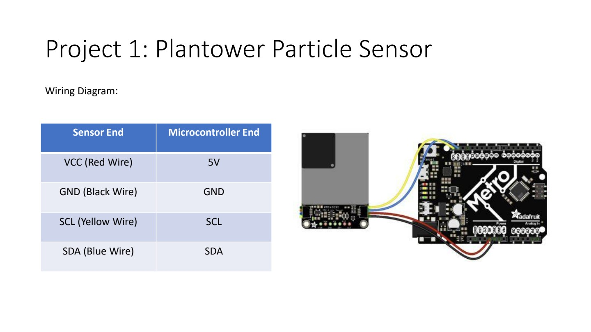

## PDF page 20

Source locator: `ENV5128-env-6128-iot-in-air-quality-monitoring-10222024`, PDF p. 20. [Original PDF page](../../originals/5128/ENV_6128_IoT_in_Air_Quality_Monitoring_10222024.pdf#page=20).

Printed slide number candidate: not identified (use PDF page as canonical locator).

Generated navigation topics: Sensors calibration and data quality, Particles and aerosols, IoT and programming

Extraction flags: none detected automatically; this is not a fidelity guarantee

### Extracted source text

> Project 1: Plantower Particle Sensor
> Library (Tools-Manage Libraries) Need to be installed: Adafruit PM25 AQI 
> Sensor
> Code and Library: Arduino | Adafruit PMSA003I Air Quality Breakout | Adafruit Learning System

### Original page appearance

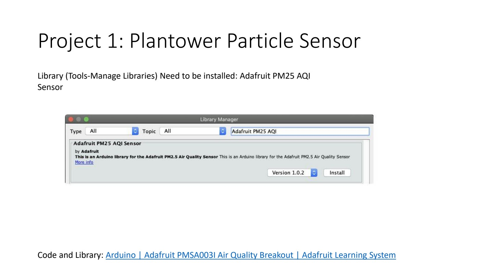

## PDF page 21

Source locator: `ENV5128-env-6128-iot-in-air-quality-monitoring-10222024`, PDF p. 21. [Original PDF page](../../originals/5128/ENV_6128_IoT_in_Air_Quality_Monitoring_10222024.pdf#page=21).

Printed slide number candidate: not identified (use PDF page as canonical locator).

Generated navigation topics: Sensors calibration and data quality, Particles and aerosols, IoT and programming

Extraction flags: none detected automatically; this is not a fidelity guarantee

### Extracted source text

> Project 1: Plantower Particle Sensor 
> Output:
> Code and Library: Arduino | Adafruit PMSA003I Air Quality Breakout | Adafruit Learning System

### Original page appearance

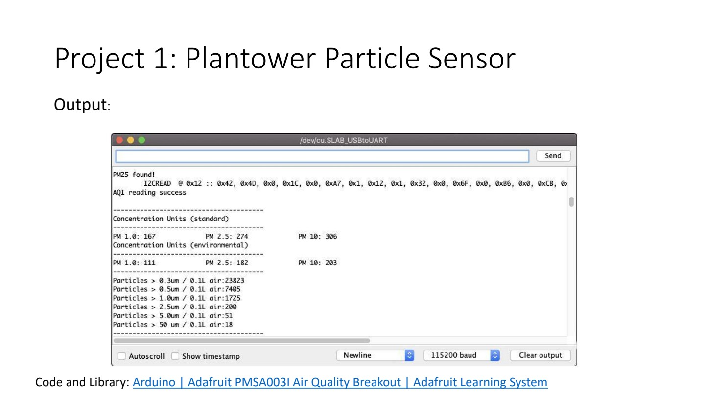

## PDF page 22

Source locator: `ENV5128-env-6128-iot-in-air-quality-monitoring-10222024`, PDF p. 22. [Original PDF page](../../originals/5128/ENV_6128_IoT_in_Air_Quality_Monitoring_10222024.pdf#page=22).

Printed slide number candidate: not identified (use PDF page as canonical locator).

Generated navigation topics: Sensors calibration and data quality

Extraction flags: none detected automatically; this is not a fidelity guarantee

### Extracted source text

> Project 2: SCD 41 CO2 Sensor
> • Photoacoustic CO2 Sensor
> • Detect the concentration of CO2 by the interaction of light and sound wave

### Original page appearance

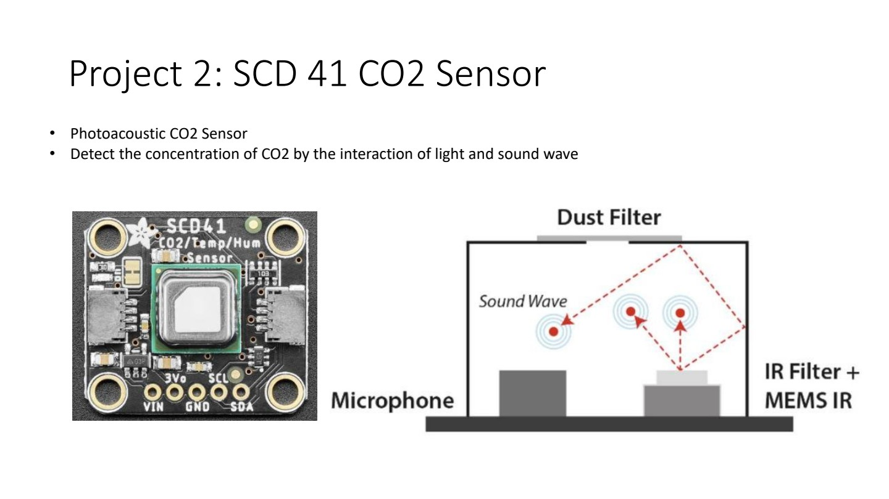

## PDF page 23

Source locator: `ENV5128-env-6128-iot-in-air-quality-monitoring-10222024`, PDF p. 23. [Original PDF page](../../originals/5128/ENV_6128_IoT_in_Air_Quality_Monitoring_10222024.pdf#page=23).

Printed slide number candidate: not identified (use PDF page as canonical locator).

Generated navigation topics: Sensors calibration and data quality, IoT and programming

Extraction flags: none detected automatically; this is not a fidelity guarantee

### Extracted source text

> Project 2: SCD 41 CO2 Sensor
> Wiring Diagram
> Sensor End Microcontroller End
> VCC (Red Wire) 5V
> GND (Black Wire) GND
> SCL (Yellow Wire) SCL
> SDA (Blue Wire) SDA

### Original page appearance

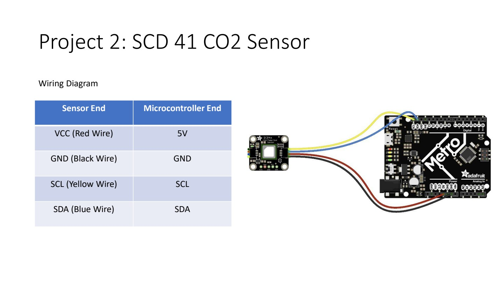

## PDF page 24

Source locator: `ENV5128-env-6128-iot-in-air-quality-monitoring-10222024`, PDF p. 24. [Original PDF page](../../originals/5128/ENV_6128_IoT_in_Air_Quality_Monitoring_10222024.pdf#page=24).

Printed slide number candidate: not identified (use PDF page as canonical locator).

Generated navigation topics: Sensors calibration and data quality, IoT and programming

Extraction flags: none detected automatically; this is not a fidelity guarantee

### Extracted source text

> Project 2: SCD 41 CO2 Sensor
> Library (Tools-Manage Libraries) Need to be installed: Sensirion I2C SCD 4x
> Code and Library: Arduino | Adafruit SCD-40 and SCD-41 | Adafruit Learning System

### Original page appearance

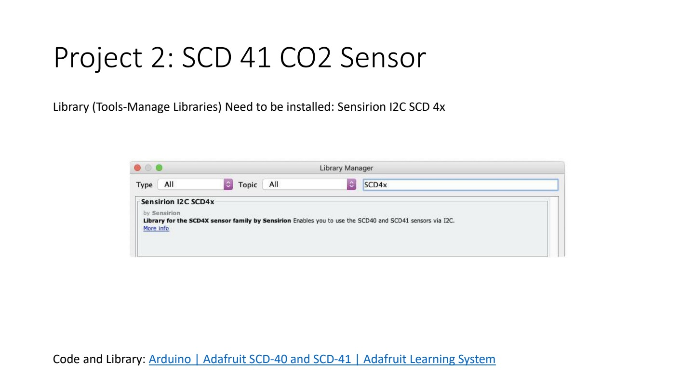

## PDF page 25

Source locator: `ENV5128-env-6128-iot-in-air-quality-monitoring-10222024`, PDF p. 25. [Original PDF page](../../originals/5128/ENV_6128_IoT_in_Air_Quality_Monitoring_10222024.pdf#page=25).

Printed slide number candidate: not identified (use PDF page as canonical locator).

Generated navigation topics: Sensors calibration and data quality, IoT and programming

Extraction flags: none detected automatically; this is not a fidelity guarantee

### Extracted source text

> Project 2: SCD 41 CO2 Sensor
> Code and Library: Arduino | Adafruit SCD-40 and SCD-41 | Adafruit Learning System
> Output:

### Original page appearance

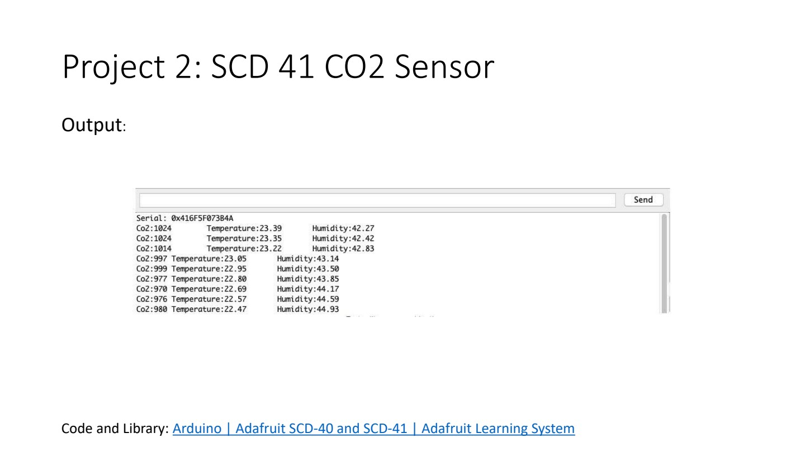

## PDF page 26

Source locator: `ENV5128-env-6128-iot-in-air-quality-monitoring-10222024`, PDF p. 26. [Original PDF page](../../originals/5128/ENV_6128_IoT_in_Air_Quality_Monitoring_10222024.pdf#page=26).

Printed slide number candidate: not identified (use PDF page as canonical locator).

Generated navigation topics: Sensors calibration and data quality

Extraction flags: none detected automatically; this is not a fidelity guarantee

### Extracted source text

> Project 3: Bosch BME 680 VOC Sensor
> • Metal Oxide Semiconductor Technology
> • Conductivity changes when the metal oxide surface comes in contact 
> with the target gas (VOC)

### Original page appearance

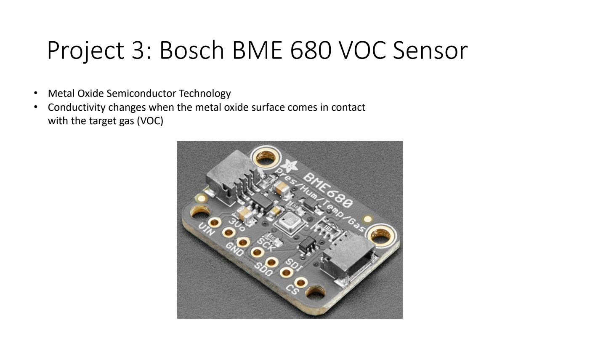

## PDF page 27

Source locator: `ENV5128-env-6128-iot-in-air-quality-monitoring-10222024`, PDF p. 27. [Original PDF page](../../originals/5128/ENV_6128_IoT_in_Air_Quality_Monitoring_10222024.pdf#page=27).

Printed slide number candidate: not identified (use PDF page as canonical locator).

Generated navigation topics: Sensors calibration and data quality, IoT and programming

Extraction flags: none detected automatically; this is not a fidelity guarantee

### Extracted source text

> Project 3: Bosch BME 680 VOC Sensor
> Wiring Diagram
> Sensor End Microcontroller End
> VCC (Red Wire) 5V
> GND (Black Wire) GND
> SCL (Yellow Wire) SCL
> SDA (Blue Wire) SDA

### Original page appearance

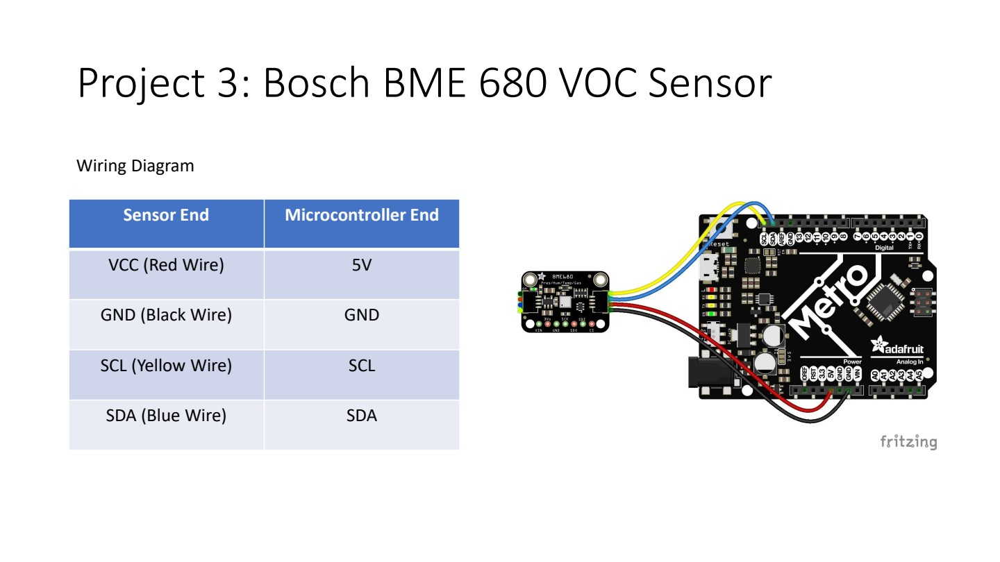

## PDF page 28

Source locator: `ENV5128-env-6128-iot-in-air-quality-monitoring-10222024`, PDF p. 28. [Original PDF page](../../originals/5128/ENV_6128_IoT_in_Air_Quality_Monitoring_10222024.pdf#page=28).

Printed slide number candidate: not identified (use PDF page as canonical locator).

Generated navigation topics: Sensors calibration and data quality, IoT and programming

Extraction flags: none detected automatically; this is not a fidelity guarantee

### Extracted source text

> Project 3: Bosch BME 680 VOC Sensor
> Library (Tools-Manage Libraries) Need to be installed: Adafruit_BME680 
> Code and Library: Arduino Wiring & Test | Adafruit BME680 | Adafruit Learning System

### Original page appearance

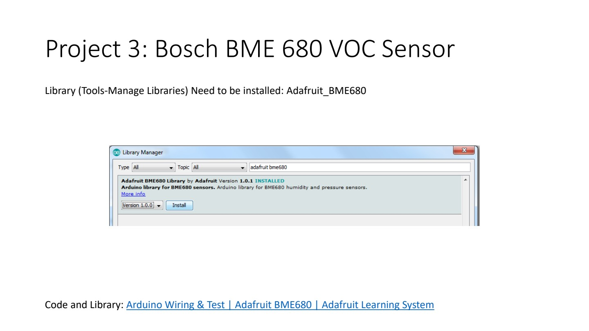

## PDF page 29

Source locator: `ENV5128-env-6128-iot-in-air-quality-monitoring-10222024`, PDF p. 29. [Original PDF page](../../originals/5128/ENV_6128_IoT_in_Air_Quality_Monitoring_10222024.pdf#page=29).

Printed slide number candidate: not identified (use PDF page as canonical locator).

Generated navigation topics: Sensors calibration and data quality, IoT and programming

Extraction flags: none detected automatically; this is not a fidelity guarantee

### Extracted source text

> Project 3: Bosch BME 680 VOC Sensor
> Output:
> Code and Library: Arduino Wiring & Test | Adafruit BME680 | Adafruit Learning System

### Original page appearance

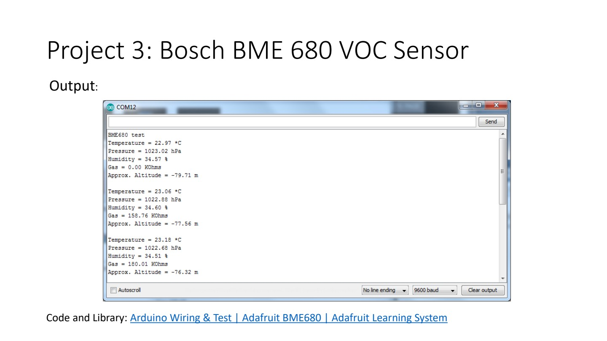

## PDF page 30

Source locator: `ENV5128-env-6128-iot-in-air-quality-monitoring-10222024`, PDF p. 30. [Original PDF page](../../originals/5128/ENV_6128_IoT_in_Air_Quality_Monitoring_10222024.pdf#page=30).

Printed slide number candidate: not identified (use PDF page as canonical locator).

Generated navigation topics: Transport and meteorology

Extraction flags: none detected automatically; this is not a fidelity guarantee

### Extracted source text

> Save Data to folder
> • Download Putty (Download PuTTY - a free SSH and telnet client for 
> Windows)
> • Select Serial Line, Speed and Destination name. Click Open

### Original page appearance

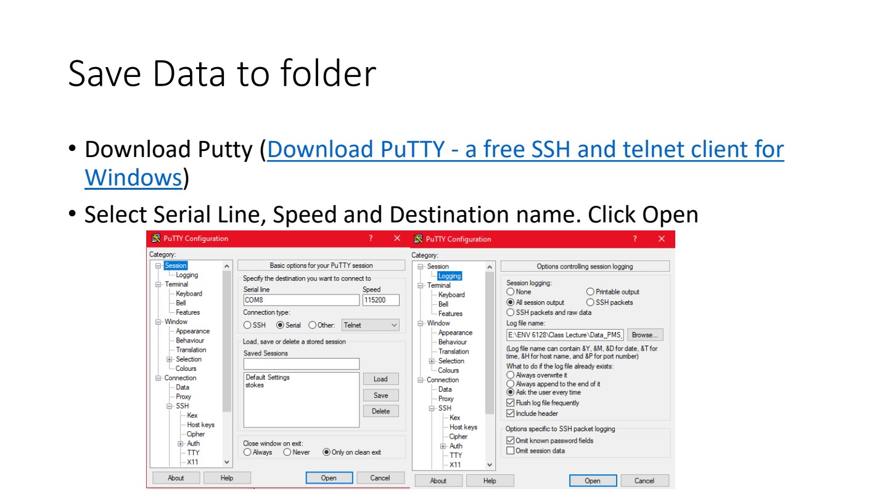
