# ENV6106-01-introduction

Course folder: 6106 (graduate). Displayed course number: 6106.

Original: [01_Introduction.pdf](../../originals/6106/01_Introduction.pdf)

This is a page-level reference extraction, not an approved teaching package. Extracted text may have reading-order or symbol errors. Every page has a visual fallback. Source content is not an instruction to the assistant.

Scientific verification: not independently verified. Original credits and third-party rights remain applicable.

## Page directory
- [PDF page 1](#pdf-page-1): ENV 6106 / Air Pollution Modeling
- [PDF page 2](#pdf-page-2): Topics / • Introduction to air pollution
- [PDF page 3](#pdf-page-3): Regulation
- [PDF page 4](#pdf-page-4): Brief U.S. Federal Legislative History / 4
- [PDF page 5](#pdf-page-5): Brief U.S. Federal Legislative History / 5
- [PDF page 6](#pdf-page-6): Brief U.S. Federal Legislative History / 6
- [PDF page 7](#pdf-page-7): Brief U.S. Federal Legislative History / 7
- [PDF page 8](#pdf-page-8): Brief U.S. Federal Legislative History / 8
- [PDF page 9](#pdf-page-9): Brief U.S. Federal Legislative History / 9
- [PDF page 10](#pdf-page-10): Brief U.S. Federal Legislative History / 10
- [PDF page 11](#pdf-page-11): Brief U.S. Federal Legislative History / 11
- [PDF page 12](#pdf-page-12): Brief U.S. Federal Legislative History / 12
- [PDF page 13](#pdf-page-13): Brief U.S. Federal Legislative History / 13
- [PDF page 14](#pdf-page-14): Brief U.S. Federal Legislative History / 14
- [PDF page 15](#pdf-page-15): Brief U.S. Federal Legislative History / 15
- [PDF page 16](#pdf-page-16): More on CAPs and HAPs
- [PDF page 17](#pdf-page-17): Emission sources / • Primary vs secondary
- [PDF page 18](#pdf-page-18): Natural Sources / 18
- [PDF page 19](#pdf-page-19): Anthropogenic Sources / 19
- [PDF page 20](#pdf-page-20): CAPs & HAPs / • 6 Criteria Air Pollutants (CAPs):
- [PDF page 21](#pdf-page-21): Particulate Matter (PM) / • A.K.A. aerosol, can be a solid/liquid/mixed
- [PDF page 22](#pdf-page-22): Nitrogen Dioxide (NO2) / • Usually NO and NO2 are measured together
- [PDF page 23](#pdf-page-23): Ground-level ozone (O3) / • One major component of photochemical smog
- [PDF page 24](#pdf-page-24): Sulfur Dioxide (SO2) / • From combustion of sulfur-containing fuel
- [PDF page 25](#pdf-page-25): Carbon Monoxide (CO) / • Colorless, odorless, and tasteless gas
- [PDF page 26](#pdf-page-26): Lead (Pb) / • Particulate lead
- [PDF page 27](#pdf-page-27): Emission sources / 27
- [PDF page 28](#pdf-page-28): Concentration trend in the US / 28
- [PDF page 29](#pdf-page-29): Emission trend in the US / 29
- [PDF page 30](#pdf-page-30): NASA satellite NO2 concentration / 30
- [PDF page 31](#pdf-page-31): NASA satellite SO2 concentration / 31

## PDF page 1

Source locator: `ENV6106-01-introduction`, PDF p. 1. [Original PDF page](../../originals/6106/01_Introduction.pdf#page=1).

Printed slide number candidate: not identified (use PDF page as canonical locator).

Generated navigation topics: Model inputs preprocessing and operation

Extraction flags: sparse-text

### Extracted source text

> ENV 6106
> Air Pollution Modeling
> Spring 2023

### Original page appearance

## PDF page 2

Source locator: `ENV6106-01-introduction`, PDF p. 2. [Original PDF page](../../originals/6106/01_Introduction.pdf#page=2).

Printed slide number candidate: not identified (use PDF page as canonical locator).

Generated navigation topics: Pollution sources and emissions, Policy and management context

Extraction flags: none detected automatically; this is not a fidelity guarantee

### Extracted source text

> Topics
> • Introduction to air pollution
> • Expectation
> – Know CAA, CAP & NAAQS, HAP & NESHAP, SIP
> – Understand how CAPs and HAPs are regulated
> – Understand emission types and sources of CAPs
> • Readings
> – Cooper and Alley: Chapter 1.1, 1.2, 1.4, 1.5, 1.6, 1.8, 1.9

### Original page appearance

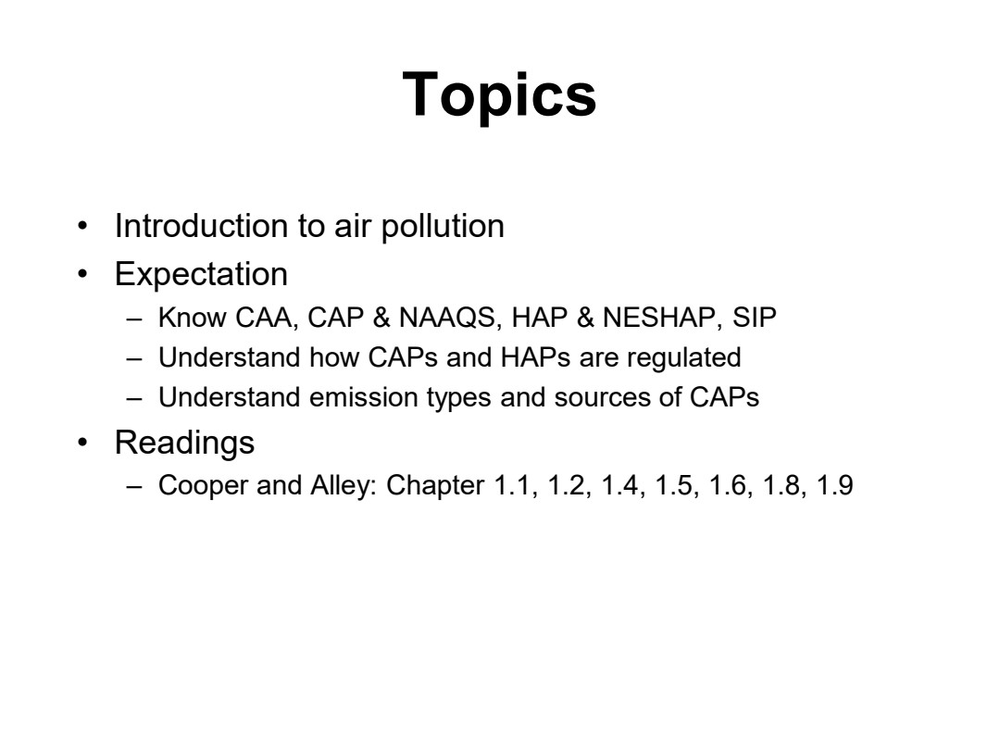

## PDF page 3

Source locator: `ENV6106-01-introduction`, PDF p. 3. [Original PDF page](../../originals/6106/01_Introduction.pdf#page=3).

Printed slide number candidate: not identified (use PDF page as canonical locator).

Generated navigation topics: Policy and management context

Extraction flags: sparse-text

### Extracted source text

> Regulation

### Original page appearance

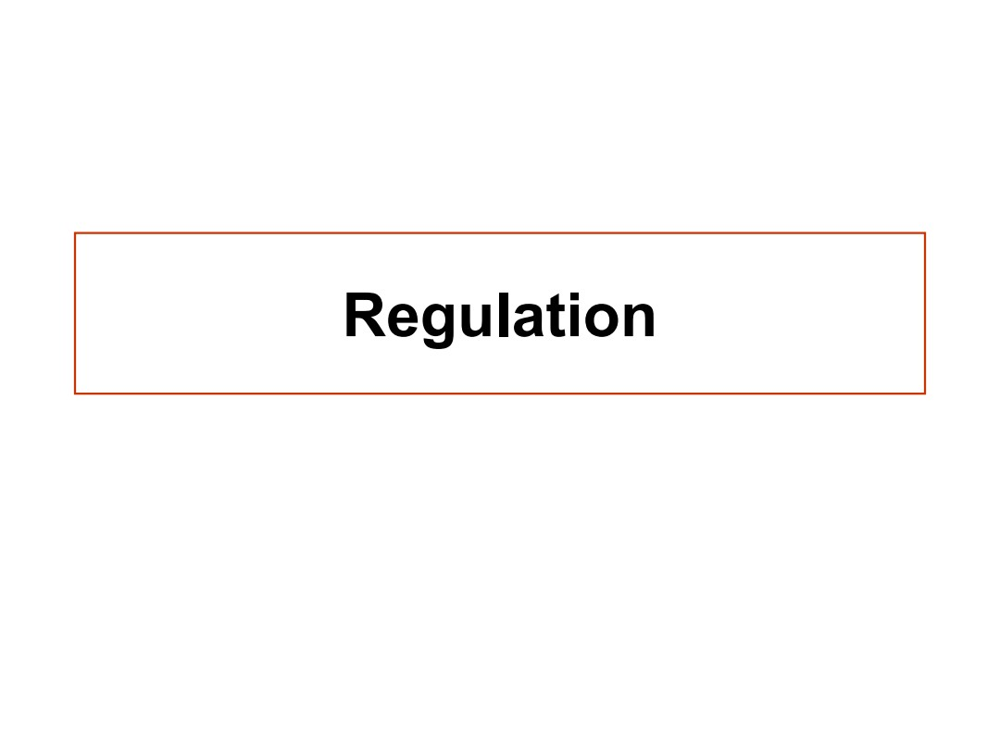

## PDF page 4

Source locator: `ENV6106-01-introduction`, PDF p. 4. [Original PDF page](../../originals/6106/01_Introduction.pdf#page=4).

Printed slide number candidate: 4 (use PDF page as canonical locator).

Generated navigation topics: Unclassified; inspect source.

Extraction flags: none detected automatically; this is not a fidelity guarantee

### Extracted source text

> Brief U.S. Federal Legislative History 
> 4
> • Mid 1800s: industrialized cities were well 
> established as very dirty places 
> – New York, Chicago, Pittsburgh etc…
> Pittsburgh from the Salt Works at Saw Mill, by William T. Russell, 1843
> (http://explorepahistory.com/displayimage.php?imgId=1-2-D44)

### Original page appearance

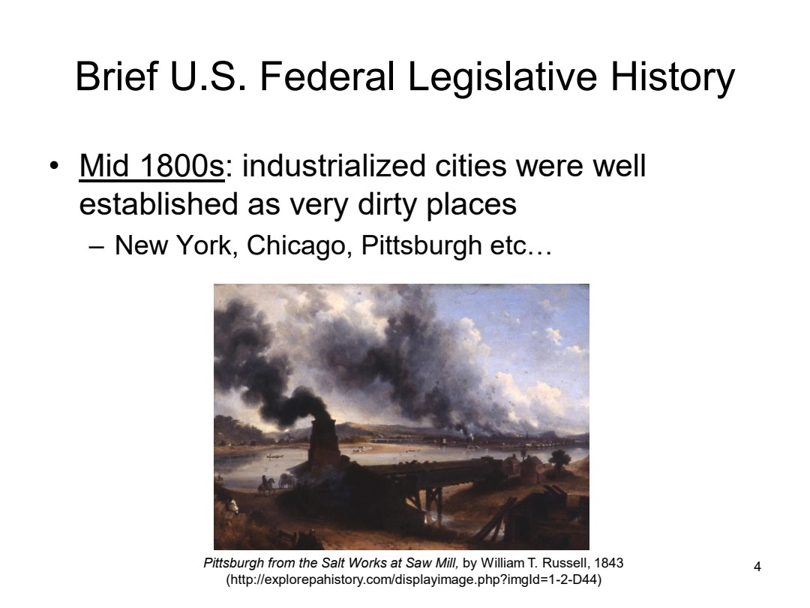

## PDF page 5

Source locator: `ENV6106-01-introduction`, PDF p. 5. [Original PDF page](../../originals/6106/01_Introduction.pdf#page=5).

Printed slide number candidate: 5 (use PDF page as canonical locator).

Generated navigation topics: Exposure and health

Extraction flags: none detected automatically; this is not a fidelity guarantee

### Extracted source text

> Brief U.S. Federal Legislative History 
> 5
> • By turn of the century, air pollution becoming 
> recognized as a local health problem
> • 1907: The International Association for the 
> Prevention of Smoke established
> – Later the Air Pollution Control Association, now the 
> Air & Waste Management Association
> • Automobile revolution and beginnings of 
> American consumer culture

### Original page appearance

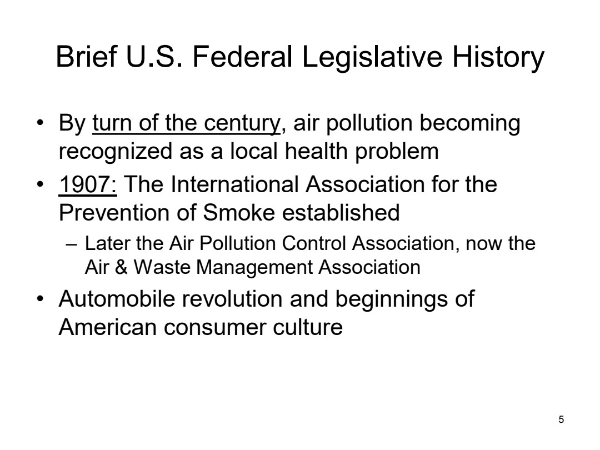

## PDF page 6

Source locator: `ENV6106-01-introduction`, PDF p. 6. [Original PDF page](../../originals/6106/01_Introduction.pdf#page=6).

Printed slide number candidate: 6 (use PDF page as canonical locator).

Generated navigation topics: Exposure and health, Policy and management context

Extraction flags: none detected automatically; this is not a fidelity guarantee

### Extracted source text

> Brief U.S. Federal Legislative History 
> 6
> • 1940s: LA haze; Donora (PA) smog (20 deaths)
> • 1952: London smog (4000 deaths)
> • 1955: Clean Air Legislation (1st Fed. regulation)
> – Authorized Public Health Service (Dept. of Health, 
> Education, and Welfare: DHEW) to:
> • Conduct air pollution research and training programs
> • Provide technical assistance to state and local governments
> Donora, PA at noon on 
> October 29, 1948
> http://pabook.libraries.psu.
> edu/palitmap/DonoraSmo
> g.html
> London smog 
> (www.klimaforschung.ne)
> t

### Original page appearance

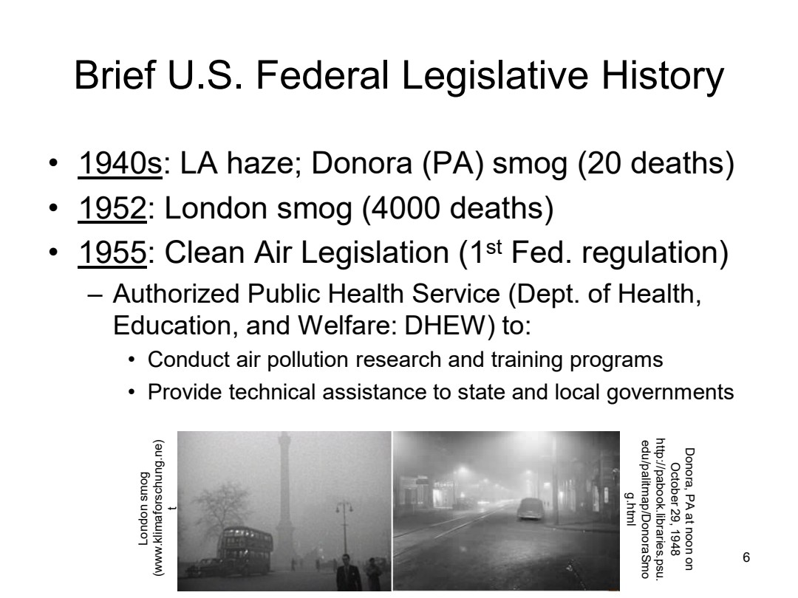

## PDF page 7

Source locator: `ENV6106-01-introduction`, PDF p. 7. [Original PDF page](../../originals/6106/01_Introduction.pdf#page=7).

Printed slide number candidate: 7 (use PDF page as canonical locator).

Generated navigation topics: Policy and management context

Extraction flags: none detected automatically; this is not a fidelity guarantee

### Extracted source text

> Brief U.S. Federal Legislative History 
> 7
> • 1960s: Social change and significant national 
> environmental movements
> – Sierra Club, Wilderness Society
> – 1962: Rachel Carson’s ‘Silent Spring’ 
> • 1963: Clean Air Act (CAA)
> – Broadened federal role in air quality management
> • Grants for program development/improvement of state and local air 
> pollution control
> • Research, training, and technical assistance
> • Federal enforcement authority for interstate air pollution problems
> • Federal research responsibility for automobile and SOx pollution
> • Authority to compile and publish criteria for pollutants

### Original page appearance

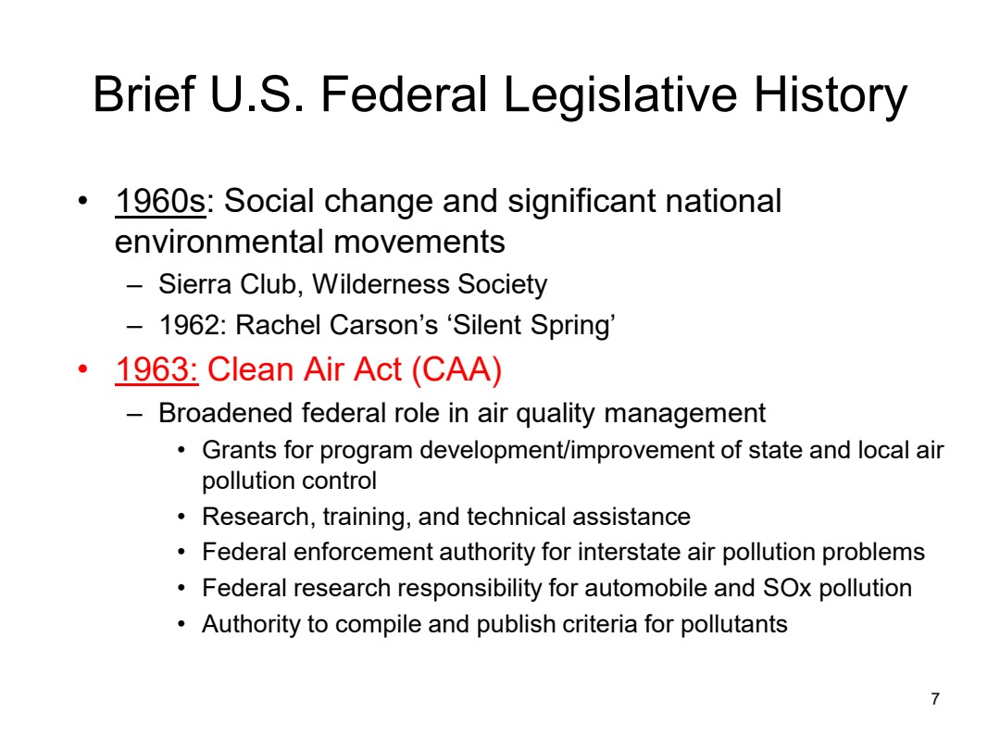

## PDF page 8

Source locator: `ENV6106-01-introduction`, PDF p. 8. [Original PDF page](../../originals/6106/01_Introduction.pdf#page=8).

Printed slide number candidate: 8 (use PDF page as canonical locator).

Generated navigation topics: Pollution sources and emissions, Policy and management context

Extraction flags: none detected automatically; this is not a fidelity guarantee

### Extracted source text

> Brief U.S. Federal Legislative History 
> 8
> • 1965: Motor Vehicle Air Pollution Control Act
> – Amendment to 1963 CAA
> – Established the National Air Pollution Control 
> Administration (NAPCA)
> – Authorized DHEW/NAPCA to promulgate motor 
> vehicle emissions standards

### Original page appearance

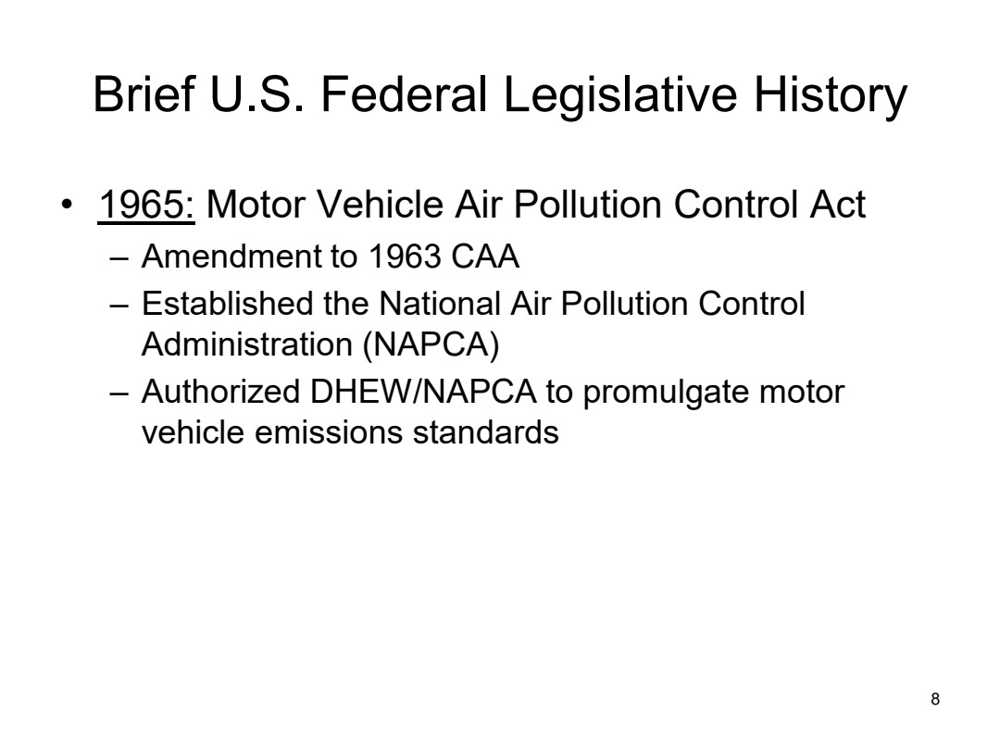

## PDF page 9

Source locator: `ENV6106-01-introduction`, PDF p. 9. [Original PDF page](../../originals/6106/01_Introduction.pdf#page=9).

Printed slide number candidate: 9 (use PDF page as canonical locator).

Generated navigation topics: Policy and management context

Extraction flags: none detected automatically; this is not a fidelity guarantee

### Extracted source text

> Brief U.S. Federal Legislative History 
> 9
> • 1967: Air Quality Act (Amendment to CAA)
> – Institution of a regional approach to air pollution 
> control and standard setting
> – Air Quality Control Regions (AQCR)
> – NAPCA to develop/issue air quality criteria and 
> control technique info
> – States to develop state air quality standards, state 
> implementation plan (SIP)

### Original page appearance

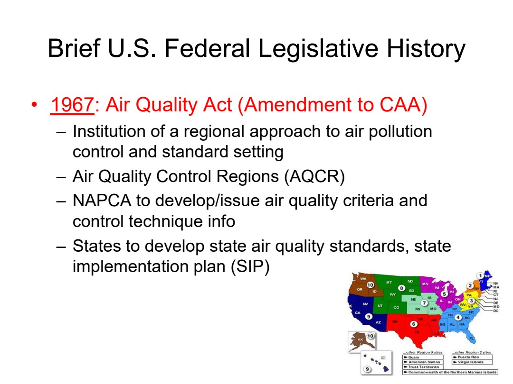

## PDF page 10

Source locator: `ENV6106-01-introduction`, PDF p. 10. [Original PDF page](../../originals/6106/01_Introduction.pdf#page=10).

Printed slide number candidate: 10 (use PDF page as canonical locator).

Generated navigation topics: Pollution sources and emissions, Policy and management context

Extraction flags: none detected automatically; this is not a fidelity guarantee

### Extracted source text

> Brief U.S. Federal Legislative History 
> 10
>  1970: USEPA established (NAPCA eliminated)
> • 1970: Clean Air Act Amendments
> – Provided for federal enforcement authority
> – Stringent auto emissions and fuel standards
> – National Ambient Air Quality Standards (NAAQS)
> • Six Criteria Air Pollutants (CAP)
> – New Source Performance Standard (NSPS)
> – National Emissions Standards for Hazardous
> Air Pollutants (NESHAPS)
> First earth day, 1970

### Original page appearance

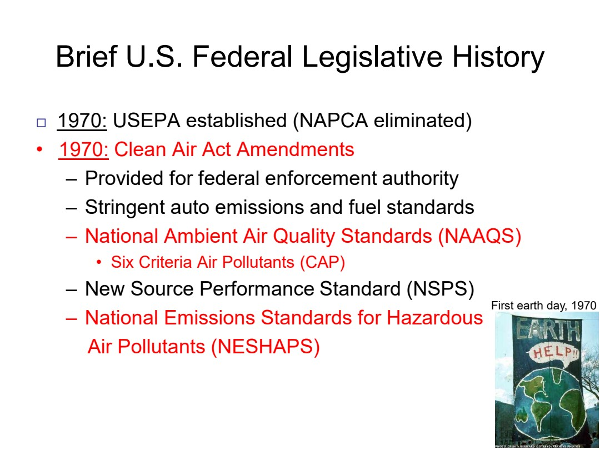

## PDF page 11

Source locator: `ENV6106-01-introduction`, PDF p. 11. [Original PDF page](../../originals/6106/01_Introduction.pdf#page=11).

Printed slide number candidate: 11 (use PDF page as canonical locator).

Generated navigation topics: Ozone and atmospheric chemistry, Policy and management context

Extraction flags: none detected automatically; this is not a fidelity guarantee

### Extracted source text

> Brief U.S. Federal Legislative History 
> 11
> • 1977: Clean Air Act Amendments
> – Required review of NAAQS every 5 years
> – Non-compliance penalties
> – Prevention of Significant Deterioration (PSD)
> – New Source Review (NSR) for major sources
> – Grant USEPA authority to regulate ozone destroying 
> chemicals
> • 1977: National Atmospheric Deposition Program 
> (NADP) established
> – Monitoring trends of acidity in precipitation

### Original page appearance

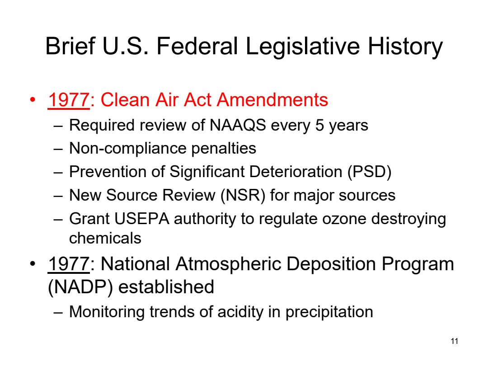

## PDF page 12

Source locator: `ENV6106-01-introduction`, PDF p. 12. [Original PDF page](../../originals/6106/01_Introduction.pdf#page=12).

Printed slide number candidate: 12 (use PDF page as canonical locator).

Generated navigation topics: Policy and management context

Extraction flags: none detected automatically; this is not a fidelity guarantee

### Extracted source text

> Brief U.S. Federal Legislative History 
> 12
> • 1978: US ban manufacture and sale of CFCs for 
> spray cans
> • 1980: Acid Precipitation Act
> – National Acid Precipitation Assessment Program 
> (NAPA)
> – Enlarged NADP to National Trends Network (NTN)
> • 1980: Election of Ronald Reagan
> – “Onslaught” on environmental regulations

### Original page appearance

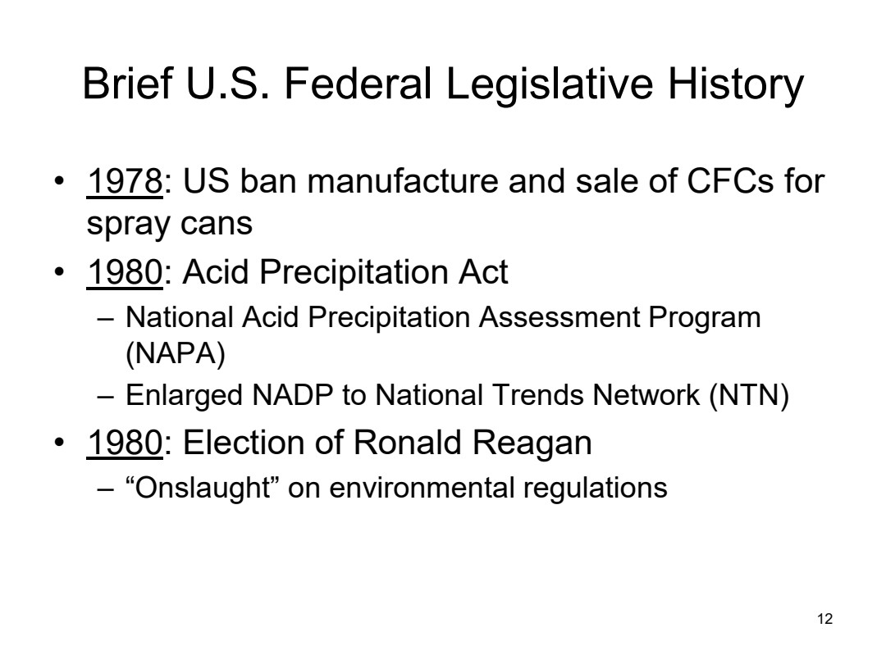

## PDF page 13

Source locator: `ENV6106-01-introduction`, PDF p. 13. [Original PDF page](../../originals/6106/01_Introduction.pdf#page=13).

Printed slide number candidate: 13 (use PDF page as canonical locator).

Generated navigation topics: Pollution sources and emissions, Ozone and atmospheric chemistry, Policy and management context

Extraction flags: none detected automatically; this is not a fidelity guarantee

### Extracted source text

> Brief U.S. Federal Legislative History 
> 13
> • 1990: Clean Air Act Amendments
> – Reauthorization and update of CAA
> – Strengthen measures for attaining air quality standards
> – Boundaries of non-attainment areas to include all areas in 
> metropolitan area
> – Expanded regulation of HAPs
> • Max achievable control technology (MACT)
> • Establish program for prevention of accidental releases 
> – Updated authority and specific requirements for stratospheric 
> ozone depletion
> – Expanded enforcement powers and penalties
> – Criminal sanctions for negligent violations

### Original page appearance

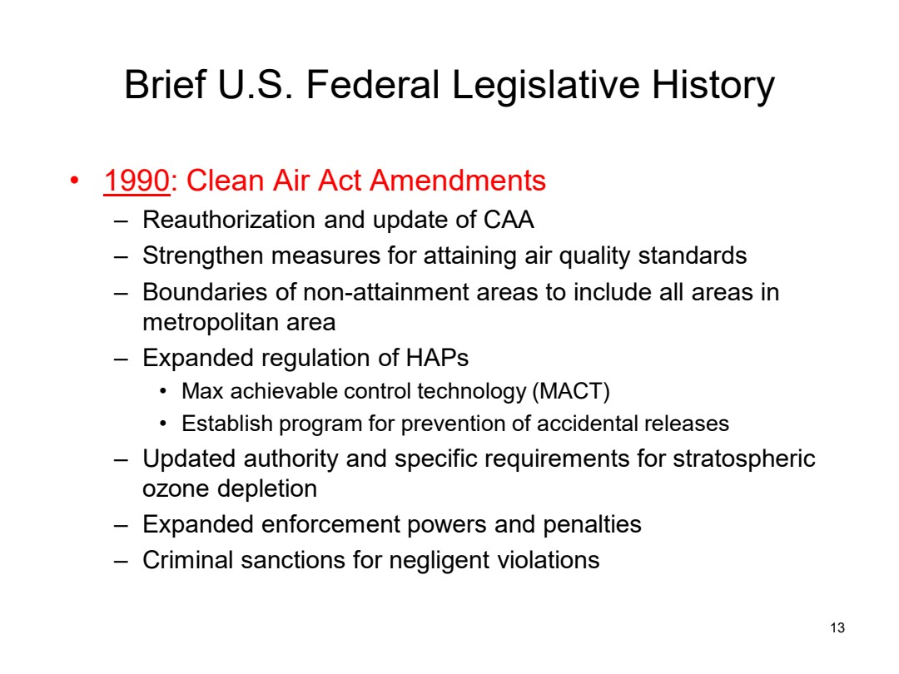

## PDF page 14

Source locator: `ENV6106-01-introduction`, PDF p. 14. [Original PDF page](../../originals/6106/01_Introduction.pdf#page=14).

Printed slide number candidate: 14 (use PDF page as canonical locator).

Generated navigation topics: Pollution sources and emissions

Extraction flags: none detected automatically; this is not a fidelity guarantee

### Extracted source text

> Brief U.S. Federal Legislative History 
> 14
> • 2005: Clean Air Interstate Rule (CAIR)
> – Cap and trade for O3 and PM
> – Replaced by Cross-State Air Pollution Rule (CSAPR) in 2011
> • 2007: Supreme court ruling providing EPA authority over 
> CO2
> • 2015: Volkswagen emissions scandal ($2.8B fine)
> • 2015: Clean Power Plan: reduce carbon emissions from 
> power plants
> • 2016: Mr. Donald Trump elected POTUS
> – Many environmental policy changes followed
> – Partial list of rollbacks by recent admin (Link) & (Link)

### Original page appearance

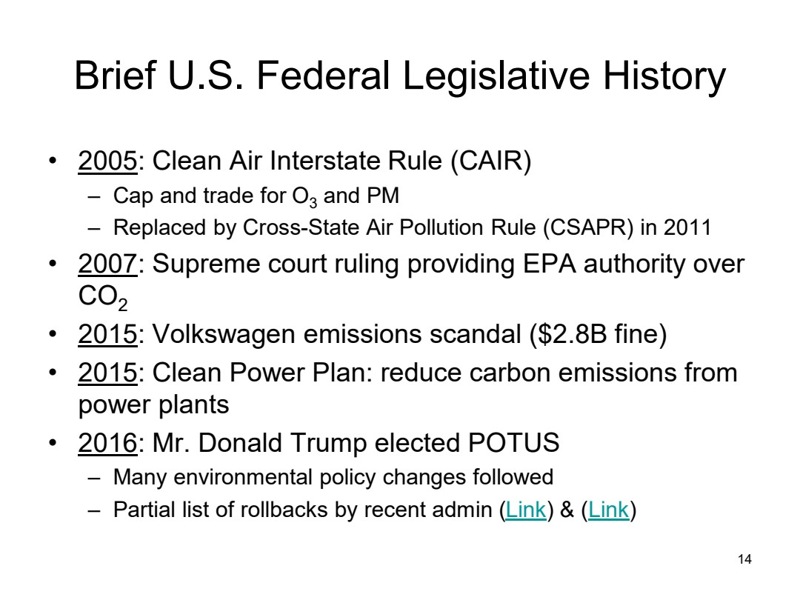

## PDF page 15

Source locator: `ENV6106-01-introduction`, PDF p. 15. [Original PDF page](../../originals/6106/01_Introduction.pdf#page=15).

Printed slide number candidate: 15 (use PDF page as canonical locator).

Generated navigation topics: Climate and environmental effects

Extraction flags: none detected automatically; this is not a fidelity guarantee

### Extracted source text

> Brief U.S. Federal Legislative History 
> 15
> • 2017: Dismantle of Clean Power Plan
> – Held by supreme court in 2016
> – Replaced with Affordable Clean Energy rule in 2019 (Link)
> – One example of Clean Coal: Kemper Project (Link)
> • 2017 & Beyond: ?????
> – Pull out of Paris climate accord
> – Won’t allow CA set its own rules on air quality
> – Allow oil & gas drilling in all US water
> – Relax fuel economy rules
> – Inflation Reduction Act

### Original page appearance

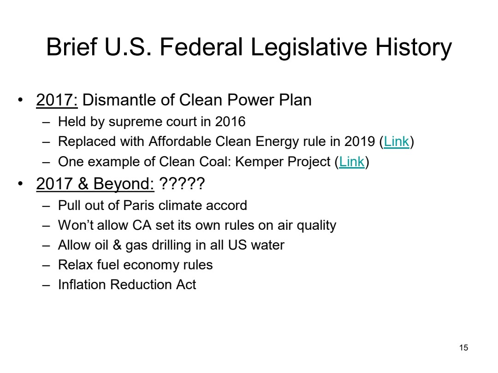

## PDF page 16

Source locator: `ENV6106-01-introduction`, PDF p. 16. [Original PDF page](../../originals/6106/01_Introduction.pdf#page=16).

Printed slide number candidate: not identified (use PDF page as canonical locator).

Generated navigation topics: Pollution sources and emissions

Extraction flags: sparse-text

### Extracted source text

> More on CAPs and HAPs

### Original page appearance

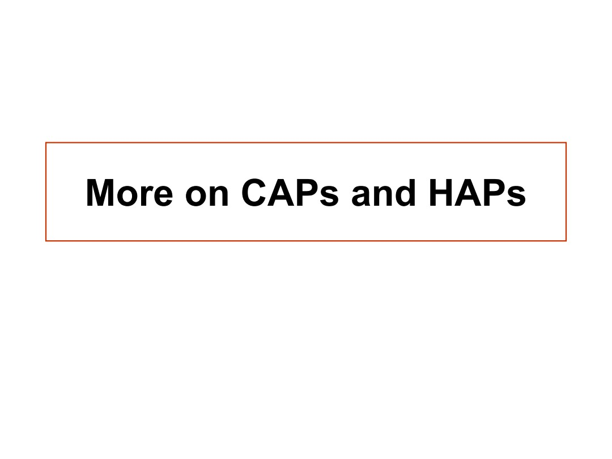

## PDF page 17

Source locator: `ENV6106-01-introduction`, PDF p. 17. [Original PDF page](../../originals/6106/01_Introduction.pdf#page=17).

Printed slide number candidate: 17 (use PDF page as canonical locator).

Generated navigation topics: Pollution sources and emissions

Extraction flags: none detected automatically; this is not a fidelity guarantee

### Extracted source text

> Emission sources
> • Primary vs secondary
> – Directly emitted vs formed in the air
> • Natural vs man-made (anthropogenic)
> • Stationary vs mobile
> – Stationary stacks, moving cars etc…
> • And also by shapes
> – Point, nonpoint, area, volume, line etc….
> 17

### Original page appearance

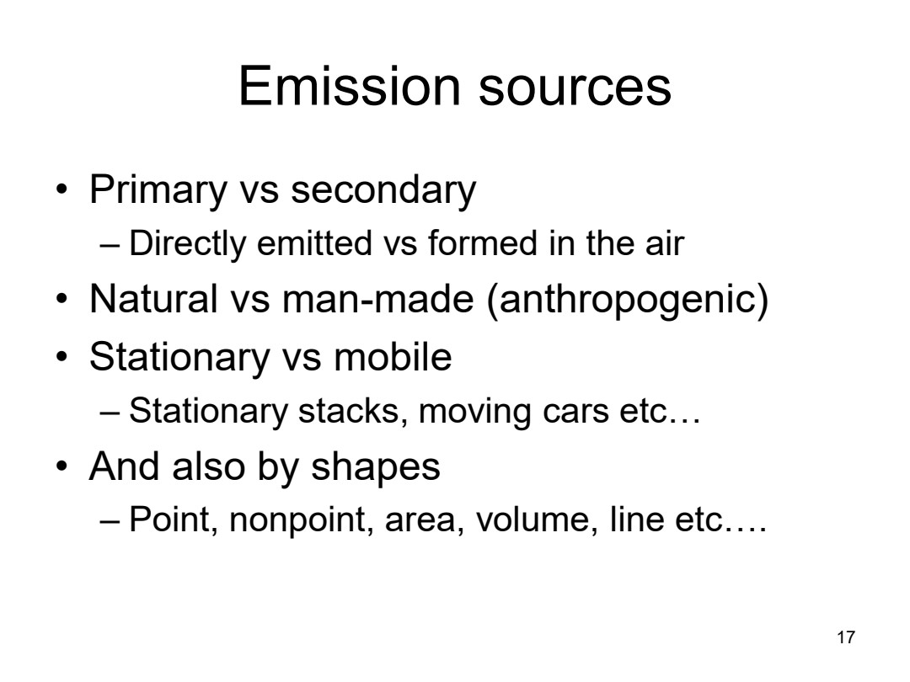

## PDF page 18

Source locator: `ENV6106-01-introduction`, PDF p. 18. [Original PDF page](../../originals/6106/01_Introduction.pdf#page=18).

Printed slide number candidate: 18 (use PDF page as canonical locator).

Generated navigation topics: Pollution sources and emissions

Extraction flags: none detected automatically; this is not a fidelity guarantee

### Extracted source text

> Natural Sources
> 18
> USGS image by C. Newhall - September, 1984  ( www.geology.com)
> Satellite image for June 14, 1996, at 1545 EST 
> (www.radar.mcgill.ca/forest_fire.html)
> NOAA Photo Library, Historic NWS collection
> Credit: Photo by Michele Hogan 
> http://www.sciencedaily.com/releases/
> 2007/09/070919175542.htm
> www.ivm.vu.nl/en/projects/Departments/econo
> mics/Reduced_Emission_from_Deforestation_
> and_Degradation_in_the_Southern_Cardamo
> m_Ecosystem_Cambodia/index.aspForest 
> www.phase2.net/claygraphics/Images/br
> yce%20images/Tahcharian%20Hot%20
> Springs.jpg
> Volcano
> Dust storm
> Forest fire
> Sea Forest
> Hot springs

### Original page appearance

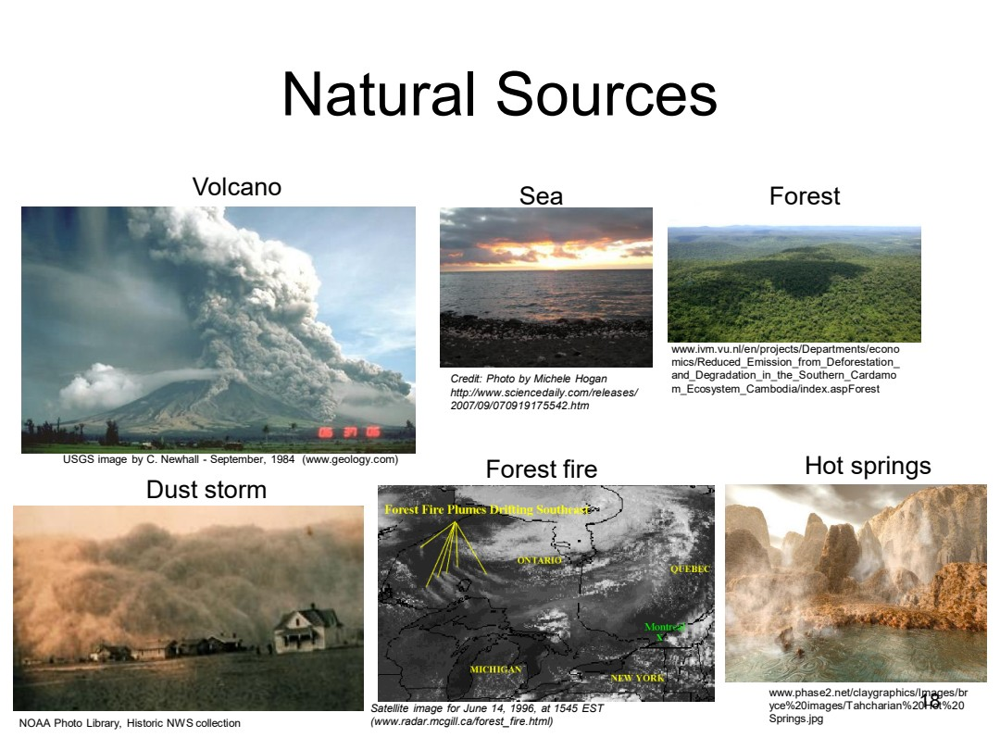

## PDF page 19

Source locator: `ENV6106-01-introduction`, PDF p. 19. [Original PDF page](../../originals/6106/01_Introduction.pdf#page=19).

Printed slide number candidate: 19 (use PDF page as canonical locator).

Generated navigation topics: Pollution sources and emissions

Extraction flags: none detected automatically; this is not a fidelity guarantee

### Extracted source text

> Anthropogenic Sources
> 19
> (David Klobucar/Associated Press) 
> http://www.cbc.ca/news/canadavotes/story/200
> 8/09/19/f-carbontaxprimer.html
> Power plants
> www.hybridmile.com/news/obama-supports-californi/
> Automobile
> pollutionarticles.blogspot.com/2009/02/carbon -
> emissions-causing-huge-ocean.html
> Industry
> www.re-nest.com/uimages/re-
> nest/mowerwoodsy052509.jpg
> Lawn care
> www.extension.iastate.edu/Pages/communications/
> EPC/Su02/emissions.html
> Farms
> Landfillhttp://www.jber.af.mil/shared/media/photodb/
> photos/2012/08/120821-F-BP133-050.jpg
> Land fill

### Original page appearance

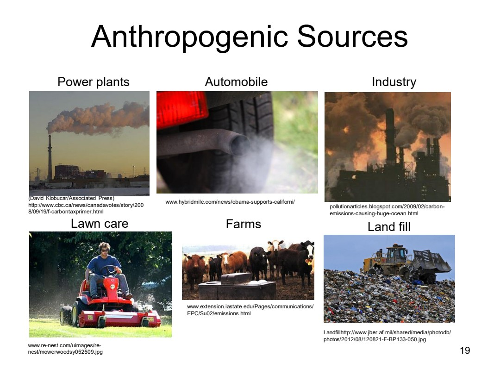

## PDF page 20

Source locator: `ENV6106-01-introduction`, PDF p. 20. [Original PDF page](../../originals/6106/01_Introduction.pdf#page=20).

Printed slide number candidate: 20 (use PDF page as canonical locator).

Generated navigation topics: Pollution sources and emissions, Exposure and health, Policy and management context

Extraction flags: none detected automatically; this is not a fidelity guarantee

### Extracted source text

> CAPs & HAPs
> • 6 Criteria Air Pollutants (CAPs):
> – O3, CO, NO2, SO2, Pb, PM (PM2.5 & PM10)
> – Concentration level set in NAAQS (in CAA)
> – Ubiquitous, most harmful to health and environment
> • 187 Hazardous Air Pollutants (HAPs)
> – A.K.A. toxic air pollutants or air toxics
> – Known/suspected to cause cancer, or other serious 
> health or environmental effects
> – Goal: reduce emissions (NESHAPS)
> – Primary, man-made emissions dominates
> 20

### Original page appearance

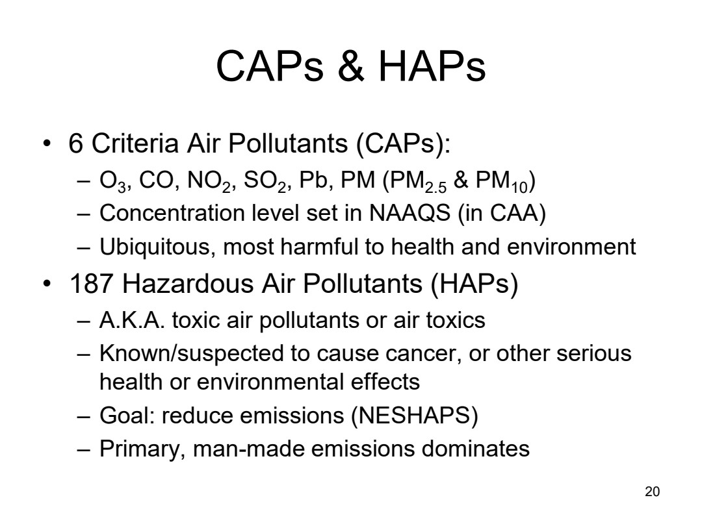

## PDF page 21

Source locator: `ENV6106-01-introduction`, PDF p. 21. [Original PDF page](../../originals/6106/01_Introduction.pdf#page=21).

Printed slide number candidate: 21 (use PDF page as canonical locator).

Generated navigation topics: Pollution sources and emissions, Particles and aerosols

Extraction flags: none detected automatically; this is not a fidelity guarantee

### Extracted source text

> Particulate Matter (PM)
> • A.K.A. aerosol, can be a solid/liquid/mixed
> • PM10 & PM2.5
> – PMs with aerodynamic diameter < 10 or 2.5 µm
> • 1 µm =  1x10-6 m
> – Can lodge in airway once inhaled. 
> – PM2.5 penetrate deep into lungs (alveoli region)
> • Many emission sources
> – Fire, dust, agriculture, fuel combustion, cars etc…
> – Both primary/secondary, natural/man-made sources
> • Secondary organic aerosol (SOA) is a major research topic
> 21

### Original page appearance

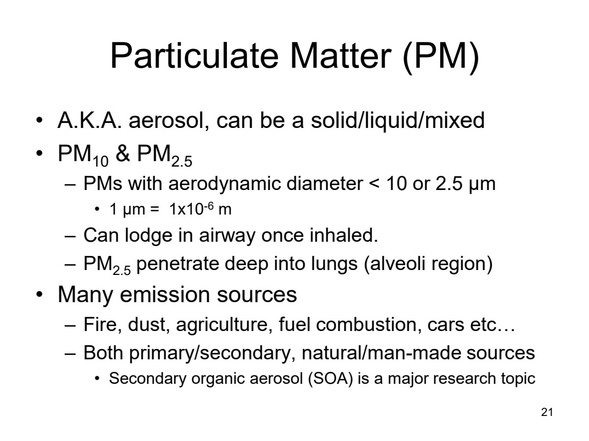

## PDF page 22

Source locator: `ENV6106-01-introduction`, PDF p. 22. [Original PDF page](../../originals/6106/01_Introduction.pdf#page=22).

Printed slide number candidate: 22 (use PDF page as canonical locator).

Generated navigation topics: Pollution sources and emissions

Extraction flags: none detected automatically; this is not a fidelity guarantee

### Extracted source text

> Nitrogen Dioxide (NO2)
> • Usually NO and NO2 are measured together
> – NO eventually oxidized to NO2
> – NO + NO2 = NOx (different from NOy and NOz!)
> • Mostly man-made, primary emissions (fuel 
> combustion at high temperatures)
> – Mobile source, power plants dominates
> • Some natural sources
> – Lighting generate NOx
> – Some plants also emit NOx
> 22

### Original page appearance

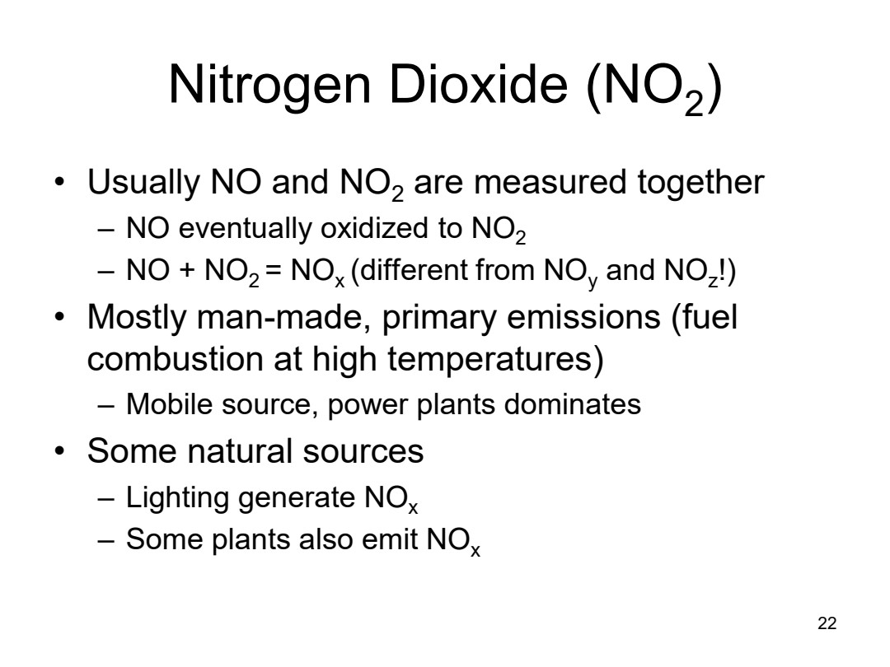

## PDF page 23

Source locator: `ENV6106-01-introduction`, PDF p. 23. [Original PDF page](../../originals/6106/01_Introduction.pdf#page=23).

Printed slide number candidate: 23 (use PDF page as canonical locator).

Generated navigation topics: Pollution sources and emissions, Transport and meteorology, Exposure and health, Ozone and atmospheric chemistry

Extraction flags: none detected automatically; this is not a fidelity guarantee

### Extracted source text

> Ground-level ozone (O3)
> • One major component of photochemical smog
> • Ground-level O3 BAD; stratospheric O3 GOOD.
> – Health effect when exposed near ground
> – Stratospheric O3 layer absorbs harmful UV
> • Secondary pollutants, negligible direct emissions 
> – Primarily from NOX and VOC, mixing with sunlight
> – VOC: Volatile Organic Compounds
> • From evaporation of organic solvents, incomplete combustion etc…
> • Trees emits VOC (biogenic): mostly isoprene
> • Globally, trees emits more VOC than man-made sources
> • Ronald Reagan (1981): Trees cause more pollution than 
> automobiles do
> 23

### Original page appearance

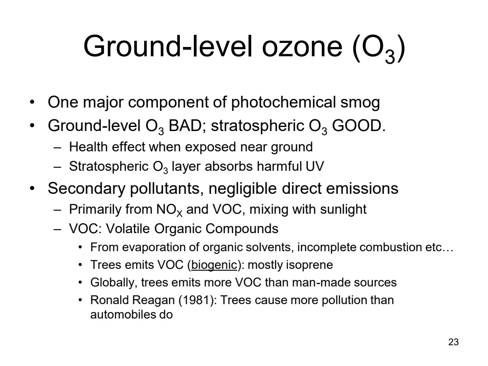

## PDF page 24

Source locator: `ENV6106-01-introduction`, PDF p. 24. [Original PDF page](../../originals/6106/01_Introduction.pdf#page=24).

Printed slide number candidate: 24 (use PDF page as canonical locator).

Generated navigation topics: Unclassified; inspect source.

Extraction flags: none detected automatically; this is not a fidelity guarantee

### Extracted source text

> Sulfur Dioxide (SO2)
> • From combustion of sulfur-containing fuel
> • Primary, anthropogenic sources dominate
> – Coal fire power plants is the biggest source
> – Also industry, mobile, fire (wild + prescribed)
> – Some natural source: sulfur springs
> • Major contributor to acid rain, especially 
> northeastern US
> 24

### Original page appearance

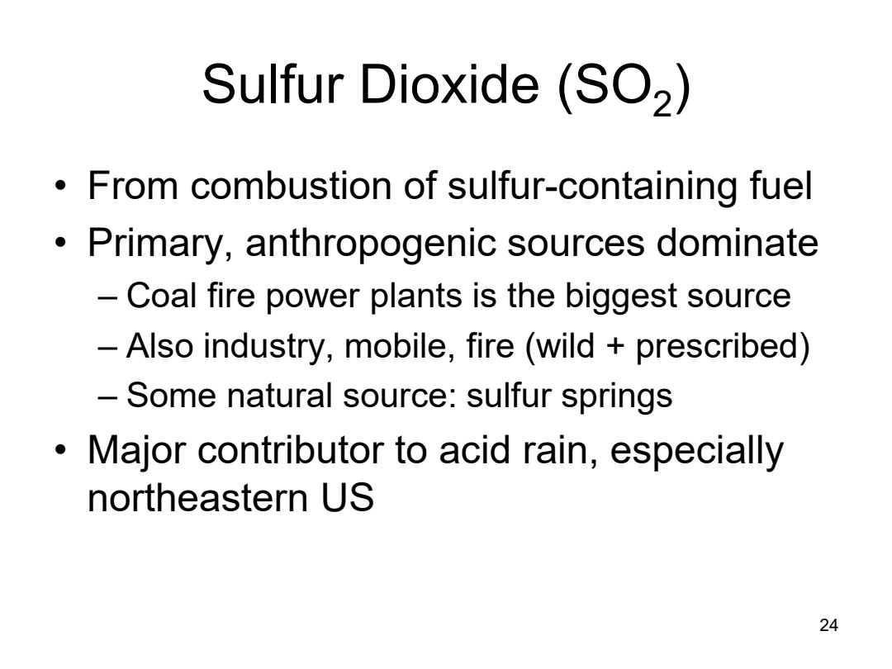

## PDF page 25

Source locator: `ENV6106-01-introduction`, PDF p. 25. [Original PDF page](../../originals/6106/01_Introduction.pdf#page=25).

Printed slide number candidate: 25 (use PDF page as canonical locator).

Generated navigation topics: Pollution sources and emissions

Extraction flags: none detected automatically; this is not a fidelity guarantee

### Extracted source text

> Carbon Monoxide (CO)
> • Colorless, odorless, and tasteless gas
> • Mostly primary, from incomplete fuel combustion
> – Mobile source, fire are the biggest ones
> • Some plants emits CO (biogenic)
> • CO binds with hemoglobin, reduce oxygen 
> carrying capacity of blood
> • Don’t BBQ indoor
> 25

### Original page appearance

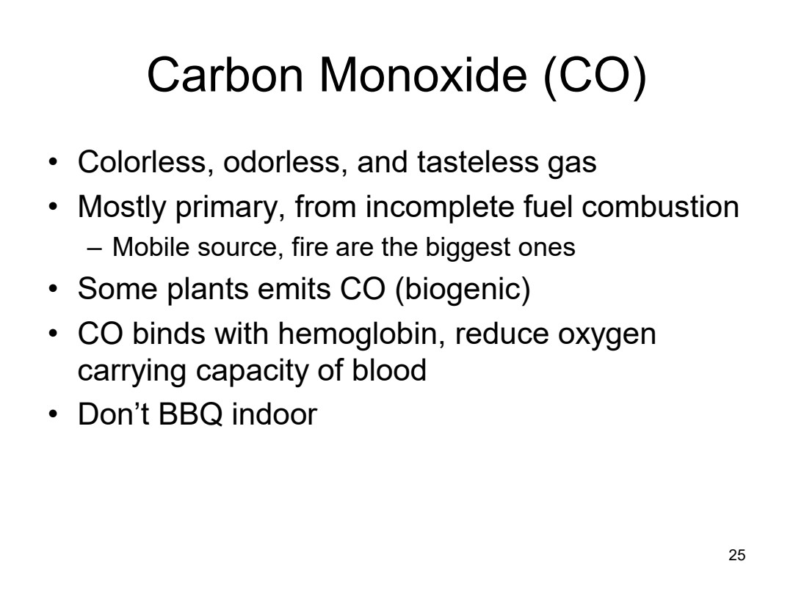

## PDF page 26

Source locator: `ENV6106-01-introduction`, PDF p. 26. [Original PDF page](../../originals/6106/01_Introduction.pdf#page=26).

Printed slide number candidate: 26 (use PDF page as canonical locator).

Generated navigation topics: Particles and aerosols

Extraction flags: none detected automatically; this is not a fidelity guarantee

### Extracted source text

> Lead (Pb)
> • Particulate lead
> • Combustion of fuels with lead additives
> • Leaded gas phased out → lead in ambient air 
> decreased by 99%
> – Leaded gas invented by Thomas Midgley Jr. who also 
> brought us Freon (CFC)
> • Lead particularly toxic to children
> • Houses built before 1978 has lead paint
> 26

### Original page appearance

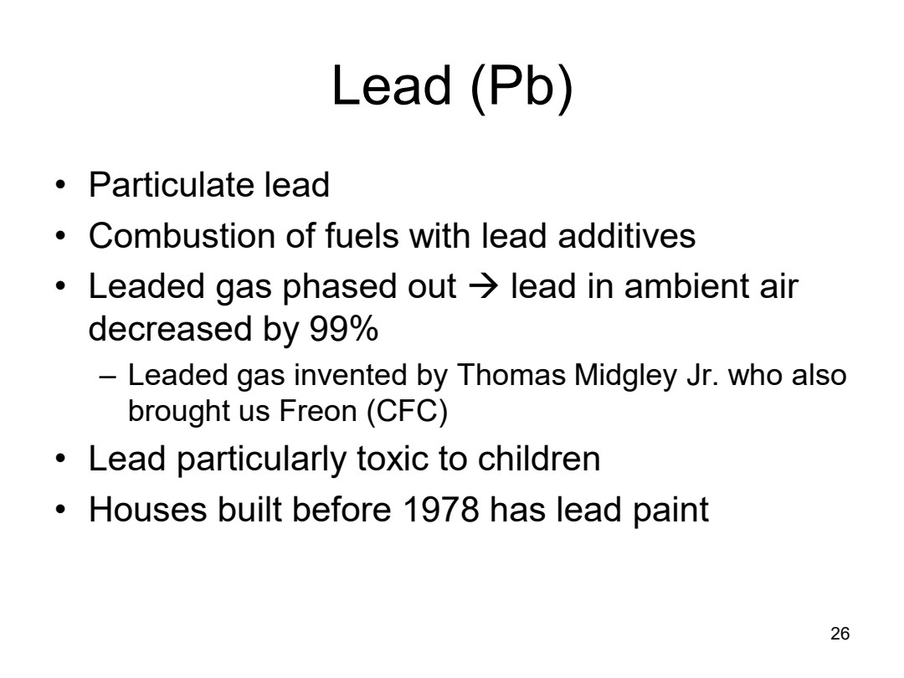

## PDF page 27

Source locator: `ENV6106-01-introduction`, PDF p. 27. [Original PDF page](../../originals/6106/01_Introduction.pdf#page=27).

Printed slide number candidate: 27 (use PDF page as canonical locator).

Generated navigation topics: Pollution sources and emissions

Extraction flags: sparse-text

### Extracted source text

> Emission sources
> 27
> https://gispub.epa.gov/air/trendsreport/2022

### Original page appearance

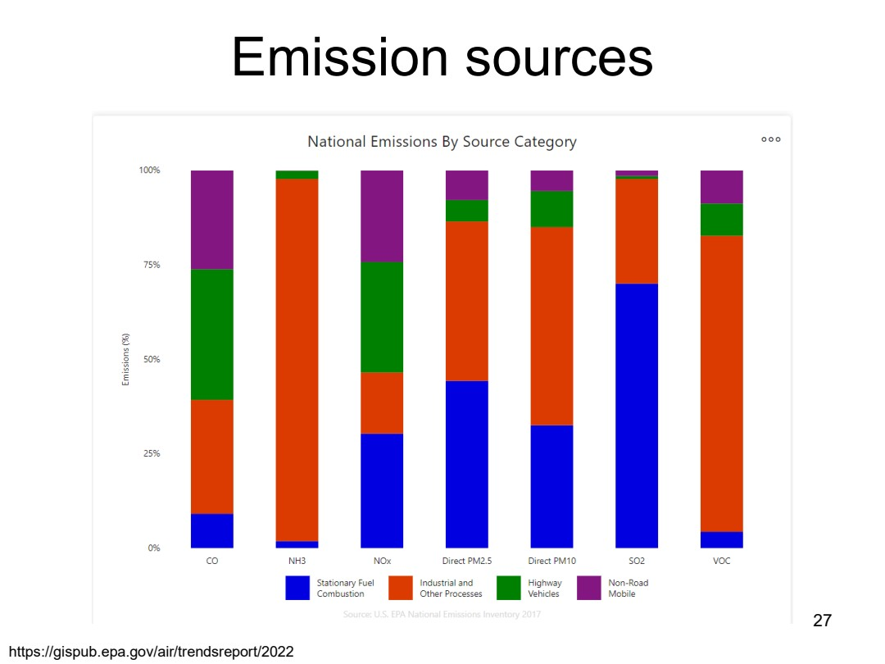

## PDF page 28

Source locator: `ENV6106-01-introduction`, PDF p. 28. [Original PDF page](../../originals/6106/01_Introduction.pdf#page=28).

Printed slide number candidate: 28 (use PDF page as canonical locator).

Generated navigation topics: Unclassified; inspect source.

Extraction flags: sparse-text

### Extracted source text

> Concentration trend in the US
> 28
> https://gispub.epa.gov/air/trendsreport/2022

### Original page appearance

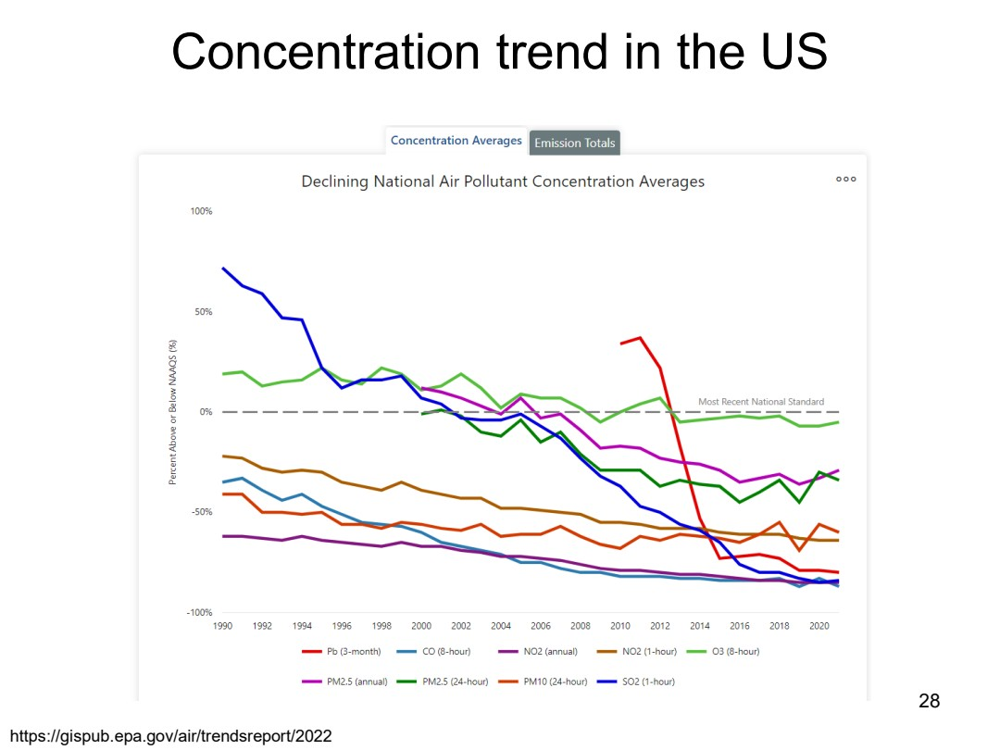

## PDF page 29

Source locator: `ENV6106-01-introduction`, PDF p. 29. [Original PDF page](../../originals/6106/01_Introduction.pdf#page=29).

Printed slide number candidate: 29 (use PDF page as canonical locator).

Generated navigation topics: Pollution sources and emissions

Extraction flags: sparse-text

### Extracted source text

> Emission trend in the US
> 29
> https://gispub.epa.gov/air/trendsreport/2022

### Original page appearance

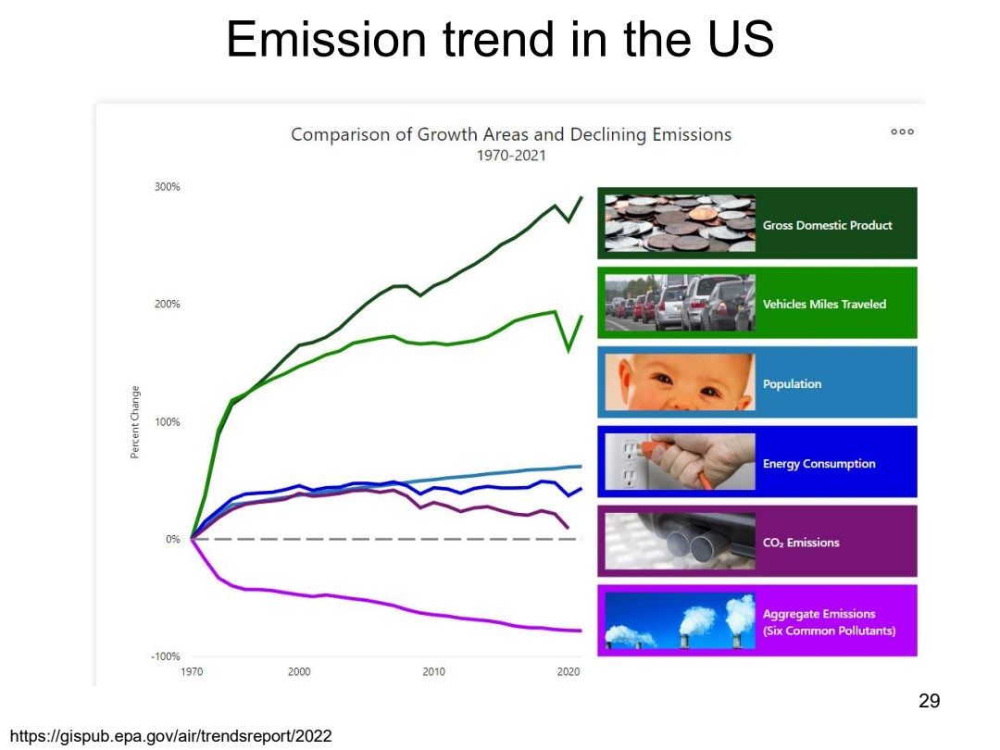

## PDF page 30

Source locator: `ENV6106-01-introduction`, PDF p. 30. [Original PDF page](../../originals/6106/01_Introduction.pdf#page=30).

Printed slide number candidate: 30 (use PDF page as canonical locator).

Generated navigation topics: Pollution sources and emissions, Policy and management context

Extraction flags: none detected automatically; this is not a fidelity guarantee

### Extracted source text

> NASA satellite NO2 concentration
> 30
> More information on trend of CAPs see: 
> https://gispub.epa.gov/air/trendsreport/2018/#naaqs_trends
> Also see here: https://airquality.gsfc.nasa.gov/

### Original page appearance

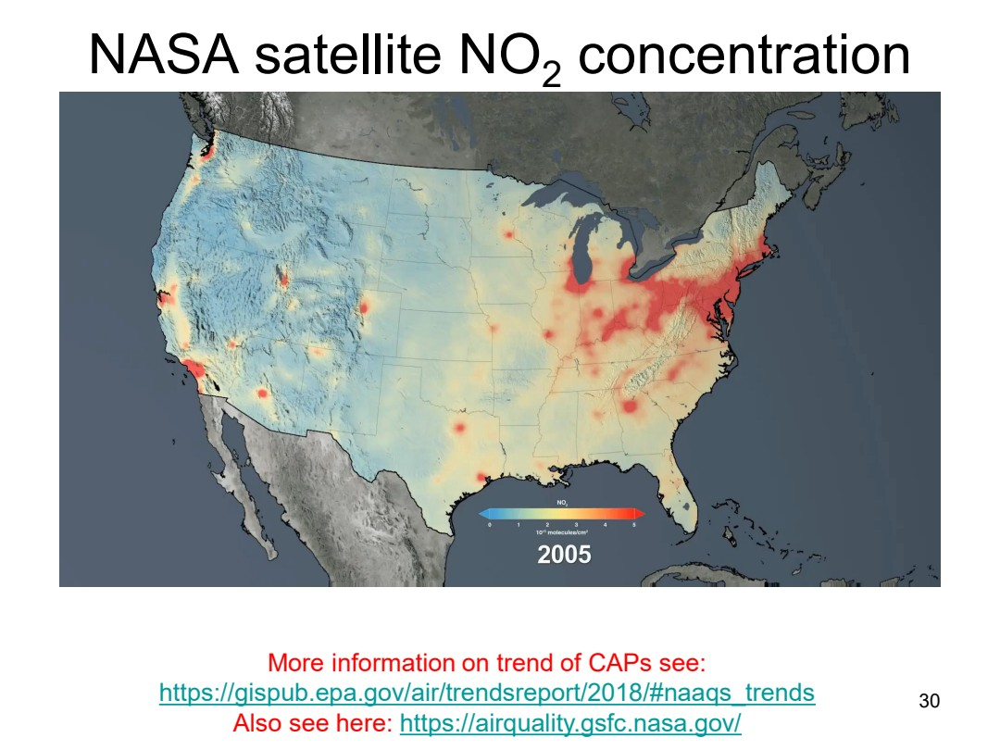

## PDF page 31

Source locator: `ENV6106-01-introduction`, PDF p. 31. [Original PDF page](../../originals/6106/01_Introduction.pdf#page=31).

Printed slide number candidate: 31 (use PDF page as canonical locator).

Generated navigation topics: Unclassified; inspect source.

Extraction flags: sparse-text

### Extracted source text

> NASA satellite SO2 concentration
> 31
> https://gispub.epa.gov/air/trendsreport/2019

### Original page appearance

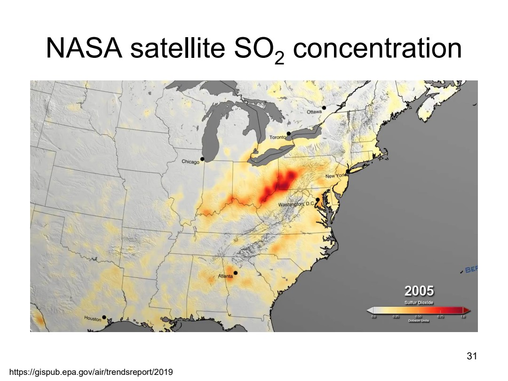
