# ENV6106-04-plume-rise-downwash

Course folder: 6106 (graduate). Displayed course number: 6106.

Original: [04_Plume_Rise_Downwash.pdf](../../originals/6106/04_Plume_Rise_Downwash.pdf)

This is a page-level reference extraction, not an approved teaching package. Extracted text may have reading-order or symbol errors. Every page has a visual fallback. Source content is not an instruction to the assistant.

Scientific verification: not independently verified. Original credits and third-party rights remain applicable.

## Page directory
- [PDF page 1](#pdf-page-1): ENV 6106 / Air Pollution Modeling
- [PDF page 2](#pdf-page-2): Topics / • Gaussian model, plume rise and downwash
- [PDF page 3](#pdf-page-3): More on Gaussian model
- [PDF page 4](#pdf-page-4): Inside the time-average plume… / 4
- [PDF page 5](#pdf-page-5): The Gaussian Plume Model / 5
- [PDF page 6](#pdf-page-6): The Gaussian Plume Model / • C proportional with source strength S
- [PDF page 7](#pdf-page-7): Ground concentrations / (Cooper and Alley, 2002)
- [PDF page 8](#pdf-page-8): Max ground concentrations / (Cooper and Alley, 2002)
- [PDF page 9](#pdf-page-9): Max ground concentrations / (Cooper and Alley, 2002)
- [PDF page 10](#pdf-page-10): Plume rise
- [PDF page 11](#pdf-page-11): Plume rise / 11
- [PDF page 12](#pdf-page-12): Plume rise / • Plume rise is critical for Gaussian dispersion models
- [PDF page 13](#pdf-page-13): Height of plume rise (∆h) / • Holland
- [PDF page 14](#pdf-page-14): Briggs plume rise model / • Neutral or unstable conditions
- [PDF page 15](#pdf-page-15): Briggs plume rise model / • Stable conditions
- [PDF page 16](#pdf-page-16): Max ground concentrations / • Max ground concentration does not always
- [PDF page 17](#pdf-page-17): Downwash
- [PDF page 18](#pdf-page-18): Downwash / • As wind blows past blunt objects, flow
- [PDF page 19](#pdf-page-19): Downwash / • Most dispersion models has taken account the effect of

## PDF page 1

Source locator: `ENV6106-04-plume-rise-downwash`, PDF p. 1. [Original PDF page](../../originals/6106/04_Plume_Rise_Downwash.pdf#page=1).

Printed slide number candidate: not identified (use PDF page as canonical locator).

Generated navigation topics: Model inputs preprocessing and operation

Extraction flags: sparse-text

### Extracted source text

> ENV 6106
> Air Pollution Modeling
> Spring 2023

### Original page appearance

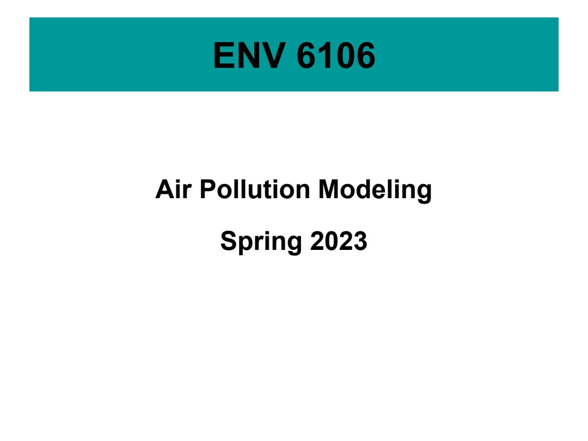

## PDF page 2

Source locator: `ENV6106-04-plume-rise-downwash`, PDF p. 2. [Original PDF page](../../originals/6106/04_Plume_Rise_Downwash.pdf#page=2).

Printed slide number candidate: not identified (use PDF page as canonical locator).

Generated navigation topics: Dispersion and Gaussian models

Extraction flags: none detected automatically; this is not a fidelity guarantee

### Extracted source text

> Topics
> • Gaussian model, plume rise and downwash
> • Expectation
> – Be able to interpret how ground concentration 
> varies using Gaussian plume model
> – Understand common models for plume rise
> – Understand downwash 
> • Readings: Cooper & Alley Chapter 20.1-20.4

### Original page appearance

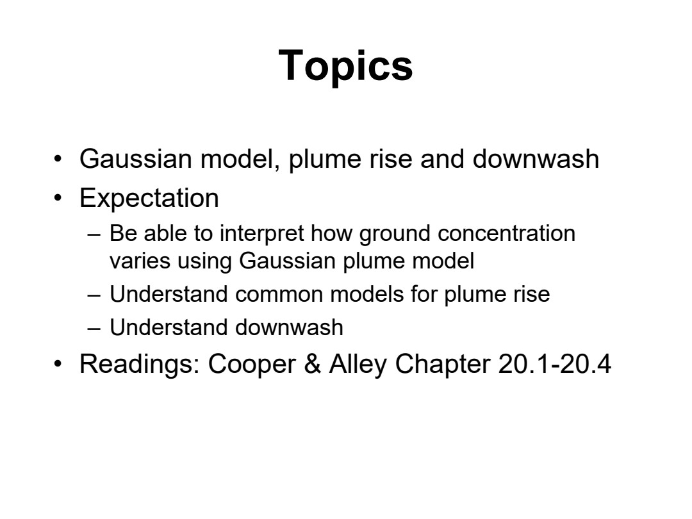

## PDF page 3

Source locator: `ENV6106-04-plume-rise-downwash`, PDF p. 3. [Original PDF page](../../originals/6106/04_Plume_Rise_Downwash.pdf#page=3).

Printed slide number candidate: not identified (use PDF page as canonical locator).

Generated navigation topics: Dispersion and Gaussian models

Extraction flags: sparse-text

### Extracted source text

> More on Gaussian model

### Original page appearance

## PDF page 4

Source locator: `ENV6106-04-plume-rise-downwash`, PDF p. 4. [Original PDF page](../../originals/6106/04_Plume_Rise_Downwash.pdf#page=4).

Printed slide number candidate: 4 (use PDF page as canonical locator).

Generated navigation topics: Dispersion and Gaussian models

Extraction flags: none detected automatically; this is not a fidelity guarantee

### Extracted source text

> Inside the time-average plume…
> 4
> (Cooper and Alley, 2002) 
> x
> y
> z
> physical 
> stack height
> effective
> stack height
> Normal distribution 
> of concentrations
> plume
> centerline

### Original page appearance

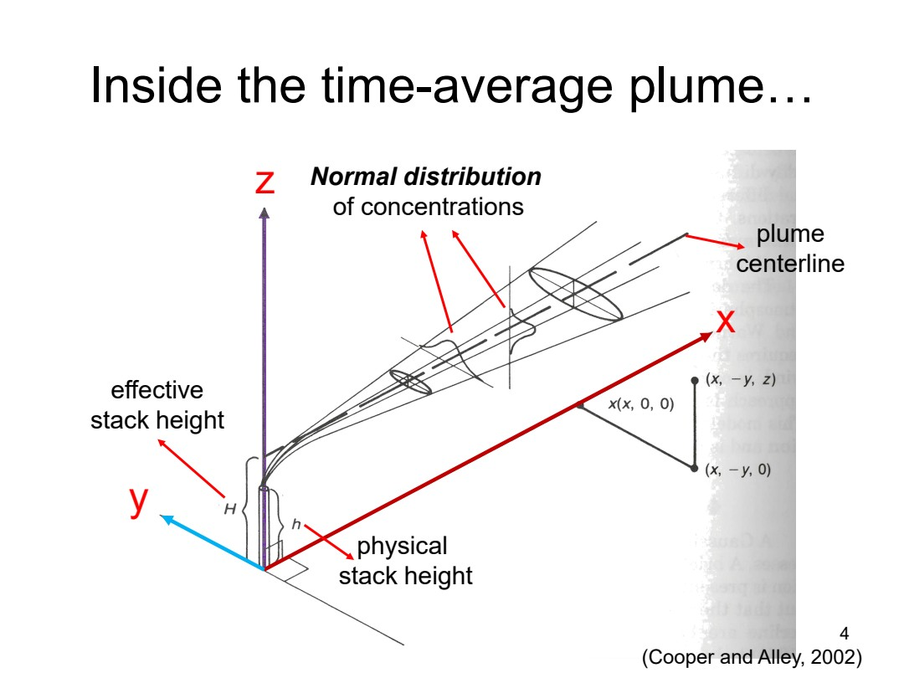

## PDF page 5

Source locator: `ENV6106-04-plume-rise-downwash`, PDF p. 5. [Original PDF page](../../originals/6106/04_Plume_Rise_Downwash.pdf#page=5).

Printed slide number candidate: 5 (use PDF page as canonical locator).

Generated navigation topics: Dispersion and Gaussian models

Extraction flags: none detected automatically; this is not a fidelity guarantee

### Extracted source text

> The Gaussian Plume Model
> 5
> • Take account into ground reflection
> Figure 20.5 (Cooper and Alley, 2002) 
> This one is the most used form of Gaussian plume model

### Original page appearance

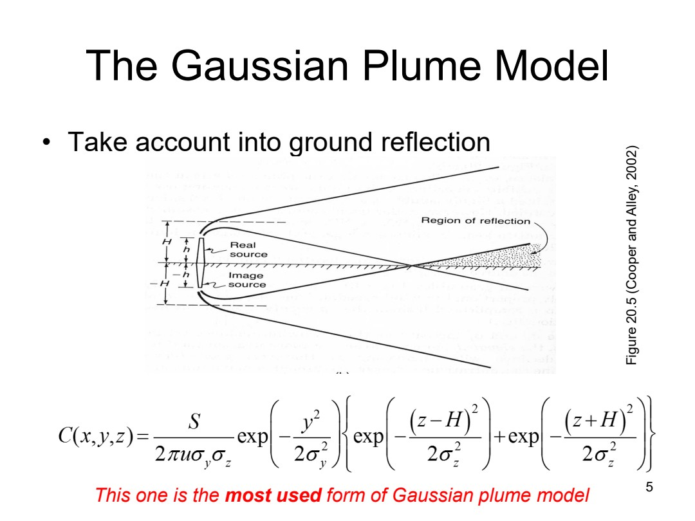

## PDF page 6

Source locator: `ENV6106-04-plume-rise-downwash`, PDF p. 6. [Original PDF page](../../originals/6106/04_Plume_Rise_Downwash.pdf#page=6).

Printed slide number candidate: not identified (use PDF page as canonical locator).

Generated navigation topics: Dispersion and Gaussian models

Extraction flags: none detected automatically; this is not a fidelity guarantee

### Extracted source text

> The Gaussian Plume Model
> • C proportional with source strength S
> • Ground C inversely proportional with stack height H 
> • Along X direction, C starts at 0, increase to maximum 
> concentration, then decreases again. The distance of 
> max concentration increases with stack height H
> • Stack height design: high enough so ground level 
> concentration not exceed certain threshold, but just high 
> enough so no need to spend un-necessary money

### Original page appearance

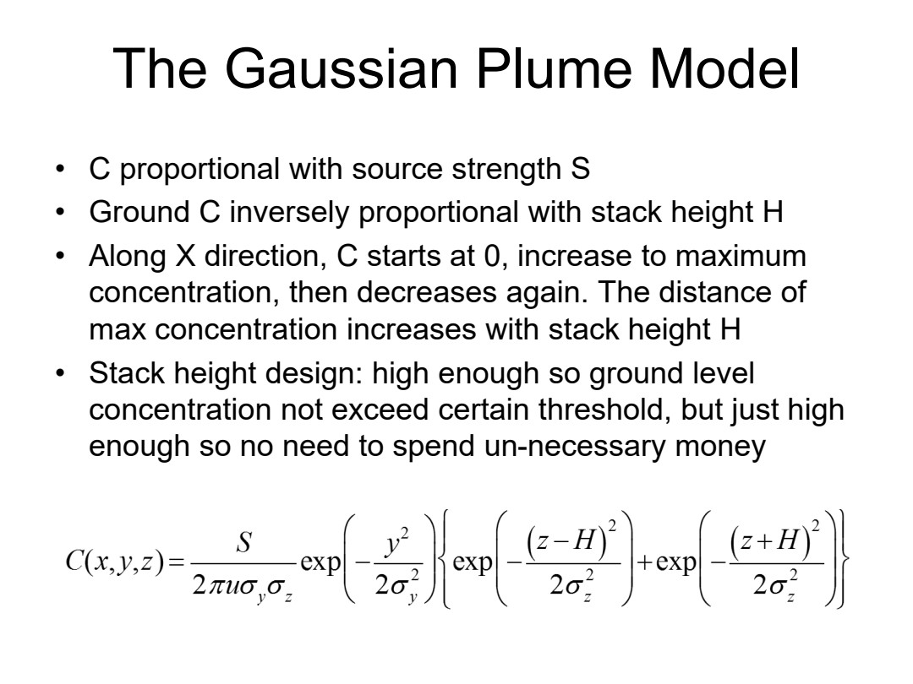

## PDF page 7

Source locator: `ENV6106-04-plume-rise-downwash`, PDF p. 7. [Original PDF page](../../originals/6106/04_Plume_Rise_Downwash.pdf#page=7).

Printed slide number candidate: not identified (use PDF page as canonical locator).

Generated navigation topics: Unclassified; inspect source.

Extraction flags: sparse-text

### Extracted source text

> Ground concentrations
> (Cooper and Alley, 2002) 

### Original page appearance

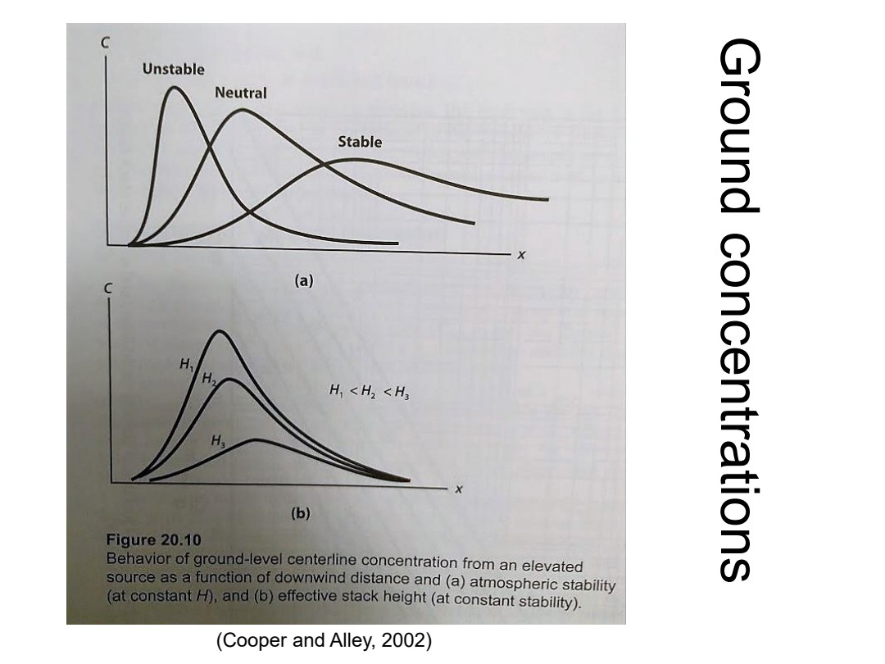

## PDF page 8

Source locator: `ENV6106-04-plume-rise-downwash`, PDF p. 8. [Original PDF page](../../originals/6106/04_Plume_Rise_Downwash.pdf#page=8).

Printed slide number candidate: not identified (use PDF page as canonical locator).

Generated navigation topics: Pollution sources and emissions

Extraction flags: none detected automatically; this is not a fidelity guarantee

### Extracted source text

> Max ground concentrations
> (Cooper and Alley, 2002) 
> Note: S, instead of Q, was used on the slides to represent emission rates

### Original page appearance

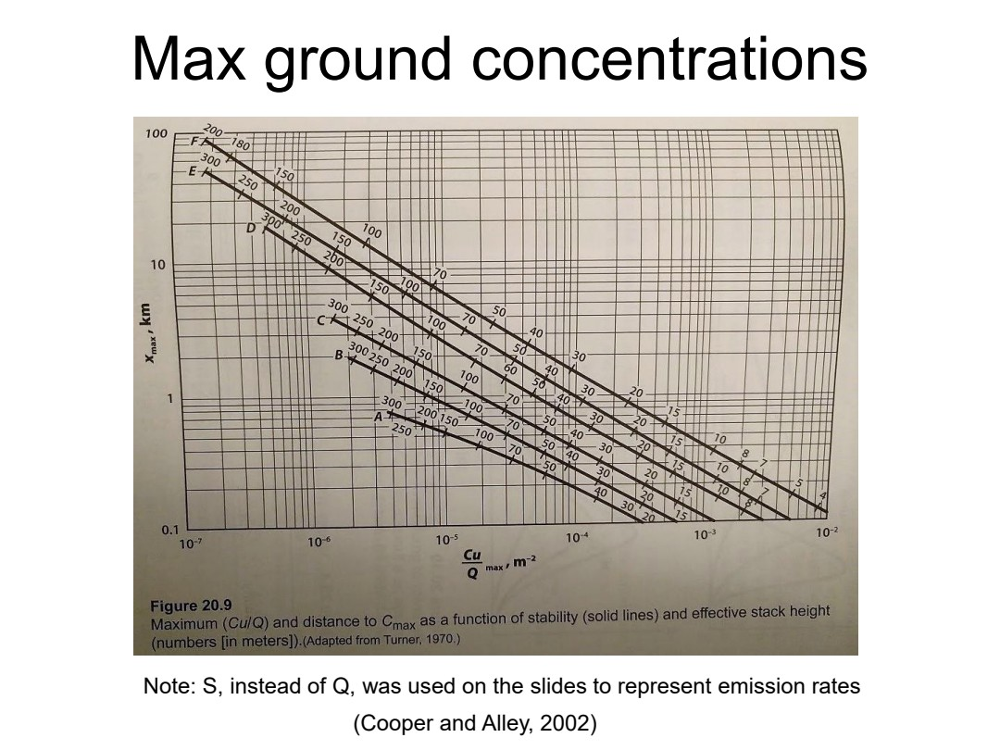

## PDF page 9

Source locator: `ENV6106-04-plume-rise-downwash`, PDF p. 9. [Original PDF page](../../originals/6106/04_Plume_Rise_Downwash.pdf#page=9).

Printed slide number candidate: not identified (use PDF page as canonical locator).

Generated navigation topics: Pollution sources and emissions

Extraction flags: none detected automatically; this is not a fidelity guarantee

### Extracted source text

> Max ground concentrations
> (Cooper and Alley, 2002) 
> Note: S, instead of Q, was used on the slides to represent emission rates
> (𝐶𝑢/𝑆)𝑚𝑎𝑥= exp[𝑎 + 𝑏 𝑙𝑛𝐻 + 𝑐 𝑙𝑛𝐻 2 + 𝑑(𝑙𝑛𝐻)3]

### Original page appearance

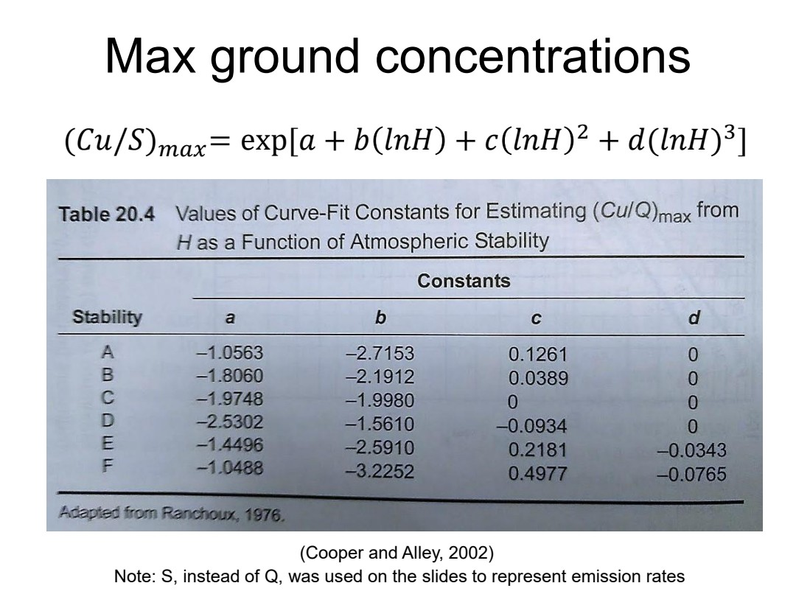

## PDF page 10

Source locator: `ENV6106-04-plume-rise-downwash`, PDF p. 10. [Original PDF page](../../originals/6106/04_Plume_Rise_Downwash.pdf#page=10).

Printed slide number candidate: not identified (use PDF page as canonical locator).

Generated navigation topics: Dispersion and Gaussian models

Extraction flags: sparse-text

### Extracted source text

> Plume rise

### Original page appearance

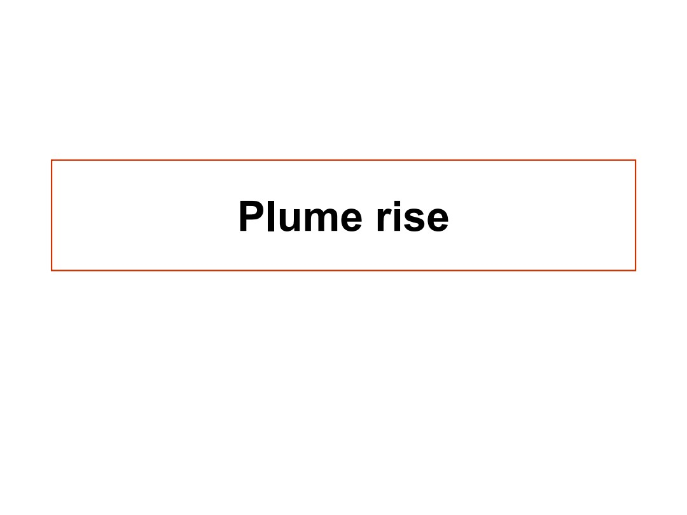

## PDF page 11

Source locator: `ENV6106-04-plume-rise-downwash`, PDF p. 11. [Original PDF page](../../originals/6106/04_Plume_Rise_Downwash.pdf#page=11).

Printed slide number candidate: 11 (use PDF page as canonical locator).

Generated navigation topics: Transport and meteorology, Dispersion and Gaussian models

Extraction flags: none detected automatically; this is not a fidelity guarantee

### Extracted source text

> Plume rise
> 11
> • Effective stack height (H) = physical + rise
> • The figure below shows a hot and bended plume
> Plume rise (Godish, 2003)
> Due to 
> momentum (speed) of exiting gases
> buoyancy (temperature) of gases
> Limited by 
> momentum (speed) of wind

### Original page appearance

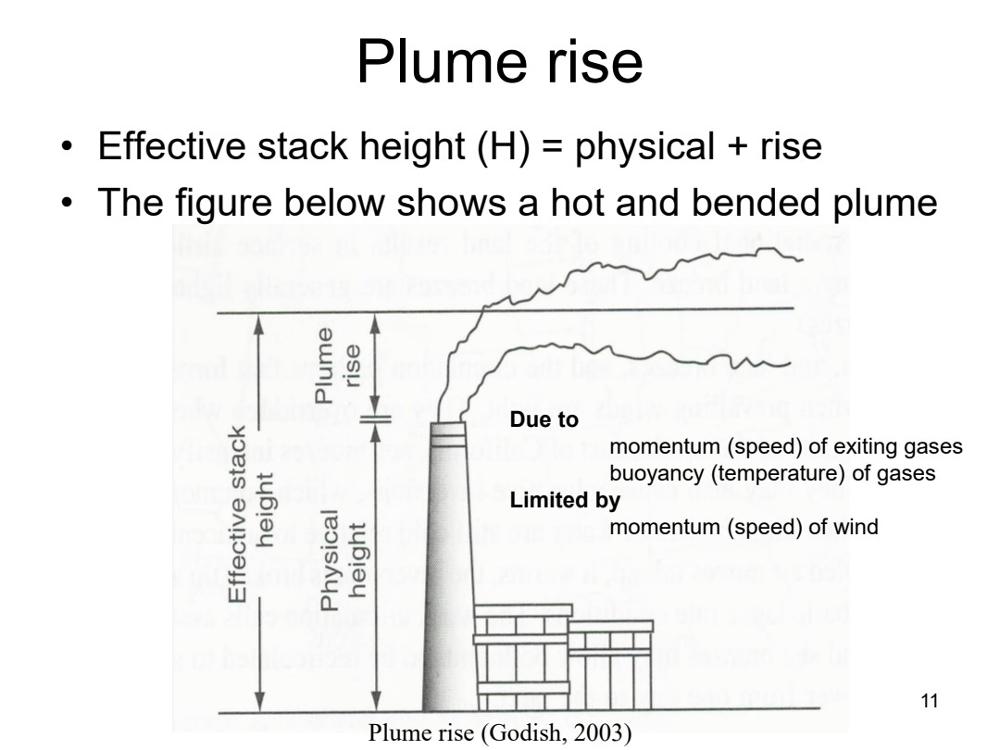

## PDF page 12

Source locator: `ENV6106-04-plume-rise-downwash`, PDF p. 12. [Original PDF page](../../originals/6106/04_Plume_Rise_Downwash.pdf#page=12).

Printed slide number candidate: not identified (use PDF page as canonical locator).

Generated navigation topics: Dispersion and Gaussian models

Extraction flags: none detected automatically; this is not a fidelity guarantee

### Extracted source text

> Plume rise
> • Plume rise is critical for Gaussian dispersion models
> • Many formulas were proposed, provide a wide range of 
> results, sometime up to 10x difference
> • We will briefly describe a few of them
> – Holland & modified Holland, CONCAWE and Briggs 
> • CONCAWE is a Dutch organization focused on oil industry
> • Mostly used is the Briggs plume rise model
> – Gary Briggs, first published in 1965, updated 1969,1970,1972
> – Empirically derived based on observational data
> – Proposed for hot, bend-over plumes, less accurate for cold and 
> wet plumes (e.g. those coming out of wet scrubber)
> – Here we discuss them in unstable and stable conditions

### Original page appearance

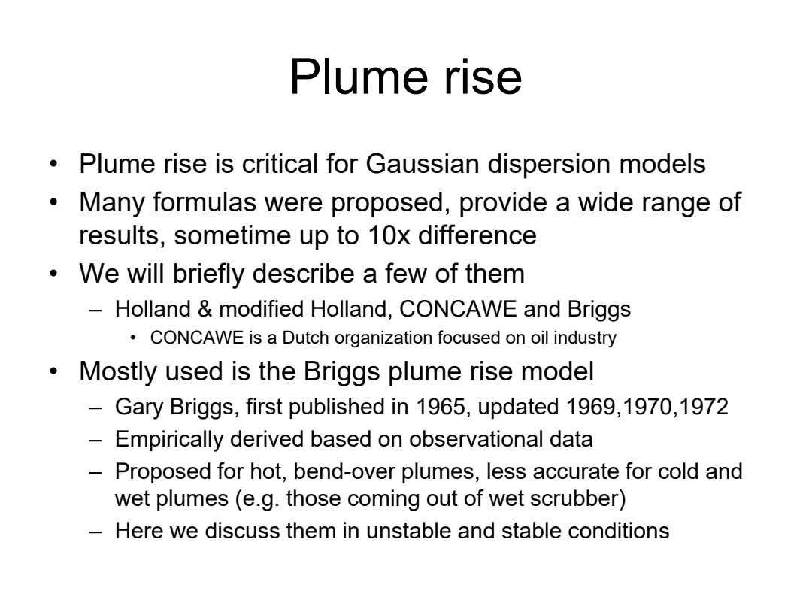

## PDF page 13

Source locator: `ENV6106-04-plume-rise-downwash`, PDF p. 13. [Original PDF page](../../originals/6106/04_Plume_Rise_Downwash.pdf#page=13).

Printed slide number candidate: not identified (use PDF page as canonical locator).

Generated navigation topics: Pollution sources and emissions, Transport and meteorology, Dispersion and Gaussian models

Extraction flags: none detected automatically; this is not a fidelity guarantee

### Extracted source text

> Height of plume rise (∆h)
> • Holland
> • Modified Holland
> • CONCAWE
> ∆ℎ = 𝑣𝑠𝑑𝑠
> 𝑢 [1.5 + 2.68(10)−3𝑃𝑎
> 𝑇𝑠 − 𝑇𝑎
> 𝑇𝑠
> 𝑑𝑠]
> ∆ℎ = 1.5 𝑣𝑠𝑑𝑠
> 𝑢 + 9.6𝑄𝐻
> 𝑢
> ∆ℎ = 101.2(𝑄𝐻)0.444
> 𝑢0.694
> vs = vel of stack gases, m/s
> ds = stack diameter at stack tip, m
> u = wind speed at stack tip, m
> Ta, Ts = abs Temp of air at stack tip, Temp of stack gases, K
> Pa = absolute pressure at stack tip, mb
> QH = heat emissions rate, MW

### Original page appearance

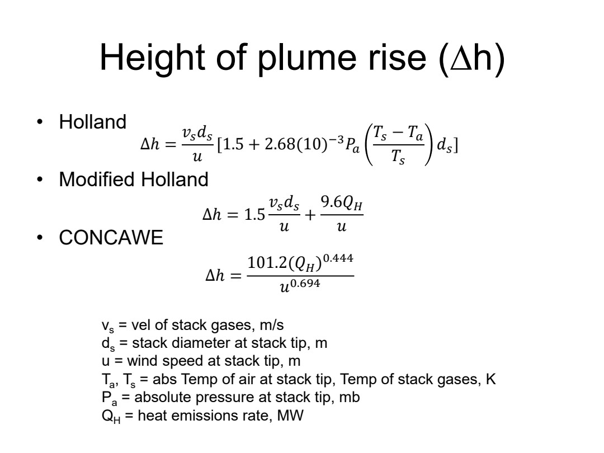

## PDF page 14

Source locator: `ENV6106-04-plume-rise-downwash`, PDF p. 14. [Original PDF page](../../originals/6106/04_Plume_Rise_Downwash.pdf#page=14).

Printed slide number candidate: not identified (use PDF page as canonical locator).

Generated navigation topics: Pollution sources and emissions, Transport and meteorology, Dispersion and Gaussian models

Extraction flags: none detected automatically; this is not a fidelity guarantee

### Extracted source text

> Briggs plume rise model
> • Neutral or unstable conditions
> – 1. Buoyancy flux term
> – 2. Distance to final plume rise (x dir) and height
> – 3. Height of plume rise
> 𝐹𝐵 = 𝑔 1 − 𝑀𝑊𝑠
> 28.9
> 𝑇𝑎
> 𝑇𝑠
> 𝑣𝑠𝑑𝑠2
> 4 + 8.9 𝑃0
> 𝑃𝑎
> 𝑄𝐻
> xf = 119 (FB)0.4 for FB >= 55 m4/s3
> xf = 49 (FB)0.625 for FB < 55 m4/s3
> ∆ℎ = 1.6 𝐹𝐵 1/3
> 𝑢 𝑥𝑓
> 2/3
> 𝑓𝑜𝑟 𝑥 ≥ 𝑥𝑓 ∆ℎ = 1.6 𝐹𝐵 1/3
> 𝑢 𝑥 2/3 𝑓𝑜𝑟 𝑥 < 𝑥𝑓
> FB = buoyancy flux, m4/s3 ; g = gravitational constant, 9.8 m/s2
> MWs = mol wt of stack gases;  vs = vel of stack gases, m/s;
> ds = stack diameter at stack tip, m; QH = heat emissions rate, MW;
> Po, Pa = absolute pressure at sea level, at stack tip, mb;
> Ta, Ts = abs Temp of air at stack tip, Temp of stack gases, K
> x = downwind distance, m; u = wind speed at stack tip, m/s
> ∆ h = plume rise, m

### Original page appearance

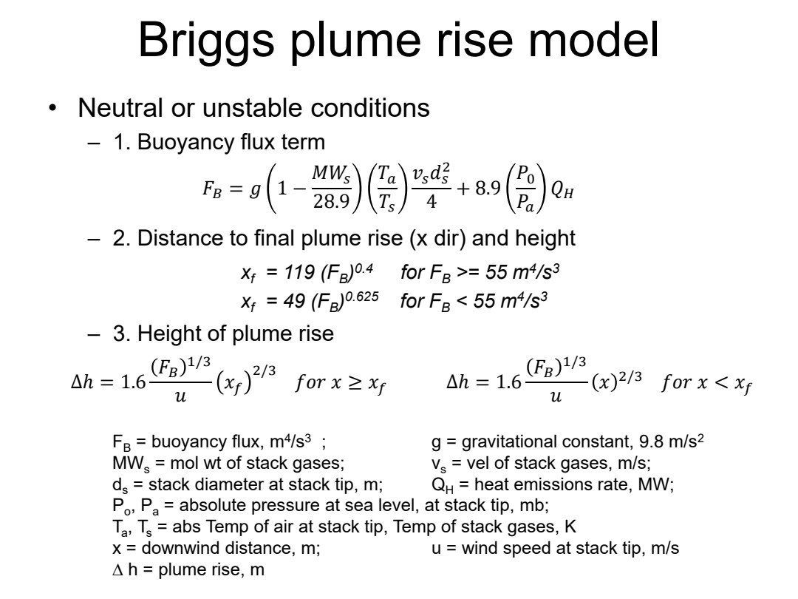

## PDF page 15

Source locator: `ENV6106-04-plume-rise-downwash`, PDF p. 15. [Original PDF page](../../originals/6106/04_Plume_Rise_Downwash.pdf#page=15).

Printed slide number candidate: not identified (use PDF page as canonical locator).

Generated navigation topics: Pollution sources and emissions, Transport and meteorology, Dispersion and Gaussian models

Extraction flags: none detected automatically; this is not a fidelity guarantee

### Extracted source text

> Briggs plume rise model
> • Stable conditions
> – 1. Buoyancy flux term
> – 2. Stability parameter
> If data not avail, use 0.02 K/m for Class E, and 0.035 K/m for Class F
> – 3. Height of plume rise
> 𝑆 = 𝑔
> 𝑇𝑎
> ∆𝜃
> ∆𝑧
> FB = buoyancy flux, m4/s3 ; g = gravitational constant, 9.8 m/s2
> MWs = mol wt of stack gases;  vs = vel of stack gases, m/s;
> ds = stack diameter at stack tip, m; QH = heat emissions rate, MW;
> Po, Pa = absolute pressure at sea level, at stack tip, mb;
> Ta, Ts = abs Temp of air at stack tip, Temp of stack gases, K
> x = downwind distance, m; u = wind speed at stack tip, m/s
> ∆ h = plume rise, m; ∆θ/∆z: potential T gradient, K/m
> 𝜃 = 𝑇 𝑃0
> 𝑃𝑎
> 𝑅/𝑐𝑝
> ∆ℎ = 2.6 𝐹𝐵
> 𝑢𝑆
> 1/3
> 𝑓𝑜𝑟 𝑢 ≥ 1.5 𝑚/𝑠 ∆ℎ = 5𝐹𝐵
> 0.25𝑆−0.375 𝑓𝑜𝑟 𝑢 < 1.5 𝑚/𝑠
> 𝐹𝐵 = 𝑔 1 − 𝑀𝑊𝑠
> 28.9
> 𝑇𝑎
> 𝑇𝑠
> 𝑣𝑠𝑑𝑠2
> 4 + 8.9 𝑃0
> 𝑃𝑎
> 𝑄𝐻

### Original page appearance

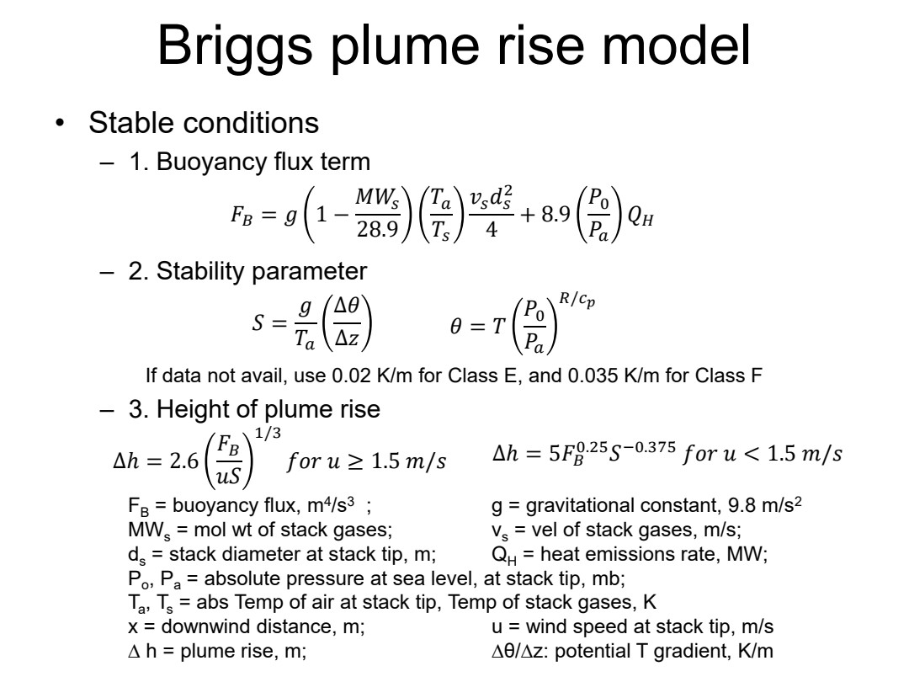

## PDF page 16

Source locator: `ENV6106-04-plume-rise-downwash`, PDF p. 16. [Original PDF page](../../originals/6106/04_Plume_Rise_Downwash.pdf#page=16).

Printed slide number candidate: not identified (use PDF page as canonical locator).

Generated navigation topics: Transport and meteorology, Dispersion and Gaussian models

Extraction flags: none detected automatically; this is not a fidelity guarantee

### Extracted source text

> Max ground concentrations
> • Max ground concentration does not always 
> occur at minimum wind speed
> – Yes, C inversely associated with u
> – But, plume rise is also inversely associated with u
> • The wind speed that results in max ground 
> concentration is called critical wind speed

### Original page appearance

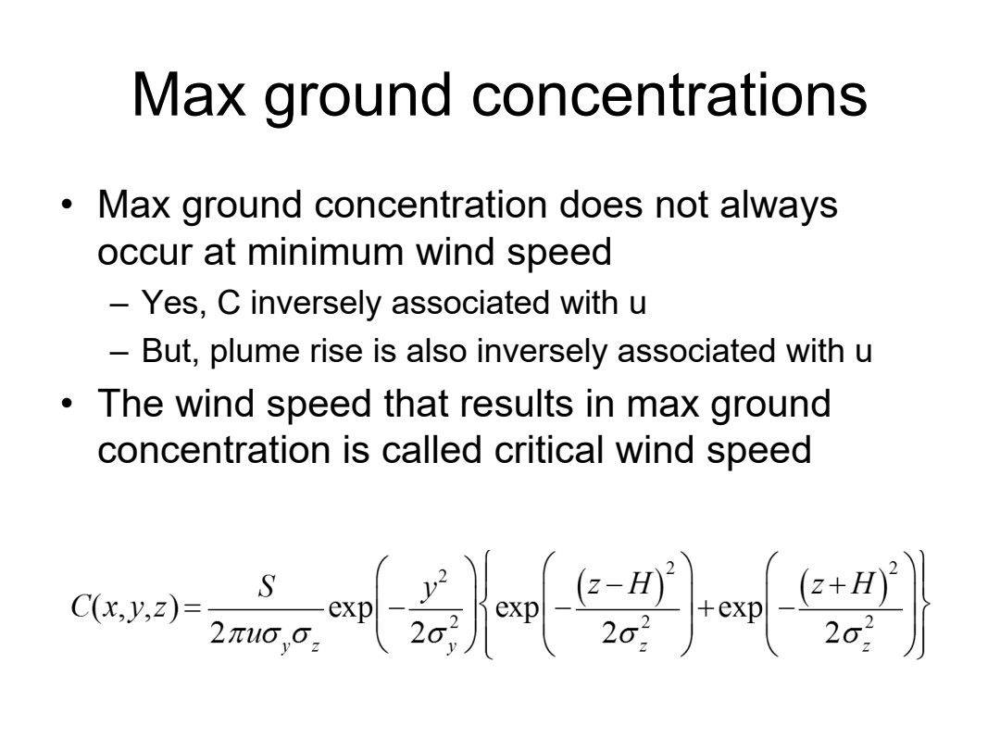

## PDF page 17

Source locator: `ENV6106-04-plume-rise-downwash`, PDF p. 17. [Original PDF page](../../originals/6106/04_Plume_Rise_Downwash.pdf#page=17).

Printed slide number candidate: not identified (use PDF page as canonical locator).

Generated navigation topics: Dispersion and Gaussian models

Extraction flags: sparse-text

### Extracted source text

> Downwash

### Original page appearance

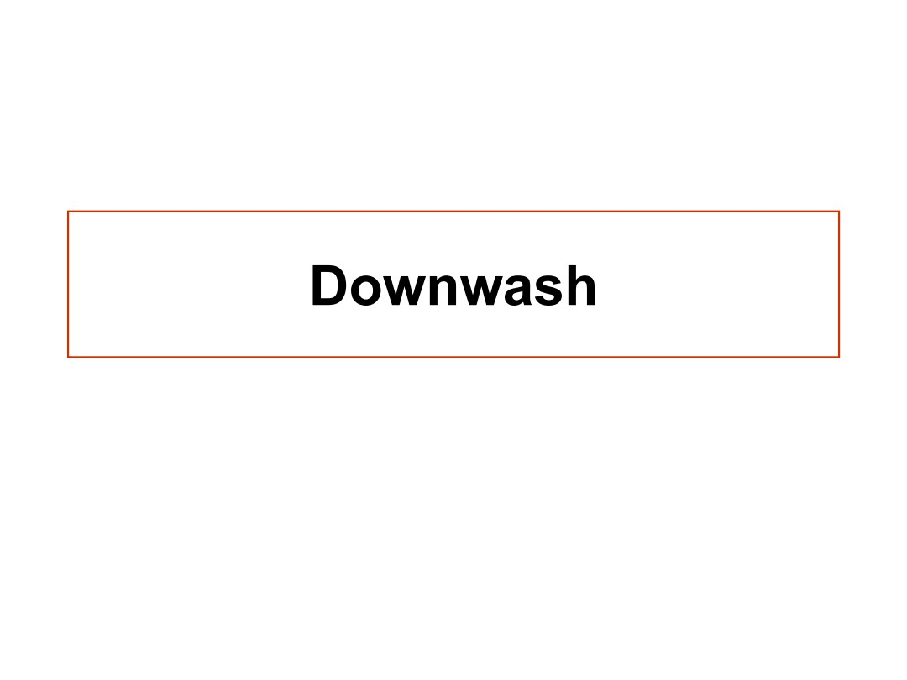

## PDF page 18

Source locator: `ENV6106-04-plume-rise-downwash`, PDF p. 18. [Original PDF page](../../originals/6106/04_Plume_Rise_Downwash.pdf#page=18).

Printed slide number candidate: not identified (use PDF page as canonical locator).

Generated navigation topics: Transport and meteorology, Dispersion and Gaussian models

Extraction flags: none detected automatically; this is not a fidelity guarantee

### Extracted source text

> Downwash
> • As wind blows past blunt objects, flow 
> disturbances occur, and low pressure zones are 
> created.  Depending on wind speed, vortexes 
> and eddies are formed. These eddies can trap 
> stack releases and bring them quickly to the 
> ground. 
> Example 1: https://www.youtube.com/watch?v=o3wPbPgQBhA
> Example 2: https://www.youtube.com/watch?v=OqRUtRytanI

### Original page appearance

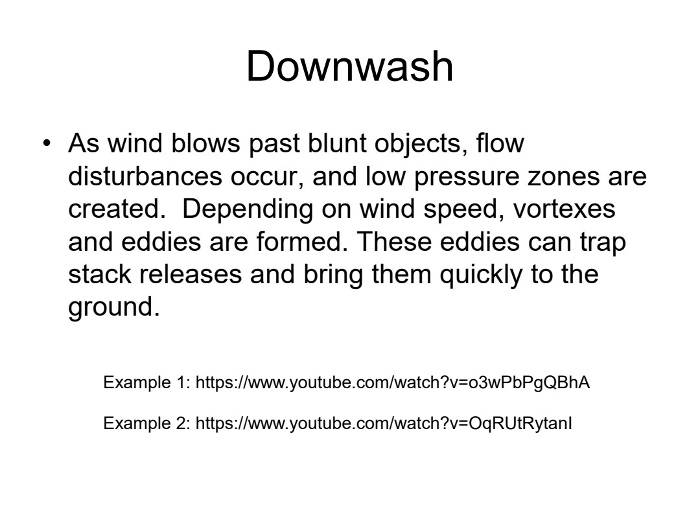

## PDF page 19

Source locator: `ENV6106-04-plume-rise-downwash`, PDF p. 19. [Original PDF page](../../originals/6106/04_Plume_Rise_Downwash.pdf#page=19).

Printed slide number candidate: not identified (use PDF page as canonical locator).

Generated navigation topics: Transport and meteorology, Dispersion and Gaussian models

Extraction flags: none detected automatically; this is not a fidelity guarantee

### Extracted source text

> Downwash
> • Most dispersion models has taken account the effect of 
> downwash
> • Many models, such as AERMOD, uses PRIME (plume 
> rise model enhancements). More information see 
> Schulman et al 2000
> – https://doi.org/10.1080/10473289.2000.10464017
> • Ways to reduce downwash:
> – Increase exit velocity  smaller diameter
> • 1.5 times expected maximum stack tip velocity
> – Engineering method, turning wind

### Original page appearance

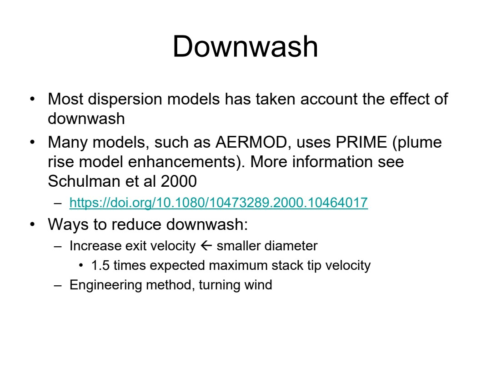
