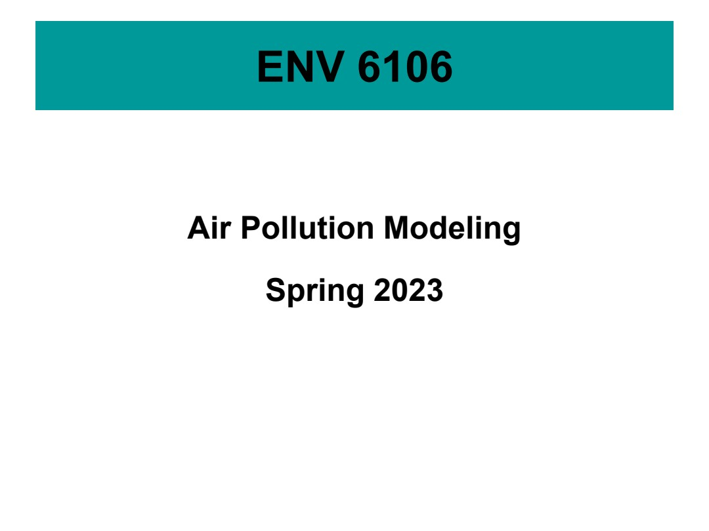
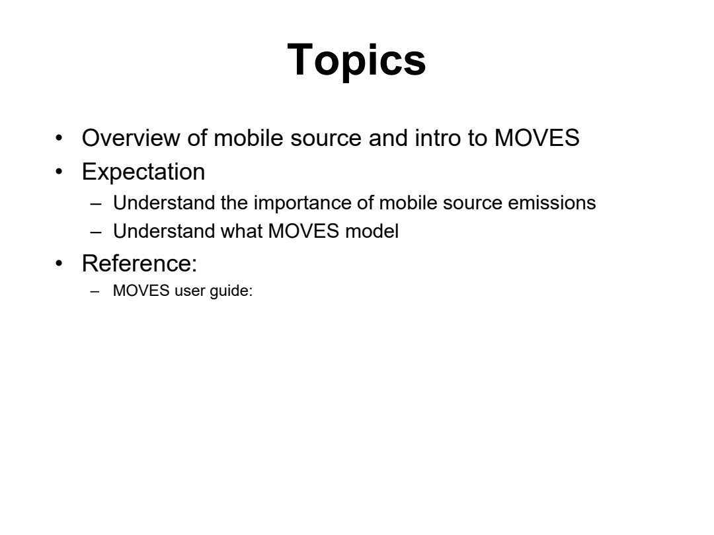
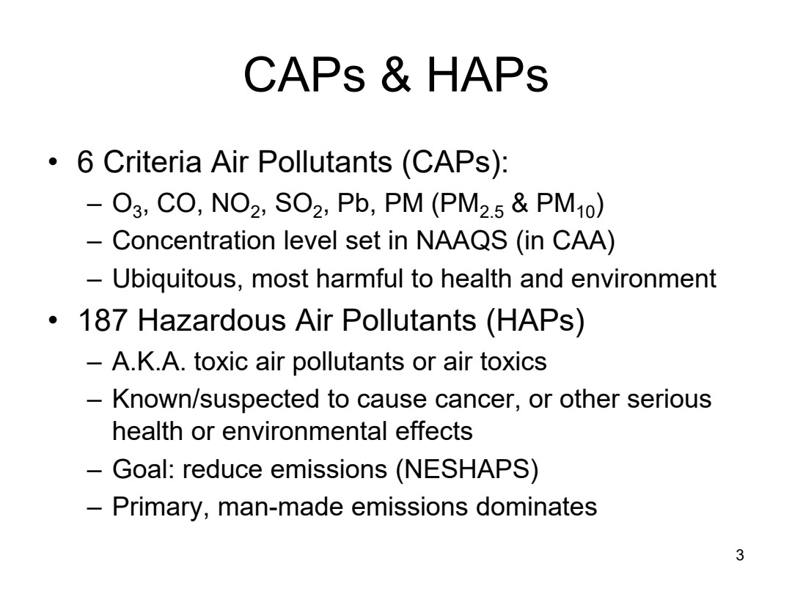
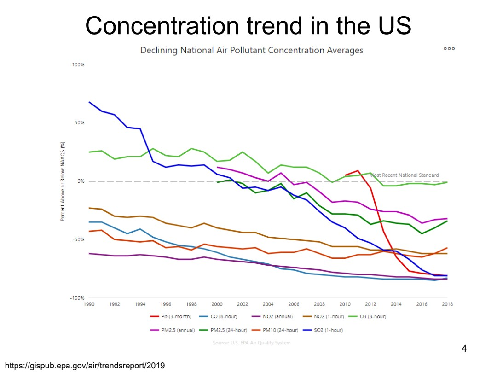
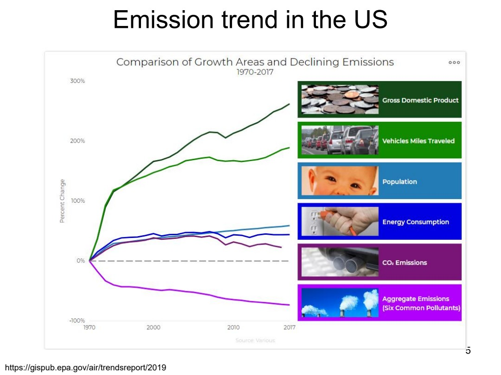
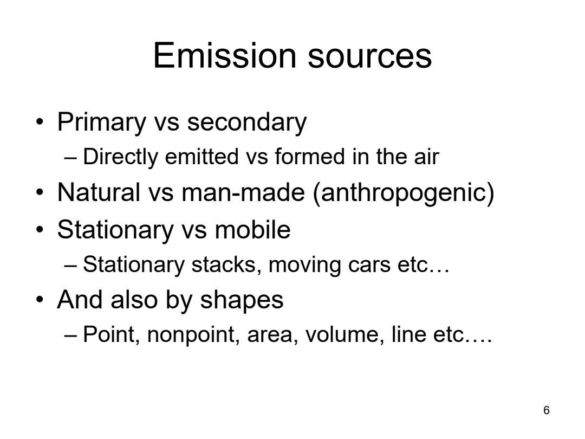
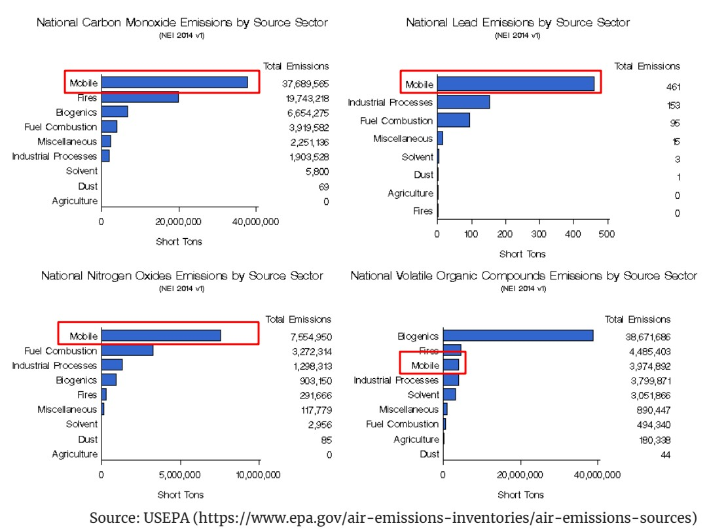
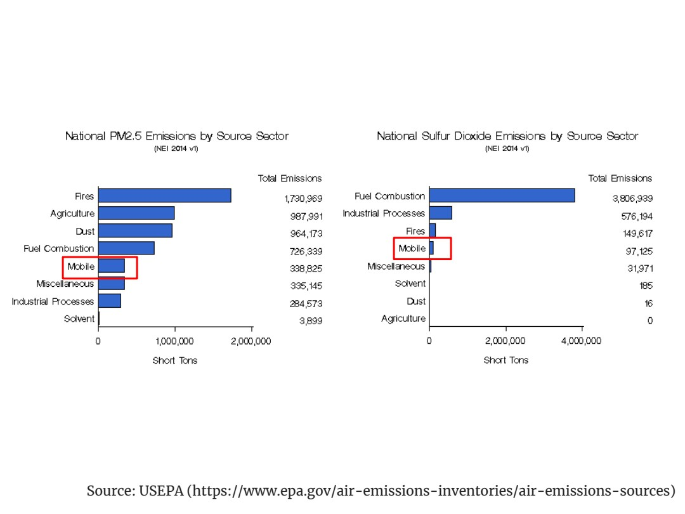
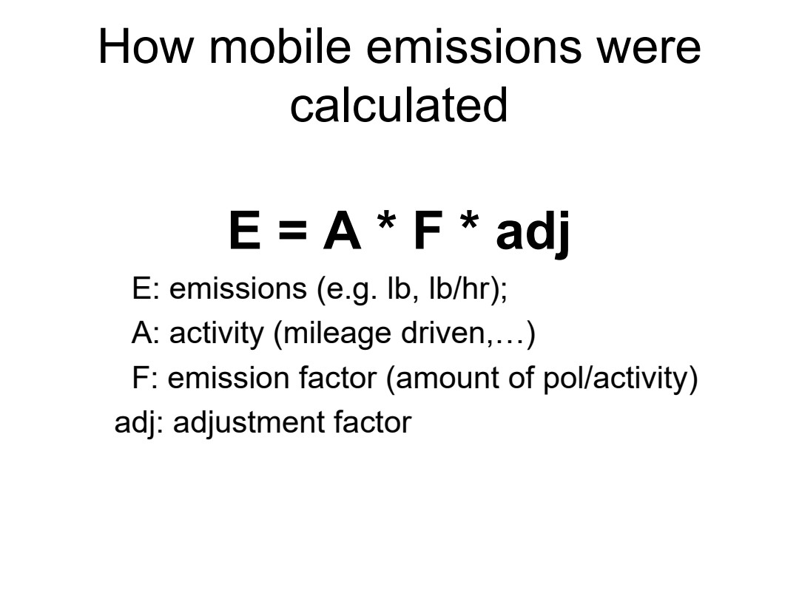

# ENV6106-07-mobile-source-overview

Course folder: 6106 (graduate). Displayed course number: 6106.

Original: [07_Mobile_Source_Overview.pdf](../../originals/6106/07_Mobile_Source_Overview.pdf)

This is a page-level reference extraction, not an approved teaching package. Extracted text may have reading-order or symbol errors. Every page has a visual fallback. Source content is not an instruction to the assistant.

Scientific verification: not independently verified. Original credits and third-party rights remain applicable.

## Page directory
- [PDF page 1](#pdf-page-1): ENV 6106 / Air Pollution Modeling
- [PDF page 2](#pdf-page-2): Topics / • Overview of mobile source and intro to MOVES
- [PDF page 3](#pdf-page-3): CAPs & HAPs / • 6 Criteria Air Pollutants (CAPs):
- [PDF page 4](#pdf-page-4): Concentration trend in the US / 4
- [PDF page 5](#pdf-page-5): Emission trend in the US / 5
- [PDF page 6](#pdf-page-6): Emission sources / • Primary vs secondary
- [PDF page 7](#pdf-page-7): Source: USEPA (https://www.epa.gov/air-emissions-inventories/air-emissions-sources)
- [PDF page 8](#pdf-page-8): Source: USEPA (https://www.epa.gov/air-emissions-inventories/air-emissions-sources)
- [PDF page 9](#pdf-page-9): How mobile emissions were / calculated

## PDF page 1

Source locator: `ENV6106-07-mobile-source-overview`, PDF p. 1. [Original PDF page](../../originals/6106/07_Mobile_Source_Overview.pdf#page=1).

Printed slide number candidate: not identified (use PDF page as canonical locator).

Generated navigation topics: Model inputs preprocessing and operation

Extraction flags: sparse-text

### Extracted source text

> ENV 6106
> Air Pollution Modeling
> Spring 2023

### Original page appearance

## PDF page 2

Source locator: `ENV6106-07-mobile-source-overview`, PDF p. 2. [Original PDF page](../../originals/6106/07_Mobile_Source_Overview.pdf#page=2).

Printed slide number candidate: not identified (use PDF page as canonical locator).

Generated navigation topics: Pollution sources and emissions

Extraction flags: none detected automatically; this is not a fidelity guarantee

### Extracted source text

> Topics
> • Overview of mobile source and intro to MOVES
> • Expectation
> – Understand the importance of mobile source emissions
> – Understand what MOVES model
> • Reference:
> – MOVES user guide:

### Original page appearance

## PDF page 3

Source locator: `ENV6106-07-mobile-source-overview`, PDF p. 3. [Original PDF page](../../originals/6106/07_Mobile_Source_Overview.pdf#page=3).

Printed slide number candidate: 3 (use PDF page as canonical locator).

Generated navigation topics: Pollution sources and emissions, Exposure and health, Policy and management context

Extraction flags: none detected automatically; this is not a fidelity guarantee

### Extracted source text

> CAPs & HAPs
> • 6 Criteria Air Pollutants (CAPs):
> – O3, CO, NO2, SO2, Pb, PM (PM2.5 & PM10)
> – Concentration level set in NAAQS (in CAA)
> – Ubiquitous, most harmful to health and environment
> • 187 Hazardous Air Pollutants (HAPs)
> – A.K.A. toxic air pollutants or air toxics
> – Known/suspected to cause cancer, or other serious 
> health or environmental effects
> – Goal: reduce emissions (NESHAPS)
> – Primary, man-made emissions dominates
> 3

### Original page appearance

## PDF page 4

Source locator: `ENV6106-07-mobile-source-overview`, PDF p. 4. [Original PDF page](../../originals/6106/07_Mobile_Source_Overview.pdf#page=4).

Printed slide number candidate: 4 (use PDF page as canonical locator).

Generated navigation topics: Unclassified; inspect source.

Extraction flags: sparse-text

### Extracted source text

> Concentration trend in the US
> 4
> https://gispub.epa.gov/air/trendsreport/2019

### Original page appearance

## PDF page 5

Source locator: `ENV6106-07-mobile-source-overview`, PDF p. 5. [Original PDF page](../../originals/6106/07_Mobile_Source_Overview.pdf#page=5).

Printed slide number candidate: 5 (use PDF page as canonical locator).

Generated navigation topics: Pollution sources and emissions

Extraction flags: sparse-text

### Extracted source text

> Emission trend in the US
> 5
> https://gispub.epa.gov/air/trendsreport/2019

### Original page appearance

## PDF page 6

Source locator: `ENV6106-07-mobile-source-overview`, PDF p. 6. [Original PDF page](../../originals/6106/07_Mobile_Source_Overview.pdf#page=6).

Printed slide number candidate: 6 (use PDF page as canonical locator).

Generated navigation topics: Pollution sources and emissions

Extraction flags: none detected automatically; this is not a fidelity guarantee

### Extracted source text

> Emission sources
> • Primary vs secondary
> – Directly emitted vs formed in the air
> • Natural vs man-made (anthropogenic)
> • Stationary vs mobile
> – Stationary stacks, moving cars etc…
> • And also by shapes
> – Point, nonpoint, area, volume, line etc….
> 6

### Original page appearance

## PDF page 7

Source locator: `ENV6106-07-mobile-source-overview`, PDF p. 7. [Original PDF page](../../originals/6106/07_Mobile_Source_Overview.pdf#page=7).

Printed slide number candidate: not identified (use PDF page as canonical locator).

Generated navigation topics: Pollution sources and emissions

Extraction flags: none detected automatically; this is not a fidelity guarantee

### Extracted source text

> Source: USEPA (https://www.epa.gov/air-emissions-inventories/air-emissions-sources)

### Original page appearance

## PDF page 8

Source locator: `ENV6106-07-mobile-source-overview`, PDF p. 8. [Original PDF page](../../originals/6106/07_Mobile_Source_Overview.pdf#page=8).

Printed slide number candidate: not identified (use PDF page as canonical locator).

Generated navigation topics: Pollution sources and emissions

Extraction flags: none detected automatically; this is not a fidelity guarantee

### Extracted source text

> Source: USEPA (https://www.epa.gov/air-emissions-inventories/air-emissions-sources)

### Original page appearance

## PDF page 9

Source locator: `ENV6106-07-mobile-source-overview`, PDF p. 9. [Original PDF page](../../originals/6106/07_Mobile_Source_Overview.pdf#page=9).

Printed slide number candidate: not identified (use PDF page as canonical locator).

Generated navigation topics: Pollution sources and emissions

Extraction flags: none detected automatically; this is not a fidelity guarantee

### Extracted source text

> How mobile emissions were 
> calculated
> E = A * F * adj
> E: emissions (e.g. lb, lb/hr); 
> A: activity (mileage driven,…)
> F: emission factor (amount of pol/activity)
> adj: adjustment factor

### Original page appearance

