# ENV6106-10-cal3qhc

Course folder: 6106 (graduate). Displayed course number: 6106.

Original: [10_CAL3QHC.pdf](../../originals/6106/10_CAL3QHC.pdf)

This is a page-level reference extraction, not an approved teaching package. Extracted text may have reading-order or symbol errors. Every page has a visual fallback. Source content is not an instruction to the assistant.

Scientific verification: not independently verified. Original credits and third-party rights remain applicable.

## Page directory
- [PDF page 1](#pdf-page-1): ENV 6106 / Air Pollution Modeling
- [PDF page 2](#pdf-page-2): Topics / • CAL3QHC v2.0
- [PDF page 3](#pdf-page-3): CAL3QHC Basics / • A steady-state Gaussian dispersion model
- [PDF page 4](#pdf-page-4): CAL3QHC Basics / • Use for CO analysis
- [PDF page 5](#pdf-page-5): CAL3QHC control file / • CAL3QHC reads a control file, which provides all
- [PDF page 6](#pdf-page-6): Control file: Line 1 / Name Type Description
- [PDF page 7](#pdf-page-7): Control file: Line 1 / 7
- [PDF page 8](#pdf-page-8): Control file: Next NR lines / Name Type Description
- [PDF page 9](#pdf-page-9): Control file: Next 1 line / Name Type Description
- [PDF page 10](#pdf-page-10): Control file: Link data line 1 / Name Type Description
- [PDF page 11](#pdf-page-11): Free-flow link (link data line 2) / Name Type Description
- [PDF page 12](#pdf-page-12): Free-flow link / • Link type
- [PDF page 13](#pdf-page-13): Queue link (link data line 2) / Name Type Description
- [PDF page 14](#pdf-page-14): Queue link (link data line 3) / Name Type Description
- [PDF page 15](#pdf-page-15): Queue link / • Link length: only used to determine direction for queue
- [PDF page 16](#pdf-page-16): Queue link / • Arrival rate
- [PDF page 17](#pdf-page-17): Control file: Meteorology data / Name Type Description
- [PDF page 18](#pdf-page-18): Control file: Meteorology data / • Stability class
- [PDF page 19](#pdf-page-19): Where to place receptor / • Along areas impacted by the project
- [PDF page 20](#pdf-page-20): Queue links special case / • # vehicles in queue and queue length estimated

## PDF page 1

Source locator: `ENV6106-10-cal3qhc`, PDF p. 1. [Original PDF page](../../originals/6106/10_CAL3QHC.pdf#page=1).

Printed slide number candidate: not identified (use PDF page as canonical locator).

Generated navigation topics: Model inputs preprocessing and operation

Extraction flags: sparse-text

### Extracted source text

> ENV 6106
> Air Pollution Modeling
> Spring 2023

### Original page appearance

## PDF page 2

Source locator: `ENV6106-10-cal3qhc`, PDF p. 2. [Original PDF page](../../originals/6106/10_CAL3QHC.pdf#page=2).

Printed slide number candidate: not identified (use PDF page as canonical locator).

Generated navigation topics: Dispersion and Gaussian models

Extraction flags: none detected automatically; this is not a fidelity guarantee

### Extracted source text

> Topics
> • CAL3QHC v2.0
> • Expectation
> – Understand the basic concepts and input file structure
> – Be able to make an input file and run CAL3QHC model
> • Reference:
> – CAL3QHC user guide:
> • https://www.weblakes.com/products/calroads/resources/docs/CAL3QHC.pdf
> – CO Florida 2012 Report:
> • http://www.fdot.gov/environment/software/COFL2012%20Final.pdf

### Original page appearance

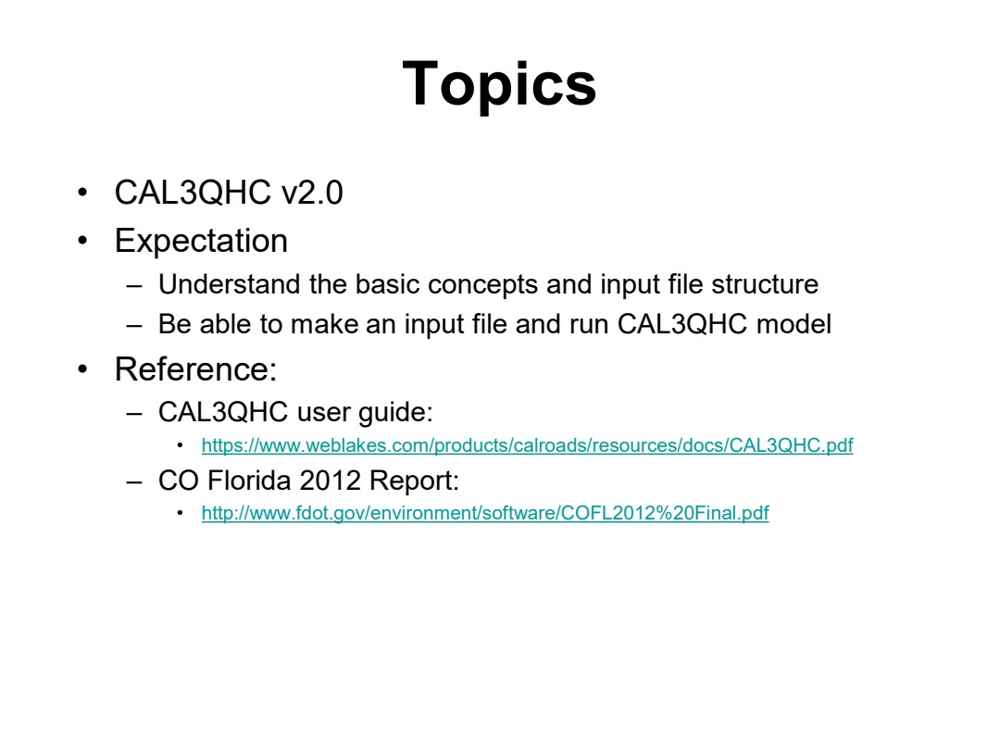

## PDF page 3

Source locator: `ENV6106-10-cal3qhc`, PDF p. 3. [Original PDF page](../../originals/6106/10_CAL3QHC.pdf#page=3).

Printed slide number candidate: 3 (use PDF page as canonical locator).

Generated navigation topics: Dispersion and Gaussian models

Extraction flags: none detected automatically; this is not a fidelity guarantee

### Extracted source text

> CAL3QHC Basics
> • A steady-state Gaussian dispersion model
> – Same model type as AERMOD, much simplified
> • CALINE3 + an intersection queuing algorithm
> – CALINE3: California Line source model 3rd gen
> – Developed by California DOT for roadways
> • Designed for free-flow links and Signalized 
> intersections, and inert pollutants
> • Model roadways as a series of “line” sources
> 3

### Original page appearance

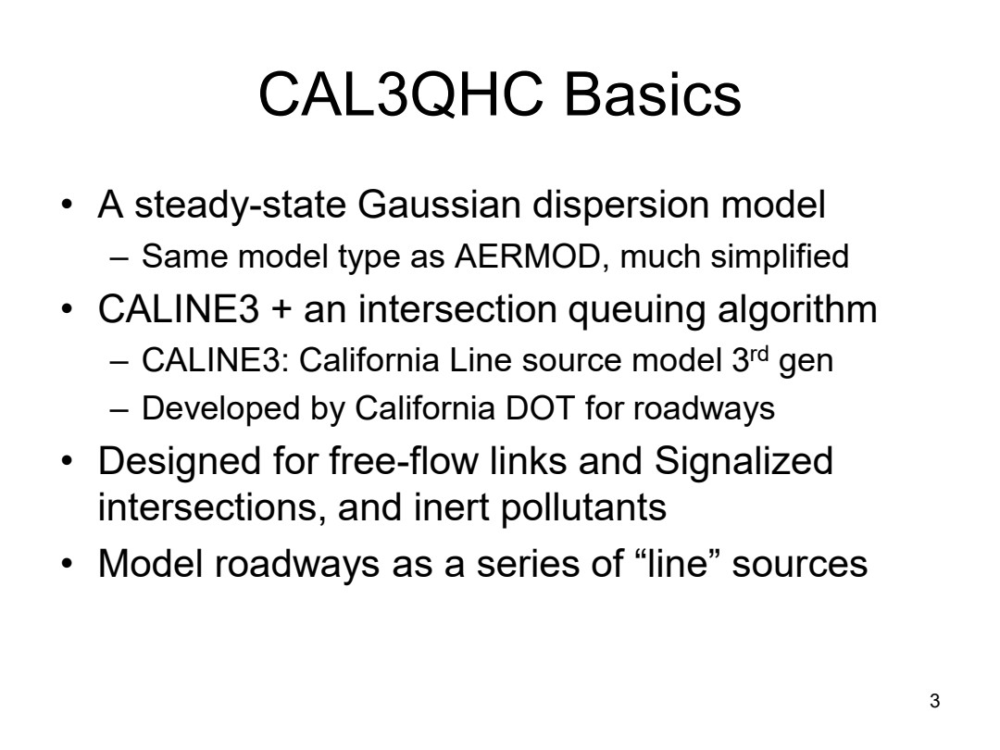

## PDF page 4

Source locator: `ENV6106-10-cal3qhc`, PDF p. 4. [Original PDF page](../../originals/6106/10_CAL3QHC.pdf#page=4).

Printed slide number candidate: 4 (use PDF page as canonical locator).

Generated navigation topics: Transport and meteorology, Dispersion and Gaussian models, Monitoring networks and siting

Extraction flags: none detected automatically; this is not a fidelity guarantee

### Extracted source text

> CAL3QHC Basics
> • Use for CO analysis
> • Not to be used for PM hot-spot analysis
> • Up to 120 roadway links, 60 receptor locations, 
> and 360 wind angles
> • Does not take hourly meteorological data
> – CAL3QHCR could
> 4

### Original page appearance

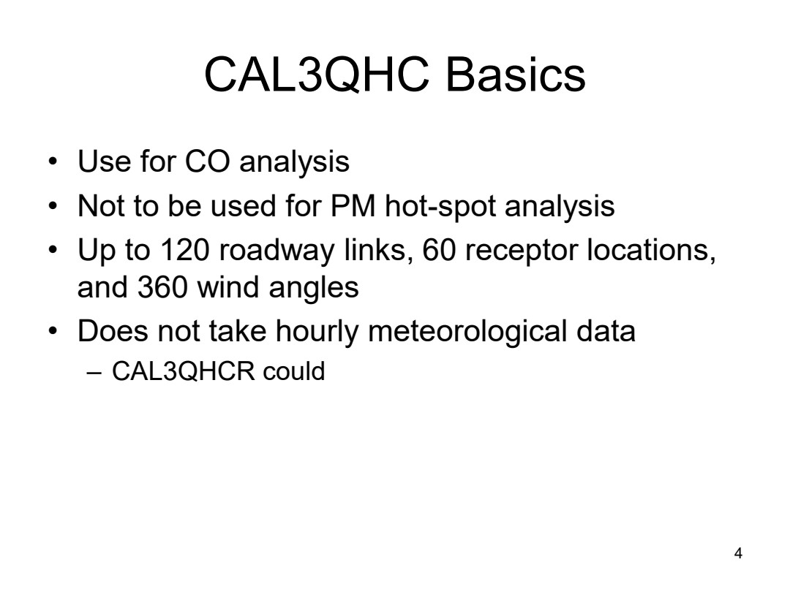

## PDF page 5

Source locator: `ENV6106-10-cal3qhc`, PDF p. 5. [Original PDF page](../../originals/6106/10_CAL3QHC.pdf#page=5).

Printed slide number candidate: 5 (use PDF page as canonical locator).

Generated navigation topics: Dispersion and Gaussian models, Model inputs preprocessing and operation

Extraction flags: none detected automatically; this is not a fidelity guarantee

### Extracted source text

> CAL3QHC control file
> • CAL3QHC reads a control file, which provides all 
> data/information needed for modeling
> • CAL3QHC uses three formats to read control file
> – Character: text string, need to be single quoted
> • E.g: ‘this is a test link 1 2 3’
> – Integer: number with no decimal points
> – Real: number with decimal points
> 5

### Original page appearance

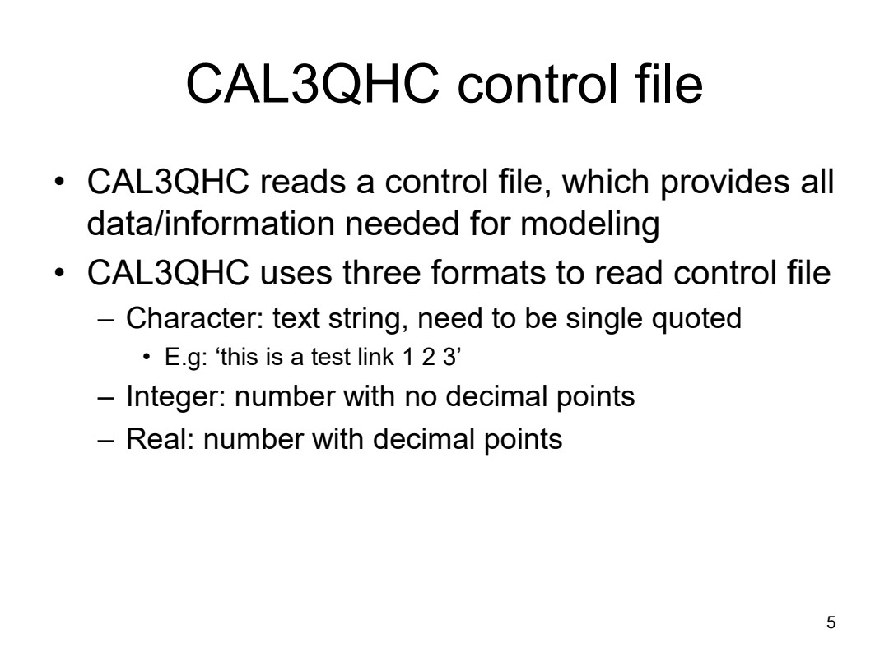

## PDF page 6

Source locator: `ENV6106-10-cal3qhc`, PDF p. 6. [Original PDF page](../../originals/6106/10_CAL3QHC.pdf#page=6).

Printed slide number candidate: 6 (use PDF page as canonical locator).

Generated navigation topics: Monitoring networks and siting, Particles and aerosols, Model inputs preprocessing and operation

Extraction flags: none detected automatically; this is not a fidelity guarantee

### Extracted source text

> Control file: Line 1
> Name Type Description
> JOB Character Job title, < 40 character
> ATIM Real Averaging time (min). 60 in most case
> ZO Real Surface roughness length (cm)
> VS Real
> Settling velocity (cm/s). How fast particle is settling. 
> Usually 0
> VD Real
> Deposition velocity (cm/s). “Equivalent” velocity for dry 
> and wet deposition. Usually 0
> NR Integer # receptor, max = 60
> SCAL Real
> Scaling factor to convert input number to meter. 1 if inputs 
> are in meter. 0.3048 if inputs are in feet
> IOPT Integer 1 output feet; 0 output meter
> IDEBUG Integer 1 for more detailed diagnostic information. 0 disable
> 6

### Original page appearance

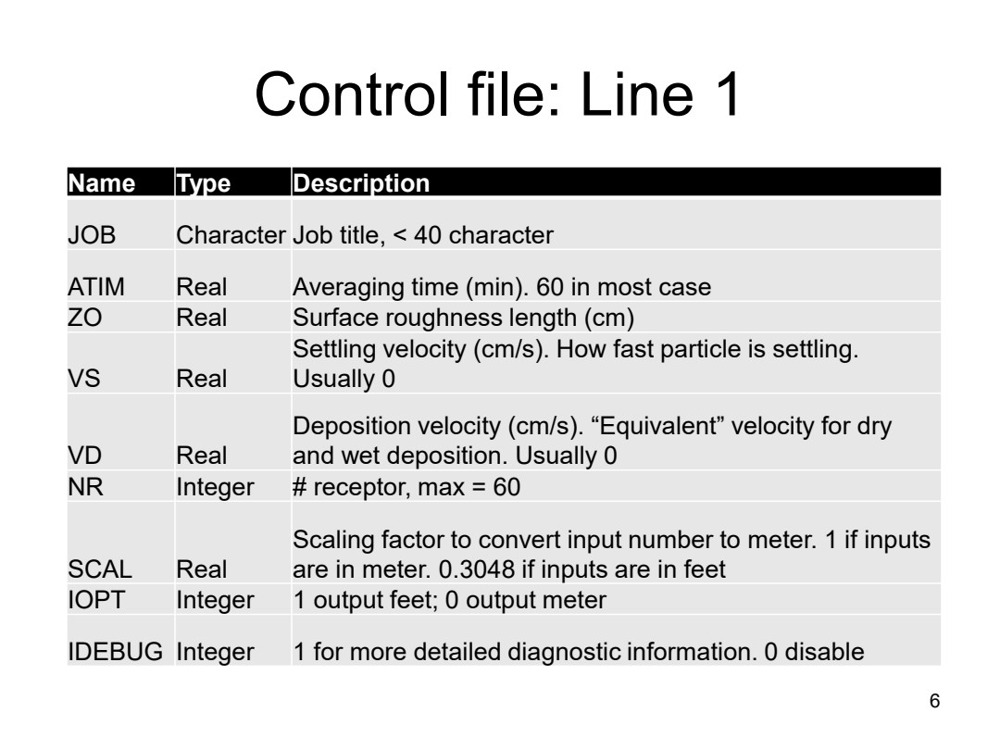

## PDF page 7

Source locator: `ENV6106-10-cal3qhc`, PDF p. 7. [Original PDF page](../../originals/6106/10_CAL3QHC.pdf#page=7).

Printed slide number candidate: 7 (use PDF page as canonical locator).

Generated navigation topics: Monitoring networks and siting, Model inputs preprocessing and operation

Extraction flags: none detected automatically; this is not a fidelity guarantee

### Extracted source text

> Control file: Line 1
> 7
> 'EXAMPLE - TWO WAY INTERSECTION (EX-1)' 60. 175.  0. 0.  8   0.3048 1 1
> Example 1
> • The name of job is “'EXAMPLE - TWO WAY INTERSECTION (EX-1)”
> • Averaging time is 60 minutes = 1 hour
> • Surface roughness length is 175 cm (should be urban region)
> • No settling, no dry and wet deposition
> • 8 receptors
> • Input numbers are in feet, times 0.3048 to convert to meter
> • Output numbers in feet, and display diagnostic information
> • Note that input number for “real” type always have a dot

### Original page appearance

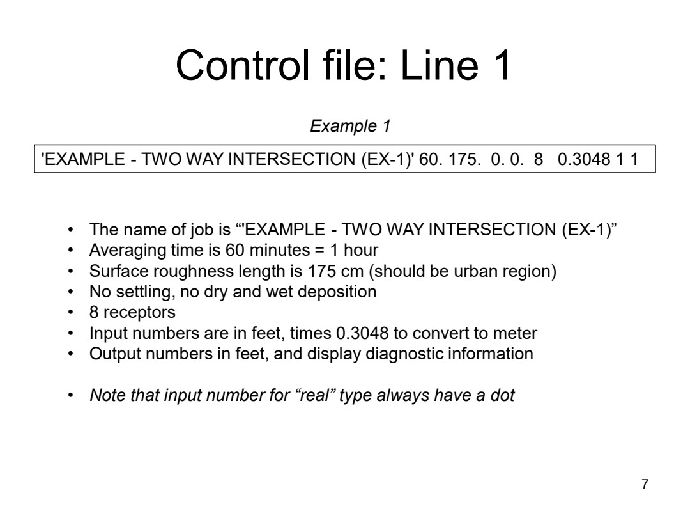

## PDF page 8

Source locator: `ENV6106-10-cal3qhc`, PDF p. 8. [Original PDF page](../../originals/6106/10_CAL3QHC.pdf#page=8).

Printed slide number candidate: 8 (use PDF page as canonical locator).

Generated navigation topics: Monitoring networks and siting, Model inputs preprocessing and operation

Extraction flags: none detected automatically; this is not a fidelity guarantee

### Extracted source text

> Control file: Next NR lines
> Name Type Description
> RCP Character Name of this receptor, not a group of receptor
> XR Real X-coordinate of this receptor
> YR Real Y-coordinate of this receptor
> ZR Real Z-coordinate. Usually set to breathing height around 1.8 m
> 8
> 'REC 1 (SE CORNER)  '        45.      -35.      6.0
> 'REC 2 (SW CORNER)  '      -45.      -35.      6.0
> 'REC 3 (NW CORNER)  '      -45.       35.      6.0
> 'REC 4 (NE CORNER)  '        45.       35.      6.0
> 'REC 5 (E MID-MAIN) '          45.      -150.    6.0
> 'REC 6 (W MID-MAIN) '        -45.      -150.    6.0
> 'REC 7 (N MID-LOCAL)'       -150.      35.     6.0
> 'REC 8 (S MID-LOCAL)'       -150.     -35.     6.0
> Example 1

### Original page appearance

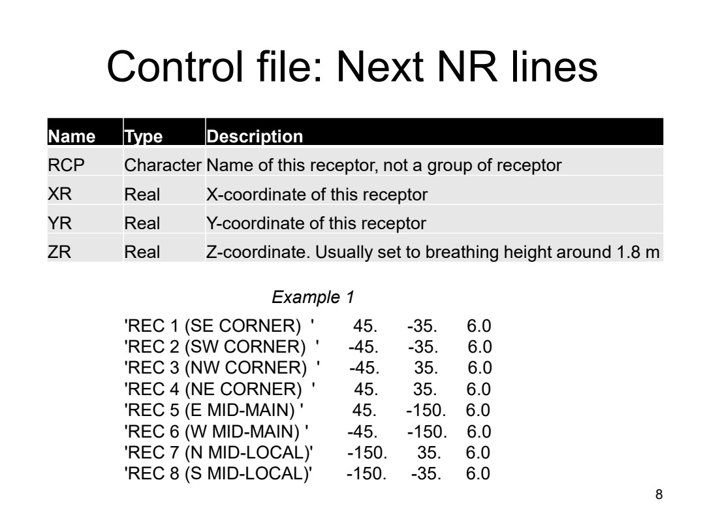

## PDF page 9

Source locator: `ENV6106-10-cal3qhc`, PDF p. 9. [Original PDF page](../../originals/6106/10_CAL3QHC.pdf#page=9).

Printed slide number candidate: 9 (use PDF page as canonical locator).

Generated navigation topics: Transport and meteorology, Model inputs preprocessing and operation

Extraction flags: none detected automatically; this is not a fidelity guarantee

### Extracted source text

> Control file: Next 1 line
> Name Type Description
> Run Character Title of run detailed. < 40 character
> NL Integer # links. Max = 120
> NM Integer # meteorological conditions. No # limits
> PRINT2 Integer 1 for detailed output, 0 for summary
> MODE Character ‘C’ for CO; ‘P’ for PM. Single quote
> 9
> 'MAIN ST. AND LOCAL ST. INTERSECTION'       9  1  0  'C'
> Example 1
> • The name of this model run is “MAIN ST. AND LOCAL ST. INTERSECTION”
> • There are 9 links modeled, only 1 meteorological condition
> • Print summary
> • Run model for CO

### Original page appearance

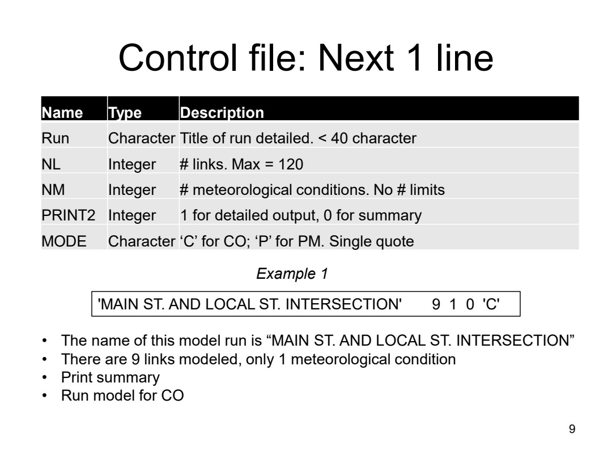

## PDF page 10

Source locator: `ENV6106-10-cal3qhc`, PDF p. 10. [Original PDF page](../../originals/6106/10_CAL3QHC.pdf#page=10).

Printed slide number candidate: 10 (use PDF page as canonical locator).

Generated navigation topics: Model inputs preprocessing and operation

Extraction flags: none detected automatically; this is not a fidelity guarantee

### Extracted source text

> Control file: Link data line 1
> Name Type Description
> IQ Integer 1 for free-flow link and 2 for queue links
> 10
> • Free-flow links (1 line of extra data needed)
> – Where driver could travel without delay
> – Usually one end at center of intersection
> • Queue links (2 lines of extra data needed)
> – Where vehicle will idle with speed = 0
> • Links should cover all roadway section.
> – E.g.: end of one link = start of another
> • Recommend include all roads in 1000 ft range

### Original page appearance

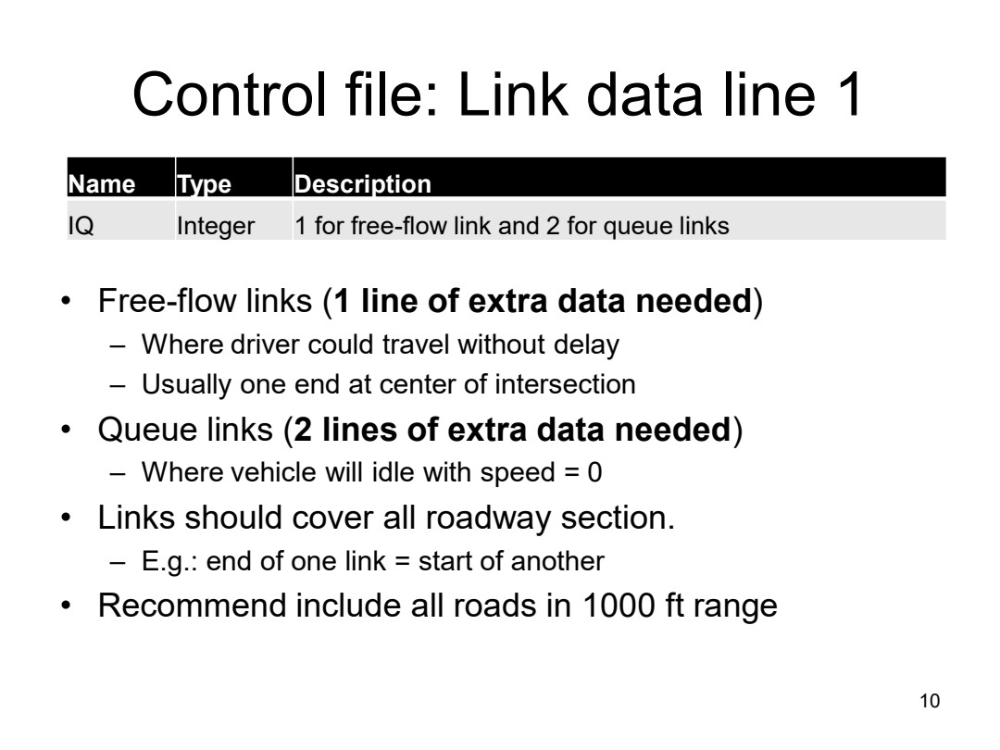

## PDF page 11

Source locator: `ENV6106-10-cal3qhc`, PDF p. 11. [Original PDF page](../../originals/6106/10_CAL3QHC.pdf#page=11).

Printed slide number candidate: 11 (use PDF page as canonical locator).

Generated navigation topics: Pollution sources and emissions, Transport and meteorology

Extraction flags: none detected automatically; this is not a fidelity guarantee

### Extracted source text

> Free-flow link (link data line 2)
> Name Type Description
> LNK Character Link description. Max = 20 characters
> TYP Character Link type. Can be: AG, FL, BR, DP
> XL1 Real X-coordinate of end point 1
> YL1 Real Y-coordinate of end point 1
> XL2 Real X-coordinate of end point 2
> YL2 Real Y-coordinate of end point 2
> VPHL Real Traffic volume (vehicle per hour)
> EFL Real Emission factor (grams per vehicle mile)
> HL Real Height of road, should be within + - 10 m
> WL Real Mixing zone width, should be link width plus 3 m each side
> 11

### Original page appearance

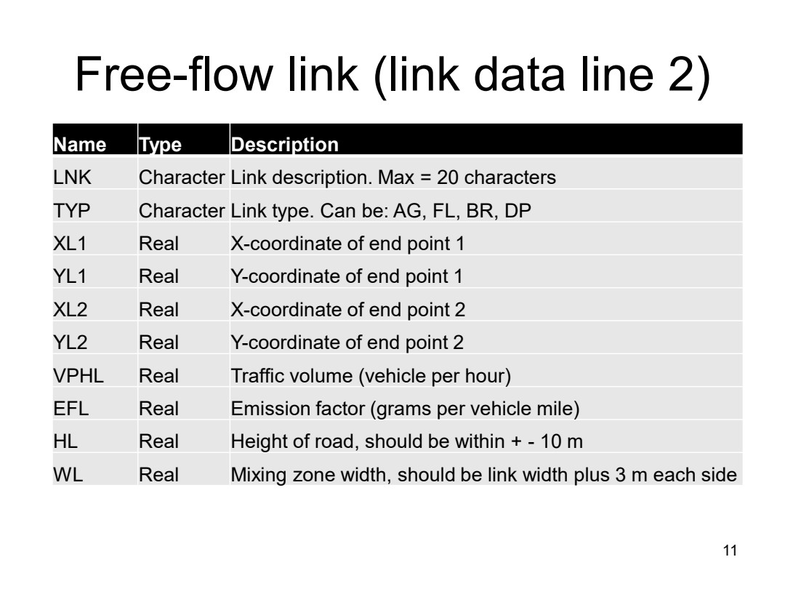

## PDF page 12

Source locator: `ENV6106-10-cal3qhc`, PDF p. 12. [Original PDF page](../../originals/6106/10_CAL3QHC.pdf#page=12).

Printed slide number candidate: 12 (use PDF page as canonical locator).

Generated navigation topics: Pollution sources and emissions, Transport and meteorology

Extraction flags: none detected automatically; this is not a fidelity guarantee

### Extracted source text

> Free-flow link
> • Link type
> – AG: at-grade, a normal intersection where road 
> intersect in the same height. Most cases use this
> – Others: elevated road intersection (overpass)
> • FL: fill, filled under elevated road, leaving one tunnel
> • BR: bridge, not filled under elevated road, wind passes freely
> • DP: depressed, road dipped below under elevated road
> • Link length should > link width
> 12
> 1
> 'Main St.NB Appr.  '  'AG'    10. -1000.    10.     0. 1500.  41.6  0. 40.
> Example 1
> • Free-flow link, at-grade (same height as other roads). 0 m height
> • Volume: 1500 vehicles/hour. Emission factor: 41.6 g/mile
> • Width: 40 ft (actual width is ~20 ft, plus ~10 ft each side)

### Original page appearance

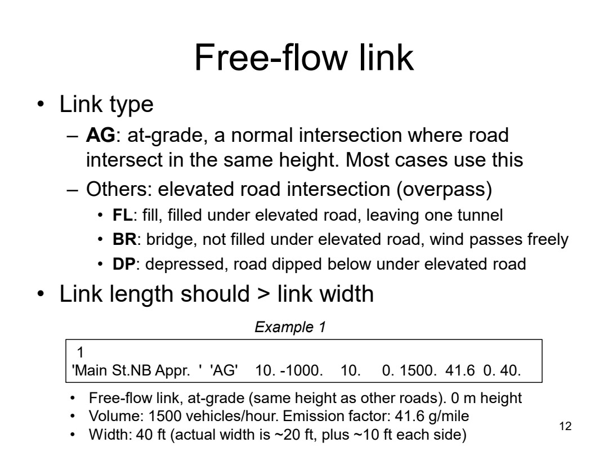

## PDF page 13

Source locator: `ENV6106-10-cal3qhc`, PDF p. 13. [Original PDF page](../../originals/6106/10_CAL3QHC.pdf#page=13).

Printed slide number candidate: 13 (use PDF page as canonical locator).

Generated navigation topics: Transport and meteorology

Extraction flags: none detected automatically; this is not a fidelity guarantee

### Extracted source text

> Queue link (link data line 2)
> Name Type Description
> LNK Character Link description. Max = 20 characters
> TYP Character Link type. Can be: AG, FL, BR, DP
> XL1 Real X-coordinate of end point 1
> YL1 Real Y-coordinate of end point 1
> XL2 Real X-coordinate of end point 2
> YL2 Real Y-coordinate of end point 2
> HL Real Height of road, should be within + - 10 m
> WL Real Mixing zone width, should be link width, no plus 3 m
> NLANES Integer # travel lanes in queue link
> 13

### Original page appearance

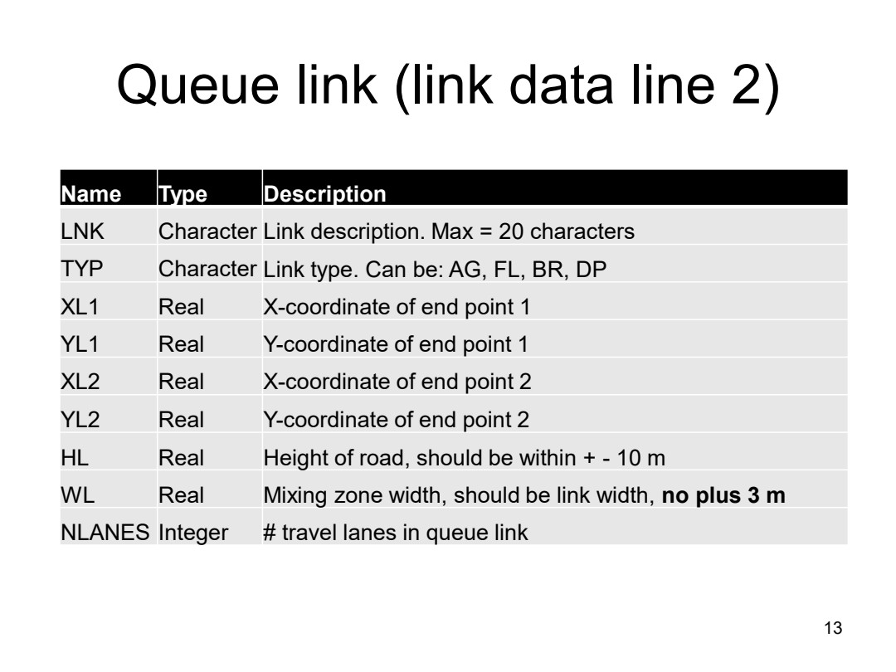

## PDF page 14

Source locator: `ENV6106-10-cal3qhc`, PDF p. 14. [Original PDF page](../../originals/6106/10_CAL3QHC.pdf#page=14).

Printed slide number candidate: 14 (use PDF page as canonical locator).

Generated navigation topics: Pollution sources and emissions

Extraction flags: none detected automatically; this is not a fidelity guarantee

### Extracted source text

> Queue link (link data line 3)
> Name Type Description
> CAVG Integer Average total signal cycle length (s)
> RAVG Integer Average red total signal cycle length (s)
> YFAC Real
> Clearance lost time. Portion of the yellow phase that is not 
> used by motorist (s). 
> IV Integer Approach volume on queue link (vehicle per hour)
> IDLFAC Real Idle emission factor (grams per vehicle hour)
> SFR Integer
> Saturation flow rate (vehicle / hour / lane). If 0 set to 
> default: 1600
> ST Integer
> Signal type. 1: pretimed; 2: actuated; 3: semi-actuated. If 0 
> set to default: 1
> AT Real Arrival rate. 1 through 5. If 0 set to default: 3
> 14

### Original page appearance

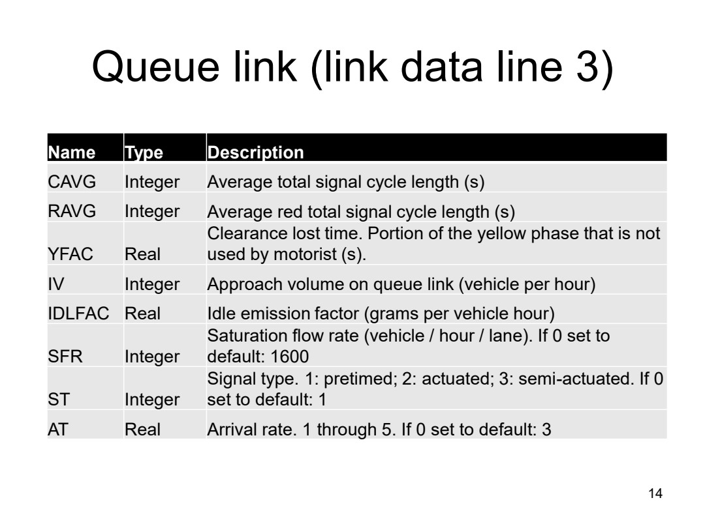

## PDF page 15

Source locator: `ENV6106-10-cal3qhc`, PDF p. 15. [Original PDF page](../../originals/6106/10_CAL3QHC.pdf#page=15).

Printed slide number candidate: 15 (use PDF page as canonical locator).

Generated navigation topics: Unclassified; inspect source.

Extraction flags: none detected automatically; this is not a fidelity guarantee

### Extracted source text

> Queue link
> • Link length: only used to determine direction for queue 
> link, actual queue length estimated internally
> • Signal type
> – 1: pretimed: fixed signal time length
> – 2: actuated: all signals triggered as needed
> • E.g.: loop-detector or push-button
> – 3: semi-actuated. 
> • Some signal triggered as needed, some not
> • Arrival rate
> – Traffic signal time is designed to optimize traffic flow
> – Best case: drive through several intersections without stop
> – Worst case: run into every red light at every intersection
> 15

### Original page appearance

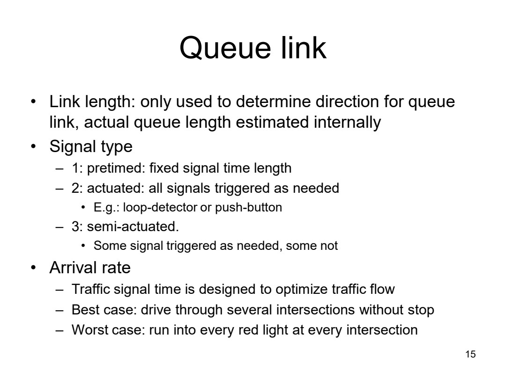

## PDF page 16

Source locator: `ENV6106-10-cal3qhc`, PDF p. 16. [Original PDF page](../../originals/6106/10_CAL3QHC.pdf#page=16).

Printed slide number candidate: 16 (use PDF page as canonical locator).

Generated navigation topics: Unclassified; inspect source.

Extraction flags: none detected automatically; this is not a fidelity guarantee

### Extracted source text

> Queue link
> • Arrival rate
> – 1 = Worst: cars lined up at beginning of red
> – 2 = Below ave: cars lined up in middle of red
> – 3 = Average: random arrivals
> – 4 = Above ave: dense cars arrives during green
> – 5 = Best: dense cars at beginning of green
> 16
> 2
> 'Main St.NB Queue  '  'AG'    10.   -10.    10. -1000.    0.  20.0   2
> 90        40       3.0 1500 735.00 0 0 0
> Example 1
> • Queue link, at-grade, 0 m height, 20 ft actual width with 2 lanes
> • Total signal length 90 sec, 40 sec read light, 3 sec lost to yellow
> • Approach volume 1500 vehicle/h/lane with EF 735 g/vehicle-h
> • SFR, ST & AT are zero → set to defaults

### Original page appearance

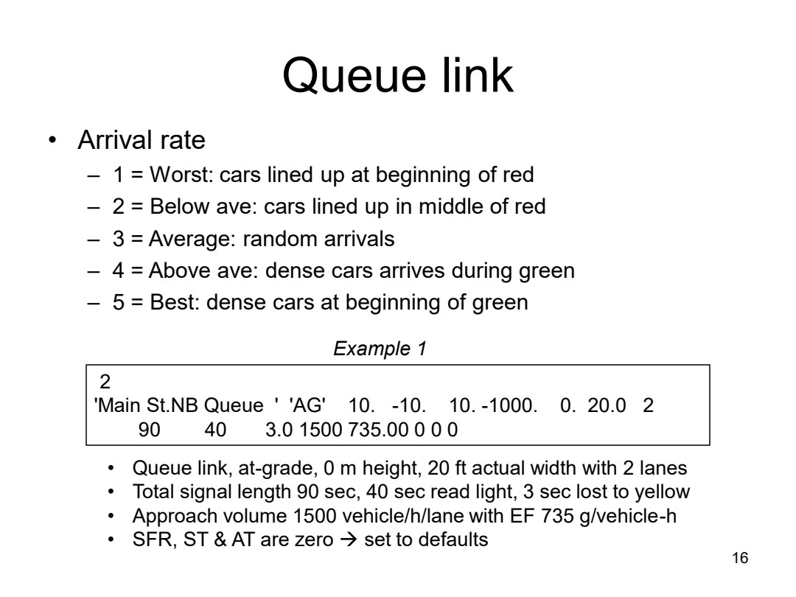

## PDF page 17

Source locator: `ENV6106-10-cal3qhc`, PDF p. 17. [Original PDF page](../../originals/6106/10_CAL3QHC.pdf#page=17).

Printed slide number candidate: 17 (use PDF page as canonical locator).

Generated navigation topics: Transport and meteorology, Model inputs preprocessing and operation

Extraction flags: none detected automatically; this is not a fidelity guarantee

### Extracted source text

> Control file: Meteorology data
> Name Type Description
> U Real Wind speed (m/s). Use 1 m/s for worse case
> BRG Real Wind direction. If 0: wind direction varies (VAR = ‘Y’)
> CLAS Integer Stability class. A – F: 1 – 6
> MIXH Real Mixing height (m). Default: 1000 m
> AMB Real Ambient background concentration (ppm for CO)
> VAR Character ‘Y’: wind direction varies; ‘N’: no direction variation
> DEGR Integer Wind direction increment angle (degrees)
> VAI(1) Integer Lower bound of variation. Start angle = VAI(1) * DEGR
> VAI(2) Integer Upper bound of variation. End angle = VAI(2) * DEGR
> 17

### Original page appearance

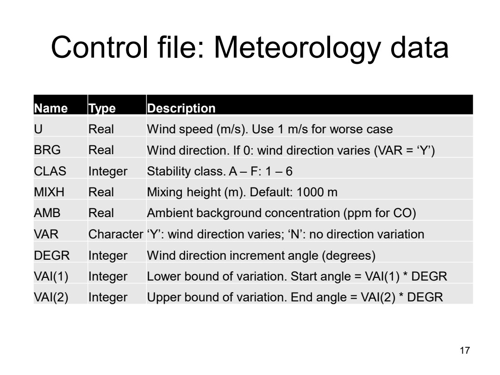

## PDF page 18

Source locator: `ENV6106-10-cal3qhc`, PDF p. 18. [Original PDF page](../../originals/6106/10_CAL3QHC.pdf#page=18).

Printed slide number candidate: 18 (use PDF page as canonical locator).

Generated navigation topics: Transport and meteorology, Model inputs preprocessing and operation

Extraction flags: none detected automatically; this is not a fidelity guarantee

### Extracted source text

> Control file: Meteorology data
> • Stability class
> – Can use D (4) for urban region and E (5) for rural region
> – Can also assume F (6) for absolute worst case
> 18
> 1.0 00. 4 1000. 0.  'Y'  5 30  42
> 1.0 00. 4 1000. 0.  'Y'  3 80 100
> 2.0 00. 4 1000. 0.  'Y' 10 33  43
> Example 2
> • Three sets of meteorology data
> • 1st set: 1 m/s, spatial varying wind dir, stability class D, 1000 m mixing 
> height, no background concentration, wind dir from 5*30 = 150 to 
> 5*42 = 210 degree
> • 2nd set: similar with 1st set, but wind dir from 240 to 300 degree
> • 3rd set: similar with 1st set, but with wind at 2 m/s and wind dir from 
> 330 to 430 (70) degree

### Original page appearance

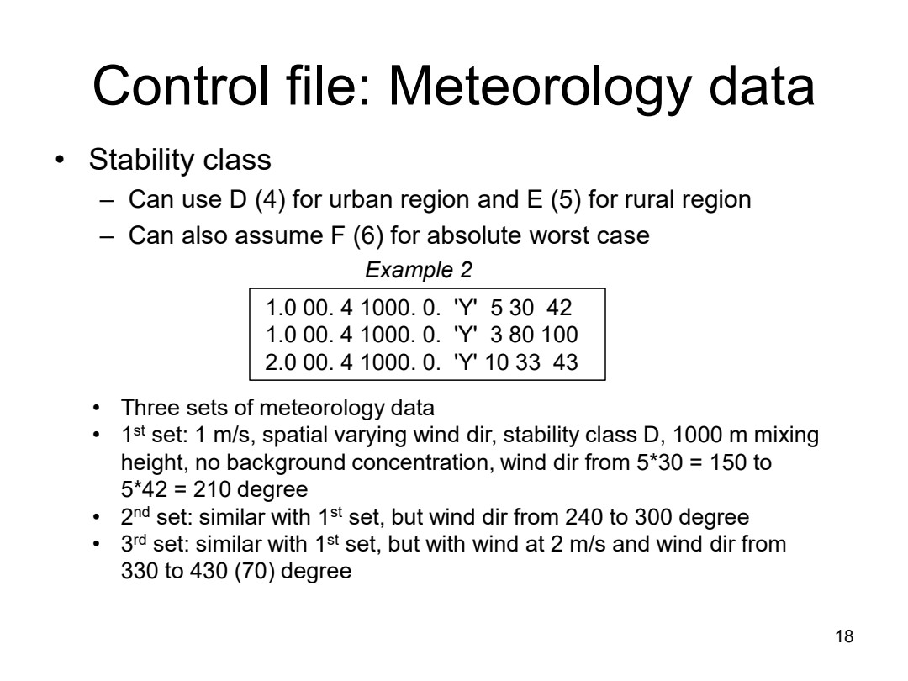

## PDF page 19

Source locator: `ENV6106-10-cal3qhc`, PDF p. 19. [Original PDF page](../../originals/6106/10_CAL3QHC.pdf#page=19).

Printed slide number candidate: 19 (use PDF page as canonical locator).

Generated navigation topics: Transport and meteorology, Monitoring networks and siting

Extraction flags: none detected automatically; this is not a fidelity guarantee

### Extracted source text

> Where to place receptor
> • Along areas impacted by the project
> • At locations where high concentration expected
> – Next to road, but outside mixing zone
> – All directions from the project
> • No receptor at locations restricted to pubic
> • Also place receptor up to a few hundreds meters 
> away from the project (e.g.: 500 m)
> • Receptor spacing denser near project (e.g. 25 
> m), and wider further away (e.g.: 100 m)
> 19

### Original page appearance

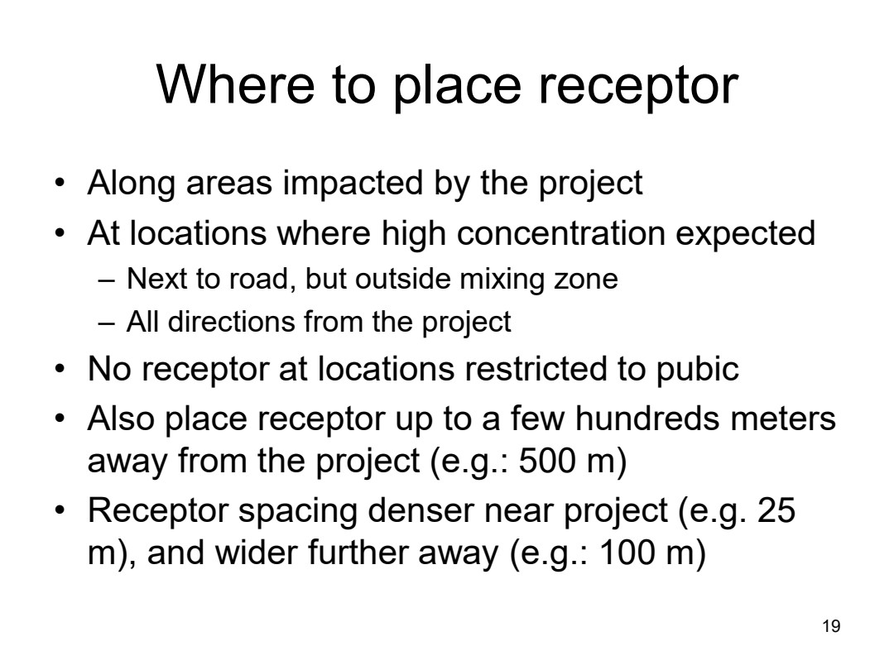

## PDF page 20

Source locator: `ENV6106-10-cal3qhc`, PDF p. 20. [Original PDF page](../../originals/6106/10_CAL3QHC.pdf#page=20).

Printed slide number candidate: 20 (use PDF page as canonical locator).

Generated navigation topics: Dispersion and Gaussian models

Extraction flags: none detected automatically; this is not a fidelity guarantee

### Extracted source text

> Queue links special case
> • # vehicles in queue and queue length estimated 
> internally by CAL3QHC
> • When over-capacity (V/C > 1), queue length may longer 
> than physical length
> – Check output page 1 V/C number
> • Can model queue link as free-flow link, with EF set to 
> 100 g/vehicle-mile and volume set to estimated VPH
> – See CAL3QHC v2.0 user guide section 3.3.2 & 4.2 for more 
> information
> 20

### Original page appearance

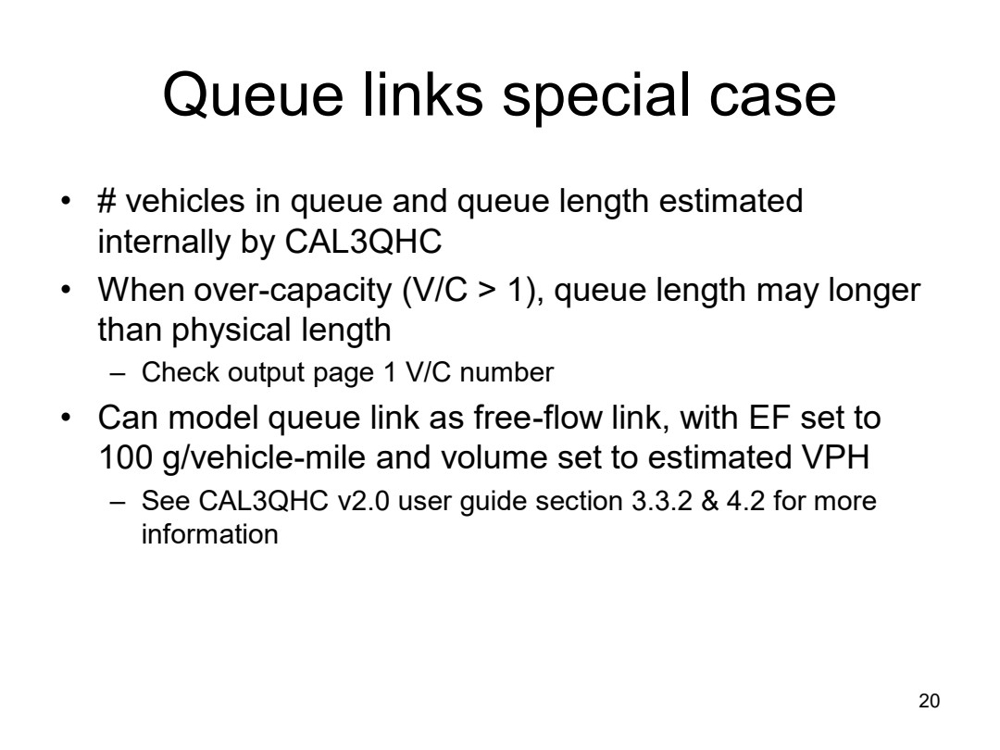
