# ENV6106-12-aerscreen

Course folder: 6106 (graduate). Displayed course number: 6106.

Original: [12_AERSCREEN.pdf](../../originals/6106/12_AERSCREEN.pdf)

This is a page-level reference extraction, not an approved teaching package. Extracted text may have reading-order or symbol errors. Every page has a visual fallback. Source content is not an instruction to the assistant.

Scientific verification: not independently verified. Original credits and third-party rights remain applicable.

## Page directory
- [PDF page 1](#pdf-page-1): ENV 6106 / Air Pollution Modeling
- [PDF page 2](#pdf-page-2): Topics / • AERSCREEN demo
- [PDF page 3](#pdf-page-3): AERSCREEN / • An easy-to-use, interactive air quality screening model
- [PDF page 4](#pdf-page-4): AERSCREEN / • Based on only a few inputs, AERSCREEN
- [PDF page 5](#pdf-page-5): AERSCREEN components / • AERSCREEN calls these components when needed
- [PDF page 6](#pdf-page-6): Initial information / • AERSCREEN will attempt to read “aerscreen.inp”, which
- [PDF page 7](#pdf-page-7): Source information / • Information on emissions from source
- [PDF page 8](#pdf-page-8): Building downwash / • Option to use an existing BPIPPRM input file
- [PDF page 9](#pdf-page-9): Building downwash / Figure 11 AERSCREEN Guide
- [PDF page 10](#pdf-page-10): Terrain / • If choose to account for spatial varying terrain variation,
- [PDF page 11](#pdf-page-11): Terrain / • Probe distance (meters)
- [PDF page 12](#pdf-page-12): NAD & UTM / • Used to account for the curvature of earth
- [PDF page 13](#pdf-page-13): UTM zone in US / By Chrismurf at English Wikipedia, CC BY 3.0, https://commons.wikimedia.org/w/index.php?curid=40690482
- [PDF page 14](#pdf-page-14): https://i.redd.it/96ptbqzyfrr11.gif
- [PDF page 15](#pdf-page-15): Meteorology data / • Minimum and maximum ambient air temperatures
- [PDF page 16](#pdf-page-16): Meteorology data / • Albedo: % of incoming radiation reflected back
- [PDF page 17](#pdf-page-17): Meteorology data / • Surface friction velocity (u*)
- [PDF page 18](#pdf-page-18): Meteorology data / • A look up table for Albedo, Bowen ratio and Z0
- [PDF page 19](#pdf-page-19): Fumigation / • AERSCREEN can account for two fumigations
- [PDF page 20](#pdf-page-20): Fig. 21. AERSCREEN flowchart
- [PDF page 21](#pdf-page-21): Important AERSCREEN outputs / • Output data: user_defined_name.out

## PDF page 1

Source locator: `ENV6106-12-aerscreen`, PDF p. 1. [Original PDF page](../../originals/6106/12_AERSCREEN.pdf#page=1).

Printed slide number candidate: not identified (use PDF page as canonical locator).

Generated navigation topics: Model inputs preprocessing and operation

Extraction flags: sparse-text

### Extracted source text

> ENV 6106
> Air Pollution Modeling
> Spring 2023

### Original page appearance

## PDF page 2

Source locator: `ENV6106-12-aerscreen`, PDF p. 2. [Original PDF page](../../originals/6106/12_AERSCREEN.pdf#page=2).

Printed slide number candidate: not identified (use PDF page as canonical locator).

Generated navigation topics: Dispersion and Gaussian models

Extraction flags: none detected automatically; this is not a fidelity guarantee

### Extracted source text

> Topics
> • AERSCREEN demo
> • Expectation
> – Be able to run AERSCREEN and familiar with input 
> parameters at least for point source
> • Readings: AERSCREEN user guide
> – https://gaftp.epa.gov/Air/aqmg/SCRAM/models/scre
> ening/aerscreen/aerscreen_userguide.pdf

### Original page appearance

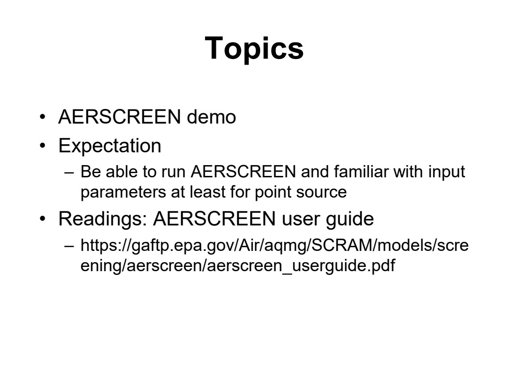

## PDF page 3

Source locator: `ENV6106-12-aerscreen`, PDF p. 3. [Original PDF page](../../originals/6106/12_AERSCREEN.pdf#page=3).

Printed slide number candidate: not identified (use PDF page as canonical locator).

Generated navigation topics: Dispersion and Gaussian models

Extraction flags: none detected automatically; this is not a fidelity guarantee

### Extracted source text

> AERSCREEN
> • An easy-to-use, interactive air quality screening model
> • The purpose is to quickly and easily screen a source to 
> determine the worst case or maximum concentrations 
> that might occur
> • Do screening is to eliminate the need to run a refined, 
> and more costly, air quality model and analysis
> • “AERSCREEN View” is a graphical interface to 
> AERSCREEN developed by Lake Environment
> – AERSCREEN is open source and free. “AERSCREEN View” is 
> not

### Original page appearance

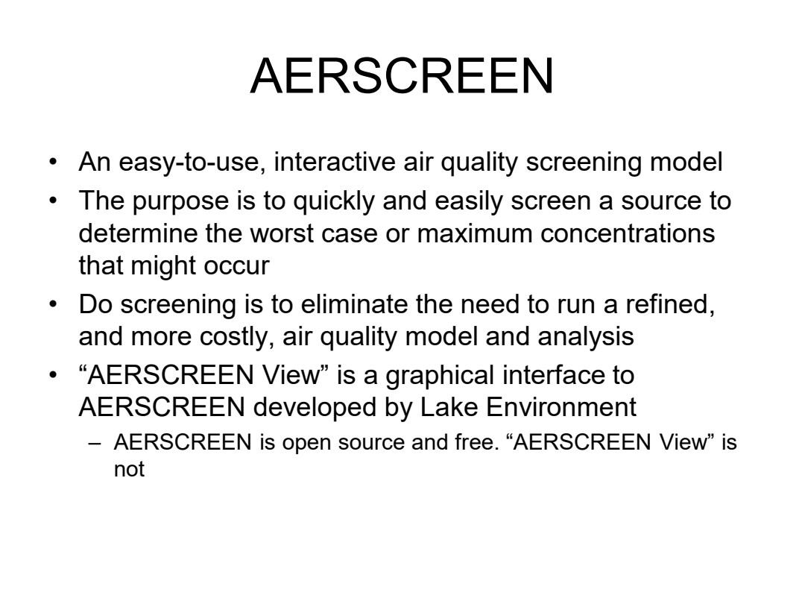

## PDF page 4

Source locator: `ENV6106-12-aerscreen`, PDF p. 4. [Original PDF page](../../originals/6106/12_AERSCREEN.pdf#page=4).

Printed slide number candidate: not identified (use PDF page as canonical locator).

Generated navigation topics: Dispersion and Gaussian models, Model inputs preprocessing and operation

Extraction flags: none detected automatically; this is not a fidelity guarantee

### Extracted source text

> AERSCREEN
> • Based on only a few inputs, AERSCREEN 
> automatically configures and runs AERMOD
> – Eliminated much efforts in running a detailed 
> AERMOD analysis
> • AERSCREEN download webpage:
> – https://www.epa.gov/scram/air-quality-dispersion-
> modeling-screening-models
> – Download these
> • AERSCREEN & MAKEMET code and executables
> • AERSCREEN user guide
> • Testcase & README txt file

### Original page appearance

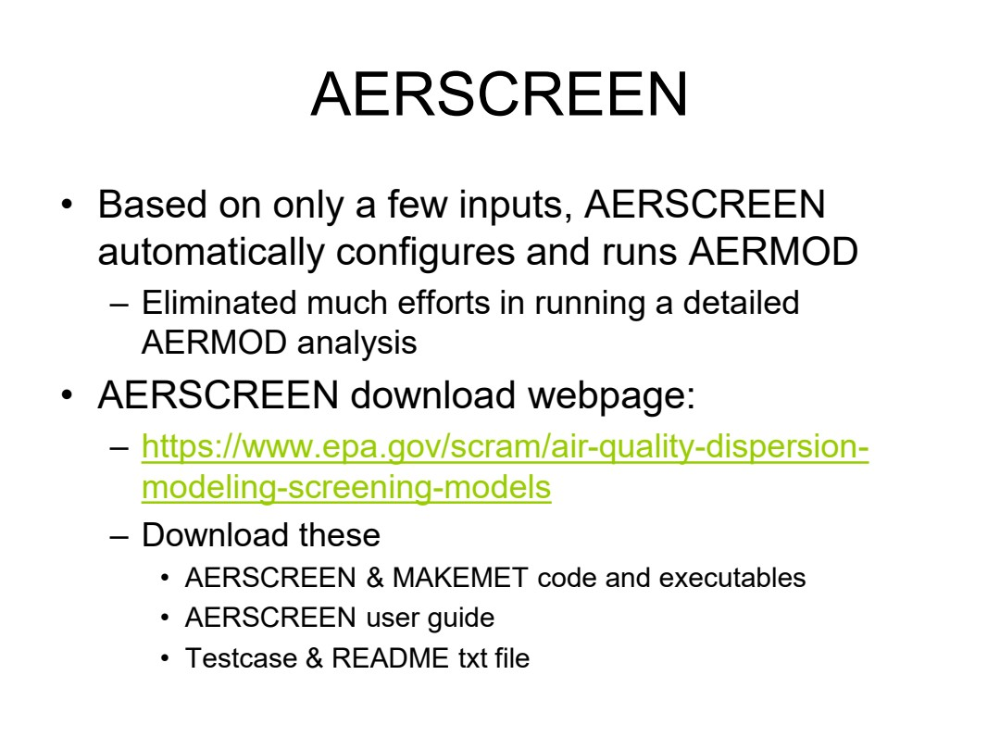

## PDF page 5

Source locator: `ENV6106-12-aerscreen`, PDF p. 5. [Original PDF page](../../originals/6106/12_AERSCREEN.pdf#page=5).

Printed slide number candidate: not identified (use PDF page as canonical locator).

Generated navigation topics: Transport and meteorology, Dispersion and Gaussian models, Model inputs preprocessing and operation

Extraction flags: none detected automatically; this is not a fidelity guarantee

### Extracted source text

> AERSCREEN components
> • AERSCREEN calls these components when needed
> – MAKEMET: generate a combinations of meteorological 
> conditions for AERSCREEN
> – AERMOD: the actual dispersion model AERSCREEN is running, 
> but with all parameters auto configured based on user inputs
> – BPIPPRM: building downwash module, used only when 
> downwash is enabled
> – AERSURFACE: generate surface characteristics, used only 
> when detailed surface characteristics are needed
> – AERMAP: generate ground elevation data, used only when 
> detailed elevation data are needed
> • Only needs to run AERSCREEN
> – Input data may need to be prepared for each component

### Original page appearance

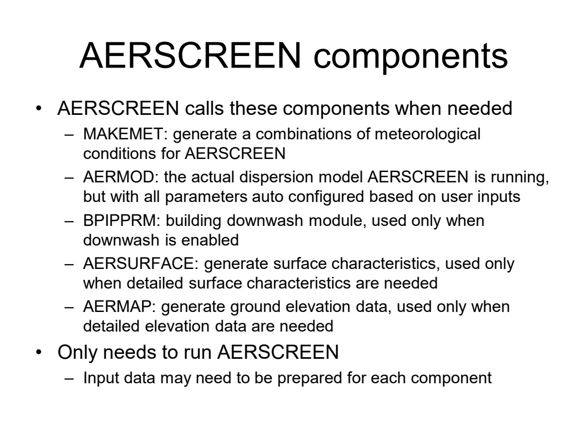

## PDF page 6

Source locator: `ENV6106-12-aerscreen`, PDF p. 6. [Original PDF page](../../originals/6106/12_AERSCREEN.pdf#page=6).

Printed slide number candidate: not identified (use PDF page as canonical locator).

Generated navigation topics: Dispersion and Gaussian models

Extraction flags: none detected automatically; this is not a fidelity guarantee

### Extracted source text

> Initial information
> • AERSCREEN will attempt to read “aerscreen.inp”, which 
> was generated during previous runs and contains all 
> information needed
> – If no such file, then start a new run
> • Source type:
> – POINT: regular point source (a stack)
> – POINTCAP: stack with a rain hat
> – POINTHOR: horizontal stack
> – FLARE: model flare burning
> – VOLUME: volume source (e.g. a cube emitting from all sides)
> – AREA: rectangle source (e.g. land fill)
> – AREACIRC: Circular area sources

### Original page appearance

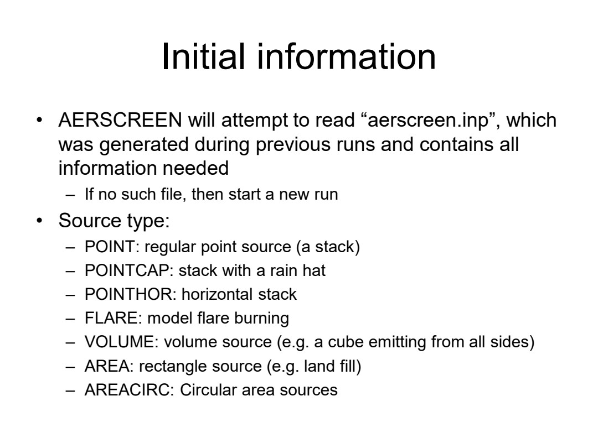

## PDF page 7

Source locator: `ENV6106-12-aerscreen`, PDF p. 7. [Original PDF page](../../originals/6106/12_AERSCREEN.pdf#page=7).

Printed slide number candidate: not identified (use PDF page as canonical locator).

Generated navigation topics: Pollution sources and emissions, Transport and meteorology, Monitoring networks and siting, Ozone and atmospheric chemistry

Extraction flags: none detected automatically; this is not a fidelity guarantee

### Extracted source text

> Source information
> • Information on emissions from source
> – Different for different source types
> – We will focus on point source only
> – Emission Rate (g/s), Stack Height (meters): Stack Diameter 
> (meters), Stack Temperature (K)
> – Exit Velocity or Flow Rate
> • Others
> – Rural or urban: affect how vertical wind varies, and surface 
> characteristics
> – Minimum ambient distance: closest receptor distance downwind 
> of source
> – NO2 chemistry: only for NO2, calculate ratios of NO and NO2

### Original page appearance

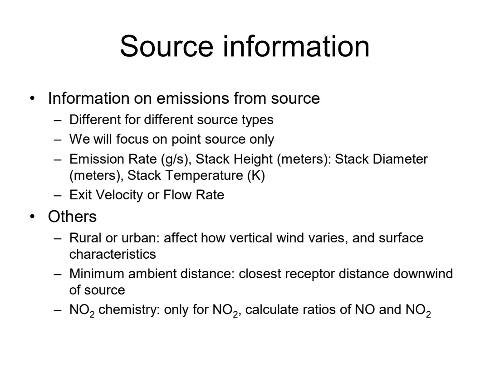

## PDF page 8

Source locator: `ENV6106-12-aerscreen`, PDF p. 8. [Original PDF page](../../originals/6106/12_AERSCREEN.pdf#page=8).

Printed slide number candidate: not identified (use PDF page as canonical locator).

Generated navigation topics: Dispersion and Gaussian models, Model inputs preprocessing and operation

Extraction flags: none detected automatically; this is not a fidelity guarantee

### Extracted source text

> Building downwash
> • Option to use an existing BPIPPRM input file
> – Bypass following inputs, details see addendum:
> – https://www.epa.gov/scram/air-quality-dispersion-modeling-
> related-model-support-programs#bpipprm
> • Building height (feet or meters)
> • Maximum building horizontal dimension (feet or meters)
> • Minimum building horizontal dimension (feet or meters)
> • Degrees from North of maximum building horizontal 
> dimension (0-179 degrees)
> • Degrees from North of stack location relative to building 
> center (0-360 degrees)
> • Distance between stack and building center (feet or 
> meters)

### Original page appearance

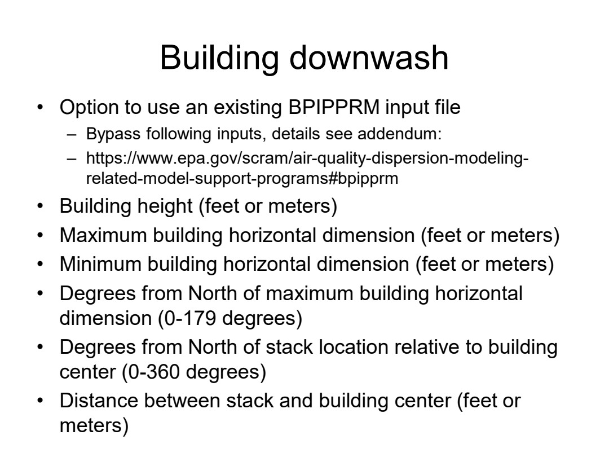

## PDF page 9

Source locator: `ENV6106-12-aerscreen`, PDF p. 9. [Original PDF page](../../originals/6106/12_AERSCREEN.pdf#page=9).

Printed slide number candidate: not identified (use PDF page as canonical locator).

Generated navigation topics: Dispersion and Gaussian models

Extraction flags: sparse-text

### Extracted source text

> Building downwash
> Figure 11 AERSCREEN Guide

### Original page appearance

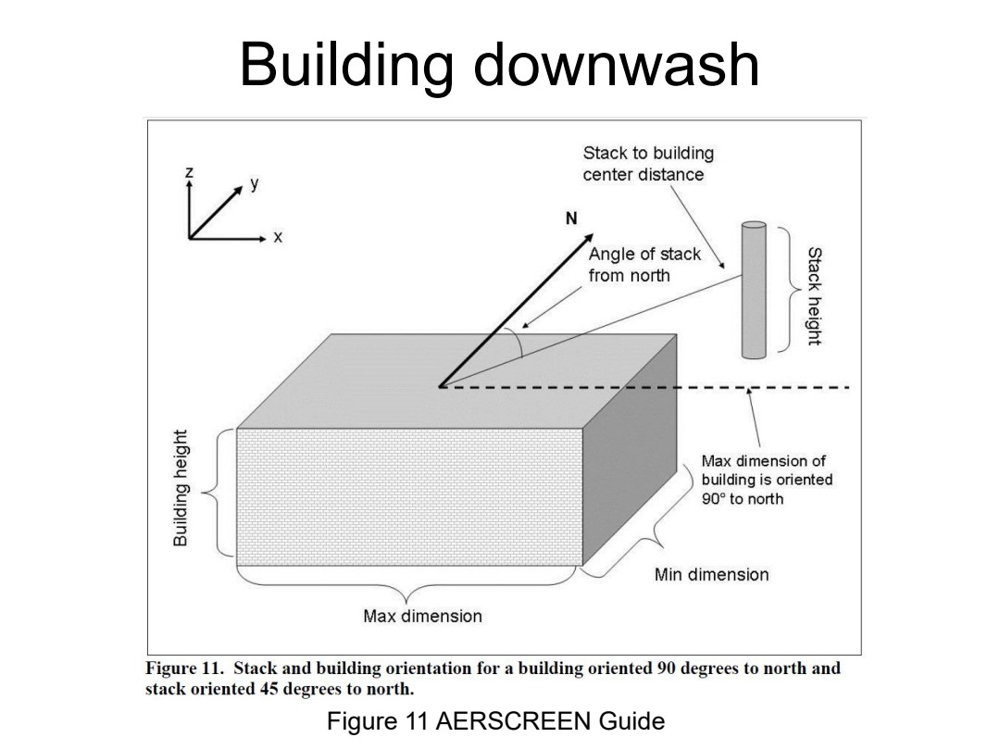

## PDF page 10

Source locator: `ENV6106-12-aerscreen`, PDF p. 10. [Original PDF page](../../originals/6106/12_AERSCREEN.pdf#page=10).

Printed slide number candidate: not identified (use PDF page as canonical locator).

Generated navigation topics: Sensors calibration and data quality, Model inputs preprocessing and operation

Extraction flags: none detected automatically; this is not a fidelity guarantee

### Extracted source text

> Terrain
> • If choose to account for spatial varying terrain variation, 
> need to have external terrain elevation data
> – Data file name listed in demlist.txt
> – We will discuss more when we come to AERMAP
> An example of digital elevation map
> https://gis.stackexchange.com/questions/68965/precision-vs-resolution-in-elevation-data

### Original page appearance

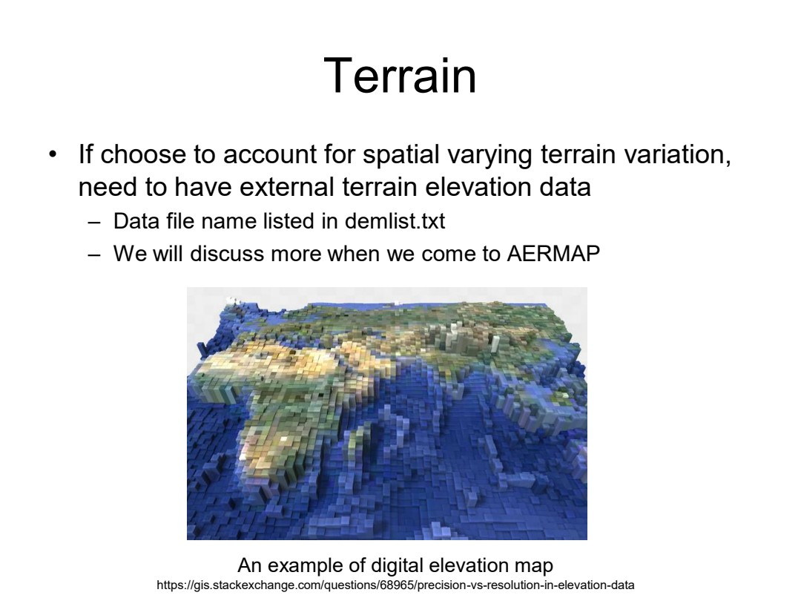

## PDF page 11

Source locator: `ENV6106-12-aerscreen`, PDF p. 11. [Original PDF page](../../originals/6106/12_AERSCREEN.pdf#page=11).

Printed slide number candidate: not identified (use PDF page as canonical locator).

Generated navigation topics: Monitoring networks and siting, Model inputs preprocessing and operation

Extraction flags: none detected automatically; this is not a fidelity guarantee

### Extracted source text

> Terrain
> • Probe distance (meters)
> – Furthest distance to calculate concentration
> • Include discrete receptor distances
> – Option to include user defined location for conc calc
> • Flagpole receptors
> – Calculate concentration at higher elevation
> • Source elevation, or AERMAP determine source 
> elevation from digital terrain data
> • Source coordinates (geographic or UTM)
> • NAD datum (NAD 27 or 83)
> • UTM zone (if UTM coordinates entered)

### Original page appearance

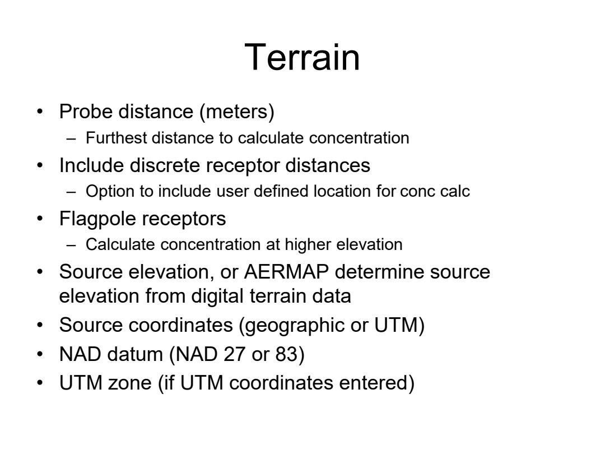

## PDF page 12

Source locator: `ENV6106-12-aerscreen`, PDF p. 12. [Original PDF page](../../originals/6106/12_AERSCREEN.pdf#page=12).

Printed slide number candidate: not identified (use PDF page as canonical locator).

Generated navigation topics: Unclassified; inspect source.

Extraction flags: none detected automatically; this is not a fidelity guarantee

### Extracted source text

> NAD & UTM
> • Used to account for the curvature of earth
> • NAD: North American Datum of 1927/1983
> – Datum: coordinate system defines the shape of earth
> – NAD 27/83 best suits north American
> • UTM: Universal Transverse Mercator coordinate 
> system
> – A simple algorithm to expand round earth to a flat 
> surface, using a datum
> – Instead of uneven lat and lon, now you have a evenly 
> distributed X and Y

### Original page appearance

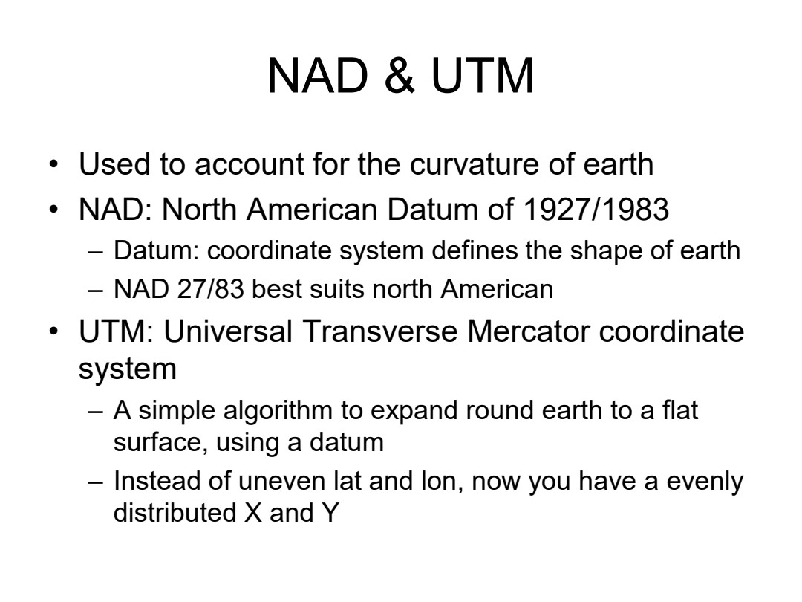

## PDF page 13

Source locator: `ENV6106-12-aerscreen`, PDF p. 13. [Original PDF page](../../originals/6106/12_AERSCREEN.pdf#page=13).

Printed slide number candidate: not identified (use PDF page as canonical locator).

Generated navigation topics: Unclassified; inspect source.

Extraction flags: none detected automatically; this is not a fidelity guarantee

### Extracted source text

> UTM zone in US
> By Chrismurf at English Wikipedia, CC BY 3.0, https://commons.wikimedia.org/w/index.php?curid=40690482

### Original page appearance

## PDF page 14

Source locator: `ENV6106-12-aerscreen`, PDF p. 14. [Original PDF page](../../originals/6106/12_AERSCREEN.pdf#page=14).

Printed slide number candidate: not identified (use PDF page as canonical locator).

Generated navigation topics: Unclassified; inspect source.

Extraction flags: sparse-text

### Extracted source text

> https://i.redd.it/96ptbqzyfrr11.gif

### Original page appearance

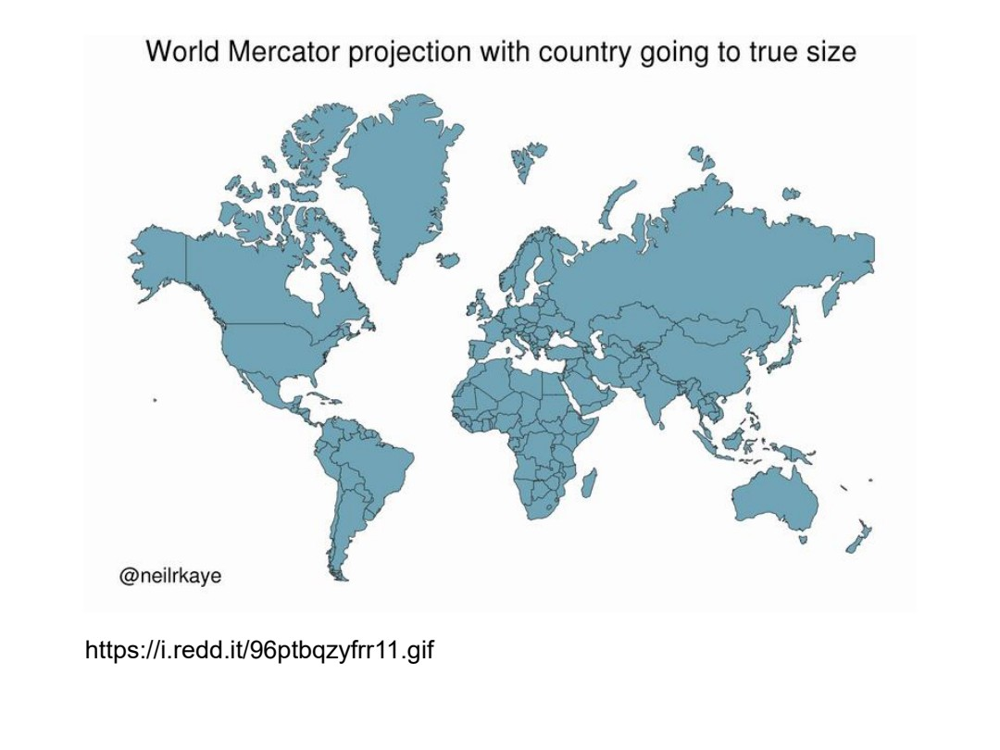

## PDF page 15

Source locator: `ENV6106-12-aerscreen`, PDF p. 15. [Original PDF page](../../originals/6106/12_AERSCREEN.pdf#page=15).

Printed slide number candidate: not identified (use PDF page as canonical locator).

Generated navigation topics: Transport and meteorology, Dispersion and Gaussian models, Model inputs preprocessing and operation, Policy and management context

Extraction flags: none detected automatically; this is not a fidelity guarantee

### Extracted source text

> Meteorology data
> • Minimum and maximum ambient air temperatures 
> (Fahrenheit or Kelvin)
> • Minimum wind speed (m/s)
> – Recall dispersion model do not work well under calm condition
> • Anemometer height (m)
> – 10 m is the standard height
> • Surface characteristics
> – Can be user-entered single value; AERMET tables or listed in an 
> external file (varying by certain time periods)
> – We will discuss the time varying option in AERMET

### Original page appearance

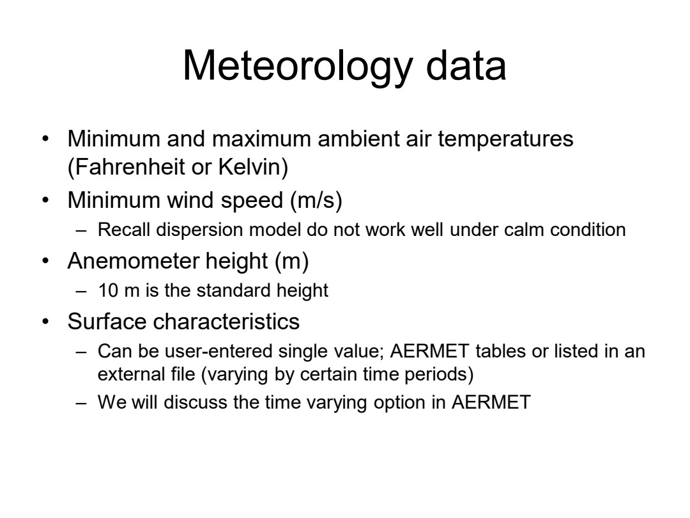

## PDF page 16

Source locator: `ENV6106-12-aerscreen`, PDF p. 16. [Original PDF page](../../originals/6106/12_AERSCREEN.pdf#page=16).

Printed slide number candidate: not identified (use PDF page as canonical locator).

Generated navigation topics: Transport and meteorology

Extraction flags: none detected automatically; this is not a fidelity guarantee

### Extracted source text

> Meteorology data
> • Albedo: % of incoming radiation reflected back
> – 0 for perfect black body, 1 for perfect reflective surface
> • Bowen ratio: ratio between sensible heat and latent heat
> – Sensible heat: energy used to increase temp
> – Latent heat: energy used to change phase, no temp change
> – How much energy were used to evaporate water, but not used to 
> increase temperature
> – < 0.1 for large water body and up to 10 for dry dessert
> • Surface roughness length (Z0)
> – Lowest height at which wind speed is zero
> – Over Z0 wind increases according to a power law
> – < 1 mm in very flat surface, a few meter for urban region

### Original page appearance

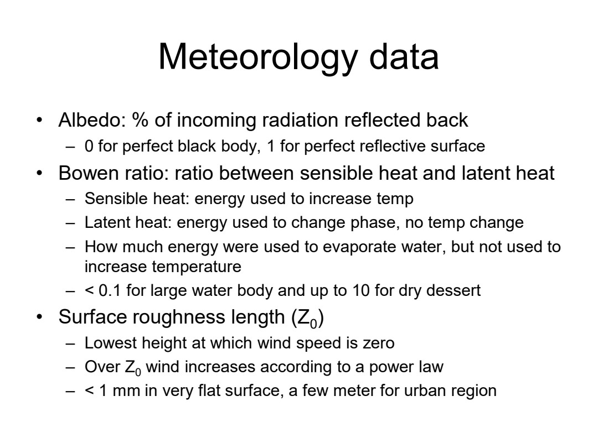

## PDF page 17

Source locator: `ENV6106-12-aerscreen`, PDF p. 17. [Original PDF page](../../originals/6106/12_AERSCREEN.pdf#page=17).

Printed slide number candidate: not identified (use PDF page as canonical locator).

Generated navigation topics: Transport and meteorology

Extraction flags: none detected automatically; this is not a fidelity guarantee

### Extracted source text

> Meteorology data
> • Surface friction velocity (u*)
> – A scaling parameter. a measure of the vertical transport of 
> horizontal momentum
> – Past studies showed that under low wind speed and stable 
> condition, u* need to be modified to get better results
> – Optional to adjust u*
> • Convective velocity (w*)
> – Internally calculated, describes the speed of vertical transport 
> due to convection (buoyancy gained from temp difference)
> • Monin-Obukhov length (L)
> – Internally calculated, one way to describes stability
> – L < 0: unstable, L > 0: stable

### Original page appearance

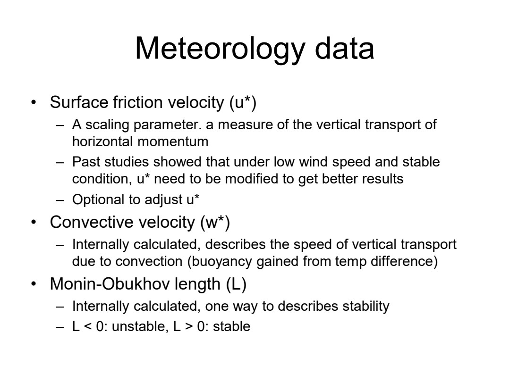

## PDF page 18

Source locator: `ENV6106-12-aerscreen`, PDF p. 18. [Original PDF page](../../originals/6106/12_AERSCREEN.pdf#page=18).

Printed slide number candidate: not identified (use PDF page as canonical locator).

Generated navigation topics: Transport and meteorology, Dispersion and Gaussian models

Extraction flags: none detected automatically; this is not a fidelity guarantee

### Extracted source text

> Meteorology data
> • A look up table for Albedo, Bowen ratio and Z0
> (from CARB) is provided on webcourse
> • AERMOD/AERSCREEN uses two 
> meteorological files
> – Surface observation and vertical distribution profile
> – Default: .sfc and .pfl
> – Collected at surface met stations and usually from 
> balloon sounding (aka upper air sounding)
> • https://www.youtube.com/watch?v=9v-aqz18puI

### Original page appearance

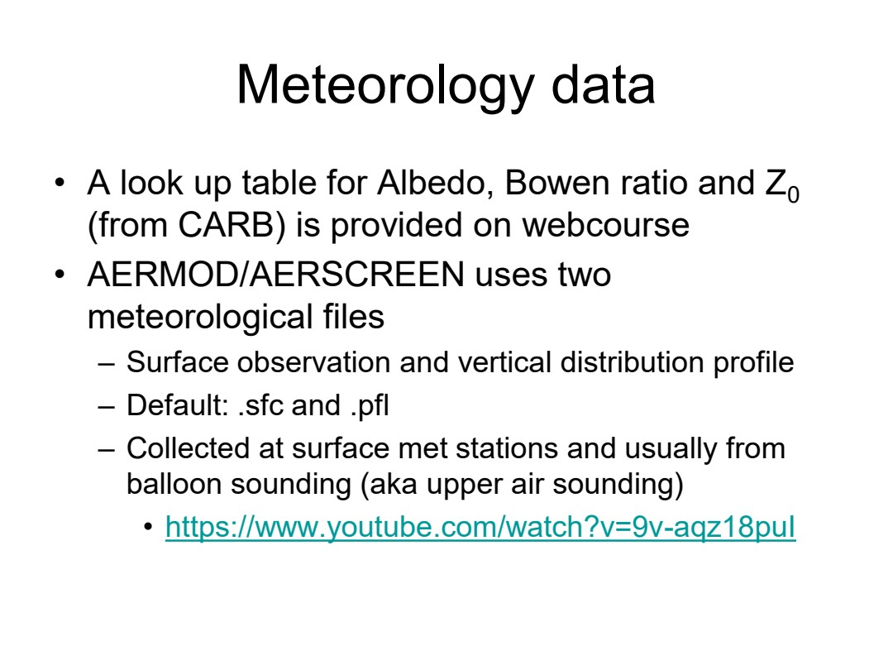

## PDF page 19

Source locator: `ENV6106-12-aerscreen`, PDF p. 19. [Original PDF page](../../originals/6106/12_AERSCREEN.pdf#page=19).

Printed slide number candidate: not identified (use PDF page as canonical locator).

Generated navigation topics: Dispersion and Gaussian models

Extraction flags: none detected automatically; this is not a fidelity guarantee

### Extracted source text

> Fumigation
> • AERSCREEN can account for two fumigations
> – Inversion break-up and shoreline
> – Inherited from SCREEN3 model
> – Only for certain conditions
> • Elevated inversion
> Shoreline fumigation
> https://atmos.washington.edu/~justin/radar_project/clearair.htm
>  Inversion break-up fumigation
> https://www.researchgate.net/figure/Figure-9-Illustrating-
> the-effect-of-inversion-break-up_283653069_fig4

### Original page appearance

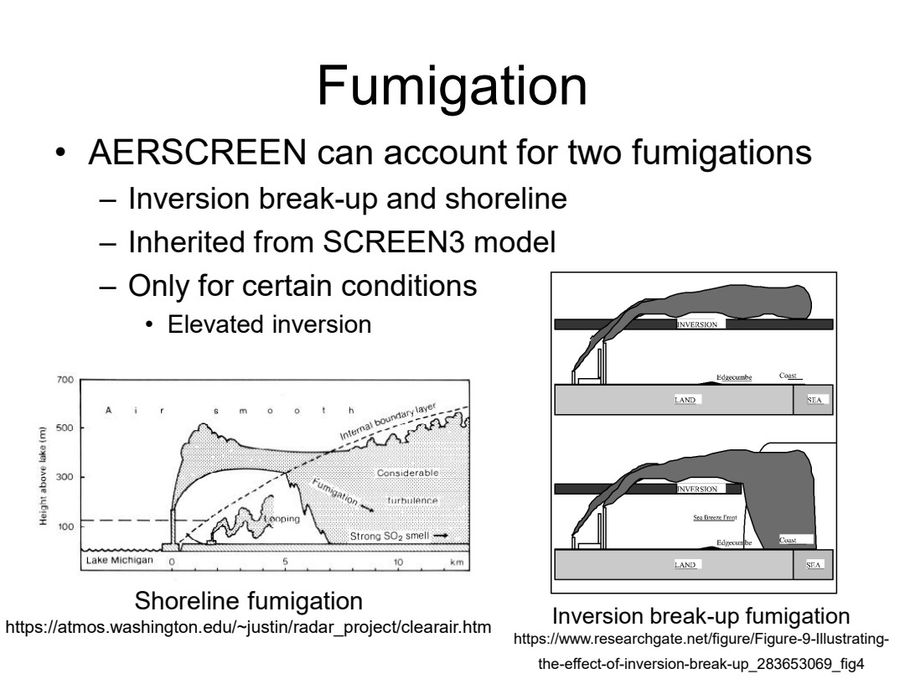

## PDF page 20

Source locator: `ENV6106-12-aerscreen`, PDF p. 20. [Original PDF page](../../originals/6106/12_AERSCREEN.pdf#page=20).

Printed slide number candidate: not identified (use PDF page as canonical locator).

Generated navigation topics: Dispersion and Gaussian models

Extraction flags: sparse-text

### Extracted source text

> Fig. 21. AERSCREEN flowchart

### Original page appearance

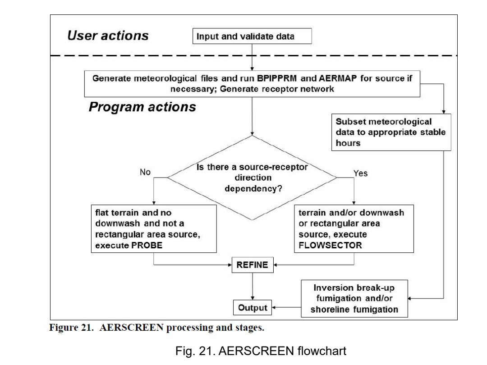

## PDF page 21

Source locator: `ENV6106-12-aerscreen`, PDF p. 21. [Original PDF page](../../originals/6106/12_AERSCREEN.pdf#page=21).

Printed slide number candidate: not identified (use PDF page as canonical locator).

Generated navigation topics: Dispersion and Gaussian models

Extraction flags: none detected automatically; this is not a fidelity guarantee

### Extracted source text

> Important AERSCREEN outputs
> • Output data: user_defined_name.out
> – Summary of input parameters and output concentration data
> • Log file: user_defined_name.log
> – Logs from AERSCREEN run
> • Restart file: aerscreen.inp, user_defined_name.inp
> – Stores all inputs information and can serve as a template for a 
> quick next-round run

### Original page appearance

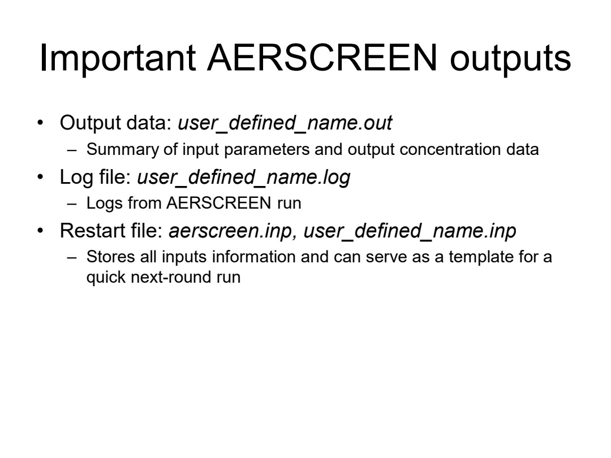
