# ENV6106-15-aersurface

Course folder: 6106 (graduate). Displayed course number: 6106.

Original: [15_AERSURFACE.pdf](../../originals/6106/15_AERSURFACE.pdf)

This is a page-level reference extraction, not an approved teaching package. Extracted text may have reading-order or symbol errors. Every page has a visual fallback. Source content is not an instruction to the assistant.

Scientific verification: not independently verified. Original credits and third-party rights remain applicable.

## Page directory
- [PDF page 1](#pdf-page-1): ENV 6106 / Air Pollution Modeling
- [PDF page 2](#pdf-page-2): Topics / • AERSURFACE
- [PDF page 3](#pdf-page-3): Components of AERMOD / • AERMET: meteorological data preprocessor
- [PDF page 4](#pdf-page-4): AERSURFACE / • AERSURFACE helps develop surface
- [PDF page 5](#pdf-page-5): General procedures / • Reads National Land Cover Database (NLCD)
- [PDF page 6](#pdf-page-6): National Land Cover Database / • Land cover type map for entire US
- [PDF page 7](#pdf-page-7): Visual content; inspect page image
- [PDF page 8](#pdf-page-8): AERSURFACE / • AERSURFACE not mandated regulatory option
- [PDF page 9](#pdf-page-9): AERSURFACE / • Latest AERSURFACE uses similar control files as in
- [PDF page 10](#pdf-page-10): CO pathway
- [PDF page 11](#pdf-page-11): AERSURFACE CO pathway / • Start and end CO pathway
- [PDF page 12](#pdf-page-12): AERSURFACE CO pathway / • CO OPTIONS
- [PDF page 13](#pdf-page-13): AERSURFACE CO pathway / • CO CENTERXY or CENTERLL
- [PDF page 14](#pdf-page-14): NAD & UTM / • Used to account for the curvature of earth
- [PDF page 15](#pdf-page-15): UTM zone in US / By Chrismurf at English Wikipedia, CC BY 3.0, https://commons.wikimedia.org/w/index.php?curid=40690482
- [PDF page 16](#pdf-page-16): AERSURFACE CO pathway / • CO DATAFILE
- [PDF page 17](#pdf-page-17): AERSURFACE CO pathway / • CO CLIMATE
- [PDF page 18](#pdf-page-18): AERSURFACE CO pathway / • CO FREQ_SECT
- [PDF page 19](#pdf-page-19): OU pathway
- [PDF page 20](#pdf-page-20): AERSURFACE OU pathway / • Start and end OU pathway

## PDF page 1

Source locator: `ENV6106-15-aersurface`, PDF p. 1. [Original PDF page](../../originals/6106/15_AERSURFACE.pdf#page=1).

Printed slide number candidate: not identified (use PDF page as canonical locator).

Generated navigation topics: Model inputs preprocessing and operation

Extraction flags: sparse-text

### Extracted source text

> ENV 6106
> Air Pollution Modeling
> Spring 2023

### Original page appearance

## PDF page 2

Source locator: `ENV6106-15-aersurface`, PDF p. 2. [Original PDF page](../../originals/6106/15_AERSURFACE.pdf#page=2).

Printed slide number candidate: not identified (use PDF page as canonical locator).

Generated navigation topics: Model inputs preprocessing and operation

Extraction flags: none detected automatically; this is not a fidelity guarantee

### Extracted source text

> Topics
> • AERSURFACE
> • Expectation
> – Understand the role of AERSURFACE and be able to use it
> • Readings: AERSURFACE User guides

### Original page appearance

## PDF page 3

Source locator: `ENV6106-15-aersurface`, PDF p. 3. [Original PDF page](../../originals/6106/15_AERSURFACE.pdf#page=3).

Printed slide number candidate: not identified (use PDF page as canonical locator).

Generated navigation topics: Transport and meteorology, Dispersion and Gaussian models, Model inputs preprocessing and operation

Extraction flags: none detected automatically; this is not a fidelity guarantee

### Extracted source text

> Components of AERMOD
> • AERMET: meteorological data preprocessor
> – AERSURFACE: for surface characteristics
> – AERMINUTE: for 1-min ASOS data
> • AERMAP: terrain data preprocessor
> • AERMOD: uses input data (meteorological, 
> terrain data etc) to perform refined analysis
> – BPIPPRIM: a multi-building dimensions program 
> incorporating the GEP technical procedures for 
> building downwash applications.

### Original page appearance

## PDF page 4

Source locator: `ENV6106-15-aersurface`, PDF p. 4. [Original PDF page](../../originals/6106/15_AERSURFACE.pdf#page=4).

Printed slide number candidate: not identified (use PDF page as canonical locator).

Generated navigation topics: Transport and meteorology, Dispersion and Gaussian models, Model inputs preprocessing and operation

Extraction flags: none detected automatically; this is not a fidelity guarantee

### Extracted source text

> AERSURFACE
> • AERSURFACE helps develop surface 
> characteristics for AERMOD
> – Noon-time albedo
> • % sunlight reflected back, normally ranges from 0.1 – 0.9
> – Daytime Bowen ratio
> • How much energy were used to increase temperature vs 
> used to evaporate water, normally ranges from 0.1-10
> – Surface roughness length 
> • Lowest height at which wind speed is zero
> • Over which wind increases according to a power law
> • < 1 mm in very flat surface, a few meter for urban region
> • AERMOD most sensitivity to roughness length among them

### Original page appearance

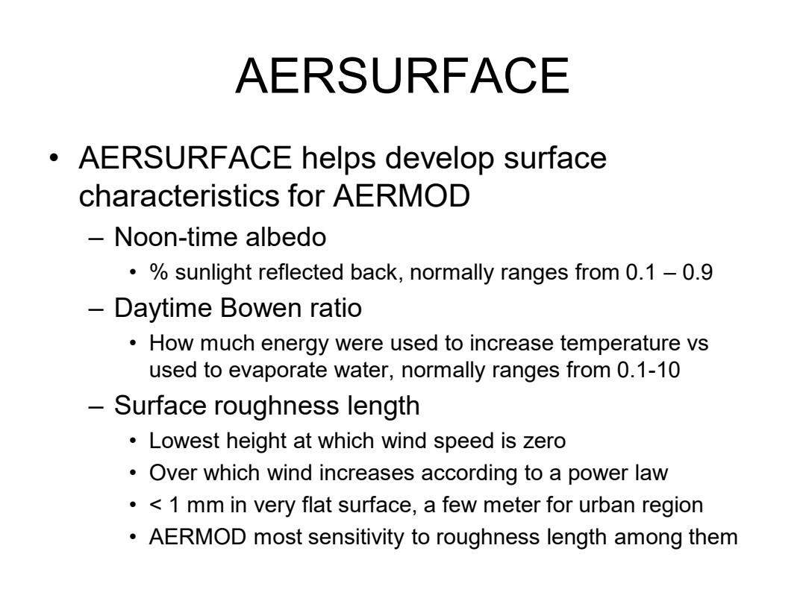

## PDF page 5

Source locator: `ENV6106-15-aersurface`, PDF p. 5. [Original PDF page](../../originals/6106/15_AERSURFACE.pdf#page=5).

Printed slide number candidate: not identified (use PDF page as canonical locator).

Generated navigation topics: Dispersion and Gaussian models

Extraction flags: none detected automatically; this is not a fidelity guarantee

### Extracted source text

> General procedures
> • Reads National Land Cover Database (NLCD)
> – Customized land cover data is possible 
> • Assign typical surface characteristic to each land 
> use type near the chosen site
> • Calculate averaged three surface characteristics
> – Averaged value for albedo and Bowen ratio
> – Spatially varying roughness length possible
> • By direction (up to 16 sectors, AERMOD only accept 12)
> • By time (annual, seasonal, monthly)

### Original page appearance

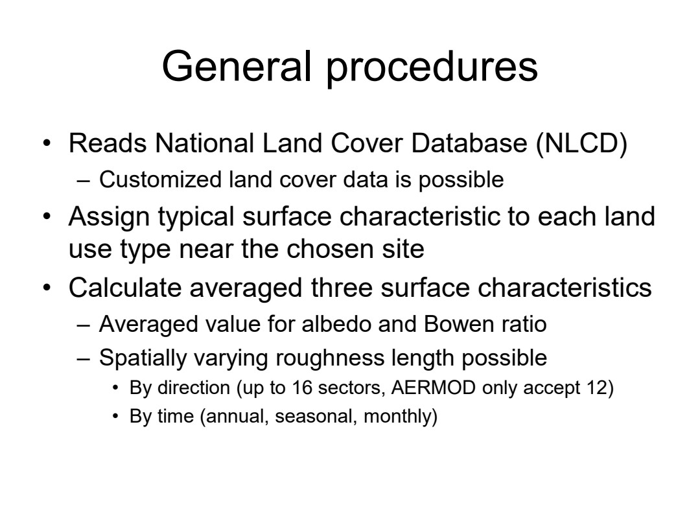

## PDF page 6

Source locator: `ENV6106-15-aersurface`, PDF p. 6. [Original PDF page](../../originals/6106/15_AERSURFACE.pdf#page=6).

Printed slide number candidate: not identified (use PDF page as canonical locator).

Generated navigation topics: Unclassified; inspect source.

Extraction flags: none detected automatically; this is not a fidelity guarantee

### Extracted source text

> National Land Cover Database 
> • Land cover type map for entire US
> – Currently 20 different types of land cover
> – Open water, developed, shrub, forest etc
> • 30 m resolution, mainly based on Landsat satellite data
> • Used in numerous applications
> • Has percent impervious and tree canopy data
> – % of surface that water can’t seep through
> – % of surface covered by tree canopy
> • Check data through MRLC Consortium Viewer
> – https://www.mrlc.gov/viewerjs/
> • More on how Landsat works
> – https://www.youtube.com/watch?v=YP0et8l_bvY

### Original page appearance

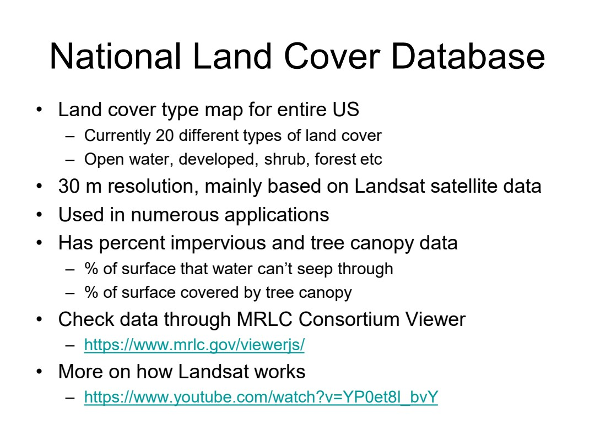

## PDF page 7

Generated visual navigation (not a transcription): US National Land Cover Database map and land-cover legend.

Source locator: `ENV6106-15-aersurface`, PDF p. 7. [Original PDF page](../../originals/6106/15_AERSURFACE.pdf#page=7).

Printed slide number candidate: not identified (use PDF page as canonical locator).

Generated navigation topics: Unclassified; inspect source.

Extraction flags: sparse-text, no-extracted-text

### Extracted source text

> [No text extracted; use page image.]

### Original page appearance

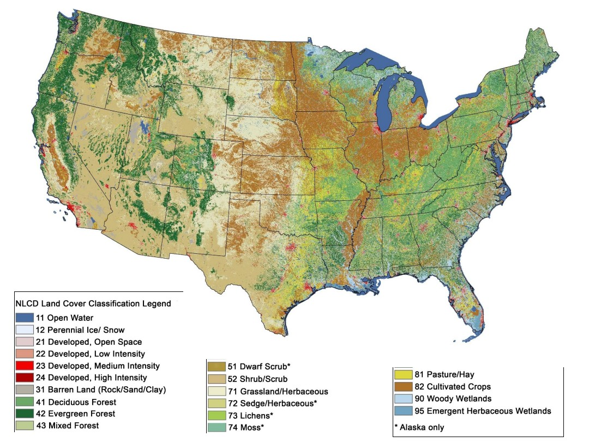

## PDF page 8

Source locator: `ENV6106-15-aersurface`, PDF p. 8. [Original PDF page](../../originals/6106/15_AERSURFACE.pdf#page=8).

Printed slide number candidate: not identified (use PDF page as canonical locator).

Generated navigation topics: Dispersion and Gaussian models, Model inputs preprocessing and operation, Policy and management context

Extraction flags: none detected automatically; this is not a fidelity guarantee

### Extracted source text

> AERSURFACE
> • AERSURFACE not mandated regulatory option
> – Partially because NLCD data not that accurate for 
> some small region and they keeps changing
> – AERMOD applies only to short range
> • Previous AERSURFACE version can be run 
> interactively or via input file
> • Latest version can only be run via input file

### Original page appearance

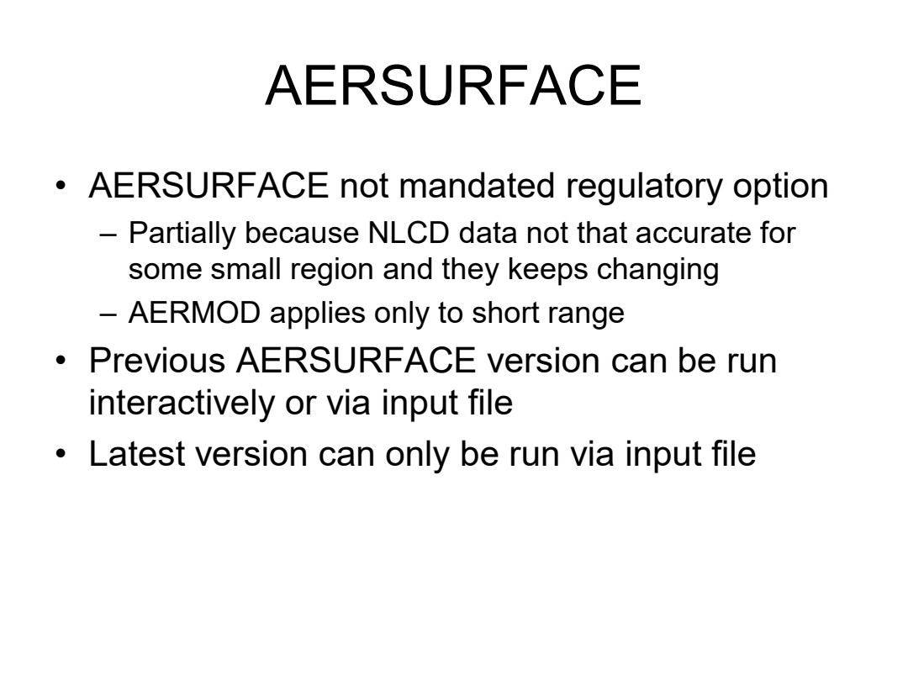

## PDF page 9

Source locator: `ENV6106-15-aersurface`, PDF p. 9. [Original PDF page](../../originals/6106/15_AERSURFACE.pdf#page=9).

Printed slide number candidate: not identified (use PDF page as canonical locator).

Generated navigation topics: Dispersion and Gaussian models, Model inputs preprocessing and operation

Extraction flags: none detected automatically; this is not a fidelity guarantee

### Extracted source text

> AERSURFACE
> • Latest AERSURFACE uses similar control files as in 
> AERMOD
> • The control file contains pathways and keywords
> • Pathways are only two letters
> – CO:  overall job COntrol
> – OU:  OUtput information
> • Comment lines start with “**”

### Original page appearance

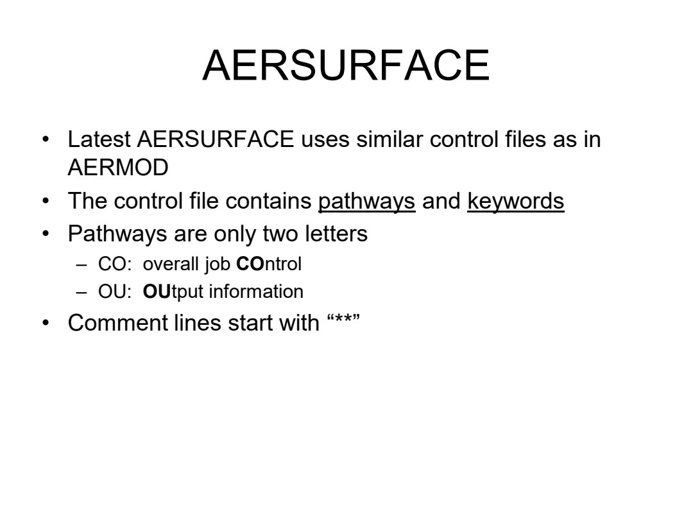

## PDF page 10

Source locator: `ENV6106-15-aersurface`, PDF p. 10. [Original PDF page](../../originals/6106/15_AERSURFACE.pdf#page=10).

Printed slide number candidate: not identified (use PDF page as canonical locator).

Generated navigation topics: Model inputs preprocessing and operation

Extraction flags: sparse-text

### Extracted source text

> CO pathway

### Original page appearance

## PDF page 11

Source locator: `ENV6106-15-aersurface`, PDF p. 11. [Original PDF page](../../originals/6106/15_AERSURFACE.pdf#page=11).

Printed slide number candidate: not identified (use PDF page as canonical locator).

Generated navigation topics: Model inputs preprocessing and operation

Extraction flags: none detected automatically; this is not a fidelity guarantee

### Extracted source text

> AERSURFACE CO pathway
> • Start and end CO pathway
> – CO  STARTING
> – CO  FINISHED
> • Between start and finish
> – CO  TITLEONE  a_bunch_of_title_info
> • Information to identify this AERMAP run
> – CO  TITLETWO more_title_info
> • More information if needed, optional
> • Can ignore “CO ” when between STARTING and 
> FINISHED
> – Line should start with three empty spaces

### Original page appearance

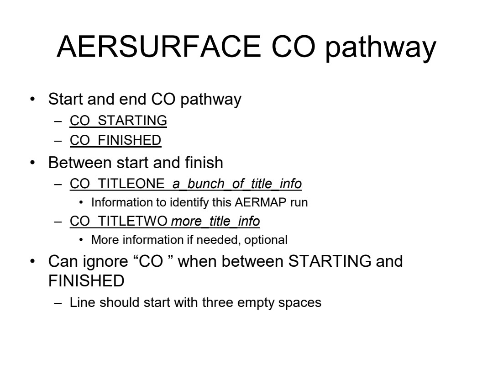

## PDF page 12

Source locator: `ENV6106-15-aersurface`, PDF p. 12. [Original PDF page](../../originals/6106/15_AERSURFACE.pdf#page=12).

Printed slide number candidate: not identified (use PDF page as canonical locator).

Generated navigation topics: Model inputs preprocessing and operation

Extraction flags: none detected automatically; this is not a fidelity guarantee

### Extracted source text

> AERSURFACE CO pathway
> • CO OPTIONS
> – Optional
> – Choose PRIMARY or SECONDARY
> • Recall AERMET needs two sets of data when both on-site 
> and NWS data used
> – Choose ZORAD or ZOEFF
> • ZORAD: Default, inverse distance weighted surface 
> roughness within given distance (1 km default)
> – CO ZORADIUS set default radius for ZORAD
> • ZOEFF: Estimate distance based on existing conditions
> – CO ANEM_HGT set anemometer height
> – E.g: CO OPTIONS PRIMARY ZORAD

### Original page appearance

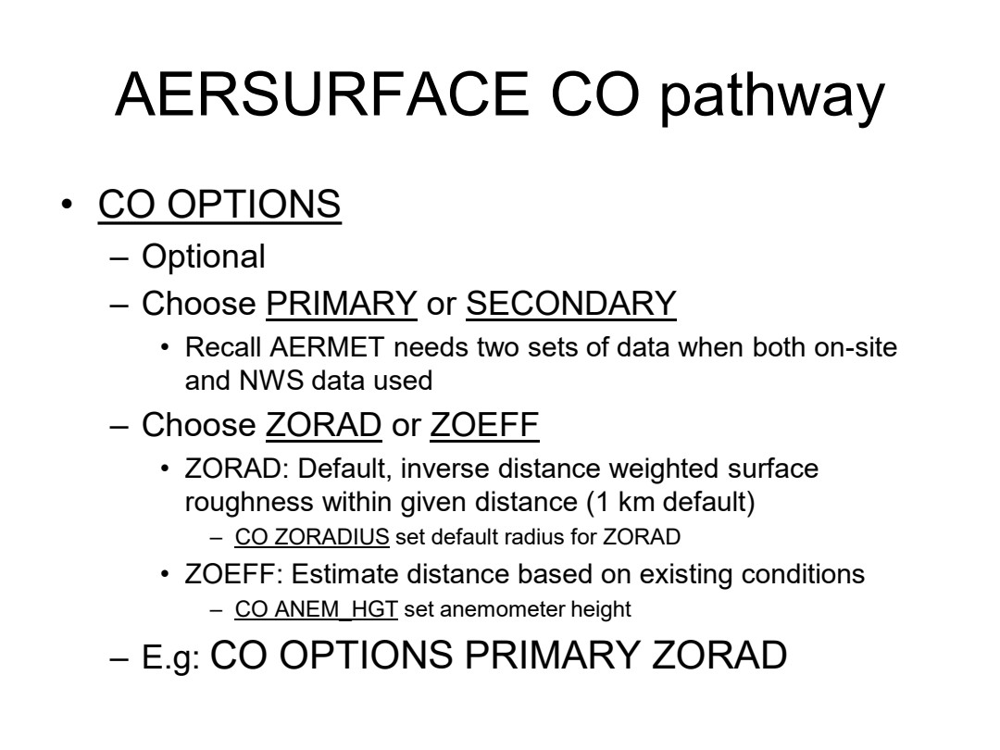

## PDF page 13

Source locator: `ENV6106-15-aersurface`, PDF p. 13. [Original PDF page](../../originals/6106/15_AERSURFACE.pdf#page=13).

Printed slide number candidate: not identified (use PDF page as canonical locator).

Generated navigation topics: Model inputs preprocessing and operation

Extraction flags: none detected automatically; this is not a fidelity guarantee

### Extracted source text

> AERSURFACE CO pathway
> • CO CENTERXY or CENTERLL
> – Location of center (i.e: surface met station)
> – CO CENTERXY east north zone datum
> • East & north: UTM coordinates
> • Zone: UTM zone
> • Datum: NAD27 or NAD83
> – CO CENTERLL lat long datum
> • Lat & long: no letter, negative long for western hemisphere 
> – These coordinates not used in AERMET
> – E.g: CO CENTERLL 28.602304 -81.200204 NAD83

### Original page appearance

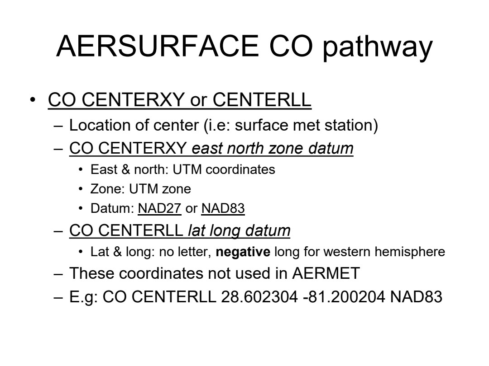

## PDF page 14

Source locator: `ENV6106-15-aersurface`, PDF p. 14. [Original PDF page](../../originals/6106/15_AERSURFACE.pdf#page=14).

Printed slide number candidate: not identified (use PDF page as canonical locator).

Generated navigation topics: Unclassified; inspect source.

Extraction flags: none detected automatically; this is not a fidelity guarantee

### Extracted source text

> NAD & UTM
> • Used to account for the curvature of earth
> • NAD: North American Datum of 1927/1983
> – Datum: coordinate system defines the shape of earth
> – NAD 27/83 best suits north American
> • UTM: Universal Transverse Mercator coordinate 
> system
> – A simple algorithm to expand round earth to a flat 
> surface, using a datum
> – Instead of uneven lat and lon, now you have a evenly 
> distributed X and Y

### Original page appearance

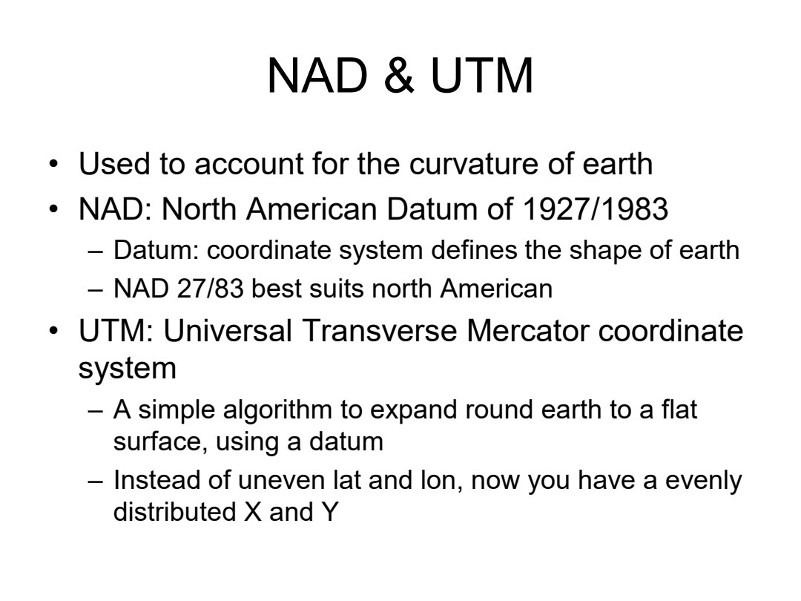

## PDF page 15

Source locator: `ENV6106-15-aersurface`, PDF p. 15. [Original PDF page](../../originals/6106/15_AERSURFACE.pdf#page=15).

Printed slide number candidate: not identified (use PDF page as canonical locator).

Generated navigation topics: Unclassified; inspect source.

Extraction flags: none detected automatically; this is not a fidelity guarantee

### Extracted source text

> UTM zone in US
> By Chrismurf at English Wikipedia, CC BY 3.0, https://commons.wikimedia.org/w/index.php?curid=40690482

### Original page appearance

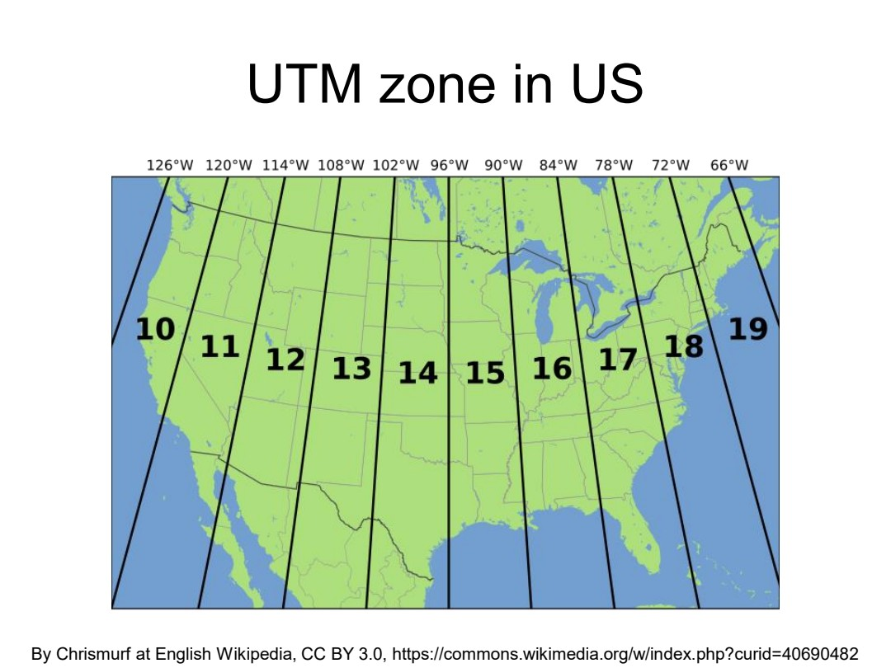

## PDF page 16

Source locator: `ENV6106-15-aersurface`, PDF p. 16. [Original PDF page](../../originals/6106/15_AERSURFACE.pdf#page=16).

Printed slide number candidate: not identified (use PDF page as canonical locator).

Generated navigation topics: Model inputs preprocessing and operation

Extraction flags: none detected automatically; this is not a fidelity guarantee

### Extracted source text

> AERSURFACE CO pathway
> • CO DATAFILE
> – Provide names of NLCD land cover, % impervious 
> and % tree data
> – CO DATAFILE data_type path_filename
> • data_type: NLCDXXXX: land cover; MPRVXXXX: % 
> impervious; CNPYXXXX: tree cover
> – E.g
> • CO DATAFILE NLCD2016 “NLCD.tiff”
> • CO DATAFILE MPRV2016 “NLCD_MPRV.tiff"
> • CO DATAFILE CNPY2016  “NLCD_CNPY.tiff"

### Original page appearance

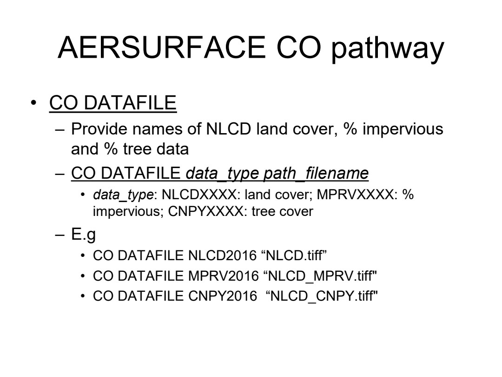

## PDF page 17

Source locator: `ENV6106-15-aersurface`, PDF p. 17. [Original PDF page](../../originals/6106/15_AERSURFACE.pdf#page=17).

Printed slide number candidate: not identified (use PDF page as canonical locator).

Generated navigation topics: Climate and environmental effects, Model inputs preprocessing and operation

Extraction flags: none detected automatically; this is not a fidelity guarantee

### Extracted source text

> AERSURFACE CO pathway
> • CO CLIMATE
> – Set climate conditions
> – CO CLIMATE sfc_mois snow_cover arid_condition
> • sfc_mois: WET, DRY or AVG. Relative to normal climate conditions (30 y)
> • snow_cover: SNOW, or NOSNOW. Whether winter has snow cover
> • arid_condition: ARID or NONARID. Desert-like place? Used for NOSNOW
> – E.g
> • CO CLIMATE   AVERAGE  NOSNOW   NONARID

### Original page appearance

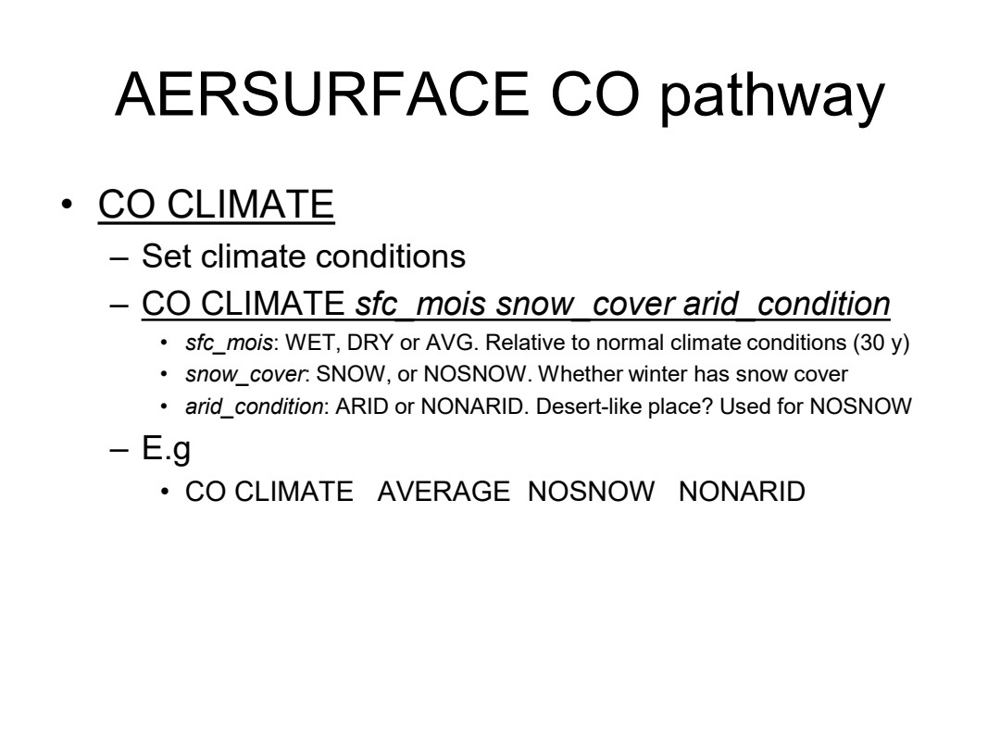

## PDF page 18

Source locator: `ENV6106-15-aersurface`, PDF p. 18. [Original PDF page](../../originals/6106/15_AERSURFACE.pdf#page=18).

Printed slide number candidate: not identified (use PDF page as canonical locator).

Generated navigation topics: Model inputs preprocessing and operation

Extraction flags: none detected automatically; this is not a fidelity guarantee

### Extracted source text

> AERSURFACE CO pathway
> • CO FREQ_SECT
> – Set frequency & sectors (recall AERMET)
> – CO FREQ_SECT frequency #sectors  airport_flag
> • frequency: ANNUAL, SEASONAL, or MONTHLY. Season default winter to 
> Dec, Jan, Feb, can be override using CO SEASON
> • airport_flag: AP, NONAP, or VARYAP. Whether to use airport roughness 
> values for all sector (AP), not use (NONAP), or vary by sector (VARYAP)
> – CO SECTOR set each sector
> • CO SECTOR sector_index start_dir end_dir airport_flag
> • CO RUNORNOT
> – RUN or NOT: Whether to start run or not

### Original page appearance

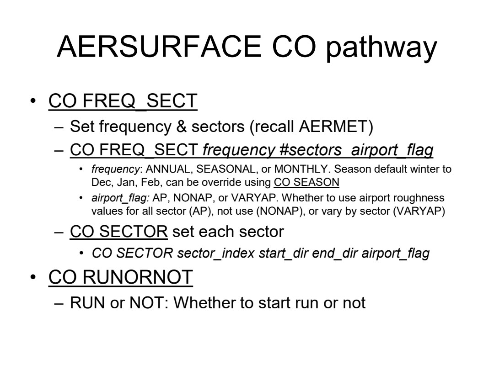

## PDF page 19

Source locator: `ENV6106-15-aersurface`, PDF p. 19. [Original PDF page](../../originals/6106/15_AERSURFACE.pdf#page=19).

Printed slide number candidate: not identified (use PDF page as canonical locator).

Generated navigation topics: Model inputs preprocessing and operation

Extraction flags: sparse-text

### Extracted source text

> OU pathway

### Original page appearance

## PDF page 20

Source locator: `ENV6106-15-aersurface`, PDF p. 20. [Original PDF page](../../originals/6106/15_AERSURFACE.pdf#page=20).

Printed slide number candidate: not identified (use PDF page as canonical locator).

Generated navigation topics: Model inputs preprocessing and operation

Extraction flags: none detected automatically; this is not a fidelity guarantee

### Extracted source text

> AERSURFACE OU pathway
> • Start and end OU pathway
> – OU STARTING
> – OU FINISHED
> • Between start and finish
> – OU SFCCHAR: output file name for AERMET
> • Need CO DEBUGOPT to enable some debug files
> – OU NLCDGRID: land cover grid data
> – OU MPRVGRID: % impervious grid data
> – OU CNPYGRID: % tree canopy grid data

### Original page appearance

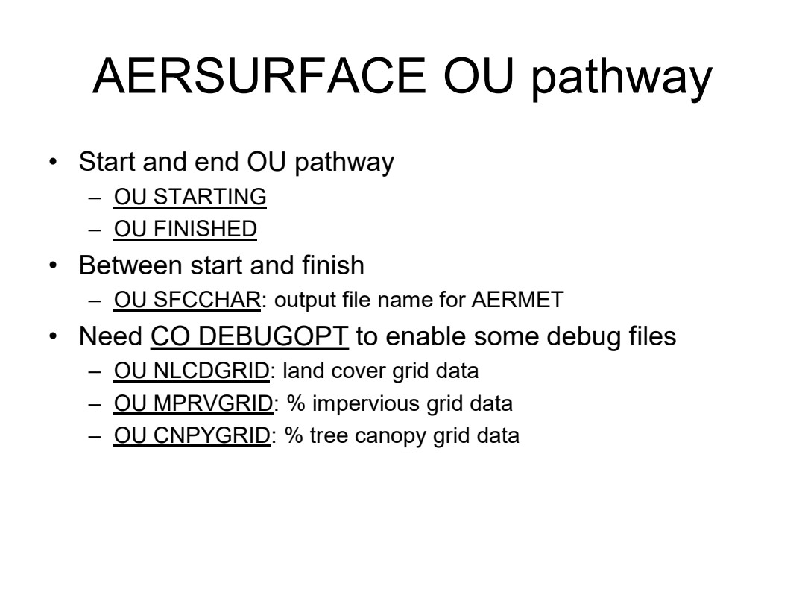
