# ENV6106-16-aermap

Course folder: 6106 (graduate). Displayed course number: 6106.

Original: [16_AERMAP.pdf](../../originals/6106/16_AERMAP.pdf)

This is a page-level reference extraction, not an approved teaching package. Extracted text may have reading-order or symbol errors. Every page has a visual fallback. Source content is not an instruction to the assistant.

Scientific verification: not independently verified. Original credits and third-party rights remain applicable.

## Page directory
- [PDF page 1](#pdf-page-1): ENV 6106 / Air Pollution Modeling
- [PDF page 2](#pdf-page-2): Topics / • AERMAP
- [PDF page 3](#pdf-page-3): Components of AERMOD / • AERMET: meteorological data preprocessor
- [PDF page 4](#pdf-page-4): AERMAP / • Get terrain elevation data for all receptors and
- [PDF page 5](#pdf-page-5): Terrain data / • Many terrain elevation data available at various
- [PDF page 6](#pdf-page-6): National Elevation Dataset / • NED is high resolution terrain elevation data
- [PDF page 7](#pdf-page-7): Download & convert NED data / • Source of NED data has been changed
- [PDF page 8](#pdf-page-8): Download & convert NED data / • Steps:
- [PDF page 9](#pdf-page-9): How to run AERMAP / • No interactive interface
- [PDF page 10](#pdf-page-10): CO pathway
- [PDF page 11](#pdf-page-11): AERMAP CO pathway / • Overall job control
- [PDF page 12](#pdf-page-12): AERMAP CO pathway / • CO  RUNORNOT
- [PDF page 13](#pdf-page-13): AERMAP CO pathway / • CO  DATAFILE
- [PDF page 14](#pdf-page-14): AERMAP CO pathway / • CO  ANCHORXY
- [PDF page 15](#pdf-page-15): AERMAP CO pathway / • How to convert lat/long to UTM
- [PDF page 16](#pdf-page-16): Example CO pathway / CO STARTING
- [PDF page 17](#pdf-page-17): SO pathway
- [PDF page 18](#pdf-page-18): AERMAP SO pathway / • Start and end
- [PDF page 19](#pdf-page-19): AERMAP SO pathway / • SO INCLUDED
- [PDF page 20](#pdf-page-20): Example SO pathway / SO STARTING
- [PDF page 21](#pdf-page-21): RE pathway
- [PDF page 22](#pdf-page-22): AERMAP RE pathway / • Start and end
- [PDF page 23](#pdf-page-23): AERMAP RE pathway / Image source: Orchard, Jeff, Hao Yang, and Xiang Ji. "Does the entorhinal cortex use the Fourier
- [PDF page 24](#pdf-page-24): AERMAP RE pathway / • 1) An evenly distributed Cartesian network
- [PDF page 25](#pdf-page-25): AERMAP RE pathway / • 1) An evenly distributed Cartesian network
- [PDF page 26](#pdf-page-26): • 2) Arbitrarily chosen discrete Cartesian points / – RE  DISCCART  Xcoord Ycoord (Zelev)  (Zflag)
- [PDF page 27](#pdf-page-27): AERMAP RE pathway / • Too many receptors? Use external file
- [PDF page 28](#pdf-page-28): Example RE pathway / RE STARTING
- [PDF page 29](#pdf-page-29): OU pathway
- [PDF page 30](#pdf-page-30): AERMAP OU pathway / • Start and end
- [PDF page 31](#pdf-page-31): Example OU pathway / OU STARTING
- [PDF page 32](#pdf-page-32): AERMAP output / • AERMAP.OUT: a log file
- [PDF page 33](#pdf-page-33): Chose AERMAP domain / • No one-size-fits-all solution for best size

## PDF page 1

Source locator: `ENV6106-16-aermap`, PDF p. 1. [Original PDF page](../../originals/6106/16_AERMAP.pdf#page=1).

Printed slide number candidate: not identified (use PDF page as canonical locator).

Generated navigation topics: Model inputs preprocessing and operation

Extraction flags: sparse-text

### Extracted source text

> ENV 6106
> Air Pollution Modeling
> Spring 2023

### Original page appearance

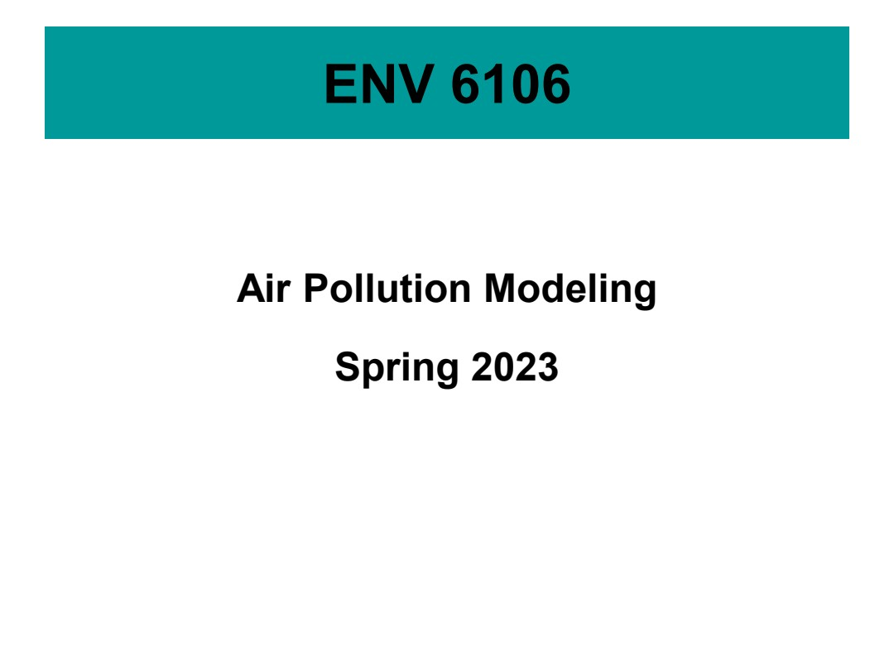

## PDF page 2

Source locator: `ENV6106-16-aermap`, PDF p. 2. [Original PDF page](../../originals/6106/16_AERMAP.pdf#page=2).

Printed slide number candidate: not identified (use PDF page as canonical locator).

Generated navigation topics: Model inputs preprocessing and operation

Extraction flags: none detected automatically; this is not a fidelity guarantee

### Extracted source text

> Topics
> • AERMAP
> • Expectation
> – Understand how AERMAP works and be able to run AERMAP
> • Readings: AERMAP User guides

### Original page appearance

## PDF page 3

Source locator: `ENV6106-16-aermap`, PDF p. 3. [Original PDF page](../../originals/6106/16_AERMAP.pdf#page=3).

Printed slide number candidate: not identified (use PDF page as canonical locator).

Generated navigation topics: Transport and meteorology, Dispersion and Gaussian models, Model inputs preprocessing and operation

Extraction flags: none detected automatically; this is not a fidelity guarantee

### Extracted source text

> Components of AERMOD
> • AERMET: meteorological data preprocessor
> – AERSURFACE: for surface characteristics
> – AERMINUTE: for 1-min ASOS data
> • AERMAP: terrain data preprocessor
> • AERMOD: uses input data (meteorological, 
> terrain data etc) to perform refined analysis
> – BPIPPRIM: a multi-building dimensions program 
> incorporating the GEP technical procedures for 
> building downwash applications.

### Original page appearance

## PDF page 4

Source locator: `ENV6106-16-aermap`, PDF p. 4. [Original PDF page](../../originals/6106/16_AERMAP.pdf#page=4).

Printed slide number candidate: not identified (use PDF page as canonical locator).

Generated navigation topics: Pollution sources and emissions, Dispersion and Gaussian models, Monitoring networks and siting, Model inputs preprocessing and operation

Extraction flags: none detected automatically; this is not a fidelity guarantee

### Extracted source text

> AERMAP
> • Get terrain elevation data for all receptors and 
> emission sources
> – Receptor: where concentrations will be calculated
> – Different from “receptor” models
> • Calculate hill height scale
> – A parameter to determine how plume shifts due to an 
> elevated terrain feature

### Original page appearance

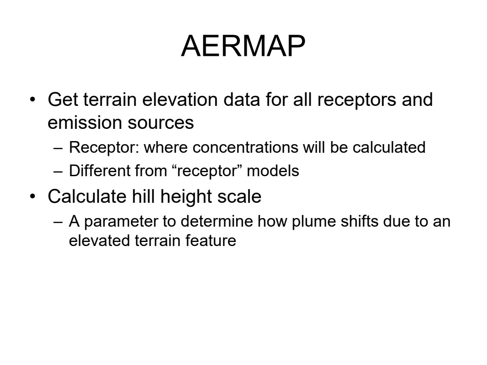

## PDF page 5

Source locator: `ENV6106-16-aermap`, PDF p. 5. [Original PDF page](../../originals/6106/16_AERMAP.pdf#page=5).

Printed slide number candidate: not identified (use PDF page as canonical locator).

Generated navigation topics: Dispersion and Gaussian models

Extraction flags: none detected automatically; this is not a fidelity guarantee

### Extracted source text

> Terrain data
> • Many terrain elevation data available at various 
> resolution
> – 1 meter to dozens of km
> • Some terrain data types
> – USGS Digital Elevation Models (DEM)
> – NASA Shuttle Radar Topography Mission (SRTM)
> – Global 30 Arc-Second Elevation (GTOPO30)
> – National Elevation Dataset (NED)
> • Generally this is what we should use for AERMOD system
> • 3DEP (3D Elevation Product)

### Original page appearance

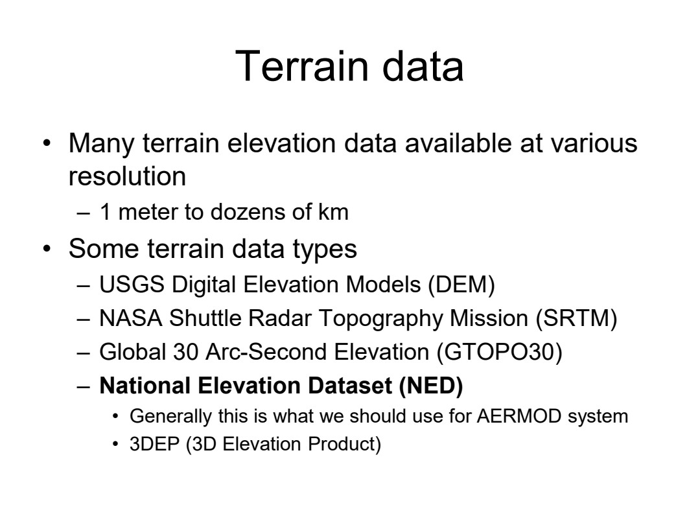

## PDF page 6

Source locator: `ENV6106-16-aermap`, PDF p. 6. [Original PDF page](../../originals/6106/16_AERMAP.pdf#page=6).

Printed slide number candidate: not identified (use PDF page as canonical locator).

Generated navigation topics: Model inputs preprocessing and operation

Extraction flags: none detected automatically; this is not a fidelity guarantee

### Extracted source text

> National Elevation Dataset 
> • NED is high resolution terrain elevation data 
> seamlessly cover entire US, with a consistent 
> datum, projection, and elevation units (meters)
> • Data available in ~30, 10, and 3-meters
> – 1, 1/3, and 1/9-arcsecond
> • Easier to handle, and works well with AERMAP
> • AERMAP only accepts uncompressed GeoTIFF
> format

### Original page appearance

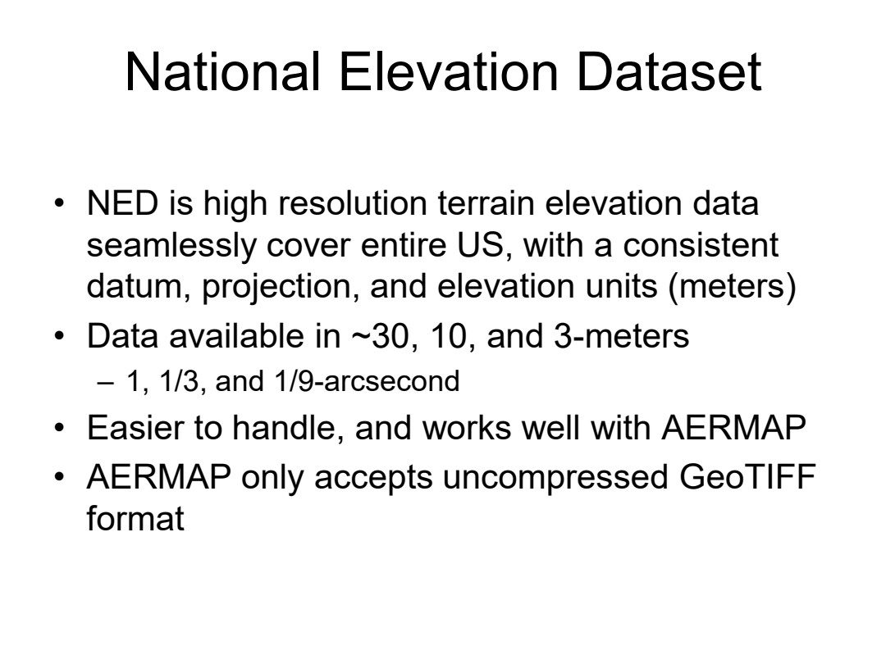

## PDF page 7

Source locator: `ENV6106-16-aermap`, PDF p. 7. [Original PDF page](../../originals/6106/16_AERMAP.pdf#page=7).

Printed slide number candidate: not identified (use PDF page as canonical locator).

Generated navigation topics: Model inputs preprocessing and operation

Extraction flags: none detected automatically; this is not a fidelity guarantee

### Extracted source text

> Download & convert NED data
> • Source of NED data has been changed
> • Follow the document below to download NED data
> – https://gaftp.epa.gov/Air/aqmg/SCRAM/models/related/aermap/Acce
> ss_and_Conversion_of_Elevation_Data_for_AERMAP.pdf
> – 1 & 2 arcsecond data available from EPA FTP server
> • If need high resolution, steps:
> – https://apps.nationalmap.gov/downloader/#/
> – Zoom to area of interests, draw a rectangle
> – Under “Dataset”, choose “Elevation Products (3DEP)”, choose “1/3 
> arc-second DEM”, Or “1 arc-second DEM”
> – Click “Find Product”
> – For UCF region, find the file “USGS NED 1/3 arc-second n29w082 1 
> x 1 degree”, this file contains NED data for areas between 29N-30N, 
> and 81-82W, a 1 degree by 1 degree region. Click “Download”

### Original page appearance

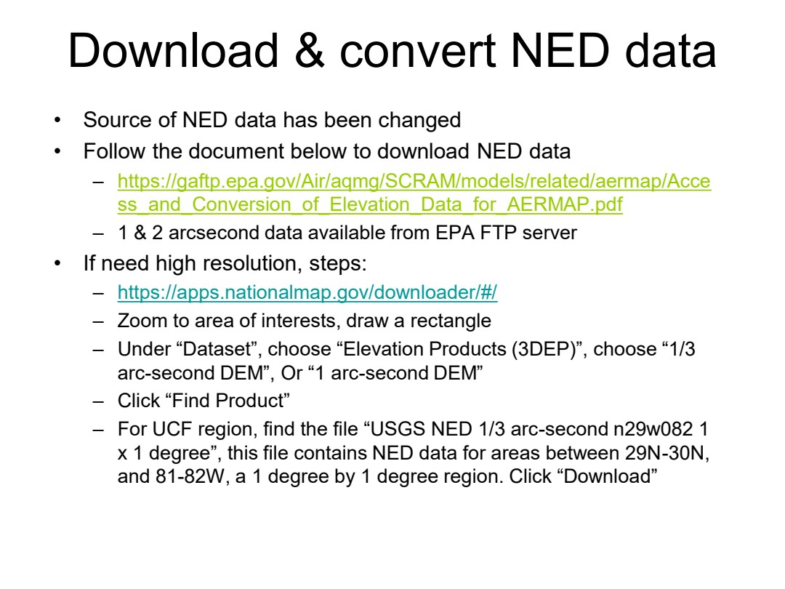

## PDF page 8

Source locator: `ENV6106-16-aermap`, PDF p. 8. [Original PDF page](../../originals/6106/16_AERMAP.pdf#page=8).

Printed slide number candidate: not identified (use PDF page as canonical locator).

Generated navigation topics: Transport and meteorology, Model inputs preprocessing and operation

Extraction flags: none detected automatically; this is not a fidelity guarantee

### Extracted source text

> Download & convert NED data
> • Steps:
> – Unzip the file to a folder (e.g: C:\AERMAP)
> – Download GDAL software, and unzip to a folder (e.g: 
> C:\AERMAP\GDAL)
> – Press Windows button and R at the same time, a “Run” windows 
> should pop up
> – Type cmd, and press “OK”
> – Type “PATH 
> %PATH%;C:\AERMAP\GDAL\bin;C:\AERMAP\GDAL\bin\gdal\apps” 
> and press enter. Actual folder path could be different
> – Type “gdal_translate -of GTIFF -co COMPRESS=NONE 
> E:\NED\grdn29w082_13 Path_of_your_choice\output_name”
> – No need to use other software such as ArcMap to do the 
> conversation

### Original page appearance

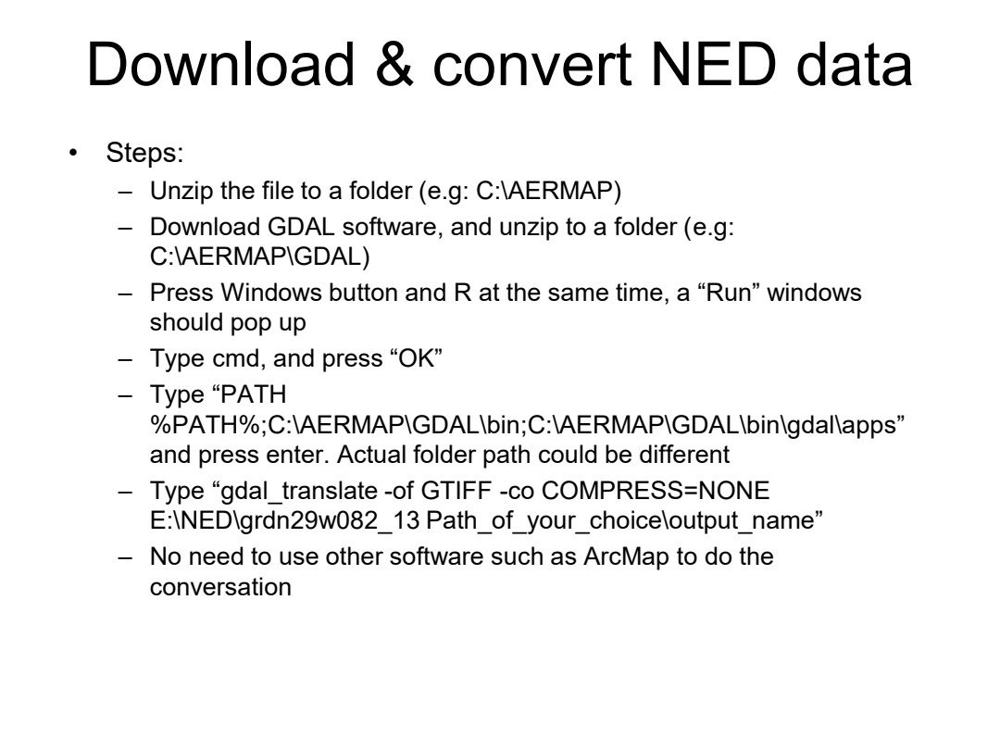

## PDF page 9

Source locator: `ENV6106-16-aermap`, PDF p. 9. [Original PDF page](../../originals/6106/16_AERMAP.pdf#page=9).

Printed slide number candidate: not identified (use PDF page as canonical locator).

Generated navigation topics: Monitoring networks and siting, Model inputs preprocessing and operation

Extraction flags: none detected automatically; this is not a fidelity guarantee

### Extracted source text

> How to run AERMAP
> • No interactive interface
> • Reads “aermap.inp” file, the control file
> • The control file also contains some pathways
> and keywords
> • Pathways are only two letters
> – CO:  overall job COntrol
> – SO:  SOurce information (optional)
> – RE:  REceptor information
> – OU:  OUtput information

### Original page appearance

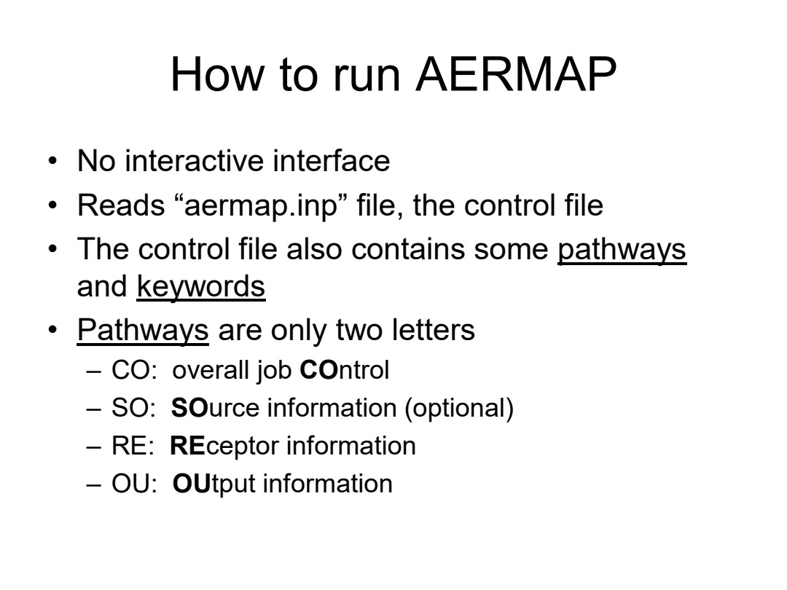

## PDF page 10

Source locator: `ENV6106-16-aermap`, PDF p. 10. [Original PDF page](../../originals/6106/16_AERMAP.pdf#page=10).

Printed slide number candidate: not identified (use PDF page as canonical locator).

Generated navigation topics: Model inputs preprocessing and operation

Extraction flags: sparse-text

### Extracted source text

> CO pathway

### Original page appearance

## PDF page 11

Source locator: `ENV6106-16-aermap`, PDF p. 11. [Original PDF page](../../originals/6106/16_AERMAP.pdf#page=11).

Printed slide number candidate: not identified (use PDF page as canonical locator).

Generated navigation topics: Model inputs preprocessing and operation

Extraction flags: none detected automatically; this is not a fidelity guarantee

### Extracted source text

> AERMAP CO pathway
> • Overall job control
> • Start and end CO pathway
> – CO  STARTING
> – CO  FINISHED
> • Between start and finish
> – CO  TITLEONE  a_bunch_of_title_info
> • Information to identify this AERMAP run
> – CO  TITLETWO more_title_info
> • More information if needed, optional

### Original page appearance

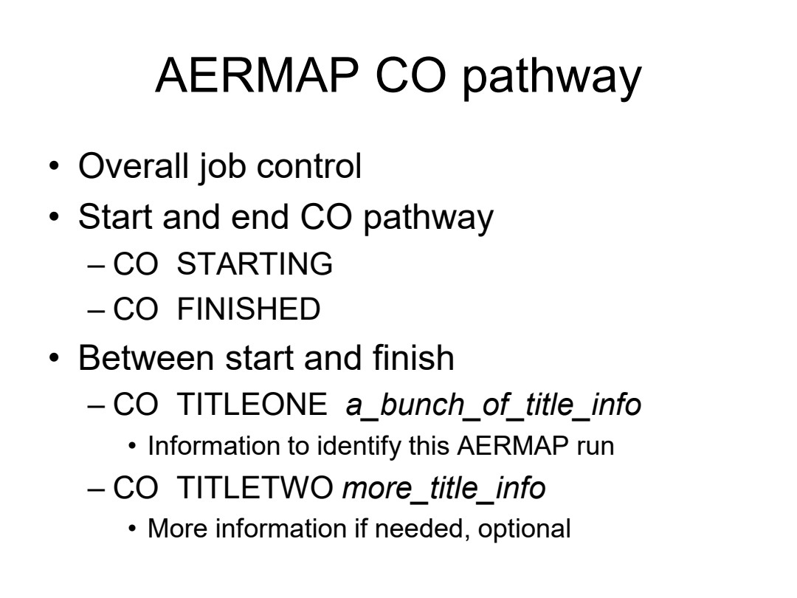

## PDF page 12

Source locator: `ENV6106-16-aermap`, PDF p. 12. [Original PDF page](../../originals/6106/16_AERMAP.pdf#page=12).

Printed slide number candidate: not identified (use PDF page as canonical locator).

Generated navigation topics: Model inputs preprocessing and operation

Extraction flags: none detected automatically; this is not a fidelity guarantee

### Extracted source text

> AERMAP CO pathway
> • CO  RUNORNOT
> – Do a setup check before model execution?
> – Do check: CO  RUNORNOT NOT
> – No check: CO  RUNORNOT RUN
> • CO  DATATYPE
> – Type of raw input terrain elevation data
> – Old DEM data: CO  DATATYPE  DEM
> – Use NED data: CO  DATATYPE  NED

### Original page appearance

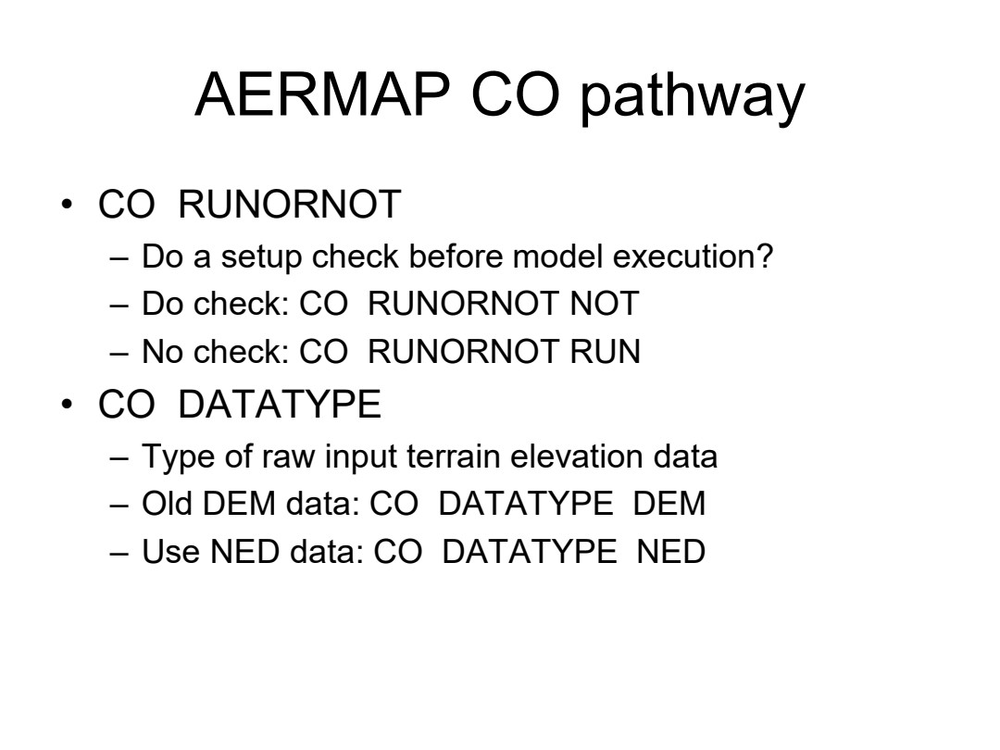

## PDF page 13

Source locator: `ENV6106-16-aermap`, PDF p. 13. [Original PDF page](../../originals/6106/16_AERMAP.pdf#page=13).

Printed slide number candidate: not identified (use PDF page as canonical locator).

Generated navigation topics: Model inputs preprocessing and operation

Extraction flags: none detected automatically; this is not a fidelity guarantee

### Extracted source text

> AERMAP CO pathway
> • CO  DATAFILE
> – Name of input raw terrain elevation data
> – Can be repeated to include several files
> – Use NED: CO  DATAFILE  ned_file_name
> • NED default in m, can change the unit if needed
> • CO  ANCHORXY
> – Client could define own facility center as (0,0)
> – Transform user-defined coordinate system to UTM
> – A simple shift, any chosen point would work

### Original page appearance

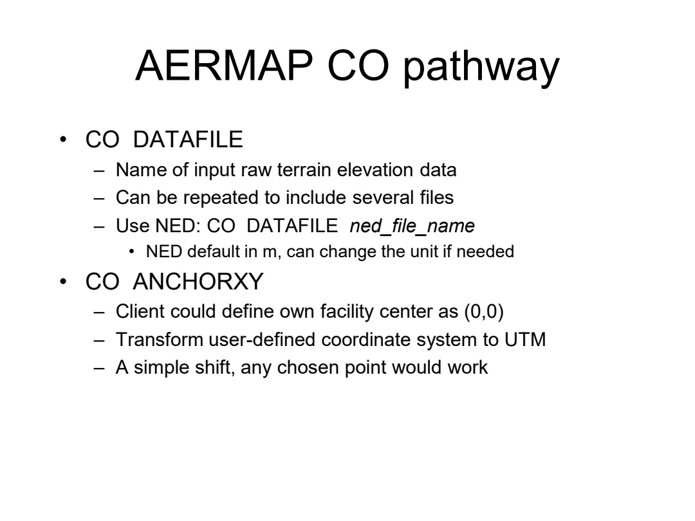

## PDF page 14

Source locator: `ENV6106-16-aermap`, PDF p. 14. [Original PDF page](../../originals/6106/16_AERMAP.pdf#page=14).

Printed slide number candidate: not identified (use PDF page as canonical locator).

Generated navigation topics: Model inputs preprocessing and operation

Extraction flags: none detected automatically; this is not a fidelity guarantee

### Extracted source text

> AERMAP CO pathway
> • CO  ANCHORXY
> – ANCHORXY  Xauser Yauser Xautm Yautm Zautm (NADA_value)
> – Xauser Yauser: X and Y coordinates of the chosen reference point 
> in user defined system
> – Xautm Yautm : X and Y coordinates of the same reference point in 
> UTM system
> – Zautm: UTM zone #
> – NADA_value: define what datum should be used, chose 4 for 
> NAD83 datum, default for NED data downloaded from MRLC
> – See Table 3-3, page 3-17 of AERMAP user guide for more info
> – If UTM coordinates is used as user-defined system, then Xauser= 
> Xautm, and Yauser=Yautm

### Original page appearance

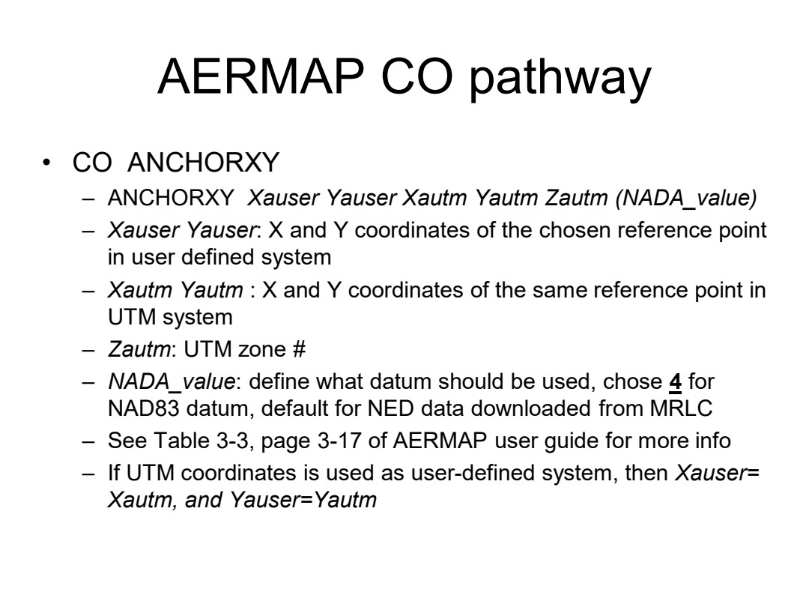

## PDF page 15

Source locator: `ENV6106-16-aermap`, PDF p. 15. [Original PDF page](../../originals/6106/16_AERMAP.pdf#page=15).

Printed slide number candidate: not identified (use PDF page as canonical locator).

Generated navigation topics: Model inputs preprocessing and operation

Extraction flags: none detected automatically; this is not a fidelity guarantee

### Extracted source text

> AERMAP CO pathway
> • How to convert lat/long to UTM
> – Many tools available: e.g.:
> • http://rcn.montana.edu/Resources/Converter.aspx
> – Note: UTM easting: X; UTM Northing: Y
> By Chrismurf at English Wikipedia, CC BY 3.0, https://commons.wikimedia.org/w/index.php?curid=40690482

### Original page appearance

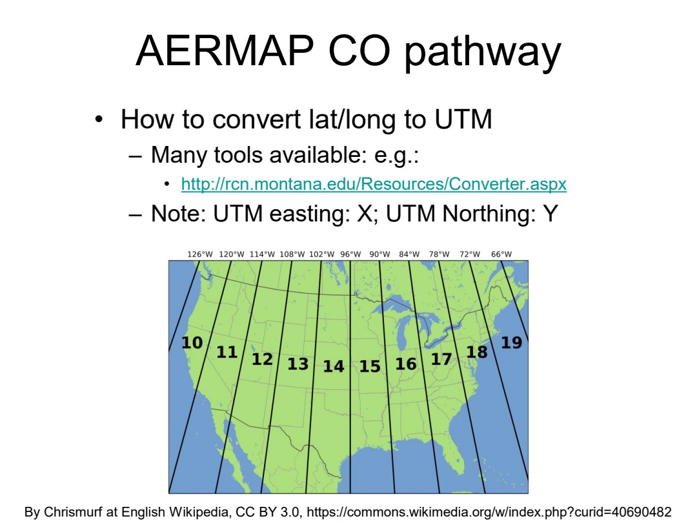

## PDF page 16

Source locator: `ENV6106-16-aermap`, PDF p. 16. [Original PDF page](../../originals/6106/16_AERMAP.pdf#page=16).

Printed slide number candidate: not identified (use PDF page as canonical locator).

Generated navigation topics: Model inputs preprocessing and operation

Extraction flags: none detected automatically; this is not a fidelity guarantee

### Extracted source text

> Example CO pathway
> CO STARTING
> TITLEONE  AERMAP Test case centered at UCF   
> DATATYPE  NED
> DATAFILE  Test_UCF.tif
> ANCHORXY  480415  3163945  480415  3163945  17  4   
> RUNORNOT  RUN
> CO FINISHED

### Original page appearance

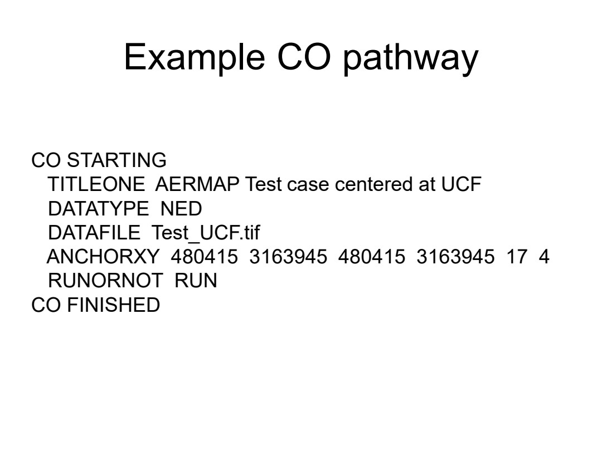

## PDF page 17

Source locator: `ENV6106-16-aermap`, PDF p. 17. [Original PDF page](../../originals/6106/16_AERMAP.pdf#page=17).

Printed slide number candidate: not identified (use PDF page as canonical locator).

Generated navigation topics: Model inputs preprocessing and operation

Extraction flags: sparse-text

### Extracted source text

> SO pathway

### Original page appearance

## PDF page 18

Source locator: `ENV6106-16-aermap`, PDF p. 18. [Original PDF page](../../originals/6106/16_AERMAP.pdf#page=18).

Printed slide number candidate: not identified (use PDF page as canonical locator).

Generated navigation topics: Pollution sources and emissions, Model inputs preprocessing and operation

Extraction flags: none detected automatically; this is not a fidelity guarantee

### Extracted source text

> AERMAP SO pathway
> • Start and end
> – SO STARTING
> – SO FINISHED
> • Between start and end
> – SO LOCATION
> • Defines coordinates of emission sources
> • SO LOCATION   Srcid Srctyp Xs Ys  (Zs)
> • Srcid: source ID, you name it
> • Srctyp: source types: POINT, VOLUME, AREA, AREAPOLY, 
> AREACIRC, OPENPIT, POINTCAP, or POINTHOR
> • Xs, Ys: coordinates of source in user-defined system
> • Zs: optional, elevation above sea level in meters

### Original page appearance

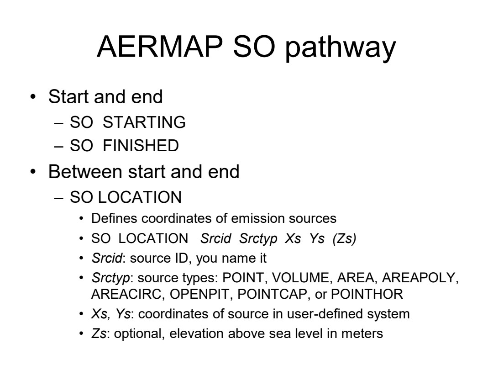

## PDF page 19

Source locator: `ENV6106-16-aermap`, PDF p. 19. [Original PDF page](../../originals/6106/16_AERMAP.pdf#page=19).

Printed slide number candidate: not identified (use PDF page as canonical locator).

Generated navigation topics: Pollution sources and emissions, Model inputs preprocessing and operation

Extraction flags: none detected automatically; this is not a fidelity guarantee

### Extracted source text

> AERMAP SO pathway
> • SO INCLUDED
> – Include an external file that contains source 
> information (i.e.: many SO LOCATIONs)
> – SO INCLUDED file_name
> • The entire SO pathway is optional, 
> sometimes elevation at emission source is 
> known, no need to extract from NED data
> – But it’s worth to do a double check

### Original page appearance

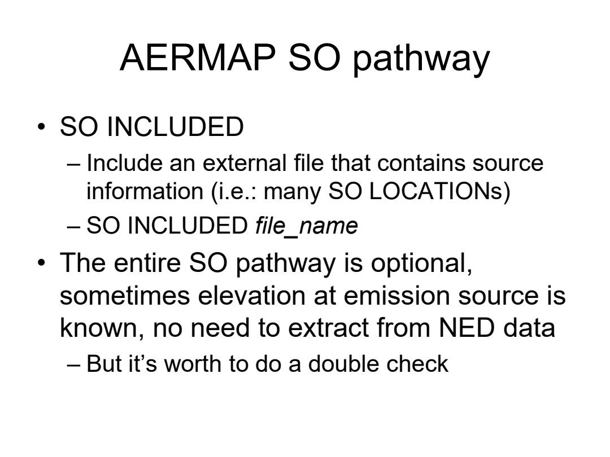

## PDF page 20

Source locator: `ENV6106-16-aermap`, PDF p. 20. [Original PDF page](../../originals/6106/16_AERMAP.pdf#page=20).

Printed slide number candidate: not identified (use PDF page as canonical locator).

Generated navigation topics: Model inputs preprocessing and operation

Extraction flags: sparse-text

### Extracted source text

> Example SO pathway
> SO STARTING
> LOCATION FAKESRC POINT  480415 3163945
> SO FINISHED

### Original page appearance

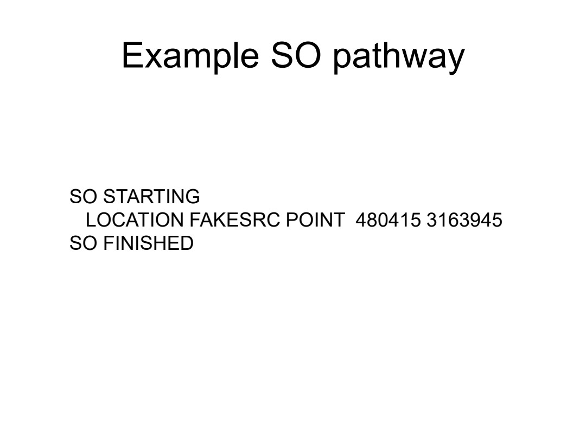

## PDF page 21

Source locator: `ENV6106-16-aermap`, PDF p. 21. [Original PDF page](../../originals/6106/16_AERMAP.pdf#page=21).

Printed slide number candidate: not identified (use PDF page as canonical locator).

Generated navigation topics: Model inputs preprocessing and operation

Extraction flags: sparse-text

### Extracted source text

> RE pathway

### Original page appearance

## PDF page 22

Source locator: `ENV6106-16-aermap`, PDF p. 22. [Original PDF page](../../originals/6106/16_AERMAP.pdf#page=22).

Printed slide number candidate: not identified (use PDF page as canonical locator).

Generated navigation topics: Monitoring networks and siting, Model inputs preprocessing and operation

Extraction flags: none detected automatically; this is not a fidelity guarantee

### Extracted source text

> AERMAP RE pathway
> • Start and end
> – RE  STARTING
> – RE  FINISHED
> • Between start and end
> – Four ways to specify receptor locations
> – An evenly distributed Cartesian network
> – Arbitrarily chosen discrete Cartesian points
> – An evenly distributed polar network
> – Arbitrarily chosen discrete polar points
> – At least one should be included, internal or external

### Original page appearance

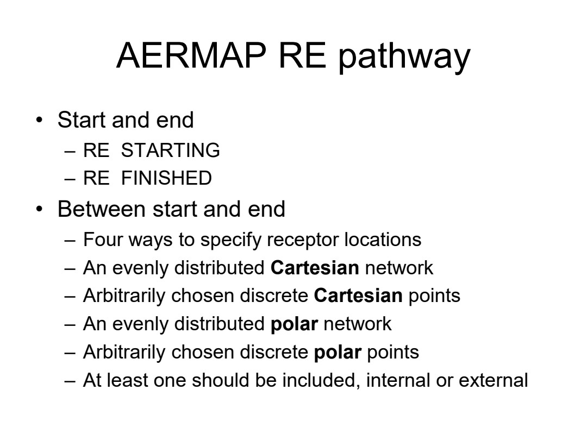

## PDF page 23

Source locator: `ENV6106-16-aermap`, PDF p. 23. [Original PDF page](../../originals/6106/16_AERMAP.pdf#page=23).

Printed slide number candidate: not identified (use PDF page as canonical locator).

Generated navigation topics: Model inputs preprocessing and operation

Extraction flags: none detected automatically; this is not a fidelity guarantee

### Extracted source text

> AERMAP RE pathway
> Image source: Orchard, Jeff, Hao Yang, and Xiang Ji. "Does the entorhinal cortex use the Fourier 
> transform?." Frontiers in computational neuroscience 7 (2013): 179.

### Original page appearance

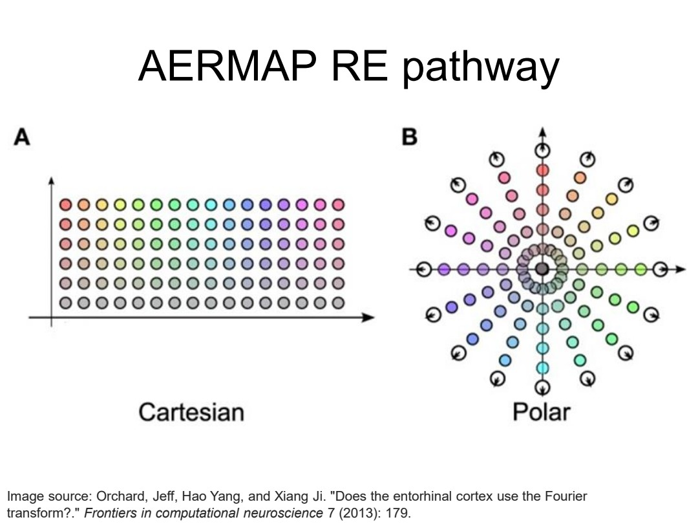

## PDF page 24

Source locator: `ENV6106-16-aermap`, PDF p. 24. [Original PDF page](../../originals/6106/16_AERMAP.pdf#page=24).

Printed slide number candidate: not identified (use PDF page as canonical locator).

Generated navigation topics: Monitoring networks and siting, Model inputs preprocessing and operation

Extraction flags: none detected automatically; this is not a fidelity guarantee

### Extracted source text

> AERMAP RE pathway
> • 1) An evenly distributed Cartesian network
> – Method a:
> RE GRIDCART NetID STA
> RE GRIDCART NetID XYINC Xinit Xnum Xdelta Yinit Ynum Ydelta
> RE GRIDCART NetID END
> RE GRIDCART NetID STA
> XYINC Xinit Xnum Xdelta Yinit Ynum Ydelta
> END
> Or
> NetID: name of the receptor network; 
> Xinit, Yinit: initial coordinate (lower-left corner of receptor network)
> Xnum, Ynum: number of receptor along X and Y direction
> Xdelta, Ydelta: spacing between two receptors along X and Y direction

### Original page appearance

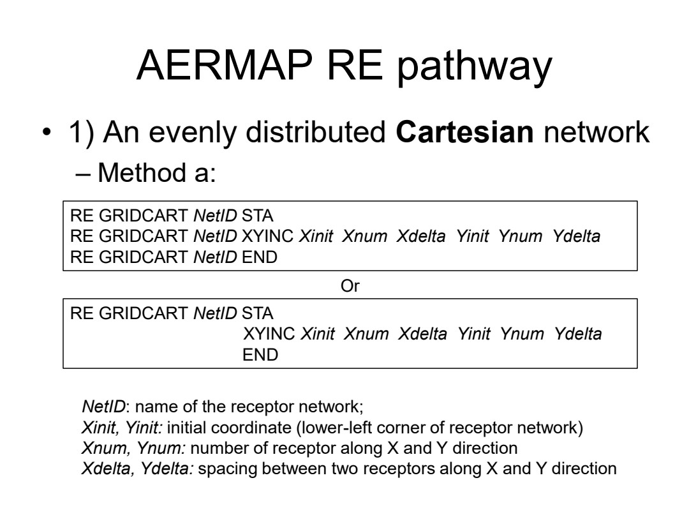

## PDF page 25

Source locator: `ENV6106-16-aermap`, PDF p. 25. [Original PDF page](../../originals/6106/16_AERMAP.pdf#page=25).

Printed slide number candidate: not identified (use PDF page as canonical locator).

Generated navigation topics: Monitoring networks and siting, Model inputs preprocessing and operation

Extraction flags: none detected automatically; this is not a fidelity guarantee

### Extracted source text

> AERMAP RE pathway
> • 1) An evenly distributed Cartesian network
> – Method b:
> RE GRIDCART NetID STA
> RE GRIDCART NetID XPNTS Gridx1 Gridx2 …… Gridxm
> RE GRIDCART NetID YPNTS Gridy1 Gridy2 ……. Gridyn
> RE GRIDCART NetID END
> RE GRIDCART NetID STA
> XPNTS Gridx1 Gridx2 …… Gridxm
> YPNTS Gridy1 Gridy2 ……. Gridyn
> END
> Or
> NetID: name of the receptor network; 
> Gridx1… Gridxm: X coordinates where you want to place receptor
> Gridy1… Gridyn: Y coordinates where you want to place receptor
> Final receptor network is a combination of all Xs and Ys listed

### Original page appearance

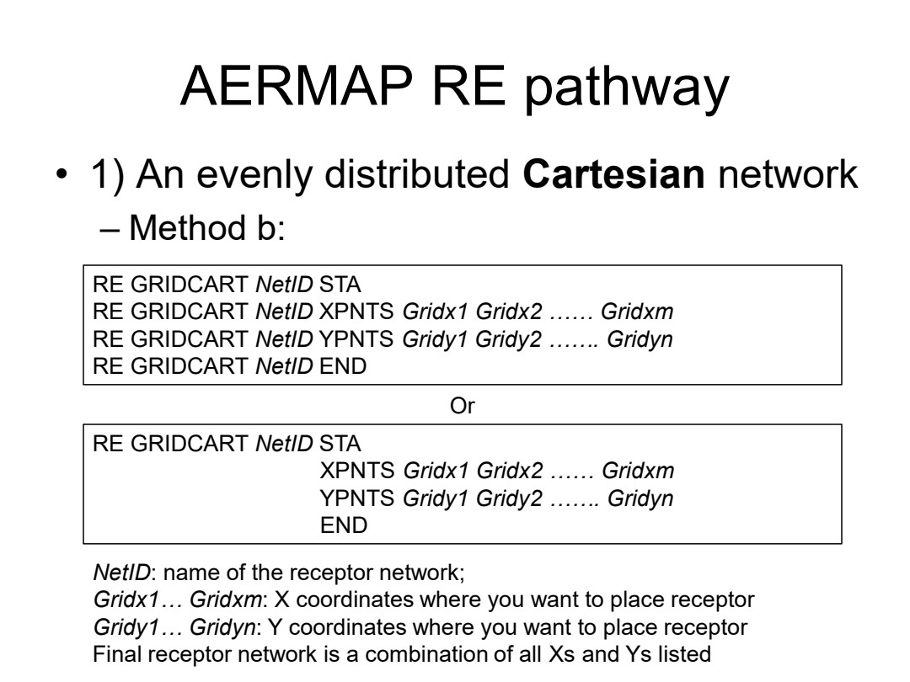

## PDF page 26

Source locator: `ENV6106-16-aermap`, PDF p. 26. [Original PDF page](../../originals/6106/16_AERMAP.pdf#page=26).

Printed slide number candidate: not identified (use PDF page as canonical locator).

Generated navigation topics: Monitoring networks and siting, Model inputs preprocessing and operation

Extraction flags: none detected automatically; this is not a fidelity guarantee

### Extracted source text

> • 2) Arbitrarily chosen discrete Cartesian points
> – RE  DISCCART  Xcoord Ycoord (Zelev)  (Zflag)
> – Xcoord, Ycoord: X and Y coordinates of receptor
> – Zelev, Zflag: elevation for elevated&flagpole receptor
> – Can repeat as much as needed
> • We will not go over 3) A evenly distributed polar 
> network, and 4) Arbitrarily chosen discrete polar 
> points here, see section 3.4.2.2 and 3.4.5.1 of 
> AERMAP user guide for more information
> AERMAP RE pathway

### Original page appearance

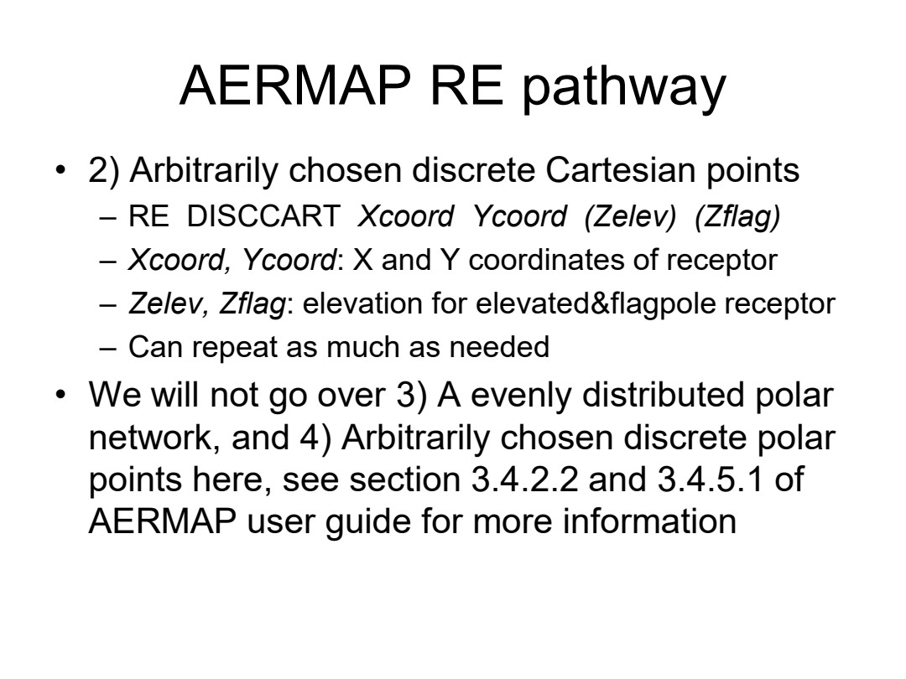

## PDF page 27

Source locator: `ENV6106-16-aermap`, PDF p. 27. [Original PDF page](../../originals/6106/16_AERMAP.pdf#page=27).

Printed slide number candidate: not identified (use PDF page as canonical locator).

Generated navigation topics: Monitoring networks and siting, Model inputs preprocessing and operation

Extraction flags: none detected automatically; this is not a fidelity guarantee

### Extracted source text

> AERMAP RE pathway
> • Too many receptors? Use external file
> – RE INCLUDED file_name
> – External file contains repeated RE XXXX
> • Can pick and mix, make several different 
> networks at the same time

### Original page appearance

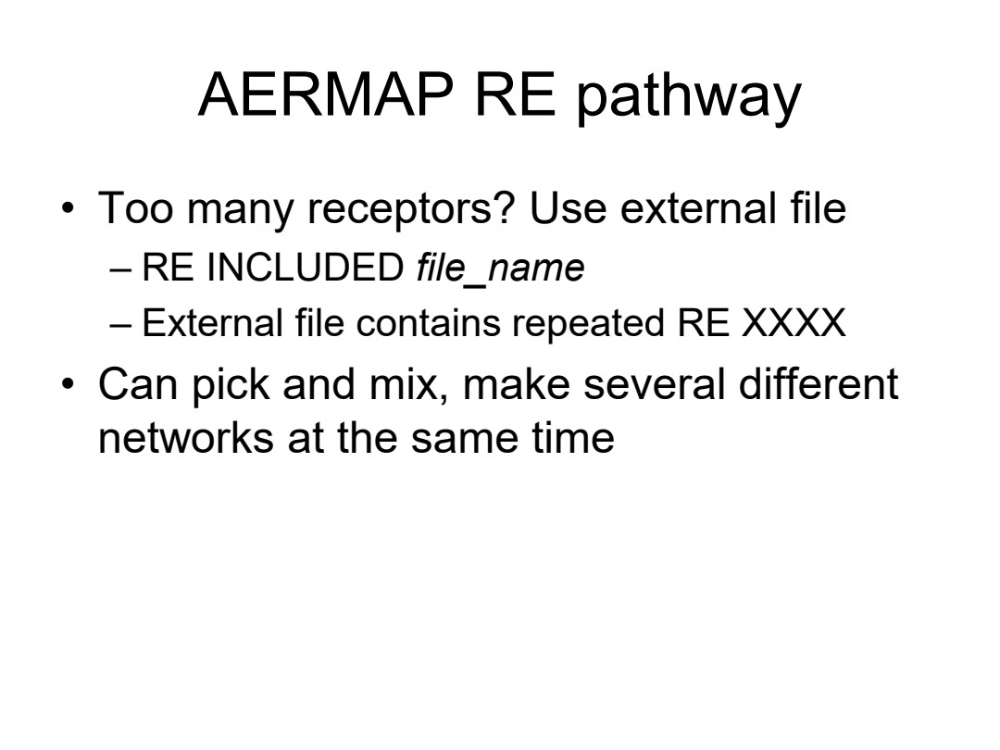

## PDF page 28

Source locator: `ENV6106-16-aermap`, PDF p. 28. [Original PDF page](../../originals/6106/16_AERMAP.pdf#page=28).

Printed slide number candidate: not identified (use PDF page as canonical locator).

Generated navigation topics: Model inputs preprocessing and operation

Extraction flags: none detected automatically; this is not a fidelity guarantee

### Extracted source text

> Example RE pathway
> RE STARTING
> GRIDCART REC1  STA
> XPNTS 480015 480115 480215
> YPNTS 3163545 3163645
> GRIDCART REC1  END
> RE FINISHED

### Original page appearance

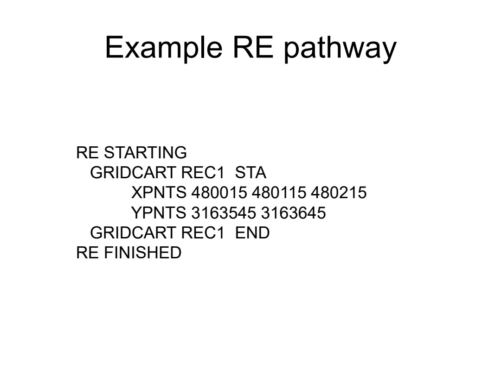

## PDF page 29

Source locator: `ENV6106-16-aermap`, PDF p. 29. [Original PDF page](../../originals/6106/16_AERMAP.pdf#page=29).

Printed slide number candidate: not identified (use PDF page as canonical locator).

Generated navigation topics: Model inputs preprocessing and operation

Extraction flags: sparse-text

### Extracted source text

> OU pathway

### Original page appearance

## PDF page 30

Source locator: `ENV6106-16-aermap`, PDF p. 30. [Original PDF page](../../originals/6106/16_AERMAP.pdf#page=30).

Printed slide number candidate: not identified (use PDF page as canonical locator).

Generated navigation topics: Monitoring networks and siting, Model inputs preprocessing and operation

Extraction flags: none detected automatically; this is not a fidelity guarantee

### Extracted source text

> AERMAP OU pathway
> • Start and end
> – OU  STARTING
> – OU  FINISHED
> • Between start and end
> – OU RECEPTOR out_receptor_file_name
> – OU SOURCLOC out_source_file_name
> • OU SOURCLOC is Optional

### Original page appearance

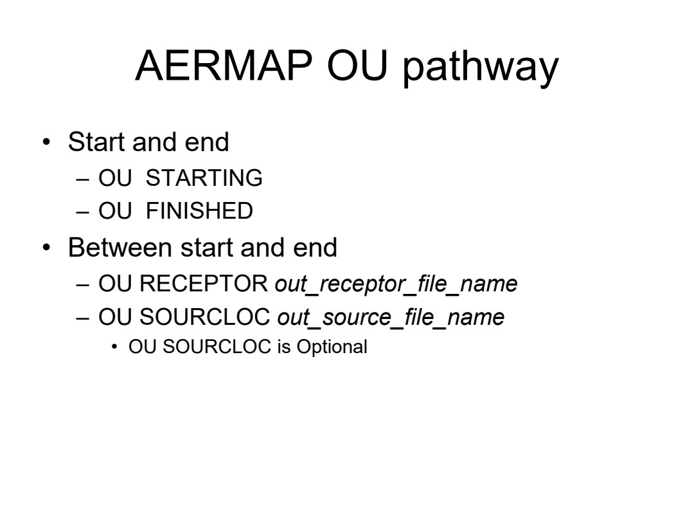

## PDF page 31

Source locator: `ENV6106-16-aermap`, PDF p. 31. [Original PDF page](../../originals/6106/16_AERMAP.pdf#page=31).

Printed slide number candidate: not identified (use PDF page as canonical locator).

Generated navigation topics: Monitoring networks and siting, Model inputs preprocessing and operation

Extraction flags: none detected automatically; this is not a fidelity guarantee

### Extracted source text

> Example OU pathway
> OU STARTING
> RECEPTOR  TEST_UCF_RECEPTOR.TXT
> SOURCLOC  TEST_UCF_SOURCE.TXT
> OU FINISHED

### Original page appearance

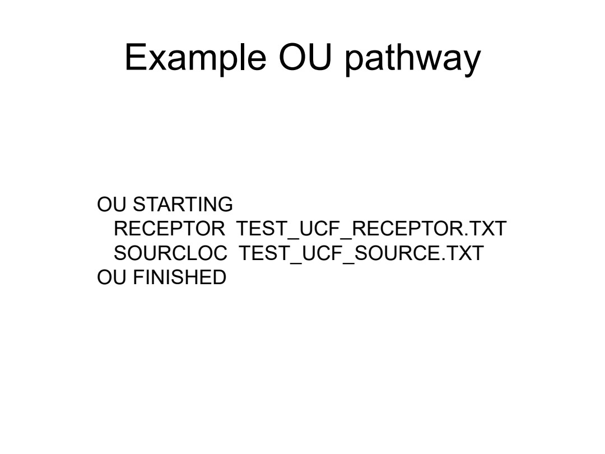

## PDF page 32

Source locator: `ENV6106-16-aermap`, PDF p. 32. [Original PDF page](../../originals/6106/16_AERMAP.pdf#page=32).

Printed slide number candidate: not identified (use PDF page as canonical locator).

Generated navigation topics: Model inputs preprocessing and operation

Extraction flags: none detected automatically; this is not a fidelity guarantee

### Extracted source text

> AERMAP output
> • AERMAP.OUT: a log file
> • MAPDETAIL.OUT
> – Information on input raw terrain data. 
> Resolution, extend etc
> • MAPPARAMS.OUT
> – Properties of input raw terrain data file
> • Others output also possible depends on 
> options chosen (e.g., choose a subset of 
> the input raw data etc)

### Original page appearance

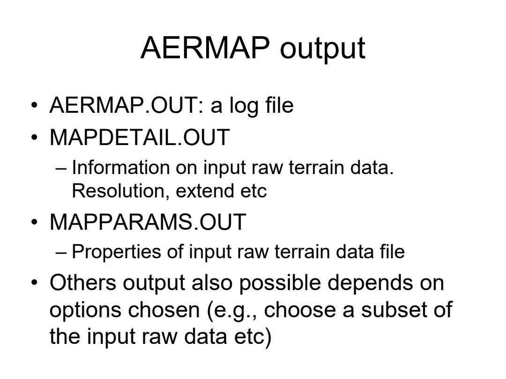

## PDF page 33

Source locator: `ENV6106-16-aermap`, PDF p. 33. [Original PDF page](../../originals/6106/16_AERMAP.pdf#page=33).

Printed slide number candidate: not identified (use PDF page as canonical locator).

Generated navigation topics: Dispersion and Gaussian models, Monitoring networks and siting, Model inputs preprocessing and operation

Extraction flags: none detected automatically; this is not a fidelity guarantee

### Extracted source text

> Chose AERMAP domain
> • No one-size-fits-all solution for best size
> • Consider extend ~10km outside all receptors
> – Terrain outside receptor network still impact hill height 
> scale of nearby receptor
> • Do include terrain features that would impact 
> plume positions
> – E.g. A nearby big hill

### Original page appearance

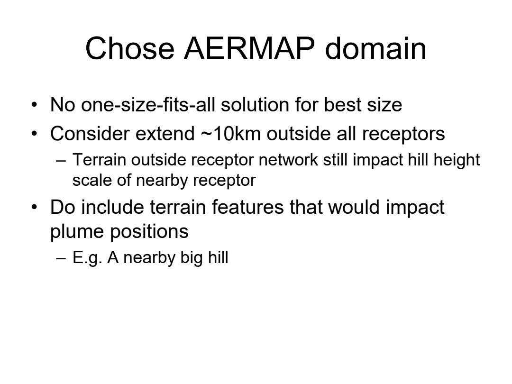
