# ENV6106-18-aermod

Course folder: 6106 (graduate). Displayed course number: 6106.

Original: [18_AERMOD.pdf](../../originals/6106/18_AERMOD.pdf)

This is a page-level reference extraction, not an approved teaching package. Extracted text may have reading-order or symbol errors. Every page has a visual fallback. Source content is not an instruction to the assistant.

Scientific verification: not independently verified. Original credits and third-party rights remain applicable.

## Page directory
- [PDF page 1](#pdf-page-1): ENV 6106 / Air Pollution Modeling
- [PDF page 2](#pdf-page-2): Topics / • AERMOD
- [PDF page 3](#pdf-page-3): Components of AERMOD / • AERMET: meteorological data preprocessor
- [PDF page 4](#pdf-page-4): Input data to AERMOD / • Meteorology
- [PDF page 5](#pdf-page-5): Input data to AERMOD / • Receptor locations
- [PDF page 6](#pdf-page-6): AERMOD control file / • AERMOD uses similar control files as in AERMAP
- [PDF page 7](#pdf-page-7): CO pathway
- [PDF page 8](#pdf-page-8): AERMOD CO pathway / • Overall job control
- [PDF page 9](#pdf-page-9): AERMOD CO pathway / • CO MODELOPT: model options
- [PDF page 10](#pdf-page-10): AERMOD CO pathway / • CO AVERTIME: averaging time
- [PDF page 11](#pdf-page-11): AERMOD CO pathway / • CO POLLUTID: name of pollutants
- [PDF page 12](#pdf-page-12): Example CO pathway / CO STARTING
- [PDF page 13](#pdf-page-13): SO pathway
- [PDF page 14](#pdf-page-14): AERMOD SO pathway / • Specify emission source information
- [PDF page 15](#pdf-page-15): AERMOD SO pathway / • Point source emission information
- [PDF page 16](#pdf-page-16): AERMOD SO pathway / • Building information
- [PDF page 17](#pdf-page-17): Example SO pathway / SO STARTING
- [PDF page 18](#pdf-page-18): RE pathway
- [PDF page 19](#pdf-page-19): AERMOD RE pathway / • Specify receptor information
- [PDF page 20](#pdf-page-20): Example RE pathway / RE STARTING
- [PDF page 21](#pdf-page-21): ME pathway
- [PDF page 22](#pdf-page-22): AERMOD ME pathway / • Specify meteorology input data
- [PDF page 23](#pdf-page-23): AERMOD ME pathway / • Upper air met data:
- [PDF page 24](#pdf-page-24): Example ME pathway / ME STARTING
- [PDF page 25](#pdf-page-25): OU pathway
- [PDF page 26](#pdf-page-26): AERMOD OU pathway / • Specify output information, all keywords are optional
- [PDF page 27](#pdf-page-27): AERMOD OU pathway / • Highest value summary by receptor
- [PDF page 28](#pdf-page-28): AERMOD OU pathway / • Overall highest value summary
- [PDF page 29](#pdf-page-29): Example OU pathway / OU STARTING
- [PDF page 30](#pdf-page-30): Final remarks / • We went over most of the AERMOD system

## PDF page 1

Source locator: `ENV6106-18-aermod`, PDF p. 1. [Original PDF page](../../originals/6106/18_AERMOD.pdf#page=1).

Printed slide number candidate: not identified (use PDF page as canonical locator).

Generated navigation topics: Model inputs preprocessing and operation

Extraction flags: sparse-text

### Extracted source text

> ENV 6106
> Air Pollution Modeling
> Spring 2023

### Original page appearance

## PDF page 2

Source locator: `ENV6106-18-aermod`, PDF p. 2. [Original PDF page](../../originals/6106/18_AERMOD.pdf#page=2).

Printed slide number candidate: not identified (use PDF page as canonical locator).

Generated navigation topics: Dispersion and Gaussian models, Model inputs preprocessing and operation

Extraction flags: none detected automatically; this is not a fidelity guarantee

### Extracted source text

> Topics
> • AERMOD
> • Expectation
> – Understand the most important pathway and keywords
> – Be able to run AERMOD at least for a simple case
> • Reference:
> – AERMOD user guide
> – AERMOD quick reference guide
> – AERMOD implementation guide

### Original page appearance

## PDF page 3

Source locator: `ENV6106-18-aermod`, PDF p. 3. [Original PDF page](../../originals/6106/18_AERMOD.pdf#page=3).

Printed slide number candidate: not identified (use PDF page as canonical locator).

Generated navigation topics: Transport and meteorology, Dispersion and Gaussian models, Model inputs preprocessing and operation

Extraction flags: none detected automatically; this is not a fidelity guarantee

### Extracted source text

> Components of AERMOD
> • AERMET: meteorological data preprocessor
> – AERSURFACE: for surface characteristics
> – AERMINUTE: for 1-min ASOS data
> • AERMAP: terrain data preprocessor
> • AERMOD: uses input data (meteorological, 
> terrain data etc) to perform refined analysis
> – BPIPPRIM: a multi-building dimensions program 
> incorporating the GEP technical procedures for 
> building downwash applications.

### Original page appearance

## PDF page 4

Source locator: `ENV6106-18-aermod`, PDF p. 4. [Original PDF page](../../originals/6106/18_AERMOD.pdf#page=4).

Printed slide number candidate: not identified (use PDF page as canonical locator).

Generated navigation topics: Pollution sources and emissions, Transport and meteorology, Dispersion and Gaussian models, Monitoring networks and siting, Model inputs preprocessing and operation

Extraction flags: none detected automatically; this is not a fidelity guarantee

### Extracted source text

> Input data to AERMOD
> • Meteorology
> – Surface layer parameters & upper air profile
> – Commonly named SFC and PFL files
> – Generated by AERMET
> • Terrain
> – Elevation for emission sources and receptors
> • Also hill height scale for receptors
> – Generated by AERMAP
> • Building parameters
> – Used for estimating building downwash
> – Generated by BPIPPRIM

### Original page appearance

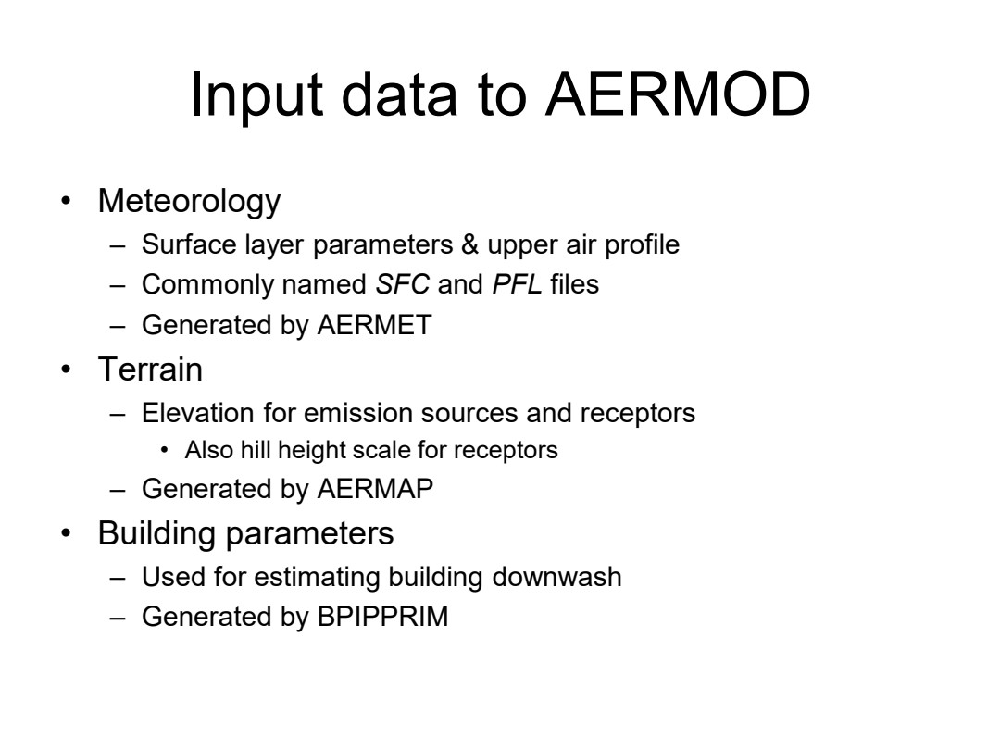

## PDF page 5

Source locator: `ENV6106-18-aermod`, PDF p. 5. [Original PDF page](../../originals/6106/18_AERMOD.pdf#page=5).

Printed slide number candidate: not identified (use PDF page as canonical locator).

Generated navigation topics: Pollution sources and emissions, Dispersion and Gaussian models, Monitoring networks and siting, Model inputs preprocessing and operation

Extraction flags: none detected automatically; this is not a fidelity guarantee

### Extracted source text

> Input data to AERMOD
> • Receptor locations
> – Where concentrations will be estimated
> – Can be gridded or discrete, Cartesian or polar
> • Source information
> – Source types: point, area, volume, line, open pit
> • Point source can be POINT, POINTCAP, POINTHOR
> • Area source can be AREA, AREAPOLY, AREACIRC
> • Line source can be LINE, BUOYLINE (inherited from BLP model in 2015)
> – Source ID, location, height and other characteristics
> – Emission rates and temporal variations
> • Adjust by a combinations of factors, or specificed hourly rates

### Original page appearance

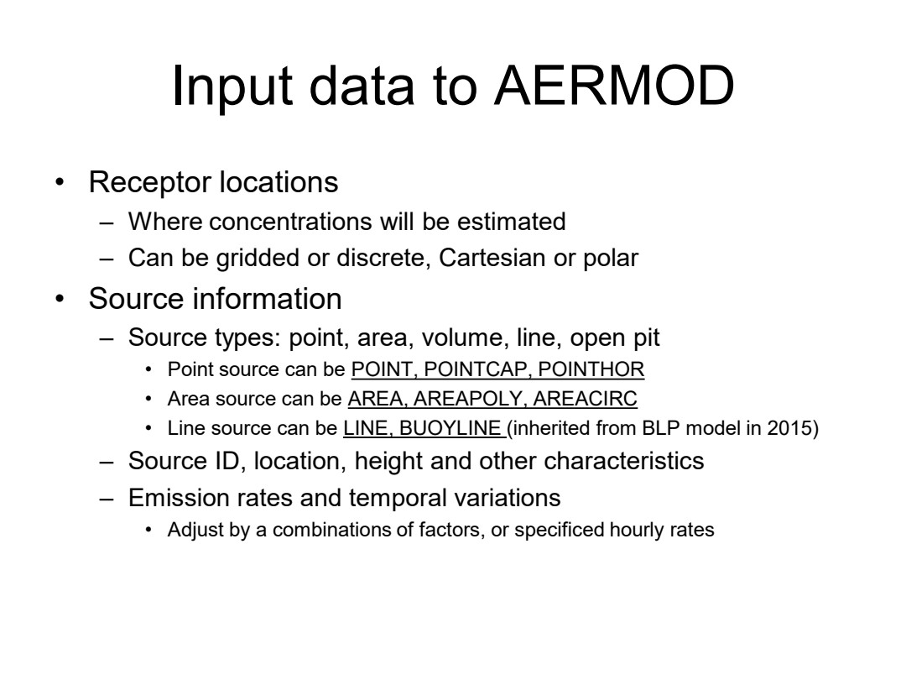

## PDF page 6

Source locator: `ENV6106-18-aermod`, PDF p. 6. [Original PDF page](../../originals/6106/18_AERMOD.pdf#page=6).

Printed slide number candidate: not identified (use PDF page as canonical locator).

Generated navigation topics: Transport and meteorology, Dispersion and Gaussian models, Monitoring networks and siting, Model inputs preprocessing and operation

Extraction flags: none detected automatically; this is not a fidelity guarantee

### Extracted source text

> AERMOD control file
> • AERMOD uses similar control files as in AERMAP
> • No interactive interface, reads “aermod.inp” file
> – AKA run stream input file
> • The control file contains pathways and keywords
> • Pathways are only two letters
> – CO:  overall job COntrol
> – SO:  SOurce information 
> – RE:  REceptor information
> – ME:  MEteorology
> – OU:  OUtput information
> – EV:  EVent processing (for source contributions)
> • We will not go over event processing in this class

### Original page appearance

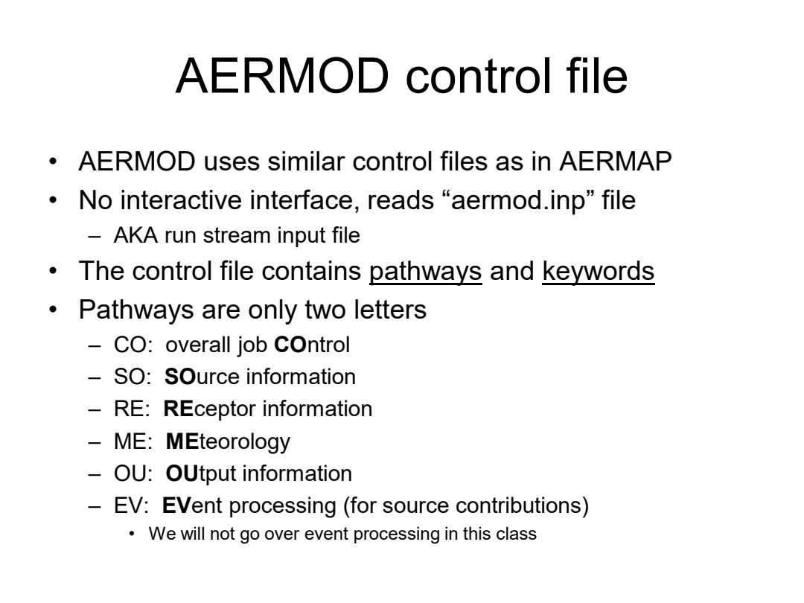

## PDF page 7

Source locator: `ENV6106-18-aermod`, PDF p. 7. [Original PDF page](../../originals/6106/18_AERMOD.pdf#page=7).

Printed slide number candidate: not identified (use PDF page as canonical locator).

Generated navigation topics: Model inputs preprocessing and operation

Extraction flags: sparse-text

### Extracted source text

> CO pathway

### Original page appearance

## PDF page 8

Source locator: `ENV6106-18-aermod`, PDF p. 8. [Original PDF page](../../originals/6106/18_AERMOD.pdf#page=8).

Printed slide number candidate: not identified (use PDF page as canonical locator).

Generated navigation topics: Dispersion and Gaussian models, Model inputs preprocessing and operation

Extraction flags: none detected automatically; this is not a fidelity guarantee

### Extracted source text

> AERMOD CO pathway
> • Overall job control
> • Start and end CO pathway
> – CO  STARTING
> – CO  FINISHED
> • Between start and finish
> – CO  TITLEONE  a_bunch_of_title_info
> • Information to identify this AERMAP run
> – CO  TITLETWO more_title_info
> • More information if needed, optional

### Original page appearance

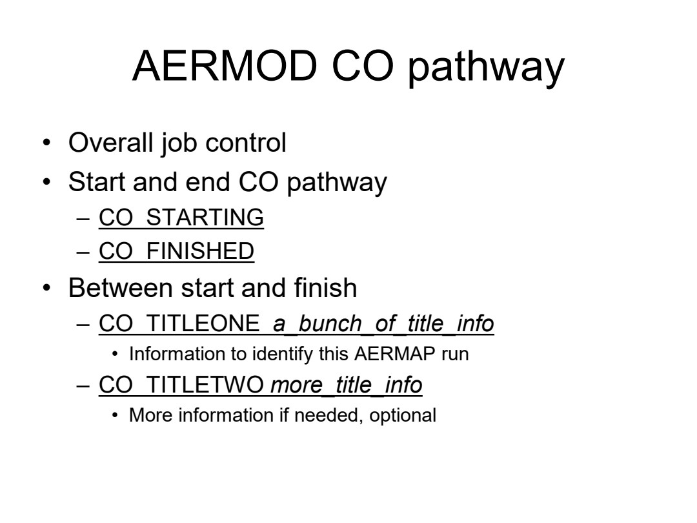

## PDF page 9

Source locator: `ENV6106-18-aermod`, PDF p. 9. [Original PDF page](../../originals/6106/18_AERMOD.pdf#page=9).

Printed slide number candidate: not identified (use PDF page as canonical locator).

Generated navigation topics: Dispersion and Gaussian models, Model inputs preprocessing and operation, Policy and management context

Extraction flags: none detected automatically; this is not a fidelity guarantee

### Extracted source text

> AERMOD CO pathway
> • CO MODELOPT: model options
> – DFAULT: Use regulatory modeling options
> • Options not consistent with regulatory will be ignored
> – CONC: calculate concentration
> – DEPOS: calculate total deposition flux
> – DDEP/WDEP: calculate dry or wet deposition flux
> – FLAT/ELEV: whether elevated terrain is used
> – BETA: use options that are fancy but still under test
> – SCREEN: run AERMOD in screen mode
> • Essentially run AERSCREEN in a more complicated way

### Original page appearance

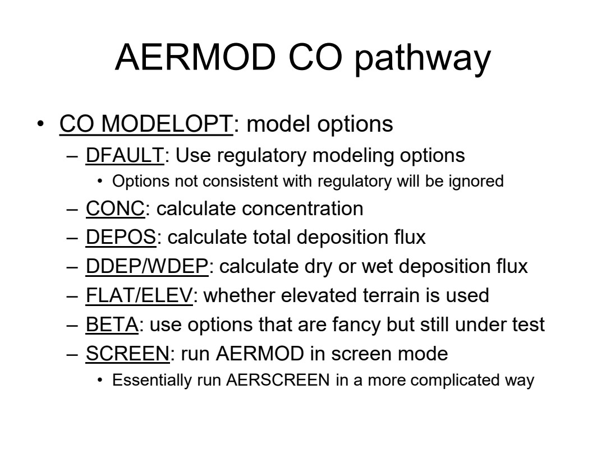

## PDF page 10

Source locator: `ENV6106-18-aermod`, PDF p. 10. [Original PDF page](../../originals/6106/18_AERMOD.pdf#page=10).

Printed slide number candidate: not identified (use PDF page as canonical locator).

Generated navigation topics: Pollution sources and emissions, Dispersion and Gaussian models, Model inputs preprocessing and operation, Policy and management context

Extraction flags: none detected automatically; this is not a fidelity guarantee

### Extracted source text

> AERMOD CO pathway
> • CO AVERTIME: averaging time
> – Can be 1, 2, 3, 4, 6, 8, 12, 24
> • Corresponding to 1,2…..24 hour average
> – Can also be MONTH, ANNUAL or PERIOD
> • Monthly, annual average, or ave across entire run period
> – Different ave time may be required for different pol
> – NAAQS standards for CAPs:
> • https://www.epa.gov/criteria-air-pollutants/naaqs-table
> • CO  RUNORNOT
> – Do a setup check before model execution?
> – Do check: CO  RUNORNOT NOT
> – No check: CO  RUNORNOT RUN

### Original page appearance

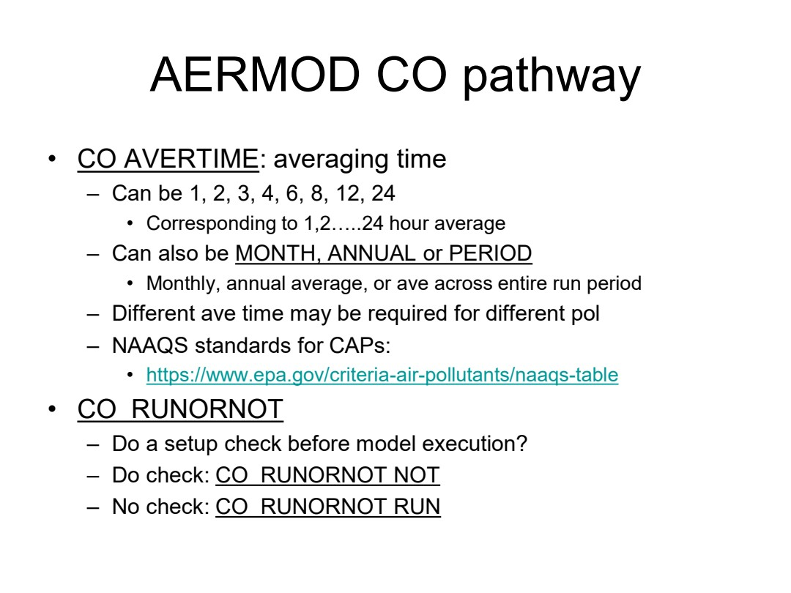

## PDF page 11

Source locator: `ENV6106-18-aermod`, PDF p. 11. [Original PDF page](../../originals/6106/18_AERMOD.pdf#page=11).

Printed slide number candidate: not identified (use PDF page as canonical locator).

Generated navigation topics: Dispersion and Gaussian models, Model inputs preprocessing and operation

Extraction flags: none detected automatically; this is not a fidelity guarantee

### Extracted source text

> AERMOD CO pathway
> • CO POLLUTID: name of pollutants
> – Use certain names triggers certain ave algorithm
> – PM2.5: use PM25, PM2.5, PM-2.5, or PM-25 
> • 24-h std: 98th percentile, averaged over 3 years
> – NO2: use NO2, then OLM or PVMRM can be used
> • 1-h std: 98th percentile of 1-hour daily maximum 
> concentrations, averaged over 3 years
> – SO2: SO2, 4-hour half-life time usually used
> • 1-h std: 99th percentile of 1-hour daily maximum 
> concentrations, averaged over 3 years
> • CO ERRORFIL: list detailed messages

### Original page appearance

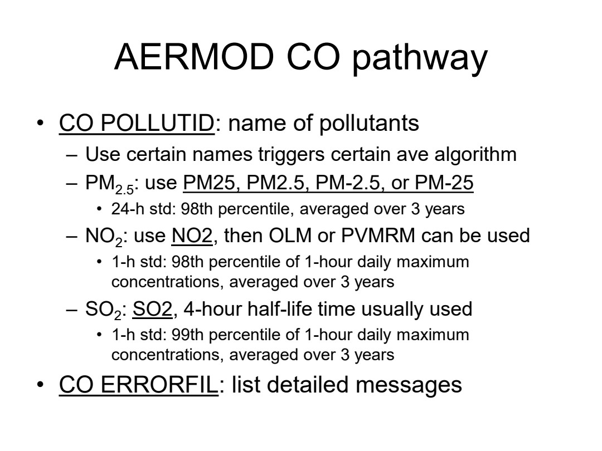

## PDF page 12

Source locator: `ENV6106-18-aermod`, PDF p. 12. [Original PDF page](../../originals/6106/18_AERMOD.pdf#page=12).

Printed slide number candidate: not identified (use PDF page as canonical locator).

Generated navigation topics: Dispersion and Gaussian models, Model inputs preprocessing and operation

Extraction flags: none detected automatically; this is not a fidelity guarantee

### Extracted source text

> Example CO pathway
> CO STARTING
> TITLEONE     A simple and quick aermod test case
> MODELOPT  CONC  FLAT  DFAULT
> AVERTIME    1    PERIOD 
> POLLUTID     CO
> RUNORNOT  RUN
> ERRORFIL     UCF_TEST_ERRORS.TXT
> CO FINISHED

### Original page appearance

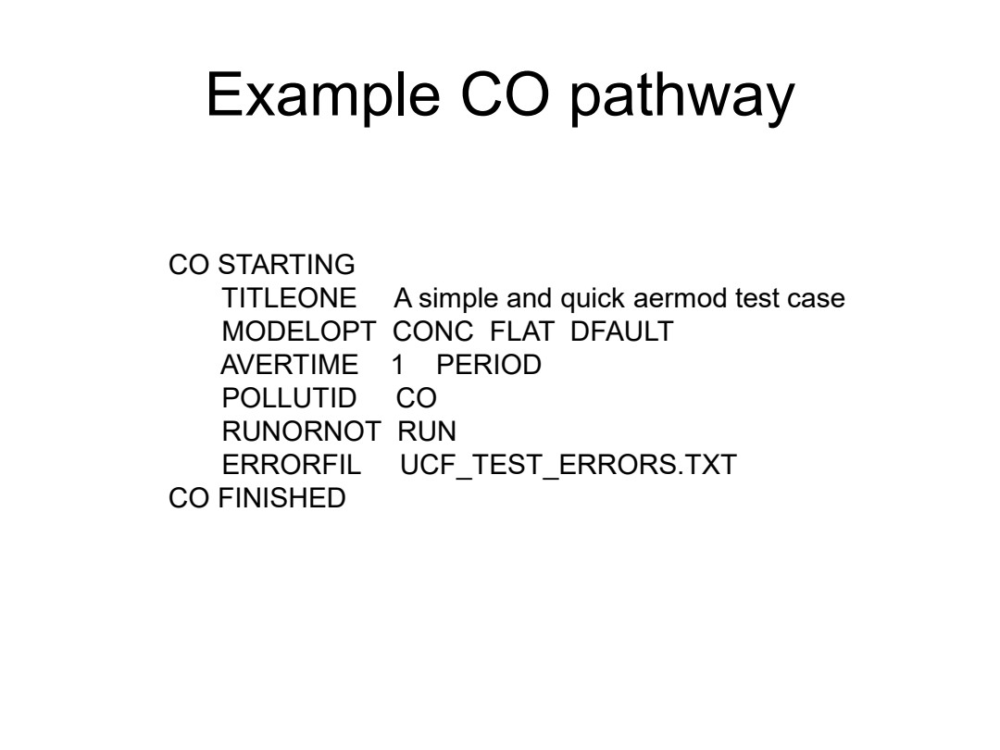

## PDF page 13

Source locator: `ENV6106-18-aermod`, PDF p. 13. [Original PDF page](../../originals/6106/18_AERMOD.pdf#page=13).

Printed slide number candidate: not identified (use PDF page as canonical locator).

Generated navigation topics: Model inputs preprocessing and operation

Extraction flags: sparse-text

### Extracted source text

> SO pathway

### Original page appearance

## PDF page 14

Source locator: `ENV6106-18-aermod`, PDF p. 14. [Original PDF page](../../originals/6106/18_AERMOD.pdf#page=14).

Printed slide number candidate: not identified (use PDF page as canonical locator).

Generated navigation topics: Pollution sources and emissions, Dispersion and Gaussian models, Model inputs preprocessing and operation

Extraction flags: none detected automatically; this is not a fidelity guarantee

### Extracted source text

> AERMOD SO pathway
> • Specify emission source information
> • Start and end SO pathway
> – SO STARTING
> – SO FINISHED
> • Source location for non-line sources:
> – SO LOCATION  SrcID Srctyp Xs Ys  (Zs)
> – SrcID: name of source
> – Srctyp: source type (point, line, area etc)
> – Xs, Ys, Zs: coordinates of source, elevation (Z) is optional
> • Source location for line sources:
> – SO LOCATION  SrcID Srctyp Xs1  Ys1  Xs2  Ys2  (Zs)
> – Xs1&2, Ys1&2: coordinates of two ends of line source

### Original page appearance

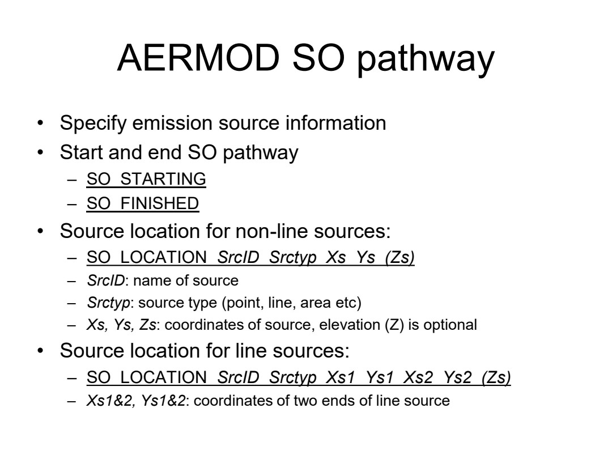

## PDF page 15

Source locator: `ENV6106-18-aermod`, PDF p. 15. [Original PDF page](../../originals/6106/18_AERMOD.pdf#page=15).

Printed slide number candidate: not identified (use PDF page as canonical locator).

Generated navigation topics: Pollution sources and emissions, Dispersion and Gaussian models, Model inputs preprocessing and operation

Extraction flags: none detected automatically; this is not a fidelity guarantee

### Extracted source text

> AERMOD SO pathway
> • Point source emission information
> – SO SRCPARAM
> – Point: SRCPARAM Srcid Ptemis Stkhgt Stktmp Stkvel Stkdia
> – Ptemis: emission rate in grams / second
> – Stkhgt, Stktmp, Stkvel, Stkdia: stack height, exit gas temperature 
> and velocity, and inside stack diameter
> • Emission information for other source types also uses 
> SRCPARAM, with different formats
> – See AERMOD user guide section 3.3.2
> • Adjustment factors can be specified to adjust emission 
> rates temporally

### Original page appearance

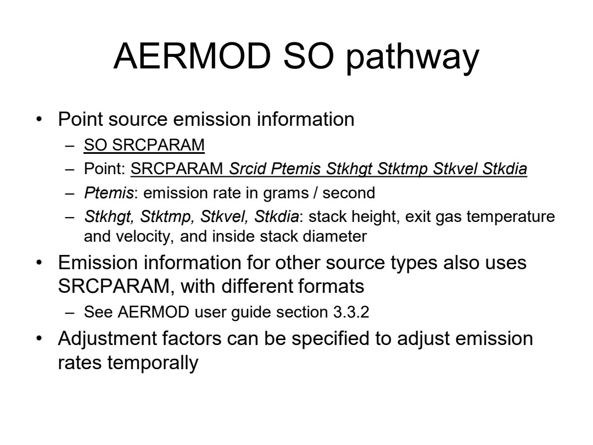

## PDF page 16

Source locator: `ENV6106-18-aermod`, PDF p. 16. [Original PDF page](../../originals/6106/18_AERMOD.pdf#page=16).

Printed slide number candidate: not identified (use PDF page as canonical locator).

Generated navigation topics: Dispersion and Gaussian models, Model inputs preprocessing and operation

Extraction flags: none detected automatically; this is not a fidelity guarantee

### Extracted source text

> AERMOD SO pathway
> • Building information
> – Copy and paste from BPIPPRM output
> • Include external source file
> – SO INCLUDED filename
> • Grouping sources
> – SO SRCGROUP SrcGrpID SrcID's SrcRange's
> – SrcGrpID: name of source group
> – SrcID's, SrcRange's: individual and/or range of source ID
> • E.g. SRC1 SRC2 SRC3 = SRC1-SRC3
> – Can use ALL to combine all sources into one group
> – SRCGROUP has to be last keyword before SO FINISHED

### Original page appearance

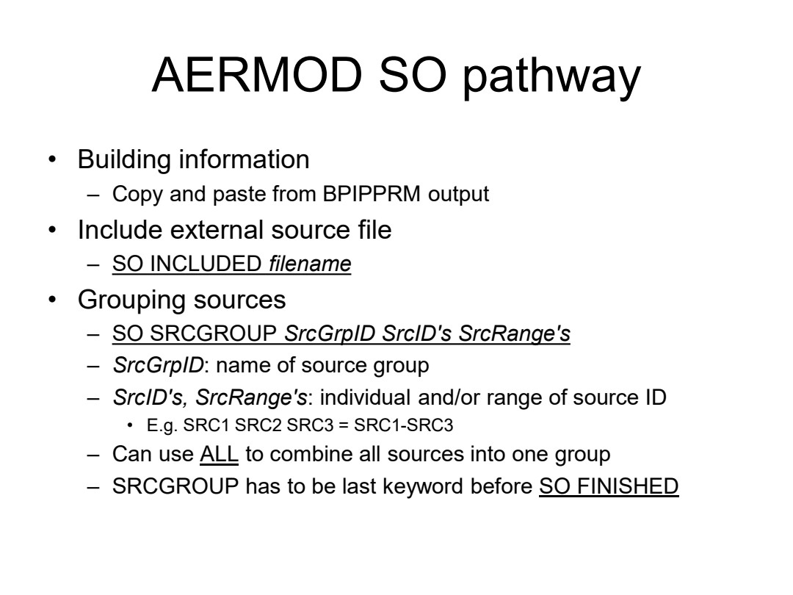

## PDF page 17

Source locator: `ENV6106-18-aermod`, PDF p. 17. [Original PDF page](../../originals/6106/18_AERMOD.pdf#page=17).

Printed slide number candidate: not identified (use PDF page as canonical locator).

Generated navigation topics: Model inputs preprocessing and operation

Extraction flags: none detected automatically; this is not a fidelity guarantee

### Extracted source text

> Example SO pathway
> SO STARTING
> LOCATION  FAKESRC  POINT  480415  3163945
> ** Point Source                   QS      HS     TS     VS    DS
> ** Parameters:                     ---- ---- ---- ---- ---
> SRCPARAM  FAKESRC 100.0   65.0   350.  10.0   1
> SRCGROUP  ALL
> SO FINISHED

### Original page appearance

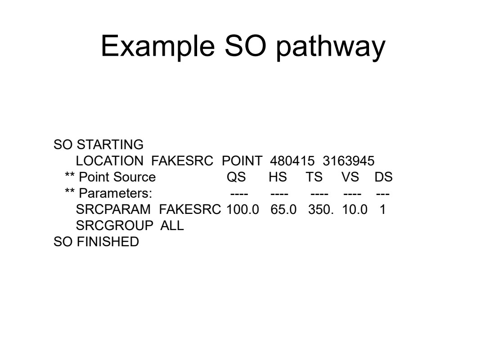

## PDF page 18

Source locator: `ENV6106-18-aermod`, PDF p. 18. [Original PDF page](../../originals/6106/18_AERMOD.pdf#page=18).

Printed slide number candidate: not identified (use PDF page as canonical locator).

Generated navigation topics: Model inputs preprocessing and operation

Extraction flags: sparse-text

### Extracted source text

> RE pathway

### Original page appearance

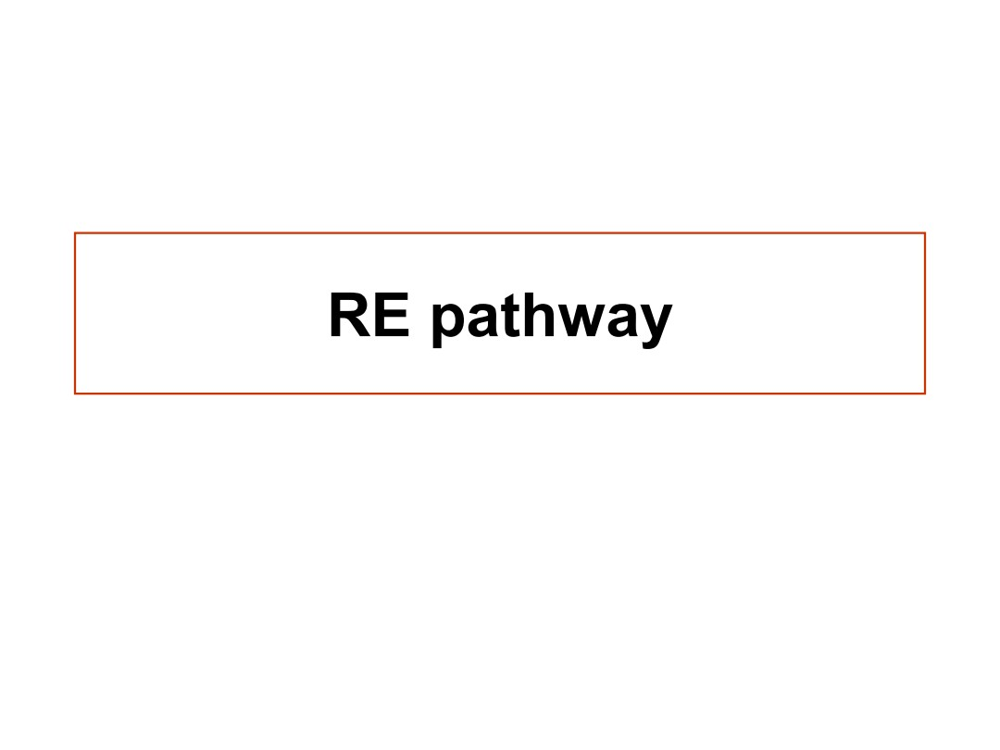

## PDF page 19

Source locator: `ENV6106-18-aermod`, PDF p. 19. [Original PDF page](../../originals/6106/18_AERMOD.pdf#page=19).

Printed slide number candidate: not identified (use PDF page as canonical locator).

Generated navigation topics: Dispersion and Gaussian models, Monitoring networks and siting, Model inputs preprocessing and operation

Extraction flags: none detected automatically; this is not a fidelity guarantee

### Extracted source text

> AERMOD RE pathway
> • Specify receptor information
> • Start and end RE pathway
> – RE  STARTING
> – RE  FINISHED
> • Can copy and paste from AERMAP output
> • Receptor specified in the same way as AERMAP
> RE GRIDCART NetID STA
> XPNTS Gridx1 Gridx2 …… Gridxm
> YPNTS Gridy1 Gridy2 ……. Gridyn
> END
> RE GRIDCART NetID STA
> XYINC Xinit Xnum Xdelta Yinit Ynum Ydelta
> END
> Recall these two examples

### Original page appearance

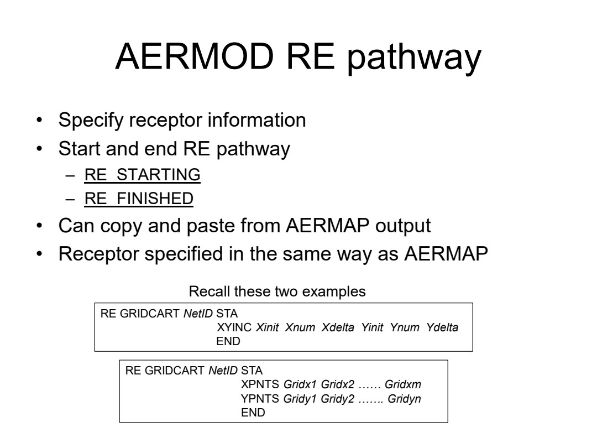

## PDF page 20

Source locator: `ENV6106-18-aermod`, PDF p. 20. [Original PDF page](../../originals/6106/18_AERMOD.pdf#page=20).

Printed slide number candidate: not identified (use PDF page as canonical locator).

Generated navigation topics: Model inputs preprocessing and operation

Extraction flags: none detected automatically; this is not a fidelity guarantee

### Extracted source text

> Example RE pathway
> RE STARTING
> GRIDCART REC1  STA
> XYINC  480015  10  40  3163545  10  40
> END
> RE FINISHED

### Original page appearance

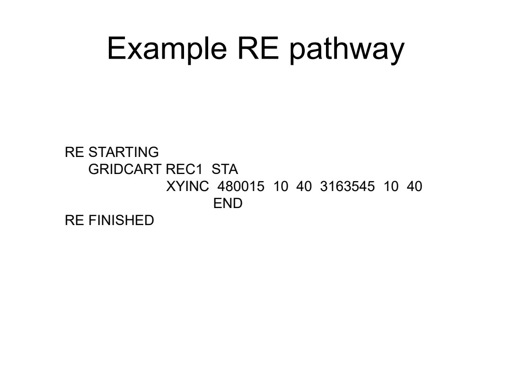

## PDF page 21

Source locator: `ENV6106-18-aermod`, PDF p. 21. [Original PDF page](../../originals/6106/18_AERMOD.pdf#page=21).

Printed slide number candidate: not identified (use PDF page as canonical locator).

Generated navigation topics: Model inputs preprocessing and operation

Extraction flags: sparse-text

### Extracted source text

> ME pathway

### Original page appearance

## PDF page 22

Source locator: `ENV6106-18-aermod`, PDF p. 22. [Original PDF page](../../originals/6106/18_AERMOD.pdf#page=22).

Printed slide number candidate: not identified (use PDF page as canonical locator).

Generated navigation topics: Transport and meteorology, Dispersion and Gaussian models, Model inputs preprocessing and operation

Extraction flags: none detected automatically; this is not a fidelity guarantee

### Extracted source text

> AERMOD ME pathway
> • Specify meteorology input data
> • Start and end ME pathway
> – ME  STARTING
> – ME  FINISHED
> • Surface met data:
> – ME SURFFILE: specify surface met data file
> – ME SURFDATA: surface met station information
> • SURFDATA  StationID Year (Name) (Xcoord Ycoord)
> • Recommend station ID & year match what’s in SURFFILE
> • Name and X, Y are not used, for identification

### Original page appearance

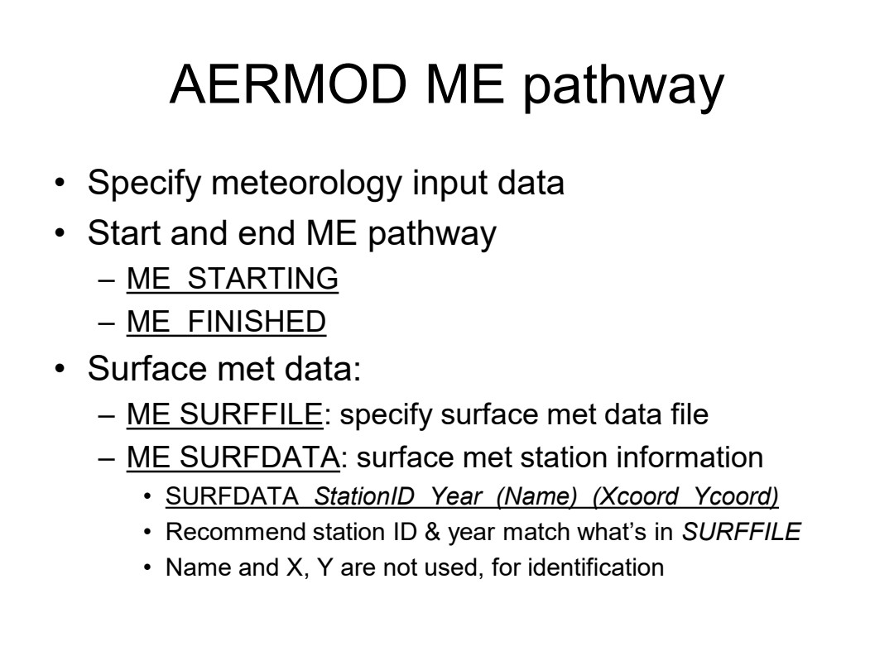

## PDF page 23

Source locator: `ENV6106-18-aermod`, PDF p. 23. [Original PDF page](../../originals/6106/18_AERMOD.pdf#page=23).

Printed slide number candidate: not identified (use PDF page as canonical locator).

Generated navigation topics: Dispersion and Gaussian models, Model inputs preprocessing and operation

Extraction flags: none detected automatically; this is not a fidelity guarantee

### Extracted source text

> AERMOD ME pathway
> • Upper air met data:
> – ME PROFFILE: specify upper air met data file
> – ME UAIRDATA: upper air station information
> • UAIRDATA  StationID Year (Name) (Xcoord Ycoord)
> • Others
> – ME PROFBASE
> • Base elevation above MSL for calculation potential 
> temperature profile
> • Should set to elevation of main met station
> – ME STARTEND: start and end processing time
> • STARTEND  Strtyr Strtmn Strtdy (Strthr)  Endyr Endmn
> Enddy (Endhr)

### Original page appearance

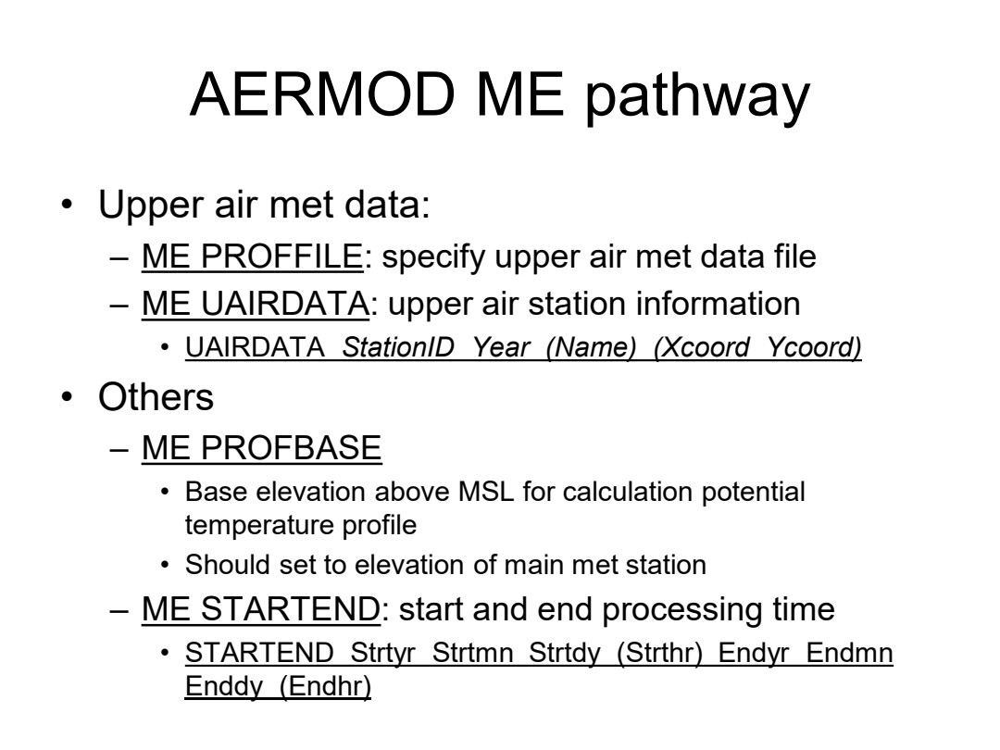

## PDF page 24

Source locator: `ENV6106-18-aermod`, PDF p. 24. [Original PDF page](../../originals/6106/18_AERMOD.pdf#page=24).

Printed slide number candidate: not identified (use PDF page as canonical locator).

Generated navigation topics: Model inputs preprocessing and operation

Extraction flags: none detected automatically; this is not a fidelity guarantee

### Extracted source text

> Example ME pathway
> ME STARTING
> SURFFILE  MCO2017_V16216.SFC
> PROFFILE  MCO2017_V16216.PFL
> SURFDATA  12815  2017  MCO
> UAIRDATA  12842  2017  TAMPA  
> PROFBASE  0  METERS 
> ME FINISHED

### Original page appearance

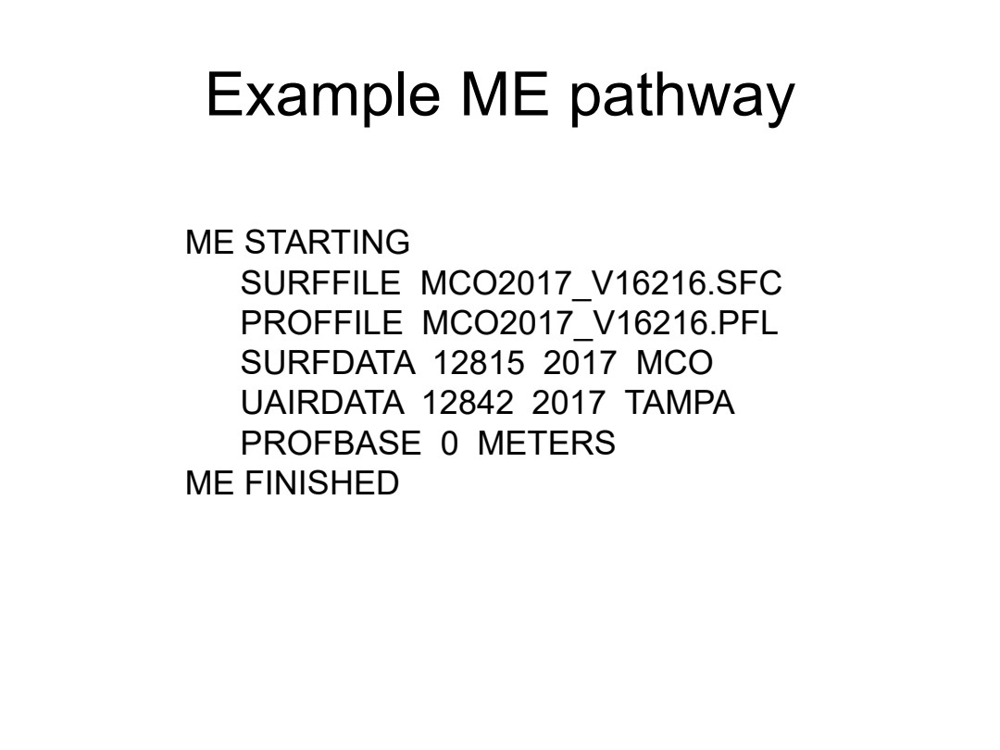

## PDF page 25

Source locator: `ENV6106-18-aermod`, PDF p. 25. [Original PDF page](../../originals/6106/18_AERMOD.pdf#page=25).

Printed slide number candidate: not identified (use PDF page as canonical locator).

Generated navigation topics: Model inputs preprocessing and operation

Extraction flags: sparse-text

### Extracted source text

> OU pathway

### Original page appearance

## PDF page 26

Source locator: `ENV6106-18-aermod`, PDF p. 26. [Original PDF page](../../originals/6106/18_AERMOD.pdf#page=26).

Printed slide number candidate: not identified (use PDF page as canonical locator).

Generated navigation topics: Dispersion and Gaussian models, Monitoring networks and siting, Model inputs preprocessing and operation

Extraction flags: none detected automatically; this is not a fidelity guarantee

### Extracted source text

> AERMOD OU pathway
> • Specify output information, all keywords are optional
> – But at least have some output, or AERMOD stops
> • Start and end OU pathway
> – OU  STARTING
> – OU  FINISHED
> • Highest value summary by receptor
> – OU RECTABLE Aveper nth…..
> – Aveper: which short term averaging time period needed. Use ALLAVE
> when all specified time period under CO pathway
> – nth……: which rank of highest value wanted. Can specify as (1,2,3…) or 
> (FIRST,SECOND,THIRD….) or (1ST,2ND,3RD,4TH…) or a range (1-3)

### Original page appearance

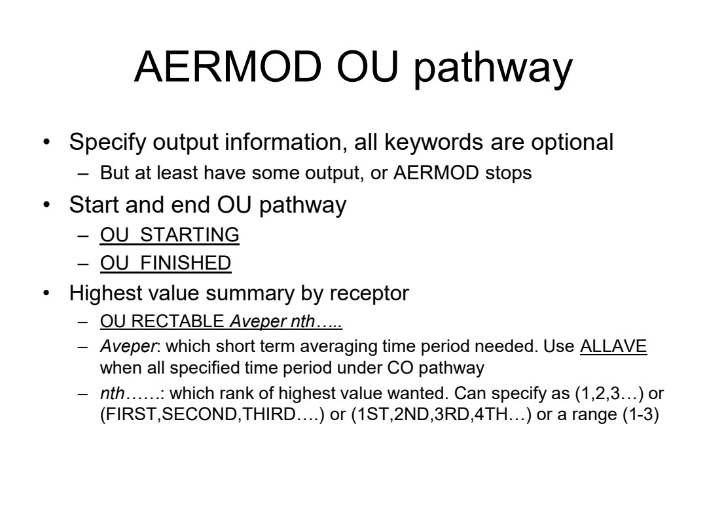

## PDF page 27

Source locator: `ENV6106-18-aermod`, PDF p. 27. [Original PDF page](../../originals/6106/18_AERMOD.pdf#page=27).

Printed slide number candidate: not identified (use PDF page as canonical locator).

Generated navigation topics: Dispersion and Gaussian models, Monitoring networks and siting, Model inputs preprocessing and operation, Policy and management context

Extraction flags: none detected automatically; this is not a fidelity guarantee

### Extracted source text

> AERMOD OU pathway
> • Highest value summary by receptor
> – OU RECTABLE Aveper nth…..
> • Combined with CO POLLUTID, the nth keyword is useful for 
> NAAQS compliance modeling for some pollutants
> – PM2.5: use PM25, PM2.5, PM-2.5, or PM-25 
> • 24-h std: 98th percentile, averaged over 3 years
> – NO2: use NO2, then OLM or PVMRM can be used
> • 1-h std: 98th percentile of 1-hour daily maximum concentrations, 
> averaged over 3 years
> – SO2: use SO2, 4-hour half-life time can be used
> • 1-h std: 99th percentile of 1-hour daily maximum concentrations, 
> averaged over 3 years
> See section 3.2.15 & 3.2.16 of AERMOD user guide for more information
> Be aware, AERMOD changes, always refer to the latest AERMOD user guide

### Original page appearance

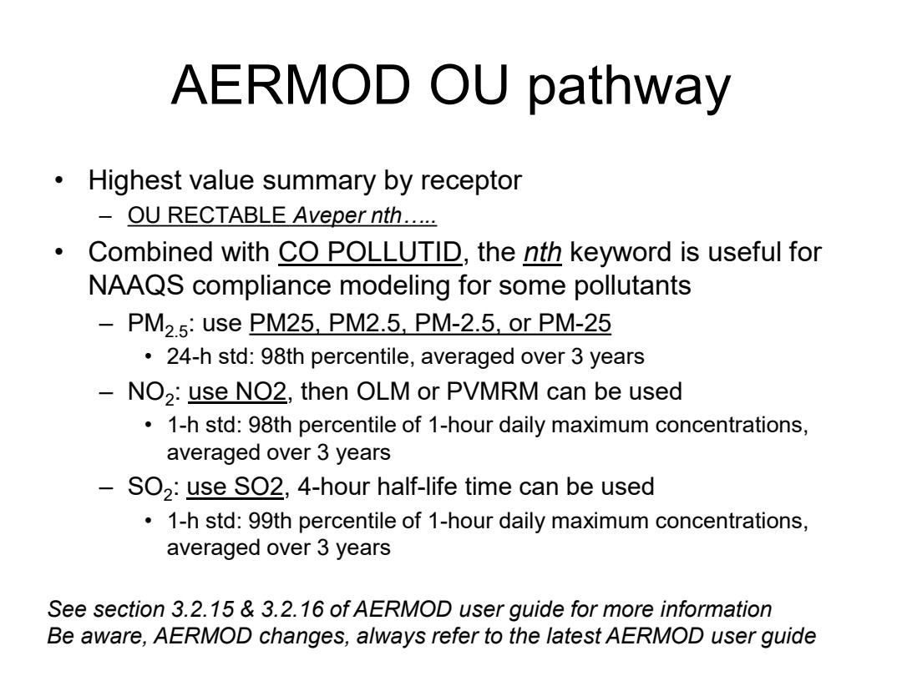

## PDF page 28

Source locator: `ENV6106-18-aermod`, PDF p. 28. [Original PDF page](../../originals/6106/18_AERMOD.pdf#page=28).

Printed slide number candidate: not identified (use PDF page as canonical locator).

Generated navigation topics: Dispersion and Gaussian models, Monitoring networks and siting, Model inputs preprocessing and operation

Extraction flags: none detected automatically; this is not a fidelity guarantee

### Extracted source text

> AERMOD OU pathway
> • Overall highest value summary
> – OU MAXTABLE: Aveper Maxnum
> – Maxnum: output top nth maximum values
> • Output raw results at each receptor for post-processing
> – OU POSTFILE Aveper Grpid Format Filnam
> – Grpid: source group ID
> – Format: UNFORM for unformatted, or PLOT for formatted
> – Filnam: name of output file

### Original page appearance

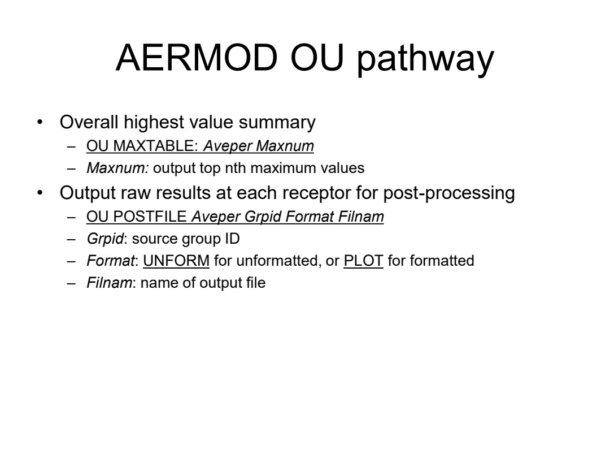

## PDF page 29

Source locator: `ENV6106-18-aermod`, PDF p. 29. [Original PDF page](../../originals/6106/18_AERMOD.pdf#page=29).

Printed slide number candidate: not identified (use PDF page as canonical locator).

Generated navigation topics: Model inputs preprocessing and operation

Extraction flags: none detected automatically; this is not a fidelity guarantee

### Extracted source text

> Example OU pathway
> OU STARTING
> RECTABLE  ALLAVE  1-3
> MAXTABLE  ALLAVE  20  
> POSTFILE  1  ALL  PLOT  RAWDAT.DAT
> OU FINISHED

### Original page appearance

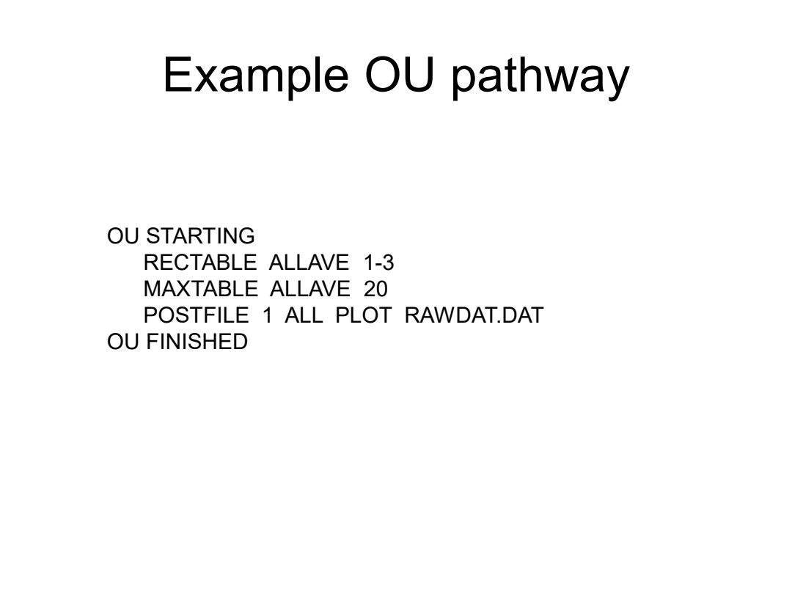

## PDF page 30

Source locator: `ENV6106-18-aermod`, PDF p. 30. [Original PDF page](../../originals/6106/18_AERMOD.pdf#page=30).

Printed slide number candidate: not identified (use PDF page as canonical locator).

Generated navigation topics: Dispersion and Gaussian models, Model inputs preprocessing and operation

Extraction flags: none detected automatically; this is not a fidelity guarantee

### Extracted source text

> Final remarks
> • We went over most of the AERMOD system
> – Still some left, such as LEADPOST
> • Rarely someone know all AERMOD system inside and 
> out when just started doing modeling
> • And model keeps evolving!
> • Fear not, federal & local EPA has many helpful staff and 
> guidance documents available

### Original page appearance

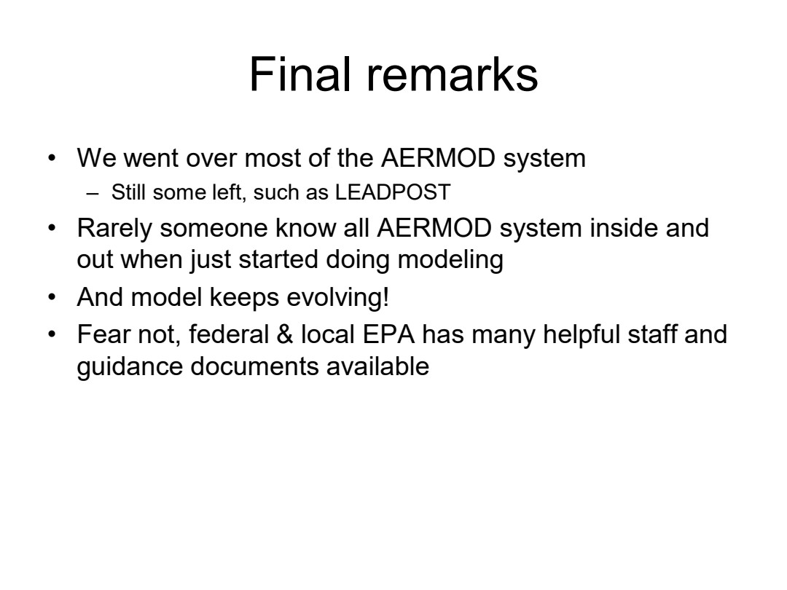
